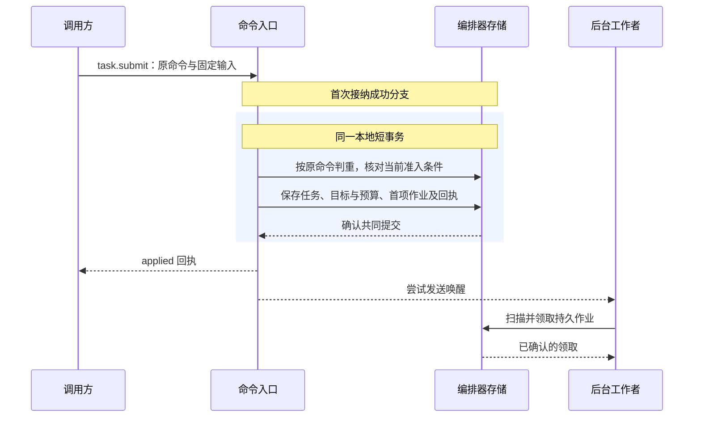
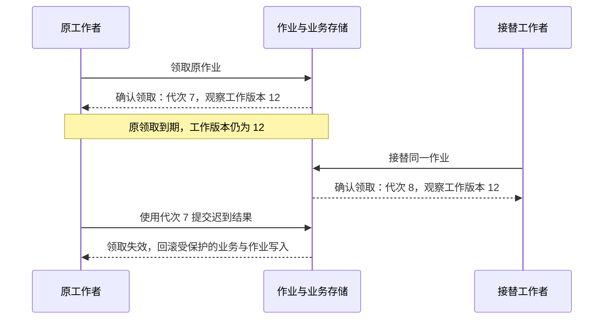
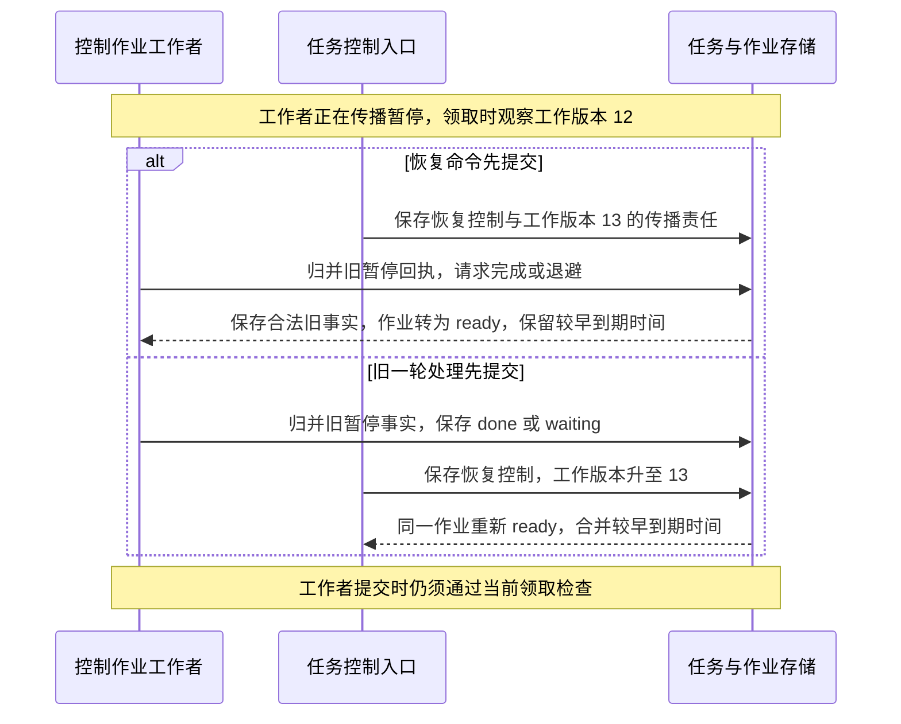

# 持久工作与恢复

宿主重启后先恢复原账本、控制与未决工作，再按下述就绪条件开放查询、恢复及新执行。原操作仍未知不妨碍获准查询，但会继续约束其关联资源与后续行动。

编排器将业务决定、原命令回执与必要的后续作业共同保存。进程退出、答复丢失或工作者接替后，恢复者从原记录继续处理；是否可以启动新工作，仍由当前目标、控制和原效果事实决定。

命令（Command）要求固定的负责方裁决一次业务变化。调用方在首次发送前固定命令标识、目标逻辑服务与完整输入；答复丢失后的重投仍对应同一次裁决。

| 对象 | 记录什么 | 恢复时如何继续 |
| --- | --- | --- |
| 命令（Command） | 一次业务请求及其裁决回执 | 查询原命令；需要重投时，保留原标识、目标与完整输入 |
| 操作（Operation） | 一次获准的有界行动及其效果事实 | 沿原操作核对结果；结果未知不能成为换一个操作重新执行的理由 |
| 作业（Job） | 某个领域对象尚需处理的一类后台责任 | 按稳定作业键领取和接替，保留与原命令、原操作的关联 |

例如，任务协调器准入一次报告写入时，固定操作、原执行命令与派发作业。派发答复丢失后，接替者读取作业中的原关联，查询同一命令和操作。作业本轮处理结束不表示任务完成；尚未核清的效果与费用仍由相应作业继续处理。

## 原账本恢复与入口就绪

启动先确认原数据库及当前写资格、支持的数据格式与旧写者隔离，再恢复原身份、关闭记录、控制、未结责任及待交回回执。随后核验准确 InstallLock 和当前批准，装载组件并取得本次实例的就绪依据，先开放允许的控制和恢复入口，容量足够后才接纳新任务。

数据库平台负责主写域及旧主隔离，应用的 Job 租约不能替代数据库选主。写资格、格式或锁检查失败时保持诊断与获准只读入口；不能用新空库、聊天历史或仅内存登记代替原账本。旧活动版本指针只说明应装载哪个版本，不能证明当前实例已经就绪。

| 入口 | 开放前提 | 前提不足时的行为 |
| --- | --- | --- |
| 诊断与原记录查询 | 原库格式可读，身份、当前披露权限及查询范围可核验 | 返回具体依赖或权限缺口；不把原负责方不可达解释为对象不存在 |
| 持久控制与原责任恢复 | 原写资格和旧写者隔离成立，控制及关闭记录可用，恢复处理器、时钟和收尾容量就绪 | 原记录可读时仍可查询；无法持久提交就不报告取消已保存。效果核对本身也须当前获准 |
| 新任务及新效果、费用启动 | 所需恢复入口具备能力，准确安装和批准有效，依赖、容量及具体行动门禁满足 | 报告不可用原因，不先接纳再期待后台补齐资格 |

就绪是原事实与本次实例配置的派生判断，不新增任务状态或全局服务。前提变化立即关闭受影响的新入口，已发生的效果继续沿原身份核对。恢复就绪只要求未决责任可定位、可领取且处理链已建立，不要求全部 unknown 和账务已清零；某个失联对象不阻塞无关的获准查询。

扫描使用未结索引、有限页及可恢复游标，覆盖终态后的效果、费用、控制与清理责任。不能为通过健康检查把责任标为 done，也不能要求每次启动遍历全部历史。冷恢复之后能否继续目标工作，另按[当前继续条件](task-lifecycle.md#bounded-progress)裁决；重新打开 Session 或恢复 Claim 都不替代这一检查。

迁移先核验准确步骤与格式兼容范围，以固定 migration_id 保存开始、检查点和完成。可原子提交的结构变更在本地事务内完成；内容重写产生不可变新版本，逐批提交映射，交接前保留所需旧版本。步骤中断沿原检查点恢复，不能重做未证明安全的外部调用；步骤完成但答复丢失时返回原结果，不重新生成一份数据。

### 本地与生产存储的耐久实现

PostgreSQL 与 SQLite 分别实现 repository、迁移、提交结果和 Job 领取，不共用一套未经验证的方言或并发假设。PostgreSQL 以行锁、条件更新及已确认的复制提交承载多进程接替；SQLite 单体采用 WAL、FULL、foreign_keys 和单写队列，并在支持的本机文件系统验证提交及在线备份。SQLite 宿主以覆盖生命周期的 OS 排他锁保护原库目录，不以旧 PID 文件自行接管，不开放多机共享目录写入。

数据库迁移作为独立管理动作取得互斥锁，核对准确制品和步骤后执行；不能由每个副本启动时自动迁移。原文件根或内容介质丢失时保持缺口，不能新建空目录伪装恢复。两种适配器都须验证事务未知、业务与 Job 共同提交及重启恢复；SQLite 用例通过不证明 PostgreSQL 多工作者竞争正确。

### 固定设备入口的恢复

设备发送入口默认固定在实际连接设备的宿主。所有可写驱动经过同一受信入口，以稳定设备身份取得 OS 排他锁，并在整个可发送期间持有；锁位置不能随容器、工作目录或进程编号变化。任务控制、资源代次及观察的关系见[设备占用与本人接管](task-lifecycle.md#resource-control)。

恢复顺序为取得设备锁 → 封闭或确认原本地发送者已退出 → 恢复原去重、取消及终态索引、TaskGate、资源 epoch 和 Attempt → 核对原在途操作 → 确认无迟到生效可能 → 新 acquire 和观察后开放合格动作。缺任一步时保持自动写隔离，保留获准控制、效果查询及只读核查。

OS 锁释放只说明原进程不再持锁，目标队列、驱动子进程及已提交动作仍需核对。同机锁不能隔离另一台机器上的旧发送者，因此云端实例失联或 Job 到期不触发设备自动跨宿主接管。更换物理宿主须先隔离原写入口、恢复完整状态并核清在途动作；目标能验证旧发送者失效的驱动，可另行验收自动接管能力。

## 命令接纳与提交结果

编排器按认证得到的租户、固定逻辑服务与 `command_id` 定位原命令，并保存完整请求的规范化摘要。同键同输入读取原决定；同键异输入返回 `idempotency_conflict`，不覆盖原记录。回执披露仍检查当前权限，恢复也不能把原命令改投另一编排器。

首次接纳 `task.submit` 时，命令入口先在事务外取得所需的策略与内容依据，再进入短事务。事务内核对当前准入条件，并共同保存 Task、目标与预算、首项作业以及 `applied` 回执。这里的 `applied` 表示任务已经建立，后续推进由持久作业承担。

事务不跨模型调用或外部执行。提交后的通知用于缩短等待，后台仍按到期时间独立扫描作业；通知丢失或入口进程退出，不消除已保存的责任。存储无法共同提交这些记录时，不接纳新的任务责任。

| 提交结论 | 可以确认什么 | 后续处理 |
| --- | --- | --- |
| 已确认提交（`Committed`） | 业务决定、原回执与必要作业已经保存 | 返回原决定；固定拒绝也属于已提交决定，不因条件恢复而改写 |
| 明确回滚（`RolledBack`） | 本次事务没有生效 | 明确的数据库竞争可有界重跑纯本地逻辑，重新检查当前条件；其他错误按原错误契约恢复 |
| 提交结果未知（`CommitUnknown`） | 是否提交尚无定论 | 查询原命令与对应业务记录；查清前不报告业务失败、不释放未知预留、不重做外部步骤 |

数据库重试保留原输入、首次接纳期限与 `expected_revision`。真实业务修订冲突应保存固定拒绝，不能通过替换预期修订让原命令继续执行。提交结果未知时，只有权威查询确认原提交不存在，且仍满足首次接纳条件，才可用原命令重新进入接纳事务。

## 外部发送前的持久屏障

内存已准备、存储接口接收写入、事务按声明模式耐久提交、外部入口可能越过，是四个不同的时点。只有原业务要求的提交已确认，且当前领取、控制、用途和实例资格仍有效，处理器才可跨越相应外部入口。

1. 在领域事务保存本次固定身份、准确输入、发送准备及后续核对责任，并使用同一个事务更新对应 Job。
2. 收到 `Committed` 才能继续；`RolledBack` 不提供启动资格；`CommitUnknown` 先查原命令或阶段，不能换身份补发。
3. 在事务外的真实入口重查仍须保持当前的资格，只发送已固定输入。租约失效、许可窗口过期或参数改变时不发送，原记录留给恢复处理器。
4. 外部答复、效果和费用沿原对象归并。通知、流片段、函数返回或传输 ACK 都不能代替领域成功点。

“提交已确认”采用存储适配器声明且经过验证的耐久模式，不能仅从 `write`、`append` 或 `flush` 的方法名推导。公共框架管理接纳、领取和交接，具体领域定义可能发送与安全恢复的界限：

| 原阶段 | 正常推进与中断处理 |
| --- | --- |
| Brain 已接纳、尚未准备调用 | 按原 Decision 固定配置及至多一个 ModelCall，保存准备责任；不得在构造适配器时隐式调用模型 |
| ModelCall 已准备、尚无 `send_started` | 读取原固定输入，完成最终编码和当前用途检查；发送门禁另行提交，确认后才允许原首次发送 |
| Brain 已有 `send_started` | 原 Decision 最多发送一次固定物理请求；结果未知时查询原供应方调用，不透明重发。无法查询则保留 `provider_result_unknown` 与费用责任 |
| Executor 已接纳、尚未准备 Attempt | 保存原尝试、目标关联、许可及核对责任，确认准备提交后才进入实际资源入口 |
| Executor 准备后中断 | 无法证明未交接时按可能发送处理，沿原 Operation／Attempt 查目标证据；能否安全重试由准确能力的重复、效果和费用合同裁决，不能套用 Brain 的阶段推断 |
| 输出或外部结果已经取得 | 固定原发布身份，需发布的字节先耐久再引用；正文保存失败与已发生效果分别记录。保存答复丢失查询原发布，不重新推理或执行来重造结果 |

同一领域阶段内的事实、费用和 Job 更新可以共同提交；真实有先后依赖的准备、发送和结果不能合成发送后的日志。独立 Grant owner 通过原 use_id 裁决和查询，未取得所有必要使用依据就不能发送。同一受信本地事务范围内的许可占用与启动登记，可按已声明合同共同提交，不要求每个模块单独增加一次事务。

模型的实际字段、完整处理来源、接收方与编码摘要由[固定决策输入](task-lifecycle.md#fixed-decision-input)规定；公共恢复层不从“没有答复”推导安全重发，也不通过改工具、改执行端或改操作 ID 绕过未知效果。

### 固定意图之后的驱动编码

带业务语义的候选变换按[统一行动准入](task-lifecycle.md#action-admission)完成。驱动内部的 prepareRequest 只执行已绑定的协议映射：方法、路径、参数位置、单位、日期、空值、正文及响应选择器均由准确版本决定。签名、时间和凭据可在原作用域内更新，但不能改变业务参数、目标、接收方或用途；恢复不要求重用过期签名。

| 阶段 | 必须检查与保存的事实 |
| --- | --- |
| 编码 | 从原 Invoke、准确 Content 和安装映射生成请求表示，计算尺寸并关联 Attempt；编码函数不发请求、不探测网络或调用额外工具／模型 |
| 完整请求核查 | 核对路径、查询、正文、附加字段、接收方及凭据作用域与原意图等价，固定声明内请求种类和剩余物理请求／字节／费用范围 |
| 耐久准备与入口门禁 | 共同保存 Attempt、目标关联和核对责任；实际入口复查 TaskGate、原 use、已知撤权、资源、期限及安装资格，提交未知先查原记录 |
| 受控发送 | 只有通过门禁的请求表示可以发送，每次物理请求关联 Operation、Attempt 和内部请求位置，保留实际边界与用量；关闭或完整暴露 SDK 重试 |
| 后续请求 | 仅按固定映射处理分页、下载、重定向或轮询，每次重新检查目标、用途、有限窗口及剩余限额，保存已取得范围和继续位置 |

实际连接核对同一获准地址范围，不能检查 DNS 后再独立解析到另一个地址；每次重定向重新检查目标、协议和凭据交付范围。文件驱动从受控根句柄解析路径。wrapper 不能在主参数通过后附加日志、回调地址或写动作；无法验证完整出口的驱动不开放对应能力。第三方适配器沿原调用接口提供同等保证，不新增一套公共编码协议。

一次 Operation 可以包含声明允许的有限分页或下载，但所有物理请求都占用原限额并计费；最外层 invoke 次数不能代表真实请求数。再次发送目标动作仍服从原 Attempt／重试规则，只读子请求保留各自观察范围。达到上限时停止新增请求，保存部分覆盖或未知，不自行扩大预留。

准备前可靠阻断的编码错误可以记为未启动；准备后无法证明未交接时仍按可能发送恢复。真实入口交接后发现目标或字段不符，先停止后续发送并记录实际效果或未知，不能以校验失败抹掉已发生事实，也不能换当前同名 wrapper 重做。

### 原结果、覆盖范围与派生呈现

结果归并依次取得原材料、固定准确结果及覆盖、校验声明与目标凭据、保存原事实，再生成模型或界面呈现。驱动返回内容按数据处理，解析过程不触发新业务动作。读取成功只确认能力声明的结果，HTTP 成功、JSON 合法和空数组均不能独自证明用户目标满足。

| 覆盖维度 | 记录及缺失处理 |
| --- | --- |
| 查询范围 | 原资源、筛选、排序、单位与版本，以及实际可核验的生效范围；无法确认筛选执行时保留缺口 |
| 分页与截断 | 已读页、游标、条数／字节上限、继续依据及终止原因；达到本地上限不表示遍历全集 |
| 时间与缓存 | 分别保存目标观察时间、获取时间和缓存依据；不能用获取时间填补未知观察时间 |
| 字段与媒体 | 保存关键字段和聚合依据，各媒体项的准确引用、缺项及转换限制；缺字段、空测试集或部分失败不以默认值补成成功 |

范围报告随原 Operation／Attempt 的结果保存，公共 Operation 不增加通用自由字段。若完整读取本身是能力效果谓词，漏页或缺必要媒体便不能记为该谓词已 applied；若声明允许部分读取，则只报告实际范围。目标没有稳定全集时保留完整性未知，编排器另按任务条件决定补证、等待或交付部分材料。

| 材料 | 归并和恢复边界 |
| --- | --- |
| 准确原结果与效果证据 | 原结果关联请求位置、Schema／映射版本和 Content；效果由满足准确谓词的目标凭据决定。摘要与包装器输出不自行证明 applied／not_applied |
| 实时片段 | 按原对象、Attempt 和片段位置关联，标为 provisional，可有界缓冲或丢弃；重连读取最终持久版本，旧片段不能覆盖当前结果 |
| 摘要及合成占位 | 标明原版本、转换规则与覆盖缺口；合成 interrupted 只修复可读输入或呈现，不替换 result_ref 或写入原 Effect |
| 多操作聚合 | 先按原操作身份归并，再按来源顺序呈现；不能按返回次序猜归属或从不同 owner 的时钟制造全局完成序 |
| 用量与结算 | 归并原计量来源和累计修订；流结束、进程退出或取消不证明零费用或已最终封账 |

写动作已取得可信效果凭据但正文保存失败时，保存获准的最小效果依据和正文缺口，不能退回未启动；保存许可不足时不复制禁止正文或伪造 ContentRef。事实、用量、覆盖缺口与后续核对／交付责任共同提交，正式变化提示在原事实可读后发送。归并答复未知先查原 Operation／Attempt，临时片段已经显示不能代替持久归并。

能力验收须用独立目标真值覆盖漏页、忽略筛选、旧缓存、字段映射错误、零测试和隐式重试，不能用同一包装器自身输出来证明它没有丢数据。

## 作业身份与领取接替

在原编排器的权威存储中，作业按 `(tenant, task_id, kind, object_id)` 唯一定位。`kind` 表示派发、核对、结算等工作种类，`object_id` 指向所处理的领域对象。同一对象的同类责任可以合并到原作业，但不能覆盖尚未处理的来源记录。

| 字段 | 含义 | 变化规则 |
| --- | --- | --- |
| `job_id` | 一条作业记录的身份 | 创建后固定，不能用旧标识代表新记录 |
| `lease_epoch` | 该作业当前的领取代次 | 每次新领取或接替时递增；续约不改变代次 |
| `work_revision` | 该作业已保存的工作版本 | 新责任与来源事实共同提交时递增；重复事实、通知、领取和续约不递增 |

JobRunner 先预留实际处理容量，再通过短事务领取有限批次的作业。一次领取返回领取记录（Claim），固定 `job_id`、工作者启动标识 `holder_id`、`lease_epoch`，以及领取时看到的工作版本 `observed_work_revision`。工作进程每次启动使用新的 `holder_id`。

领取在有限时间窗口内有效，这个窗口称为**领取租约**。作业记录保存当前截止时间 `lease_until`，由数据库当前时间判断是否到期。只有确认领取提交成功后，工作者才开始处理；外部调用期间不持有数据库事务或行锁。

领取提交未知时，先按本次候选记录核验持有者、代次和期限；无法确认或候选记录已丢失时，不开始处理。核验必须保留原 `observed_work_revision`，不能用最新工作版本替换它。续约只能在原领取仍有效时确认；续约结果未知时，仍以前一次已确认的截止时间为停止依据。

每次提交受领取保护的业务变化，都先取得所需领域记录的锁，再锁定作业记录，核验作业身份、持有者、领取代次及当前租约。领取失效时，受保护的业务写入与作业更新一起回滚。领取有效也不替代任务、目标、控制及其他业务前提的检查。

领取到期不能证明外部动作已经停止或从未发生。迟到结果通过独立的事实归并入口核验来源、原对象及修订后接收，不能借此恢复旧工作者的提交资格。接替者沿原命令和原操作继续处理，不重置累计尝试、任务期限与预算。

## 作业完成与新增工作

作业状态描述后台责任的处理进度：`ready` 表示等待领取，`leased` 表示已被领取，`waiting` 表示等待已记录的依赖或下次核对，`done` 表示当前责任已经履行或完成持久交接。`due_at` 保存最早应处理时刻。

新增责任与来源事实在同一事务保存，同时递增 `work_revision`，将 `due_at` 合并为原要求与新要求中较早的时间。已经 `done` 或 `waiting` 的作业重新进入 `ready`；已经 `ready` 的作业保持该状态。作业仍被领取时，保留当前持有者与领取代次，只更新工作版本和应处理时间，不抢占领取或延长租约。

工作者结束本轮时，在同一短事务内保存合法原事实、后续责任与作业状态。最终设置状态前，再按数据库当前时间核验领取，并比较当前 `work_revision` 与 Claim 中固定的 `observed_work_revision`。

| 最终检查 | 提交规则 |
| --- | --- |
| 本次领取已经失效，包括作业不存在、已结束、过期或被接替 | 整笔受保护事务回滚，不提交本轮业务与作业更新 |
| 领取有效，当前工作版本高于领取观察值 | 可以归并仍合法的原事实；释放领取并转为 `ready`，保留较早的 `due_at`，不能用旧的完成或退避结果覆盖新工作 |
| 领取有效，版本相同，当前责任已履行或已持久交接 | 将原事实、交接记录与 `done` 共同提交 |
| 领取有效，版本相同，仍需等待 | 保存具体依赖、有限退避与 `due_at`，提交 `waiting` |

当前工作版本小于领取观察值属于存储异常，应拒绝写入并保留诊断依据，不能通过重置版本消除差异。

持久交接需要可核验的依据：本地后继作业在同一事务保存；交给另一负责方时，取得其持久接纳事实并保存原关联。一次查询返回或处理函数结束，本身不足以将作业标为 `done`。

同一事务归并事实后又产生新责任时，也先递增工作版本，再执行最终比较。工作者不能刷新 Claim 的观察版本，声称自己已经覆盖尚未处理的新工作。

以下以同一执行端的控制作业为例。工作者正在传播暂停，随后用户恢复任务；图中的 12、13 均表示作业的 `work_revision`。

两类事务锁定同一作业记录，并在锁内读取当前版本，因此无论谁先提交，新责任都会保留。作业重新进入 `ready` 只恢复对应的后台责任，不重新开启终态任务的目标推进，也不改写原操作输入或重置期限与累计限额。

## 存储保留与故障验收

正常新增责任与来源事实共同提交。另设领域核对扫描，以未结索引和持久游标发现程序缺陷或迁移留下的漏项，按原作业键修复；正常及时恢复不能依赖扫描全部历史补漏。事实更新、扫描恢复和可靠通知分别承担责任，通知只用于加速唤醒。

Job 仅在领域证明责任已履行或已经持久交接后结束。最后一项未知效果、费用或清理责任不能因 Task 终态而消失；符合保留条件的已结工作可移出热索引。原命令、取消、去重及终态的最小身份长期保留，只有其他记录足以继续拒绝原身份时才可合并。正文按许可和保留策略清理，与这些最小记录分开处理。

| 注入断点或竞争 | 应验证的结果 |
| --- | --- |
| 业务提交前后退出，通知或答复丢失 | 业务决定、回执与责任共同存在或共同不存在；查询原命令可恢复，通知丢失不漏工作 |
| 接纳、Claim 或续约提交结果未知 | 未确认资格前不跨外部入口；续约未知仍使用上次确认期限，原观察工作版本不被刷新 |
| 模型准备后、发送门禁后分别退出 | 前者只允许原身份的合法首次发送，后者保留可能发送与费用责任；不会都被当作普通重试 |
| 文件已写入但执行答复丢失 | 查询原 Operation 和目标证据；无证据时保留 unknown，不创建另一写操作 |
| hook、驱动编码或重定向改变实际目标 | 准入绑定最后业务意图；实际出口拒绝越界变化，已发生或未知效果仍保留 |
| 分页截断、旧缓存、缺媒体或正文保存失败 | 记录实际覆盖和限制；已证实写效果不倒退，合成占位不替代原证据 |
| 本人接管、设备宿主退出或旧动作可能迟到 | 封闭旧代次的新写，保留在途隔离；重新观察、Job 到期或换宿主均不自动释放 |
| 原领取过期且接替者已取得新代次 | 旧工作者的受保护写入整笔回滚；可信迟到事实仍可从独立入口归并 |
| 用户恢复或新事实与旧 Finish 竞争 | 新 `work_revision` 和较早 `due_at` 不被旧完成／退避覆盖，两种提交顺序均保留新责任 |
| Task 取消或成功后账单晚到 | 原身份继续结算，保留或调整正确预留；终态和固定 Result 不被改写 |
| 宿主缺批准、处理器、原写资格或容量 | 按各入口条件开放查询或恢复，准确报告缺口；不能用空库或跳过门禁开放新执行 |

以上为实现验收要求。仅静态检查能证明文档链接与结构，不证明数据库耐久性、实际故障恢复或性能目标已经通过。
