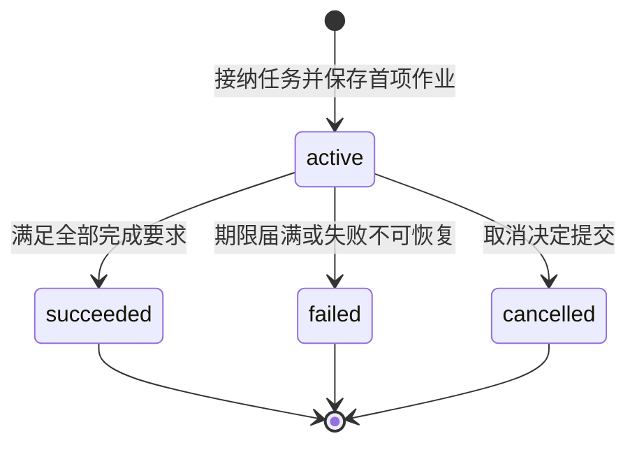
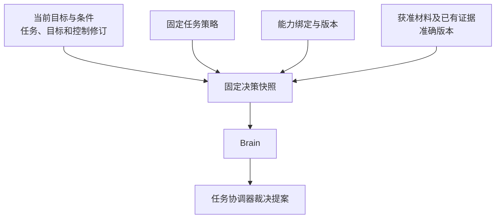
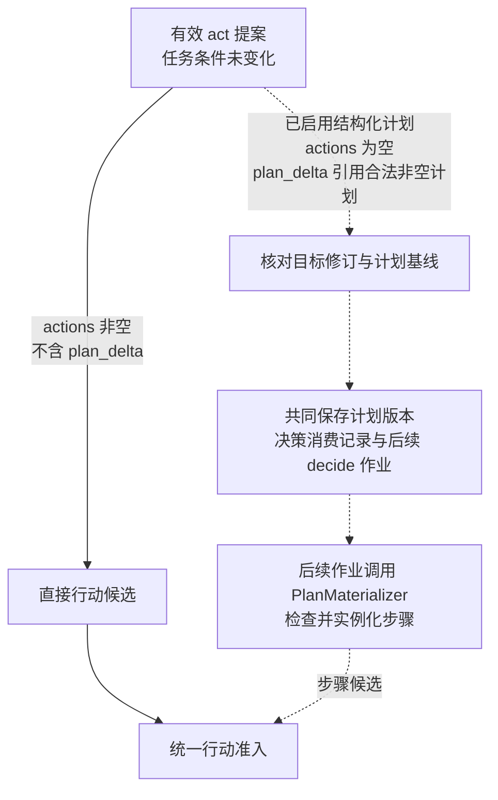
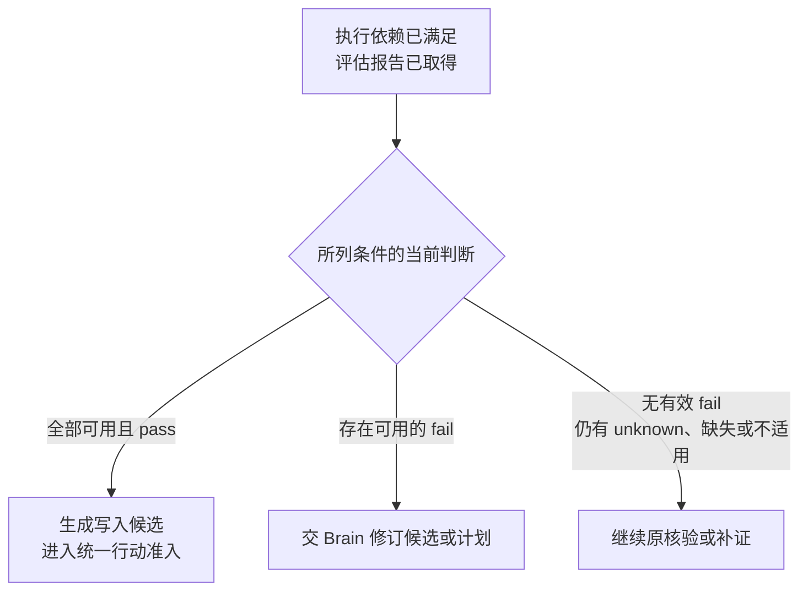
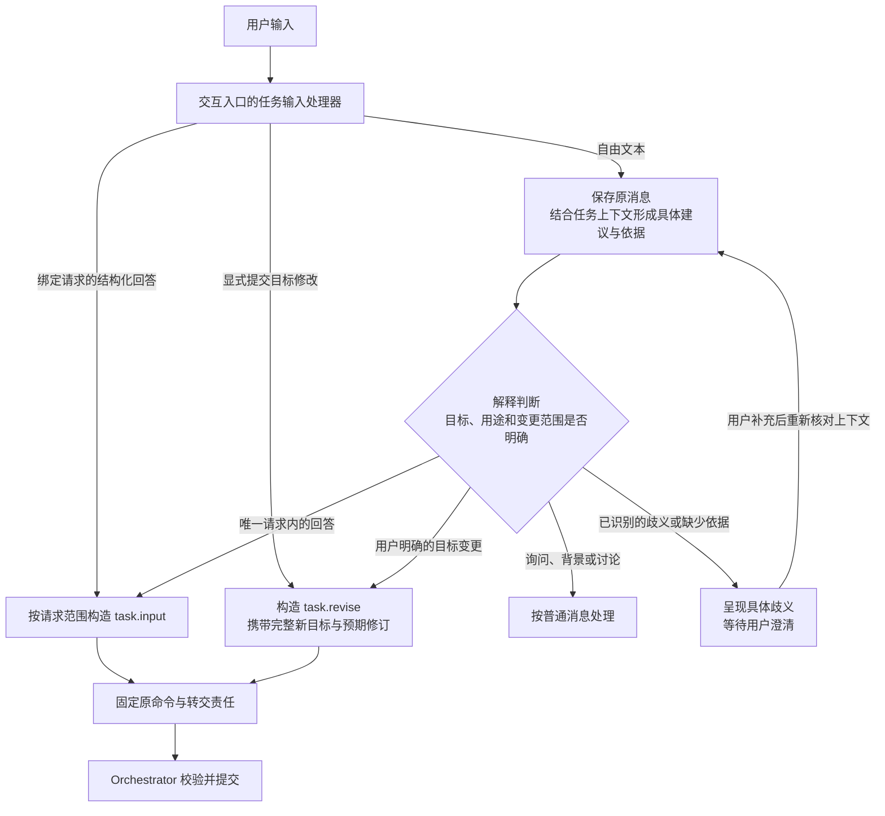
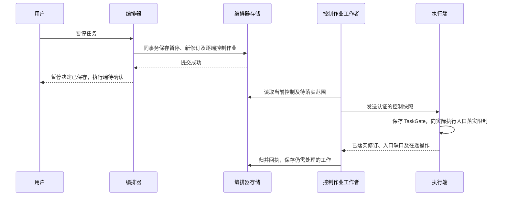

# 任务推进与控制

任务推进以当前 Task 记录为依据。编排器分别记录任务是否终结、是否暂停、当前工作缺少哪些条件，以及仍需核对的效果与费用。新工作按这些事实检查准入，原操作的核对与结算保留各自的责任。

| 维度 | 含义 |
| --- | --- |
| `status` | `active`、`succeeded`、`failed` 或 `cancelled`；任务进入终态后不再恢复为活动状态 |
| `control` | `running` 或 `paused`，记录本任务的运行或暂停选择 |
| `wait_reasons` | 输入、授权、依赖、预算、效果或容量缺口；各项分别记录所等对象与解除条件，可以同时存在 |
| `open_effects` | 效果未知或仍可能迟到的原操作，需要继续核对，并阻止与其冲突的新行动 |
| `accounting_open` | 尚未完成结算的调用或额度分配，需要保留相应预留并沿原计费项核对 |

例如，取消任务后，`status` 已为 `cancelled`，仍可能存在 `open_effects` 和 `accounting_open`：目标推进已经结束，原操作的效果与费用继续核对。

## 状态变化与终结

编排器负责提交 Task 的状态变化。图中的终点表示任务状态已经确定，原操作的效果核对与费用结算仍按各自记录继续。

暂停或新增等待原因本身不改变 `status`。暂停阻止启动新的决策、评估与行动；解除一个等待原因只更新对应项，其余等待继续保留。既有证据已满足全部完成要求时，暂停中的任务仍可提交 `succeeded`。期限届满则提交 `failed`，并记录原因 `deadline_exceeded`。

取消与成功提交发生竞争时，以先提交的终态为准。迟到的执行成功补充原操作事实和费用，不改变已经提交的任务终态。

## 修订与决策有效性

编排器为已提交的任务变化保存递增的修订号。每轮决策记录自己依据的修订，提案返回时据此检查是否仍可采用。

| 修订号 | 表示什么 | 使用规则 |
| --- | --- | --- |
| `revision` | 当前 Task 记录的整体版本 | 提交任务变更时比较，防止旧工作覆盖已经提交的新事实 |
| `goal_revision` | 当前目标及任务条件的版本 | 用户修订目标或获准的条件补全实际改变条件时递增；提案与条件证据绑定对应版本 |
| `control_revision` | 控制决定的版本 | 本任务暂停、恢复、取消、目标修订及终态提交时递增；活动子任务受祖先控制变化影响时也递增，供执行端判别控制新旧 |

提案返回后，编排器在提交事务中重新比较所依赖的修订。修订不匹配时，保留原调用记录和费用，不依据旧提案产生新行动。后续是否重新决策，由当前任务状态与控制决定。

例如，Brain 调用期间任务先暂停又恢复，`control` 虽然重新为 `running`，`control_revision` 已经变化。旧提案仍按过期提案处理，不能因为当前显示“运行中”而继续派发。

## 固定决策输入

任务接纳时绑定一份准确的任务策略（TaskPolicy），保存其标识、版本和摘要。策略规定工具范围、确认等级、回路限额、允许的评估方式及费用模式。

决策快照（Snapshot）固定本轮使用的目标、条件与相关修订，以及策略、能力绑定、获准材料和证据的准确版本。组装时若权限变化或必需材料不可读，编排器保存具体等待原因，待条件补齐后继续。

原目标、显式约束、当前控制与未结操作从权威记录机械重建；多次压缩后的摘要只提供派生材料。组装依据附在原快照，记录准确来源、选材理由和水位，不增加独立的目标或效果账本。

默认 ReAct 路径直接使用 Brain 的提案。工作者先持久保存快照与固定 `decision_id` 的调用输入，再在事务外调用 Brain。恢复原调用时沿用原快照和标识；需要新一轮决策时，保存新的快照与 `decision_id`。

快照记录本轮判断的依据，行动准入仍须重新检查当前控制、授权与预算。

### 决策路径与跨轮升级

Brain 共用一套输入、提案校验、记录和恢复逻辑。S1 表示规则或固定答案类型的快速判断角色，S2 表示处理开放理解、综合及重规划的通用模型角色；这两个名称不保证时延或正确率。Orchestrator 根据已知任务阶段和固定策略选定本轮 ModelProfile，陌生阶段保留通用模型路径，不增加一次模型分类请求。

| 路径 | 选择及产出 | 调用与失败边界 |
| --- | --- | --- |
| 确定性规则 | 共同输入检查通过后先尝试规则；目标及全部约束、能力、绑定、事实适用性和动作限额均被覆盖时，以代码构造当前提案 | 零 ModelCall。未覆盖可进入本轮已选模型；规则冲突或产物无效则保存 failed／invalid_output、after_change，等待策略修复，不能调用模型掩盖规则错误 |
| 固定答案类型判断（可选） | `typed_decision` 配置固定候选及 Choice、Score 或布尔等答案范围，代码将可采用答案映射为原 Proposal | 至多一次物理模型请求；答案只选择下一步，不直接证明目标效果或生成条件通过依据 |
| 通用模型 | 处理完整约束理解、来源冲突、正文综合和计划修订 | 至多一次物理模型请求；提案仍由 Orchestrator 独立准入，不能修改活动规则或自授权限 |

已有计划的参数回填和步骤实例化由代码处理，不为这些工作另造 S1 Decision。固定答案类型路径在适配器、费用依据、恢复、升级策略和独立评测齐备后才启用；首个适用候选是规则不能完成的有界只读选页，开放理解、正文综合和质量评估仍保持各自职责。

ModelProfile 的 `decision_spec_ref` 固定不可变规格及引用闭包，包含支持范围、候选构造与上限、准确模型和问题模板、接纳阈值、并列规则、Proposal 映射及资源限制。候选身份必须进入实际模型输入，返回答案只能映射到本轮已有的准确候选；截断或未覆盖维度显式保留。模型分数和 confidence 保持派生判断性质，阈值经适用样本校准，不凭统一分数宣称正确。

| 反馈 | 原 Decision 与后续责任 |
| --- | --- |
| 输入不在 typed_decision 支持范围，尚未发送 | 保存 unsupported／after_change，无 ModelCall；固定策略允许时另建通用模型 Decision |
| 答案结构合法但不满足接纳条件，且仍有语义选择 | 保存 precondition_failed／after_change、已返回调用及用量；固定策略允许时另建通用模型 Decision |
| 类型、题目、数值或模型版本不符合合同 | 保存 invalid_output 与实际调用；进入既有有限修复，不能冒充正常拒判升级 |
| 控制、许可、事实或能力缺失 | 交原负责方解除等待；升级不能代替授权、补证或依赖恢复 |
| 模型可能已发送且结果未知 | 沿原调用核对并保留费用；不能因拒判或低置信度的名义再发一次 |

只有上述 unsupported 或合法拒判允许一次定向升级。首次 typed_decision 准入前，以该 decision_id 固定决策链根；同目标修订和阶段中的失败、补上下文、候选变化及重启沿用原链，不能重新获得升级额度。原失败、新 Decision、链根、已消费升级额度、新配置和派发责任共同提交，恢复不重复创建；路由依据固定错误码和调用事实，不解析错误文案。

提案获准并推进到下一业务阶段、目标修订使原链失效或 Task 终结时关闭链。升级后的通用模型不把同一问题改名送回 S1；继续失败沿原有限修复或收尾处理。升级、修复及新决策都受累计轮数、期限和费用约束，等待许可或预算不重置这些限制。活动 Task 只能采用原 InstallLock／TaskPolicy 已声明且当前合法的回退分支，在途 Decision 保持原输入和费用责任。

### 组装顺序与上下文大小

1. 读取原 Task、当前条件、有效控制及全部未结意图，固定依赖修订。金额、收件人、范围、必要条件与原操作身份不从摘要或模型文字反推。
2. 取得正式事实、所需能力契约及获准记忆的准确修订，记录来源、适用范围、完整性和不可达项。投影落后时补取有界的原事实或等待追赶，不能把缺行解释为没有未知操作。
3. 按当前用途读取必要内容字节，核对准确版本、摘要、来源及处理位置。只读取元数据便排除的内容不计作已处理正文；已经读过再裁掉的内容仍保留处理来源。
4. 按固定策略选择近期事实、正文片段、可用摘要和辅助历史，保留事实与推断的区别、时间、范围、冲突及缺口，记录保留／排除原因并计算输入大小。
5. 在 Task 条件事务中重新核对目标、控制、事实与当前使用资格，共同保存准确上下文、组装依据、decision_id、预留及派发责任。竞争失败不派发旧快照；预存正文与业务提交不构成跨库原子事务。

默认先裁去无关历史、重复材料和低相关可选记忆，再缩短获准证据片段。硬约束、当前控制、原未知效果和本轮使用的完整能力契约不可裁剪。大小按准确 ModelProfile 编码估算并预留固定包装与输出空间；必需输入仍放不下时保存 `context_incomplete`，不能删掉约束继续。

摘要必须有准确版本、来源闭包及当前使用依据。需要新摘要时另准入有界处理，需要模型便另建 Decision，固定输入、许可、费用和产出关联；原 Decision 不附带第二次推理。摘要与当前事实冲突时以可核验事实组装并保留冲突，不能反复改写上一份摘要来维持目标或效果记录。来源关闭、原文到期或不可读取时明确缺口，不为压缩实验延长保留期。

### 最终编码与实际披露

Brain 读取后再次核对输入；ModelAdapter 完成全部包装、插件变换及日志计划后，才固定可发送的只读编码。持久依据附在原 Decision／ModelCall 内部记录中：

| 核验项 | 保存的依据与拒绝条件 |
| --- | --- |
| 编码来源 | 固定 context_ref、profile、组装策略、编码器、配置和安装版本；包装指令来自受信固定配置 |
| 全部实际字段 | 枚举 messages、工具声明、输出 Schema、媒体或 URL、metadata、缓存／路由字段、插件字段及诊断计划；无法定位到准确材料或固定配置的字段不得发送 |
| 用途与接收方 | 分别记录实际处理来源和最终外发来源、提供方、位置及接收端；日志端另行获得披露许可。凭据适配器只记录获准身份与版本，秘密字节不进入上下文、日志或产出 |
| 最终大小 | 检查模型窗口、输出预留、实际传输和日志字节上限；不计入模型窗口的附件与 metadata 仍需披露及传输检查 |
| 禁止保存的材料 | 仅用部署已验证的临时处理路径，持久记录限于获准身份、摘要、用途及可能发送事实；最低必需记录也被禁止时拒绝该路径 |

顺序为：取得准确字节与来源 → 完成所有变换 → 核验最终字段、用途、接收方与大小 → 固定编码及摘要 → 用原使用身份取得所需回执 → 在发送门禁事务中保存核验依据与 `send_started` → 从唯一出口发送同一编码。门禁仍须检查当前领取、控制、使用窗口与实例资格。

门禁后 hook、遥测、SDK 和包装器不得追加用户资料、日志或附件，也不得改变接收方。出口核对实际摘要，不一致就关闭发送；已保存的可能发送事实及费用责任继续保留。自动刷新后重请求、代理重试或压缩附带的模型请求不能绕过每个 Decision 最多一次物理请求的限制。具体中断分支见[外部发送与恢复](durable-work.md#durable-before-send)。

产出的来源依赖包含本轮实际处理来源的并集，不只包含提案中的 `evidence_refs`；来源限制取交集，编码时省略某材料不删除已经发生的处理责任。包含本地限定资料的输出不能因只引用公开资料而自动发云。临时原文在重启后无法重取时，未发送的决策以输入缺口结束；若模型可能已经发送，仍保留 `provider_result_unknown` 和原费用核对责任。

## 条件补全优先裁决

编排器按 `decision_id` 保存唯一的处理结论，称为决策消费记录。已有记录时返回原结论；尚未处理时，先核对当前任务修订与控制，再裁决提案携带的条件补全。

条件补全通过 `requirements_proposal` 携带，必须与当前目标修订匹配。编排器按稳定的条件标识比较完整内容，并核对原文依据与显式约束；仅调整条件排列顺序不构成变化。

| 条件补全情况 | 保存的变化与后续工作 | 同一提案的其余内容 |
| --- | --- | --- |
| 未携带补全，或内容与当前条件相同 | 不因补全增加目标与控制修订 | 继续裁决原提案 |
| 合法补全实际改变条件 | 保存新条件，递增目标、控制及任务修订，同时保存下一轮决策与控制传播作业 | 行动、完成建议及可选计划变更全部失效 |
| 缺少必要条件、未保留显式约束、降低必要性，或目标含义不明确 | 保存缺口与澄清、重新决策或用户修订所需的工作 | 不部分采纳，也不继续处理其余内容 |

改变目标含义或降低必要性，需要用户通过 `task.revise` 明确修订。决策消费记录与本次任务变更、后续作业共同提交，重复交回同一决策不会再次增加修订或创建工作。

例如，一份提案同时补全任务条件并建议写入报告。只要补全确实改变条件，本轮就不准入写入；下一轮读取新条件后再决定如何行动，并重新检查当前控制与执行前提。

## 条件未变时的提案处理

条件未变化且提案仍有效时，编排器按 `kind` 继续裁决。默认 ReAct 路径采用以下处理规则。

| 提案类型 | 编排器的处理 |
| --- | --- |
| `act`：行动建议 | 进入统一行动准入；通过后共同保存固定操作意图、预算预留与派发作业 |
| `need_context`：补充上下文 | 有界读取获准的记忆、能力声明、已有操作事实或已知内容，保存结果与缺口，供新快照使用 |
| `request_input`：请求用户输入 | 编排器创建并保存输入请求，限定可补充的参数范围，记录关联条件与等待原因；交互系统呈现请求并持久转交回答，编排器消费后重新检查推进前提 |
| `complete`：完成建议 | 检查当前适用且 pass 的目标覆盖记录，再核验准确成果、必要条件、实现缺陷及效果收尾；缺报告时保存核验责任，满足全部完成要求才提交 `succeeded` |
| `fail`：失败建议 | 核对失败原因、未满足条件与恢复建议，结合当前事实决定继续等待、安排后续工作或提交 `failed` |

新的网页搜索、页面抓取或设备观察通过 `act` 提出，并经过普通行动准入。`need_context` 只用于补充已有且获准读取的材料。

相同快照下重复的上下文请求复用已保存的结果或缺口。外部依赖暂不可用时，保存具体等待对象与恢复条件，不靠连续调用 Brain 探测恢复，也不直接认定任务不可恢复。

## 进展、无进展与停止依据

编排器把进展分类与原 Task、可信事实及反馈消费共同保存。计划措辞、模型自述、通知次数和会话更换不构成目标进展。是否允许下一次自主推进，由以下事实共同决定，不新增持久的继续权开关：

| 检查 | 不满足时的处理 |
| --- | --- |
| Task 为 active，自身和祖先有效控制为 running，本轮目标修订仍匹配 | 不启动新的目标工作；既有证据汇总和收尾遵守原状态规则 |
| 新的已消费输入、可用事实或固定计划确有下一步，相关等待已解除 | 保留具体等待，不调用模型探测依赖是否恢复 |
| 当前授权、预算、期限、续行／修复上限、配置和容量允许 | 保存对应缺口或按策略终止；历史许可回执不免除实际入口检查 |
| 原存储权威、旧写者隔离、恢复链和当前实例就绪成立 | 保留获准查询与恢复入口，不从重启或作业领取推导执行资格 |

TaskPolicy 固定有限的累计续行、修复和连续无进展上限；Task 内部记录累计 `continuation_count`、`repair_count`、连续 `no_progress_count` 及最后有效输入的准确关联。新 Decision 或实际准入计划步骤各占一次续行额度，重派和重领沿原身份不重复计数。累计次数不因重启、目标修订、暂停／恢复或更换 Brain 清零；模型请求、工具尝试和费用独立计量。

有效输入摘要按当前目标、条件、证据、人工输入、所需能力及未结效果的语义依赖形成，保留准确版本及范围。不纳入通知 ID、领取代次、轮询时间、token 累计或纯账务修订；摘要仅作比较索引，实际核验仍读取原事实。

| 反馈 | 一次消费后的处理 |
| --- | --- |
| 目标真正修订、新可用结果、原 unknown 核清、有效回答补齐参数 | 更新准确依据，可以清零连续无进展数；累计续行／修复、费用、期限和原操作责任保持 |
| 同对象同修订、同 Decision 重报、重复通知或只换消息／会话／工作者身份 | 返回原归并结果；同修订异摘要拒绝冲突。不增加进展或无进展次数，也不创建新 Decision |
| 新 Decision 格式错误、合法拒判、重复 need_context 或没有可准入建议 | 每个原 Decision 最多增加一次连续无进展数，保存拒绝类型与恢复条件；新修复或升级仍占用累计额度 |
| 原效果、子任务、控制或账务尚无新事实 | 原 poll／control／settle 有界核对；相同读取不计进展，也不计连续无进展，不调用 Brain 探活 |

远端读取在事务外进行。归并事务锁定原 Task，按受信 owner／对象／修订、原 Decision 或已消费输入命令判重，核验当前适用性，共同保存事实、费用、反馈分类、内部计数、等待或后续 Job。不能先递增计数，再依靠可丢失的通知补工作。

准入下一 Decision 或计划步骤时，在同一条件事务检查当前继续条件、保存已计数身份和累计值，再保存固定输入或意图及派发责任。并发工作者不能分别占用最后一个名额。失效领取不能修改 Task；可信迟到事实可由有效领取或独立事实入口归并。

达到连续上限且有明确可恢复对象时，保存已有的输入、授权、依赖、效果或预算等待，注明 `resume_condition` 及有限的检查时点。期限已到、累计额度耗尽或没有合法恢复条件时，先考虑在途工作及已有充分证据，再按 TaskPolicy 结束目标推进。上限本身不提供成功依据，也不能提前覆盖最后一项在途工作的合法结果。

公开 Task／WaitReason 不增加计数或 `no_progress` 枚举。失败或取消后，原 unknown、失联子任务、未结预留与迟到账务继续核对；自动查询耗尽不证明操作未发生，不释放未知预算，也不删除原去重键。

## 统一行动准入

Brain 的行动提案、启用结构化计划后的步骤候选，以及固定策略与检查规则要求的核验行动，都由任务协调器执行同一套准入检查。每个候选保留自己的来源，用于识别重复处理。

### 先固定最后业务参数

模板、hook 或 wrapper 若会改变金额、收件人、正文、路径、筛选条件、用途或目标，必须在准入前完成。受信准备逻辑按固定有界顺序返回候选替换及变换依据，随后严格校验 Schema，通过资源类型规范化器解析准确资源，固定 Capability、Binding、InstallLock 和配置。准备阶段不执行目标动作、不消费许可；hook 的 allow 只提供意见，Grant owner 与 Orchestrator 保留原裁决职责。

准备诊断附在原 Operation 的内部记录或准确引用中。默认无 hook 的路径也做相同校验。准入后发现必须改参数或安装组合，应回原 Orchestrator 形成新候选并处理旧效果、预留和资源责任，不能覆盖原 Invoke；远端 wrapper 无法在准入前确定其业务变换时，该路径不开放。固定意图之后的协议编码与真实出口检查见[驱动发送边界](durable-work.md#driver-dispatch)。

### 在短事务内准入

远端依赖与授权依据先在事务外取得。以下检查与写入在同一短事务中完成：

1. **核对本轮有效性。** 确认工作者本次领取仍有效，候选依据的任务与目标修订仍匹配。
2. **检查运行条件。** 本任务必须为 `active`、`running`，且期限未到。对于同一编排器管理的内部子任务，全部祖先任务也必须处于活动、运行状态。
3. **核对来源与行动内容。** 按候选来源查询准入记录，重复处理沿已保存的操作恢复；新候选检查完成全部变换后的业务参数、规范资源、完整能力声明、准确绑定与执行依赖。
4. **检查当前约束。** 核对授权与预算，确认没有阻塞本次行动的资源冲突或未决效果；存在缺口时保存具体等待或拒绝原因。
5. **共同保存获准工作。** 保存操作标识与不可变输入、原执行命令、预算预留、来源处理记录、任务新修订及派发作业。

派发前再次核对当前任务、目标、控制与期限；执行端实际启动时核验当前授权。

Executor 接纳时重验同一固定 Invoke 及摘要、准确声明和绑定、依赖、TaskGate 及取消记录，再保存原接纳事实；不重新运行带业务语义的 hook。实际发送仍检查原 use、预算依据、期限、资源占用和当前安装资格，同一意图的接纳不提供永久启动权。

多个行动只有相互独立且资源不冲突时，才能以有界批次准入，每项保留独立操作身份与预留。依赖前项结果的行动，取得真实结果后再准入；GUI 操作依据新的界面观察逐次决定一个动作。

## 可选的结构化计划

结构化计划按需启用。Brain 可以提交步骤数量有限、依赖无环的版本化计划，由 `PlanMaterializer` 根据计划与已核实事实生成行动候选。默认 ReAct 继续直接使用 Brain 的行动提案。

计划变更通过 `plan_delta` 提出。安装时，编排器比较 `base_plan_ref` 与当前计划引用，并核对目标修订。首次安装要求基线为 `null`、计划版本为 1；修订现有计划时保留 `plan_id`，版本递增一版。

虚线表示启用结构化计划后才使用的路径。一次 `act` 提案只能选择直接行动或安装计划；计划中的首个行动也由后续作业生成候选，再单独准入。

每个步骤具有独立的 `step_id`。步骤准入按任务、`plan_id`、计划版本与 `step_id` 去重，重复处理恢复原操作。安装计划的 Decision 只消费一次，后续步骤各自保存准入记录。

### 步骤依赖与通过条件

以下规则仅适用于结构化计划步骤；默认 ReAct 通过逐轮事实反馈推进。

`depends_on` 列出本步骤依赖的前项步骤。只有全部前项已结束、不会再产生迟到效果，且输出已核实，才满足执行依赖。前项操作失败、效果未知或仍可能迟到时，依赖不成立。

`pass_conditions` 声明本步骤要求通过的任务条件，每项绑定条件标识、规则与准确成果引用。编排器读取当前目标下对应的所选判断，并检查证据的当前适用性；所列条件必须全部当前可用且为 `pass`（通过）。

以写入步骤要求“报告质量评估通过”为例：

评估操作成功说明评估报告已经生成；报告中的质量判断仍可能为 `fail`（不通过）。此时写入步骤不能启动，也不能从历史检查中挑选另一份 `pass` 覆盖当前有效的失败判断。

步骤准入事务再次核对依赖、所选条件判断与证据适用性，确保生成候选后发生的变化仍能阻止执行。

### 参数绑定与计划修订

行动模板（`action_template`）固定工具调用或任务委派的结构。参数绑定（`argument_bindings`）描述从输出取值、写入业务参数的映射，使用 JSON Pointer 定位 JSON 正文中的相应值。

| 取值方式 | 来源与解析规则 |
| --- | --- |
| 模板字面值 | 直接复制当前计划版本中已经固定的值 |
| `operation_output` | 引用编制计划时已存在的原操作及准确输出，沿声明的引用取值 |
| `step_output` | 仅引用本计划的直接或间接前项；实例化时沿该计划版本的唯一准入记录，找到实际操作或委派及其已核实输出 |

实例化过程只复制字面值或按路径取值，不执行脚本、表达式或额外网络请求。绑定只写入工具调用的业务参数，或委派的目标、输入引用，不能覆盖能力、主体、授权、预算或控制。

绑定位置不得重叠，父路径与数组位置必须已经存在；绑定后校验完整参数结构。来源字段缺失、引用版本不符或类型不匹配时，保存缺口并交 Brain 重新决策。没有行动模板的步骤也由 Brain 展开。

准入时共同保存实际来源、固定输入与参数摘要。重复处理沿原操作恢复，不重新绑定较新的输出。计划修订使尚未准入的旧步骤失效，但保留已有操作、预算预留与未决效果；新计划需要复用旧输出时，必须显式使用 `operation_output`，并重新核对当前适用性。

## 用户输入、目标修订与等待解除

输入请求（InputRequest）由编排器创建并持有，固定请求标识、修订、回答结构、期限及必需预览，并在内部绑定适用的目标修订与可补充参数范围。交互系统负责呈现请求、接收回答和持久转交；请求是否已被消费，以编排器保存的决定为准。

### 两类命令的业务边界

`task.input` 和 `task.revise` 分别提交请求回答与目标修订。它们规定不同业务变化的校验和提交规则，不要求聊天入口先将所有用户消息分类为二者之一。用户消息也可能是询问进度、补充背景或讨论方案，不一定产生任务变更。

| 比较项 | `task.input` | `task.revise` |
| --- | --- | --- |
| 处理对象 | 一个尚未消费的澄清请求 | 一个仍为 `active` 的任务目标 |
| 版本依据 | `request_id`、`request_revision`，以及请求内部绑定的目标修订 | 任务的 `expected_revision`、完整新目标与约束 |
| 允许变化 | 只补充请求明确开放的参数 | 根据用户明确表达的变更，调整目标含义、既定约束或必要条件 |
| 提交责任 | 一次消费请求，保存回答、参数变化、回执与后续工作 | 保存新目标，递增目标、控制及任务修订，使尚未派发的旧目标工作失效并保存控制传播与后续工作 |

例如，请求正在询问保存目录时，“保存到 `/reports`”可以作为 `task.input` 的回答；若原目标已经固定保存到 `/archive`，用户要求改为 `/reports`，则属于 `task.revise`。“不用保存文件了”改变了必要条件，也属于目标修订。判断依据是当前目标和请求开放的范围，不能只靠句中的关键词。

### 用户消息解释与命令形成

交互入口中受信登记的任务输入处理器负责保存用户消息、组织解释、构造业务命令并固定转交目标。这是交互入口的逻辑职责，不要求新增服务。编排器负责校验并提交业务变化；Brain 的任务提案不能自行代替用户修改目标。

已绑定请求的结构化回答，由登记的处理器构造 `task.input`；显式提交的目标修改构造 `task.revise`。绑定只确定提交路径，回答仍须满足请求范围和结构。

自由文本先保存原消息标识、准确原文及已认证用户、任务上下文，进入待解释状态，再结合当前目标、待回答请求和相关对话形成处理建议。语义解析可以使用规则或受限模型。使用模型时，模型应给出具体内容：回答哪个请求、补充哪些参数，或要求怎样修改当前目标，并关联用户原文依据。仅返回 `input` 或 `revise` 标签不足以形成业务命令。

模型解释也必须经合法的 Task／Decision 准入，固定输入、许可、费用和产出关联，每次调用单独计量；不能把解析、标题或压缩隐藏在消息接收和原 Decision 内。尚未具备该路径的应用提供结构化回答与显式目标修改入口，不因保存自由文本就自动启动推理。

处理器依据具体建议构造命令。消息已保存、解释建议已生成和业务变更已提交是不同阶段，只有命令成功提交才产生相应任务变化。

自由文本只有能对应唯一、有效的请求，且全部内容都在该请求允许的回答范围内时，才形成 `task.input`。形成 `task.revise` 时，须明确目标任务、用户要求的具体变化及其依据；新目标保留用户未要求改变的约束。处理器识别到任务指向不明、多个请求均可能匹配、回答同时夹带目标修改，或候选解释需要猜测用户意图时，列出具体歧义并等待澄清，不截取其中一部分先提交。识别不可用时仍提供明确的回答与修改入口。

自然语言解释依赖模型能力，原文引用和结构化建议使解释可追溯，但不能证明解释正确。Orchestrator 校验身份、权限、版本、请求绑定和允许变更范围，不保证识别全部语义误解。目标修订应保留修改前后的内容及原消息关联，供用户查看和纠正；纠正通过新的命令提交，已经发生的操作和效果仍按原记录核对。

需要提交业务变化时，处理器共同保存唯一的目标 Orchestrator、方法、完整命令、原消息关联和转交责任；随后沿原命令发送、查询和恢复。重复收到原消息复用这份记录。已经固定的 `task.input` 不能因拒绝或超时改投 `task.revise`；用户随后明确修改目标时，建立独立的新命令。

### 消费、竞争与等待解除

编排器先检查原命令是否已有决定。对新的 `task.input`，在提交事务中锁定任务与请求，确认任务仍为 `active`，核对当前身份和权限、请求状态与修订、适用目标、期限、回答范围和结构，以及必需预览的准确引用、当前来源状态与使用许可。校验通过后，共同保存回答、请求消费记录、任务变化、原回执及后续工作。

同一命令与相同内容重复提交时返回原决定；两个不同回答竞争同一请求时，先成功提交者获胜，另一方收到请求已消费及可披露的原回执。过期、被替代或不符合范围的回答不消费请求，也不自动解释成目标修订。原命令身份相同而内容不同，按幂等冲突处理。

`task.revise` 在任务事务中比较预期修订，保存新目标，并将仍未消费、绑定旧目标的请求标为已被替代；新目标仍缺参数时建立新的请求。这样，旧回答与目标修订无论谁先提交，后提交的一方都必须重新核对版本。已有操作的原始记录、在途效果核对责任，以及已经发生的费用和许可消费继续保留。

有效回答只解除对应的输入等待，其他等待原因与暂停状态继续保留。主观成果验收通过绑定准确候选的 `task.accept_result` 处理；授权决定通过独立受信入口处理，均不能借普通回答改变其消费规则。

## 控制决定如何到达执行端

每次暂停、恢复、取消、目标修订或终态提交，编排器在同一事务保存任务变化、新的 `control_revision`，以及面向各已绑定执行端的控制作业。新执行端的绑定与操作派发责任也共同保存，确保后续控制能找到所有已经接入的执行端。

执行端为每个任务持久保存执行控制记录（TaskGate），记录已知的任务状态、运行或暂停控制、目标修订和控制修订。编排器签发的控制快照绑定具体任务与接收执行端，并通过 `start_before` 限定允许启动动作的时间窗口。

执行端按控制修订处理乱序消息：较新修订更新记录，相同修订与相同内容去重，相同修订却内容不同则报告冲突，较旧修订只返回当前事实。已经终结的任务不能由迟到的恢复消息重新启动。

控制确认必须对应当前控制修订及完整执行范围。只有所有相关执行端的实际入口都已落实启动限制，才可显示当前控制已确认。旧修订回执和部分入口的确认分别保留，不能清除新控制的待确认记录。控制落实后，已经发出的动作仍需继续核对。

执行端尚未收到暂停时，仍可能在旧快照的有限窗口内启动动作。窗口到期阻止继续启动，但不能证明在途动作已经停止。恢复后，原操作须取得当前有效的启动依据，并继续遵守原期限与授权；已明确终止的操作不能被恢复消息重新启动。

### 设备占用与本人接管

设备控制同时检查三个不同范围的版本：

| 依据 | 控制的范围 | 不能替代的事实 |
| --- | --- | --- |
| TaskGate 的 control_revision | 原 Task 在接收执行端是否允许启动，目标修订是否匹配 | 不证明设备由该实例占用，也不证明动作已停止 |
| ResourceLease 与 control_epoch | 资源 owner 管理的自动占用、持有实例和当前控制代次 | 不替代任务控制或新鲜界面观察；占用到期不证明旧效果已结 |
| Job 的 lease_epoch | 原后台责任由谁领取及提交 | 不隔离外部发送者，不提供设备执行权限 |

`resource.acquire` 只在无人工控制、有效旧占用或可能迟到旧动作时建立新 lease 和更高 epoch；renew 只延长仍有效的原占用。本人查看设备可用独立 read 权限。`resource.observe` 绑定准确只读观察能力，沿 Operation 的许可、费用和恢复流程取得 Observation；未取得图像不能用空结构充作新观察。

Observation 固定设备、control_epoch、ui_revision、观察及到期时间、截图、可得结构、焦点和 viewport。GUI 动作引用仍新鲜的观察与当前占用，在实际入口比较修订、焦点及动作前提；坐标不跨观察版本复用。动作后的独立观察若需要额外 read 权限，启动前即确认该权限存在。

资源 owner 在交给驱动前持久登记在途写操作和核对责任。即使同一持有者取得了新截图，下一自动写仍须等待原操作发送 closed、may_apply_later=false 且可信目标证据覆盖原 Attempt，再在资源事务中比较 operation、attempt 和 epoch 解除隔离。只读观察及原效果核对可以在授权下继续；租约到期、查询预算耗尽或更换工作者均不能释放未知占用。

本人接管独立于自动任务队列：先提高 control_epoch、撤销自动 lease 并封闭旧入口，再返回仍在途的集合。交还自动执行须本人 release、核清迟到效果、新 acquire 和新观察。重启时还须恢复固定设备入口及隔离原发送者，见[设备入口恢复](durable-work.md#device-recovery)。只有驱动证明资源域之间没有共享界面或副作用，才允许按域并行。

## 内部子任务的有效控制

内部子任务与父任务由同一编排器管理，共享本地事务。父子关系在创建时固定并禁止成环；子任务调用远端 Brain 或执行端，不改变其任务归属。

子任务的 `Task.control` 保存自身的运行或暂停选择。对外发布的 `TaskGate.control` 则是有效控制：只有自身及全部祖先都处于 `active`、`running`，才允许启动新的目标工作。

下表假定子任务仍为 `active`：

| 祖先状态 | 子任务自身 `control` | 有效控制 |
| --- | --- | --- |
| 全部为 `active`、`running` | `running` | `running` |
| 全部为 `active`、`running` | `paused` | `paused` |
| 任一祖先暂停或终结 | 任意 | `paused` |

父任务恢复时重新计算有效控制，不能清除子任务自身的暂停。暂停期间，各任务期限继续计时，原效果与费用仍按已有责任核对。

祖先控制变化时，编排器按从根到叶的顺序锁定相关任务，在同一事务递增受影响子任务的控制修订、计算有效控制，并保存逐执行端传播作业。父控制的确认范围包含这些子任务的实际执行入口。任务深度与子树规模在创建时受限，保证控制事务处理的范围有界。

子任务创建和行动准入同样锁定并检查祖先状态。父取消先提交时，新的子任务创建被拒绝；子创建先提交时，父取消事务将其纳入子树取消责任。父取消提交后，祖先状态立即阻止子任务的新工作，后续作业继续落实子任务取消与远端控制。已经终结的子任务保留原终态，迟到结果不重新打开父任务。

另一编排器管理的 Agent 按外部委派处理，不能依赖上述本地事务保证。外部控制沿原命令传播并核对；不支持暂停或尚未确认时，明确展示外部任务仍可能运行。

## 目标修订后的委派与证据

每个委派在创建时固定其对应的父任务 `goal_revision`。父目标修订后，旧委派不能自动继承新目标；合法条件补全实际改变目标版本时，也遵循这一规则。

参考实现采用保守处理：在父目标修订事务中，将旧目标下仍活动的内部子任务及其活动后代置为 `cancelled`，记录取消原因、递增控制修订并保存传播作业。已经终结的子任务保留原终态，原操作的效果核对和费用结算继续进行。这样，即使父任务仍为 `active`、`running`，旧子任务也不能继续准入行动。

外部委派按其实际交接状态处理。尚未派发的创建停止派发；已经发送或发送情况不明时，保留原创建标识，核对原任务并继续取消、关闭新增消费。远端是否落实控制仍以原负责方的事实为准，父目标修订不提供远端已经停止的证明。

新目标通过新一轮决策决定是否建立新委派，不能改写旧委派的目标或重用其身份。原预留、在途效果和资源冲突继续参与准入检查；与旧效果冲突的新行动进入效果等待。新委派也不重置父任务的累计限额、期限或预算。

这一选择的代价是部分仍有用的子工作也会终止。已经取得的材料与成果可以继续保留，并在满足当前要求后复用。旧证据需要逐项核对：

- 条件含义与判断规则仍适用。
- 成果准确版本、资源对象及证据覆盖范围一致。
- 观察时点满足当前要求，来源与用途仍获准，且未命中当前已登记的判断缺陷。

复用成立时，保存绑定新 `goal_revision` 的核验记录及复用依据，原记录保持不变。任一条件无法确认时，保留缺口；需要新的模型判断或外部取证时，重新经过普通行动准入。

任务已经终结后再改变目标，应创建显式关联原任务的新任务，原终态与未结责任继续保留。
