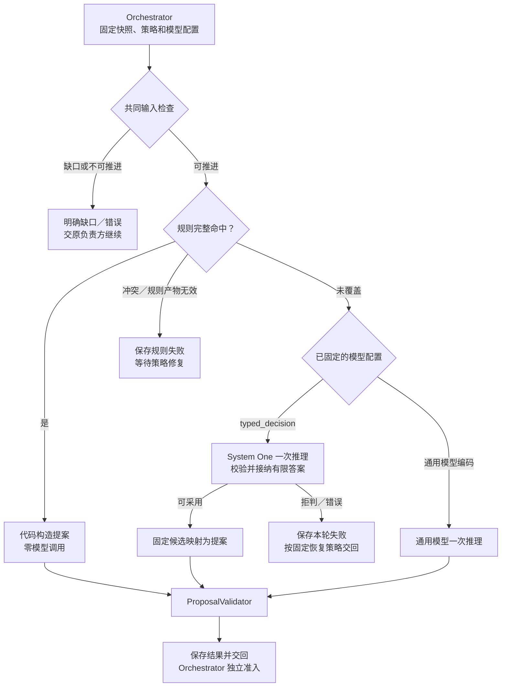
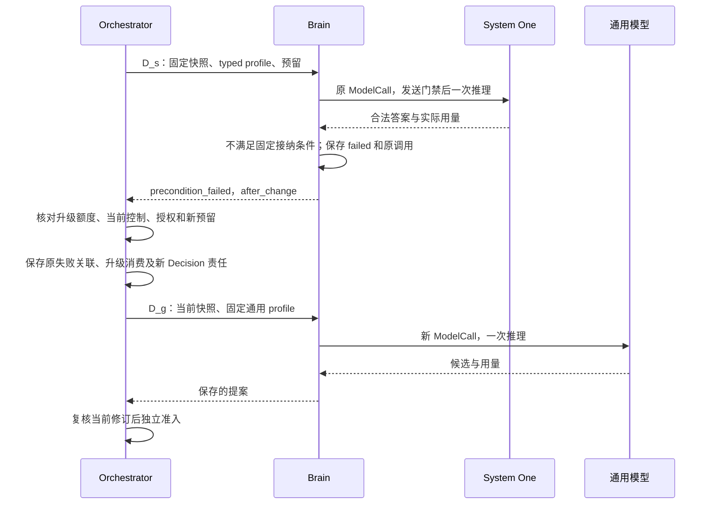

# Brain 决策路径：规则 shortcuts 与 System One 模型

[模块主线](README.md) · [双系统协作](dual-system.md) · [实现与恢复](implementation.md) · [外部模型调研](../../research/system-one-models-2026-09-28.md)

本方案先用已有 `DecisionPolicy` 承载规则 shortcuts：输入已经确定、下一步可以由规则推出时，直接构造提案。剩下的语义工作按固定任务阶段选择模型；有限候选判断可以试验 System One，开放理解和正文综合继续使用通用模型。本专题中的 System One 模型指接收状态与限定问题、输出选项或数值判断的模型，仍属于模型推理，并非确定性规则。在[双系统架构](dual-system.md)中，规则与此类模型共同组成快速决策角色 S1，通用理解、规划与综合组成 S2；本页集中定义三种具体产出路径。

**规则路径已获本轮设计确认；System One 为待评测的可选路径，默认关闭。** 首选 Jev 作为托管试验后端，以报告选页为首个场景。启用前须完成领域质量、实际调用次数、费用准入和故障恢复验证；公开资料尚不足以证明 Jev 满足严格预算所需的单次费用上界。规则、适配器及下文的升级策略均尚未运行实现。现有通用模型路径不依赖这些试验能力。

本文落实 C1 的通用任务决策及 C6–C9 的替换、权限和评测约束。先读第 1–3 节理解分工与任务链，再读第 4–5 节实现配置、异常及恢复，第 6 节定义验收。外部接口、价格与性能证据集中在[调研笔记](../../research/system-one-models-2026-09-28.md)，本文不以供应商实验代替项目实测。

## 1. 三条路径如何分工

Orchestrator 先固定任务快照和 `model_profile_ref`，Brain 在该快照上决定能否直接应用规则；规则未覆盖时，只能调用已经选定的模型。模型配置由既有组装策略按任务阶段及明确输入形状选择，不新增一次模型分类。初次自由文本目标没有可靠阶段信息时，使用通用模型。

| 路径 | 适用输入与产出 | 单个 Decision 的 ModelCall | 代价与改选条件 |
| --- | --- | --- | --- |
| 规则 shortcut | 已理解的完整条件、准确事实与能力足以推出下一步；代码构造 Proposal | 0，返回记录省略 `model_call` | Brain 维护规则覆盖范围和版本；仍需语义选择时进入本轮固定模型路径 |
| System One 模型 | 已有有限候选或固定判断题，需要语义相关性判断；受信代码将答案映射为 Proposal | 至多 1；无自由文本也计一次 | 需准备候选、标注校准及拒判升级；候选无法覆盖开放问题时直接选通用模型 |
| 通用模型 | 目标理解、多步规划、解释和正文综合 | 至多 1 | 单次成本通常更高，是否如此须同题实测；输入或输出可以进一步收敛时再评估前两条路径 |

下图表示一个 Decision 内互斥的产出路径。共同输入检查包括控制、未知效果、必要事实及用途资格；受限模型分支还须经过现有发送门禁。Orchestrator 的当前准入是返回后的独立步骤。

选择三种产出方式只扩展已有策略与适配器，不增加路由服务、长期 Agent 或新的执行权限。用一个便宜模型给所有任务分类，会让原本零模型的工作增加调用，也会让复杂任务先支付一次分类成本；因此不作为默认架构。只有同任务评测证明额外分类的净收益，才考虑这种竞争方案。

## 2. 规则 shortcuts 的执行范围

规则读取当前固定快照，输出新的完整提案，不能重用旧目标下已失效的行动。完整命中要求目标及约束、规则和能力版本、绑定、事实适用性、动作限额同时满足。关键词、单个布尔值、模型宣称“已理解”都不足以证明覆盖任意自然语言；初次理解的约束遗漏必须纳入独立评测。

| 首批规则 | 触发依据 | 新提案及边界 |
| --- | --- | --- |
| 蓝牙 D2：观察 | 已接纳“开启绑定设备蓝牙”的完整条件，设备与观察能力准确，无额外未覆盖约束 | 构造当前设备的 observe；身份和引用来自本轮快照 |
| 蓝牙 D3：开启后观察 | 原观察确认同一设备关闭，状态版本适用，旧效果已核清且控制允许 | 构造 enable → observe_after 有限计划；启用带观察版本，后续观察等待原效果核清 |
| 报告 D2：模板搜索 | 产品、版本、官方来源及比较维度已经确定，模板覆盖全部维度 | 按产品填查询参数；域名可信性不由模型名称猜出 |
| 报告 D3：有界选页 | 受信来源范围、准确 URL、版本及材料类别可以完成确定筛选，数量符合限额 | 构造读取候选正文的独立行动；选页不证明正文支撑结论 |

蓝牙 D1 的自然语言理解保留；若条件在 D1 后更新为 g2，D1 携带的行动和计划全部丢弃，D2 只从 g2 重建。报告 D1 的条件理解、D4 的正文综合及 O7 的独立质量／引用语义评估保留。计划物化、引用回填和文件读回比较继续由现有代码处理。

原[调用分析与逐字段样例](../../../.scratch/architecture-review/model-call-optimization-2026-09-28.md)给出限定 fixture 上的正常路径：蓝牙 2／3 次降为 1 次，报告 5 次降为 4 次，另命中有界选页规则时为 3 次。这些是合成对照，不是任意任务调用上限或实际费用结论。原报告只有四个可按规则筛选的候选，给它另加 System One 没有必要。

规则无覆盖与规则错误须区分：前者才允许按本轮固定模型配置推理；冲突规则产生不同效果、或规则产物校验失败时，保存 `failed / invalid_output`、`retry=after_change` 并省略 ModelCall。Orchestrator 保存策略依赖缺口，待负责方修复并启用新版本后以新 Decision 继续；不能用模型隐藏规则缺陷。等待超过任务期限或策略允许范围时按现有任务失败／终止规则收尾。

## 3. 首个 System One 场景：报告候选选页

推荐先试验规则不能完成的只读选择。例如，搜索返回多篇官方文档，域名和版本已经核实，但哪个页面更可能解释目标部署限制，需要理解摘要。System One 可以给候选评分，减少为这个局部问题生成完整规划文本的需要；其判断只决定下一批读取什么，不决定事实是否成立。

### 3.1 从固定候选到读取提案

1. Orchestrator 组装当前目标、完整比较维度、已取得搜索结果及来源，固定适用于“候选选页”阶段的模型配置。缺产品、来源或候选时，先补相应事实；不能靠评分制造候选。
2. DecisionPolicy 先尝试规则。仍需语义判断时，代码筛除不允许访问、重复或版本不符的候选，保存候选 key 到准确 URL、来源、能力参数的映射。按固定顺序和上限取本批，保存被截断及未覆盖维度；候选超限不能默认为已经搜索充分。
3. ModelAdapter 发送一次受限请求。Jev 的 `state` 带目标与候选材料；按“候选 × 比较维度”生成独立 Score 问题，每题只评该页对一个维度的预期取证价值，明确页 key、目标维度及单维等级描述。问题总数随乘积检查上限，超限则缩小本批候选并保留未处理范围，不能在同 Decision 隐式拆成多次请求。问题名只关联返回结果，**不会进入底层模型**，所以候选身份必须写入问题的 `instructions`。[Jev 请求语义](https://docs.typesafe.ai/api)
4. 同一请求的评分独立读取同一状态，问题之间不能消费答案。代码先按每维度固定接纳条件筛选，再按固定维度顺序取该维度得分最高的页面，并按候选 key 处理并列；合并去重后最多保留 `max_actions` 页。未获候选或因动作限额未选入的维度，在提案 `assumptions` 中明确仍待取证，完整 Requirement 保留不变；这只是预计取证范围，不能据分数声明某维度已核验。多个分数不是相互独立事件概率，不能相乘得出“全部可靠”。
5. 代码从映射复制 URL、准确能力和绑定、条件及证据引用，构造 `act`。`rationale` 用模板说明“依据候选相关性评分选择待取证页面”，不伪造模型解释。ProposalValidator 校验后保存，Orchestrator 复核当前修订、权限和额度，才创建读取操作。
6. Executor 取得正文后形成新的正式事实。下一轮 D4 根据真实正文综合，材料不足便补证；O7 仍独立评估准确报告版本的质量及引用语义。搜索摘要和 System One 分数不能代替正文支撑，也不能直接生成 ConditionResult。

一次 Jev 请求可包含同状态上的多个独立问题，但总输入、最长问题和数量均由本地配置限制；不能在其中安排“先读取网页，再判断正文”。评分结果作为模型派生判断保存，来源包含全部实际处理材料，遵守原有用途和保留规则。[State 语义](https://docs.typesafe.ai/concepts/state)、[并行问题](https://docs.typesafe.ai/patterns/fan-out)

### 3.2 哪些位置暂不替换

| 工作 | 推荐与理由 | 扩展条件 |
| --- | --- | --- |
| 任意自然语言 D1 | 通用模型理解完整条件；固定标签不能表达任意设备指代、时间或附加约束 | 有受信结构化入口，或已提取且可定位的参数候选，并验证“未覆盖／需澄清”判断后，再试有限意图选择 |
| 蓝牙状态与计划后继 | 规则比较准确事实，已有能力契约决定参数 | 不需要用模型重新判断 `enabled=false` 或复制状态版本 |
| 报告 D4 综合与新计划 | 通用模型生成正文并给出计划，继续使用既有内部产出格式 | System One 不生成任意新文本或开放参数；不能直接替换此处 |
| O7 质量与引用语义 | 维持独立评估操作和声明的评估方法 | 将来可评估限定子问题；须单独验证整套评估器的漏判与替换契约，不以选页准确率推断通过 |
| 授权、未知效果、完成归并 | 由原负责方检查当前事实与契约 | 概率无论多高都不能补授权、证明操作未发生或解除未结责任 |

### 3.3 选型与概率接纳

首轮选 Jev 是因为它直接提供 Choice、Score、Noul 三种判断接口，便于在相同候选上测试，无需先维护自托管推理栈；这不是已证实的成本最优结论。AnyJev 的固定问题 head 更适合高频稳定问题、有领域标注及本地部署要求的场景；TypeLLM 保留生成模型及类型约束，适合作为受限输出对照。三者的机制和实验条件不同，具体证据见[路线对比](../../research/system-one-models-2026-09-28.md#5-相邻路线不能按产品名视作等价模型)。

Jev Choice 给选项概率，Score 给有序等级的期望，Noul 给真假概率。Choice／Score 另有分布形状 `confidence`，不能当成该答案正确率；Noul 没有这个独立字段。首轮按任务定义是否采用 Score 的等级期望、分布或供应方 confidence，绑定具体题目及标注结果校准，不设置脱离验证集的统一“0.95 即安全”。[Score 定义](https://docs.typesafe.ai/primitives/score)、[Confidence 定义](https://docs.typesafe.ai/confidence)

候选全集未覆盖、所有分数不满足接纳规则或明确“均不适合”，都应允许拒判。拒判覆盖率高会增加升级成本，但强制选择会将未覆盖问题变成错误行动。已发现候选缺项不能仅靠增设一个“其他”选项声称补齐；缺事实先补事实，尚有语义选择才考虑通用模型。

## 4. 在现有 Brain 中怎样实现

### 4.1 固定配置与职责

公共 `brain.decide / get / cancel`、DecisionRequest、DecisionRecord 和 Proposal 形状保持。ModelProfile 的新增可选编码 `typed_decision` 及 `decision_spec_ref` 在[契约查阅](README.md#brain-contracts)定义；仅供本路径使用。`decision_spec_ref` 指向安装配置中的不可变决策规格，无独立注册服务。Orchestrator 固定 profile 时同时固定其引用闭包，不能让相同 profile 运行时读取“最新版阈值”。

| 决策规格内容 | 固定规则 |
| --- | --- |
| 适用范围与候选构造 | 任务阶段、支持约束、准确能力版本、来源资格、候选顺序及数量、截断和缺项行为 |
| 问题与模型 | 精确供应方模型版本、原语、instructions、等级／选项说明；问题模板及动态候选绑定均进入最终请求摘要 |
| 答案接纳与映射 | 每题的校准产物版本、阈值、拒判条件、并列顺序、结果到 Proposal 模板的映射 |
| 资源边界 | state、单题、总输入、问题数及响应大小上限；一次实际推理请求，不隐藏重试、修复或补充查询 |

DecisionPolicy 接收固定领域值，检查覆盖、候选与答案接纳条件，并构造提案；不访问模型或数据库。ModelAdapter 只编码请求、校验供应方原始响应并提供调用事实。RecoveryWorker 复用既有准备、用途门禁、发送和终态流程，DecisionStore 沿原记录保存版本、候选映射摘要、调用与获准诊断。无需新增数据表；禁止保存的原文或分数不因调试需要绕过保留策略。

响应检查先验证真实模型版本、题目集合和类型，再检查有限数值、概率范围、完整选项及分布归一容差。Choice 的 choice 须与最大概率选项一致；Score 的 legend 须逐项匹配固定 criteria，等级键完整，score 位于 `[0,K−1]` 且在约定容差内等于 `Σ(i × p_i)`。容差和并列处理按供应方契约固定；未公开的 confidence 公式不自行猜测。最终候选必须仍能映射回本轮准确引用，随后接受原 ProposalValidator。它只检验契约，不证明模型选对了页面。

受信映射可构造现有 `brain-generation/1` 内部模板：只读选页不产生新正文，`contents` 为空；若规则构造新的有限计划，按既有内容发布流程保存再回填引用。模型不生成 ContentRef 摘要、Grant、金额、设备身份或未知 URL。新正文发布的失答复仍恢复原 publication，不重新推理。

### 4.2 物理调用、费用与供应方边界

这里“一次物理模型推理”包括不生成自由文本的 Jev 请求。供应方内部采样不是 Harness 能观测的调用边界；适配器发出的每个独立请求或本地独立推理执行都必须可计量。一个 SDK 方法若展开成多次请求，不能登记成一个 ModelCall。AnyJev 的多候选旋转及 TypeLLM 的多字段请求须检查实际执行；不符合单次边界的模式不进入本版 profile，不能用一次外层 HTTP 包装掩盖多次执行。

Jev 适配器须关闭 SDK 和代理的透明重试，固定模型版本并核对返回版本；初始实验可用调研时的 `jev-1.13.0`，不以 `jev-latest` 作为冻结评估对象。HTTP 返回的输入／输出 token 按实际保留；输出当前免费不表示 output_tokens 为零，用量缺失不能填零，也不自动意味着 `usage_final=true`。[版本与限制](https://docs.typesafe.ai/models)、[SDK 与恢复缺口](../../research/system-one-models-2026-09-28.md#4-与-harness-调用契约的适配缺口)

本次未找到服务端幂等、查询原结果、取消后结算终结或可信单次费用上界的完整公开承诺。严格预算模式下，上界未核实便不激活该 profile。现有估算模式还要求用户已接受估算、费用 Grant owner 与原 Task 同受信提交域且在线、无 allocation 等完整前提；本方案不新增估算授权，也不把牌价乘输入上限视为硬上界。发送后失联且不可查原结果，沿[原模型恢复](README.md#model-recovery)结束为 `provider_result_unknown`，保留费用责任。

### 4.3 拒判、错误和升级分别处理

接纳阈值是本轮已固定的前提。合法答案未达到该前提时，使用已有 `precondition_failed / after_change`，不把它当成格式损坏。本轮只保存失败、已返回的 ModelCall 与用量，不能在相同 decision_id 内再调用通用模型。

| 情况（按先决条件顺序判断） | Brain 记录 | 后续责任 |
| --- | --- | --- |
| 控制／权限不允许，或存在未核清外部效果 | 按现有控制、`forbidden` 或原未知责任处理 | 原负责方解决，不用模型升级绕过 |
| 必要事实或能力缺失 | `need_context` 或 `context_incomplete`，新外部取证仍经正常行动 | Orchestrator 补充获准事实；依赖不可用则等待，不用升级探活 |
| 输入不在已固定 typed profile 的支持范围，尚未发送 | `failed / unsupported / after_change`，无 ModelCall | 满足下述策略时，Orchestrator 可另建通用模型 Decision |
| 返回内容违背类型、选项、数值或版本约束 | `failed / invalid_output`，保留原调用事实 | 按既有有限修复策略另建 Decision；不适用下述正常拒判升级 |
| 返回合法，仍有语义选择，但没有可采用答案 | `failed / precondition_failed / after_change`，ModelCall 为 returned | 满足下述策略时，Orchestrator 可另建通用模型 Decision；没有可用预算便等待或收尾 |
| 可能已发送而结果不可核对 | `provider_result_unknown`，调用及费用保留未知 | 先恢复原调用；不存在“置信度低所以重试”的依据 |
| 提案已保存，但目标／控制／能力已变 | 保留原 Decision 终态，Orchestrator 拒绝原候选 | 新快照重新检查规则和配置，旧分数不能沿用到新候选 |

升级复用 Orchestrator 现有“失败后换新 Decision”的入口，所需固定策略须在启用试验前实现：依据原 profile 的 typed 类型、上述错误码及 ModelCall 是否 returned／缺省、本次决策链的升级记录判断，禁止解析错误文案路由。只对 `unsupported` 或合法拒判允许一次定向升级，新的尝试也计入任务总轮数、期限和费用。配置不支持升级时，该 profile 不作为自动试验路径启用。

选页阶段可能尚无正式计划，升级额度不能依赖 plan_id／step_id。Orchestrator 在首次 typed Decision 接纳前，用该 decision_id 作为本次决策链的根，随当前阶段保存内部关联；存在计划时再附步骤引用。相同目标修订、相同阶段下已有未关闭关联时，失败、补上下文、候选修订和重启均沿用它，不重置额度。只有提案已被准入并推进到读取等下一业务阶段、目标修订导致原链失效或任务终止时，才关闭该关联；仅记录失败不能重新开链。

Orchestrator 将原失败、新 Decision、链根及已消费的升级额度，与当前快照、新模型配置和调用责任共同提交；恢复时读取原关联，不能重复扣额或另建升级。`after_change` 此时指配置改为已指定通用模型并重新核验当前输入，原 Decision 不变。预算或授权不足时不得发送；任务策略允许等待则保留具体恢复条件，否则按原任务规则收尾。通用模型仍失败时使用原有限修复／失败机制，不循环回 System One。

下图仅表示合法拒判的升级，不代表所有错误都走此分支；结果返回但费用未结的责任继续留在原调用。

## 5. 收益怎样计算

先与规则优化后的路径比较。规则能解决时 System One 增加成本；只有原本需要模型的语义选择，才有替换收益。报告 R4 的正常路径将 D3 换为 System One，仍为 4 次模型调用，只改变其中一次的模型与用量；D3 拒判后再调用通用模型变为 5 次。R3 已由规则选页，为 3 次，无须插入新模型。以上仍保留 O7 的跨模块评估计数。

设该语义步骤直接用通用模型的平均成本为 `C_g`，System One 为 `C_s`，升级率为 `r`，新增整理／校准摊销成本为 `C_o`。仅在其余步骤成本及质量相同时，替换路径的粗略成本为 `C_s + r × C_g + C_o`，模型调用期望为 `1 + r`。若升级子集的通用调用更贵，必须用该子集的实际均值；后续补证、返工、错误处置和未知费用另纳入完整任务账本。自托管还计 GPU 空闲、装载、运维和标注，不能只用活跃推理时间估算。

时延按完整任务轨迹统计，包含组装、排队、持久化、网络、模型、升级及后续读取。拒判路径的串行等待可能拉高尾延迟；p95 不能由各阶段 p95 相加得出。公开 Jev／AnyJev／TypeLLM 数字只用于提出实验假设，不承诺本项目更快或降低某个百分比。

## 6. 验证、启用与后续范围

先实现可离线重放的规则和 typed 答案映射，证明字段来源、拒判及恢复分支；再在有完整费用和用途依据的隔离环境做真实对照。比较组为当前通用路径、规则优化路径、规则加 System One、规则加受限输出通用模型。按[评测设计](../evaluation/README.md)划分 dev／select／holdout，并按任务来源分组去重；公开 JevBench 只作探索，不当独立验收集。模型、题目、阈值或候选构造改变均形成新配置并重新评估。

| 验证项 | 输入或故障 | 必须观察到的结果 |
| --- | --- | --- |
| 规则与范围 | 蓝牙开／关、附加“不影响连接”、规则冲突、陈旧观察 | 只在完整覆盖时零模型；新约束不丢失，冲突不隐式调模型，旧效果继续核对 |
| 语义质量与校准 | 中文／英文、否定与指代、候选缺项、改名重排、说明冲突、注入文本 | 独立标签下统计采用后错误率、拒判率、覆盖率；Choice／Noul 按匹配标签计算 Brier／ECE，Score 按等级质量与分布校准分别报告 |
| 全任务质量 | 选页后真实抓取、报告综合及 O7 | 任务成功、约束遗漏、引用支撑和后续补证不因局部提速恶化；标签及评估方法先冻结，关键错判单列 |
| 一次调用边界 | SDK／代理重试、多个问题或字段、响应格式错误 | 每次底层请求可计量；本轮不多发，真实多调用模式被拒绝或另行设计 |
| 拒判升级 | 低分、支持范围变化、费用不足；H 保存升级后重启 | 原调用费用保留；新 Decision 最多消耗一次既定升级额度；重启不重复创建或发送 |
| 外部未知与取消 | 发送后丢响应、usage 缺失、取消、迟到结果与账单 | 不补零、不盲目重发；原恢复／费用责任保持，取消或过期提案不执行 |
| 配置及产出 | 返回版本漂移、问题遗漏、NaN、Score 与分布不一致、未知候选、阈值变化、保存失答复 | 固定版本与本轮映射可核对；无效输出拒绝，原 publication 恢复不再推理 |
| 成本与时延 | 同任务、相同来源与约束、匹配网络／并发条件 | 全调用、全费用及端到端 p50／p95 同口径；明确样本数、误差区间与未知账单 |

标签由领域评审者依据明确规则建立，模型生成的答案不能独自充当真值。阈值在 select 集确定后冻结，holdout 报告采用后错误率及不确定区间；任务量不足以支持错误率上界时继续收集，不把“样例全过”当可靠性证明。质量容忍度、费用目标和延迟门槛由对应任务的激活标准预先确定。

启用顺序为规则 shortcut → 报告选页隔离对照 → 限定阶段小流量；typed profile 只在适配器、费用依据、恢复及升级策略均落实且评测通过后激活。漂移或不满足门槛时，由配置负责方停止新 typed 决策并改回规则加通用模型；在途 Decision 仍沿原版本恢复，不追改输入或清除费用。AnyJev 本地固定问题、有限意图选择和 O7 子判断属于后续单独评估范围。

本轮交付为应用设计与资料调研，没有运行 Harness、设备或模型请求；没有本项目准确率、费用或延迟实测结论。
