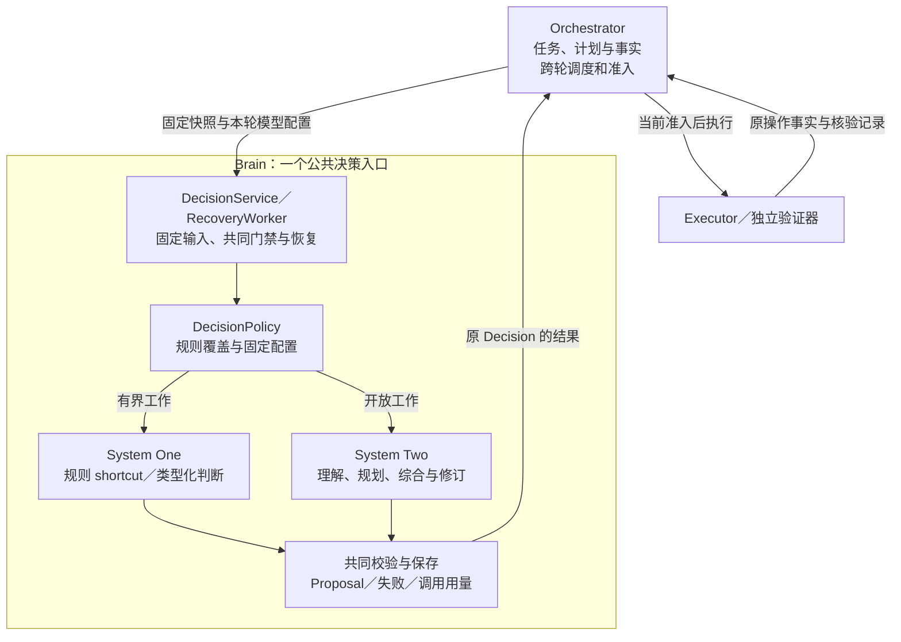

# Brain 双系统协作：快速判断与审慎规划

[Brain 契约](README.md) · [规则与模型决策路径](decision-paths.md) · [实现组件](implementation.md)

推荐把一个 Brain 组织为 System One 与 System Two 两种决策角色，共享上下文读取、调用恢复、提案校验和记录。System Two 将开放目标转化为可推进的问题与计划，System One 在已明确的边界内连续处理局部判断；新问题、拒判或计划不再适用时，再由 System Two 处理。跨轮调度和行动准入仍由唯一的 Orchestrator 负责。

这是在已确认规则 shortcuts 上补充的参考架构设计，尚未运行实现。首期协作覆盖已知任务阶段，复用现有公共协议；任意模型生成的子问题自动委派给 System One，仍缺少结构化交接契约，范围见第 6 节。Jev 等模型的质量、费用和恢复启用条件继续遵守[接入方案](decision-paths.md)。

## 1. 两个系统分别承担什么

本文的 **System One（S1，快速决策系统）** 是架构角色，包括确定性规则及适合有限语义判断的类型化模型。上一份调研中的“System One 模型”只是其中一种实现；规则命中不调用模型，Jev 推理仍计一次模型调用。**System Two（S2，审慎决策系统）** 负责开放理解、规划、综合和重规划，通过通用模型实现。角色名称不保证每次 S1 都更快，也不保证 S2 判断正确。

| 职责 | System One | System Two |
| --- | --- | --- |
| 问题形状 | 问题、候选、输出范围和接纳规则已经确定 | 还需理解目标、补全问题边界或组织多个步骤 |
| 典型工作 | 已知状态到下一步的规则映射、有限候选选择、单维相关性判断 | 理解完整约束、提出条件、分解目标、处理来源冲突、综合正文、修订计划 |
| 产出 | 本轮 Proposal，或明确缺口／拒判；模型分数保留派生性质 | 相同 Proposal 契约，可包含条件建议、计划或新正文引用 |
| 不确定时 | 返回可追溯失败或缺口，交既定升级策略 | 选择取证、澄清、缩小问题、修订计划或失败，不能用语言消除未知效果 |
| 可复用内容 | 已激活的规则、决策规格与准确模型配置 | 已接受的条件、计划与获准经验；不能直接修改正在使用的规则或阈值 |

两者均提出建议。Executor 执行工具，Orchestrator 裁决行动和任务完成，独立验证器提供条件核验依据。已有计划可以由 Orchestrator 直接物化时继续走该机制，无须制造一个 S1 调用或 Decision 来承担原本已经确定的工作。

## 2. 在一个 Brain 内装配

下图是调用与责任视图。S1、S2 为同一 Brain 的内部策略及模型适配路径；共享组件复用已有实现职责，框不表示必须独立部署。双系统通过 Orchestrator 保存的任务事实和下一轮快照接续，图中没有两个自行推进任务的循环。

实现上，规则和候选／答案映射放在现有 DecisionPolicy，S1 类型化推理和 S2 通用推理使用对应 ModelAdapter；ContextReader、DecisionStore、RecoveryWorker、ProposalValidator 共用。无需为两者各建任务库、授权系统、持久队列或外部 API。模型池可以按配置分别限流、扩容，身份、来源和费用仍沿同一套记录关联。

选择哪种决策的责任分两处：Orchestrator 在组装快照时按固定任务策略选择本轮 profile；Brain 检查规则覆盖，命中则直接返回，否则使用该 profile。两处使用相互兼容的固定策略版本。Brain 不能读到 S1 分数后在原 Decision 内暗换 S2，模型也不能自选更大的预算、候选权限或执行范围。

默认采用阶段分工，有两个直接收益：通用目标没有前置分类调用；S1 成功的结果不再无条件送 S2 重判。代价是需要维护明确的阶段条件和 S1 覆盖范围，陌生任务可能仍主要依赖 S2。全程 S2 是覆盖不足时的简单替代；每步 S1＋S2 双跑仅适合单独批准的评测或已证实值得支付双份成本的判断，不作为默认执行链。

## 3. 在线协作靠什么交接

协作有三个方向：S2 把问题组织到 S1 能覆盖的阶段；S1 把不能采用的结果交回 S2；执行反馈让下一轮重新判断当前计划是否仍适用。交接依据是可定位的内容和事实，不要求保存或传递模型的隐含推理。

| 交接 | 传递内容及持久负责方 | 何时可以继续 |
| --- | --- | --- |
| S2 → 下一轮 S1 | Brain 保存条件／计划提案；Orchestrator 接受后保存准确版本，将对应事实和当前局部问题组装进新快照 | 完整约束已固定，当前阶段被已安装 S1 规格覆盖；并非 S2 说“简单”就可进入 |
| S1 → 下一轮 S2 | Brain 保存原 Decision、拒判类别及原调用；Orchestrator 保存决策链关联和升级消费 | 满足既定拒判／不支持升级条件，当前授权、额度与期限允许，新 Decision 才调用 S2 |
| 执行 → S1 或 S2 | Executor／其他事实 owner 保存准确输出；Orchestrator 归并并保存新的任务快照 | 已核清所需效果，事实适用；只更新下一轮输入，不改写在途 Decision |
| S2 → 后续快速步骤 | 已接受计划中的准确行动模板与字段绑定，或者安装规格覆盖的下一阶段 | 前者由 Orchestrator 物化，后者创建新的 Brain Decision；均逐项准入 |

### 3.1 S2 怎样让 S1 有事可做

S2 先把开放问题转为具体目标、完整约束、取证步骤及预期产出。例如，研究任务从“比较两种方案”变为有准确产品、版本、比较维度和来源范围的任务。取得搜索候选后，已安装的选页规格才能构造有限评分问题。S2 的作用是逐步建立这个边界；候选、能力和当前授权仍由负责方核对。

首期复用 `requirements_proposal`、`plan_delta`、BrainContext 的材料与事实。现有计划步骤只有 `instruction`、条件引用、依赖、可选行动模板及绑定；**没有通用的 S1 子问题、问题模板或 profile 指派字段**。无行动模板的步骤交给后续 Brain 展开；指令文本只表达目标，不作为隐含配置语言，也不能靠匹配模型生成的“选页”二字认定阶段。

已知阶段由宿主的固定策略从已接受目标结构、准确来源操作类型、待推进步骤与完整输入形状识别。无法无歧义识别，或模型提出了未安装的新题型时，继续使用 S2。当前方案因此允许已知阶段的 S2→S1 接续，尚不承诺任意计划都能自动编译为类型化子问题。

当前 S1 类型化答案由代码映射为 Proposal；公共协议没有通用“局部答案”返回类型，计划的 step_output 也只读取前项操作／委派输出。因此首期以“规划 → 取证 → 局部行动选择 → 新事实 → 综合”协作，不把 S1 任意评分当成一个已经完成的计划步骤。若要先让 S1 输出纯认知结果，再让 S2 消费，须补齐派生答案制品、来源及计划进度绑定，归入第 6 节通用委派范围。

S2 若在同次提案中补全条件并给出计划，且条件被接受后改变目标修订，旧提案的行动和计划仍全部失效。下一轮基于新目标重新构造；不能为追求“一次规划、多次快速处理”跳过[提案消费规则](../orchestrator/implementation.md#proposal-consumption)。

### 3.2 S1 怎样交回 S2

只在仍有语义选择、输入未被支持或答案未满足固定接纳前提时，应用[拒判升级](decision-paths.md#43-拒判错误和升级分别处理)。原失败有自己的 Decision；S2 在新的 Decision 接收当前完整上下文、原问题、准确候选及获准的拒判诊断。S1 的分数和答案标为模型判断，避免被 S2 当成已确认事实；重新读取这些派生内容仍需来源与用途资格。

同一决策链最多一次既定 S1→S2 升级，根身份和关闭条件沿用原方案。S2 在该链内负责给出可采取的下一步、补证、澄清或失败；不能把原问题原样交回 S1，借换题面、模型或候选版本重置升级额度。实质推进到下一业务阶段后，才按新阶段重新判断能否进入 S1；任务总轮数、费用和期限始终累计。

新事实与原计划冲突时先判断冲突性质：状态过期或原效果未知交负责方取证／核对；用户意图或计划假设需要重新解释才交 S2。权限不足、预算耗尽和依赖不可用各有自己的恢复条件，不能统一包装成“交更强模型”。高影响动作的门禁与语义不确定性分别判断，S2 高置信度也不降低执行确认要求。

### 3.3 共用状态，按需读取

S1 和 S2 读取同一任务事实的不同获准视图。S1 保留完整硬约束、当前问题、准确候选与必要事实；S2 根据理解、规划或综合的需要读取更广材料。按需读取可以减少输入，但不能把“不提供某项约束”当作优化，也不能在当前 Decision 中隐含再调用一个模型压缩输入。

目标和计划由 Orchestrator 保存，操作事实由原 owner 保存，Decision 与 ModelCall 由 Brain 保存，长期经验由 Memory 按独立用途管理。双方不维护互相覆盖的“真实状态”。旧结果只有在版本、来源及当前资格仍满足时，才可作为下一轮材料使用；“曾经高分”不构成跨快照缓存命中规则。

## 4. 贯穿例子：研究报告

下表表示一次任务中角色如何交替，不是每项都要调用模型。D 标识仅用于说明顺序；目标修订、修复和补证会增加实际决定，调用次数以完整账本为准。

| 阶段 | 负责路径 | 产出与下一步 |
| --- | --- | --- |
| D1 理解目标 | S2 | 提出产品比较的完整条件；Orchestrator 接受新条件后，另建当前快照 |
| D2 搜索规划 | S1 规则 | 已有准确查询参数时填模板，Orchestrator 准入搜索；缺少开放参数理解则使用 S2 |
| 搜索结果归并 | Executor／Orchestrator | 保存真实搜索结果、来源和缺口；宿主据固定规则识别候选选页阶段 |
| D3 选页 | S1 规则或类型化判断 | 规则先行；必要时一次模型请求按候选 × 维度评分，提出读取行动 |
| D3 拒判后的新决定 | S2，仅在升级成立时 | 基于当前候选重新选择、提出补搜或请求澄清；原 S1 费用保留 |
| 正文取得 | Executor／Orchestrator | 取得准确内容并核对来源；短缺和冲突分别进入下一快照 |
| D4 综合与后续计划 | S2 | 综合正文，提出独立评估、通过后写入、读回的有限计划 |
| 验证、写入、读回 | 独立验证器、Executor 与 Orchestrator | 已确定计划按事实推进；评估不通过交 S2 修订，未知效果先核对，完成由 Orchestrator 裁决 |

这条链的主要收益来自减少局部判断对完整规划的重复。S1 结果可采用时直接进入取证；只有拒判、开放综合或需要重规划时使用 S2。报告质量及引用语义仍经独立评估，不能把“规划模型赞同选页模型”当成已验证任务。

## 5. 离线协作：把稳定经验变为快速能力

在线协作解决当前任务；跨任务改进复用已有[评测与受控发布](../evaluation/README.md)。从获准轨迹中识别反复由 S2 解决的同类局部问题，可以形成规则补丁、问题模板、候选构造配置、Skill 或模型校准产物候选。S2 可以协助提出这些候选，但产出没有自动激活权。

改进链为“获准轨迹及反例 → 候选登记 → 冻结的基线对照 → 独立评估 → 受信批准 → 有限激活 → 监测／回退”。规则代码还须维护者审查；运行资料是否允许保存、提取或训练分别核对。S2 输出可以作为待核标签，不能独自成为训练或评测真值；正式保留集也不能回流到候选生成过程。

这使高频且边界稳定的工作逐步进入 S1，同时让 S2 保留对新任务的覆盖。代价由维护者承担：标注、反例覆盖、版本管理与退化监测。高频不等于适合规则化，约束持续变化、可验证标签不足或维护成本超过调用收益时，继续保留 S2。蒸馏或训练属于后续候选实现，不能因双系统分工就声称模型会自行学习。

## 6. 交付范围与验证

| 范围 | 当前可复用的设计 | 仍须落实的条件 |
| --- | --- | --- |
| 两种决策角色 | 一个 Brain 入口，共用上下文、记录、校验与恢复；不同固定 profile | 参考实现、各模型资源隔离与真实测量 |
| 已知阶段协作 | 当前条件／计划／事实、宿主阶段策略、固定 typed 规格及拒判升级 | 阶段识别与规格兼容、升级共同提交、完整故障验证；缺失时不启用该 typed 阶段 |
| 通用 S2→S1 结构化委派 | 现有计划 instruction 只能表达待展开目标 | 后续若有多种任务重复需要，可提案增加有限问题模板引用、输入／候选绑定及规格版本，并定义派生答案制品与步骤完成依据；同步计划 Schema、Brain 产出校验和 Orchestrator 接纳规则后再启用 |
| 经验进入 S1 | 现有候选、评测、发布与激活体系 | 每项候选独立证据与发布资格；没有自动自修改权限 |

通用委派的竞争方案是继续由宿主识别少数明确阶段：配置较简单，但新增题型需要开发接入。只有固定阶段映射开始反复出现且确有通用交接需求时，才增加结构化计划字段；不能现在把新字段塞入 `instruction` 或 `assumptions`，也不新增一套并行的子任务状态机。

验收除单次模型表现外，还覆盖协作本身：S2 条件修订后的旧计划失效、S1 约束遗漏、候选缺项、拒判升级后重启、无进展来回切换、计划与新事实冲突、相同原因被误判为权限／语义问题、在途取消及迟到账单。每例分别核对当前事实、下一责任、可否调用模型与何时可以执行。

对照“全程 S2”“规则加 S2”“规则及类型化 S1 加 S2”，用同任务集比较完整任务成功率、约束遗漏、升级及返工次数、费用与端到端时延。逐轮 S2 复核若作为单独实验，记录它的全部调用与增量价值；不得把该实验的质量成绩和不复核路径的成本拼成一个结论。

本轮完成双系统职责、交接与演进设计，没有修改公共协议或邻接模块的权威契约；没有模型、服务或故障实测。实现方式继续保持一轮零次或一次模型推理，S1 与 S2 的多次协作发生在多个可恢复的 Decision 之间。
