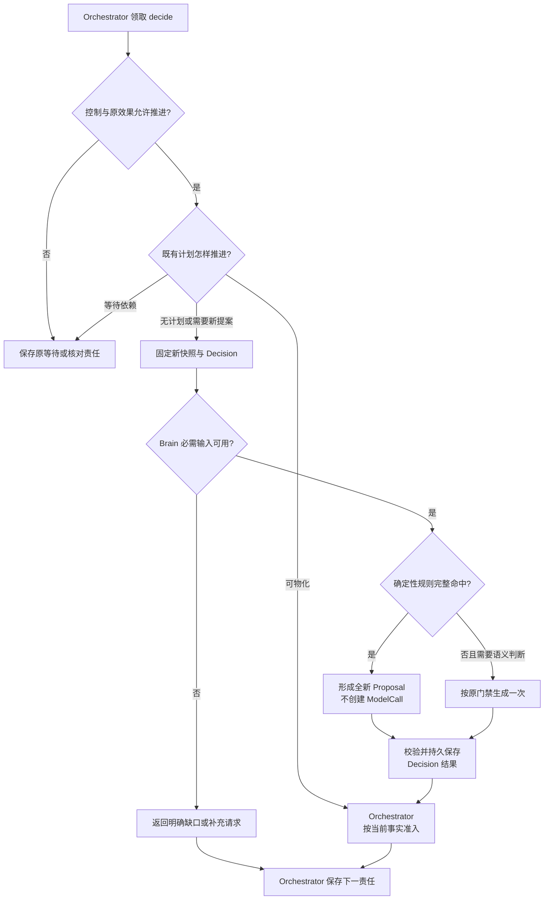
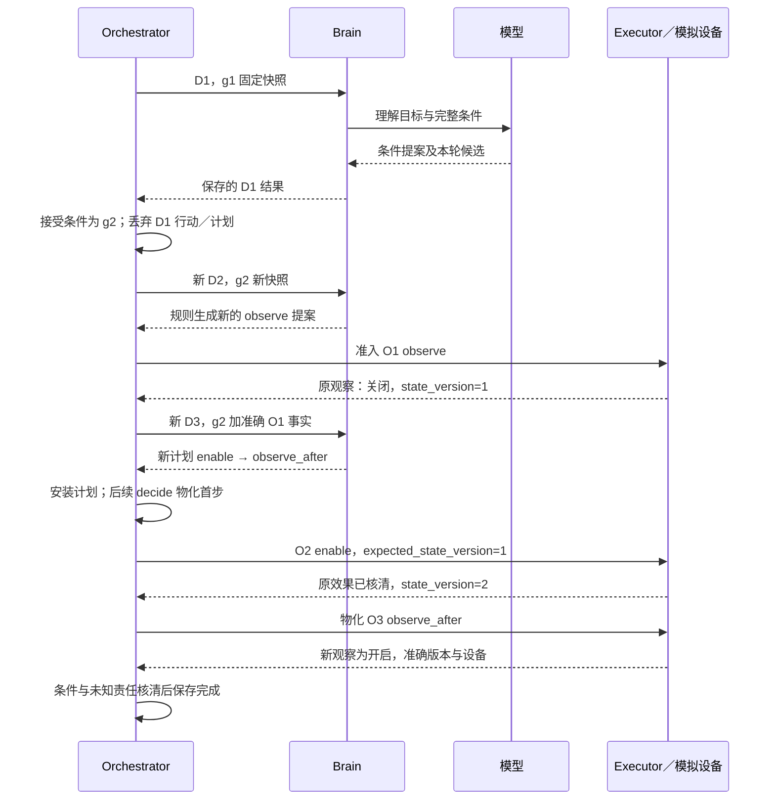

# 模型调用优化：逐次必要性、规则边界与对照验证

日期：2026-09-28。状态：评审方案与合成对照；规则尚未接入 Harness，模型、设备与供应商费用均未实测。

本轮推荐先在既有 Brain `DecisionPolicy` 内补充有界规则：蓝牙只保留首次目标理解的模型生成；报告先替代搜索规划，再验证有界选页。每次规则返回仍形成当前快照上的新提案并接受原准入检查。优先级是减少不必要生成、缩减剩余调用的输入输出、最后按任务评测选择模型和缓存配置。

本稿承接[原实例与成本账本](task-scenarios-input-output-2026-09-28.md)，保留其 2／3／5 次基线。先读第 1～2 节看调用边界与逐次理由，第 3～5 节看规则输入、字段产生和异常，第 6～8 节看成本与验证。正式字段仍以 [Brain 契约](../../docs/architecture/brain/README.md#brain-contracts)、[计划格式](../../docs/architecture/brain/implementation.md#finite-plan)及[提案消费](../../docs/architecture/orchestrator/implementation.md#proposal-consumption)为准；本稿不新增公共方法、状态或字段，不把候选规则写成已启用能力。

## 1. 要减少的是哪些调用

`decide` 是 Orchestrator 保存的推进责任，可能物化既有计划，也可能调用 `brain.decide`。`brain.decide` 固定一次 Decision；Brain 可以通过规则直接返回，只有需要生成时才创建 ModelCall。因此，**目标改变后需要新的决定责任，不推出必须再生成一次**。现行依据见 [Brain 的零或一次生成](../../docs/architecture/brain/implementation.md#data-flow)。

原实例选定了“每个 D 都生成”的自然语言基线。下面的候选只改变其中指定 Decision 的产出方式；操作和完成核验的业务步骤保持原义。

| 轨迹 | 原模型生成 | 候选模型生成 | 保留的生成 | 成立条件与成本承担方 |
| --- | --- | --- | --- | --- |
| B+：蓝牙已开启 | D1、D2，共 2 次 | 1 次 | D1 理解目标及完整约束 | 新 g2 快照命中观察规则；Brain 维护规则，Orchestrator 仍保存 D2 与准入责任 |
| B−：蓝牙关闭 | D1、D2、D3，共 3 次 | 1 次 | D1 | 新观察确认关闭，D3 命中开启规则；驱动承担状态版本、原操作核对及接管保证 |
| R4：报告保守优化 | D1～D4、O7，共 5 次 | 4 次 | D1、D3、D4、O7 | 已有结构化查询参数，D2 由规则产生；选页仍用模型 |
| R3：报告进一步优化 | 同上 | 3 次 | D1、D4、O7 | 另需命中有界选页规则；材料不足会增加补证与决策，不能保证总是 3 次 |

这些是无失败、无补证、无修复的候选正常路径，次数不是所有自然语言任务的上限或下限。`O7` 是 Executor 中的评估生成；总量必须跨 Brain 与评估服务归并，不能只数 Decision 或只看 Brain 的 `generations`。

### 1.1 为什么先用现有规则入口

当前链路中，D2 的蓝牙设备参数已经固定，D3 的启用前提由实际观察给出。继续为这些选择生成文本，会重复支付模型处理和串行等待；新建一个路由模型又会加入一次生成。将有限映射放入已有 DecisionPolicy，不需要增加模块、任务流程语言或跨模块接口。

代价是 Brain 实现方需要维护精确的命中范围，能力或规则升级后重新校验。只匹配工具名、关键词或“看起来像简单任务”不够：越出覆盖范围时保留通用语义决策；缺权限、未知效果等问题则由原负责方处理，不能交给更强模型绕过。

| 竞争方案 | 本轮选择理由 | 何时改选 |
| --- | --- | --- |
| 每次新事实都调用模型 | 对开放选择有用，但本例固定参数与下一步不需要新的语义判断；先测规则命中路径 | 规则覆盖率低、维护代价高或任务约束持续变化时，由通用模型承担相应选择 |
| 结构化按钮入口，直接固定目标条件 | 可进一步省 D1，但改变入口前提；不能用它证明自然语言任务无须理解 | 产品确有“对这台设备开启蓝牙”受信入口，完整条件及设备身份可由应用提供时另测 |
| 一个 `ensure_enabled` 能力完成整个效果 | 能减少目标往返，但需新能力合同与驱动保证，本轮无需依赖它 | 实测设备往返主导延迟，且驱动能核对原操作、接管和最终状态时单独评审 |
| 把分支塞入计划脚本 | 现有有限计划只支持依赖、字段绑定及通过条件；D3 由规则作出后即可生成无分支计划 | 只有独立需求证明有限计划不足时再评审表达能力，不为本例增加脚本运行器 |

## 2. 每一次生成为什么存在

| 调用 | 原基线完成的工作 | 本轮处理 | 缺失或越界后的行为 |
| --- | --- | --- | --- |
| 蓝牙 D1 | 从目标形成 Requirement，保留用户约束 | 保留一次语义生成；可在同次理解中识别任务类别，不额外调用分类模型 | 设备指代或目标有歧义时澄清；未完整理解的约束不进入规则快路径 |
| 蓝牙 D2 | g2 下提出读取绑定设备状态 | 根据当前目标、准确观察能力和绑定构造全新 `act` | 目标含规则不认识的条件则回语义决策；能力或绑定缺失则补充依赖 |
| 蓝牙 D3 | 观察关闭后提出 enable→observe_after | 依据准确新事实构造全新有限计划 | 观察过期则重新取证；存在未知旧效果则先核对原操作；额外语义约束才需模型 |
| 报告 D1 | 固定比较、来源和文件条件 | 保留；仅给出 Requirement 不等于提供了所有查询参数 | 缺产品、版本或比较含义需理解／澄清；官方身份来自受信登记或核实 |
| 报告 D2 | 为两项产品生成搜索请求 | 以准确产品、版本及支持的比较维度填查询模板 | 缺字段不默认补齐；维度不受支持或需策略选择时模型规划 |
| 报告 D3 | 从搜索候选中选择待获取正文 | R4 保留模型；R3 使用第 5 节的有界候选筛选 | 筛选空集或超过明确范围时记录缺口并决定补搜／模型选页；选中不证明材料足够 |
| 报告 D4 | 读取正文、综合报告并形成评估／写入／读回计划 | 保留一次生成；报告与计划已在原基线中合并 | 正文不足或冲突时补证／保留限制，不能用摘要填补依据 |
| 报告 O7 | 独立判断质量和引用语义 | 保留一次生成中的两个独立判断 | fail 阻止写入；unknown 保留核验／补证责任；修改候选后重新评估准确版本 |
| 计划物化、内容引用回填、文件读回比较、完成归并 | 固定步骤、引用与客观事实比较 | 维持原来的零模型处理 | 缺实际事实便查询或等待；最终汇总不另加一次生成 |

报告 D4 的综合与计划、O7 的质量与引用语义在原例中已经合并，不能再计为本轮节省。标题、链接、摘要匹配也不能替代 O7 的引用语义判断。

## 3. DecisionPolicy 怎样选择

图从一次 Orchestrator 推进责任出发，箭头表示处理顺序。计划物化在 Orchestrator 内；规则与生成二选一发生在 Brain 内。所有行动继续经过原准入。

控制检查和规则输入校验不是授权最终裁决；在快照形成后发生的撤权、暂停或修订，仍由 Orchestrator 在消费事务及 Executor 启动门禁拦截。图中的“等待”和“缺口”是现有工作处理结果，不新增 `Proposal.wait` 等公共 kind。

### 3.1 输入、来源与产生代价

规则使用 ContextReader 已取得的准确材料，在 DecisionPolicy 内执行纯映射；不直接查询数据库、网页或设备。需要新事实时由 Orchestrator 组织原只读补充或普通 Operation。

| 输入或产出 | 权威来源／产生方式 | 是否需要模型 | 缺失时处理 |
| --- | --- | --- | --- |
| `task_ref`、`snapshot_revision`、`goal_revision`、控制与未决效果 | Orchestrator 固定快照；策略只读 | 否 | 不用当前 Task 临时拼回旧快照；恢复原责任或重新组装 |
| 完整 `requirements`、原目标与约束 | 已消费的条件修订、准确 `goal_ref` 正文 | 自然语言的首次解释需要本例 D1 | 未覆盖的条件／歧义使规则不命中；不能按一个 rule_ref 推断所有原文都已理解 |
| 设备、产品、版本、主机与路径 | 原目标中的受信结构化字段及准确登记 | 原样例预置；一般输入未必具备 | 用户指代需澄清，官方身份需核实，不从模型猜测取得权威 |
| `capability_ref`、`binding_ref`、完整参数 Schema | 固定能力声明及实例绑定 | 否 | 原目录补充；未就绪或版本不兼容时不形成可执行候选 |
| 观察值、状态版本、时间、操作输出引用 | 已归并的原 Operation 与准确正文 | 否 | 查原结果或提出新观察；不据旧缓存／自然语言判断补造状态 |
| `decision_id`、`action_key`、计划及正文身份 | 原接纳方分配 Decision；受信构造器分配局部键和新内容身份 | 否 | 复用现有有界身份／发布机制；未落实时保持实现缺口 |
| `rationale`、`purpose`、`requirement_refs`、参数字面量 | 规则固定解释模板、原条件 ID 与已核对材料的字段映射 | 命中时否 | 映射不唯一、字段不在声明中时拒绝命中，不猜 ID、值或用途 |
| 摘要、长度、准确 ContentRef 与来源清单 | Brain 对最终字节计算，沿原内容发布路径保存 | 否 | 未发布或失答复时恢复原发布，不返回虚构引用 |
| 模型金额与 token | 实际供应商账单／usage，按原物理调用归并 | 否；也不能让模型估成真实值 | 未知保持未知；零模型轮省略 `model_call`，不制造零价的物理请求 |

`DecisionRequest` 仍保留现有必填的模型配置、limits、费用预留引用和使用依据；规则命中不等于可以删除这些线字段。`DecisionRecord.model_call` 是可选字段，未生成时**省略**，不是填写 `null`。模型费用为零不代表 ContextReader 的读取、内容保存、确定性计算或持久记录没有成本。预留释放由原负责端依据确无调用的事实结算，不借改写请求跳过接纳。

### 3.2 判定顺序与恢复

1. Orchestrator 先处理暂停、期限、预算和未知效果；已有可物化计划优先续行。等待依赖或查询原结果不创建新模型请求。
2. Brain 按原 Decision 接纳与恢复规则检查是否已有结果或已发送 ModelCall；存在原调用时只恢复它，不能因规则后来可命中而抹去发送及费用事实。
3. 对新 Decision，先检查输入引用可读且完整。现有材料缺失走受限 `need_context` 或既有错误／缺口；新的设备观察和网页取证仍是普通操作。
4. 按固定规则版本检查完整前提。规则以任务类别、全部条件、能力版本和当前证据共同匹配；不是先让模型判断“要不要调用模型”。多条规则同时命中而产生不同效果时视为规则配置冲突，不靠排列顺序任取一条。
5. 完整命中时构造 Proposal，执行与模型候选相同的结构、可见引用、参数及动作边界校验。固定终态与交回责任；校验失败显式暴露规则缺陷，不默默改用模型掩盖错误。
6. 输入完整、依赖允许推进而规则未覆盖的语义选择，才按原预算及用途门禁创建一次 ModelCall。语义候选失败后的修复使用新 Decision，另计调用和费用。
7. Orchestrator 以当前修订消费提案。目标变化时保存新条件、新控制修订和新 decide，丢弃旧提案全部行动／计划；规则只能在新快照上再构造。提案过期不意味立即生成，下一责任仍先做上述检查。

规则冲突或确定性产物校验失败时，Brain 保存 `failed` Decision，省略 `model_call`，使用现有 `invalid_output` 错误与 `retry=after_change`，在诊断中区分冲突规则和字段错误。Orchestrator 保存策略依赖缺口及有界等待责任，不立即用相同输入和规则版本重试，也不自动调用模型掩盖规则缺陷。策略负责方修复、通过验证并启用准确新版本后，Orchestrator 才以当前快照和新 Decision 继续；期限或任务策略不允许等待时，按原任务失败／终止规则收尾。

规则版本与命中依据随本轮内部决策诊断保存，绑定部署中的准确策略／组件版本；本稿不增加公共 `decision_source` 字段。失败后由 Brain 恢复原 Decision／内容发布，Orchestrator 恢复原消费，Executor 核对原效果，各自的成功点不合并成“模型返回成功”。

## 4. 蓝牙：一次理解后怎样安全推进

限定目标为原样例的“打开绑定手机蓝牙”。设备由受信会话绑定，目标 `desired=true`，完整必要条件为该设备蓝牙开启；准确能力及效果规则均已安装，实例为原例的有状态模拟设备。D1 已完整解释约束且 Orchestrator 已合法接受 g2。额外定时、位置、联网或“不影响当前连接”等要求不在此规则覆盖范围。

这些前提由实际负责方检查；快照中没有 gap、仅有一个 Requirement 或模型输出“已理解”，本身不能证明任意自然语言都被完整覆盖。规则的自然语言入口仍依赖 D1 的约束覆盖质量评测，不能将结构校验当语义正确证明。

图以 B− 正常路径为对象；B+ 在第一次观察为开启且证据可用时进入完成核验。

### 4.1 D2 的逐字段构造

匹配当前 `goal_revision=2`、原设备绑定、完整开启条件及准确 observe 能力后，规则建立 `kind=act`、单项 `actions` 的新 Proposal。`device_id` 从准确 goal 正文复制，`capability_ref` 和 `binding_ref` 从本轮能力项复制；`requirement_refs` 指向 g2 条件，`action_key` 为本轮分配的局部键。没有 `requirements_proposal` 或 `plan_delta`，不会再制造目标修订。

这与 D1 曾经夹带相同设备的观察参数无关：D1 行动已失效，D2 的来源是新快照与固定规则。Orchestrator 再检查当前资格并保存 O1；Brain 不直接执行观察。

### 4.2 D3 的逐字段构造

只有 O1 已归并、输出归属同一设备、事实适用、`enabled=false`、状态版本明确、没有未核清效果且当前控制允许时，规则才形成新的 enable→observe_after 计划。新计划绑定当前任务与 g2，首次 `base_plan_ref=null`、`revision=1`；当前已有其他计划时本条首版规则不命中，不能偷偷覆盖。

| 新计划内容 | 值怎样产生 | 准入与失效约束 |
| --- | --- | --- |
| enable 的 `device_id`、`desired` | 绑定设备、固定 `true` | 用户／控制方改变目标后旧模板失效 |
| `expected_state_version` | 从 O1 准确输出的 `/state_version` 复制为字面量，原例为 `1` | 声明、输出字段与版本必须匹配；目标在发送前另变则由驱动拒绝／核对 |
| 状态取值来源 | 行动的 `evidence_refs` 固定原 O1 正文；快照事实关联原 operation | 编制时值已知，不需未来输出绑定；不得读取“该设备最新值”覆盖该值及来源 |
| observe_after 的依赖 | 指向本计划 enable 步骤 | 等待原效果核清且不会迟到；unknown 不允许推进 |
| 新 plan_id／正文／来源 | 受信构造器分配，Brain 保存最终字节；来源包括新快照及 O1 | 不使用 D1 废弃 plan_ref；发布答复丢失查原命令 |

计划安装 Decision 只消费一次；安装后的步骤由 Orchestrator 物化，不伪造更多零模型 Decision。原样例以设备 owner 的独占入口及状态版本支持适用性；真实平台无法提供相同保证时，本路径的前提不成立。

### 4.3 最可能推翻“一次”的异常

| 场景 | 下一责任及负责方 | 何时再调用模型 |
| --- | --- | --- |
| O1 已过期或用户接管 | Orchestrator／资源 owner 重核控制；有权限时提出新观察 | 不因过期本身调用；新的语义目标或规则无法决定的选择才调用 |
| enable 已发出而结果丢失 | Executor 按原 operation／attempt 核对；Orchestrator 保留未决效果 | 模型不能消除未知，也不能创建另一项 enable；待原效果核清后再判断 |
| 有效新观察为开启，但旧 enable 仍可能迟到 | 继续核对旧执行责任和隔离依据 | 不把观察为 true 当所有恢复责任已结束 |
| D2 或 D3 产出后目标／能力／绑定改变 | Orchestrator 拒绝过期候选，组装新快照 | 新快照先重试规则；规则无覆盖再考虑生成 |
| 原文含规则未覆盖的额外约束 | D1／Orchestrator 保留条件与歧义，退出本快路径 | 根据缺口作语义规划或向用户澄清，不能删约束维持一次 |

## 5. 报告：先替代搜索规划，再验证选页

原 [goal.json](task-scenarios-data/report/bodies/goal.json) 已有 Atlas／Boreal、版本 `1.0`、官方主机、三个比较维度、受控文件根与目标路径。产品和域名是 fixture，不是真实已核实资料。当前 R4／R3 候选沿用这些输入；不声称 D1 仅输出 Requirement 就能从任意原文免费得到全部字段。

### 5.1 D2 查询模板

规则要求所有产品均有非空名称、版本及已确认来源的 official_host，比较维度完整且属于本条模板支持集合。程序将“部署方式／功能限制／维护成本”映射成模板词 `deployment limits maintenance`，形成例如 `Atlas 1.0 deployment limits maintenance`。逐产品创建独立 search 行动，准确能力和绑定取自新快照，数量必须符合 `max_actions`；原例两项可以同批准入。

新增维度、版本范围、“最新”含义、产品别名或缺官方身份时不使用默认值。已有材料的字段缺失先补充；需要语义解释时模型规划；对官方身份的真实性仍要取证。为通用自然语言增加参数产物及消费映射是后续适配工作，必须保存来源并核对用户约束，不预支本例节省。

### 5.2 D3 有界选页

R4 先保留 D3；只有以下全部成立才启用 R3：搜索返回成功且可定位原结果；候选 URL 可解析且属于对应准确官方主机；产品与版本关联清楚；去重后各产品均有候选；候选总数未超本轮行动与材料预算。此处主机筛选只决定哪些 URL 可以抓取，抓取后的重定向、最终来源和正文证据仍须核验。

规则按查询顺序和返回顺序保留候选，不以摘要内容给研究质量评分。首个试验限定为原例的两个产品、各两个候选，总计四项；超过界限时不截断后声称信息已足够，而是进入 R4 由模型在明确预算内选页，或按当前信息缺口补充搜索。空集和非法候选保留原因，不能构造不存在的 URL。

选页规则不保证覆盖比较维度。D4 读取实际正文后仍需检查资料是否足够：不足就产生补证／规划责任，不得假定三次路径必定成立。O7 独立评价准确报告版本；来源身份、引用定位、语义支撑、开放质量分别成立。质量或引用语义任一有效 fail 都阻止写入；unknown／缺证维持原核验责任，不从其他历史评价挑 pass。

## 6. 单次用量与等待：接着削哪部分

先固定调用方案再测以下配置，避免把多项变化的收益混在一起。

| 优化 | 本项目具体做法 | 代价与验证边界 |
| --- | --- | --- |
| 本轮相关上下文 | D1 只带理解目标及条件所需材料；D4 保留实际来源正文及综合／后续行动所需准确能力；按依赖取材 | 不能裁掉硬约束、当前控制、未知效果、实际使用能力的完整合同；被删信息导致更多补充轮次时可能得不偿失 |
| 减少重复输出 | 程序产生身份、摘要、版本、权限与金额；模型只填语义内容和允许的局部引用 | 现行局部引用仅覆盖已定义的生成产物；通用条件／计划句柄注入尚未冻结，不能假定所有字段都已可移出模型 |
| 受约束产出与本地校验 | 保持内部生成格式及准确参数 Schema；供应商支持的结构化输出可由适配器启用 | 降格式错误不保证语义正确；仍统计修复、截断、引用无效及其额外生成 |
| 精确前缀缓存 | 固定规则与准确能力声明放入可缓存前缀，动态任务／事实按真实依赖变化 | 缓存写入与读取分别计费；不减少生成次数、不缓存授权决定或复用旧观察为新事实 |
| 模型分级 | 根据已有任务类别与固定评测结果选 profile，不多开一轮路由生成 | 比较成功率、约束遗漏和重做总成本；不要默认每次先弱模型失败再升级 |
| 原结果恢复 | 查询原 Decision／供应商调用／正文发布；禁隐藏 SDK 自动再生成 | 查询、超时与未知费用仍有代价；重新生成必须是明确的新决定并另计费 |

D1 若仍以原例的 `act` 携带条件补全，必须保留该载体行动所需的准确能力声明；不能假设已有“只返回条件”的新 Proposal kind，借此省掉当前格式的必要输入。

Anthropic 的工程说明建议从满足任务的简单路径起步，并指出增加自主步骤会交换成本、延迟与质量；这里将其作为选择方向的外部依据，不能据此推导 Harness 的次数或收益。该文是 2024 年经验文章，当前页面也提示工具形态已变化。[Building effective agents](https://www.anthropic.com/engineering/building-effective-agents)（核对于 2026-09-28）。

供应商缓存文档要求前缀精确匹配，且明确缓存不改变输出 token 生成；其 usage 分别报告未缓存输入、缓存写入和缓存读取。因此不能将“命中缓存”写成“省掉一次模型”，也不能只读一个 input 字段作为总输入。[Prompt caching](https://platform.claude.com/docs/en/build-with-claude/prompt-caching)（核对于 2026-09-28）。本稿未选供应商、模型或价目，不引用宣传百分比作预期收益。

## 7. 合成对照能说明什么

配套目录为 [model-call-optimization-data](model-call-optimization-data/README.md)。它从原例提取固定输入与正常路径，构造四个调用层投影：B+、B−、R4、R3。保留模型轮引用原合成输出，规则轮建立独立 Decision 身份、当前快照关联和新 Proposal；蓝牙 D3 发布的是本对照中新构造的计划正文。

这是局部派生投影，不是一次完整执行日志：新任务消费、全部使用／发布回执、控制传播与持久 jobs 未重演。旧例引用只是可追溯材料，不能混入一次真实运行当作已发生事实。Schema 合法的零模型 Decision 证明可表达这种结果，不证明规则已接入服务或原授权真实有效。

合成构造器的可执行覆盖范围进一步收窄到原 fixture 的准确目标形状、原文、条件及组件／绑定版本；改变规则、追加约束或换版本都必须拒绝命中。它不验证同义改写或任意自然语言的语义路由。当前授权等 gate 是明示的注入前提，30 秒新鲜度仅是本试验参数；真实取证适用性仍须由状态版本、控制与原效果规则证明。

| 统计量 | 来源与计算 | 解释范围 |
| --- | --- | --- |
| 物理生成次数 | 原调用清单减被明确替代的 D；报告 O7 独立计一次 | 正常路径的候选边界，不含故障与补证 |
| 模型输入材料字节 | 原 `generations` 的准确输入清单；删除规则轮对应项，保留其他轮的原字节口径 | 固定输入投影；不是最终提示编码、token 或实际缓存账单 |
| 零模型 Decision 与新计划 | 按现行 Schema 及源引用检查，计划对准确任务／目标绑定 | 静态合法性与字段来源可查；不是权限／事务／效果验证 |
| token、货币费用、串行时延 | 未选择实际适配器和运行模型 | 未测保留未知，不填零，不把字节除以常数估成实测 token |

按原输入清单逐项求和，四条投影得到以下可复核对照（单位：UTF-8 字节）：

| 轨迹 | 原模型输入材料 | 候选保留材料 | 删除的生成输入 | 仍保留的评估输入 |
| --- | --- | --- | --- | --- |
| B+，2→1 次 | 25,029 | 12,220 | 12,809 | 0 |
| B−，3→1 次 | 39,445 | 12,220 | 27,225 | 0 |
| R4，5→4 次 | 199,240 | 155,108 | 44,132 | 3,234，已含在保留量中 |
| R3，5→3 次 | 199,240 | 107,124 | 92,116 | 3,234，已含在保留量中 |

来源为配套 [statistics.json](model-call-optimization-data/statistics.json)；报告原量为 Brain 的 196,006 字节加 O7 的 3,234 字节。规则仍需读取输入；这里删除的只是对应生成轮的输入材料量，没有计算这些材料的存储／读取收益。为隔离“减少调用”的影响，保留轮按原输入计数，真实适配器重新编码后的用量可能不同。

令 `C(Di)` 是各次可信实际模型费用，则固定输入与服务条件下，B+ 候选删除 `C(D2)`，B− 删除 `C(D2)+C(D3)`，R4 删除 `C(D2)`，R3 删除 `C(D2)+C(D3)`。这些是应比较的费用项；新增规则计算、回退、缓存变化或上下文重组会改变最终差额。报告从 5 次变 3 次不推出费用降低 40%。

串行模型等待同理：B− 删除 D2、D3 的等待，但仍有 D1、观察、开启、后验观察、准入和查询等待；报告搜索与正文抓取内部的并行不能消除 D1→搜索→D3→正文→D4→O7 的数据依赖。端到端延迟应从实际时间跨度测量，不能直接把全部请求时长相加，也不能使用合成脚本耗时。

## 8. 验证与后续落地顺序

### 8.1 本轮交付检查

**语义审查：**独立读者仅据正文及所引契约复述了问题、推荐、取舍、成本承担方与异常责任。已补齐规则冲突／产物无效的失败记录、等待条件和修复后的继续方，并经局部复核。数据审查发现的规则命中范围过宽、非法 URL 端口异常均已修正并加入反例；状态版本字面量与计划图文保持一致。

**静态与合成检查：**主线程复跑配套校验器，364 项检查通过，其中 27 个反例实际执行了合成选择器，103 份原基线数据摘要未变。结果见 [validation-results.json](model-call-optimization-data/validation-results.json)。两条规则冲突／产物无效的失败记录只检查 Schema 与零调用期望，未执行真实恢复。原例的验证结果及四条内嵌 Schema 租户误报限制继续保留，本轮未重跑原 1,324 对象的整包校验。

**文档与图示：**四份相关 Markdown 的本地链接、锚点、表格和围栏检查通过；两张新增 Mermaid 成功渲染并目视检查，见[渲染记录](model-call-optimization-render/render-results.json)。原实例的 18 个 JSON 块、2 个 Mermaid 块及第 7.2／7.3 节统计逐字不变，生成源的程序结构未变，仅同步字符串。检查范围与审查修复记录见[交付检查](model-call-optimization-render/document-checks.json)。

**运行验证：**执行了本地合成构造／校验，未运行 Harness、模型、授权／内容 owner、数据库或设备；未测任务成功率、真实 token、货币费用、时延和语义质量。检查通过不代表候选已启用。

### 8.2 真正判断收益所需实验

先以同一模型／profile、相同输入分布比较基线与候选规则；通过后再分别试上下文压缩、模型分级与缓存。冻结测试集及判断方法，使用隔离的有状态模拟设备与可核对来源；报告中保留简单正常样本、额外约束、歧义、规则未命中和故障样本，不能只统计命中者。

| 指标或故障 | 必须记录的观察 | 判断规则 |
| --- | --- | --- |
| 每个成功任务的总模型费用 | 全部尝试（含失败任务、修复与升级）的实际模型费用／成功任务数；另报成功样本自身均值 | 失败费用不能从分子剔除；成功数为零时指标未定义 |
| 次数与时延 | 唯一物理调用数、模型串行跨度、端到端 p50／p95，规则命中率及回退率 | Brain 与 O7 一起算；隐藏重试单列，等待和查询不算生成 |
| 实际用量 | 各物理请求实际输入、输出、缓存写／读、供应商计价版本及最终费用 | 同一收费来源只归并一次；没有数据时报告未测 |
| 质量与约束 | 成功率、必要约束遗漏、引用支撑质量、格式修复、重规划、升级次数 | 必要条件不能用平均质量分数抵消；准入通过不证明语义理解正确 |
| 错设备、旧目标、额外条件 | 规则拒绝命中或原准入拒绝，不产生越界行动 | 一次命中不得吞掉未覆盖的用户约束 |
| 观察过期／发送后答复丢失 | 新取证或原效果核对责任仍存在，不新增未知副作用 | 不能用重生成或另一条开启操作跳过未知 |
| 报告缺参数／材料不足／评估不通过 | 补充、语义决策、补证或阻止写入；所有新增生成入账 | 不为维持 3 次而减少来源要求或省略独立评估 |

实现顺序为蓝牙 D2，再到 D3，随后报告 D2，最后有界 D3。每一步都保留规则未命中的通用路径，按失败原因观察额外调用。是否正式启用某条规则取决于对应任务分布的实测效果；当前已完成的是具体候选、字段与对照设计，不包含生产实现、实际模型选型或已实现收益。
