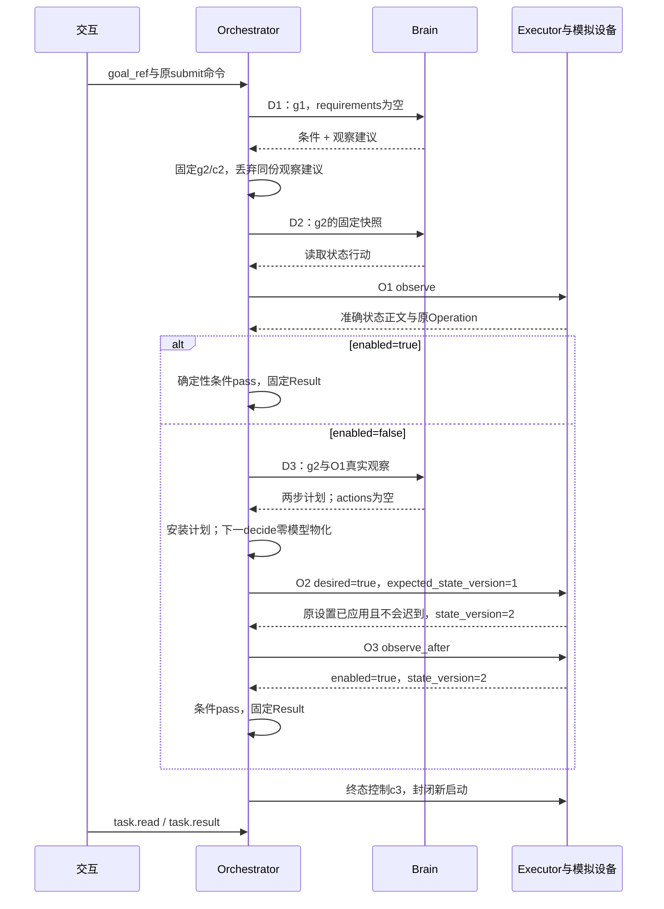
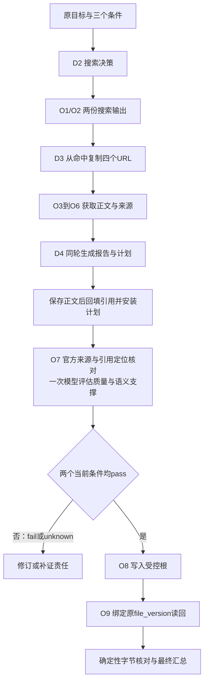

# 两个任务实例：逐字段输入输出与成本评估

日期：2026-09-28。本文延续同一实例评审，不修改正式方法或字段。蓝牙分“初始已开”和“初始关闭”两条独立轨迹；报告分“搜索、核实来源、综合、评估、保存、读回”。**所有轨迹都是合成的预期输入输出，没有运行 Harness、模型、官方网页、数据库或设备。**

先读第 1～4 节判断主线与关键成本，再按第 5 节追字段，第 6 节核对完整 JSON；第 7～9 节分别给出字节账本、异常边界和改进优先级。配套机器样例保存全部交接；正文包含字段来源、依赖和成本解释，不要求读者先读生成器。

## 1. 先回答简单任务是否过重

对“打开绑定手机蓝牙”，本样例选择每份 Decision 都调用一次模型的基线路径：已开分支在读取状态前生成两次，关闭分支再增加一次基于观察结果的规划。条件补全改变 `goal_revision` 后，契约要求保留新修订与新决定责任，以新快照形成新提案；原提案的行动和 `plan_delta` 全部失效，不得重绑到新修订。

`decide` 工作、`brain.decide` 请求与物理模型生成是三个层次。Brain 可以用确定性 DecisionPolicy 返回新提案，每份 Decision 对应零个或一个 ModelCall；自然语言入口不要求后续每轮都调用模型。下表的 2／3／5 次是所选基线的调用量，不是契约下限；规则替代必须保持上述新快照、新提案及持久责任。

模块数量本身不能决定延迟。确定性字段、计划物化和最终汇总不需要模型，进程内 port 也不要求网络编码。真正可能拖累简单任务的是：将每份受控内容、每个用途、每次批准、每个原命令都做成独立远程往返；完整保存重复的请求、回执和来源清单；把可合并的本地提交拆成多次落库。下文将这些装配选择与不可省略的业务语义分开计量。

| 业务主链 | Brain 物理生成 | 在线评估生成 | Executor 操作 | 目标动作 | 确定性物化 |
| --- | --- | --- | --- | --- | --- |
| B+：初始已开 | 2 | 0 | 1 | 读状态 1 | 0 |
| B−：初始关闭 | 3 | 0 | 3 | 读 2、设为 true 1 | 2 |
| R：报告正常 | 4 | 1 | 9 | 搜索 2、获取 4、评估 1、写 1、读回 1 | 3 |

报告基线合计 5 次模型生成，评估那一次包含在评估操作中，不能再当一轮 Brain。这里的“次数”是从脚本化基线轨迹逐项核对的预期次数，不是调用日志，也不是任意实现的最低调用数。首次查询即取得终结结果、无重试／分页／截断、一次综合同时生成报告与计划，都是负载假设；实际不满足时增加次数。

**判断：**本例列出了蓝牙 2／3 次模型生成及完整内容与权限装配的预期成本，尚未测量实现延迟或物理存储。当前应优先验证哪些生成可以由确定性策略替代，再测量保留调用的实际用量和等待；跨 owner 往返与布局建议保留为相邻优化。原样例和统计继续作为对照，不因候选策略而改写。

### 1.1 固定装配与不成立时的行为

本样例把 H（Orchestrator）、B（Brain）、E（Executor）、C（内容 owner）、G（Grant owner）、V（批准 owner）作为逻辑边界；字节服务单独展示，H/B/E/界面各登记任务内临时副本，同一持有者复用准确版本缓存。逐条列出 `grant.use`／结算和 `evaluation.approval_check`，这是便于算账的**显式协议装配**，不是规范要求它们部署成六个服务。所有模型选择本地 profile；向该模型接收方交付材料仍有 disclose，模型计算另有 process。搜索／抓取外发的查询和 URL 使用 SEARCH_LOC／WEB_LOC，不拿调用端 LOC 冒充接收位置。生产默认分布式装配需实测哪些交接跨进程、库、可用区；本机可合并提交的路径另记网络增量为零。

权限预置的完整 GrantPolicy 见第 5 节：动作、目的、接收方、三个登记位置、精确资源集合和限额均明确列出。目标提交前的使用仅绑定已认证用户，尚不填不存在的 Task 身份。H 组装上下文、消费提案、计划物化、条件与结果归并各有有限 process；B 的校验/发布和 E 的确定性评估也分别登记。取得正文的 read 与交付给接收方的 disclose 分开核验。这里把本可同域完成的检查逐一序列化以便审计，不能把协议对数当成最低网络往返数。

两例均为一个用户、一个固定 Orchestrator、一个任务，无子任务／外部 Agent，无长期记忆需求、无 GUI。蓝牙使用有状态模拟设备的显式 API，**不代表真实手机平台已有支持**；报告使用虚构 Atlas/Boreal 1.0 和 `.example` 域名，四篇正文是本地 fixture，不是已核实的真实官方资料。选择虚构资料是为了审查处理链和字节关系，不能用报告内容做选型。

蓝牙 owner 提供原操作日志、状态版本和独占入口，样例中没有其他操作者；文件 owner 提供受控根、路径规范化、预期不存在、原写入身份及读回版本。缺少这些驱动合同、适用验证器、就绪实例、当前授权或缺陷门禁时，保持依赖缺口／拒绝相应新工作；不能猜 `verified`，也不能把未知 API 效果换成 GUI 重做。当前验收范围及这些依赖见[目标](../../docs/architecture/goals.md)、[执行](../../docs/architecture/execution/README.md)和[验证生命周期](../../docs/architecture/orchestrator/verification.md)。

### 1.2 事实、合成值与当前契约缺口

| 类别 | 本稿如何产生具体值 | 不能据此声称 |
| --- | --- | --- |
| 协议字段 | 按当前 [protocol.schema.json](../../docs/architecture/contracts/schemas/protocol.schema.json)、[methods.json](../../docs/architecture/contracts/schemas/methods.json) 构造和校验 | Schema 合法不证明服务已实现 |
| ID、版本、时间 | 首次用系统随机源分配 128 位 ID 并登记；版本来自夹具发布/状态提交顺序；时间来自固定虚拟时钟，每步 10 ms 只为排序 | ID 不是模型猜测；时间差不是性能测量 |
| ContentRef / ComponentRef | 对配套文件实际 UTF-8 字节计算 SHA-256 与长度；组件摘要指演示描述文件 | 组件描述文件不是已批准驱动二进制 |
| 模型输出、驱动事实、判断 | 逐项脚本化预期值；生成阶段使用内部 `$local_ref`，保存后回填真实引用 | 没有真正模型推理、远端结果或质量/效果证据 |
| 费用 | 演示 tariff：一项概念模型请求=1 `fixture_credit`；其他目标=0，纯用于验证去重与累计 | fixture_credit 不是货币；没有真实 token、价格或服务费用 |
| 权限／批准 | 假设受信数据库已有允许的 continuous Grant、准确安装锁与批准；每次使用回执是该前提下的期望输出 | 未伪造已完成的人类 Confirmation；这些值不能拿去授权真实服务 |
| 尚未冻结的适配细节 | 内容 upload/download 准备、业务 intent_hash 投影、Requirement/plan 的预分配句柄、规则/缺陷/关闭证据登记均显式标为示例内部接口 | 不能从公开 Schema 反推出它们已存在或能互操作 |

本文读取期间，另一项工作补入了[公共可靠工作框架](../../docs/architecture/reliable-work.md)。它复用接纳、Claim／Guard／Finish 与责任版本检查，不减少领域必需记录，也不要求只读调用全部异步化。下文 Job 仍是内部设计样例，不伪造 `job.*` RPC；本工作保留其他聊天对正式文档和 28 日评审的修改。

## 2. 共用身份、内容及每个值的来源

### 2.1 ID 和引用字典

下列完整值来自身份登记器。`B+`、`B−`、`R` 只是正文定位前缀，JSON 中均为完整 ID；两条蓝牙轨迹是独立的初始状态实验，不是同一设备状态在一次运行中互相矛盾。所有业务查询的 `target_id` 指原对象，租户来自认证上下文。

| 正文角色 | 具体 ID | 来源与复用 |
| --- | --- | --- |
| 租户 | `tenant_8ac2a2ec55cb31a9955588e3b23a84d0` | 认证适配器的 fixture 身份 |
| H | `orchestrator_6c2a7b84c457f86835e4cd936f13e82a` | 受信放置目录，原提交后不换 owner |
| B | `brain_3cba62a7eb2a14403ec3789626e12ad5` | 已装配 Brain 服务 |
| E | `executor_be3b470db73f373c87fcd397a2ece738` | 已装配 Executor 服务 |
| C | `content_owner_9af3ae2e176212d6ebe17583552be2ed` | 准确内容 owner |
| G | `grant_owner_23163e9765bd6ea41136630cbfc25bd6` | 原授权 owner |
| V | `evaluation_owner_ee038be7f9a45c34ffbc1c8aefaf85e3` | 批准 owner |
| 用户 | `user_f523ea205251d544fae7483da5cddba8` | 受信用户会话 |
| 本地位置 LOC | `endpoint_ed7b43476e2bc7c366105dfa651927ce` | 已登记端点 |
| SEARCH_LOC | `endpoint_ea067a5c0548694159658276096e45a6` | 假设已获准的搜索接收位置 |
| WEB_LOC | `endpoint_5a6b0539138d03b3b1c014bff19f756e` | 假设已获准的网页获取接收位置 |
| 蓝牙目标 | `device_252b9d083cdbd895700becaab28d8043` | 会话绑定的模拟设备 |
| 文件根 | `resource_77faeac6cb33a843089218278ed62861` | 受信文件根登记 |

| 轨迹 | Task ID | 完成 Task.revision | goal/control revision |
| --- | --- | --- | --- |
| B+ | `task_78377161d0b5118ceae584c544c21823` | 8 | 2 / 3 |
| B− | `task_a588b9a733f94e9eb8097b5e193a2bbd` | 14 | 2 / 3 |
| R | `task_ec3af2f91cfe0d35a30d65a4aeea25be` | 28 | 2 / 3 |

`goal_revision` 由 1→2 表示采用结构化条件；`control_revision` 同时 1→2，完成时 2→3 封闭新启动。`Task.revision` 是本夹具所选择的提交序列计数，不能当事务下界；每一步变化记录在各 `scenario.json.task_revision_log`。Decision/Operation 的 1→3 表示本样例接纳、发送阶段、结果阶段三份状态，墙上时间不参与跨对象排序。

以下 `K/...` 的版本均为配置给定的 `1.0.0`；digest 由实际描述字节计算，后续引用不得改成 latest。完整引用供字段表使用。

| 组件别名 | id | digest | 描述文件字节 |
| --- | --- | --- | --- |
| task-policy | `component_83c25902adcbc771321be8dcc3db9b56` | `sha256:3f6ad08c2d9a757ccaae6e3e3b61f741c77cb7326ba70a241c8aae15b5e72563` | 186 |
| model-profile | `component_3de6d1d2a4617095dfbe6fc3fc96a144` | `sha256:bb284a2097f9e25da1e0f670f458d64e88bdea960ba3fec404aeef0b913974c3` | 280 |
| bluetooth-enabled-rule | `component_b443fc1a8fda4e81f51d9bc0cb7aa47c` | `sha256:7ec3dffcfcab12223d87e115998b7a3cb75f2cbfc57c8b372886bbde126a76fb` | 196 |
| report-quality-rule | `component_eca4352c52f3c7666ced181a93b76293` | `sha256:6ee7eb750fc441f65314cd52759e53f7effb6d99fa5da8f6ee5e8a3237af08d9` | 163 |
| official-source-registry | `component_bd384c588b6b1f6a2eca38b5a08e9df2` | `sha256:a35956b6acf7a607375eca0cd03641874bdfd04d8fc2f87b2b6f6409ed490527` | 301 |
| report-citation-rule | `component_e273e2ed37ea29ce0e890989bafd6a74` | `sha256:a90521f6f6c3ca666ec2a7a4480a4d94c84cfa1a51dc4f5b2d110a8624f616c3` | 419 |
| file-equality-rule | `component_aeb45943b132fbad296b4363857d0cc3` | `sha256:2af06ec016ccc650476dede24f66c7d850654138b27d3ebaa59f1bbf32526211` | 156 |
| bluetooth-checker | `component_858ae1d18ba1a8787d2389a9bb2cb0f6` | `sha256:060051a823b360acc4b1a2c14d90a3e98532671ece2ac43c78e3f17769f83385` | 140 |
| quality-checker | `component_c4933aaa86e221dcacab05a04eb49ae2` | `sha256:b28df2c995cd156de91f7ebf6aaf332a3238f2284a795ea37820236ba4e60eb1` | 159 |
| citation-combiner | `component_a4b4b9c2968fd86a9e1f6073b5e719a3` | `sha256:14c05ea4d62c78c0069ac56827389c4cecd7ed8806f06d415f4bdb67518200a6` | 122 |
| citation-locator | `component_b5e01f0733e02291279c0318df2c57a1` | `sha256:38b71c65bb90967f0ed7653df5a19350e9d0f793a0a5354672527e8cca79b091` | 145 |
| official-source-checker | `component_a0da454dc3298b3492a08626dd49ab16` | `sha256:a88082a660c095c6093fdfde63c9df28006a1a79254113ba5db064d0908a227c` | 218 |
| file-checker | `component_ecee5be0cb7e37ac1db4520c98e39af3` | `sha256:014857af6b9391632684025f94d4b5965c1235a50b0fcdc421910bc61c4c0dfe` | 143 |
| assessment-prompt | `component_6a79713c63adadbd1f054e55caa694d1` | `sha256:618aa07b24553ea9ec3d7db0494771369f47ebe18ff22b055b09815839604a47` | 155 |
| target-key-guarantee | `component_f1acff0c121d84fcafe8eb02297f4919` | `sha256:5a83656414f57ce77fd01ef0f815be2ae5f1fb6d7a6c745f115b2c91262827d4` | 174 |
| capability-observe | `component_1e4dc7b2300ea1a1ddae16e5194f90cf` | `sha256:b8ebea8d374967a5f36f52379d521d4a9ba7efa40896b1f6b22981b026c77beb` | 684 |
| driver-observe | `component_c4d790b69a6d083caca837f765dc0e33` | `sha256:e64ed44d7e3281156f51ba5c41f689b212cfb90a50a1a0964004813245ff78bb` | 146 |
| config-observe | `component_8a89a678157a30f90e6b066b478205b8` | `sha256:f507e8381e8cff965e900783fee0ac9ce020c1f489982c1ffae8fceb80424ae1` | 149 |
| capability-enable | `component_0260711fd0d6cdb56c764b8256c1ee82` | `sha256:701e8a672c8749266e603542b911c2ff14660840d3038578ff338dfced6d3665` | 933 |
| driver-enable | `component_84ada45d2f4fcade8c0ea5e3fcb86dce` | `sha256:93a0be3d4f49a91ce497174131f1bebbbde724280a7e43a825609362ec7be39b` | 145 |
| config-enable | `component_66a256a162caec35e95a5aef5fcb182b` | `sha256:2e6ae62cf0133aeb66c73408c57f5f8d1610d8bfc984c9cac36842a0052894b3` | 148 |
| capability-search | `component_6387c67d26abe7cb1a6fe1ec2b278995` | `sha256:4d63be03ea8a15c894c950193f2a4584cc8e89ecfa651417958e625845abc486` | 1132 |
| driver-search | `component_c85d5e69e947ecd3ee35a4424cf08fbb` | `sha256:6686ad802480520d999b656ef76452aeb71b6f2be31e27fd9078d10177696024` | 145 |
| config-search | `component_fe61d589b81eb7b9b318ca42369238d3` | `sha256:0eb812f9186275f0ea84a30ee742a48716f1d5e09b72be9a8f5525ddab759ec1` | 148 |
| capability-fetch | `component_b1cb124264ad2ce9f9e75ca79ee0f1f5` | `sha256:2adf74ec5835908c98be2d806f61b2bfc8d16fd35c39329b6085624bcf709851` | 1521 |
| driver-fetch | `component_5aa8caa8cf8d2258192610c3cc94fd82` | `sha256:8def532b026607b0a83578e0a7afda723ed9e637bad8c32c46cfd2f6d86ce9b3` | 144 |
| config-fetch | `component_38398ed865cb66fca7d1592f33ab43e3` | `sha256:1791f56463c98fcf8db9f87f1de01d58219c26fd543b2aabee69fd62a9bc05bf` | 147 |
| capability-assess | `component_e0b23ca26eab16dce31db0538898e148` | `sha256:6abd7550379243d77d98329e1167b3cfc8f706638e3c6e53911bae767ecb632f` | 11256 |
| driver-assess | `component_de5ee45e38e59bd08010bfd55142ed2a` | `sha256:86620e3ff05dd61fc1e0975de1fb824c821ec63e64c9ed56814c950b87fd0374` | 145 |
| config-assess | `component_3c0a969ffb3884a648286e2729385946` | `sha256:3d572be9e9daeca4f11298af6503792cff2ca5b8a2b57cbf4fac60ca85c92493` | 148 |
| capability-write | `component_81bd87928a5af02e61d3e96bf341b898` | `sha256:6042f6527fcbb86c27e5e45d62caeb33d22228e06a7974428fb818b956e2d9d6` | 1688 |
| driver-write | `component_5cd757e1165363986c8d852fb9406711` | `sha256:0051e08a439cd6c4f023d97345d07159d8504876221a4aa4d6926012f73172d9` | 144 |
| config-write | `component_9d1c103e0e3a12c6293634f9e7f7a03c` | `sha256:dce6e1b0648b98f118e67258f2d1221769a1a1026bc644066a9afa60fa176989` | 147 |
| capability-readback | `component_2d0a26c2265ac5d86e53dca765df3d07` | `sha256:e51dde0fad0268749cffad0fd60b7912f0de6f9fbce94fe42062905aa381a5a3` | 1521 |
| driver-readback | `component_eb794614a118106a3d4112f8846ed8bf` | `sha256:8a19e616029f48cd6af67af52e4883dfd3002f1b64b40cbccbec05ffed6fcb00` | 147 |
| config-readback | `component_f4cc4713476581277b82a6f622e79d8b` | `sha256:778a9647f3ef895382789b2fb78d54c1d4a4459bed691a4ed8abcbafffa27e58` | 150 |

### 2.2 内容字典与真实正文

后续表中的 `B−/O1-output` 等指这里的唯一准确引用。所有引用共同的 `tenant_id`、`owner_id=C` 见上表，`version=1`；每行给出剩余字段和正文来源。`byte_length` 是原始正文 UTF-8 字节数，不含漂亮打印的换行，也不含引用 JSON。`application/json` 采用 ASCII 键、无浮点的紧凑排序编码；在本样例的数值/字符串范围内与 JCS 一致，不声称生成器是通用 JCS 库。

已安装目录、规则和策略在表中标“共享预置”，只读复用，不每任务重新发布。句柄内容是本次生成的内部示例：受信代码先分配 Requirement/plan ID，模型只能复制它们；当前标准并未冻结这项句柄注入协议，真实适配器落实前不能把随机猜到的 ID 当权威身份。

**B+ 内容**

| 别名 / content_id | 类型 / 字节 | hash | 产生方 / 来源（别名） |
| --- | --- | --- | --- |
| goal<br>`content_a81658db4b7166adfa2280dab39edce9` | application/json / 174 | `sha256:b5e8c8fafe22f3c8c3c13efc40405aa8d13bcfcc73149ec1a73e13894b32a016` | user；无派生来源；入口事实或配置 |
| catalog-observe<br>`content_4d5e2a1c0bd3ae78fd5173c4f20fe1a4` | application/json / 2574 | `sha256:11ec831e5c9ee654c93c22e5ce884f7361688588bda2794838e76e140a4d2313` | 共享预置；无派生来源；入口事实或配置 |
| catalog-enable<br>`content_d6a2bdb4ec63f2fa577630415b1c2720` | application/json / 3069 | `sha256:d0ec063048cbcb23b3c3eead2785a45cff61d7ed0fc3b1a901e40402032c7718` | 共享预置；无派生来源；入口事实或配置 |
| policy<br>`content_8dba886606f134e1755130818d6f9c9a` | application/json / 186 | `sha256:3f6ad08c2d9a757ccaae6e3e3b61f741c77cb7326ba70a241c8aae15b5e72563` | 共享预置；无派生来源；入口事实或配置 |
| rules<br>`content_9cdc16aee6b5c7f38127910afc79d7da` | application/json / 449 | `sha256:8f923cdbdcd855fa1731ff0605a8df99772509ec35dbaa1503c76f479be1e615` | 共享预置；无派生来源；入口事实或配置 |
| allocated-handles<br>`content_27c4259d59ce66a3f1987a3c53c3e553` | application/json / 118 | `sha256:5d5527d363203a4eea53e4b00fdd8f267be578e380b6148343842578a05f6913` | orchestrator；无派生来源；入口事实或配置 |
| D1-context<br>`content_8f29eff20a02bec0b28b6f00b3bb2cc4` | application/json / 5650 | `sha256:36f4ba42d18131c9fe851ec689cb7cc83d9c82dd3aa517c2abed27fa0c9bf569` | orchestrator；B+/goal, B+/policy, B+/rules, B+/allocated-handles, B+/catalog-observe, B+/catalog-enable |
| D2-context<br>`content_c5402fea3141b2b3b6ecbcb41732480f` | application/json / 6239 | `sha256:ece10c436ed90c007e163d4124a5a70caa413ec5bfee8989014af7312fddb550` | orchestrator；B+/goal, B+/policy, B+/rules, B+/allocated-handles, B+/catalog-observe, B+/catalog-enable |
| O1-output<br>`content_de4e3163faca77cf452675405010b2e4` | application/json / 129 | `sha256:dc216a8a98739f222e40662a67105ff49171af79ffd54cc8370e3748d9227217` | executor；B+/goal |
| result<br>`content_4a47f735779f32b4ee2239e4c224d9d8` | application/json / 1632 | `sha256:69b0f5638f8d14abfac9b8b0ba11a50a69a97e0fe567a2e36c0cf8b9baca311e` | orchestrator；B+/O1-output |

**B− 内容**

| 别名 / content_id | 类型 / 字节 | hash | 产生方 / 来源（别名） |
| --- | --- | --- | --- |
| goal<br>`content_6b945aecc7ccbcd57796d5336541bb81` | application/json / 174 | `sha256:b5e8c8fafe22f3c8c3c13efc40405aa8d13bcfcc73149ec1a73e13894b32a016` | user；无派生来源；入口事实或配置 |
| catalog-observe<br>`content_ecce61611b7ba0eaf31018977f8874a0` | application/json / 2574 | `sha256:11ec831e5c9ee654c93c22e5ce884f7361688588bda2794838e76e140a4d2313` | 共享预置；无派生来源；入口事实或配置 |
| catalog-enable<br>`content_7a7a4c63e45d5b25c3fd0a0858888eab` | application/json / 3069 | `sha256:d0ec063048cbcb23b3c3eead2785a45cff61d7ed0fc3b1a901e40402032c7718` | 共享预置；无派生来源；入口事实或配置 |
| policy<br>`content_492c24518fae84b525ccf81e7ba2f1ba` | application/json / 186 | `sha256:3f6ad08c2d9a757ccaae6e3e3b61f741c77cb7326ba70a241c8aae15b5e72563` | 共享预置；无派生来源；入口事实或配置 |
| rules<br>`content_9d59d2767f4e96163c8396fbd33ca081` | application/json / 449 | `sha256:8f923cdbdcd855fa1731ff0605a8df99772509ec35dbaa1503c76f479be1e615` | 共享预置；无派生来源；入口事实或配置 |
| allocated-handles<br>`content_3f714cf2b7c6892629287830c7184e2a` | application/json / 118 | `sha256:be6871d159b29edf696f052876daa50f823adda7b81e5d2cce070f8f3b0e9ee7` | orchestrator；无派生来源；入口事实或配置 |
| D1-context<br>`content_037a3028446893d1f6be1208edd6028e` | application/json / 5650 | `sha256:318b74e08ec1e1ce76d62c2f658f49db8c1d4161a1c9c1523f4135138da0660b` | orchestrator；B−/goal, B−/policy, B−/rules, B−/allocated-handles, B−/catalog-observe, B−/catalog-enable |
| D2-context<br>`content_93783f059ceb3d772ff402e11909199d` | application/json / 6239 | `sha256:07ac9c7fdac3c5c56575fc471b62f073a58633c840c4dd3f214c12f640500dec` | orchestrator；B−/goal, B−/policy, B−/rules, B−/allocated-handles, B−/catalog-observe, B−/catalog-enable |
| O1-output<br>`content_133eb6c59fc7571998efc276c155293d` | application/json / 130 | `sha256:c7017ea2b64f96fd1f31a5a19054c1f5d831cc923b85e0b9d97a6d2ce1a367c4` | executor；B−/goal |
| D3-context<br>`content_3592153b0ff80df36d1397a64aac5f81` | application/json / 7716 | `sha256:19fc7fb5cd90c68acd069d19bc5ed613a07d731edd54d1742d1376d34ca46fd2` | orchestrator；B−/goal, B−/policy, B−/rules, B−/allocated-handles, B−/catalog-observe, B−/catalog-enable, B−/O1-output |
| plan<br>`content_54e88a0bb07de6289ed806d7ade4184d` | application/json / 4467 | `sha256:eb6fef7b60bfa90b4da1257ad72e78cc2ebe56c4955e8d5ebb069f442e1cec2f` | brain；B−/D3-context, B−/goal, B−/policy, B−/rules, B−/allocated-handles, B−/catalog-observe, B−/catalog-enable, B−/O1-output |
| O2-output<br>`content_c160150072514301acf727cb204b0370` | application/json / 189 | `sha256:542fd47df798d89669b5addc65a9dfa1734aed74a167548bbacc9d16b3f9e681` | executor；B−/O1-output |
| O3-output<br>`content_595c27a9817452c0b09467802d4b667b` | application/json / 129 | `sha256:ce824465792ac6507578f8e8a1e364d753229acf4ab6f4cf00200f2242e28641` | executor；B−/O2-output |
| result<br>`content_5ccc02cbcfa037291073a641e95c57c8` | application/json / 1947 | `sha256:256af5b7d19aeb8d33726969e4f96891d672ef8ed8d5a406e1419ea82501283a` | orchestrator；B−/O3-output, B−/O2-output |

**R 内容**

| 别名 / content_id | 类型 / 字节 | hash | 产生方 / 来源（别名） |
| --- | --- | --- | --- |
| goal<br>`content_93d55d9f411e2c4453b0c38f8d7f8c51` | application/json / 525 | `sha256:78bc17ac4b7044fcbed82fe0b91b66a77ecae3e31a8d9547d5eb105f4914f72f` | user；无派生来源；入口事实或配置 |
| catalog-search<br>`content_7d610437c37f4cfb964b066ca08eb47f` | application/json / 2984 | `sha256:71cbca50ea77c3940be0d8bebe7f3afe68d42b7459314c1dc6db23d2e9a2e42f` | 共享预置；无派生来源；入口事实或配置 |
| catalog-fetch<br>`content_024c6c01d9a778cee61157126d5368b1` | application/json / 3372 | `sha256:24199e06010cc2cbd1be0210b2d0b8169fce1c9bc5f0186bff3ba2b4c712a82a` | 共享预置；无派生来源；入口事实或配置 |
| catalog-assess<br>`content_c74c051647a869304bbf29ad5ee5b2bd` | application/json / 13105 | `sha256:5bfe351ebc4651d8303d38872d5f919cd519363ca6fda2a7fe55ad47a917cb46` | 共享预置；无派生来源；入口事实或配置 |
| catalog-write<br>`content_8924ee84e6f116723b7f5b78e9328a53` | application/json / 3833 | `sha256:1125d65ffa35bff7548bd2f85c37c7562df894c12439dfb0e797157711111e15` | 共享预置；无派生来源；入口事实或配置 |
| catalog-readback<br>`content_82fb76d5b5a968cdfc0da9cbf545d5f0` | application/json / 3379 | `sha256:571a90c8402de20c1044a2e8f3b12a9f46c7f8d941892c5dacc5cd0383b15928` | 共享预置；无派生来源；入口事实或配置 |
| policy<br>`content_bb2e76d7ca0cf201300f7f2c455ccf8f` | application/json / 186 | `sha256:3f6ad08c2d9a757ccaae6e3e3b61f741c77cb7326ba70a241c8aae15b5e72563` | 共享预置；无派生来源；入口事实或配置 |
| rules<br>`content_9756e4d956cc83839cff84abd8109eae` | application/json / 1478 | `sha256:6e8623ceddcf312a459687577428e523263d5a8f312238baf7524232e9c900b4` | 共享预置；无派生来源；入口事实或配置 |
| allocated-handles<br>`content_0e8e0a5751c8c129a894eaf0dea28db0` | application/json / 212 | `sha256:411e269d9d58bacc317edffd8c9fc1b6aa94b972ec0bcef081bf3ff1cda47dbf` | orchestrator；无派生来源；入口事实或配置 |
| D1-context<br>`content_cde310ac7169bac7cf8f1f782a70baf7` | application/json / 13287 | `sha256:30b383b8106d051cb1d6d1bbbcc5f81deb0b27cca48bc29ee7ef0414ab23f1e0` | orchestrator；R/goal, R/policy, R/rules, R/allocated-handles, R/catalog-search, R/catalog-fetch, R/catalog-assess, R/catalog-write, R/catalog-readback |
| D2-context<br>`content_f56c3a4f25b8e1cf92eb19a3c93506df` | application/json / 15058 | `sha256:ec5fbc8e992a2e9b79777841289d61e32085c154ede36ab27b0258c10a62b7a5` | orchestrator；R/goal, R/policy, R/rules, R/allocated-handles, R/catalog-search, R/catalog-fetch, R/catalog-assess, R/catalog-write, R/catalog-readback |
| O1-output<br>`content_acd5fd02f72a217b30cca0f1302024b3` | application/json / 444 | `sha256:e55aa6b3eff7c166f1817c48aac3edf8d87efe1018883b2c6e48af11ece5fce0` | executor；R/goal |
| O2-output<br>`content_18ac78c0cd43c34842eec5bae3b26da4` | application/json / 452 | `sha256:f4b3ea185bbb02843de97e7fd844a01a761c0386b5e91b3890844088bb6d3856` | executor；R/goal |
| D3-context<br>`content_2053e42761312c2e9179cb402540344b` | application/json / 18014 | `sha256:eed36ab5e4467e022b8d6c8bdf70b58b700bf335703a9504d9cc3e42fbb11f6a` | orchestrator；R/goal, R/policy, R/rules, R/allocated-handles, R/catalog-search, R/catalog-fetch, R/catalog-assess, R/catalog-write, R/catalog-readback, R/O1-output, R/O2-output |
| source-1<br>`content_eef3c3ed2c1049a0e83e405d44352830` | text/markdown / 73 | `sha256:b86ca62e7bc3ae7b937e4d9bcea742893a3d2a43c4e5aa1bed018c3858b256bb` | executor；R/O1-output |
| O3-output<br>`content_cb29d8968bb339cbe70551de80faf716` | application/json / 531 | `sha256:9f67915c12232f31a819ba2e2bb383835fe5a4c73cd442bfe02b7a5cd220f044` | executor；R/O1-output, R/source-1 |
| source-2<br>`content_ba9fa84c43bfbe13309ecde372d203f3` | text/markdown / 83 | `sha256:b4880ca61602f7362f57665c8b21cdd49bacb1c1632ccac75a35044dc6ba2e71` | executor；R/O1-output |
| O4-output<br>`content_ab90afd610c30bb57c523918917bd5c5` | application/json / 523 | `sha256:3ac2308d0817552cf71c7b5d1093b9648e54239c0ed57aeef23824fab1337c77` | executor；R/O1-output, R/source-2 |
| source-3<br>`content_b798c451222c7b61d1e88adf1c26b6e4` | text/markdown / 78 | `sha256:74bfc2eba405f39cfdb88e2cae0fea16d0f5a720b20f641495e2dcd2b81595e8` | executor；R/O2-output |
| O5-output<br>`content_401521df5da5aa1fcfa5ca1f36f36624` | application/json / 534 | `sha256:045fc15e665990c06822fbe58d18f4e80964c8e7324da7aa1215f42345cd97c0` | executor；R/O2-output, R/source-3 |
| source-4<br>`content_ca9d9dc7751cd65069513e1a305d408a` | text/markdown / 93 | `sha256:1fe136552faf3605ddb11fdce92bdf2a5019d4a6d9e06ab704a8d0f98d45ac83` | executor；R/O2-output |
| O6-output<br>`content_65bbff9eff49cc61b7ec00877807daa9` | application/json / 526 | `sha256:9e6cdcb8f7fa59882387daed241b52ad176409dbbab9af656498a5d5553309d0` | executor；R/O2-output, R/source-4 |
| D4-context<br>`content_837f1b9ac00604195d7545fec0be3ac2` | application/json / 29118 | `sha256:1720be4f277b9a192af4457c407272a6007b2940648fc107936f64a152392525` | orchestrator；R/goal, R/policy, R/rules, R/allocated-handles, R/catalog-search, R/catalog-fetch, R/catalog-assess, R/catalog-write, R/catalog-readback, R/O1-output, R/O2-output, R/O3-output, R/O4-output, R/O5-output, R/O6-output, R/source-1, R/source-2, R/source-3, R/source-4 |
| report<br>`content_8e2af47f42998e0b3bba88086f2d92fd` | text/markdown / 793 | `sha256:7f7e8005b2c3b0d2af56eef760f044a18da9913ec1a245e941e5a5d1f23a364c` | brain；R/D4-context, R/goal, R/policy, R/rules, R/allocated-handles, R/catalog-search, R/catalog-fetch, R/catalog-assess, R/catalog-write, R/catalog-readback, R/O1-output, R/O2-output, R/O3-output, R/O4-output, R/O5-output, R/O6-output, R/source-1, R/source-2, R/source-3, R/source-4 |
| plan<br>`content_fae22a92b47cc9ce88b2254d0a0a62fc` | application/json / 14400 | `sha256:722c41005457b25dfb8ad4c345201acbe036eee6d09d10ed48bd10aac2931ac6` | brain；R/D4-context, R/goal, R/policy, R/rules, R/allocated-handles, R/catalog-search, R/catalog-fetch, R/catalog-assess, R/catalog-write, R/catalog-readback, R/O1-output, R/O2-output, R/O3-output, R/O4-output, R/O5-output, R/O6-output, R/source-1, R/source-2, R/source-3, R/source-4, R/report |
| O7-output<br>`content_e4610df51846657161771c9306d45b71` | application/json / 10172 | `sha256:31a80dd304883bd1b1e243c53ffc333bc0dc69689f7a61bcdfea0249cdbb702b` | executor；R/report, R/source-1, R/source-2, R/source-3, R/source-4, R/O3-output, R/O4-output, R/O5-output, R/O6-output |
| O8-output<br>`content_e1ccca6c7226266483187914e9407d31` | application/json / 293 | `sha256:9214ece37e34b2972890e344b175bfb44a757d4008845b7a60b0b954d722e9e4` | executor；R/report, R/O7-output |
| readback-bytes<br>`content_4289e59c838c5870c05d2c7a552772ec` | text/markdown / 793 | `sha256:7f7e8005b2c3b0d2af56eef760f044a18da9913ec1a245e941e5a5d1f23a364c` | executor；R/O8-output |
| O9-output<br>`content_ec679b1ad90a95ad2d209f0cfcf9a987` | application/json / 479 | `sha256:49bbb6e90c7284797b2fdfbb29667d934d5acba90c56569028ee2903727ab2ad` | executor；R/O8-output, R/readback-bytes |
| result<br>`content_a12cb75462c3c96e2ccd22be1c876f92` | application/json / 7903 | `sha256:88cb79ec42009be5a9e2115138597d06461075219e416a132f868d9bfe957592` | orchestrator；R/report, R/O7-output, R/source-1, R/source-2, R/source-3, R/source-4, R/O3-output, R/O4-output, R/O5-output, R/O6-output, R/O8-output, R/O9-output, R/readback-bytes |

每个新正文在 `content.put` 前已经存在准确字节，并固定 `content_id/version/upload_id/command_id`；owner 校验后才返回 ContentCommit。正文来自用户、驱动还是模型不会改变这个顺序。读取流程先登记副本，再拿限时 download 身份，实际字节不塞入 `content.get` 返回值。上传预留和下载流的完整绑定未冻结，本包只提供其输入/输出字节与已有领域方法，**不是可直接发往生产的完整传输录制**。

### 2.3 生成与存储成本代码

下面字段表复用这些成本代码。同一对象的一次查库、事务或模型调用按对象/交接记一次，不能按字段数重复相加；“复制”仍需要 CPU 和输出字节，只是不增加模型或外部取证。

| 代码 | 产生方、前序依赖和计算 | 产生代价 | 持久化与复用 |
| --- | --- | --- | --- |
| I | 身份/认证适配器：安全随机 ID；或复制已经认证的身份与已固定原 ID | 新身份 O(1) 随机源；原 ID 为复制；分配随 owner 原事务登记 | 同一 operation/decision/use/command 恢复复用；不会每次重试再分配 |
| D | owner 的当前权威行：版本、状态、累计金额、选定证据 | 查当前对象/唯一键；版本在提交中单调推进；不是模型算数 | 版本化记录或当前行；旧修订不能覆写新投影 |
| C | 受信配置/目录：类型、枚举、规则、Schema、上限、保留期 | 首次读配置/目录；精确制品可缓存，当前禁用/资格另查 | 共享配置不按任务重建；引用必须包含准确版本摘要 |
| H | 字节处理：UTF-8、SHA-256、JCS 子集编码、签名 | hash/复制 O(B)；签名每个 ControlSnapshot 一次；与模型无关 | 正文一份；同内容多个引用只累加引用 JSON，不再累加正文 |
| M | 脚本化模型预期：动作/条件解释、短理由、比较文本、计划 | 本轮一次物理生成，所有这些字段共享 token/时延费用；本次实际为零模型运行 | 输出暂存/发布/Proposal 各有恢复责任；不保存隐含推理 |
| X | 目标驱动：状态、搜索命中、HTTP 元信息、写入版本、读回字节 | 本次 O 的目标请求；字段解析/结构校验为本地 CPU | Operation 与准确输出/凭据关联；不能靠模型填这些事实 |
| V | 受信确定性比较/评估归并：当前条件、准确成果、证据、门禁 | 已持有证据则 CPU/查库；需要新取证或模型时另计 Operation | ConditionCheck 固定输入与判断；当前 applicability 单独保存 |
| A | Grant/批准 owner：当前主体、资源、用途、窗口、额度及原 use | 事务内锁当前资格并裁决；跨 owner 才增加 RPC；grant.check 不消费 | UseReceipt 原决定不可变，结算投影独立；缓存不是新授权 |

## 3. 蓝牙：每一步交接具体是什么

目标正文包含 `user_text="打开绑定手机蓝牙"`、真实 fixture 的 `device_id`、`desired=true` 和受信绑定来源。适配器选择“设为 true”，没有 toggle。观察输出的字段为 `device_id:string`、`enabled:boolean`、`state_version:integer≥1`、`observed_at:UTC string`，全部必填；设置输入另有 `desired:true`、`expected_state_version:integer≥1`，防止把过时观察直接当作当前状态。



图的箭头是业务交接；D1～D3 标识本基线的决定，其各自一次模型生成属于样例选择。内容、授权和记录展开在第 5～7 节，每条 O 均先持久接纳、启动检查、保存实际事实，再由 H 查询归并。图不把 `execution.invoke` 的 applied 画成设备成功。

| 步骤 / 交接 | 真实输入值与前序字段 | 输出与谁产生 | 持久事实 / 成功含义 |
| --- | --- | --- | --- |
| B0 交互→C→H | B−/goal；原 command；用户预算 fixture_credit=20、deadline=02:00Z | Task r1、g1/c1、requirements=[]；H 接纳事务 | 目标、Task、预算、原回执、首 decide；没有设备动作 |
| B1 H→B→H | D1-context.snapshot_revision=2、goal_revision=1；目录含 observe/enable | D1 Requirement(kind=effect,required=true,rule_ref=K/bluetooth-enabled-rule)；脚本化解释 | 消费 D1，Task r3 g2/c2；观察 action 被废弃 |
| B2 H→B→H | D2 新快照、同一规则；没有设备状态可猜 | D2 action.arguments={device_id:绑定设备}；H 准入 O1 | 新 decision_id 与新快照；首 O 的来源必须是 D2 |
| B3 E→资源 owner/驱动 | resource.acquire 得 control_epoch=1；O1 读原设备 | B+ enabled=true / B− enabled=false；state_version=1；观察时间来自驱动 | 原 O1 r3 closed/applied/may_apply_later=false，H 按 r3 归并 |
| 已开：H 确定性核验 | 同一 device_id、true、30 秒内观察、无未知效果、缺陷门禁有效 | ConditionResult verdict=pass/basis=verified；Result 指 O1-output | 零次额外模型；保证只到观察时点和规则新鲜度 |
| 关闭：B 规划→H 安装 | D3 的 O1-output.enabled=false/state_version=1 | BrainPlan v1，enable→observe_after；actions=[] | Task 安装计划但不准入首步；计划是内容，不是授权 |
| 关闭：H 物化→E | O2 arguments={device_id,desired:true,expected_state_version:1} | 设置输出 state_version=2、enabled=true、closed=true，绑定原 operation_id | PlanStepAdmission(enable) 唯一；效果核清后才启动后项 |
| 关闭：H 物化→E | O3 arguments={device_id}，depends_on enable | 新观察 true/v2；非复用设置回执假装再观察 | read-after 独立 operation，CPU 物化不新增 Brain |
| 结束 H→E/交互 | 当前一项必要条件 pass；原效果与迟到性均核清 | Task succeeded，c3；执行端 ControlReceipt enforced=3；读 Task/Result | 释放资源租约；副本停止使用但物理清理仍 pending，费用/清理可独立继续 |

蓝牙两分支完整字段见各正文/对象字典。下面三份正文就是关闭分支的真实 fixture 字节内容，摘要与第 2 节对应；它们是驱动应交付的期望值，不是设备实测。

**B−/O1-output**

```json
{
  "device_id": "device_252b9d083cdbd895700becaab28d8043",
  "enabled": false,
  "state_version": 1,
  "observed_at": "2026-09-28T01:00:01.560Z"
}
```

**B−/O2-output**

```json
{
  "device_id": "device_252b9d083cdbd895700becaab28d8043",
  "operation_id": "operation_92a1dd44ad33512f58433f6d6db25c54",
  "previous_state_version": 1,
  "state_version": 2,
  "enabled": true,
  "closed": true
}
```

**B−/O3-output**

```json
{
  "device_id": "device_252b9d083cdbd895700becaab28d8043",
  "enabled": true,
  "state_version": 2,
  "observed_at": "2026-09-28T01:00:02.620Z"
}
```

## 4. 报告：来源、候选、评估和文件怎样贯通

用户目标明确了产品版本、三个比较维度、受控根与相对路径。`.example` 只用于 fixture。本例由固定 `K/official-source-registry` 给出 Atlas/Boreal 1.0 的主机登记；它是受信来源配置的合成前提，不能证明真实官方身份。获取驱动为每份正文交付请求 URL、全部重定向、最终 URL、时间和准确 body_ref；搜索摘要只帮助选页。这里四篇合成正文分别为：

**R/source-1**

```text
# Atlas 1.0 deployment
Atlas runs in one process with an embedded store.
```

**R/source-2**

```text
# Atlas 1.0 limits
Atlas has no multi-node failover. Backups are operator-managed.
```

**R/source-3**

```text
# Boreal 1.0 deployment
Boreal requires an external database and two workers.
```

**R/source-4**

```text
# Boreal 1.0 limits
Boreal supports worker replacement. Operators maintain database backups.
```



图中评估通过与写入效果是不同条件；一条箭头表达一个依赖，不把四篇来源当作四个独立事实真值。下表的 Brain +1 均沿用每份 Decision 生成一次的基线选择；计划发布不执行首步，三次物化均零模型。

| 交接 | 具体输入（来源） | 输出与下游 | 模型/目标增量 |
| --- | --- | --- | --- |
| R0→R1 接纳/理解 | R/goal 的 Atlas/Boreal 1.0、维度与路径 | D1 提出 quality、citation、file 三项条件；g2/c2，搜索建议失效 | Brain +1 |
| R2 搜索决策 | D2 的 g2、规则和准确 search 声明 | 两个 Action；query 为 Atlas/Boreal 1.0 deployment limits maintenance | Brain +1 |
| O1/O2 搜索 | product/version/official_host/query 全部字符串 | 各 2 个 hits：url/title/snippet/official_host；retrieved_at 来自驱动 | 搜索各1，共2 |
| D3 选页 | 两份原搜索输出，来源不靠模型记忆 | 4 个 fetch Action；URL 从 hits 精确复制 | Brain +1 |
| O3～O6 获取 | url、official_host；独立已准入 operation | url/final_url/redirect_chain/retrieved_at/http_status=200/body_ref；body_ref 指 source-1～4 | 正文请求各1，共4 |
| D4 综合/计划 | g2、四篇正文、来源封套、规则、准确评估/文件合同 | 内部 contents[report,plan]；C 固定 report 引用，再回填 plan 和 Proposal | Brain +1，无额外摘要生成 |
| O7 评估 | task_id,g2,report准确ref,两条件ID,两rule_ref,四source_ref、四fetch_evidence_ref、官方登记ref | judgments[quality,citation]；origin_checks[4]、citation_checks[4]；固定 model/prompt/evaluator；limitations | 评估模型 +1；来源/定位为CPU，无新网页 |
| H 条件归并 | 原 O7/result_ref 和全组成依据 | quality pass/assessed；citation pass/assessed，依赖官方来源、定位与语义检查 | 零模型；缺陷门禁覆盖全部组成实现 |
| O8 写入 | root_id、reports/comparison.md、expected_absent=true、同 report ref | file_version=1；content_hash/byte_length 与候选一致；原 operation_id、closed=true | 文件写动作1；底层I/O不等于1 |
| O9 读回 | expected_file_version 从原 write 输出 /file_version 解析 | file_version=1，独立 readback-bytes ref；hash与候选相等，content_id不同 | 文件读动作1 |
| H 完成/交互 | 三个必要条件对同一 report；无未知或可能迟到效果 | file pass/verified；整体 Result assessed；Task/Result查询及报告获准读取 | 零汇总模型 |

### 4.1 为什么不能让模型直接填报告引用和文件版本

D4 返回的是 `brain-generation/1` 的内部结构。模型可以生成报告文本、计划模板和 `$local_ref:"report"`，无法预知 owner 会分配的 ContentRef。Brain 先持久准备发布身份，再按依赖顺序保存 report、把准确引用回填 plan、保存 plan，最后形成公共 Proposal。报告、plan 的 SHA-256 和字节数都由实际产物计算；“同一轮生成两个正文”不增加第二次模型调用，但增加两次内容发布及来源元数据。

readback 模板在发布时故意不填 `expected_file_version`。它使用 `argument_bindings.target_pointer=/arguments/expected_file_version`，`source.kind=step_output`、`step_id=write`、`source_pointer=/file_version`。H 从当前计划版本的唯一准入映射找到原 O8，再从已核实输出取 1。未来版本不存在于 D4 输入，任何预填“1”都不能被当作模型知道了未来。

### 4.2 评估和保存的边界

O7 的 `effect=applied` 只表示评估报告已经形成，`judgments[].verdict` 可以是 fail。write 的两个 pass_conditions 同时绑定当前 g2 的两个 Requirement、固定 rule_ref 和同一 report 引用；只有都 usable/pass 才能准入。

引用条件 R-C 由三项同时成立：官方来源身份、准确定位、语义支撑。O7 从受信组件目录解析固定来源登记，再以 `fetch_evidence_refs` 对照每份正文的 `body_ref`，逐项核对请求、全部重定向和最终 URL 的 HTTPS 主机及版本路径。确定性定位保存 source_ref、UTF-8 起止字节、quote、matched，并将报告实际 citation_key/cited_url 与原抓取请求绑定；只验证摘录存在而不验证报告链接不能通过。语义支撑仍来自一次固定评估模型。
H 导入 O7 的组成证据，`check:citation` 直接读取 `O7.judgments[requirement_id=R-C]` 的语义判断，同时依赖 official-origin、citation-location 两项确定性检查；quality 是 write 的另一项独立 pass_condition，不能替代引用语义判断。任一组成 fail 则 citation fail，均 pass 才 pass，其余为 unknown；不再发起模型或网页请求。
登记缺失、封套缺失、跨域跳转、错误链接、错字节或任一组成结果未知都不能形成可用于写入的 citation pass。生产若要允许官方 CDN/不同版本路径，须修改准确登记与规则制品；不能临时把任意跳转目标视为官方。

文件输出中的 `content_hash` 从已取得候选字节计算，`file_version` 由文件 owner 的提交日志分配，`closed` 来自原写入不再发送/不迟到的证据。读回内容是新观察，具有不同 ContentRef 身份与来源；即便存储层按 hash 去重物理正文，也不能合并写入与读回的事实身份。R-F 检查路径、版本、原写入关闭和准确字节，最终保证仍为 assessed，因为质量两条件依赖评估。

## 5. 字段查阅：类型、必填性、具体值、来源和代价

表中“必填”以精确 Schema 为准，附加业务条件在来源列说明；枚举只展示本例选值，其余合法值见正式 Schema。公共对象复用第 2 节字典；子对象/数组按其专表展开。每行 B 为 `"字段名":值` 的紧凑 UTF-8 字节，不含外层 `{}` 和字段间逗号；**只在同一对象同一层相加**才等于对象大小，嵌套表不能再加一次。

`I/D/C/H/M/X/V/A` 成本含义见 2.3。字段既有直接产生者，也有读取/复制它的下游；下列表头给定主交接方向，来源列说明它实际依赖哪项前序事实。在本基线中，`DecisionRecord.proposal`、actions、plan_delta、steps 和评估 judgments 的首次产生计入所属模型调用；下游复制不抹去首次成本，也不重复收费。`model_call` 是适配器汇总的持久事实，子字段才分别来自身份、供应商和计量。相同字段名按对象区分，例如 ContentControl 与 Task 的 control_revision 互不替代。完整实例均在对应 `scenario.json`，原请求/响应没有使用正文别名。

### ContentRef

C→各消费者，准确正文身份。示例定位：`B−/goal/ref`；所示完整对象编码 314 B。

| 字段 | 类型 | 必填 | 本例具体值/子对象 | 产生方式及前序依赖 | 成本 | B |
| --- | --- | --- | --- | --- | --- | --- |
| `tenant_id` | string | 是 | `"tenant_8ac2a2ec55cb31a9955588e3b23a84d0"` | 认证会话；不是请求正文指定租户 | I | 53 |
| `owner_id` | string | 是 | `"content_owner_9af3ae2e176212d6ebe17583552be2ed"` | 受信分配或从前序固定身份复制；恢复保持原ID | I | 59 |
| `content_id` | string | 是 | `"content_6b945aecc7ccbcd57796d5336541bb81"` | 受信分配或从前序固定身份复制；恢复保持原ID | I | 55 |
| `version` | integer | 是 | `1` | C 为准确 content_id 分配的不可变发布版本；独立于组件安装版本 | D | 11 |
| `hash` | string | 是 | `"sha256:b5e8c8fafe22f3c8c3c13efc40405aa8d13bcfcc73149ec1a73e13894b32a016"` | 准确原始正文 SHA-256 | H | 80 |
| `media_type` | string | 是 | `"application/json"` | 由该对象所属协议版本、准确 capability/profile/规范化器或存储实现声明提供；按安装锁读取，本次没有模型生成 | C | 31 |
| `byte_length` | integer | 是 | `174` | 已编码 UTF-8 字节长度，非字符数 | H | 17 |

### ComponentRef

安装目录→H/B/E，准确制品身份。示例定位：`shared/components/task-policy/ref`；所示完整对象编码 152 B。

| 字段 | 类型 | 必填 | 本例具体值/子对象 | 产生方式及前序依赖 | 成本 | B |
| --- | --- | --- | --- | --- | --- | --- |
| `id` | string | 是 | `"component_83c25902adcbc771321be8dcc3db9b56"` | 受信分配或从前序固定身份复制；恢复保持原ID | I | 49 |
| `version` | string | 是 | `"1.0.0"` | Component为安装版本；Content为owner发布版本 | C | 17 |
| `digest` | string | 是 | `"sha256:3f6ad08c2d9a757ccaae6e3e3b61f741c77cb7326ba70a241c8aae15b5e72563"` | 准确描述制品字节 SHA-256 | H | 82 |

### ObjectRef

原owner→使用者，版本化业务对象。示例定位：`shared/grant_ref`；所示完整对象编码 118 B。

| 字段 | 类型 | 必填 | 本例具体值/子对象 | 产生方式及前序依赖 | 成本 | B |
| --- | --- | --- | --- | --- | --- | --- |
| `owner_id` | string | 是 | `"grant_owner_23163e9765bd6ea41136630cbfc25bd6"` | 受信分配或从前序固定身份复制；恢复保持原ID | I | 57 |
| `id` | string | 是 | `"grant_f508784c5074fdcc0717f465024dc3cf"` | 受信分配或从前序固定身份复制；恢复保持原ID | I | 45 |
| `revision` | integer | 是 | `1` | 所属 owner 的提交序列；不同对象不比较 | D | 12 |

### BindingRef

目录→H/B/E，准确目标绑定。示例定位：`shared/capabilities/observe/binding_ref`；所示完整对象编码 70 B。

| 字段 | 类型 | 必填 | 本例具体值/子对象 | 产生方式及前序依赖 | 成本 | B |
| --- | --- | --- | --- | --- | --- | --- |
| `binding_id` | string | 是 | `"binding_1be1602acc5d01e63e9d224c874dcf8c"` | 受信分配或从前序固定身份复制；恢复保持原ID | I | 55 |
| `revision` | integer | 是 | `1` | 所属 owner 的提交序列；不同对象不比较 | D | 12 |

### AuthorizationRef

G→H/B/E，许可引用不是自证授权。示例定位：`Invoke.authorization_refs[0]`；所示完整对象编码 133 B。

| 字段 | 类型 | 必填 | 本例具体值/子对象 | 产生方式及前序依赖 | 成本 | B |
| --- | --- | --- | --- | --- | --- | --- |
| `kind` | enum | 是 | `"grant"` | 按本对象 Schema 分支或固定规则分类；模型输出对象的分类来源另按类型覆盖 | C | 14 |
| `owner_id` | string | 是 | `"grant_owner_23163e9765bd6ea41136630cbfc25bd6"` | 受信分配或从前序固定身份复制；恢复保持原ID | I | 57 |
| `id` | string | 是 | `"grant_f508784c5074fdcc0717f465024dc3cf"` | 受信分配或从前序固定身份复制；恢复保持原ID | I | 45 |
| `revision` | integer | 是 | `1` | 所属 owner 的提交序列；不同对象不比较 | D | 12 |

### Amount

原计量owner→账本，精确单位金额。示例定位：`D1/ModelCall.usage[0]`；所示完整对象编码 38 B。

| 字段 | 类型 | 必填 | 本例具体值/子对象 | 产生方式及前序依赖 | 成本 | B |
| --- | --- | --- | --- | --- | --- | --- |
| `unit` | string | 是 | `"fixture_credit"` | 原能力/计量合同给定；fixture_credit、byte、invocation 为不同单位，禁止混加 | C | 23 |
| `amount` | string | 是 | `"1"` | 原计量方/账本给定精确十进制量；本字段复制既有金额，不从模型估价 | D | 12 |

### BudgetLimit

受信入口→H，上限。示例定位：`B−/submit.payload.budget[0]`；所示完整对象编码 38 B。

| 字段 | 类型 | 必填 | 本例具体值/子对象 | 产生方式及前序依赖 | 成本 | B |
| --- | --- | --- | --- | --- | --- | --- |
| `unit` | string | 是 | `"fixture_credit"` | 原能力/计量合同给定；fixture_credit、byte、invocation 为不同单位，禁止混加 | C | 23 |
| `limit` | string | 是 | `"20"` | 配置上限和原累计账确定性运算；在所属账本事务保存 | D | 12 |

### BudgetBalance

H账本→Task展示。示例定位：`B−/Task-final.budget[0]`；所示完整对象编码 170 B。

| 字段 | 类型 | 必填 | 本例具体值/子对象 | 产生方式及前序依赖 | 成本 | B |
| --- | --- | --- | --- | --- | --- | --- |
| `unit` | string | 是 | `"fixture_credit"` | 原能力/计量合同给定；fixture_credit、byte、invocation 为不同单位，禁止混加 | C | 23 |
| `limit` | Amount | 是 | {unit: `"fixture_credit"`, amount: `"20"`} | 配置上限和原累计账确定性运算；在所属账本事务保存 | D | 47 |
| `spent` | Amount | 是 | {unit: `"fixture_credit"`, amount: `"3"`} | 配置上限和原累计账确定性运算；在所属账本事务保存 | D | 46 |
| `reserved` | Amount | 是 | {unit: `"fixture_credit"`, amount: `"0"`} | 配置上限和原累计账确定性运算；在所属账本事务保存 | D | 49 |

### AuthContext

认证适配器→接收端；不属于调用者可填正文。示例定位：`B−/O2:invoke.auth`；所示完整对象编码 239 B。

| 字段 | 类型 | 必填 | 本例具体值/子对象 | 产生方式及前序依赖 | 成本 | B |
| --- | --- | --- | --- | --- | --- | --- |
| `tenant_id` | string | 是 | `"tenant_8ac2a2ec55cb31a9955588e3b23a84d0"` | 认证会话；不是请求正文指定租户 | I | 53 |
| `logical_service_id` | string | 是 | `"executor_be3b470db73f373c87fcd397a2ece738"` | 受信分配或从前序固定身份复制；恢复保持原ID | I | 64 |
| `actor_id` | string | 是 | `"user_f523ea205251d544fae7483da5cddba8"` | 受信分配或从前序固定身份复制；恢复保持原ID | I | 50 |
| `sender_service_id` | Id | 否/按分支 | `"orchestrator_6c2a7b84c457f86835e4cd936f13e82a"` | 受信分配或从前序固定身份复制；恢复保持原ID | I | 67 |
| `actor_kind` | enum | 否/按分支 | 本例不出现 | 认证适配器的主体分类；本例 user | I | 0 |
| `trusted_user_session_ref` | ObjectRef | 否/按分支 | 本例不出现 | 认证适配器的受信用户会话证明；本例未用此可选字段 | I | 0 |

### Command

调用者→方法owner，原命令固定。示例定位：`B−/submit.request`；所示完整对象编码 847 B。

| 字段 | 类型 | 必填 | 本例具体值/子对象 | 产生方式及前序依赖 | 成本 | B |
| --- | --- | --- | --- | --- | --- | --- |
| `command_id` | string | 是 | `"command_4cfd0fbf65f8177c57554c2f8ea4da74"` | 受信分配或从前序固定身份复制；恢复保持原ID | I | 55 |
| `method` | enum | 是 | `"task.submit"` | 按methods登记和原领域记录编码/投影；不产生新业务事实 | D | 22 |
| `target_id` | string | 是 | `"orchestrator_6c2a7b84c457f86835e4cd936f13e82a"` | 受信分配或从前序固定身份复制；恢复保持原ID | I | 59 |
| `expires_at` | string | 是 | `"2026-09-28T02:00:00Z"` | 命令首次接纳截止、下载/租约有效期分别配置 | C | 35 |
| `expected_revision` | integer | 否/按分支 | 本例不出现 | 调用方从原owner当前记录取；冲突先读再决定 | D | 0 |
| `payload` | object | 是 | 对象（字段 goal_ref, orchestrator_id, constraints, policy_ref, budget, deadline）；下方子表或第 6 节完整 JSON | 按methods登记和原领域记录编码/投影；不产生新业务事实 | D | 670 |

### Receipt

方法owner→原调用者；此applied只接纳Operation。示例定位：`B−/O2:invoke.response`；所示完整对象编码 360 B。

| 字段 | 类型 | 必填 | 本例具体值/子对象 | 产生方式及前序依赖 | 成本 | B |
| --- | --- | --- | --- | --- | --- | --- |
| `command_id` | string | 是 | `"command_a6a06d68c4bbcc8bf446033ee2e01b97"` | 受信分配或从前序固定身份复制；恢复保持原ID | I | 55 |
| `stage` | enum | 是 | `"applied"` | 按methods登记和原领域记录编码/投影；不产生新业务事实 | D | 17 |
| `resource_id` | string | 否/按分支 | 本例不出现 | 受信分配或从前序固定身份复制；恢复保持原ID | I | 0 |
| `revision` | integer | 否/按分支 | 本例不出现 | 所属 owner 的提交序列；不同对象不比较 | D | 0 |
| `output` | object | 否/按分支 | {operation_id: `"operation_92a1dd44ad33512f58433f6d6db25c54"`, revision: `1`, execution_state: `"accepted"`, effect: `"not_started"`, may_apply_later: `false`, attempts: [], evidence_refs: [], usage: [], usage_final: `false`, next_action: `"wait"`} | 按methods登记和原领域记录编码/投影；不产生新业务事实 | D | 244 |
| `error` | Error | 否/按分支 | 本例不出现 | 按methods登记和原领域记录编码/投影；不产生新业务事实 | D | 0 |
| `accepted_at` | string | 否/按分支 | 本例不出现 | 对应owner受信时钟；本例虚拟时间只表示顺序 | D | 0 |
| `decided_at` | string | 否/按分支 | `"2026-09-28T01:00:02.300Z"` | 对应owner受信时钟；本例虚拟时间只表示顺序 | D | 39 |
| `redacted` | boolean | 否/按分支 | 本例不出现 | 按methods登记和原领域记录编码/投影；不产生新业务事实 | D | 0 |

### Query

H→E；目标身份在target_id，payload={}。示例定位：`B−/O2:get.request`；所示完整对象编码 96 B。

| 字段 | 类型 | 必填 | 本例具体值/子对象 | 产生方式及前序依赖 | 成本 | B |
| --- | --- | --- | --- | --- | --- | --- |
| `method` | enum | 是 | `"execution.get"` | 按methods登记和原领域记录编码/投影；不产生新业务事实 | D | 24 |
| `target_id` | string | 是 | `"operation_92a1dd44ad33512f58433f6d6db25c54"` | 受信分配或从前序固定身份复制；恢复保持原ID | I | 56 |
| `payload` | object | 是 | {} | 按methods登记和原领域记录编码/投影；不产生新业务事实 | D | 12 |

### QueryResult

E→H；output是查询时原事实。示例定位：`B−/O2:get.response`；所示完整对象编码 1511 B。

| 字段 | 类型 | 必填 | 本例具体值/子对象 | 产生方式及前序依赖 | 成本 | B |
| --- | --- | --- | --- | --- | --- | --- |
| `output` | object | 是 | 对象（字段 operation_id, revision, execution_state, effect, may_apply_later, attempts, evidence_refs, result_ref, usage, usage_final, next_action, target_receipt_ref）；下方子表或第 6 节完整 JSON | 按methods登记和原领域记录编码/投影；不产生新业务事实 | D | 1446 |
| `observed_at` | string | 是 | `"2026-09-28T01:00:02.400Z"` | 对应owner受信时钟；本例虚拟时间只表示顺序 | D | 40 |
| `resource_revision` | integer | 否/按分支 | `3` | 按methods登记和原领域记录编码/投影；不产生新业务事实 | D | 21 |
| `cursor` | string | 否/按分支 | 本例不出现 | 查询 owner 对固定查询状态编码；本例未分页，无生成成本 | D | 0 |
| `gaps` | array<string> | 否/按分支 | 本例不出现 | 组装器实际缺项；本例[]是假设依赖全部齐备 | D | 0 |

### TaskSubmitInput

交互→H。示例定位：`B−/submit.payload`；所示完整对象编码 660 B。

| 字段 | 类型 | 必填 | 本例具体值/子对象 | 产生方式及前序依赖 | 成本 | B |
| --- | --- | --- | --- | --- | --- | --- |
| `goal_ref` | ContentRef | 是 | `B−/goal` | 用户准确 goal 字节发布后的 ContentRef | H | 325 |
| `orchestrator_id` | string | 是 | `"orchestrator_6c2a7b84c457f86835e4cd936f13e82a"` | 受信分配或从前序固定身份复制；恢复保持原ID | I | 65 |
| `constraints` | array<string> | 是 | [] | 从原用户提交复制明确约束；本例空数组，不隐含新模型解释 | I | 16 |
| `policy_ref` | ComponentRef | 是 | `K/task-policy` | Task为固定ComponentRef；内容为owner保存的ObjectRef | C | 165 |
| `budget` | array<BudgetLimit> | 是 | [{unit: `"fixture_credit"`, limit: `"20"`}] | Submit 从受信用户上限生成；Task 从原账投影 limit/spent/reserved，各数有唯一来源 | D | 49 |
| `deadline` | string | 是 | `"2026-09-28T02:00:00Z"` | 用户/策略确定绝对业务期限；不能用命令过期替代 | C | 33 |
| `delegation_context` | RuntimeDelegationContext | 否/按分支 | 本例不出现 | 受信委派入口提供父任务与分配绑定；本例未委派，不产生此对象 | I | 0 |

### Task

H→交互/快照/完成核验；initial和各revision见第3节。示例定位：`B−/Task-final`；所示完整对象编码 2032 B。

| 字段 | 类型 | 必填 | 本例具体值/子对象 | 产生方式及前序依赖 | 成本 | B |
| --- | --- | --- | --- | --- | --- | --- |
| `tenant_id` | string | 是 | `"tenant_8ac2a2ec55cb31a9955588e3b23a84d0"` | 认证会话；不是请求正文指定租户 | I | 53 |
| `task_id` | string | 是 | `"task_a588b9a733f94e9eb8097b5e193a2bbd"` | 受信分配或从前序固定身份复制；恢复保持原ID | I | 49 |
| `orchestrator_id` | string | 是 | `"orchestrator_6c2a7b84c457f86835e4cd936f13e82a"` | 受信分配或从前序固定身份复制；恢复保持原ID | I | 65 |
| `submit_command_id` | string | 是 | `"command_4cfd0fbf65f8177c57554c2f8ea4da74"` | 受信分配或从前序固定身份复制；恢复保持原ID | I | 62 |
| `goal_ref` | ContentRef | 是 | `B−/goal` | 用户准确 goal 字节发布后的 ContentRef | H | 325 |
| `goal_revision` | integer | 是 | `2` | H 当前条件版本；D1条件变更后为2 | D | 17 |
| `requirements` | array<Requirement> | 是 | 1 项；见 array<Requirement> 子表与 `B−/Task-final.requirements` | H 接纳 D1 提出的条件后保存，后续 Task 仅复制；解释成本计 D1 一次，不随每次投影重复 | D | 606 |
| `policy_ref` | ComponentRef | 是 | `K/task-policy` | Task为固定ComponentRef；内容为owner保存的ObjectRef | C | 165 |
| `revision` | integer | 是 | `14` | 所属 owner 的提交序列；不同对象不比较 | D | 13 |
| `control_revision` | integer | 是 | `3` | H 当前门禁；条件变化/终态分别递增 | D | 20 |
| `status` | enum | 是 | `"succeeded"` | 领域当前事实或未结责任派生；不把回执阶段当任务成功 | D | 20 |
| `control` | enum | 是 | `"running"` | 领域当前事实或未结责任派生；不把回执阶段当任务成功 | D | 19 |
| `wait_reasons` | array<WaitReason> | 是 | [] | 领域当前事实或未结责任派生；不把回执阶段当任务成功 | D | 17 |
| `deadline` | string | 是 | `"2026-09-28T02:00:00Z"` | 用户/策略确定绝对业务期限；不能用命令过期替代 | C | 33 |
| `budget` | array<BudgetBalance> | 是 | [{unit: `"fixture_credit"`, limit: {unit: `"fixture_credit"`, amount: `"20"`}, spent: {unit: `"fixture_credit"`, amount: `"3"`}, reserved: {unit: `"fixture_credit"`, amount: `"0"`}}] | Submit 从受信用户上限生成；Task 从原账投影 limit/spent/reserved，各数有唯一来源 | D | 181 |
| `open_effects` | array<string> | 是 | [] | H权威未结效果投影，本例仅展示无未知的最终状态 | D | 17 |
| `accounting_open` | boolean | 是 | `false` | 领域当前事实或未结责任派生；不把回执阶段当任务成功 | D | 23 |
| `result_ref` | ContentRef | 否/按分支 | `B−/result` | 已提交的原输出/Result字节引用；效果成立须另核验 | H | 328 |

### TaskRef

H→B/计划，固定owner与任务。示例定位：`B−/D2:BrainContext.task_ref`；所示完整对象编码 117 B。

| 字段 | 类型 | 必填 | 本例具体值/子对象 | 产生方式及前序依赖 | 成本 | B |
| --- | --- | --- | --- | --- | --- | --- |
| `orchestrator_id` | string | 是 | `"orchestrator_6c2a7b84c457f86835e4cd936f13e82a"` | 受信分配或从前序固定身份复制；恢复保持原ID | I | 65 |
| `task_id` | string | 是 | `"task_a588b9a733f94e9eb8097b5e193a2bbd"` | 受信分配或从前序固定身份复制；恢复保持原ID | I | 49 |

### Requirement

B提出→H裁决保存→所有检查。示例定位：`B−/Task-final.requirements[0]`；所示完整对象编码 589 B。

| 字段 | 类型 | 必填 | 本例具体值/子对象 | 产生方式及前序依赖 | 成本 | B |
| --- | --- | --- | --- | --- | --- | --- |
| `requirement_id` | string | 是 | `"requirement_ac478b444301774052c0732132ec4a8c"` | 受信分配或从前序固定身份复制；恢复保持原ID | I | 63 |
| `kind` | enum | 是 | `"effect"` | D1 按用户目标与既有规则分类，由 H 校验接纳；共享 D1 生成 | M | 15 |
| `source_ref` | ContentRef | 是 | `B−/goal` | 准确正文已发布后从其 ContentRef 复制；首次字节编码/hash 在原发布计，当前字段仅复制，不能靠模型预造引用 | H | 327 |
| `rule_ref` | ComponentRef | 是 | `K/bluetooth-enabled-rule` | 从TaskPolicy/安装锁允许的准确规则集合取得 | C | 163 |
| `required` | boolean | 是 | `true` | D1 对原目标提出必要条件，H 确认；不能把用户必需条件降为可选 | M | 15 |

### DecisionRequest

H→B，准备/预留完成后的固定请求。示例定位：`B−/D2:DecisionRequest`；所示完整对象编码 1657 B。

| 字段 | 类型 | 必填 | 本例具体值/子对象 | 产生方式及前序依赖 | 成本 | B |
| --- | --- | --- | --- | --- | --- | --- |
| `decision_id` | string | 是 | `"decision_a51091253dc997bcbb373ad023b25e47"` | 受信分配或从前序固定身份复制；恢复保持原ID | I | 57 |
| `task_id` | string | 是 | `"task_a588b9a733f94e9eb8097b5e193a2bbd"` | 受信分配或从前序固定身份复制；恢复保持原ID | I | 49 |
| `orchestrator_id` | string | 是 | `"orchestrator_6c2a7b84c457f86835e4cd936f13e82a"` | 受信分配或从前序固定身份复制；恢复保持原ID | I | 65 |
| `snapshot_revision` | integer | 是 | `4` | H 固定输入时的 Task.revision；后续只能复制 | D | 21 |
| `context_ref` | ContentRef | 是 | `B−/D2-context` | 准确正文已发布后从其 ContentRef 复制；首次字节编码/hash 在原发布计，当前字段仅复制，不能靠模型预造引用 | H | 329 |
| `capability_refs` | array<object> | 是 | 2 项；见 array<object> 子表与 `B−/D2:DecisionRequest.capability_refs` | 受信安装/能力目录按准确版本取得；模型可选择允许项，不能发明已安装实现；配置冷读按目录整体计一次 | C | 533 |
| `model_profile_ref` | ComponentRef | 是 | `K/model-profile` | 受信安装/能力目录按准确版本取得；模型可选择允许项，不能发明已安装实现；配置冷读按目录整体计一次 | C | 172 |
| `limits` | object | 是 | {deadline: `"2026-09-28T02:00:00Z"`, max_output_tokens: `4096`, max_actions: `4`, max_context_requests: `4`, cost_reservation_ref: {owner_id: `"orchestrator_6c2a7b84c457f86835e4cd936f13e82a"`, id: `"reservation_a3f764413fc0bd93f617225cf7f0201e"`, revision: `1`}} | 由该对象所属协议版本、准确 capability/profile/规范化器或存储实现声明提供；按安装锁读取，本次没有模型生成 | C | 259 |
| `usage_authorization_refs` | array<AuthorizationRef> | 是 | [{kind: `"grant"`, owner_id: `"grant_owner_23163e9765bd6ea41136630cbfc25bd6"`, id: `"grant_f508784c5074fdcc0717f465024dc3cf"`, revision: `1`}] | 本轮处理/读取用途的依据；Decision接纳时可给Grant，实际使用另消费 | A | 162 |

### BrainContext

H组装→C保存→B读取。示例定位：`B−/D3:BrainContext`；所示完整对象编码 7716 B。

| 字段 | 类型 | 必填 | 本例具体值/子对象 | 产生方式及前序依赖 | 成本 | B |
| --- | --- | --- | --- | --- | --- | --- |
| `schema_version` | const "brain-context/1" | 是 | `"brain-context/1"` | 由该对象所属协议版本、准确 capability/profile/规范化器或存储实现声明提供；按安装锁读取，本次没有模型生成 | C | 34 |
| `task_ref` | TaskRef | 是 | {orchestrator_id: `"orchestrator_6c2a7b84c457f86835e4cd936f13e82a"`, task_id: `"task_a588b9a733f94e9eb8097b5e193a2bbd"`} | 固定原 orchestrator_id/task_id 的二元身份；复制接纳绑定，不重新选 owner | I | 128 |
| `snapshot_revision` | Revision | 是 | `8` | H 固定输入时的 Task.revision；后续只能复制 | D | 21 |
| `goal_revision` | Revision | 是 | `2` | H 当前条件版本；D1条件变更后为2 | D | 17 |
| `control_revision` | Revision | 是 | `2` | H 当前门禁；条件变化/终态分别递增 | D | 20 |
| `goal_ref` | ContentRef | 是 | `B−/goal` | 用户准确 goal 字节发布后的 ContentRef | H | 325 |
| `requirements` | array<Requirement> | 是 | 1 项；见 array<Requirement> 子表与 `B−/D3:BrainContext.requirements` | H 从当前 Task 条件集合复制；首次解释成本属于 D1，本轮组装不再次生成条件 | D | 606 |
| `control` | enum | 是 | `"running"` | 领域当前事实或未结责任派生；不把回执阶段当任务成功 | D | 19 |
| `plan_ref` | ContentRef / null | 是 | `null` | 从当前已保存的计划/前序事实/原预算预留复制准确版本；该引用不新增模型或目标调用 | D | 15 |
| `facts` | array<object> | 是 | 1 项；见 array<object> 子表与 `B−/D3:BrainContext.facts` | 原owner可查的对象修订和准确输出；不是模型陈述 | D | 492 |
| `assumptions` | array<string> | 是 | [`"无用户接管、当前已登记缺陷门禁未命中；这是 fixture 前提。"`] | H 根据已知部署前提和缺口写入上下文；不是另一次模型假设生成 | D | 99 |
| `unresolved_effects` | array<object> | 是 | [] | 所有已准入原操作的权威当前集合；不可截断后填空 | D | 23 |
| `materials` | array<object> | 是 | 6 项；见 array<object> 子表与 `B−/D3:BrainContext.materials` | 获准正文及来源；能力完整输入/效果合同作为材料补齐 | H | 2525 |
| `capabilities` | array<CapabilityFixture> | 是 | 2 项；见 array<CapabilityFixture> 子表与 `B−/D3:BrainContext.capabilities` | H 从准确能力/绑定目录组装模型可见清单；完整目录为输入材料，不由模型自报可用工具 | C | 1141 |
| `gaps` | array<object> | 是 | [] | 组装器实际缺项；本例[]是假设依赖全部齐备 | D | 9 |
| `input_manifest` | array<ContentRef> | 是 | [`B−/goal`, `B−/policy`, `B−/rules`, `B−/allocated-handles`, `B−/catalog-observe`, `B−/catalog-enable`, `B−/O1-output`] | 本轮真实使用的全部准确资料清单；CPU组装/去重，不新生成摘要 | H | 2225 |

### DecisionRecord

B→H，原决策状态和一次生成结果。示例定位：`B−/D3:DecisionRecord`；所示完整对象编码 1257 B。

| 字段 | 类型 | 必填 | 本例具体值/子对象 | 产生方式及前序依赖 | 成本 | B |
| --- | --- | --- | --- | --- | --- | --- |
| `decision_id` | string | 是 | `"decision_7d839ed67163bfc47b4eee523c698cc9"` | 受信分配或从前序固定身份复制；恢复保持原ID | I | 57 |
| `revision` | integer | 是 | `3` | 所属 owner 的提交序列；不同对象不比较 | D | 12 |
| `snapshot_revision` | integer | 是 | `8` | H 固定输入时的 Task.revision；后续只能复制 | D | 21 |
| `status` | enum | 是 | `"completed"` | 领域当前事实或未结责任派生；不把回执阶段当任务成功 | D | 20 |
| `proposal` | Proposal | 否/按分支 | 对象（字段 kind, rationale, evidence_refs, assumptions, actions, plan_delta）；下方子表或第 6 节完整 JSON | 本 Decision 的模型/规则输出，经 Validator 校验和 publication 局部引用解析后写入；本基线选择每 D 一次模型生成，各字段共用该次成本 | M | 892 |
| `model_call` | ModelCall | 否/按分支 | {model_call_id: `"model_call_82b246d60a0e6b4ced8eeb7032bc8e47"`, provider_request_id: `"fixture-provider/model_call_82b246d60a0e6b4ced8eeb7032bc8e47"`, state: `"returned"`, usage: [{unit: `"fixture_credit"`, amount: `"1"`}], usage_final: `true`} | Brain 模型适配器汇总已持久的准备、发送、供应商回执和计量事实；子字段分别追身份、驱动和账本，不是固定配置 | D | 248 |
| `error` | Error | 否/按分支 | 本例不出现 | 按methods登记和原领域记录编码/投影；不产生新业务事实 | D | 0 |

### ModelCall

B/模型适配器→原账务恢复；R/O7:ModelCall 使用同型，固定其内部模型身份并向 O7 投影费用。示例定位：`B−/D3:ModelCall`；所示完整对象编码 235 B。

| 字段 | 类型 | 必填 | 本例具体值/子对象 | 产生方式及前序依赖 | 成本 | B |
| --- | --- | --- | --- | --- | --- | --- |
| `model_call_id` | string | 是 | `"model_call_82b246d60a0e6b4ced8eeb7032bc8e47"` | 受信分配或从前序固定身份复制；恢复保持原ID | I | 61 |
| `provider_request_id` | string | 否/按分支 | `"fixture-provider/model_call_82b246d60a0e6b4ced8eeb7032bc8e47"` | 供应商回执；本例 fixture-provider/model_call_id | X | 84 |
| `state` | enum | 是 | `"returned"` | 领域当前事实或未结责任派生；不把回执阶段当任务成功 | D | 18 |
| `usage` | array<Amount> | 是 | [{unit: `"fixture_credit"`, amount: `"1"`}] | 原计量owner/fixture tariff；非模型自报金额 | X | 48 |
| `usage_final` | boolean | 是 | `true` | 原计量方可信最终账单/无收费依据；本例脚本化 | X | 18 |

### Proposal

B→H；字段表展示act分支，D1条件变化后行动失效。示例定位：`B−/D1:Proposal`；所示完整对象编码 1643 B。

| 字段 | 类型 | 必填 | 本例具体值/子对象 | 产生方式及前序依赖 | 成本 | B |
| --- | --- | --- | --- | --- | --- | --- |
| `kind` | const "act" | 是 | `"act"` | 本轮模型/规则选择 act 分支，经 Validator 校验；不是静态配置 | M | 12 |
| `rationale` | string | 是 | `"把原用户目标补全为固定条件。"` | 本轮短理由；非隐含推理 | M | 56 |
| `evidence_refs` | array<ContentRef> | 是 | [`B−/goal`] | 从准确已存在输出/目标收据关联；本身不证明真实性 | H | 332 |
| `assumptions` | array<string> | 是 | [`"全部输入为合成 fixture，能力与许可未在运行环境验证。"`] | 解释中声明的前提；不当正式证据 | M | 92 |
| `plan_delta` | object | 否/按分支 | 本例不出现 | 本轮提出计划替换，publication 将局部引用解析成已保存 next_plan_ref；安装不同时准入行动 | M | 0 |
| `requirements_proposal` | object | 否/按分支 | 对象（字段 base_goal_revision, requirements）；下方子表或第 6 节完整 JSON | 基于base_goal_revision=1；若采用改变条件，整份其余提案失效 | M | 655 |
| `actions` | array<ActionInvoke / ActionDelegate> | 是 | 1 项；见 array<ActionInvoke / ActionDelegate> 子表与 `B−/D1:Proposal.actions` | 本 Decision 生成的行动建议，经 Validator 校验；plan_delta 分支必须为空；本基线的所有行动共享本 D 一次模型成本 | M | 489 |

### ActionInvoke

B/物化器→H准入；没有operation_id或权限签发能力。示例定位：`B−/D2:Proposal.actions[0]`；所示完整对象编码 477 B。

| 字段 | 类型 | 必填 | 本例具体值/子对象 | 产生方式及前序依赖 | 成本 | B |
| --- | --- | --- | --- | --- | --- | --- |
| `action_key` | string | 是 | `"observe"` | 模型在本份提案内选定的局部键，Validator 检查唯一；不是受信 operation_id | M | 22 |
| `type` | const "invoke" | 是 | `"invoke"` | 本轮 Action 选择 invoke 类型；H 再按 Schema 校验 | M | 15 |
| `purpose` | string | 是 | `"task_execution"` | 调用方为本次有限使用选择目的，G 核对授权覆盖；来自原动作而非模型扩大许可 | A | 26 |
| `requirement_refs` | array<string> | 是 | [`"requirement_ac478b444301774052c0732132ec4a8c"`] | 从当前requirements复制，模型不能增授权 | M | 67 |
| `evidence_refs` | array<ContentRef> | 是 | [] | 从准确已存在输出/目标收据关联；本身不证明真实性 | H | 18 |
| `capability_ref` | ComponentRef | 是 | `K/capability-observe` | 受信安装/能力目录按准确版本取得；模型可选择允许项，不能发明已安装实现；配置冷读按目录整体计一次 | C | 169 |
| `binding_ref` | BindingRef | 是 | `Bind/observe` | 受信安装/能力目录按准确版本取得；模型可选择允许项，不能发明已安装实现；配置冷读按目录整体计一次 | C | 84 |
| `arguments` | object | 是 | {device_id: `"device_252b9d083cdbd895700becaab28d8043"`} | 用户参数/真实观察/精确声明→提议；未来值由H确定性物化 | M | 67 |

### BrainPlan

B发布→H安装/物化。示例定位：`R/BrainPlan`；所示完整对象编码 14400 B。

| 字段 | 类型 | 必填 | 本例具体值/子对象 | 产生方式及前序依赖 | 成本 | B |
| --- | --- | --- | --- | --- | --- | --- |
| `schema_version` | const "brain-plan/1" | 是 | `"brain-plan/1"` | 由该对象所属协议版本、准确 capability/profile/规范化器或存储实现声明提供；按安装锁读取，本次没有模型生成 | C | 31 |
| `plan_id` | Id | 是 | `"plan_d268da632825442291778ce509828a65"` | 受信分配或从前序固定身份复制；恢复保持原ID | I | 49 |
| `revision` | Revision | 是 | `1` | 所属 owner 的提交序列；不同对象不比较 | D | 12 |
| `task_ref` | TaskRef | 是 | {orchestrator_id: `"orchestrator_6c2a7b84c457f86835e4cd936f13e82a"`, task_id: `"task_ec3af2f91cfe0d35a30d65a4aeea25be"`} | 固定原 orchestrator_id/task_id 的二元身份；复制接纳绑定，不重新选 owner | I | 128 |
| `goal_revision` | Revision | 是 | `2` | H 当前条件版本；D1条件变更后为2 | D | 17 |
| `steps` | array<BrainPlanStep> | 是 | 3 项；见 array<BrainPlanStep> 子表与 `R/BrainPlan.steps` | 本轮生成的有限步骤及依赖，Validator 核对 DAG/模板，publication 回填准确引用；和报告共享 D4 | M | 7535 |
| `source_refs` | array<ContentRef> | 是 | [`R/D4-context`, `R/goal`, `R/policy`, `R/rules`, `R/allocated-handles`, `R/catalog-search`, `R/catalog-fetch`, `R/catalog-assess`, `R/catalog-write`, `R/catalog-readback`, `R/O1-output`, `R/O2-output`, `R/O3-output`, `R/O4-output`, `R/O5-output`, `R/O6-output`, `R/source-1`, `R/source-2`, `R/source-3`, `R/source-4`, `R/report`] | 实际处理清单/前序来源闭包；由可信适配器继承，不许模型删减 | H | 6620 |

### BrainPlanStep

计划→H；write同时有依赖和质量门禁。示例定位：`R/BrainPlan.steps[write]`；所示完整对象编码 2275 B。

| 字段 | 类型 | 必填 | 本例具体值/子对象 | 产生方式及前序依赖 | 成本 | B |
| --- | --- | --- | --- | --- | --- | --- |
| `step_id` | string | 是 | `"write"` | 受信分配或从前序固定身份复制；恢复保持原ID | I | 17 |
| `requirement_refs` | array<Id> | 是 | [`"requirement_c77a5496073af90a6b734ba06279d387"`] | 从当前requirements复制，模型不能增授权 | M | 67 |
| `depends_on` | array<string> | 是 | [`"assess"`] | 有限计划DAG；发布时无未来operation_id | M | 23 |
| `pass_conditions` | array<BrainPassCondition> | 否/按分支 | 2 项；见 array<BrainPassCondition> 子表与 `R/BrainPlan.steps[write].pass_conditions` | 本轮模型按既有 Requirement/rule 提出门禁，Validator 核对；H 物化再检查当前准确条件与成果 | M | 1133 |
| `instruction` | string | 是 | `"两项当前有效 pass 后写入。"` | 本轮计划步骤说明 | M | 52 |
| `action_template` | ActionInvoke / ActionDelegate | 否/按分支 | 对象（字段 action_key, type, purpose, requirement_refs, evidence_refs, capability_ref, binding_ref, arguments）；下方子表或第 6 节完整 JSON | 完整固定模板；缺未来值仅由声明的argument_bindings补齐 | M | 976 |
| `argument_bindings` | array<BrainArgumentBinding> | 否/按分支 | 本例不出现 | JSON Pointer复制映射，不允许表达式或外部动作 | M | 0 |

### BrainArgumentBinding

计划→H复制字段。示例定位：`R/BrainPlan.steps[readback].argument_bindings[0]`；所示完整对象编码 136 B。

| 字段 | 类型 | 必填 | 本例具体值/子对象 | 产生方式及前序依赖 | 成本 | B |
| --- | --- | --- | --- | --- | --- | --- |
| `target_pointer` | string | 是 | `"/arguments/expected_file_version"` | 模型按能力输入 Schema 给出确定性复制落点，Validator 检查 JSON Pointer 与目标类型 | M | 51 |
| `source` | BrainOutputSource | 是 | {kind: `"step_output"`, step_id: `"write"`, source_pointer: `"/file_version"`} | 计划生成的前项输出绑定声明；H 按同 plan/step 唯一映射解析，不能执行表达式 | M | 82 |

### BrainOutputSource

H从同计划前项实际输出解析。示例定位：`R/BrainPlan.readback.source`；所示完整对象编码 73 B。

| 字段 | 类型 | 必填 | 本例具体值/子对象 | 产生方式及前序依赖 | 成本 | B |
| --- | --- | --- | --- | --- | --- | --- |
| `kind` | const "step_output" | 是 | `"step_output"` | D4 选择 step_output 绑定语法，实际未来值由 H 物化复制 | M | 20 |
| `step_id` | string | 是 | `"write"` | 受信分配或从前序固定身份复制；恢复保持原ID | I | 17 |
| `source_pointer` | string | 是 | `"/file_version"` | 模型按前项输出 Schema 给出取值路径；真实值只能由后续物化读取 | M | 32 |

### BrainPassCondition

H当前核验集合→行动门禁。示例定位：`R/BrainPlan.write.pass_conditions[0]`；所示完整对象编码 556 B。

| 字段 | 类型 | 必填 | 本例具体值/子对象 | 产生方式及前序依赖 | 成本 | B |
| --- | --- | --- | --- | --- | --- | --- |
| `requirement_id` | Id | 是 | `"requirement_89e848cc1efc2eaaaf066067edbf5fab"` | 受信分配或从前序固定身份复制；恢复保持原ID | I | 63 |
| `rule_ref` | ComponentRef | 是 | `K/report-quality-rule` | 从TaskPolicy/安装锁允许的准确规则集合取得 | C | 163 |
| `artifact_ref` | ContentRef | 是 | `R/report` | 已发布的准确候选/观察；不得靠模型猜hash/版本 | H | 326 |

### Capability

目录→B/H/E，示例适配器合同。示例定位：`shared/capabilities/enable/capability`；所示完整对象编码 2253 B。

| 字段 | 类型 | 必填 | 本例具体值/子对象 | 产生方式及前序依赖 | 成本 | B |
| --- | --- | --- | --- | --- | --- | --- |
| `capability_id` | Id | 是 | `"component_0260711fd0d6cdb56c764b8256c1ee82"` | 受信分配或从前序固定身份复制；恢复保持原ID | I | 60 |
| `version` | string | 是 | `"1.0.0"` | Component为安装版本；Content为owner发布版本 | C | 17 |
| `digest` | Digest | 是 | `"sha256:701e8a672c8749266e603542b911c2ff14660840d3038578ff338dfced6d3665"` | 准确描述制品字节 SHA-256 | H | 82 |
| `description` | string | 是 | `"enable 示例能力"` | 由该对象所属协议版本、准确 capability/profile/规范化器或存储实现声明提供；按安装锁读取，本次没有模型生成 | C | 35 |
| `input_schema` | object | 是 | {type: `"object"`, properties: {device_id: {type: `"string"`, pattern: `"^[a-z][a-z0-9_]*_[0-9a-f]{32}$"`}, desired: {const: `true`}, expected_state_version: {type: `"integer"`, minimum: `1`}}, required: [`"device_id"`, `"desired"`, `"expected_state_version"`], additionalProperties: `false`} | 由该对象所属协议版本、准确 capability/profile/规范化器或存储实现声明提供；按安装锁读取，本次没有模型生成 | C | 290 |
| `output_schema` | object | 是 | 对象（字段 type, properties, required, additionalProperties）；下方子表或第 6 节完整 JSON | 由该对象所属协议版本、准确 capability/profile/规范化器或存储实现声明提供；按安装锁读取，本次没有模型生成 | C | 478 |
| `effect_class` | enum | 是 | `"target_idempotent"` | 由该对象所属协议版本、准确 capability/profile/规范化器或存储实现声明提供；按安装锁读取，本次没有模型生成 | C | 34 |
| `verification` | RuntimeCapabilityVerification | 是 | {predicate_ref: `K/bluetooth-checker`, evidence_kinds: [`"query_result"`], query_supported: `true`, cancel_supported: `false`} | 由该对象所属协议版本、准确 capability/profile/规范化器或存储实现声明提供；按安装锁读取，本次没有模型生成 | C | 267 |
| `retry` | RuntimeCapabilityRetry | 是 | {max_attempts: `1`, initial_backoff_ms: `100`, max_backoff_ms: `1000`, reconciliation_timeout_ms: `30000`, key_scope: `"tenant/task/operation"`, key_retention_ms: `86400000`, replay_guarantee_ref: `K/target-key-guarantee`} | 由该对象所属协议版本、准确 capability/profile/规范化器或存储实现声明提供；按安装锁读取，本次没有模型生成 | C | 347 |
| `authorization` | RuntimeCapabilityAuthorization | 是 | {resource_scopes: [{resource_owner_id: `"executor_be3b470db73f373c87fcd397a2ece738"`, resource_type: `"simulator"`, selector: {object_ids: [`"device_252b9d083cdbd895700becaab28d8043"`]}, normalizer_version: `"fixture-normalizer/1"`}], actions: [`"act"`], purposes: [`"task_execution"`], requires_lease: `true`, requires_confirmation: `false`} | 由该对象所属协议版本、准确 capability/profile/规范化器或存储实现声明提供；按安装锁读取，本次没有模型生成 | C | 345 |
| `limits` | RuntimeCapabilityLimits | 是 | {max_duration_ms: `30000`, max_input_bytes: `131072`, max_output_bytes: `131072`, max_physical_requests: `1`, cost_bound: `"strict"`, max_cost: [{unit: `"fixture_credit"`, amount: `"0"`}], mutex_domains: [`"device_252b9d083cdbd895700becaab28d8043"`]} | 由该对象所属协议版本、准确 capability/profile/规范化器或存储实现声明提供；按安装锁读取，本次没有模型生成 | C | 245 |
| `semantic_operation_id` | string | 是 | `"fixture.enable"` | 受信分配或从前序固定身份复制；恢复保持原ID | I | 40 |

### Binding

目录→H/E，准确目标和驱动。示例定位：`shared/capabilities/enable/binding`；所示完整对象编码 790 B。

| 字段 | 类型 | 必填 | 本例具体值/子对象 | 产生方式及前序依赖 | 成本 | B |
| --- | --- | --- | --- | --- | --- | --- |
| `binding_id` | Id | 是 | `"binding_18db11d0ee0492ec2de99a8a00c0c99f"` | 受信分配或从前序固定身份复制；恢复保持原ID | I | 55 |
| `revision` | Revision | 是 | `1` | 所属 owner 的提交序列；不同对象不比较 | D | 12 |
| `capability_ref` | ComponentRef | 是 | `K/capability-enable` | 受信安装/能力目录按准确版本取得；模型可选择允许项，不能发明已安装实现；配置冷读按目录整体计一次 | C | 169 |
| `executor_id` | Id | 是 | `"executor_be3b470db73f373c87fcd397a2ece738"` | 受信分配或从前序固定身份复制；恢复保持原ID | I | 57 |
| `target_ref` | ObjectRef | 是 | {owner_id: `"executor_be3b470db73f373c87fcd397a2ece738"`, id: `"device_252b9d083cdbd895700becaab28d8043"`, revision: `1`} | 准确 Binding 中的受信目标 owner/id/revision，由绑定目录提供 | C | 129 |
| `driver_ref` | ComponentRef | 是 | `K/driver-enable` | 受信安装/能力目录按准确版本取得；模型可选择允许项，不能发明已安装实现；配置冷读按目录整体计一次 | C | 165 |
| `configuration_ref` | ComponentRef | 是 | `K/config-enable` | 受信安装/能力目录按准确版本取得；模型可选择允许项，不能发明已安装实现；配置冷读按目录整体计一次 | C | 172 |
| `availability` | enum | 是 | `"ready"` | 目录/执行宿主对当前准确绑定的可用性事实；不是能力静态存在即 ready | D | 22 |

### RuntimeCapabilityVerification

驱动提供方→Executor效果核对。示例定位：`Capability.verification`；所示完整对象编码 252 B。

| 字段 | 类型 | 必填 | 本例具体值/子对象 | 产生方式及前序依赖 | 成本 | B |
| --- | --- | --- | --- | --- | --- | --- |
| `predicate_ref` | ComponentRef | 是 | `K/bluetooth-checker` | 受信安装/能力目录按准确版本取得；模型可选择允许项，不能发明已安装实现；配置冷读按目录整体计一次 | C | 168 |
| `evidence_kinds` | array<enum> | 是 | [`"query_result"`] | 由该对象所属协议版本、准确 capability/profile/规范化器或存储实现声明提供；按安装锁读取，本次没有模型生成 | C | 33 |
| `query_supported` | boolean | 是 | `true` | 由该对象所属协议版本、准确 capability/profile/规范化器或存储实现声明提供；按安装锁读取，本次没有模型生成 | C | 22 |
| `cancel_supported` | boolean | 是 | `false` | 由该对象所属协议版本、准确 capability/profile/规范化器或存储实现声明提供；按安装锁读取，本次没有模型生成 | C | 24 |
| `not_applied_rule_ref` | ComponentRef | 否/按分支 | 本例不出现 | 受信安装/能力目录按准确版本取得；模型可选择允许项，不能发明已安装实现；配置冷读按目录整体计一次 | C | 0 |

### RuntimeCapabilityRetry

驱动提供方→原操作恢复。示例定位：`Capability.retry`；所示完整对象编码 339 B。

| 字段 | 类型 | 必填 | 本例具体值/子对象 | 产生方式及前序依赖 | 成本 | B |
| --- | --- | --- | --- | --- | --- | --- |
| `max_attempts` | integer | 是 | `1` | 由该对象所属协议版本、准确 capability/profile/规范化器或存储实现声明提供；按安装锁读取，本次没有模型生成 | C | 16 |
| `initial_backoff_ms` | integer | 是 | `100` | 由该对象所属协议版本、准确 capability/profile/规范化器或存储实现声明提供；按安装锁读取，本次没有模型生成 | C | 24 |
| `max_backoff_ms` | integer | 是 | `1000` | 由该对象所属协议版本、准确 capability/profile/规范化器或存储实现声明提供；按安装锁读取，本次没有模型生成 | C | 21 |
| `reconciliation_timeout_ms` | integer | 是 | `30000` | 由该对象所属协议版本、准确 capability/profile/规范化器或存储实现声明提供；按安装锁读取，本次没有模型生成 | C | 33 |
| `key_scope` | string | 否/按分支 | `"tenant/task/operation"` | 由该对象所属协议版本、准确 capability/profile/规范化器或存储实现声明提供；按安装锁读取，本次没有模型生成 | C | 35 |
| `key_retention_ms` | integer | 否/按分支 | `86400000` | 由该对象所属协议版本、准确 capability/profile/规范化器或存储实现声明提供；按安装锁读取，本次没有模型生成 | C | 27 |
| `replay_guarantee_ref` | ComponentRef | 否/按分支 | `K/target-key-guarantee` | 受信安装/能力目录按准确版本取得；模型可选择允许项，不能发明已安装实现；配置冷读按目录整体计一次 | C | 175 |

### RuntimeCapabilityAuthorization

目录→准入和实际启动门禁。示例定位：`Capability.authorization`；所示完整对象编码 329 B。

| 字段 | 类型 | 必填 | 本例具体值/子对象 | 产生方式及前序依赖 | 成本 | B |
| --- | --- | --- | --- | --- | --- | --- |
| `resource_scopes` | array<ResourceScope> | 是 | [{resource_owner_id: `"executor_be3b470db73f373c87fcd397a2ece738"`, resource_type: `"simulator"`, selector: {object_ids: [`"device_252b9d083cdbd895700becaab28d8043"`]}, normalizer_version: `"fixture-normalizer/1"`}] | 类型规范化器验证资源/集合成员，不按模型字符串前缀放行 | A | 227 |
| `actions` | array<enum> | 是 | [`"act"`] | 能力提供方声明实际动作所需权限种类；不是 Proposal.actions，也不能替用户授权 | C | 17 |
| `purposes` | array<string> | 是 | [`"task_execution"`] | 由受信授权/内容策略制定者按认证主体、规范资源、目的地与来源限制确定；本例为明确预置假设，模型不得签发或放宽 | A | 29 |
| `requires_lease` | boolean | 是 | `true` | 由该对象所属协议版本、准确 capability/profile/规范化器或存储实现声明提供；按安装锁读取，本次没有模型生成 | C | 21 |
| `requires_confirmation` | boolean | 是 | `false` | 由该对象所属协议版本、准确 capability/profile/规范化器或存储实现声明提供；按安装锁读取，本次没有模型生成 | C | 29 |

### RuntimeCapabilityLimits

固定配置→预算/请求有界执行。示例定位：`Capability.limits`；所示完整对象编码 236 B。

| 字段 | 类型 | 必填 | 本例具体值/子对象 | 产生方式及前序依赖 | 成本 | B |
| --- | --- | --- | --- | --- | --- | --- |
| `max_duration_ms` | integer | 是 | `30000` | 由该对象所属协议版本、准确 capability/profile/规范化器或存储实现声明提供；按安装锁读取，本次没有模型生成 | C | 23 |
| `max_input_bytes` | integer | 是 | `131072` | 由该对象所属协议版本、准确 capability/profile/规范化器或存储实现声明提供；按安装锁读取，本次没有模型生成 | C | 24 |
| `max_output_bytes` | integer | 是 | `131072` | 由该对象所属协议版本、准确 capability/profile/规范化器或存储实现声明提供；按安装锁读取，本次没有模型生成 | C | 25 |
| `max_physical_requests` | integer | 是 | `1` | 由该对象所属协议版本、准确 capability/profile/规范化器或存储实现声明提供；按安装锁读取，本次没有模型生成 | C | 25 |
| `cost_bound` | enum | 是 | `"strict"` | 原能力/profile的strict声明；fixture额度非真实货币 | C | 21 |
| `max_cost` | array<Amount> | 是 | [{unit: `"fixture_credit"`, amount: `"0"`}] | 可信fixture tariff最大值，不由模型估算 | C | 51 |
| `mutex_domains` | array<Id> | 是 | [`"device_252b9d083cdbd895700becaab28d8043"`] | 由该对象所属协议版本、准确 capability/profile/规范化器或存储实现声明提供；按安装锁读取，本次没有模型生成 | C | 59 |

### Invoke

H→E；不是模型输出原样透传。示例定位：`B−/O2:Invoke`；所示完整对象编码 2142 B。

| 字段 | 类型 | 必填 | 本例具体值/子对象 | 产生方式及前序依赖 | 成本 | B |
| --- | --- | --- | --- | --- | --- | --- |
| `operation_id` | string | 是 | `"operation_92a1dd44ad33512f58433f6d6db25c54"` | 受信分配或从前序固定身份复制；恢复保持原ID | I | 59 |
| `task_id` | string | 是 | `"task_a588b9a733f94e9eb8097b5e193a2bbd"` | 受信分配或从前序固定身份复制；恢复保持原ID | I | 49 |
| `orchestrator_id` | string | 是 | `"orchestrator_6c2a7b84c457f86835e4cd936f13e82a"` | 受信分配或从前序固定身份复制；恢复保持原ID | I | 65 |
| `goal_revision` | integer | 是 | `2` | H 当前条件版本；D1条件变更后为2 | D | 17 |
| `control_snapshot` | ControlSnapshot | 是 | 对象（字段 gate, executor_id, issued_at, start_before, orchestrator_proof）；下方子表或第 6 节完整 JSON | H 读取当前 TaskGate，绑定执行端与窗口后签名；不是模型产物或静态配置 | D | 1158 |
| `capability_ref` | ComponentRef | 是 | `K/capability-enable` | 受信安装/能力目录按准确版本取得；模型可选择允许项，不能发明已安装实现；配置冷读按目录整体计一次 | C | 169 |
| `binding_ref` | BindingRef | 是 | `Bind/enable` | 受信安装/能力目录按准确版本取得；模型可选择允许项，不能发明已安装实现；配置冷读按目录整体计一次 | C | 84 |
| `arguments` | object | 是 | {device_id: `"device_252b9d083cdbd895700becaab28d8043"`, desired: `true`, expected_state_version: `1`} | H 从获准 Action/计划模板复制，step_output 按原 Operation 输出确定性补齐；不新增模型 | H | 109 |
| `intent_hash` | string | 是 | `"sha256:3c0158af31bfc3a0972a05fa6e19fa42b92aa25b03ded0b11082ef01023a5274"` | fixture-intent-v1准确投影；生产投影合同尚未冻结 | H | 87 |
| `authorization_refs` | array<AuthorizationRef> | 是 | [{kind: `"grant"`, owner_id: `"grant_owner_23163e9765bd6ea41136630cbfc25bd6"`, id: `"grant_f508784c5074fdcc0717f465024dc3cf"`, revision: `1`}] | 现有Grant/Use依据；启动前重新核验 | A | 156 |
| `reservation_ref` | ObjectRef | 是 | {owner_id: `"orchestrator_6c2a7b84c457f86835e4cd936f13e82a"`, id: `"reservation_67b161a1c2349bc21f2abba54065b1c1"`, revision: `1`} | 从当前已保存的计划/前序事实/原预算预留复制准确版本；该引用不新增模型或目标调用 | D | 143 |
| `deadline` | string | 是 | `"2026-09-28T02:00:00Z"` | 用户/策略确定绝对业务期限；不能用命令过期替代 | C | 33 |
| `gui_precondition` | GuiPrecondition | 否/按分支 | 本例不出现 | 最近获准 GUI 观察及目标前提经受信适配器绑定；本例纯 API，不生成 | X | 0 |

### ControlSnapshot

H签发→E验证。示例定位：`B−/O2:Invoke.control_snapshot`；所示完整对象编码 1139 B。

| 字段 | 类型 | 必填 | 本例具体值/子对象 | 产生方式及前序依赖 | 成本 | B |
| --- | --- | --- | --- | --- | --- | --- |
| `gate` | TaskGate | 是 | {orchestrator_id: `"orchestrator_6c2a7b84c457f86835e4cd936f13e82a"`, task_id: `"task_a588b9a733f94e9eb8097b5e193a2bbd"`, control_revision: `2`, goal_revision: `2`, status: `"active"`, control: `"running"`} | TaskGate 当前状态的准确投影，H 裁决、E 单调应用；与内容门禁独立 | D | 201 |
| `executor_id` | string | 是 | `"executor_be3b470db73f373c87fcd397a2ece738"` | 受信分配或从前序固定身份复制；恢复保持原ID | I | 57 |
| `issued_at` | string | 是 | `"2026-09-28T01:00:02.290Z"` | 对应owner受信时钟；本例虚拟时间只表示顺序 | D | 38 |
| `start_before` | string | 是 | `"2026-09-28T01:05:00Z"` | 按当前策略/许可/控制窗口取最小值；原回执重放不续期 | A | 37 |
| `orchestrator_proof` | string | 是 | `"eyJhbGciOiJFUzI1NiIsImtpZCI6InNjZW5hcmlvLXRlc3Qtb25seSIsInR5cCI6Imhhcm5lc3MtY29udHJvbCtqd3MifQ.eyJhdWRpZW5jZSI6ImV4ZWN1dG9yX2JlM2I0NzBkYjczZjM3M2M4N2ZjZDM5N2EyZWNlNzM4IiwiZ2F0ZSI6eyJjb250cm9sIjoicnVubmluZyIsImNvbnRyb2xfcmV2aXNpb24iOjIsImdvYWxfcmV2aXNpb24iOjIsIm9yY2hlc3RyYXRvcl9pZCI6Im9yY2hlc3RyYXRvcl82YzJhN2I4NGM0NTdmODY4MzVlNGNkOTM2ZjEzZTgyYSIsInN0YXR1cyI6ImFjdGl2ZSIsInRhc2tfaWQiOiJ0YXNrX2E1ODhiOWE3MzNmOTRlOWViODA5N2I1ZTE5M2EyYmJkIn0sImlzc3VlZF9hdCI6IjIwMjYtMDktMjhUMDE6MDA6MDIuMjkwWiIsImlzc3VlciI6Im9yY2hlc3RyYXRvcl82YzJhN2I4NGM0NTdmODY4MzVlNGNkOTM2ZjEzZTgyYSIsInN0YXJ0X2JlZm9yZSI6IjIwMjYtMDktMjhUMDE6MDU6MDBaIiwidGVuYW50X2lkIjoidGVuYW50XzhhYzJhMmVjNTVjYjMxYTk5NTU1ODhlM2IyM2E4NGQwIn0.H7kfmvHjlK-gSdOr-zxcxiPLaj-s29MwawFRYWFBUUJPFMFVWMmqFjLGJ-0ixN06-_7DIuEVF6RbLG0ohy0tRw"` | 原H用fixture P-256密钥签准确gate/受众/窗口；不是占位字串 | H | 800 |

### TaskGate

原H→E持久门禁。示例定位：`B−/O2:Invoke.control_snapshot.gate`；所示完整对象编码 194 B。

| 字段 | 类型 | 必填 | 本例具体值/子对象 | 产生方式及前序依赖 | 成本 | B |
| --- | --- | --- | --- | --- | --- | --- |
| `orchestrator_id` | string | 是 | `"orchestrator_6c2a7b84c457f86835e4cd936f13e82a"` | 受信分配或从前序固定身份复制；恢复保持原ID | I | 65 |
| `task_id` | string | 是 | `"task_a588b9a733f94e9eb8097b5e193a2bbd"` | 受信分配或从前序固定身份复制；恢复保持原ID | I | 49 |
| `control_revision` | integer | 是 | `2` | H 当前门禁；条件变化/终态分别递增 | D | 20 |
| `goal_revision` | integer | 是 | `2` | H 当前条件版本；D1条件变更后为2 | D | 17 |
| `status` | enum | 是 | `"active"` | 领域当前事实或未结责任派生；不把回执阶段当任务成功 | D | 17 |
| `control` | enum | 是 | `"running"` | 领域当前事实或未结责任派生；不把回执阶段当任务成功 | D | 19 |

### Operation

E→H；实际发送过程、效果、费用分开。示例定位：`B−/O2:Operation`；所示完整对象编码 1437 B。

| 字段 | 类型 | 必填 | 本例具体值/子对象 | 产生方式及前序依赖 | 成本 | B |
| --- | --- | --- | --- | --- | --- | --- |
| `operation_id` | string | 是 | `"operation_92a1dd44ad33512f58433f6d6db25c54"` | 受信分配或从前序固定身份复制；恢复保持原ID | I | 59 |
| `revision` | integer | 是 | `3` | 所属 owner 的提交序列；不同对象不比较 | D | 12 |
| `execution_state` | enum | 是 | `"closed"` | Executor发送过程投影，独立于效果 | D | 26 |
| `effect` | enum | 是 | `"applied"` | 目标/原操作凭据经固定效果谓词解释 | X | 18 |
| `may_apply_later` | boolean / const "unknown" | 是 | `false` | 驱动原操作停止/完成事实，不从超时推断false | X | 23 |
| `attempts` | array<Attempt> | 是 | [{attempt_id: `"attempt_123f13a4a391517399bfbf2c240f84de"`, prepared_at: `"2026-09-28T01:00:02.340Z"`, sent_at: `"2026-09-28T01:00:02.350Z"`, target_key: `"operation_92a1dd44ad33512f58433f6d6db25c54"`}] | Executor 从原操作持久的准备/发送记录汇集 Attempt；不由模型报告执行经历 | D | 206 |
| `target_receipt_ref` | ContentRef | 否/按分支 | `B−/O2-output` | 目标可核对的原操作凭据；本例等于设置/写入输出引用 | X | 335 |
| `evidence_refs` | array<ContentRef> | 是 | [`B−/O2-output`] | 从准确已存在输出/目标收据关联；本身不证明真实性 | H | 332 |
| `result_ref` | ContentRef | 否/按分支 | `B−/O2-output` | 已提交的原输出/Result字节引用；效果成立须另核验 | H | 327 |
| `usage` | array<Amount> | 是 | [{unit: `"fixture_credit"`, amount: `"0"`}] | 原计量owner/fixture tariff；非模型自报金额 | X | 48 |
| `usage_final` | boolean | 是 | `true` | 原计量方可信最终账单/无收费依据；本例脚本化 | X | 18 |
| `next_action` | enum | 是 | `"none"` | 领域当前事实或未结责任派生；不把回执阶段当任务成功 | D | 20 |

### Attempt

E准备/发送→原恢复路径。示例定位：`B−/O2:Operation.attempts[0]`；所示完整对象编码 193 B。

| 字段 | 类型 | 必填 | 本例具体值/子对象 | 产生方式及前序依赖 | 成本 | B |
| --- | --- | --- | --- | --- | --- | --- |
| `attempt_id` | string | 是 | `"attempt_123f13a4a391517399bfbf2c240f84de"` | 受信分配或从前序固定身份复制；恢复保持原ID | I | 55 |
| `prepared_at` | string | 是 | `"2026-09-28T01:00:02.340Z"` | 对应owner受信时钟；本例虚拟时间只表示顺序 | D | 40 |
| `sent_at` | string | 否/按分支 | `"2026-09-28T01:00:02.350Z"` | 对应owner受信时钟；本例虚拟时间只表示顺序 | D | 36 |
| `target_key` | string | 否/按分支 | `"operation_92a1dd44ad33512f58433f6d6db25c54"` | 从原 operation_id 确定性复制到目标幂等键；重试必须复用原键 | I | 57 |
| `error` | Error | 否/按分支 | 本例不出现 | 按methods登记和原领域记录编码/投影；不产生新业务事实 | D | 0 |

### ResourceAcquireInput

E→资源owner。示例定位：`B−/resource-acquire.payload`；所示完整对象编码 308 B。

| 字段 | 类型 | 必填 | 本例具体值/子对象 | 产生方式及前序依赖 | 成本 | B |
| --- | --- | --- | --- | --- | --- | --- |
| `holder_id` | Id | 是 | `"executor_be3b470db73f373c87fcd397a2ece738"` | 受信分配或从前序固定身份复制；恢复保持原ID | I | 55 |
| `instance_id` | Id | 是 | `"instance_1279e5d44c974e08b97fa5b9eba3157c"` | 受信分配或从前序固定身份复制；恢复保持原ID | I | 57 |
| `expires_at` | string | 是 | `"2026-09-28T01:05:00Z"` | 命令首次接纳截止、下载/租约有效期分别配置 | C | 35 |
| `authorization_refs` | array<AuthorizationRef> | 是 | [{kind: `"grant"`, owner_id: `"grant_owner_23163e9765bd6ea41136630cbfc25bd6"`, id: `"grant_f508784c5074fdcc0717f465024dc3cf"`, revision: `1`}] | 现有Grant/Use依据；启动前重新核验 | A | 156 |

### ResourceLease

资源owner→E，原占用和代次。示例定位：`B−/ResourceLease`；所示完整对象编码 371 B。

| 字段 | 类型 | 必填 | 本例具体值/子对象 | 产生方式及前序依赖 | 成本 | B |
| --- | --- | --- | --- | --- | --- | --- |
| `lease_id` | Id | 是 | `"lease_710e584f6f7af5fad565aa3847fd9285"` | 受信分配或从前序固定身份复制；恢复保持原ID | I | 51 |
| `revision` | Revision | 是 | `1` | 所属 owner 的提交序列；不同对象不比较 | D | 12 |
| `resource_owner_id` | Id | 是 | `"executor_be3b470db73f373c87fcd397a2ece738"` | 受信分配或从前序固定身份复制；恢复保持原ID | I | 63 |
| `resource_id` | Id | 是 | `"device_252b9d083cdbd895700becaab28d8043"` | 受信分配或从前序固定身份复制；恢复保持原ID | I | 55 |
| `holder_id` | Id | 是 | `"executor_be3b470db73f373c87fcd397a2ece738"` | 受信分配或从前序固定身份复制；恢复保持原ID | I | 55 |
| `instance_id` | Id | 是 | `"instance_1279e5d44c974e08b97fa5b9eba3157c"` | 受信分配或从前序固定身份复制；恢复保持原ID | I | 57 |
| `control_epoch` | Revision | 是 | `1` | 资源owner控制代次；不是Task.control_revision | D | 17 |
| `expires_at` | string | 是 | `"2026-09-28T01:05:00Z"` | 命令首次接纳截止、下载/租约有效期分别配置 | C | 35 |
| `state` | enum | 是 | `"active"` | 领域当前事实或未结责任派生；不把回执阶段当任务成功 | D | 16 |

### ResourceReleaseInput

E→原资源owner，固定代次释放。示例定位：`B−/resource-release.payload`；所示完整对象编码 185 B。

| 字段 | 类型 | 必填 | 本例具体值/子对象 | 产生方式及前序依赖 | 成本 | B |
| --- | --- | --- | --- | --- | --- | --- |
| `expected_control_epoch` | Revision | 是 | `1` | 原资源占用代次；释放不得覆盖用户接管 | D | 26 |
| `authorization_refs` | array<AuthorizationRef> | 是 | [{kind: `"grant"`, owner_id: `"grant_owner_23163e9765bd6ea41136630cbfc25bd6"`, id: `"grant_f508784c5074fdcc0717f465024dc3cf"`, revision: `1`}] | 现有Grant/Use依据；启动前重新核验 | A | 156 |

### RuntimeResourceState

资源owner→E，释放不意味着Task成功。示例定位：`B−/resource-release.output`；所示完整对象编码 188 B。

| 字段 | 类型 | 必填 | 本例具体值/子对象 | 产生方式及前序依赖 | 成本 | B |
| --- | --- | --- | --- | --- | --- | --- |
| `resource_owner_id` | Id | 是 | `"executor_be3b470db73f373c87fcd397a2ece738"` | 受信分配或从前序固定身份复制；恢复保持原ID | I | 63 |
| `resource_id` | Id | 是 | `"device_252b9d083cdbd895700becaab28d8043"` | 受信分配或从前序固定身份复制；恢复保持原ID | I | 55 |
| `control_epoch` | Revision | 是 | `1` | 资源owner控制代次；不是Task.control_revision | D | 17 |
| `user_control` | boolean | 是 | `false` | 资源 owner 当前用户接管事实；不是 Harness 根据愿望写 false | X | 20 |
| `lease` | ResourceLease | 否/按分支 | 本例不出现 | 资源 owner 当前唯一占用租约记录；查询仅复制原事实 | D | 0 |
| `inflight_operation_ids` | array<Id> | 是 | [] | 受信分配或从前序固定身份复制；恢复保持原ID | I | 27 |

### UseRequest

实际使用端→G；用途、范围、单位和费用分别固定。示例定位：`B−/O2:target:UseRequest`；所示完整对象编码 1410 B。

| 字段 | 类型 | 必填 | 本例具体值/子对象 | 产生方式及前序依赖 | 成本 | B |
| --- | --- | --- | --- | --- | --- | --- |
| `use_id` | string | 是 | `"use_25c5226353762a831af9e85279816bbd"` | 受信分配或从前序固定身份复制；恢复保持原ID | I | 47 |
| `operation_id` | string | 是 | `"operation_92a1dd44ad33512f58433f6d6db25c54"` | 受信分配或从前序固定身份复制；恢复保持原ID | I | 59 |
| `intent_hash` | string | 是 | `"sha256:74563a48614c10142bdfa3a79e9a47249c025a2dcbe1e5d81d052fb2276f26db"` | fixture-intent-v1准确投影；生产投影合同尚未冻结 | H | 87 |
| `grant_refs` | array<ObjectRef> | 是 | [{owner_id: `"grant_owner_23163e9765bd6ea41136630cbfc25bd6"`, id: `"grant_f508784c5074fdcc0717f465024dc3cf"`, revision: `1`}] | 受信预授权owner/ID/revision，不接受模型给许可 | A | 133 |
| `source_refs` | array<ContentRef> | 是 | [`B−/O1-output`] | 实际处理清单/前序来源闭包；由可信适配器继承，不许模型删减 | H | 330 |
| `subject` | Subject | 是 | {tenant_id: `"tenant_8ac2a2ec55cb31a9955588e3b23a84d0"`, actor_id: `"user_f523ea205251d544fae7483da5cddba8"`, actor_kind: `"user"`, task_id: `"task_a588b9a733f94e9eb8097b5e193a2bbd"`} | 由受信授权/内容策略制定者按认证主体、规范资源、目的地与来源限制确定；本例为明确预置假设，模型不得签发或放宽 | A | 186 |
| `resource_scopes` | array<ResourceScope> | 是 | [{resource_owner_id: `"executor_be3b470db73f373c87fcd397a2ece738"`, resource_type: `"simulator"`, selector: {object_ids: [`"device_252b9d083cdbd895700becaab28d8043"`]}, normalizer_version: `"fixture-normalizer/1"`}] | 类型规范化器验证资源/集合成员，不按模型字符串前缀放行 | A | 227 |
| `action` | enum | 是 | `"act"` | 由实际 read/process/store/act/disclose/manage 工作确定，G 分别裁决，不互相隐含 | A | 14 |
| `purpose` | string | 是 | `"task_execution"` | 调用方为本次有限使用选择目的，G 核对授权覆盖；来自原动作而非模型扩大许可 | A | 26 |
| `recipient` | string | 是 | `"executor_be3b470db73f373c87fcd397a2ece738"` | 受信接收方登记；来源许可必须覆盖 | A | 55 |
| `location` | string | 是 | `"endpoint_ed7b43476e2bc7c366105dfa651927ce"` | 实际接收/处理端点登记；本地用 LOC，查询/URL 外发分别用 SEARCH_LOC/WEB_LOC，不能用调用端冒充目的地 | A | 54 |
| `max_units` | Amount | 是 | {unit: `"invocation"`, amount: `"1"`} | 动作1或内容准确字节长度，使用身份固定后不增大 | C | 46 |
| `max_cost` | Amount | 是 | {unit: `"fixture_credit"`, amount: `"0"`} | 可信fixture tariff最大值，不由模型估算 | C | 49 |
| `cost_bound` | enum | 是 | `"strict"` | 原能力/profile的strict声明；fixture额度非真实货币 | C | 21 |
| `usage_owner_id` | Id | 是 | `"executor_be3b470db73f373c87fcd397a2ece738"` | 受信分配或从前序固定身份复制；恢复保持原ID | I | 60 |

### GrantPolicy

G中假设存在的受信预授权范围；只给完整政策值，不伪造GrantRecord/Confirmation。示例定位：`shared/grant_policy`；所示完整对象编码 2316 B。

| 字段 | 类型 | 必填 | 本例具体值/子对象 | 产生方式及前序依赖 | 成本 | B |
| --- | --- | --- | --- | --- | --- | --- |
| `subject` | Subject | 是 | {tenant_id: `"tenant_8ac2a2ec55cb31a9955588e3b23a84d0"`, actor_id: `"user_f523ea205251d544fae7483da5cddba8"`, actor_kind: `"user"`} | 由受信授权/内容策略制定者按认证主体、规范资源、目的地与来源限制确定；本例为明确预置假设，模型不得签发或放宽 | A | 136 |
| `resources` | array<ResourceScope> | 是 | 6 项；见 array<ResourceScope> 子表与 `shared/grant_policy.resources` | 由受信授权/内容策略制定者按认证主体、规范资源、目的地与来源限制确定；本例为明确预置假设，模型不得签发或放宽 | A | 1285 |
| `actions` | array<enum> | 是 | [`"read"`, `"process"`, `"store"`, `"act"`, `"disclose"`, `"manage"`] | 受信签发者预置允许动作集合；本包是授权假设，不是本轮用户签发记录 | A | 62 |
| `purposes` | array<string> | 是 | [`"task_execution"`, `"task_processing"`, `"task_storage"`, `"task_display"`] | 由受信授权/内容策略制定者按认证主体、规范资源、目的地与来源限制确定；本例为明确预置假设，模型不得签发或放宽 | A | 77 |
| `recipients` | array<Id> | 是 | [`"user_f523ea205251d544fae7483da5cddba8"`, `"orchestrator_6c2a7b84c457f86835e4cd936f13e82a"`, `"brain_3cba62a7eb2a14403ec3789626e12ad5"`, `"executor_be3b470db73f373c87fcd397a2ece738"`, `"content_owner_9af3ae2e176212d6ebe17583552be2ed"`, `"model_e456c40e06ba04628a1b6797a182b505"`, `"provider_388a8a5de39afac2323d5e4823a13c36"`, `"provider_a64a70edfe3940a4e066d2ae40bf7791"`] | 由受信授权/内容策略制定者按认证主体、规范资源、目的地与来源限制确定；本例为明确预置假设，模型不得签发或放宽 | A | 365 |
| `locations` | array<Id> | 是 | [`"endpoint_ed7b43476e2bc7c366105dfa651927ce"`, `"endpoint_ea067a5c0548694159658276096e45a6"`, `"endpoint_5a6b0539138d03b3b1c014bff19f756e"`] | 由受信授权/内容策略制定者按认证主体、规范资源、目的地与来源限制确定；本例为明确预置假设，模型不得签发或放宽 | A | 145 |
| `mode` | enum | 是 | `"continuous"` | 方法/策略选择的模式；Content 为 bytes，Grant 为预置 continuous，含义按所属类型 | C | 19 |
| `valid_from` | string | 是 | `"2026-09-28T00:00:00Z"` | 由受信授权/内容策略制定者按认证主体、规范资源、目的地与来源限制确定；本例为明确预置假设，模型不得签发或放宽 | A | 35 |
| `expires_at` | string | 是 | `"2026-10-28T00:00:00Z"` | 命令首次接纳截止、下载/租约有效期分别配置 | C | 35 |
| `limits` | array<BudgetLimit> | 是 | [{unit: `"fixture_credit"`, limit: `"20"`}, {unit: `"byte"`, limit: `"5000000"`}, {unit: `"invocation"`, limit: `"1000"`}] | 受信签发者给定各单位总限额；Grant 逐项检查当前余额，本包仅验证样例包含关系 | A | 120 |
| `max_offline_window_ms` | integer | 是 | `0` | 由该对象所属协议版本、准确 capability/profile/规范化器或存储实现声明提供；按安装锁读取，本次没有模型生成 | C | 25 |
| `parent_grant_ref` | ObjectRef | 否/按分支 | 本例不出现 | 受信签发的父许可引用；当前父链逐次核验，本例未委派 | A | 0 |

### Subject

认证映射→G。示例定位：`B−/O2:target:UseRequest.subject`；所示完整对象编码 176 B。

| 字段 | 类型 | 必填 | 本例具体值/子对象 | 产生方式及前序依赖 | 成本 | B |
| --- | --- | --- | --- | --- | --- | --- |
| `tenant_id` | string | 是 | `"tenant_8ac2a2ec55cb31a9955588e3b23a84d0"` | 认证会话；不是请求正文指定租户 | I | 53 |
| `actor_id` | string | 是 | `"user_f523ea205251d544fae7483da5cddba8"` | 受信分配或从前序固定身份复制；恢复保持原ID | I | 50 |
| `actor_kind` | enum | 是 | `"user"` | 认证适配器的主体分类；本例 user | I | 19 |
| `endpoint_id` | string | 否/按分支 | 本例不出现 | 受信分配或从前序固定身份复制；恢复保持原ID | I | 0 |
| `task_id` | string | 否/按分支 | `"task_a588b9a733f94e9eb8097b5e193a2bbd"` | 受信分配或从前序固定身份复制；恢复保持原ID | I | 49 |
| `delegation_ref` | ObjectRef | 否/按分支 | 本例不出现 | 受信委派许可/分配绑定；本例没有此项，不以模型请求替代 | A | 0 |

### ResourceScope

受信规范化器→G。示例定位：`B−/O2:target:UseRequest.resource_scopes[0]`；所示完整对象编码 207 B。

| 字段 | 类型 | 必填 | 本例具体值/子对象 | 产生方式及前序依赖 | 成本 | B |
| --- | --- | --- | --- | --- | --- | --- |
| `resource_owner_id` | string | 是 | `"executor_be3b470db73f373c87fcd397a2ece738"` | 受信分配或从前序固定身份复制；恢复保持原ID | I | 63 |
| `resource_type` | string | 是 | `"simulator"` | 资源 owner 登记的类型与规范化器合同，不能把任意路径字符串当范围 | C | 27 |
| `selector` | object | 是 | {object_ids: [`"device_252b9d083cdbd895700becaab28d8043"`]} | 受信规范化器确认 object_ids/versions 的实际归属与范围，再供 Grant 匹配 | A | 69 |
| `normalizer_version` | string | 是 | `"fixture-normalizer/1"` | 由该对象所属协议版本、准确 capability/profile/规范化器或存储实现声明提供；按安装锁读取，本次没有模型生成 | C | 43 |

### UseReceipt

G→E；原窗口与消费决定不可变。示例定位：`B−/O2:target:UseReceipt`；所示完整对象编码 562 B。

| 字段 | 类型 | 必填 | 本例具体值/子对象 | 产生方式及前序依赖 | 成本 | B |
| --- | --- | --- | --- | --- | --- | --- |
| `use_id` | string | 是 | `"use_25c5226353762a831af9e85279816bbd"` | 受信分配或从前序固定身份复制；恢复保持原ID | I | 47 |
| `owner_id` | string | 是 | `"grant_owner_23163e9765bd6ea41136630cbfc25bd6"` | 受信分配或从前序固定身份复制；恢复保持原ID | I | 57 |
| `intent_hash` | string | 是 | `"sha256:74563a48614c10142bdfa3a79e9a47249c025a2dcbe1e5d81d052fb2276f26db"` | fixture-intent-v1准确投影；生产投影合同尚未冻结 | H | 87 |
| `grant_revisions` | array<ObjectRef> | 是 | [{owner_id: `"grant_owner_23163e9765bd6ea41136630cbfc25bd6"`, id: `"grant_f508784c5074fdcc0717f465024dc3cf"`, revision: `1`}] | 实际锁内核验的原Grant版本 | A | 138 |
| `decision` | enum | 是 | `"allowed"` | Grant锁内allowed/denied；不等于实际行动 | A | 20 |
| `reserved_units` | Amount | 是 | {unit: `"invocation"`, amount: `"1"`} | 配置上限和原累计账确定性运算；在所属账本事务保存 | D | 51 |
| `reserved_cost` | Amount | 是 | {unit: `"fixture_credit"`, amount: `"0"`} | 配置上限和原累计账确定性运算；在所属账本事务保存 | D | 54 |
| `cost_bound` | enum | 是 | `"strict"` | 原能力/profile的strict声明；fixture额度非真实货币 | C | 21 |
| `start_before` | string | 是 | `"2026-09-28T01:05:00Z"` | 按当前策略/许可/控制窗口取最小值；原回执重放不续期 | A | 37 |
| `decided_at` | string | 是 | `"2026-09-28T01:00:02.320Z"` | 对应owner受信时钟；本例虚拟时间只表示顺序 | D | 39 |

### UseSettlementInput

原计量owner→G；使用关闭后累计结算。示例定位：`B−/O2:target:settle.payload`；所示完整对象编码 531 B。

| 字段 | 类型 | 必填 | 本例具体值/子对象 | 产生方式及前序依赖 | 成本 | B |
| --- | --- | --- | --- | --- | --- | --- |
| `operation_id` | Id | 是 | `"operation_92a1dd44ad33512f58433f6d6db25c54"` | 受信分配或从前序固定身份复制；恢复保持原ID | I | 59 |
| `usage_owner_id` | Id | 是 | `"executor_be3b470db73f373c87fcd397a2ece738"` | 受信分配或从前序固定身份复制；恢复保持原ID | I | 60 |
| `grant_refs` | array<ObjectRef> | 是 | [{owner_id: `"grant_owner_23163e9765bd6ea41136630cbfc25bd6"`, id: `"grant_f508784c5074fdcc0717f465024dc3cf"`, revision: `1`}] | 受信预授权owner/ID/revision，不接受模型给许可 | A | 133 |
| `usage_revision` | Revision | 是 | `1` | 配置上限和原累计账确定性运算；在所属账本事务保存 | D | 18 |
| `cumulative_units` | Amount | 是 | {unit: `"invocation"`, amount: `"1"`} | 配置上限和原累计账确定性运算；在所属账本事务保存 | D | 53 |
| `cumulative_cost` | Amount | 是 | {unit: `"fixture_credit"`, amount: `"0"`} | 计量owner原累计账；不能重复叠加历史值 | X | 56 |
| `final` | boolean | 是 | `true` | 配置上限和原累计账确定性运算；在所属账本事务保存 | D | 12 |
| `closure_ref` | ObjectRef | 否/按分支 | {owner_id: `"executor_be3b470db73f373c87fcd397a2ece738"`, id: `"closure_414b9a15eb2236b837f3f7b5af7a93bb"`, revision: `1`} | 原使用端封闭及最终用量的内部可核验证据；接口未冻结 | D | 131 |

### UseSettlementRecord

G→使用端/核对方；Task不再重复计此投影。示例定位：`B−/O2:target:Settlement`；所示完整对象编码 1000 B。

| 字段 | 类型 | 必填 | 本例具体值/子对象 | 产生方式及前序依赖 | 成本 | B |
| --- | --- | --- | --- | --- | --- | --- |
| `use_id` | Id | 是 | `"use_25c5226353762a831af9e85279816bbd"` | 受信分配或从前序固定身份复制；恢复保持原ID | I | 47 |
| `owner_id` | Id | 是 | `"grant_owner_23163e9765bd6ea41136630cbfc25bd6"` | 受信分配或从前序固定身份复制；恢复保持原ID | I | 57 |
| `operation_id` | Id | 是 | `"operation_92a1dd44ad33512f58433f6d6db25c54"` | 受信分配或从前序固定身份复制；恢复保持原ID | I | 59 |
| `usage_owner_id` | Id | 是 | `"executor_be3b470db73f373c87fcd397a2ece738"` | 受信分配或从前序固定身份复制；恢复保持原ID | I | 60 |
| `grant_refs` | array<ObjectRef> | 是 | [{owner_id: `"grant_owner_23163e9765bd6ea41136630cbfc25bd6"`, id: `"grant_f508784c5074fdcc0717f465024dc3cf"`, revision: `1`}] | 受信预授权owner/ID/revision，不接受模型给许可 | A | 133 |
| `revision` | Revision | 是 | `2` | 所属 owner 的提交序列；不同对象不比较 | D | 12 |
| `usage_revision` | integer | 是 | `1` | 配置上限和原累计账确定性运算；在所属账本事务保存 | D | 18 |
| `state` | enum | 是 | `"final"` | 领域当前事实或未结责任派生；不把回执阶段当任务成功 | D | 15 |
| `consumed_once` | boolean | 是 | `false` | 配置上限和原累计账确定性运算；在所属账本事务保存 | D | 21 |
| `reserved_units` | Amount | 是 | {unit: `"invocation"`, amount: `"1"`} | 配置上限和原累计账确定性运算；在所属账本事务保存 | D | 51 |
| `reserved_cost` | Amount | 是 | {unit: `"fixture_credit"`, amount: `"0"`} | 配置上限和原累计账确定性运算；在所属账本事务保存 | D | 54 |
| `cost_bound` | enum | 是 | `"strict"` | 原能力/profile的strict声明；fixture额度非真实货币 | C | 21 |
| `spent_units` | Amount | 是 | {unit: `"invocation"`, amount: `"1"`} | 配置上限和原累计账确定性运算；在所属账本事务保存 | D | 48 |
| `spent_cost` | Amount | 是 | {unit: `"fixture_credit"`, amount: `"0"`} | 原账累计差额；Task只选一个费用权威 | D | 51 |
| `held_units` | Amount | 是 | {unit: `"invocation"`, amount: `"0"`} | 配置上限和原累计账确定性运算；在所属账本事务保存 | D | 47 |
| `held_cost` | Amount | 是 | {unit: `"fixture_credit"`, amount: `"0"`} | 未结原预留；未知不能因超时释放 | D | 50 |
| `released_units` | Amount | 是 | {unit: `"invocation"`, amount: `"0"`} | 配置上限和原累计账确定性运算；在所属账本事务保存 | D | 51 |
| `released_cost` | Amount | 是 | {unit: `"fixture_credit"`, amount: `"0"`} | 原使用最终关闭后的未支出额；不重开once身份 | D | 54 |
| `closure_ref` | ObjectRef | 否/按分支 | {owner_id: `"executor_be3b470db73f373c87fcd397a2ece738"`, id: `"closure_414b9a15eb2236b837f3f7b5af7a93bb"`, revision: `1`} | 原使用端封闭及最终用量的内部可核验证据；接口未冻结 | D | 131 |

### ApprovalRequest

工作端→V，准确安装/实例/动作。示例定位：`B−/O2:work:approval.payload`；所示完整对象编码 358 B。

| 字段 | 类型 | 必填 | 本例具体值/子对象 | 产生方式及前序依赖 | 成本 | B |
| --- | --- | --- | --- | --- | --- | --- |
| `use_id` | string | 是 | `"approval_use_5aa3ecc8cebfb53d2f8db3612a5f8306"` | 受信分配或从前序固定身份复制；恢复保持原ID | I | 56 |
| `approval_id` | string | 是 | `"approval_21ab7c652ccfe12de0eca8aad1b3d2e3"` | 受信分配或从前序固定身份复制；恢复保持原ID | I | 57 |
| `target_id` | string | 是 | `"executor_be3b470db73f373c87fcd397a2ece738"` | 受信分配或从前序固定身份复制；恢复保持原ID | I | 55 |
| `lock_id` | string | 是 | `"lock_7488169960c5743d2329f21293b888dc"` | 受信分配或从前序固定身份复制；恢复保持原ID | I | 49 |
| `instance_id` | string | 是 | `"instance_1279e5d44c974e08b97fa5b9eba3157c"` | 受信分配或从前序固定身份复制；恢复保持原ID | I | 57 |
| `action_kind` | enum | 是 | `"work"` | 批准接口的工作类别；本例 work，原 action_id 另绑定具体工作 | C | 20 |
| `action_id` | string | 是 | `"operation_92a1dd44ad33512f58433f6d6db25c54"` | 受信分配或从前序固定身份复制；恢复保持原ID | I | 56 |

### ApprovalUse

V→工作端；启动批准不是缺陷资格或用户权限。示例定位：`B−/O2:work:ApprovalUse`；所示完整对象编码 418 B。

| 字段 | 类型 | 必填 | 本例具体值/子对象 | 产生方式及前序依赖 | 成本 | B |
| --- | --- | --- | --- | --- | --- | --- |
| `use_id` | string | 是 | `"approval_use_5aa3ecc8cebfb53d2f8db3612a5f8306"` | 受信分配或从前序固定身份复制；恢复保持原ID | I | 56 |
| `approval_id` | string | 是 | `"approval_21ab7c652ccfe12de0eca8aad1b3d2e3"` | 受信分配或从前序固定身份复制；恢复保持原ID | I | 57 |
| `target_id` | string | 是 | `"executor_be3b470db73f373c87fcd397a2ece738"` | 受信分配或从前序固定身份复制；恢复保持原ID | I | 55 |
| `lock_id` | string | 是 | `"lock_7488169960c5743d2329f21293b888dc"` | 受信分配或从前序固定身份复制；恢复保持原ID | I | 49 |
| `instance_id` | string | 是 | `"instance_1279e5d44c974e08b97fa5b9eba3157c"` | 受信分配或从前序固定身份复制；恢复保持原ID | I | 57 |
| `action_kind` | enum | 是 | `"work"` | 批准接口的工作类别；本例 work，原 action_id 另绑定具体工作 | C | 20 |
| `action_id` | string | 是 | `"operation_92a1dd44ad33512f58433f6d6db25c54"` | 受信分配或从前序固定身份复制；恢复保持原ID | I | 56 |
| `approval_revision` | integer | 是 | `1` | 批准 owner 当前已核验的批准行修订，回执记录本次实际使用版本 | A | 21 |
| `start_before` | string | 是 | `"2026-09-28T01:05:00Z"` | 按当前策略/许可/控制窗口取最小值；原回执重放不续期 | A | 37 |

### ContentPutInput

发布端→C；实际字节已准备。示例定位：`B−/put:goal.payload`；所示完整对象编码 1124 B。

| 字段 | 类型 | 必填 | 本例具体值/子对象 | 产生方式及前序依赖 | 成本 | B |
| --- | --- | --- | --- | --- | --- | --- |
| `upload_id` | Id | 是 | `"upload_603eb708e394a30d3a8fc0bdba7f77ae"` | 受信上传准备先分配，入口未冻结；模型不能生成 | I | 53 |
| `content_ref` | ContentRef | 是 | `B−/goal` | 准确正文已发布后从其 ContentRef 复制；首次字节编码/hash 在原发布计，当前字段仅复制，不能靠模型预造引用 | H | 328 |
| `sources` | array<SourceBinding> | 是 | [] | source_ref+关系+原观察时间+policy_ref；沿已发布来源回填 | H | 12 |
| `policy` | ContentPolicy | 是 | 对象（字段 classification, allowed_locations, allowed_recipients, allowed_purposes, retention_until, offline_allowed）；下方子表或第 6 节完整 JSON | 受信保存策略与来源限制交集；模型无权放宽 | A | 726 |

### SourceBinding

发布适配器→C；来源闭包/限制继承。示例定位：`B−/put:D2-context.payload.sources[0]`；所示完整对象编码 534 B。

| 字段 | 类型 | 必填 | 本例具体值/子对象 | 产生方式及前序依赖 | 成本 | B |
| --- | --- | --- | --- | --- | --- | --- |
| `source_ref` | ContentRef | 是 | `B−/goal` | 准确正文已发布后从其 ContentRef 复制；首次字节编码/hash 在原发布计，当前字段仅复制，不能靠模型预造引用 | H | 327 |
| `relation` | enum | 是 | `"derived"` | 发布适配器根据真实派生/观察关系写 SourceBinding；不是模型自由删改来源 | H | 20 |
| `observed_at` | string | 是 | `"2026-09-28T01:00:01.130Z"` | 发布适配器记录本次来源关联时刻；正文原 observed_at/retrieved_at 仍从驱动保留 | H | 40 |
| `valid_until` | string | 否/按分支 | 本例不出现 | 对应owner受信时钟；本例虚拟时间只表示顺序 | D | 0 |
| `policy_ref` | ObjectRef | 是 | {owner_id: `"content_owner_9af3ae2e176212d6ebe17583552be2ed"`, id: `"content_policy_08cb1a769d2b01909cec37c14ef69a5d"`, revision: `1`} | Task为固定ComponentRef；内容为owner保存的ObjectRef | C | 142 |

### ContentPolicy

受信来源/策略→C。示例定位：`B−/put:goal.payload.policy`；所示完整对象编码 717 B。

| 字段 | 类型 | 必填 | 本例具体值/子对象 | 产生方式及前序依赖 | 成本 | B |
| --- | --- | --- | --- | --- | --- | --- |
| `classification` | enum | 是 | `"controlled_remote"` | 由受信授权/内容策略制定者按认证主体、规范资源、目的地与来源限制确定；本例为明确预置假设，模型不得签发或放宽 | A | 36 |
| `allowed_locations` | array<Id> | 是 | [`"endpoint_ed7b43476e2bc7c366105dfa651927ce"`, `"endpoint_ea067a5c0548694159658276096e45a6"`, `"endpoint_5a6b0539138d03b3b1c014bff19f756e"`] | 由受信授权/内容策略制定者按认证主体、规范资源、目的地与来源限制确定；本例为明确预置假设，模型不得签发或放宽 | A | 153 |
| `allowed_recipients` | array<Id> | 是 | [`"user_f523ea205251d544fae7483da5cddba8"`, `"orchestrator_6c2a7b84c457f86835e4cd936f13e82a"`, `"brain_3cba62a7eb2a14403ec3789626e12ad5"`, `"executor_be3b470db73f373c87fcd397a2ece738"`, `"content_owner_9af3ae2e176212d6ebe17583552be2ed"`, `"model_e456c40e06ba04628a1b6797a182b505"`, `"provider_388a8a5de39afac2323d5e4823a13c36"`, `"provider_a64a70edfe3940a4e066d2ae40bf7791"`] | 由受信授权/内容策略制定者按认证主体、规范资源、目的地与来源限制确定；本例为明确预置假设，模型不得签发或放宽 | A | 373 |
| `allowed_purposes` | array<string> | 是 | [`"task_execution"`, `"task_processing"`, `"task_storage"`, `"task_display"`] | 由受信授权/内容策略制定者按认证主体、规范资源、目的地与来源限制确定；本例为明确预置假设，模型不得签发或放宽 | A | 85 |
| `retention_until` | string | 是 | `"2026-10-28T00:00:00Z"` | 对应owner受信时钟；本例虚拟时间只表示顺序 | D | 40 |
| `offline_allowed` | boolean | 是 | `false` | 由该对象所属协议版本、准确 capability/profile/规范化器或存储实现声明提供；按安装锁读取，本次没有模型生成 | C | 23 |

### ContentCommit

C→发布端，准确字节已提交。示例定位：`B−/put:goal.output`；所示完整对象编码 511 B。

| 字段 | 类型 | 必填 | 本例具体值/子对象 | 产生方式及前序依赖 | 成本 | B |
| --- | --- | --- | --- | --- | --- | --- |
| `content_ref` | ContentRef | 是 | `B−/goal` | 准确正文已发布后从其 ContentRef 复制；首次字节编码/hash 在原发布计，当前字段仅复制，不能靠模型预造引用 | H | 328 |
| `policy_ref` | ObjectRef | 是 | {owner_id: `"content_owner_9af3ae2e176212d6ebe17583552be2ed"`, id: `"content_policy_08cb1a769d2b01909cec37c14ef69a5d"`, revision: `1`} | Task为固定ComponentRef；内容为owner保存的ObjectRef | C | 142 |
| `control_revision` | Revision | 是 | `1` | C 对此准确内容版本保存的 ContentControl 修订；本例 1，与 H 的 Task c2/c3 独立 | D | 20 |
| `state` | const "active" | 是 | `"active"` | 领域当前事实或未结责任派生；不把回执阶段当任务成功 | D | 16 |

### ContentBytesGetInput

持有者→C，副本先登记。示例定位：`B−/read:O1-output:orchestrator:task_processing:get.payload`；所示完整对象编码 775 B。

| 字段 | 类型 | 必填 | 本例具体值/子对象 | 产生方式及前序依赖 | 成本 | B |
| --- | --- | --- | --- | --- | --- | --- |
| `content_ref` | ContentRef | 是 | `B−/O1-output` | 准确正文已发布后从其 ContentRef 复制；首次字节编码/hash 在原发布计，当前字段仅复制，不能靠模型预造引用 | H | 328 |
| `copy_id` | Id | 是 | `"copy_1cf377fa07da49850eed8c74b34d4d0a"` | 受信分配或从前序固定身份复制；恢复保持原ID | I | 49 |
| `purpose` | string | 是 | `"task_processing"` | 调用方为本次有限使用选择目的，G 核对授权覆盖；来自原动作而非模型扩大许可 | A | 27 |
| `recipient_id` | Id | 是 | `"orchestrator_6c2a7b84c457f86835e4cd936f13e82a"` | 受信分配或从前序固定身份复制；恢复保持原ID | I | 62 |
| `usage_authorization_refs` | array<AuthorizationRef> | 是 | [{kind: `"use"`, owner_id: `"grant_owner_23163e9765bd6ea41136630cbfc25bd6"`, id: `"use_a88dc0b37a04f77475e499df9315110f"`, revision: `1`}, {kind: `"use"`, owner_id: `"grant_owner_23163e9765bd6ea41136630cbfc25bd6"`, id: `"use_3c75cd194c81bcc5acecb48a390f3992"`, revision: `1`}] | 本轮处理/读取用途的依据；Decision接纳时可给Grant，实际使用另消费 | A | 288 |
| `mode` | const "bytes" | 否/按分支 | `"bytes"` | 方法/策略选择的模式；Content 为 bytes，Grant 为预置 continuous，含义按所属类型 | C | 14 |

### ContentBytesGetOutput

C→持有者；下载身份不含正文。示例定位：`B−/read:O1-output:orchestrator:task_processing:get.output`；所示完整对象编码 519 B。

| 字段 | 类型 | 必填 | 本例具体值/子对象 | 产生方式及前序依赖 | 成本 | B |
| --- | --- | --- | --- | --- | --- | --- |
| `content_ref` | ContentRef | 是 | `B−/O1-output` | 准确正文已发布后从其 ContentRef 复制；首次字节编码/hash 在原发布计，当前字段仅复制，不能靠模型预造引用 | H | 328 |
| `copy_id` | Id | 是 | `"copy_1cf377fa07da49850eed8c74b34d4d0a"` | 受信分配或从前序固定身份复制；恢复保持原ID | I | 49 |
| `control_revision` | Revision | 是 | `1` | C 在当前下载资格检查时读取的 ContentControl 修订；不是 Task.control_revision | D | 20 |
| `download_id` | Id | 是 | `"download_3b86f1243d815f273120ab7cb416f925"` | 内容owner限时下载准备；字节通道另传 | I | 57 |
| `expires_at` | string | 是 | `"2026-09-28T01:05:00Z"` | 命令首次接纳截止、下载/租约有效期分别配置 | C | 35 |
| `range_supported` | boolean | 是 | `false` | 由该对象所属协议版本、准确 capability/profile/规范化器或存储实现声明提供；按安装锁读取，本次没有模型生成 | C | 23 |

### ContentRegister_CopyInput

持有者→C，读取前建立清理责任。示例定位：`B−/read:O1-output:orchestrator:task_processing:register.payload`；所示完整对象编码 572 B。

| 字段 | 类型 | 必填 | 本例具体值/子对象 | 产生方式及前序依赖 | 成本 | B |
| --- | --- | --- | --- | --- | --- | --- |
| `copy_id` | Id | 是 | `"copy_1cf377fa07da49850eed8c74b34d4d0a"` | 受信分配或从前序固定身份复制；恢复保持原ID | I | 49 |
| `content_ref` | ContentRef | 是 | `B−/O1-output` | 准确正文已发布后从其 ContentRef 复制；首次字节编码/hash 在原发布计，当前字段仅复制，不能靠模型预造引用 | H | 328 |
| `holder_id` | Id | 是 | `"orchestrator_6c2a7b84c457f86835e4cd936f13e82a"` | 受信分配或从前序固定身份复制；恢复保持原ID | I | 59 |
| `purpose` | string | 是 | `"task_processing"` | 调用方为本次有限使用选择目的，G 核对授权覆盖；来自原动作而非模型扩大许可 | A | 27 |
| `recipient_id` | Id | 是 | `"orchestrator_6c2a7b84c457f86835e4cd936f13e82a"` | 受信分配或从前序固定身份复制；恢复保持原ID | I | 62 |
| `retention_until` | string | 是 | `"2026-09-28T02:00:00Z"` | 对应owner受信时钟；本例虚拟时间只表示顺序 | D | 40 |

### ContentCopy

C/持有者→清理恢复；use_stopped与physical_state独立。示例定位：`B−/read:O1-output:orchestrator:task_processing:Copy`；所示完整对象编码 650 B。

| 字段 | 类型 | 必填 | 本例具体值/子对象 | 产生方式及前序依赖 | 成本 | B |
| --- | --- | --- | --- | --- | --- | --- |
| `copy_id` | Id | 是 | `"copy_1cf377fa07da49850eed8c74b34d4d0a"` | 受信分配或从前序固定身份复制；恢复保持原ID | I | 49 |
| `content_ref` | ContentRef | 是 | `B−/O1-output` | 准确正文已发布后从其 ContentRef 复制；首次字节编码/hash 在原发布计，当前字段仅复制，不能靠模型预造引用 | H | 328 |
| `holder_id` | Id | 是 | `"orchestrator_6c2a7b84c457f86835e4cd936f13e82a"` | 受信分配或从前序固定身份复制；恢复保持原ID | I | 59 |
| `purpose` | string | 是 | `"task_processing"` | 调用方为本次有限使用选择目的，G 核对授权覆盖；来自原动作而非模型扩大许可 | A | 27 |
| `recipient_id` | Id | 是 | `"orchestrator_6c2a7b84c457f86835e4cd936f13e82a"` | 受信分配或从前序固定身份复制；恢复保持原ID | I | 62 |
| `retention_until` | string | 是 | `"2026-09-28T02:00:00Z"` | 对应owner受信时钟；本例虚拟时间只表示顺序 | D | 40 |
| `revision` | Revision | 是 | `2` | 所属 owner 的提交序列；不同对象不比较 | D | 12 |
| `use_stopped` | boolean | 是 | `true` | 持有者已停止新使用；独立于物理删除 | D | 18 |
| `physical_state` | enum | 是 | `"pending"` | 本例pending，未提供删除证据就不写complete | D | 26 |
| `evidence_refs` | array<ContentRef> | 是 | [] | 从准确已存在输出/目标收据关联；本身不证明真实性 | H | 18 |
| `residual_reason` | string | 否/按分支 | 本例不出现 | 持有者实际清理失败/残留原因；本例 pending，无虚构删除凭据 | X | 0 |

### ContentRelease_CopyInput

持有者→C；本例只停止使用，清理pending。示例定位：`B−/read:O1-output:orchestrator:task_processing:release.payload`；所示完整对象编码 445 B。

| 字段 | 类型 | 必填 | 本例具体值/子对象 | 产生方式及前序依赖 | 成本 | B |
| --- | --- | --- | --- | --- | --- | --- |
| `copy_id` | Id | 是 | `"copy_1cf377fa07da49850eed8c74b34d4d0a"` | 受信分配或从前序固定身份复制；恢复保持原ID | I | 49 |
| `content_ref` | ContentRef | 是 | `B−/O1-output` | 准确正文已发布后从其 ContentRef 复制；首次字节编码/hash 在原发布计，当前字段仅复制，不能靠模型预造引用 | H | 328 |
| `use_stopped` | boolean | 是 | `true` | 持有者已停止新使用；独立于物理删除 | D | 18 |
| `physical_state` | enum | 是 | `"pending"` | 本例pending，未提供删除证据就不写complete | D | 26 |
| `evidence_refs` | array<ContentRef> | 是 | [] | 从准确已存在输出/目标收据关联；本身不证明真实性 | H | 18 |
| `residual_reason` | string | 否/按分支 | 本例不出现 | 持有者实际清理失败/残留原因；本例 pending，无虚构删除凭据 | X | 0 |

### ConditionResult

H受信检查→当前条件/Result。示例定位：`B−/ConditionResult-bt`；所示完整对象编码 1266 B。

| 字段 | 类型 | 必填 | 本例具体值/子对象 | 产生方式及前序依赖 | 成本 | B |
| --- | --- | --- | --- | --- | --- | --- |
| `requirement_id` | string | 是 | `"requirement_ac478b444301774052c0732132ec4a8c"` | 受信分配或从前序固定身份复制；恢复保持原ID | I | 63 |
| `goal_revision` | integer | 是 | `2` | H 当前条件版本；D1条件变更后为2 | D | 17 |
| `artifact_ref` | ContentRef | 是 | `B−/O3-output` | 已发布的准确候选/观察；不得靠模型猜hash/版本 | H | 329 |
| `verdict` | enum | 是 | `"pass"` | 固定条件、准确成果、完整证据及当前资格；评估判断不冒充确定性 | V | 16 |
| `basis` | enum | 是 | `"verified"` | 确定性效果verified；开放质量assessed | V | 18 |
| `evidence_refs` | array<ContentRef> | 是 | [`B−/O3-output`, `B−/O2-output`] | 从准确已存在输出/目标收据关联；本身不证明真实性 | H | 647 |
| `evaluator_ref` | ComponentRef | 是 | `K/bluetooth-checker` | 按固定候选顺序选择实现；当前资格另查门禁 | C | 168 |

### Result

H最终事务→交互；不复制另一个可变Task。示例定位：`R/Result`；所示完整对象编码 7903 B。

| 字段 | 类型 | 必填 | 本例具体值/子对象 | 产生方式及前序依赖 | 成本 | B |
| --- | --- | --- | --- | --- | --- | --- |
| `task_id` | string | 是 | `"task_ec3af2f91cfe0d35a30d65a4aeea25be"` | 受信分配或从前序固定身份复制；恢复保持原ID | I | 49 |
| `goal_revision` | integer | 是 | `2` | H 当前条件版本；D1条件变更后为2 | D | 17 |
| `artifact_refs` | array<ContentRef> | 是 | [`R/report`] | 准确正文已发布后从其 ContentRef 复制；首次字节编码/hash 在原发布计，当前字段仅复制，不能靠模型预造引用 | H | 329 |
| `completion_basis` | enum | 是 | `"assessed"` | 按全部必要条件中最弱依据归类 | V | 29 |
| `condition_results` | array<ConditionResult> | 是 | 3 项；见 array<ConditionResult> 子表与 `R/Result.condition_results` | 当前选定、适用的全部必要条件结果 | V | 7247 |
| `limitations` | array<string> | 是 | [`"合成静态样例；未运行模型、官方网站、数据库或真实设备。"`, `"只反映指定观察时点；当前缺陷范围仅 fixture 内已登记记录。"`] | 固定方法局限与本例证据范围；本例明确非运行 | V | 183 |
| `completed_at` | string | 是 | `"2026-09-28T01:00:07.260Z"` | 对应owner受信时钟；本例虚拟时间只表示顺序 | D | 41 |

### ControlReceipt

E→H；已执行控制修订与在途集合。示例定位：`B−/ControlReceipt`；所示完整对象编码 409 B。

| 字段 | 类型 | 必填 | 本例具体值/子对象 | 产生方式及前序依赖 | 成本 | B |
| --- | --- | --- | --- | --- | --- | --- |
| `gate` | TaskGate | 是 | {orchestrator_id: `"orchestrator_6c2a7b84c457f86835e4cd936f13e82a"`, task_id: `"task_a588b9a733f94e9eb8097b5e193a2bbd"`, control_revision: `3`, goal_revision: `2`, status: `"succeeded"`, control: `"running"`} | TaskGate 当前状态的准确投影，H 裁决、E 单调应用；与内容门禁独立 | D | 204 |
| `enforced_control_revision` | integer | 是 | `3` | 领域当前事实或未结责任派生；不把回执阶段当任务成功 | D | 29 |
| `entrances` | array<Entrance> | 是 | [{entrance_id: `"entrance_beced709511ea6d39d1e0614be9d96a9"`, enforced_control_revision: `3`}] | E 从实际发送入口逐项汇总已落实的控制修订；缺失入口保留 gap | D | 103 |
| `inflight_operation_ids` | array<string> | 是 | [] | 受信分配或从前序固定身份复制；恢复保持原ID | I | 27 |
| `observed_at` | string | 是 | `"2026-09-28T01:00:02.860Z"` | 对应owner受信时钟；本例虚拟时间只表示顺序 | D | 40 |

### Entrance

实际发送入口→E/H，缺口不能冒充已封闭。示例定位：`B−/ControlReceipt.entrances[0]`；所示完整对象编码 89 B。

| 字段 | 类型 | 必填 | 本例具体值/子对象 | 产生方式及前序依赖 | 成本 | B |
| --- | --- | --- | --- | --- | --- | --- |
| `entrance_id` | string | 是 | `"entrance_beced709511ea6d39d1e0614be9d96a9"` | 受信分配或从前序固定身份复制；恢复保持原ID | I | 57 |
| `enforced_control_revision` | integer | 是 | `3` | 领域当前事实或未结责任派生；不把回执阶段当任务成功 | D | 29 |
| `gap` | string | 否/按分支 | 本例不出现 | 发送入口尚未落实当前控制的实际缺口；本例无缺口是合成前提 | D | 0 |

### 内嵌字段与动态适配器正文

上表中的类型对象继续按下表展开。`Proposal.plan_delta` 与非空 actions 互斥；`BrainContext.capabilities` 使用 CapabilityFixture，其缺少的完整输出、重复、授权合同放在 `catalog-*` 材料内，不能只给模型函数名称。

### DecisionRequest.limits

内嵌对象，不是新的RPC。示例定位：`DecisionRequest.limits`；所示完整对象编码 250 B。

| 字段 | 类型 | 必填 | 本例具体值/子对象 | 产生方式及前序依赖 | 成本 | B |
| --- | --- | --- | --- | --- | --- | --- |
| `deadline` | string | 是 | `"2026-09-28T02:00:00Z"` | 用户/策略确定绝对业务期限；不能用命令过期替代 | C | 33 |
| `max_output_tokens` | integer | 是 | `4096` | 由该对象所属协议版本、准确 capability/profile/规范化器或存储实现声明提供；按安装锁读取，本次没有模型生成 | C | 24 |
| `max_actions` | integer | 是 | `4` | 由该对象所属协议版本、准确 capability/profile/规范化器或存储实现声明提供；按安装锁读取，本次没有模型生成 | C | 15 |
| `max_context_requests` | integer | 是 | `4` | 由该对象所属协议版本、准确 capability/profile/规范化器或存储实现声明提供；按安装锁读取，本次没有模型生成 | C | 24 |
| `cost_reservation_ref` | ObjectRef | 是 | {owner_id: `"orchestrator_6c2a7b84c457f86835e4cd936f13e82a"`, id: `"reservation_a3f764413fc0bd93f617225cf7f0201e"`, revision: `1`} | 从当前已保存的计划/前序事实/原预算预留复制准确版本；该引用不新增模型或目标调用 | D | 148 |

### Proposal.requirements_proposal

内嵌对象，不是新的RPC。示例定位：`Proposal.requirements_proposal`；所示完整对象编码 631 B。

| 字段 | 类型 | 必填 | 本例具体值/子对象 | 产生方式及前序依赖 | 成本 | B |
| --- | --- | --- | --- | --- | --- | --- |
| `base_goal_revision` | integer | 是 | `1` | 复制本 D 输入的 g1，H 采用前比较当前目标修订 | D | 22 |
| `requirements` | array<Requirement> | 是 | 1 项；见 array<Requirement> 子表与 `Proposal.requirements_proposal.requirements` | D1复制用户约束，规则来自固定配置，ID从已分配句柄复制；H审查接纳 | M | 606 |

### Proposal.plan_delta

内嵌对象，不是新的RPC。示例定位：`Proposal.plan_delta`；所示完整对象编码 354 B。

| 字段 | 类型 | 必填 | 本例具体值/子对象 | 产生方式及前序依赖 | 成本 | B |
| --- | --- | --- | --- | --- | --- | --- |
| `base_plan_ref` | ContentRef / null | 是 | `null` | 从当前已保存的计划/前序事实/原预算预留复制准确版本；该引用不新增模型或目标调用 | D | 20 |
| `next_plan_ref` | ContentRef | 是 | `B−/plan` | 准确正文已发布后从其 ContentRef 复制；首次字节编码/hash 在原发布计，当前字段仅复制，不能靠模型预造引用 | H | 331 |

### BrainContext.facts[]

内嵌对象，不是新的RPC。示例定位：`BrainContext.facts[]`；所示完整对象编码 482 B。

| 字段 | 类型 | 必填 | 本例具体值/子对象 | 产生方式及前序依赖 | 成本 | B |
| --- | --- | --- | --- | --- | --- | --- |
| `kind` | enum | 是 | `"operation"` | 按本对象 Schema 分支或固定规则分类；模型输出对象的分类来源另按类型覆盖 | C | 18 |
| `object_ref` | ObjectRef | 是 | {owner_id: `"executor_be3b470db73f373c87fcd397a2ece738"`, id: `"operation_f401b789005bc2b671ae14eb9a7487a1"`, revision: `3`} | 从当前已保存的计划/前序事实/原预算预留复制准确版本；该引用不新增模型或目标调用 | D | 132 |
| `content_ref` | ContentRef | 是 | `B−/O1-output` | 准确正文已发布后从其 ContentRef 复制；首次字节编码/hash 在原发布计，当前字段仅复制，不能靠模型预造引用 | H | 328 |

### BrainContext.materials[]

内嵌对象，不是新的RPC。示例定位：`BrainContext.materials[]`；所示完整对象编码 365 B。

| 字段 | 类型 | 必填 | 本例具体值/子对象 | 产生方式及前序依赖 | 成本 | B |
| --- | --- | --- | --- | --- | --- | --- |
| `content_ref` | ContentRef | 是 | `B−/policy` | 准确正文已发布后从其 ContentRef 复制；首次字节编码/hash 在原发布计，当前字段仅复制，不能靠模型预造引用 | H | 328 |
| `role` | enum | 是 | `"evidence"` | H 按实际输入用途分类；本例材料为 evidence，不改变来源权限 | H | 17 |
| `source_refs` | array<ContentRef> | 是 | [] | 实际处理清单/前序来源闭包；由可信适配器继承，不许模型删减 | H | 16 |
| `byte_start` | integer | 否/按分支 | 本例不出现 | 在准确来源字节中确定起始偏移 | H | 0 |
| `byte_end` | integer | 否/按分支 | 本例不出现 | 起始偏移+摘录UTF-8长度，半开区间 | H | 0 |

### CapabilityFixture

内嵌对象，不是新的RPC。示例定位：`CapabilityFixture`；所示完整对象编码 500 B。

| 字段 | 类型 | 必填 | 本例具体值/子对象 | 产生方式及前序依赖 | 成本 | B |
| --- | --- | --- | --- | --- | --- | --- |
| `capability_ref` | ComponentRef | 是 | `K/capability-observe` | 受信安装/能力目录按准确版本取得；模型可选择允许项，不能发明已安装实现；配置冷读按目录整体计一次 | C | 169 |
| `binding_ref` | BindingRef | 是 | `Bind/observe` | 受信安装/能力目录按准确版本取得；模型可选择允许项，不能发明已安装实现；配置冷读按目录整体计一次 | C | 84 |
| `input_schema` | object | 是 | {type: `"object"`, properties: {device_id: {type: `"string"`, pattern: `"^[a-z][a-z0-9_]*_[0-9a-f]{32}$"`}}, required: [`"device_id"`], additionalProperties: `false`} | 由该对象所属协议版本、准确 capability/profile/规范化器或存储实现声明提供；按安装锁读取，本次没有模型生成 | C | 174 |
| `semantic_operation_id` | string | 否/按分支 | `"fixture.observe"` | 受信分配或从前序固定身份复制；恢复保持原ID | I | 41 |
| `effect_class` | enum | 否/按分支 | `"read_only"` | 由该对象所属协议版本、准确 capability/profile/规范化器或存储实现声明提供；按安装锁读取，本次没有模型生成 | C | 26 |

### ResourceScope.selector

内嵌对象，不是新的RPC。示例定位：`ResourceScope.selector`；所示完整对象编码 58 B。

| 字段 | 类型 | 必填 | 本例具体值/子对象 | 产生方式及前序依赖 | 成本 | B |
| --- | --- | --- | --- | --- | --- | --- |
| `object_ids` | array<string> | 是 | [`"device_252b9d083cdbd895700becaab28d8043"`] | 受信分配或从前序固定身份复制；恢复保持原ID | I | 56 |
| `versions` | array<integer> | 否/按分支 | 本例不出现 | 规范化器确认的精确资源版本筛选；本例 selector 只用 object_ids | A | 0 |

### 示例 observe 输入

H按冻结示例Schema校验→E/驱动；该业务参数Schema是本评审假设。示例定位：`B−/O1:Invoke.arguments`；所示完整对象编码 55 B。

| 字段 | 类型 | 必填 | 本例具体值/子对象 | 产生方式及前序依赖 | 成本 | B |
| --- | --- | --- | --- | --- | --- | --- |
| `device_id` | string | 是 | `"device_252b9d083cdbd895700becaab28d8043"` | 受信分配或从前序固定身份复制；恢复保持原ID | I | 53 |

### 示例 observe 输出

驱动→C保存→E.result_ref→H归并；输出每项由实际驱动取得，本次为脚本化。示例定位：`B−/O1-output`；所示完整对象编码 130 B。

| 字段 | 类型 | 必填 | 本例具体值/子对象 | 产生方式及前序依赖 | 成本 | B |
| --- | --- | --- | --- | --- | --- | --- |
| `device_id` | string | 是 | `"device_252b9d083cdbd895700becaab28d8043"` | 受信分配或从前序固定身份复制；恢复保持原ID | I | 53 |
| `enabled` | boolean | 是 | `false` | 模拟设备当前状态寄存器；本次是脚本化true/false期望值 | X | 15 |
| `state_version` | integer | 是 | `1` | 目标owner的状态提交日志单调版本 | X | 17 |
| `observed_at` | string | 是 | `"2026-09-28T01:00:01.560Z"` | 对应owner受信时钟；本例虚拟时间只表示顺序 | D | 40 |

### 示例 enable 输入

H按冻结示例Schema校验→E/驱动；该业务参数Schema是本评审假设。示例定位：`B−/O2:Invoke.arguments`；所示完整对象编码 97 B。

| 字段 | 类型 | 必填 | 本例具体值/子对象 | 产生方式及前序依赖 | 成本 | B |
| --- | --- | --- | --- | --- | --- | --- |
| `device_id` | string | 是 | `"device_252b9d083cdbd895700becaab28d8043"` | 受信分配或从前序固定身份复制；恢复保持原ID | I | 53 |
| `desired` | const true | 是 | `true` | 由用户“打开”确定为true，不能改成toggle | M | 14 |
| `expected_state_version` | integer | 是 | `1` | D3从O1准确观察state_version=1复制，目标启动时比较 | X | 26 |

### 示例 enable 输出

驱动→C保存→E.result_ref→H归并；输出每项由实际驱动取得，本次为脚本化。示例定位：`B−/O2-output`；所示完整对象编码 189 B。

| 字段 | 类型 | 必填 | 本例具体值/子对象 | 产生方式及前序依赖 | 成本 | B |
| --- | --- | --- | --- | --- | --- | --- |
| `device_id` | string | 是 | `"device_252b9d083cdbd895700becaab28d8043"` | 受信分配或从前序固定身份复制；恢复保持原ID | I | 53 |
| `operation_id` | string | 是 | `"operation_92a1dd44ad33512f58433f6d6db25c54"` | 受信分配或从前序固定身份复制；恢复保持原ID | I | 59 |
| `previous_state_version` | integer | 是 | `1` | 目标owner原设置操作提交前读取到的版本 | X | 26 |
| `state_version` | integer | 是 | `2` | 目标owner的状态提交日志单调版本 | X | 17 |
| `enabled` | const true | 是 | `true` | 模拟设备当前状态寄存器；本次是脚本化true/false期望值 | X | 14 |
| `closed` | const true | 是 | `true` | 原目标操作不再发送且不可能迟到的凭据；非超时推断 | X | 13 |

### 示例 search 输入

H按冻结示例Schema校验→E/驱动；该业务参数Schema是本评审假设。示例定位：`R/O1:Invoke.arguments`；所示完整对象编码 117 B。

| 字段 | 类型 | 必填 | 本例具体值/子对象 | 产生方式及前序依赖 | 成本 | B |
| --- | --- | --- | --- | --- | --- | --- |
| `product` | string | 是 | `"Atlas"` | 原用户目标明确的比较对象；复制，不另猜产品 | I | 17 |
| `version` | string | 是 | `"1.0"` | Component为安装版本；Content为owner发布版本 | C | 15 |
| `official_host` | string | 是 | `"atlas.example"` | 受信产品来源登记；本次.example为虚构fixture，未核实真实官方性 | C | 31 |
| `query` | string | 是 | `"Atlas 1.0 deployment limits maintenance"` | 本轮用原产品/版本与比较维度构造搜索文本 | M | 49 |

### 示例 search 输出

驱动→C保存→E.result_ref→H归并；输出每项由实际驱动取得，本次为脚本化。示例定位：`R/O1-output`；所示完整对象编码 444 B。

| 字段 | 类型 | 必填 | 本例具体值/子对象 | 产生方式及前序依赖 | 成本 | B |
| --- | --- | --- | --- | --- | --- | --- |
| `product` | string | 是 | `"Atlas"` | 原用户目标明确的比较对象；复制，不另猜产品 | I | 17 |
| `version` | string | 是 | `"1.0"` | Component为安装版本；Content为owner发布版本 | C | 15 |
| `query` | string | 是 | `"Atlas 1.0 deployment limits maintenance"` | 本轮用原产品/版本与比较维度构造搜索文本 | M | 49 |
| `retrieved_at` | string | 是 | `"2026-09-28T01:00:02.000Z"` | 搜索/获取驱动的受信时钟；本次虚拟时间 | X | 41 |
| `hits` | array<object> | 是 | [{url: `"https://atlas.example/1.0/deployment"`, title: `"Atlas deployment"`, snippet: `"合成搜索摘录，只用于定位。"`, official_host: `"atlas.example"`}, {url: `"https://atlas.example/1.0/limits"`, title: `"Atlas limits"`, snippet: `"合成搜索摘录，只用于定位。"`, official_host: `"atlas.example"`}] | 实际搜索提供方返回的有限候选；本次脚本化 | X | 316 |

### 示例 fetch 输入

H按冻结示例Schema校验→E/驱动；该业务参数Schema是本评审假设。示例定位：`R/O3:Invoke.arguments`；所示完整对象编码 78 B。

| 字段 | 类型 | 必填 | 本例具体值/子对象 | 产生方式及前序依赖 | 成本 | B |
| --- | --- | --- | --- | --- | --- | --- |
| `url` | string | 是 | `"https://atlas.example/1.0/deployment"` | 搜索命中复制至获取输入；不能当已获取正文 | X | 44 |
| `official_host` | string | 是 | `"atlas.example"` | 受信产品来源登记；本次.example为虚构fixture，未核实真实官方性 | C | 31 |

### 示例 fetch 输出

驱动→C保存→E.result_ref→H归并；输出每项由实际驱动取得，本次为脚本化。示例定位：`R/O3-output`；所示完整对象编码 531 B。

| 字段 | 类型 | 必填 | 本例具体值/子对象 | 产生方式及前序依赖 | 成本 | B |
| --- | --- | --- | --- | --- | --- | --- |
| `url` | string | 是 | `"https://atlas.example/1.0/deployment"` | 搜索命中复制至获取输入；不能当已获取正文 | X | 44 |
| `final_url` | string | 是 | `"https://atlas.example/1.0/deployment"` | 获取驱动实际重定向完成地址；本例无重定向 | X | 50 |
| `redirect_chain` | array<string> | 是 | [] | 抓取驱动按跳转顺序记录完整中间 URL；空数组仅表示本次无跳转 | X | 19 |
| `retrieved_at` | string | 是 | `"2026-09-28T01:00:02.980Z"` | 搜索/获取驱动的受信时钟；本次虚拟时间 | X | 41 |
| `http_status` | const 200 | 是 | `200` | HTTP驱动状态；200不证明内容质量 | X | 17 |
| `body_ref` | object | 是 | `R/source-1` | 准确正文已发布后从其 ContentRef 复制；首次字节编码/hash 在原发布计，当前字段仅复制，不能靠模型预造引用 | H | 321 |
| `official_host` | string | 是 | `"atlas.example"` | 受信产品来源登记；本次.example为虚构fixture，未核实真实官方性 | C | 31 |

### 示例 assess 输入

H按冻结示例Schema校验→E/驱动；该业务参数Schema是本评审假设。示例定位：`R/O7:Invoke.arguments`；所示完整对象编码 3551 B。

| 字段 | 类型 | 必填 | 本例具体值/子对象 | 产生方式及前序依赖 | 成本 | B |
| --- | --- | --- | --- | --- | --- | --- |
| `task_id` | string | 是 | `"task_ec3af2f91cfe0d35a30d65a4aeea25be"` | 受信分配或从前序固定身份复制；恢复保持原ID | I | 49 |
| `goal_revision` | integer | 是 | `2` | H 当前条件版本；D1条件变更后为2 | D | 17 |
| `artifact_ref` | object | 是 | `R/report` | 已发布的准确候选/观察；不得靠模型猜hash/版本 | H | 326 |
| `requirement_ids` | array<string> | 是 | [`"requirement_89e848cc1efc2eaaaf066067edbf5fab"`, `"requirement_1b461ac78a2bc55af955d3307e65f914"`] | 受信分配或从前序固定身份复制；恢复保持原ID | I | 113 |
| `rule_refs` | array<object> | 是 | [`K/report-quality-rule`, `K/report-citation-rule`] | 受信安装/能力目录按准确版本取得；模型可选择允许项，不能发明已安装实现；配置冷读按目录整体计一次 | C | 319 |
| `source_refs` | array<object> | 是 | [`R/source-1`, `R/source-2`, `R/source-3`, `R/source-4`] | 实际处理清单/前序来源闭包；由可信适配器继承，不许模型删减 | H | 1259 |
| `fetch_evidence_refs` | array<object> | 是 | [`R/O3-output`, `R/O4-output`, `R/O5-output`, `R/O6-output`] | 从 O3～O6 原结果复制准确抓取封套引用，与 source_refs 一一绑定 | H | 1283 |
| `official_registry_ref` | object | 是 | `K/official-source-registry` | 固定受信来源登记制品；E 从组件目录解析正文，不能信页面自称官方 | C | 176 |

### 示例 assess 输出

驱动→C保存→E.result_ref→H归并；输出每项由实际驱动取得，本次为脚本化。示例定位：`R/O7-output`；所示完整对象编码 10172 B。

| 字段 | 类型 | 必填 | 本例具体值/子对象 | 产生方式及前序依赖 | 成本 | B |
| --- | --- | --- | --- | --- | --- | --- |
| `task_id` | string | 是 | `"task_ec3af2f91cfe0d35a30d65a4aeea25be"` | 受信分配或从前序固定身份复制；恢复保持原ID | I | 49 |
| `goal_revision` | integer | 是 | `2` | H 当前条件版本；D1条件变更后为2 | D | 17 |
| `artifact_ref` | object | 是 | `R/report` | 已发布的准确候选/观察；不得靠模型猜hash/版本 | H | 326 |
| `rule_refs` | array<object> | 是 | [`K/report-quality-rule`, `K/report-citation-rule`] | 受信安装/能力目录按准确版本取得；模型可选择允许项，不能发明已安装实现；配置冷读按目录整体计一次 | C | 319 |
| `evaluator_ref` | object | 是 | `K/quality-checker` | 按固定候选顺序选择实现；当前资格另查门禁 | C | 168 |
| `model_profile_ref` | object | 是 | `K/model-profile` | 受信安装/能力目录按准确版本取得；模型可选择允许项，不能发明已安装实现；配置冷读按目录整体计一次 | C | 172 |
| `prompt_ref` | object | 是 | `K/assessment-prompt` | 受信安装/能力目录按准确版本取得；模型可选择允许项，不能发明已安装实现；配置冷读按目录整体计一次 | C | 165 |
| `source_refs` | array<object> | 是 | [`R/source-1`, `R/source-2`, `R/source-3`, `R/source-4`] | 实际处理清单/前序来源闭包；由可信适配器继承，不许模型删减 | H | 1259 |
| `judgments` | array<object> | 是 | [{requirement_id: `"requirement_89e848cc1efc2eaaaf066067edbf5fab"`, verdict: `"pass"`, basis: `"assessed"`, reason: `"脚本化期望：维度齐全且引用支持；不是实际模型结论。"`}, {requirement_id: `"requirement_1b461ac78a2bc55af955d3307e65f914"`, verdict: `"pass"`, basis: `"assessed"`, reason: `"脚本化期望：维度齐全且引用支持；不是实际模型结论。"`}] | O7 固定评估模型对质量/语义支撑的输出，适配器绑定规则与准确输入后保存；共享一次评估生成，不是配置复制 | M | 391 |
| `citation_checks` | array<object> | 是 | 4 项；见 array<object> 子表与 `R/O7-output.citation_checks` | 确定性定位结果，须与语义支撑组成记录共同使用 | V | 2170 |
| `limitations` | array<string> | 是 | [`"语义支撑是 assessed；域名登记、抓取链和产品资料均为合成前提，不证明真实官方身份。"`] | 固定方法局限与本例证据范围；本例明确非运行 | V | 135 |
| `fetch_evidence_refs` | array<object> | 是 | [`R/O3-output`, `R/O4-output`, `R/O5-output`, `R/O6-output`] | 从 O3～O6 原结果复制准确抓取封套引用，与 source_refs 一一绑定 | H | 1283 |
| `official_registry_ref` | object | 是 | `K/official-source-registry` | 固定受信来源登记制品；E 从组件目录解析正文，不能信页面自称官方 | C | 176 |
| `origin_checks` | array<object> | 是 | 4 项；见 array<object> 子表与 `R/O7-output.origin_checks` | O7 确定性核对登记主机、版本路径、全部跳转及封套 body_ref；无新模型/抓取 | V | 3527 |

### 示例 write 输入

H按冻结示例Schema校验→E/驱动；该业务参数Schema是本评审假设。示例定位：`R/O8:Invoke.arguments`；所示完整对象编码 444 B。

| 字段 | 类型 | 必填 | 本例具体值/子对象 | 产生方式及前序依赖 | 成本 | B |
| --- | --- | --- | --- | --- | --- | --- |
| `root_id` | string | 是 | `"resource_77faeac6cb33a843089218278ed62861"` | 受信分配或从前序固定身份复制；恢复保持原ID | I | 53 |
| `relative_path` | string | 是 | `"reports/comparison.md"` | 受信入口从用户目标取得，文件规范化器再次检查 | I | 39 |
| `expected_absent` | const true | 是 | `true` | 示例文件合同：预期不存在；目标owner启动时核验 | C | 22 |
| `content_ref` | object | 是 | `R/report` | 准确正文已发布后从其 ContentRef 复制；首次字节编码/hash 在原发布计，当前字段仅复制，不能靠模型预造引用 | H | 325 |

### 示例 write 输出

驱动→C保存→E.result_ref→H归并；输出每项由实际驱动取得，本次为脚本化。示例定位：`R/O8-output`；所示完整对象编码 293 B。

| 字段 | 类型 | 必填 | 本例具体值/子对象 | 产生方式及前序依赖 | 成本 | B |
| --- | --- | --- | --- | --- | --- | --- |
| `root_id` | string | 是 | `"resource_77faeac6cb33a843089218278ed62861"` | 受信分配或从前序固定身份复制；恢复保持原ID | I | 53 |
| `relative_path` | string | 是 | `"reports/comparison.md"` | 受信入口从用户目标取得，文件规范化器再次检查 | I | 39 |
| `operation_id` | string | 是 | `"operation_4623ef305573aedfa26e7a533e023091"` | 受信分配或从前序固定身份复制；恢复保持原ID | I | 59 |
| `file_version` | integer | 是 | `1` | 文件owner原写入/读回日志；模型不知道未来值 | X | 16 |
| `content_hash` | string | 是 | `"sha256:7f7e8005b2c3b0d2af56eef760f044a18da9913ec1a245e941e5a5d1f23a364c"` | 文件实际候选/读回字节SHA-256，驱动核对后报告 | H | 88 |
| `byte_length` | integer | 是 | `793` | 已编码 UTF-8 字节长度，非字符数 | H | 17 |
| `closed` | const true | 是 | `true` | 原目标操作不再发送且不可能迟到的凭据；非超时推断 | X | 13 |

### 示例 readback 输入

H按冻结示例Schema校验→E/驱动；该业务参数Schema是本评审假设。示例定位：`R/O9:Invoke.arguments`；所示完整对象编码 121 B。

| 字段 | 类型 | 必填 | 本例具体值/子对象 | 产生方式及前序依赖 | 成本 | B |
| --- | --- | --- | --- | --- | --- | --- |
| `root_id` | string | 是 | `"resource_77faeac6cb33a843089218278ed62861"` | 受信分配或从前序固定身份复制；恢复保持原ID | I | 53 |
| `relative_path` | string | 是 | `"reports/comparison.md"` | 受信入口从用户目标取得，文件规范化器再次检查 | I | 39 |
| `expected_file_version` | integer | 是 | `1` | 原写入输出/file_version，由H按step_output复制 | X | 25 |

### 示例 readback 输出

驱动→C保存→E.result_ref→H归并；输出每项由实际驱动取得，本次为脚本化。示例定位：`R/O9-output`；所示完整对象编码 479 B。

| 字段 | 类型 | 必填 | 本例具体值/子对象 | 产生方式及前序依赖 | 成本 | B |
| --- | --- | --- | --- | --- | --- | --- |
| `root_id` | string | 是 | `"resource_77faeac6cb33a843089218278ed62861"` | 受信分配或从前序固定身份复制；恢复保持原ID | I | 53 |
| `relative_path` | string | 是 | `"reports/comparison.md"` | 受信入口从用户目标取得，文件规范化器再次检查 | I | 39 |
| `file_version` | integer | 是 | `1` | 文件owner原写入/读回日志；模型不知道未来值 | X | 16 |
| `content_ref` | object | 是 | `R/readback-bytes` | 准确正文已发布后从其 ContentRef 复制；首次字节编码/hash 在原发布计，当前字段仅复制，不能靠模型预造引用 | H | 325 |
| `observed_at` | string | 是 | `"2026-09-28T01:00:07.020Z"` | 对应owner受信时钟；本例虚拟时间只表示顺序 | D | 40 |

### SearchHit

示例输出子对象，非新增正式领域类型。示例定位：`SearchHit`；所示完整对象编码 157 B。

| 字段 | 类型 | 必填 | 本例具体值/子对象 | 产生方式及前序依赖 | 成本 | B |
| --- | --- | --- | --- | --- | --- | --- |
| `url` | string | 是 | `"https://atlas.example/1.0/deployment"` | 搜索命中复制至获取输入；不能当已获取正文 | X | 44 |
| `title` | string | 是 | `"Atlas deployment"` | 搜索提供方候选标题 | X | 26 |
| `snippet` | string | 是 | `"合成搜索摘录，只用于定位。"` | 搜索提供方摘要；仅供定位 | X | 51 |
| `official_host` | string | 是 | `"atlas.example"` | 受信产品来源登记；本次.example为虚构fixture，未核实真实官方性 | C | 31 |

### AssessmentJudgment

示例输出子对象，非新增正式领域类型。示例定位：`AssessmentJudgment`；所示完整对象编码 188 B。

| 字段 | 类型 | 必填 | 本例具体值/子对象 | 产生方式及前序依赖 | 成本 | B |
| --- | --- | --- | --- | --- | --- | --- |
| `requirement_id` | string | 是 | `"requirement_89e848cc1efc2eaaaf066067edbf5fab"` | 受信分配或从前序固定身份复制；恢复保持原ID | I | 63 |
| `verdict` | enum | 是 | `"pass"` | O7 评估模型按准确候选/规则/来源输出；通过不等于确定性正确，共享一次评估 | M | 16 |
| `basis` | const "assessed" | 是 | `"assessed"` | 评估适配器声明 assessed，模型无权提升为 verified | C | 18 |
| `reason` | string | 是 | `"脚本化期望：维度齐全且引用支持；不是实际模型结论。"` | 同一 O7 评估输出的短依据；本例为脚本化期望，不另开一次模型 | M | 86 |

### CitationCheck

示例输出子对象，非新增正式领域类型。示例定位：`CitationCheck`；所示完整对象编码 528 B。

| 字段 | 类型 | 必填 | 本例具体值/子对象 | 产生方式及前序依赖 | 成本 | B |
| --- | --- | --- | --- | --- | --- | --- |
| `source_ref` | object | 是 | `R/source-1` | 准确正文已发布后从其 ContentRef 复制；首次字节编码/hash 在原发布计，当前字段仅复制，不能靠模型预造引用 | H | 323 |
| `byte_start` | integer | 是 | `23` | 在准确来源字节中确定起始偏移 | H | 15 |
| `byte_end` | integer | 是 | `72` | 起始偏移+摘录UTF-8长度，半开区间 | H | 13 |
| `quote` | string | 是 | `"Atlas runs in one process with an embedded store."` | 原来源UTF-8区间解码得到，不能从搜索摘要替代 | H | 59 |
| `matched` | boolean | 是 | `true` | 原始字节切片与quote逐字比较 | V | 14 |
| `citation_key` | string | 是 | `"A1"` | 从准确候选的引用定义解析 A1/A2/B1/B2，和本条来源证据关联 | H | 19 |
| `cited_url` | string | 是 | `"https://atlas.example/1.0/deployment"` | 原抓取请求 url；确定性检查与报告对应引用定义逐字一致 | X | 50 |
| `report_link_matches` | boolean | 是 | `true` | 候选引用键实际解析的 URL 与原抓取请求一致；缺失或改链时引用条件不通过 | V | 26 |

### OriginCheck

示例输出子对象，非新增正式领域类型。示例定位：`OriginCheck`；所示完整对象编码 879 B。

| 字段 | 类型 | 必填 | 本例具体值/子对象 | 产生方式及前序依赖 | 成本 | B |
| --- | --- | --- | --- | --- | --- | --- |
| `source_ref` | object | 是 | `R/source-1` | 准确正文已发布后从其 ContentRef 复制；首次字节编码/hash 在原发布计，当前字段仅复制，不能靠模型预造引用 | H | 323 |
| `fetch_evidence_ref` | object | 是 | `R/O3-output` | 固定 O3～O6 中绑定本 source_ref 的原抓取封套；不靠模型补正文身份 | H | 335 |
| `requested_url` | string | 是 | `"https://atlas.example/1.0/deployment"` | 原抓取封套 url；从原搜索命中到原请求的精确链 | X | 54 |
| `final_url` | string | 是 | `"https://atlas.example/1.0/deployment"` | 获取驱动实际重定向完成地址；本例无重定向 | X | 50 |
| `official_host` | string | 是 | `"atlas.example"` | 受信产品来源登记；本次.example为虚构fixture，未核实真实官方性 | C | 31 |
| `registered_host_match` | boolean | 是 | `true` | 对请求/每跳/最终 URL 解析 HTTPS 主机，与固定来源登记逐项相等 | V | 28 |
| `redirect_chain_checked` | boolean | 是 | `true` | 原封套具有完整 redirect_chain 且 body_ref 等于被引用正文；缺失就不通过 | V | 29 |
| `version_match` | boolean | 是 | `true` | 全部来源 URL 路径匹配登记版本；本例规则为 /1.0/，其他版本规则需固定制品 | V | 20 |

### 内部记录不冒充公共 RPC

下表字段均是参考实现描述或本包选定的内部序列化形状。其大小可计算，不等于实际物理表设计已经冻结。特别是 `check_id` 不属于公开 ConditionResult，`current plan_ref` 也不能任意加进公开 Task。

| 内部对象 | 本包具体字段和值 | 产生、依赖与消费 | 代价/保留 |
| --- | --- | --- | --- |
| Job | {job_id: `"job_aa244b228dfebb91df9f640b9394925f"`, tenant_id: `"tenant_8ac2a2ec55cb31a9955588e3b23a84d0"`, task_id: `"task_a588b9a733f94e9eb8097b5e193a2bbd"`, kind: `"settle"`, object_id: `"decision_006d623edbf3e1ec9012de40b189c614"`, state: `"done"`, due_at: `"2026-09-28T01:00:00Z"`, work_revision: `1`, lease_epoch: `1`, lease_until: `"2026-09-28T01:05:00Z"`, attempt_count: `1`} | 领域Raise保存责任→宿主Claim→领域Guard/Finish；work_revision与lease_epoch各自比较 | D/H；一次原子提交可包含多记录；原责任未结不清理，关闭后按第7节压缩 |
| OperationIntent | {task_id: `"task_ec3af2f91cfe0d35a30d65a4aeea25be"`, operation_id: `"operation_74f672b159fd2f6ab8ced7fd4bc74bee"`, invoke: {operation_id: `"operation_74f672b159fd2f6ab8ced7fd4bc74bee"`, orchestrator_id: `"orchestrator_6c2a7b84c457f86835e4cd936f13e82a"`, task_id: `"task_ec3af2f91cfe0d35a30d65a4aeea25be"`, goal_revision: `2`, control_snapshot: {gate: {orchestrator_id: `"orchestrator_6c2a7b84c457f86835e4cd936f13e82a"`, task_id: `"task_ec3af2f91cfe0d35a30d65a4aeea25be"`, control_revision: `2`, goal_revision: `2`, status: `"active"`, control: `"running"`}, executor_id: `"executor_be3b470db73f373c87fcd397a2ece738"`, issued_at: `"2026-09-28T01:00:01.910Z"`, start_before: `"2026-09-28T01:05:00Z"`, orchestrator_proof: `"eyJhbGciOiJFUzI1NiIsImtpZCI6InNjZW5hcmlvLXRlc3Qtb25seSIsInR5cCI6Imhhcm5lc3MtY29udHJvbCtqd3MifQ.eyJhdWRpZW5jZSI6ImV4ZWN1dG9yX2JlM2I0NzBkYjczZjM3M2M4N2ZjZDM5N2EyZWNlNzM4IiwiZ2F0ZSI6eyJjb250cm9sIjoicnVubmluZyIsImNvbnRyb2xfcmV2aXNpb24iOjIsImdvYWxfcmV2aXNpb24iOjIsIm9yY2hlc3RyYXRvcl9pZCI6Im9yY2hlc3RyYXRvcl82YzJhN2I4NGM0NTdmODY4MzVlNGNkOTM2ZjEzZTgyYSIsInN0YXR1cyI6ImFjdGl2ZSIsInRhc2tfaWQiOiJ0YXNrX2VjM2FmMmY5MWNmZTBkMzVhMzBkNjVhNGFlZWEyNWJlIn0sImlzc3VlZF9hdCI6IjIwMjYtMDktMjhUMDE6MDA6MDEuOTEwWiIsImlzc3VlciI6Im9yY2hlc3RyYXRvcl82YzJhN2I4NGM0NTdmODY4MzVlNGNkOTM2ZjEzZTgyYSIsInN0YXJ0X2JlZm9yZSI6IjIwMjYtMDktMjhUMDE6MDU6MDBaIiwidGVuYW50X2lkIjoidGVuYW50XzhhYzJhMmVjNTVjYjMxYTk5NTU1ODhlM2IyM2E4NGQwIn0.K3Q6y3SG2TyhJtJU9bxkn5ba-AUZE-klu8A1zdiBb650a6tXOtF-Y0XiMgToF-oEHZjZ6MHKPBiPWOcR4gYAMQ"`}, capability_ref: `K/capability-search`, binding_ref: `Bind/search`, arguments: {product: `"Atlas"`, version: `"1.0"`, official_host: `"atlas.example"`, query: `"Atlas 1.0 deployment limits maintenance"`}, intent_hash: `"sha256:d1e383b7346377e33c4fe1545210ecf26885653d836de3e479ed664f94e83515"`, authorization_refs: [{kind: `"grant"`, owner_id: `"grant_owner_23163e9765bd6ea41136630cbfc25bd6"`, id: `"grant_f508784c5074fdcc0717f465024dc3cf"`, revision: `1`}], reservation_ref: {owner_id: `"orchestrator_6c2a7b84c457f86835e4cd936f13e82a"`, id: `"reservation_26e51b0239332cc63ee3575f1943d11c"`, revision: `1`}, deadline: `"2026-09-28T02:00:00Z"`}, command_id: `"command_d897606aea5225aa68e8f9508f19a221"`, source: {decision_id: `"decision_78f7a7e25470fab7bac51f6944c036d5"`}} | H准入原候选→固定Invoke/原command→dispatch，不重拼当前Task | D/H；一次原子提交可包含多记录；原责任未结不清理，关闭后按第7节压缩 |
| DecisionConsumption | {task_id: `"task_ec3af2f91cfe0d35a30d65a4aeea25be"`, decision_id: `"decision_eb510f300cec2302680c285c8b51d045"`, snapshot_revision: `2`, reason: `"D1 消费：条件变更，全部行动丢弃"`} | H锁Task消费原decision一次，D1条件变化也消费 | D/H；一次原子提交可包含多记录；原责任未结不清理，关闭后按第7节压缩 |
| PlanStepAdmission | {task_id: `"task_ec3af2f91cfe0d35a30d65a4aeea25be"`, plan_ref: `R/plan`, step_id: `"assess"`, operation_id: `"operation_b9b43ab3f31b295117637fe5b6febe03"`, arguments: {task_id: `"task_ec3af2f91cfe0d35a30d65a4aeea25be"`, goal_revision: `2`, artifact_ref: `R/report`, requirement_ids: [`"requirement_89e848cc1efc2eaaaf066067edbf5fab"`, `"requirement_1b461ac78a2bc55af955d3307e65f914"`], rule_refs: [`K/report-quality-rule`, `K/report-citation-rule`], source_refs: [`R/source-1`, `R/source-2`, `R/source-3`, `R/source-4`], fetch_evidence_refs: [`R/O3-output`, `R/O4-output`, `R/O5-output`, `R/O6-output`], official_registry_ref: `K/official-source-registry`}, candidate_digest: `"sha256:525cace3c123099f013766967ead025086b9f0d3c3a557e7b7b344e2b443e0b6"`} | H固定plan版本/step唯一映射→原operation；后续不再消费D4 | D/H；一次原子提交可包含多记录；原责任未结不清理，关闭后按第7节压缩 |
| ReceivedFact | {owner: `"executor_be3b470db73f373c87fcd397a2ece738"`, object_id: `"operation_74f672b159fd2f6ab8ced7fd4bc74bee"`, revision: `3`, digest: `"sha256:0a1cd6e07936615868d3c7a3517f10d9aece07189d8cbcc24287e6c67d82b68d"`, content_ref: `R/O1-output`} | H按owner/object/revision去重→当前投影及下一责任 | D/H；一次原子提交可包含多记录；原责任未结不清理，关闭后按第7节压缩 |
| BudgetReservation | {owner_id: `"orchestrator_6c2a7b84c457f86835e4cd936f13e82a"`, id: `"reservation_b7483926f005064e035a37d2a594aa94"`, revision: `1`, task_id: `"task_ec3af2f91cfe0d35a30d65a4aeea25be"`, unit: `"fixture_credit"`, maximum: `"1"`, spent: `"1"`, reserved: `"0"`, final: `true`, source_owner: `"brain_3cba62a7eb2a14403ec3789626e12ad5"`, source_kind: `"brain_decision"`, source_id: `"decision_eb510f300cec2302680c285c8b51d045"`, source_revision: `3`} | H固定唯一计费来源→累计差额入spent | D/H；一次原子提交可包含多记录；原责任未结不清理，关闭后按第7节压缩 |
| ConditionCheck | {check_id: `"check_680798a4d884c2878844613d3356ea25"`, task_id: `"task_ec3af2f91cfe0d35a30d65a4aeea25be"`, goal_revision: `2`, requirement_id: `"requirement_89e848cc1efc2eaaaf066067edbf5fab"`, artifact_ref: `R/report`, rule_ref: `K/report-quality-rule`, evaluator_ref: `K/quality-checker`, policy_ref: `K/task-policy`, result: {requirement_id: `"requirement_89e848cc1efc2eaaaf066067edbf5fab"`, goal_revision: `2`, artifact_ref: `R/report`, verdict: `"pass"`, basis: `"assessed"`, evidence_refs: [`R/O7-output`, `R/source-1`, `R/source-2`, `R/source-3`, `R/source-4`], evaluator_ref: `K/quality-checker`}, applicability: `"usable"`, selected: `true`, dependency_check_ids: [], evidence_gate_revision: `1`, operation_id: `"operation_b9b43ab3f31b295117637fe5b6febe03"`, assessment_judgment: {report_ref: `R/O7-output`, requirement_id: `"requirement_89e848cc1efc2eaaaf066067edbf5fab"`}} | H固定rule/evaluator/artifact→不可变判断＋当前适用性；组合依赖可追溯 | D/H；一次原子提交可包含多记录；原责任未结不清理，关闭后按第7节压缩 |
| ModelPreparation | {model_call_id: `"model_call_c8f645505581b3dcafcccab742dfb155"`, decision_id: `"decision_eb510f300cec2302680c285c8b51d045"`, state: `"prepared"`, max_output_tokens: `4096`, model_profile_ref: `K/model-profile`} | B保存原model_call_id和上界，先于使用消费 | D/H；一次原子提交可包含多记录；原责任未结不清理，关闭后按第7节压缩 |
| ModelSend | {model_call_id: `"model_call_c8f645505581b3dcafcccab742dfb155"`, decision_id: `"decision_eb510f300cec2302680c285c8b51d045"`, input_manifest: [`R/D1-context`, `R/goal`, `R/policy`, `R/rules`, `R/allocated-handles`, `R/catalog-search`, `R/catalog-fetch`, `R/catalog-assess`, `R/catalog-write`, `R/catalog-readback`], input_digest: `"sha256:91c7f73364a3804b71dee9624425e505cd6a01ed848eab787c99f9385fa3411f"`, usage_authorization_refs: [{kind: `"use"`, owner_id: `"grant_owner_23163e9765bd6ea41136630cbfc25bd6"`, id: `"use_769845c3fbebe9bfa315cfc205e473dd"`, revision: `1`}], recipient: `"model_e456c40e06ba04628a1b6797a182b505"`, location: `"endpoint_ed7b43476e2bc7c366105dfa651927ce"`, send_started: `true`} | B发送门禁保存实际manifest/use/接收方；最终provider编码仍是实现缺口 | D/H；一次原子提交可包含多记录；原责任未结不清理，关闭后按第7节压缩 |
| UsageClosure | {owner_id: `"content_owner_9af3ae2e176212d6ebe17583552be2ed"`, id: `"closure_ada10db3a7360600ff37f67f7fb35cc8"`, revision: `1`, operation_id: `"upload_5d9039083ac3c05a468398eac553ab11"`, sending_closed: `true`, usage_final: `true`} | 原使用端保存封闭事实→G核验后释放held；本例为内部fixture | D/H；一次原子提交可包含多记录；原责任未结不清理，关闭后按第7节压缩 |
| CleanupResponsibility | {copy_id: `"copy_fe0ff896aa73fad89e92a0b194f19cf8"`, holder_id: `"orchestrator_6c2a7b84c457f86835e4cd936f13e82a"`, content_ref: `R/goal`, state: `"pending"`, due_at: `"2026-09-28T02:00:00Z"`} | C保存停止使用但尚未有删除证据的副本→清理器继续 | D/H；一次原子提交可包含多记录；原责任未结不清理，关闭后按第7节压缩 |
| TaskExecutorBinding | {task_id: `"task_ec3af2f91cfe0d35a30d65a4aeea25be"`, executor_id: `"executor_be3b470db73f373c87fcd397a2ece738"`, goal_revision: `2`, control_revision: `3`} | H首次准入端→终态时枚举控制接收者 | D/H；一次原子提交可包含多记录；原责任未结不清理，关闭后按第7节压缩 |

内部 Job 值给出了一个无重领的串行调度示例，**不能把其 `attempt_count` 合计当成真实工作者执行次数或事务次数**。本包仅序列化 H 的责任槽，Brain/Executor/内容/Grant 的实际 JobStore 映射、原子 outbox、索引与计数明细仍须按[公共框架接入](../../docs/architecture/reliable-work.md#integration)落实测量，字节账本会单列这些未覆盖的物理存储项。

## 6. 关键完整请求与响应

以下 JSON 可直接按正式方法输入/输出 Schema 校验；它们仍是合成条件下的样例，不具备真实会话、Grant 或发布批准。`AuthContext` 不出现在请求正文，WSS/gRPC 外壳与 upload/download 流不是这里的伪 RPC。其余所有逐次交接在 [B+ 机器样例](task-scenarios-data/bluetooth-on/scenario.json)、[B− 机器样例](task-scenarios-data/bluetooth-off/scenario.json)、[R 机器样例](task-scenarios-data/report/scenario.json) 的 `exchanges[]` 中，按本页步骤标签定位。

**6.1 task.submit 接纳**（`B−/exchanges[label=submit]`）。完整请求与返回；认证上下文由适配器另行注入。

```json
{
  "request": {
    "method": "task.submit",
    "target_id": "orchestrator_6c2a7b84c457f86835e4cd936f13e82a",
    "payload": {
      "goal_ref": {
        "tenant_id": "tenant_8ac2a2ec55cb31a9955588e3b23a84d0",
        "owner_id": "content_owner_9af3ae2e176212d6ebe17583552be2ed",
        "content_id": "content_6b945aecc7ccbcd57796d5336541bb81",
        "version": 1,
        "hash": "sha256:b5e8c8fafe22f3c8c3c13efc40405aa8d13bcfcc73149ec1a73e13894b32a016",
        "media_type": "application/json",
        "byte_length": 174
      },
      "orchestrator_id": "orchestrator_6c2a7b84c457f86835e4cd936f13e82a",
      "constraints": [],
      "policy_ref": {
        "id": "component_83c25902adcbc771321be8dcc3db9b56",
        "version": "1.0.0",
        "digest": "sha256:3f6ad08c2d9a757ccaae6e3e3b61f741c77cb7326ba70a241c8aae15b5e72563"
      },
      "budget": [
        {
          "unit": "fixture_credit",
          "limit": "20"
        }
      ],
      "deadline": "2026-09-28T02:00:00Z"
    },
    "command_id": "command_4cfd0fbf65f8177c57554c2f8ea4da74",
    "expires_at": "2026-09-28T02:00:00Z"
  },
  "response": {
    "command_id": "command_4cfd0fbf65f8177c57554c2f8ea4da74",
    "stage": "applied",
    "decided_at": "2026-09-28T01:00:00.450Z",
    "output": {
      "tenant_id": "tenant_8ac2a2ec55cb31a9955588e3b23a84d0",
      "task_id": "task_a588b9a733f94e9eb8097b5e193a2bbd",
      "orchestrator_id": "orchestrator_6c2a7b84c457f86835e4cd936f13e82a",
      "submit_command_id": "command_4cfd0fbf65f8177c57554c2f8ea4da74",
      "goal_ref": {
        "tenant_id": "tenant_8ac2a2ec55cb31a9955588e3b23a84d0",
        "owner_id": "content_owner_9af3ae2e176212d6ebe17583552be2ed",
        "content_id": "content_6b945aecc7ccbcd57796d5336541bb81",
        "version": 1,
        "hash": "sha256:b5e8c8fafe22f3c8c3c13efc40405aa8d13bcfcc73149ec1a73e13894b32a016",
        "media_type": "application/json",
        "byte_length": 174
      },
      "goal_revision": 1,
      "requirements": [],
      "policy_ref": {
        "id": "component_83c25902adcbc771321be8dcc3db9b56",
        "version": "1.0.0",
        "digest": "sha256:3f6ad08c2d9a757ccaae6e3e3b61f741c77cb7326ba70a241c8aae15b5e72563"
      },
      "revision": 1,
      "control_revision": 1,
      "status": "active",
      "control": "running",
      "wait_reasons": [],
      "deadline": "2026-09-28T02:00:00Z",
      "budget": [
        {
          "unit": "fixture_credit",
          "limit": {
            "unit": "fixture_credit",
            "amount": "20"
          },
          "spent": {
            "unit": "fixture_credit",
            "amount": "0"
          },
          "reserved": {
            "unit": "fixture_credit",
            "amount": "0"
          }
        }
      ],
      "open_effects": [],
      "accounting_open": false
    }
  }
}
```

**6.2 brain.decide 固定请求及 accepted**（`B−/exchanges[label=D2:decide]`）。完整请求与返回；认证上下文由适配器另行注入。

```json
{
  "request": {
    "method": "brain.decide",
    "target_id": "brain_3cba62a7eb2a14403ec3789626e12ad5",
    "payload": {
      "decision_id": "decision_a51091253dc997bcbb373ad023b25e47",
      "task_id": "task_a588b9a733f94e9eb8097b5e193a2bbd",
      "orchestrator_id": "orchestrator_6c2a7b84c457f86835e4cd936f13e82a",
      "snapshot_revision": 4,
      "context_ref": {
        "tenant_id": "tenant_8ac2a2ec55cb31a9955588e3b23a84d0",
        "owner_id": "content_owner_9af3ae2e176212d6ebe17583552be2ed",
        "content_id": "content_93783f059ceb3d772ff402e11909199d",
        "version": 1,
        "hash": "sha256:07ac9c7fdac3c5c56575fc471b62f073a58633c840c4dd3f214c12f640500dec",
        "media_type": "application/json",
        "byte_length": 6239
      },
      "capability_refs": [
        {
          "capability_ref": {
            "id": "component_1e4dc7b2300ea1a1ddae16e5194f90cf",
            "version": "1.0.0",
            "digest": "sha256:b8ebea8d374967a5f36f52379d521d4a9ba7efa40896b1f6b22981b026c77beb"
          },
          "binding_ref": {
            "binding_id": "binding_1be1602acc5d01e63e9d224c874dcf8c",
            "revision": 1
          }
        },
        {
          "capability_ref": {
            "id": "component_0260711fd0d6cdb56c764b8256c1ee82",
            "version": "1.0.0",
            "digest": "sha256:701e8a672c8749266e603542b911c2ff14660840d3038578ff338dfced6d3665"
          },
          "binding_ref": {
            "binding_id": "binding_18db11d0ee0492ec2de99a8a00c0c99f",
            "revision": 1
          }
        }
      ],
      "model_profile_ref": {
        "id": "component_3de6d1d2a4617095dfbe6fc3fc96a144",
        "version": "1.0.0",
        "digest": "sha256:bb284a2097f9e25da1e0f670f458d64e88bdea960ba3fec404aeef0b913974c3"
      },
      "limits": {
        "deadline": "2026-09-28T02:00:00Z",
        "max_output_tokens": 4096,
        "max_actions": 4,
        "max_context_requests": 4,
        "cost_reservation_ref": {
          "owner_id": "orchestrator_6c2a7b84c457f86835e4cd936f13e82a",
          "id": "reservation_a3f764413fc0bd93f617225cf7f0201e",
          "revision": 1
        }
      },
      "usage_authorization_refs": [
        {
          "kind": "grant",
          "owner_id": "grant_owner_23163e9765bd6ea41136630cbfc25bd6",
          "id": "grant_f508784c5074fdcc0717f465024dc3cf",
          "revision": 1
        }
      ]
    },
    "command_id": "command_2230d12e052eab0f3719a44e8badbcfd",
    "expires_at": "2026-09-28T02:00:00Z"
  },
  "response": {
    "command_id": "command_2230d12e052eab0f3719a44e8badbcfd",
    "stage": "accepted",
    "accepted_at": "2026-09-28T01:00:01.280Z",
    "output": {
      "decision_id": "decision_a51091253dc997bcbb373ad023b25e47",
      "revision": 1,
      "snapshot_revision": 4,
      "status": "accepted"
    }
  }
}
```

**6.3 brain.get 取得条件补全；其同行动必须丢弃**（`B−/exchanges[label=D1:get]`）。完整请求与返回；认证上下文由适配器另行注入。

```json
{
  "request": {
    "method": "brain.get",
    "target_id": "decision_006d623edbf3e1ec9012de40b189c614",
    "payload": {}
  },
  "response": {
    "output": {
      "decision_id": "decision_006d623edbf3e1ec9012de40b189c614",
      "revision": 3,
      "snapshot_revision": 2,
      "status": "completed",
      "proposal": {
        "kind": "act",
        "rationale": "把原用户目标补全为固定条件。",
        "evidence_refs": [
          {
            "tenant_id": "tenant_8ac2a2ec55cb31a9955588e3b23a84d0",
            "owner_id": "content_owner_9af3ae2e176212d6ebe17583552be2ed",
            "content_id": "content_6b945aecc7ccbcd57796d5336541bb81",
            "version": 1,
            "hash": "sha256:b5e8c8fafe22f3c8c3c13efc40405aa8d13bcfcc73149ec1a73e13894b32a016",
            "media_type": "application/json",
            "byte_length": 174
          }
        ],
        "assumptions": [
          "全部输入为合成 fixture，能力与许可未在运行环境验证。"
        ],
        "actions": [
          {
            "action_key": "observe",
            "type": "invoke",
            "purpose": "task_execution",
            "requirement_refs": [
              "requirement_ac478b444301774052c0732132ec4a8c"
            ],
            "evidence_refs": [],
            "capability_ref": {
              "id": "component_1e4dc7b2300ea1a1ddae16e5194f90cf",
              "version": "1.0.0",
              "digest": "sha256:b8ebea8d374967a5f36f52379d521d4a9ba7efa40896b1f6b22981b026c77beb"
            },
            "binding_ref": {
              "binding_id": "binding_1be1602acc5d01e63e9d224c874dcf8c",
              "revision": 1
            },
            "arguments": {
              "device_id": "device_252b9d083cdbd895700becaab28d8043"
            }
          }
        ],
        "requirements_proposal": {
          "base_goal_revision": 1,
          "requirements": [
            {
              "requirement_id": "requirement_ac478b444301774052c0732132ec4a8c",
              "kind": "effect",
              "source_ref": {
                "tenant_id": "tenant_8ac2a2ec55cb31a9955588e3b23a84d0",
                "owner_id": "content_owner_9af3ae2e176212d6ebe17583552be2ed",
                "content_id": "content_6b945aecc7ccbcd57796d5336541bb81",
                "version": 1,
                "hash": "sha256:b5e8c8fafe22f3c8c3c13efc40405aa8d13bcfcc73149ec1a73e13894b32a016",
                "media_type": "application/json",
                "byte_length": 174
              },
              "rule_ref": {
                "id": "component_b443fc1a8fda4e81f51d9bc0cb7aa47c",
                "version": "1.0.0",
                "digest": "sha256:7ec3dffcfcab12223d87e115998b7a3cb75f2cbfc57c8b372886bbde126a76fb"
              },
              "required": true
            }
          ]
        }
      },
      "model_call": {
        "model_call_id": "model_call_533021732aa36010e1d07d33e7c12d53",
        "provider_request_id": "fixture-provider/model_call_533021732aa36010e1d07d33e7c12d53",
        "state": "returned",
        "usage": [
          {
            "unit": "fixture_credit",
            "amount": "1"
          }
        ],
        "usage_final": true
      }
    },
    "observed_at": "2026-09-28T01:00:01.070Z",
    "resource_revision": 3
  }
}
```

**6.4 execution.invoke 只接纳设置责任**（`B−/exchanges[label=O2:invoke]`）。完整请求与返回；认证上下文由适配器另行注入。

```json
{
  "request": {
    "method": "execution.invoke",
    "target_id": "executor_be3b470db73f373c87fcd397a2ece738",
    "payload": {
      "operation_id": "operation_92a1dd44ad33512f58433f6d6db25c54",
      "orchestrator_id": "orchestrator_6c2a7b84c457f86835e4cd936f13e82a",
      "task_id": "task_a588b9a733f94e9eb8097b5e193a2bbd",
      "goal_revision": 2,
      "control_snapshot": {
        "gate": {
          "orchestrator_id": "orchestrator_6c2a7b84c457f86835e4cd936f13e82a",
          "task_id": "task_a588b9a733f94e9eb8097b5e193a2bbd",
          "control_revision": 2,
          "goal_revision": 2,
          "status": "active",
          "control": "running"
        },
        "executor_id": "executor_be3b470db73f373c87fcd397a2ece738",
        "issued_at": "2026-09-28T01:00:02.290Z",
        "start_before": "2026-09-28T01:05:00Z",
        "orchestrator_proof": "eyJhbGciOiJFUzI1NiIsImtpZCI6InNjZW5hcmlvLXRlc3Qtb25seSIsInR5cCI6Imhhcm5lc3MtY29udHJvbCtqd3MifQ.eyJhdWRpZW5jZSI6ImV4ZWN1dG9yX2JlM2I0NzBkYjczZjM3M2M4N2ZjZDM5N2EyZWNlNzM4IiwiZ2F0ZSI6eyJjb250cm9sIjoicnVubmluZyIsImNvbnRyb2xfcmV2aXNpb24iOjIsImdvYWxfcmV2aXNpb24iOjIsIm9yY2hlc3RyYXRvcl9pZCI6Im9yY2hlc3RyYXRvcl82YzJhN2I4NGM0NTdmODY4MzVlNGNkOTM2ZjEzZTgyYSIsInN0YXR1cyI6ImFjdGl2ZSIsInRhc2tfaWQiOiJ0YXNrX2E1ODhiOWE3MzNmOTRlOWViODA5N2I1ZTE5M2EyYmJkIn0sImlzc3VlZF9hdCI6IjIwMjYtMDktMjhUMDE6MDA6MDIuMjkwWiIsImlzc3VlciI6Im9yY2hlc3RyYXRvcl82YzJhN2I4NGM0NTdmODY4MzVlNGNkOTM2ZjEzZTgyYSIsInN0YXJ0X2JlZm9yZSI6IjIwMjYtMDktMjhUMDE6MDU6MDBaIiwidGVuYW50X2lkIjoidGVuYW50XzhhYzJhMmVjNTVjYjMxYTk5NTU1ODhlM2IyM2E4NGQwIn0.H7kfmvHjlK-gSdOr-zxcxiPLaj-s29MwawFRYWFBUUJPFMFVWMmqFjLGJ-0ixN06-_7DIuEVF6RbLG0ohy0tRw"
      },
      "capability_ref": {
        "id": "component_0260711fd0d6cdb56c764b8256c1ee82",
        "version": "1.0.0",
        "digest": "sha256:701e8a672c8749266e603542b911c2ff14660840d3038578ff338dfced6d3665"
      },
      "binding_ref": {
        "binding_id": "binding_18db11d0ee0492ec2de99a8a00c0c99f",
        "revision": 1
      },
      "arguments": {
        "device_id": "device_252b9d083cdbd895700becaab28d8043",
        "desired": true,
        "expected_state_version": 1
      },
      "intent_hash": "sha256:3c0158af31bfc3a0972a05fa6e19fa42b92aa25b03ded0b11082ef01023a5274",
      "authorization_refs": [
        {
          "kind": "grant",
          "owner_id": "grant_owner_23163e9765bd6ea41136630cbfc25bd6",
          "id": "grant_f508784c5074fdcc0717f465024dc3cf",
          "revision": 1
        }
      ],
      "reservation_ref": {
        "owner_id": "orchestrator_6c2a7b84c457f86835e4cd936f13e82a",
        "id": "reservation_67b161a1c2349bc21f2abba54065b1c1",
        "revision": 1
      },
      "deadline": "2026-09-28T02:00:00Z"
    },
    "command_id": "command_a6a06d68c4bbcc8bf446033ee2e01b97",
    "expires_at": "2026-09-28T02:00:00Z"
  },
  "response": {
    "command_id": "command_a6a06d68c4bbcc8bf446033ee2e01b97",
    "stage": "applied",
    "decided_at": "2026-09-28T01:00:02.300Z",
    "output": {
      "operation_id": "operation_92a1dd44ad33512f58433f6d6db25c54",
      "revision": 1,
      "execution_state": "accepted",
      "effect": "not_started",
      "may_apply_later": false,
      "attempts": [],
      "evidence_refs": [],
      "usage": [],
      "usage_final": false,
      "next_action": "wait"
    }
  }
}
```

**6.5 execution.get 取得原设置效果**（`B−/exchanges[label=O2:get]`）。完整请求与返回；认证上下文由适配器另行注入。

```json
{
  "request": {
    "method": "execution.get",
    "target_id": "operation_92a1dd44ad33512f58433f6d6db25c54",
    "payload": {}
  },
  "response": {
    "output": {
      "operation_id": "operation_92a1dd44ad33512f58433f6d6db25c54",
      "revision": 3,
      "execution_state": "closed",
      "effect": "applied",
      "may_apply_later": false,
      "attempts": [
        {
          "attempt_id": "attempt_123f13a4a391517399bfbf2c240f84de",
          "prepared_at": "2026-09-28T01:00:02.340Z",
          "sent_at": "2026-09-28T01:00:02.350Z",
          "target_key": "operation_92a1dd44ad33512f58433f6d6db25c54"
        }
      ],
      "evidence_refs": [
        {
          "tenant_id": "tenant_8ac2a2ec55cb31a9955588e3b23a84d0",
          "owner_id": "content_owner_9af3ae2e176212d6ebe17583552be2ed",
          "content_id": "content_c160150072514301acf727cb204b0370",
          "version": 1,
          "hash": "sha256:542fd47df798d89669b5addc65a9dfa1734aed74a167548bbacc9d16b3f9e681",
          "media_type": "application/json",
          "byte_length": 189
        }
      ],
      "result_ref": {
        "tenant_id": "tenant_8ac2a2ec55cb31a9955588e3b23a84d0",
        "owner_id": "content_owner_9af3ae2e176212d6ebe17583552be2ed",
        "content_id": "content_c160150072514301acf727cb204b0370",
        "version": 1,
        "hash": "sha256:542fd47df798d89669b5addc65a9dfa1734aed74a167548bbacc9d16b3f9e681",
        "media_type": "application/json",
        "byte_length": 189
      },
      "usage": [
        {
          "unit": "fixture_credit",
          "amount": "0"
        }
      ],
      "usage_final": true,
      "next_action": "none",
      "target_receipt_ref": {
        "tenant_id": "tenant_8ac2a2ec55cb31a9955588e3b23a84d0",
        "owner_id": "content_owner_9af3ae2e176212d6ebe17583552be2ed",
        "content_id": "content_c160150072514301acf727cb204b0370",
        "version": 1,
        "hash": "sha256:542fd47df798d89669b5addc65a9dfa1734aed74a167548bbacc9d16b3f9e681",
        "media_type": "application/json",
        "byte_length": 189
      }
    },
    "observed_at": "2026-09-28T01:00:02.400Z",
    "resource_revision": 3
  }
}
```

**6.6 content.put 发布已存在字节**（`B−/exchanges[label=put:goal]`）。完整请求与返回；认证上下文由适配器另行注入。

```json
{
  "request": {
    "method": "content.put",
    "target_id": "content_owner_9af3ae2e176212d6ebe17583552be2ed",
    "payload": {
      "upload_id": "upload_603eb708e394a30d3a8fc0bdba7f77ae",
      "content_ref": {
        "tenant_id": "tenant_8ac2a2ec55cb31a9955588e3b23a84d0",
        "owner_id": "content_owner_9af3ae2e176212d6ebe17583552be2ed",
        "content_id": "content_6b945aecc7ccbcd57796d5336541bb81",
        "version": 1,
        "hash": "sha256:b5e8c8fafe22f3c8c3c13efc40405aa8d13bcfcc73149ec1a73e13894b32a016",
        "media_type": "application/json",
        "byte_length": 174
      },
      "sources": [],
      "policy": {
        "classification": "controlled_remote",
        "allowed_locations": [
          "endpoint_ed7b43476e2bc7c366105dfa651927ce",
          "endpoint_ea067a5c0548694159658276096e45a6",
          "endpoint_5a6b0539138d03b3b1c014bff19f756e"
        ],
        "allowed_recipients": [
          "user_f523ea205251d544fae7483da5cddba8",
          "orchestrator_6c2a7b84c457f86835e4cd936f13e82a",
          "brain_3cba62a7eb2a14403ec3789626e12ad5",
          "executor_be3b470db73f373c87fcd397a2ece738",
          "content_owner_9af3ae2e176212d6ebe17583552be2ed",
          "model_e456c40e06ba04628a1b6797a182b505",
          "provider_388a8a5de39afac2323d5e4823a13c36",
          "provider_a64a70edfe3940a4e066d2ae40bf7791"
        ],
        "allowed_purposes": [
          "task_execution",
          "task_processing",
          "task_storage",
          "task_display"
        ],
        "retention_until": "2026-10-28T00:00:00Z",
        "offline_allowed": false
      }
    },
    "command_id": "command_6ab3ed5006b357d0252145e8f0bb4007",
    "expires_at": "2026-09-28T02:00:00Z"
  },
  "response": {
    "command_id": "command_6ab3ed5006b357d0252145e8f0bb4007",
    "stage": "applied",
    "decided_at": "2026-09-28T01:00:00.030Z",
    "output": {
      "content_ref": {
        "tenant_id": "tenant_8ac2a2ec55cb31a9955588e3b23a84d0",
        "owner_id": "content_owner_9af3ae2e176212d6ebe17583552be2ed",
        "content_id": "content_6b945aecc7ccbcd57796d5336541bb81",
        "version": 1,
        "hash": "sha256:b5e8c8fafe22f3c8c3c13efc40405aa8d13bcfcc73149ec1a73e13894b32a016",
        "media_type": "application/json",
        "byte_length": 174
      },
      "policy_ref": {
        "owner_id": "content_owner_9af3ae2e176212d6ebe17583552be2ed",
        "id": "content_policy_08cb1a769d2b01909cec37c14ef69a5d",
        "revision": 1
      },
      "control_revision": 1,
      "state": "active"
    }
  }
}
```

**6.7 content.get 只返回下载身份**（`B−/exchanges[label=read:O1-output:orchestrator:task_processing:get]`）。完整请求与返回；认证上下文由适配器另行注入。

```json
{
  "request": {
    "method": "content.get",
    "target_id": "content_owner_9af3ae2e176212d6ebe17583552be2ed",
    "payload": {
      "content_ref": {
        "tenant_id": "tenant_8ac2a2ec55cb31a9955588e3b23a84d0",
        "owner_id": "content_owner_9af3ae2e176212d6ebe17583552be2ed",
        "content_id": "content_133eb6c59fc7571998efc276c155293d",
        "version": 1,
        "hash": "sha256:c7017ea2b64f96fd1f31a5a19054c1f5d831cc923b85e0b9d97a6d2ce1a367c4",
        "media_type": "application/json",
        "byte_length": 130
      },
      "copy_id": "copy_1cf377fa07da49850eed8c74b34d4d0a",
      "purpose": "task_processing",
      "recipient_id": "orchestrator_6c2a7b84c457f86835e4cd936f13e82a",
      "usage_authorization_refs": [
        {
          "kind": "use",
          "owner_id": "grant_owner_23163e9765bd6ea41136630cbfc25bd6",
          "id": "use_a88dc0b37a04f77475e499df9315110f",
          "revision": 1
        },
        {
          "kind": "use",
          "owner_id": "grant_owner_23163e9765bd6ea41136630cbfc25bd6",
          "id": "use_3c75cd194c81bcc5acecb48a390f3992",
          "revision": 1
        }
      ],
      "mode": "bytes"
    }
  },
  "response": {
    "output": {
      "content_ref": {
        "tenant_id": "tenant_8ac2a2ec55cb31a9955588e3b23a84d0",
        "owner_id": "content_owner_9af3ae2e176212d6ebe17583552be2ed",
        "content_id": "content_133eb6c59fc7571998efc276c155293d",
        "version": 1,
        "hash": "sha256:c7017ea2b64f96fd1f31a5a19054c1f5d831cc923b85e0b9d97a6d2ce1a367c4",
        "media_type": "application/json",
        "byte_length": 130
      },
      "copy_id": "copy_1cf377fa07da49850eed8c74b34d4d0a",
      "control_revision": 1,
      "download_id": "download_3b86f1243d815f273120ab7cb416f925",
      "expires_at": "2026-09-28T01:05:00Z",
      "range_supported": false
    },
    "observed_at": "2026-09-28T01:00:01.670Z"
  }
}
```

**6.8 grant.use 消費准确用途**（`B−/exchanges[label=O2:target:use]`）。完整请求与返回；认证上下文由适配器另行注入。

```json
{
  "request": {
    "method": "grant.use",
    "target_id": "grant_owner_23163e9765bd6ea41136630cbfc25bd6",
    "payload": {
      "use_id": "use_25c5226353762a831af9e85279816bbd",
      "operation_id": "operation_92a1dd44ad33512f58433f6d6db25c54",
      "intent_hash": "sha256:74563a48614c10142bdfa3a79e9a47249c025a2dcbe1e5d81d052fb2276f26db",
      "grant_refs": [
        {
          "owner_id": "grant_owner_23163e9765bd6ea41136630cbfc25bd6",
          "id": "grant_f508784c5074fdcc0717f465024dc3cf",
          "revision": 1
        }
      ],
      "source_refs": [
        {
          "tenant_id": "tenant_8ac2a2ec55cb31a9955588e3b23a84d0",
          "owner_id": "content_owner_9af3ae2e176212d6ebe17583552be2ed",
          "content_id": "content_133eb6c59fc7571998efc276c155293d",
          "version": 1,
          "hash": "sha256:c7017ea2b64f96fd1f31a5a19054c1f5d831cc923b85e0b9d97a6d2ce1a367c4",
          "media_type": "application/json",
          "byte_length": 130
        }
      ],
      "subject": {
        "tenant_id": "tenant_8ac2a2ec55cb31a9955588e3b23a84d0",
        "actor_id": "user_f523ea205251d544fae7483da5cddba8",
        "actor_kind": "user",
        "task_id": "task_a588b9a733f94e9eb8097b5e193a2bbd"
      },
      "resource_scopes": [
        {
          "resource_owner_id": "executor_be3b470db73f373c87fcd397a2ece738",
          "resource_type": "simulator",
          "selector": {
            "object_ids": [
              "device_252b9d083cdbd895700becaab28d8043"
            ]
          },
          "normalizer_version": "fixture-normalizer/1"
        }
      ],
      "action": "act",
      "purpose": "task_execution",
      "recipient": "executor_be3b470db73f373c87fcd397a2ece738",
      "location": "endpoint_ed7b43476e2bc7c366105dfa651927ce",
      "max_units": {
        "unit": "invocation",
        "amount": "1"
      },
      "max_cost": {
        "unit": "fixture_credit",
        "amount": "0"
      },
      "cost_bound": "strict",
      "usage_owner_id": "executor_be3b470db73f373c87fcd397a2ece738"
    },
    "command_id": "command_591179c7ad35d9c752db9bf836154457",
    "expires_at": "2026-09-28T02:00:00Z"
  },
  "response": {
    "command_id": "command_591179c7ad35d9c752db9bf836154457",
    "stage": "applied",
    "decided_at": "2026-09-28T01:00:02.330Z",
    "output": {
      "use_id": "use_25c5226353762a831af9e85279816bbd",
      "owner_id": "grant_owner_23163e9765bd6ea41136630cbfc25bd6",
      "intent_hash": "sha256:74563a48614c10142bdfa3a79e9a47249c025a2dcbe1e5d81d052fb2276f26db",
      "grant_revisions": [
        {
          "owner_id": "grant_owner_23163e9765bd6ea41136630cbfc25bd6",
          "id": "grant_f508784c5074fdcc0717f465024dc3cf",
          "revision": 1
        }
      ],
      "decision": "allowed",
      "reserved_units": {
        "unit": "invocation",
        "amount": "1"
      },
      "reserved_cost": {
        "unit": "fixture_credit",
        "amount": "0"
      },
      "cost_bound": "strict",
      "start_before": "2026-09-28T01:05:00Z",
      "decided_at": "2026-09-28T01:00:02.320Z"
    }
  }
}
```

**6.9 grant.use.settle 原使用结算**（`B−/exchanges[label=O2:target:settle]`）。完整请求与返回；认证上下文由适配器另行注入。

```json
{
  "request": {
    "method": "grant.use.settle",
    "target_id": "use_25c5226353762a831af9e85279816bbd",
    "payload": {
      "operation_id": "operation_92a1dd44ad33512f58433f6d6db25c54",
      "usage_owner_id": "executor_be3b470db73f373c87fcd397a2ece738",
      "grant_refs": [
        {
          "owner_id": "grant_owner_23163e9765bd6ea41136630cbfc25bd6",
          "id": "grant_f508784c5074fdcc0717f465024dc3cf",
          "revision": 1
        }
      ],
      "usage_revision": 1,
      "cumulative_units": {
        "unit": "invocation",
        "amount": "1"
      },
      "cumulative_cost": {
        "unit": "fixture_credit",
        "amount": "0"
      },
      "final": true,
      "closure_ref": {
        "owner_id": "executor_be3b470db73f373c87fcd397a2ece738",
        "id": "closure_414b9a15eb2236b837f3f7b5af7a93bb",
        "revision": 1
      }
    },
    "command_id": "command_3d56c13771adb963a64d70873b23b4a0",
    "expires_at": "2026-09-28T02:00:00Z",
    "expected_revision": 1
  },
  "response": {
    "command_id": "command_3d56c13771adb963a64d70873b23b4a0",
    "stage": "applied",
    "decided_at": "2026-09-28T01:00:03.830Z",
    "output": {
      "use_id": "use_25c5226353762a831af9e85279816bbd",
      "owner_id": "grant_owner_23163e9765bd6ea41136630cbfc25bd6",
      "operation_id": "operation_92a1dd44ad33512f58433f6d6db25c54",
      "usage_owner_id": "executor_be3b470db73f373c87fcd397a2ece738",
      "grant_refs": [
        {
          "owner_id": "grant_owner_23163e9765bd6ea41136630cbfc25bd6",
          "id": "grant_f508784c5074fdcc0717f465024dc3cf",
          "revision": 1
        }
      ],
      "revision": 2,
      "usage_revision": 1,
      "state": "final",
      "consumed_once": false,
      "reserved_units": {
        "unit": "invocation",
        "amount": "1"
      },
      "reserved_cost": {
        "unit": "fixture_credit",
        "amount": "0"
      },
      "cost_bound": "strict",
      "spent_units": {
        "unit": "invocation",
        "amount": "1"
      },
      "spent_cost": {
        "unit": "fixture_credit",
        "amount": "0"
      },
      "held_units": {
        "unit": "invocation",
        "amount": "0"
      },
      "held_cost": {
        "unit": "fixture_credit",
        "amount": "0"
      },
      "released_units": {
        "unit": "invocation",
        "amount": "0"
      },
      "released_cost": {
        "unit": "fixture_credit",
        "amount": "0"
      },
      "closure_ref": {
        "owner_id": "executor_be3b470db73f373c87fcd397a2ece738",
        "id": "closure_414b9a15eb2236b837f3f7b5af7a93bb",
        "revision": 1
      }
    }
  }
}
```

**6.10 evaluation.approval_check 当前启动批准**（`B−/exchanges[label=O2:work:approval]`）。完整请求与返回；认证上下文由适配器另行注入。

```json
{
  "request": {
    "method": "evaluation.approval_check",
    "target_id": "approval_21ab7c652ccfe12de0eca8aad1b3d2e3",
    "payload": {
      "use_id": "approval_use_5aa3ecc8cebfb53d2f8db3612a5f8306",
      "approval_id": "approval_21ab7c652ccfe12de0eca8aad1b3d2e3",
      "target_id": "executor_be3b470db73f373c87fcd397a2ece738",
      "lock_id": "lock_7488169960c5743d2329f21293b888dc",
      "instance_id": "instance_1279e5d44c974e08b97fa5b9eba3157c",
      "action_kind": "work",
      "action_id": "operation_92a1dd44ad33512f58433f6d6db25c54"
    },
    "command_id": "command_b8f2271cf47d259ad1ecb835e9357c6c",
    "expires_at": "2026-09-28T02:00:00Z"
  },
  "response": {
    "command_id": "command_b8f2271cf47d259ad1ecb835e9357c6c",
    "stage": "applied",
    "decided_at": "2026-09-28T01:00:02.310Z",
    "output": {
      "use_id": "approval_use_5aa3ecc8cebfb53d2f8db3612a5f8306",
      "approval_id": "approval_21ab7c652ccfe12de0eca8aad1b3d2e3",
      "target_id": "executor_be3b470db73f373c87fcd397a2ece738",
      "lock_id": "lock_7488169960c5743d2329f21293b888dc",
      "instance_id": "instance_1279e5d44c974e08b97fa5b9eba3157c",
      "action_kind": "work",
      "action_id": "operation_92a1dd44ad33512f58433f6d6db25c54",
      "approval_revision": 1,
      "start_before": "2026-09-28T01:05:00Z"
    }
  }
}
```

**6.11 R 完整有限计划正文。** 写入门禁和未来文件版本都可在这份 JSON 中定位。

```json
{
  "schema_version": "brain-plan/1",
  "plan_id": "plan_d268da632825442291778ce509828a65",
  "revision": 1,
  "task_ref": {
    "orchestrator_id": "orchestrator_6c2a7b84c457f86835e4cd936f13e82a",
    "task_id": "task_ec3af2f91cfe0d35a30d65a4aeea25be"
  },
  "goal_revision": 2,
  "steps": [
    {
      "step_id": "assess",
      "requirement_refs": [
        "requirement_89e848cc1efc2eaaaf066067edbf5fab",
        "requirement_1b461ac78a2bc55af955d3307e65f914"
      ],
      "depends_on": [],
      "instruction": "按固定规则联合评估。",
      "action_template": {
        "action_key": "assess",
        "type": "invoke",
        "purpose": "task_execution",
        "requirement_refs": [
          "requirement_89e848cc1efc2eaaaf066067edbf5fab",
          "requirement_1b461ac78a2bc55af955d3307e65f914",
          "requirement_c77a5496073af90a6b734ba06279d387"
        ],
        "evidence_refs": [],
        "capability_ref": {
          "id": "component_e0b23ca26eab16dce31db0538898e148",
          "version": "1.0.0",
          "digest": "sha256:6abd7550379243d77d98329e1167b3cfc8f706638e3c6e53911bae767ecb632f"
        },
        "binding_ref": {
          "binding_id": "binding_6506b598e85cf2e65305cf9d0ccd24b6",
          "revision": 1
        },
        "arguments": {
          "task_id": "task_ec3af2f91cfe0d35a30d65a4aeea25be",
          "goal_revision": 2,
          "artifact_ref": {
            "tenant_id": "tenant_8ac2a2ec55cb31a9955588e3b23a84d0",
            "owner_id": "content_owner_9af3ae2e176212d6ebe17583552be2ed",
            "content_id": "content_8e2af47f42998e0b3bba88086f2d92fd",
            "version": 1,
            "hash": "sha256:7f7e8005b2c3b0d2af56eef760f044a18da9913ec1a245e941e5a5d1f23a364c",
            "media_type": "text/markdown",
            "byte_length": 793
          },
          "requirement_ids": [
            "requirement_89e848cc1efc2eaaaf066067edbf5fab",
            "requirement_1b461ac78a2bc55af955d3307e65f914"
          ],
          "rule_refs": [
            {
              "id": "component_eca4352c52f3c7666ced181a93b76293",
              "version": "1.0.0",
              "digest": "sha256:6ee7eb750fc441f65314cd52759e53f7effb6d99fa5da8f6ee5e8a3237af08d9"
            },
            {
              "id": "component_e273e2ed37ea29ce0e890989bafd6a74",
              "version": "1.0.0",
              "digest": "sha256:a90521f6f6c3ca666ec2a7a4480a4d94c84cfa1a51dc4f5b2d110a8624f616c3"
            }
          ],
          "source_refs": [
            {
              "tenant_id": "tenant_8ac2a2ec55cb31a9955588e3b23a84d0",
              "owner_id": "content_owner_9af3ae2e176212d6ebe17583552be2ed",
              "content_id": "content_eef3c3ed2c1049a0e83e405d44352830",
              "version": 1,
              "hash": "sha256:b86ca62e7bc3ae7b937e4d9bcea742893a3d2a43c4e5aa1bed018c3858b256bb",
              "media_type": "text/markdown",
              "byte_length": 73
            },
            {
              "tenant_id": "tenant_8ac2a2ec55cb31a9955588e3b23a84d0",
              "owner_id": "content_owner_9af3ae2e176212d6ebe17583552be2ed",
              "content_id": "content_ba9fa84c43bfbe13309ecde372d203f3",
              "version": 1,
              "hash": "sha256:b4880ca61602f7362f57665c8b21cdd49bacb1c1632ccac75a35044dc6ba2e71",
              "media_type": "text/markdown",
              "byte_length": 83
            },
            {
              "tenant_id": "tenant_8ac2a2ec55cb31a9955588e3b23a84d0",
              "owner_id": "content_owner_9af3ae2e176212d6ebe17583552be2ed",
              "content_id": "content_b798c451222c7b61d1e88adf1c26b6e4",
              "version": 1,
              "hash": "sha256:74bfc2eba405f39cfdb88e2cae0fea16d0f5a720b20f641495e2dcd2b81595e8",
              "media_type": "text/markdown",
              "byte_length": 78
            },
            {
              "tenant_id": "tenant_8ac2a2ec55cb31a9955588e3b23a84d0",
              "owner_id": "content_owner_9af3ae2e176212d6ebe17583552be2ed",
              "content_id": "content_ca9d9dc7751cd65069513e1a305d408a",
              "version": 1,
              "hash": "sha256:1fe136552faf3605ddb11fdce92bdf2a5019d4a6d9e06ab704a8d0f98d45ac83",
              "media_type": "text/markdown",
              "byte_length": 93
            }
          ],
          "fetch_evidence_refs": [
            {
              "tenant_id": "tenant_8ac2a2ec55cb31a9955588e3b23a84d0",
              "owner_id": "content_owner_9af3ae2e176212d6ebe17583552be2ed",
              "content_id": "content_cb29d8968bb339cbe70551de80faf716",
              "version": 1,
              "hash": "sha256:9f67915c12232f31a819ba2e2bb383835fe5a4c73cd442bfe02b7a5cd220f044",
              "media_type": "application/json",
              "byte_length": 531
            },
            {
              "tenant_id": "tenant_8ac2a2ec55cb31a9955588e3b23a84d0",
              "owner_id": "content_owner_9af3ae2e176212d6ebe17583552be2ed",
              "content_id": "content_ab90afd610c30bb57c523918917bd5c5",
              "version": 1,
              "hash": "sha256:3ac2308d0817552cf71c7b5d1093b9648e54239c0ed57aeef23824fab1337c77",
              "media_type": "application/json",
              "byte_length": 523
            },
            {
              "tenant_id": "tenant_8ac2a2ec55cb31a9955588e3b23a84d0",
              "owner_id": "content_owner_9af3ae2e176212d6ebe17583552be2ed",
              "content_id": "content_401521df5da5aa1fcfa5ca1f36f36624",
              "version": 1,
              "hash": "sha256:045fc15e665990c06822fbe58d18f4e80964c8e7324da7aa1215f42345cd97c0",
              "media_type": "application/json",
              "byte_length": 534
            },
            {
              "tenant_id": "tenant_8ac2a2ec55cb31a9955588e3b23a84d0",
              "owner_id": "content_owner_9af3ae2e176212d6ebe17583552be2ed",
              "content_id": "content_65bbff9eff49cc61b7ec00877807daa9",
              "version": 1,
              "hash": "sha256:9e6cdcb8f7fa59882387daed241b52ad176409dbbab9af656498a5d5553309d0",
              "media_type": "application/json",
              "byte_length": 526
            }
          ],
          "official_registry_ref": {
            "id": "component_bd384c588b6b1f6a2eca38b5a08e9df2",
            "version": "1.0.0",
            "digest": "sha256:a35956b6acf7a607375eca0cd03641874bdfd04d8fc2f87b2b6f6409ed490527"
          }
        }
      }
    },
    {
      "step_id": "write",
      "requirement_refs": [
        "requirement_c77a5496073af90a6b734ba06279d387"
      ],
      "depends_on": [
        "assess"
      ],
      "pass_conditions": [
        {
          "requirement_id": "requirement_89e848cc1efc2eaaaf066067edbf5fab",
          "rule_ref": {
            "id": "component_eca4352c52f3c7666ced181a93b76293",
            "version": "1.0.0",
            "digest": "sha256:6ee7eb750fc441f65314cd52759e53f7effb6d99fa5da8f6ee5e8a3237af08d9"
          },
          "artifact_ref": {
            "tenant_id": "tenant_8ac2a2ec55cb31a9955588e3b23a84d0",
            "owner_id": "content_owner_9af3ae2e176212d6ebe17583552be2ed",
            "content_id": "content_8e2af47f42998e0b3bba88086f2d92fd",
            "version": 1,
            "hash": "sha256:7f7e8005b2c3b0d2af56eef760f044a18da9913ec1a245e941e5a5d1f23a364c",
            "media_type": "text/markdown",
            "byte_length": 793
          }
        },
        {
          "requirement_id": "requirement_1b461ac78a2bc55af955d3307e65f914",
          "rule_ref": {
            "id": "component_e273e2ed37ea29ce0e890989bafd6a74",
            "version": "1.0.0",
            "digest": "sha256:a90521f6f6c3ca666ec2a7a4480a4d94c84cfa1a51dc4f5b2d110a8624f616c3"
          },
          "artifact_ref": {
            "tenant_id": "tenant_8ac2a2ec55cb31a9955588e3b23a84d0",
            "owner_id": "content_owner_9af3ae2e176212d6ebe17583552be2ed",
            "content_id": "content_8e2af47f42998e0b3bba88086f2d92fd",
            "version": 1,
            "hash": "sha256:7f7e8005b2c3b0d2af56eef760f044a18da9913ec1a245e941e5a5d1f23a364c",
            "media_type": "text/markdown",
            "byte_length": 793
          }
        }
      ],
      "instruction": "两项当前有效 pass 后写入。",
      "action_template": {
        "action_key": "write",
        "type": "invoke",
        "purpose": "task_execution",
        "requirement_refs": [
          "requirement_89e848cc1efc2eaaaf066067edbf5fab",
          "requirement_1b461ac78a2bc55af955d3307e65f914",
          "requirement_c77a5496073af90a6b734ba06279d387"
        ],
        "evidence_refs": [],
        "capability_ref": {
          "id": "component_81bd87928a5af02e61d3e96bf341b898",
          "version": "1.0.0",
          "digest": "sha256:6042f6527fcbb86c27e5e45d62caeb33d22228e06a7974428fb818b956e2d9d6"
        },
        "binding_ref": {
          "binding_id": "binding_93a1b6f58ebd7fff361b5977c4aeb42c",
          "revision": 1
        },
        "arguments": {
          "root_id": "resource_77faeac6cb33a843089218278ed62861",
          "relative_path": "reports/comparison.md",
          "expected_absent": true,
          "content_ref": {
            "tenant_id": "tenant_8ac2a2ec55cb31a9955588e3b23a84d0",
            "owner_id": "content_owner_9af3ae2e176212d6ebe17583552be2ed",
            "content_id": "content_8e2af47f42998e0b3bba88086f2d92fd",
            "version": 1,
            "hash": "sha256:7f7e8005b2c3b0d2af56eef760f044a18da9913ec1a245e941e5a5d1f23a364c",
            "media_type": "text/markdown",
            "byte_length": 793
          }
        }
      }
    },
    {
      "step_id": "readback",
      "requirement_refs": [
        "requirement_c77a5496073af90a6b734ba06279d387"
      ],
      "depends_on": [
        "write"
      ],
      "instruction": "从原写入输出读取版本，再读回。",
      "action_template": {
        "action_key": "readback",
        "type": "invoke",
        "purpose": "task_execution",
        "requirement_refs": [
          "requirement_89e848cc1efc2eaaaf066067edbf5fab",
          "requirement_1b461ac78a2bc55af955d3307e65f914",
          "requirement_c77a5496073af90a6b734ba06279d387"
        ],
        "evidence_refs": [],
        "capability_ref": {
          "id": "component_2d0a26c2265ac5d86e53dca765df3d07",
          "version": "1.0.0",
          "digest": "sha256:e51dde0fad0268749cffad0fd60b7912f0de6f9fbce94fe42062905aa381a5a3"
        },
        "binding_ref": {
          "binding_id": "binding_a7fd29721f806a661cb6ef54a9df1b6b",
          "revision": 1
        },
        "arguments": {
          "root_id": "resource_77faeac6cb33a843089218278ed62861",
          "relative_path": "reports/comparison.md"
        }
      },
      "argument_bindings": [
        {
          "target_pointer": "/arguments/expected_file_version",
          "source": {
            "kind": "step_output",
            "step_id": "write",
            "source_pointer": "/file_version"
          }
        }
      ]
    }
  ],
  "source_refs": [
    {
      "tenant_id": "tenant_8ac2a2ec55cb31a9955588e3b23a84d0",
      "owner_id": "content_owner_9af3ae2e176212d6ebe17583552be2ed",
      "content_id": "content_837f1b9ac00604195d7545fec0be3ac2",
      "version": 1,
      "hash": "sha256:1720be4f277b9a192af4457c407272a6007b2940648fc107936f64a152392525",
      "media_type": "application/json",
      "byte_length": 29118
    },
    {
      "tenant_id": "tenant_8ac2a2ec55cb31a9955588e3b23a84d0",
      "owner_id": "content_owner_9af3ae2e176212d6ebe17583552be2ed",
      "content_id": "content_93d55d9f411e2c4453b0c38f8d7f8c51",
      "version": 1,
      "hash": "sha256:78bc17ac4b7044fcbed82fe0b91b66a77ecae3e31a8d9547d5eb105f4914f72f",
      "media_type": "application/json",
      "byte_length": 525
    },
    {
      "tenant_id": "tenant_8ac2a2ec55cb31a9955588e3b23a84d0",
      "owner_id": "content_owner_9af3ae2e176212d6ebe17583552be2ed",
      "content_id": "content_bb2e76d7ca0cf201300f7f2c455ccf8f",
      "version": 1,
      "hash": "sha256:3f6ad08c2d9a757ccaae6e3e3b61f741c77cb7326ba70a241c8aae15b5e72563",
      "media_type": "application/json",
      "byte_length": 186
    },
    {
      "tenant_id": "tenant_8ac2a2ec55cb31a9955588e3b23a84d0",
      "owner_id": "content_owner_9af3ae2e176212d6ebe17583552be2ed",
      "content_id": "content_9756e4d956cc83839cff84abd8109eae",
      "version": 1,
      "hash": "sha256:6e8623ceddcf312a459687577428e523263d5a8f312238baf7524232e9c900b4",
      "media_type": "application/json",
      "byte_length": 1478
    },
    {
      "tenant_id": "tenant_8ac2a2ec55cb31a9955588e3b23a84d0",
      "owner_id": "content_owner_9af3ae2e176212d6ebe17583552be2ed",
      "content_id": "content_0e8e0a5751c8c129a894eaf0dea28db0",
      "version": 1,
      "hash": "sha256:411e269d9d58bacc317edffd8c9fc1b6aa94b972ec0bcef081bf3ff1cda47dbf",
      "media_type": "application/json",
      "byte_length": 212
    },
    {
      "tenant_id": "tenant_8ac2a2ec55cb31a9955588e3b23a84d0",
      "owner_id": "content_owner_9af3ae2e176212d6ebe17583552be2ed",
      "content_id": "content_7d610437c37f4cfb964b066ca08eb47f",
      "version": 1,
      "hash": "sha256:71cbca50ea77c3940be0d8bebe7f3afe68d42b7459314c1dc6db23d2e9a2e42f",
      "media_type": "application/json",
      "byte_length": 2984
    },
    {
      "tenant_id": "tenant_8ac2a2ec55cb31a9955588e3b23a84d0",
      "owner_id": "content_owner_9af3ae2e176212d6ebe17583552be2ed",
      "content_id": "content_024c6c01d9a778cee61157126d5368b1",
      "version": 1,
      "hash": "sha256:24199e06010cc2cbd1be0210b2d0b8169fce1c9bc5f0186bff3ba2b4c712a82a",
      "media_type": "application/json",
      "byte_length": 3372
    },
    {
      "tenant_id": "tenant_8ac2a2ec55cb31a9955588e3b23a84d0",
      "owner_id": "content_owner_9af3ae2e176212d6ebe17583552be2ed",
      "content_id": "content_c74c051647a869304bbf29ad5ee5b2bd",
      "version": 1,
      "hash": "sha256:5bfe351ebc4651d8303d38872d5f919cd519363ca6fda2a7fe55ad47a917cb46",
      "media_type": "application/json",
      "byte_length": 13105
    },
    {
      "tenant_id": "tenant_8ac2a2ec55cb31a9955588e3b23a84d0",
      "owner_id": "content_owner_9af3ae2e176212d6ebe17583552be2ed",
      "content_id": "content_8924ee84e6f116723b7f5b78e9328a53",
      "version": 1,
      "hash": "sha256:1125d65ffa35bff7548bd2f85c37c7562df894c12439dfb0e797157711111e15",
      "media_type": "application/json",
      "byte_length": 3833
    },
    {
      "tenant_id": "tenant_8ac2a2ec55cb31a9955588e3b23a84d0",
      "owner_id": "content_owner_9af3ae2e176212d6ebe17583552be2ed",
      "content_id": "content_82fb76d5b5a968cdfc0da9cbf545d5f0",
      "version": 1,
      "hash": "sha256:571a90c8402de20c1044a2e8f3b12a9f46c7f8d941892c5dacc5cd0383b15928",
      "media_type": "application/json",
      "byte_length": 3379
    },
    {
      "tenant_id": "tenant_8ac2a2ec55cb31a9955588e3b23a84d0",
      "owner_id": "content_owner_9af3ae2e176212d6ebe17583552be2ed",
      "content_id": "content_acd5fd02f72a217b30cca0f1302024b3",
      "version": 1,
      "hash": "sha256:e55aa6b3eff7c166f1817c48aac3edf8d87efe1018883b2c6e48af11ece5fce0",
      "media_type": "application/json",
      "byte_length": 444
    },
    {
      "tenant_id": "tenant_8ac2a2ec55cb31a9955588e3b23a84d0",
      "owner_id": "content_owner_9af3ae2e176212d6ebe17583552be2ed",
      "content_id": "content_18ac78c0cd43c34842eec5bae3b26da4",
      "version": 1,
      "hash": "sha256:f4b3ea185bbb02843de97e7fd844a01a761c0386b5e91b3890844088bb6d3856",
      "media_type": "application/json",
      "byte_length": 452
    },
    {
      "tenant_id": "tenant_8ac2a2ec55cb31a9955588e3b23a84d0",
      "owner_id": "content_owner_9af3ae2e176212d6ebe17583552be2ed",
      "content_id": "content_cb29d8968bb339cbe70551de80faf716",
      "version": 1,
      "hash": "sha256:9f67915c12232f31a819ba2e2bb383835fe5a4c73cd442bfe02b7a5cd220f044",
      "media_type": "application/json",
      "byte_length": 531
    },
    {
      "tenant_id": "tenant_8ac2a2ec55cb31a9955588e3b23a84d0",
      "owner_id": "content_owner_9af3ae2e176212d6ebe17583552be2ed",
      "content_id": "content_ab90afd610c30bb57c523918917bd5c5",
      "version": 1,
      "hash": "sha256:3ac2308d0817552cf71c7b5d1093b9648e54239c0ed57aeef23824fab1337c77",
      "media_type": "application/json",
      "byte_length": 523
    },
    {
      "tenant_id": "tenant_8ac2a2ec55cb31a9955588e3b23a84d0",
      "owner_id": "content_owner_9af3ae2e176212d6ebe17583552be2ed",
      "content_id": "content_401521df5da5aa1fcfa5ca1f36f36624",
      "version": 1,
      "hash": "sha256:045fc15e665990c06822fbe58d18f4e80964c8e7324da7aa1215f42345cd97c0",
      "media_type": "application/json",
      "byte_length": 534
    },
    {
      "tenant_id": "tenant_8ac2a2ec55cb31a9955588e3b23a84d0",
      "owner_id": "content_owner_9af3ae2e176212d6ebe17583552be2ed",
      "content_id": "content_65bbff9eff49cc61b7ec00877807daa9",
      "version": 1,
      "hash": "sha256:9e6cdcb8f7fa59882387daed241b52ad176409dbbab9af656498a5d5553309d0",
      "media_type": "application/json",
      "byte_length": 526
    },
    {
      "tenant_id": "tenant_8ac2a2ec55cb31a9955588e3b23a84d0",
      "owner_id": "content_owner_9af3ae2e176212d6ebe17583552be2ed",
      "content_id": "content_eef3c3ed2c1049a0e83e405d44352830",
      "version": 1,
      "hash": "sha256:b86ca62e7bc3ae7b937e4d9bcea742893a3d2a43c4e5aa1bed018c3858b256bb",
      "media_type": "text/markdown",
      "byte_length": 73
    },
    {
      "tenant_id": "tenant_8ac2a2ec55cb31a9955588e3b23a84d0",
      "owner_id": "content_owner_9af3ae2e176212d6ebe17583552be2ed",
      "content_id": "content_ba9fa84c43bfbe13309ecde372d203f3",
      "version": 1,
      "hash": "sha256:b4880ca61602f7362f57665c8b21cdd49bacb1c1632ccac75a35044dc6ba2e71",
      "media_type": "text/markdown",
      "byte_length": 83
    },
    {
      "tenant_id": "tenant_8ac2a2ec55cb31a9955588e3b23a84d0",
      "owner_id": "content_owner_9af3ae2e176212d6ebe17583552be2ed",
      "content_id": "content_b798c451222c7b61d1e88adf1c26b6e4",
      "version": 1,
      "hash": "sha256:74bfc2eba405f39cfdb88e2cae0fea16d0f5a720b20f641495e2dcd2b81595e8",
      "media_type": "text/markdown",
      "byte_length": 78
    },
    {
      "tenant_id": "tenant_8ac2a2ec55cb31a9955588e3b23a84d0",
      "owner_id": "content_owner_9af3ae2e176212d6ebe17583552be2ed",
      "content_id": "content_ca9d9dc7751cd65069513e1a305d408a",
      "version": 1,
      "hash": "sha256:1fe136552faf3605ddb11fdce92bdf2a5019d4a6d9e06ab704a8d0f98d45ac83",
      "media_type": "text/markdown",
      "byte_length": 93
    },
    {
      "tenant_id": "tenant_8ac2a2ec55cb31a9955588e3b23a84d0",
      "owner_id": "content_owner_9af3ae2e176212d6ebe17583552be2ed",
      "content_id": "content_8e2af47f42998e0b3bba88086f2d92fd",
      "version": 1,
      "hash": "sha256:7f7e8005b2c3b0d2af56eef760f044a18da9913ec1a245e941e5a5d1f23a364c",
      "media_type": "text/markdown",
      "byte_length": 793
    }
  ]
}
```

**6.12 R 评估输出正文。** `execution.get(O7).output.result_ref` 指这份准确字节；它不是离线 evaluation.run/report。

```json
{
  "task_id": "task_ec3af2f91cfe0d35a30d65a4aeea25be",
  "goal_revision": 2,
  "artifact_ref": {
    "tenant_id": "tenant_8ac2a2ec55cb31a9955588e3b23a84d0",
    "owner_id": "content_owner_9af3ae2e176212d6ebe17583552be2ed",
    "content_id": "content_8e2af47f42998e0b3bba88086f2d92fd",
    "version": 1,
    "hash": "sha256:7f7e8005b2c3b0d2af56eef760f044a18da9913ec1a245e941e5a5d1f23a364c",
    "media_type": "text/markdown",
    "byte_length": 793
  },
  "rule_refs": [
    {
      "id": "component_eca4352c52f3c7666ced181a93b76293",
      "version": "1.0.0",
      "digest": "sha256:6ee7eb750fc441f65314cd52759e53f7effb6d99fa5da8f6ee5e8a3237af08d9"
    },
    {
      "id": "component_e273e2ed37ea29ce0e890989bafd6a74",
      "version": "1.0.0",
      "digest": "sha256:a90521f6f6c3ca666ec2a7a4480a4d94c84cfa1a51dc4f5b2d110a8624f616c3"
    }
  ],
  "evaluator_ref": {
    "id": "component_c4933aaa86e221dcacab05a04eb49ae2",
    "version": "1.0.0",
    "digest": "sha256:b28df2c995cd156de91f7ebf6aaf332a3238f2284a795ea37820236ba4e60eb1"
  },
  "model_profile_ref": {
    "id": "component_3de6d1d2a4617095dfbe6fc3fc96a144",
    "version": "1.0.0",
    "digest": "sha256:bb284a2097f9e25da1e0f670f458d64e88bdea960ba3fec404aeef0b913974c3"
  },
  "prompt_ref": {
    "id": "component_6a79713c63adadbd1f054e55caa694d1",
    "version": "1.0.0",
    "digest": "sha256:618aa07b24553ea9ec3d7db0494771369f47ebe18ff22b055b09815839604a47"
  },
  "source_refs": [
    {
      "tenant_id": "tenant_8ac2a2ec55cb31a9955588e3b23a84d0",
      "owner_id": "content_owner_9af3ae2e176212d6ebe17583552be2ed",
      "content_id": "content_eef3c3ed2c1049a0e83e405d44352830",
      "version": 1,
      "hash": "sha256:b86ca62e7bc3ae7b937e4d9bcea742893a3d2a43c4e5aa1bed018c3858b256bb",
      "media_type": "text/markdown",
      "byte_length": 73
    },
    {
      "tenant_id": "tenant_8ac2a2ec55cb31a9955588e3b23a84d0",
      "owner_id": "content_owner_9af3ae2e176212d6ebe17583552be2ed",
      "content_id": "content_ba9fa84c43bfbe13309ecde372d203f3",
      "version": 1,
      "hash": "sha256:b4880ca61602f7362f57665c8b21cdd49bacb1c1632ccac75a35044dc6ba2e71",
      "media_type": "text/markdown",
      "byte_length": 83
    },
    {
      "tenant_id": "tenant_8ac2a2ec55cb31a9955588e3b23a84d0",
      "owner_id": "content_owner_9af3ae2e176212d6ebe17583552be2ed",
      "content_id": "content_b798c451222c7b61d1e88adf1c26b6e4",
      "version": 1,
      "hash": "sha256:74bfc2eba405f39cfdb88e2cae0fea16d0f5a720b20f641495e2dcd2b81595e8",
      "media_type": "text/markdown",
      "byte_length": 78
    },
    {
      "tenant_id": "tenant_8ac2a2ec55cb31a9955588e3b23a84d0",
      "owner_id": "content_owner_9af3ae2e176212d6ebe17583552be2ed",
      "content_id": "content_ca9d9dc7751cd65069513e1a305d408a",
      "version": 1,
      "hash": "sha256:1fe136552faf3605ddb11fdce92bdf2a5019d4a6d9e06ab704a8d0f98d45ac83",
      "media_type": "text/markdown",
      "byte_length": 93
    }
  ],
  "fetch_evidence_refs": [
    {
      "tenant_id": "tenant_8ac2a2ec55cb31a9955588e3b23a84d0",
      "owner_id": "content_owner_9af3ae2e176212d6ebe17583552be2ed",
      "content_id": "content_cb29d8968bb339cbe70551de80faf716",
      "version": 1,
      "hash": "sha256:9f67915c12232f31a819ba2e2bb383835fe5a4c73cd442bfe02b7a5cd220f044",
      "media_type": "application/json",
      "byte_length": 531
    },
    {
      "tenant_id": "tenant_8ac2a2ec55cb31a9955588e3b23a84d0",
      "owner_id": "content_owner_9af3ae2e176212d6ebe17583552be2ed",
      "content_id": "content_ab90afd610c30bb57c523918917bd5c5",
      "version": 1,
      "hash": "sha256:3ac2308d0817552cf71c7b5d1093b9648e54239c0ed57aeef23824fab1337c77",
      "media_type": "application/json",
      "byte_length": 523
    },
    {
      "tenant_id": "tenant_8ac2a2ec55cb31a9955588e3b23a84d0",
      "owner_id": "content_owner_9af3ae2e176212d6ebe17583552be2ed",
      "content_id": "content_401521df5da5aa1fcfa5ca1f36f36624",
      "version": 1,
      "hash": "sha256:045fc15e665990c06822fbe58d18f4e80964c8e7324da7aa1215f42345cd97c0",
      "media_type": "application/json",
      "byte_length": 534
    },
    {
      "tenant_id": "tenant_8ac2a2ec55cb31a9955588e3b23a84d0",
      "owner_id": "content_owner_9af3ae2e176212d6ebe17583552be2ed",
      "content_id": "content_65bbff9eff49cc61b7ec00877807daa9",
      "version": 1,
      "hash": "sha256:9e6cdcb8f7fa59882387daed241b52ad176409dbbab9af656498a5d5553309d0",
      "media_type": "application/json",
      "byte_length": 526
    }
  ],
  "official_registry_ref": {
    "id": "component_bd384c588b6b1f6a2eca38b5a08e9df2",
    "version": "1.0.0",
    "digest": "sha256:a35956b6acf7a607375eca0cd03641874bdfd04d8fc2f87b2b6f6409ed490527"
  },
  "origin_checks": [
    {
      "source_ref": {
        "tenant_id": "tenant_8ac2a2ec55cb31a9955588e3b23a84d0",
        "owner_id": "content_owner_9af3ae2e176212d6ebe17583552be2ed",
        "content_id": "content_eef3c3ed2c1049a0e83e405d44352830",
        "version": 1,
        "hash": "sha256:b86ca62e7bc3ae7b937e4d9bcea742893a3d2a43c4e5aa1bed018c3858b256bb",
        "media_type": "text/markdown",
        "byte_length": 73
      },
      "fetch_evidence_ref": {
        "tenant_id": "tenant_8ac2a2ec55cb31a9955588e3b23a84d0",
        "owner_id": "content_owner_9af3ae2e176212d6ebe17583552be2ed",
        "content_id": "content_cb29d8968bb339cbe70551de80faf716",
        "version": 1,
        "hash": "sha256:9f67915c12232f31a819ba2e2bb383835fe5a4c73cd442bfe02b7a5cd220f044",
        "media_type": "application/json",
        "byte_length": 531
      },
      "requested_url": "https://atlas.example/1.0/deployment",
      "final_url": "https://atlas.example/1.0/deployment",
      "official_host": "atlas.example",
      "registered_host_match": true,
      "redirect_chain_checked": true,
      "version_match": true
    },
    {
      "source_ref": {
        "tenant_id": "tenant_8ac2a2ec55cb31a9955588e3b23a84d0",
        "owner_id": "content_owner_9af3ae2e176212d6ebe17583552be2ed",
        "content_id": "content_ba9fa84c43bfbe13309ecde372d203f3",
        "version": 1,
        "hash": "sha256:b4880ca61602f7362f57665c8b21cdd49bacb1c1632ccac75a35044dc6ba2e71",
        "media_type": "text/markdown",
        "byte_length": 83
      },
      "fetch_evidence_ref": {
        "tenant_id": "tenant_8ac2a2ec55cb31a9955588e3b23a84d0",
        "owner_id": "content_owner_9af3ae2e176212d6ebe17583552be2ed",
        "content_id": "content_ab90afd610c30bb57c523918917bd5c5",
        "version": 1,
        "hash": "sha256:3ac2308d0817552cf71c7b5d1093b9648e54239c0ed57aeef23824fab1337c77",
        "media_type": "application/json",
        "byte_length": 523
      },
      "requested_url": "https://atlas.example/1.0/limits",
      "final_url": "https://atlas.example/1.0/limits",
      "official_host": "atlas.example",
      "registered_host_match": true,
      "redirect_chain_checked": true,
      "version_match": true
    },
    {
      "source_ref": {
        "tenant_id": "tenant_8ac2a2ec55cb31a9955588e3b23a84d0",
        "owner_id": "content_owner_9af3ae2e176212d6ebe17583552be2ed",
        "content_id": "content_b798c451222c7b61d1e88adf1c26b6e4",
        "version": 1,
        "hash": "sha256:74bfc2eba405f39cfdb88e2cae0fea16d0f5a720b20f641495e2dcd2b81595e8",
        "media_type": "text/markdown",
        "byte_length": 78
      },
      "fetch_evidence_ref": {
        "tenant_id": "tenant_8ac2a2ec55cb31a9955588e3b23a84d0",
        "owner_id": "content_owner_9af3ae2e176212d6ebe17583552be2ed",
        "content_id": "content_401521df5da5aa1fcfa5ca1f36f36624",
        "version": 1,
        "hash": "sha256:045fc15e665990c06822fbe58d18f4e80964c8e7324da7aa1215f42345cd97c0",
        "media_type": "application/json",
        "byte_length": 534
      },
      "requested_url": "https://boreal.example/1.0/deployment",
      "final_url": "https://boreal.example/1.0/deployment",
      "official_host": "boreal.example",
      "registered_host_match": true,
      "redirect_chain_checked": true,
      "version_match": true
    },
    {
      "source_ref": {
        "tenant_id": "tenant_8ac2a2ec55cb31a9955588e3b23a84d0",
        "owner_id": "content_owner_9af3ae2e176212d6ebe17583552be2ed",
        "content_id": "content_ca9d9dc7751cd65069513e1a305d408a",
        "version": 1,
        "hash": "sha256:1fe136552faf3605ddb11fdce92bdf2a5019d4a6d9e06ab704a8d0f98d45ac83",
        "media_type": "text/markdown",
        "byte_length": 93
      },
      "fetch_evidence_ref": {
        "tenant_id": "tenant_8ac2a2ec55cb31a9955588e3b23a84d0",
        "owner_id": "content_owner_9af3ae2e176212d6ebe17583552be2ed",
        "content_id": "content_65bbff9eff49cc61b7ec00877807daa9",
        "version": 1,
        "hash": "sha256:9e6cdcb8f7fa59882387daed241b52ad176409dbbab9af656498a5d5553309d0",
        "media_type": "application/json",
        "byte_length": 526
      },
      "requested_url": "https://boreal.example/1.0/limits",
      "final_url": "https://boreal.example/1.0/limits",
      "official_host": "boreal.example",
      "registered_host_match": true,
      "redirect_chain_checked": true,
      "version_match": true
    }
  ],
  "judgments": [
    {
      "requirement_id": "requirement_89e848cc1efc2eaaaf066067edbf5fab",
      "verdict": "pass",
      "basis": "assessed",
      "reason": "脚本化期望：维度齐全且引用支持；不是实际模型结论。"
    },
    {
      "requirement_id": "requirement_1b461ac78a2bc55af955d3307e65f914",
      "verdict": "pass",
      "basis": "assessed",
      "reason": "脚本化期望：维度齐全且引用支持；不是实际模型结论。"
    }
  ],
  "citation_checks": [
    {
      "source_ref": {
        "tenant_id": "tenant_8ac2a2ec55cb31a9955588e3b23a84d0",
        "owner_id": "content_owner_9af3ae2e176212d6ebe17583552be2ed",
        "content_id": "content_eef3c3ed2c1049a0e83e405d44352830",
        "version": 1,
        "hash": "sha256:b86ca62e7bc3ae7b937e4d9bcea742893a3d2a43c4e5aa1bed018c3858b256bb",
        "media_type": "text/markdown",
        "byte_length": 73
      },
      "byte_start": 23,
      "byte_end": 72,
      "quote": "Atlas runs in one process with an embedded store.",
      "matched": true,
      "citation_key": "A1",
      "cited_url": "https://atlas.example/1.0/deployment",
      "report_link_matches": true
    },
    {
      "source_ref": {
        "tenant_id": "tenant_8ac2a2ec55cb31a9955588e3b23a84d0",
        "owner_id": "content_owner_9af3ae2e176212d6ebe17583552be2ed",
        "content_id": "content_ba9fa84c43bfbe13309ecde372d203f3",
        "version": 1,
        "hash": "sha256:b4880ca61602f7362f57665c8b21cdd49bacb1c1632ccac75a35044dc6ba2e71",
        "media_type": "text/markdown",
        "byte_length": 83
      },
      "byte_start": 19,
      "byte_end": 82,
      "quote": "Atlas has no multi-node failover. Backups are operator-managed.",
      "matched": true,
      "citation_key": "A2",
      "cited_url": "https://atlas.example/1.0/limits",
      "report_link_matches": true
    },
    {
      "source_ref": {
        "tenant_id": "tenant_8ac2a2ec55cb31a9955588e3b23a84d0",
        "owner_id": "content_owner_9af3ae2e176212d6ebe17583552be2ed",
        "content_id": "content_b798c451222c7b61d1e88adf1c26b6e4",
        "version": 1,
        "hash": "sha256:74bfc2eba405f39cfdb88e2cae0fea16d0f5a720b20f641495e2dcd2b81595e8",
        "media_type": "text/markdown",
        "byte_length": 78
      },
      "byte_start": 24,
      "byte_end": 77,
      "quote": "Boreal requires an external database and two workers.",
      "matched": true,
      "citation_key": "B1",
      "cited_url": "https://boreal.example/1.0/deployment",
      "report_link_matches": true
    },
    {
      "source_ref": {
        "tenant_id": "tenant_8ac2a2ec55cb31a9955588e3b23a84d0",
        "owner_id": "content_owner_9af3ae2e176212d6ebe17583552be2ed",
        "content_id": "content_ca9d9dc7751cd65069513e1a305d408a",
        "version": 1,
        "hash": "sha256:1fe136552faf3605ddb11fdce92bdf2a5019d4a6d9e06ab704a8d0f98d45ac83",
        "media_type": "text/markdown",
        "byte_length": 93
      },
      "byte_start": 20,
      "byte_end": 92,
      "quote": "Boreal supports worker replacement. Operators maintain database backups.",
      "matched": true,
      "citation_key": "B2",
      "cited_url": "https://boreal.example/1.0/limits",
      "report_link_matches": true
    }
  ],
  "limitations": [
    "语义支撑是 assessed；域名登记、抓取链和产品资料均为合成前提，不证明真实官方身份。"
  ]
}
```

**O7 内部模型事实。** 调用身份在发送前分配，process/disclose 绑定此 model_call_id；E 的确定性评估工作仍绑定原 operation_id。费用由此调用向原 O7 usage 投影，Task 只按 Executor 的 O7 累计账扣一次。

```json
{
  "model_call_id": "model_call_085bc637ebd3d67b2576add85c21b5a0",
  "provider_request_id": "fixture-provider/model_call_085bc637ebd3d67b2576add85c21b5a0",
  "state": "returned",
  "usage": [
    {
      "unit": "fixture_credit",
      "amount": "1"
    }
  ],
  "usage_final": true
}
```

**6.13 R 最终 Result。** 三项条件绑定同一准确报告；读回证据保留独立身份。

```json
{
  "task_id": "task_ec3af2f91cfe0d35a30d65a4aeea25be",
  "goal_revision": 2,
  "artifact_refs": [
    {
      "tenant_id": "tenant_8ac2a2ec55cb31a9955588e3b23a84d0",
      "owner_id": "content_owner_9af3ae2e176212d6ebe17583552be2ed",
      "content_id": "content_8e2af47f42998e0b3bba88086f2d92fd",
      "version": 1,
      "hash": "sha256:7f7e8005b2c3b0d2af56eef760f044a18da9913ec1a245e941e5a5d1f23a364c",
      "media_type": "text/markdown",
      "byte_length": 793
    }
  ],
  "completion_basis": "assessed",
  "condition_results": [
    {
      "requirement_id": "requirement_89e848cc1efc2eaaaf066067edbf5fab",
      "goal_revision": 2,
      "artifact_ref": {
        "tenant_id": "tenant_8ac2a2ec55cb31a9955588e3b23a84d0",
        "owner_id": "content_owner_9af3ae2e176212d6ebe17583552be2ed",
        "content_id": "content_8e2af47f42998e0b3bba88086f2d92fd",
        "version": 1,
        "hash": "sha256:7f7e8005b2c3b0d2af56eef760f044a18da9913ec1a245e941e5a5d1f23a364c",
        "media_type": "text/markdown",
        "byte_length": 793
      },
      "verdict": "pass",
      "basis": "assessed",
      "evidence_refs": [
        {
          "tenant_id": "tenant_8ac2a2ec55cb31a9955588e3b23a84d0",
          "owner_id": "content_owner_9af3ae2e176212d6ebe17583552be2ed",
          "content_id": "content_e4610df51846657161771c9306d45b71",
          "version": 1,
          "hash": "sha256:31a80dd304883bd1b1e243c53ffc333bc0dc69689f7a61bcdfea0249cdbb702b",
          "media_type": "application/json",
          "byte_length": 10172
        },
        {
          "tenant_id": "tenant_8ac2a2ec55cb31a9955588e3b23a84d0",
          "owner_id": "content_owner_9af3ae2e176212d6ebe17583552be2ed",
          "content_id": "content_eef3c3ed2c1049a0e83e405d44352830",
          "version": 1,
          "hash": "sha256:b86ca62e7bc3ae7b937e4d9bcea742893a3d2a43c4e5aa1bed018c3858b256bb",
          "media_type": "text/markdown",
          "byte_length": 73
        },
        {
          "tenant_id": "tenant_8ac2a2ec55cb31a9955588e3b23a84d0",
          "owner_id": "content_owner_9af3ae2e176212d6ebe17583552be2ed",
          "content_id": "content_ba9fa84c43bfbe13309ecde372d203f3",
          "version": 1,
          "hash": "sha256:b4880ca61602f7362f57665c8b21cdd49bacb1c1632ccac75a35044dc6ba2e71",
          "media_type": "text/markdown",
          "byte_length": 83
        },
        {
          "tenant_id": "tenant_8ac2a2ec55cb31a9955588e3b23a84d0",
          "owner_id": "content_owner_9af3ae2e176212d6ebe17583552be2ed",
          "content_id": "content_b798c451222c7b61d1e88adf1c26b6e4",
          "version": 1,
          "hash": "sha256:74bfc2eba405f39cfdb88e2cae0fea16d0f5a720b20f641495e2dcd2b81595e8",
          "media_type": "text/markdown",
          "byte_length": 78
        },
        {
          "tenant_id": "tenant_8ac2a2ec55cb31a9955588e3b23a84d0",
          "owner_id": "content_owner_9af3ae2e176212d6ebe17583552be2ed",
          "content_id": "content_ca9d9dc7751cd65069513e1a305d408a",
          "version": 1,
          "hash": "sha256:1fe136552faf3605ddb11fdce92bdf2a5019d4a6d9e06ab704a8d0f98d45ac83",
          "media_type": "text/markdown",
          "byte_length": 93
        }
      ],
      "evaluator_ref": {
        "id": "component_c4933aaa86e221dcacab05a04eb49ae2",
        "version": "1.0.0",
        "digest": "sha256:b28df2c995cd156de91f7ebf6aaf332a3238f2284a795ea37820236ba4e60eb1"
      }
    },
    {
      "requirement_id": "requirement_1b461ac78a2bc55af955d3307e65f914",
      "goal_revision": 2,
      "artifact_ref": {
        "tenant_id": "tenant_8ac2a2ec55cb31a9955588e3b23a84d0",
        "owner_id": "content_owner_9af3ae2e176212d6ebe17583552be2ed",
        "content_id": "content_8e2af47f42998e0b3bba88086f2d92fd",
        "version": 1,
        "hash": "sha256:7f7e8005b2c3b0d2af56eef760f044a18da9913ec1a245e941e5a5d1f23a364c",
        "media_type": "text/markdown",
        "byte_length": 793
      },
      "verdict": "pass",
      "basis": "assessed",
      "evidence_refs": [
        {
          "tenant_id": "tenant_8ac2a2ec55cb31a9955588e3b23a84d0",
          "owner_id": "content_owner_9af3ae2e176212d6ebe17583552be2ed",
          "content_id": "content_e4610df51846657161771c9306d45b71",
          "version": 1,
          "hash": "sha256:31a80dd304883bd1b1e243c53ffc333bc0dc69689f7a61bcdfea0249cdbb702b",
          "media_type": "application/json",
          "byte_length": 10172
        },
        {
          "tenant_id": "tenant_8ac2a2ec55cb31a9955588e3b23a84d0",
          "owner_id": "content_owner_9af3ae2e176212d6ebe17583552be2ed",
          "content_id": "content_eef3c3ed2c1049a0e83e405d44352830",
          "version": 1,
          "hash": "sha256:b86ca62e7bc3ae7b937e4d9bcea742893a3d2a43c4e5aa1bed018c3858b256bb",
          "media_type": "text/markdown",
          "byte_length": 73
        },
        {
          "tenant_id": "tenant_8ac2a2ec55cb31a9955588e3b23a84d0",
          "owner_id": "content_owner_9af3ae2e176212d6ebe17583552be2ed",
          "content_id": "content_ba9fa84c43bfbe13309ecde372d203f3",
          "version": 1,
          "hash": "sha256:b4880ca61602f7362f57665c8b21cdd49bacb1c1632ccac75a35044dc6ba2e71",
          "media_type": "text/markdown",
          "byte_length": 83
        },
        {
          "tenant_id": "tenant_8ac2a2ec55cb31a9955588e3b23a84d0",
          "owner_id": "content_owner_9af3ae2e176212d6ebe17583552be2ed",
          "content_id": "content_b798c451222c7b61d1e88adf1c26b6e4",
          "version": 1,
          "hash": "sha256:74bfc2eba405f39cfdb88e2cae0fea16d0f5a720b20f641495e2dcd2b81595e8",
          "media_type": "text/markdown",
          "byte_length": 78
        },
        {
          "tenant_id": "tenant_8ac2a2ec55cb31a9955588e3b23a84d0",
          "owner_id": "content_owner_9af3ae2e176212d6ebe17583552be2ed",
          "content_id": "content_ca9d9dc7751cd65069513e1a305d408a",
          "version": 1,
          "hash": "sha256:1fe136552faf3605ddb11fdce92bdf2a5019d4a6d9e06ab704a8d0f98d45ac83",
          "media_type": "text/markdown",
          "byte_length": 93
        },
        {
          "tenant_id": "tenant_8ac2a2ec55cb31a9955588e3b23a84d0",
          "owner_id": "content_owner_9af3ae2e176212d6ebe17583552be2ed",
          "content_id": "content_cb29d8968bb339cbe70551de80faf716",
          "version": 1,
          "hash": "sha256:9f67915c12232f31a819ba2e2bb383835fe5a4c73cd442bfe02b7a5cd220f044",
          "media_type": "application/json",
          "byte_length": 531
        },
        {
          "tenant_id": "tenant_8ac2a2ec55cb31a9955588e3b23a84d0",
          "owner_id": "content_owner_9af3ae2e176212d6ebe17583552be2ed",
          "content_id": "content_ab90afd610c30bb57c523918917bd5c5",
          "version": 1,
          "hash": "sha256:3ac2308d0817552cf71c7b5d1093b9648e54239c0ed57aeef23824fab1337c77",
          "media_type": "application/json",
          "byte_length": 523
        },
        {
          "tenant_id": "tenant_8ac2a2ec55cb31a9955588e3b23a84d0",
          "owner_id": "content_owner_9af3ae2e176212d6ebe17583552be2ed",
          "content_id": "content_401521df5da5aa1fcfa5ca1f36f36624",
          "version": 1,
          "hash": "sha256:045fc15e665990c06822fbe58d18f4e80964c8e7324da7aa1215f42345cd97c0",
          "media_type": "application/json",
          "byte_length": 534
        },
        {
          "tenant_id": "tenant_8ac2a2ec55cb31a9955588e3b23a84d0",
          "owner_id": "content_owner_9af3ae2e176212d6ebe17583552be2ed",
          "content_id": "content_65bbff9eff49cc61b7ec00877807daa9",
          "version": 1,
          "hash": "sha256:9e6cdcb8f7fa59882387daed241b52ad176409dbbab9af656498a5d5553309d0",
          "media_type": "application/json",
          "byte_length": 526
        }
      ],
      "evaluator_ref": {
        "id": "component_a4b4b9c2968fd86a9e1f6073b5e719a3",
        "version": "1.0.0",
        "digest": "sha256:14c05ea4d62c78c0069ac56827389c4cecd7ed8806f06d415f4bdb67518200a6"
      }
    },
    {
      "requirement_id": "requirement_c77a5496073af90a6b734ba06279d387",
      "goal_revision": 2,
      "artifact_ref": {
        "tenant_id": "tenant_8ac2a2ec55cb31a9955588e3b23a84d0",
        "owner_id": "content_owner_9af3ae2e176212d6ebe17583552be2ed",
        "content_id": "content_8e2af47f42998e0b3bba88086f2d92fd",
        "version": 1,
        "hash": "sha256:7f7e8005b2c3b0d2af56eef760f044a18da9913ec1a245e941e5a5d1f23a364c",
        "media_type": "text/markdown",
        "byte_length": 793
      },
      "verdict": "pass",
      "basis": "verified",
      "evidence_refs": [
        {
          "tenant_id": "tenant_8ac2a2ec55cb31a9955588e3b23a84d0",
          "owner_id": "content_owner_9af3ae2e176212d6ebe17583552be2ed",
          "content_id": "content_e1ccca6c7226266483187914e9407d31",
          "version": 1,
          "hash": "sha256:9214ece37e34b2972890e344b175bfb44a757d4008845b7a60b0b954d722e9e4",
          "media_type": "application/json",
          "byte_length": 293
        },
        {
          "tenant_id": "tenant_8ac2a2ec55cb31a9955588e3b23a84d0",
          "owner_id": "content_owner_9af3ae2e176212d6ebe17583552be2ed",
          "content_id": "content_ec679b1ad90a95ad2d209f0cfcf9a987",
          "version": 1,
          "hash": "sha256:49bbb6e90c7284797b2fdfbb29667d934d5acba90c56569028ee2903727ab2ad",
          "media_type": "application/json",
          "byte_length": 479
        },
        {
          "tenant_id": "tenant_8ac2a2ec55cb31a9955588e3b23a84d0",
          "owner_id": "content_owner_9af3ae2e176212d6ebe17583552be2ed",
          "content_id": "content_4289e59c838c5870c05d2c7a552772ec",
          "version": 1,
          "hash": "sha256:7f7e8005b2c3b0d2af56eef760f044a18da9913ec1a245e941e5a5d1f23a364c",
          "media_type": "text/markdown",
          "byte_length": 793
        }
      ],
      "evaluator_ref": {
        "id": "component_ecee5be0cb7e37ac1db4520c98e39af3",
        "version": "1.0.0",
        "digest": "sha256:014857af6b9391632684025f94d4b5965c1235a50b0fcdc421910bc61c4c0dfe"
      }
    }
  ],
  "limitations": [
    "合成静态样例；未运行模型、官方网站、数据库或真实设备。",
    "只反映指定观察时点；当前缺陷范围仅 fixture 内已登记记录。"
  ],
  "completed_at": "2026-09-28T01:00:07.260Z"
}
```

**6.14 task.read 查询终态；target_id承载任务身份**（`B−/exchanges[label=task-read]`）。完整请求与返回；认证上下文由适配器另行注入。

```json
{
  "request": {
    "method": "task.read",
    "target_id": "task_a588b9a733f94e9eb8097b5e193a2bbd",
    "payload": {}
  },
  "response": {
    "output": {
      "tenant_id": "tenant_8ac2a2ec55cb31a9955588e3b23a84d0",
      "task_id": "task_a588b9a733f94e9eb8097b5e193a2bbd",
      "orchestrator_id": "orchestrator_6c2a7b84c457f86835e4cd936f13e82a",
      "submit_command_id": "command_4cfd0fbf65f8177c57554c2f8ea4da74",
      "goal_ref": {
        "tenant_id": "tenant_8ac2a2ec55cb31a9955588e3b23a84d0",
        "owner_id": "content_owner_9af3ae2e176212d6ebe17583552be2ed",
        "content_id": "content_6b945aecc7ccbcd57796d5336541bb81",
        "version": 1,
        "hash": "sha256:b5e8c8fafe22f3c8c3c13efc40405aa8d13bcfcc73149ec1a73e13894b32a016",
        "media_type": "application/json",
        "byte_length": 174
      },
      "goal_revision": 2,
      "requirements": [
        {
          "requirement_id": "requirement_ac478b444301774052c0732132ec4a8c",
          "kind": "effect",
          "source_ref": {
            "tenant_id": "tenant_8ac2a2ec55cb31a9955588e3b23a84d0",
            "owner_id": "content_owner_9af3ae2e176212d6ebe17583552be2ed",
            "content_id": "content_6b945aecc7ccbcd57796d5336541bb81",
            "version": 1,
            "hash": "sha256:b5e8c8fafe22f3c8c3c13efc40405aa8d13bcfcc73149ec1a73e13894b32a016",
            "media_type": "application/json",
            "byte_length": 174
          },
          "rule_ref": {
            "id": "component_b443fc1a8fda4e81f51d9bc0cb7aa47c",
            "version": "1.0.0",
            "digest": "sha256:7ec3dffcfcab12223d87e115998b7a3cb75f2cbfc57c8b372886bbde126a76fb"
          },
          "required": true
        }
      ],
      "policy_ref": {
        "id": "component_83c25902adcbc771321be8dcc3db9b56",
        "version": "1.0.0",
        "digest": "sha256:3f6ad08c2d9a757ccaae6e3e3b61f741c77cb7326ba70a241c8aae15b5e72563"
      },
      "revision": 14,
      "control_revision": 3,
      "status": "succeeded",
      "control": "running",
      "wait_reasons": [],
      "deadline": "2026-09-28T02:00:00Z",
      "budget": [
        {
          "unit": "fixture_credit",
          "limit": {
            "unit": "fixture_credit",
            "amount": "20"
          },
          "spent": {
            "unit": "fixture_credit",
            "amount": "3"
          },
          "reserved": {
            "unit": "fixture_credit",
            "amount": "0"
          }
        }
      ],
      "open_effects": [],
      "accounting_open": false,
      "result_ref": {
        "tenant_id": "tenant_8ac2a2ec55cb31a9955588e3b23a84d0",
        "owner_id": "content_owner_9af3ae2e176212d6ebe17583552be2ed",
        "content_id": "content_5ccc02cbcfa037291073a641e95c57c8",
        "version": 1,
        "hash": "sha256:256af5b7d19aeb8d33726969e4f96891d672ef8ed8d5a406e1419ea82501283a",
        "media_type": "application/json",
        "byte_length": 1947
      }
    },
    "observed_at": "2026-09-28T01:00:02.930Z",
    "resource_revision": 14
  }
}
```

## 7. 把每个对象换算成生成与存储成本

### 7.1 每条交接的产生代价

本节沿用无重试且 B 的每份 Decision 均调用一次模型的基线假设，E 的评估操作包含一次模型，其余字段由已列来源提供。该假设用于保留原成本对照，不限制确定性 Decision 为零模型。CPU 与读写不会因零模型而免费，但没有硬件、存储实现和负载实测时不给毫秒或货币数字。

| 对象/交接 | CPU/生成 | 模型/目标请求 | 查库/事务与重复生成 |
| --- | --- | --- | --- |
| 目标、Task、Requirement | 目标UTF-8及hash；ID分配；条件结构校验 | 条件解释属于D1，不额外记一次 | 接纳事务查原命令/容量/策略，Task、预算、首job及Receipt共同保存；重投复用 |
| BrainContext / input_manifest | 查当前修订与事实；去重、序列化/hash；读取必要正文 | 不隐含模型摘要；本样例两/三/四份快照 | 内容保存和固定snapshot/decision/reservation；准确材料缓存可复用，完整上下文随修订新建 |
| DecisionRecord / Proposal / ModelCall | Schema/引用/边界校验；实际input清单和输出摘要 | 本基线每D一次模型，单次返回多个字段不按字段收费 | B接纳、发送准备、发送门禁、结果/发布恢复分别有持久点；H另消费原决策 |
| 报告与plan发布 | 局部引用拓扑解析；候选字节、plan字节各hash一次 | 同D4生成，零次额外规划模型 | 先固定publication原身份，content.put恢复不二次生成；模型原输出暂存另占空间 |
| Invoke / Operation / Attempt | 参数校验、资源规范化、意图hash、控制ES256签名验证、驱动解析 | 每O一次声明目标请求；重取/核对另计 | H原意图/预留/dispatch；E接纳、发送准备、结果及核对责任；网络不在事务内 |
| ConditionCheck / Result | 已有证据谓词、字节范围/摘要比较、当前门禁和未结集合 | 最终verify零模型；新评估只能普通O | rule/evaluator/check/依赖当前行；成功事务固定Result/终态/控制；不扫无限历史 |
| Grant Use / Settlement | 规范意图hash、策略匹配、十进制加减 | 零模型；跨owner时请求/应答另计 | G锁父链/范围/额度，allowed与open账共同保存；结算用原累计差额，once身份不恢复 |
| Content / Copy | 每正文hash与长度、来源闭包和策略交集、缓存校验 | 零模型；下载为实际字节通道 | 发布元数据、来源、保留/副本登记与清理责任；同holder同准确ref复用副本，本包没有每次重新下载 |
| 批准/缺陷/目录 | 精确ref查配置；当前instance和批准/缺陷门禁 | 零模型；目录搜索本例0，仅describe | 装配共享；每工作当前资格不能缓存成永久许可；批准与缺陷是两种门禁 |

### 7.2 精确计数与序列化字节

下表由样例逐项计算，字节用十进制 B。`协议对`是一份领域请求及返回，**不等于网络请求数或数据库事务数**。传输帧、TLS、压缩、数据库行头、索引/WAL/副本不在 JSON 字节内；查询响应、记录重复保存和内容下载分别计量，不把它们相加伪装成物理占用。

| 口径 | B+已开 | B−关闭 | R报告 |
| --- | --- | --- | --- |
| Brain 生成 | 2 | 3 | 4 |
| 评估模型生成 | 0 | 0 | 1 |
| Operation | 1 | 3 | 9 |
| 领域协议对 | 180 | 268 | 648 |
| 请求+返回 JSON B | 365982 | 558482 | 1444006 |
| 本包序列化的保留记录数 | 445 | 676 | 1618 |
| 这些记录 JSON B | 592627 | 923230 | 2394242 |
| 新正文数 | 6 | 10 | 23 |
| 新正文唯一身份字节 B | 13942 | 26759 | 114384 |
| 共享预置正文 B（不入本次新写） | 6278 | 6278 | 28337 |
| 临时副本数 | 16 | 23 | 62 |
| 下载字节 B（本轮各持有者冷读） | 25332 | 38283 | 182349 |
| 用途使用/结算各次数 | 54 | 81 | 193 |
| 选定最小关闭记录数 | 215 | 323 | 773 |
| 其独立 JSON B | 76743 | 115308 | 275939 |
| Brain 输入材料字节累计（非token） | 25029 | 39445 | 196006 |
| O7 评估输入材料字节（非token） | 0 | 0 | 3234 |

这些字段产生量是真实文件算出的**样例量**，不是 Harness 性能。完整请求和回执是本包选择的恢复序列化布局：其中嵌套的 Invoke、Task、ContentRef 可能重复出现，记录表按实际重复字节计；同一个原正文只在“新正文”栏计一次。Result 作为内容字节与 task_results 中嵌入的逻辑值分别列出，这是显式冗余布局；若实现只存引用，减去嵌入值，不保留本表的重复量。`IntentProjection` 等内部对象可以嵌入原记录，不必成为单独表或独立事务。

最小关闭记录是在详情到期后可能保留的另一阶段，**不与完整记录 JSON B 相加**。本包列出 task、decision、operation、command、use 的关闭序列化示例；它不是所有 owner 已冻结的最终关闭 Schema，不含未实现的目录/副本/上传身份压缩组织。因此即使最终清理后也不能据此给出精确物理总量或完整总行数。

下面按方法拆解外围开销，可以看到“每个小字段创建一次调用”并不是这里的计数方式。

| 方法 | B+ | B− | R | 此调用为什么存在 |
| --- | --- | --- | --- | --- |
| brain.decide | 2 | 3 | 4 | 固定一次决策责任 |
| brain.get | 2 | 3 | 4 | 首次查询即已终结的假设 |
| capability.describe | 2 | 2 | 5 | 少量工具跳过search，读取完整准确声明 |
| content.get | 16 | 23 | 62 | 每holder/准确正文/用途首次冷读 |
| content.put | 6 | 10 | 23 | 每个新正文一次发布；上传字节另计 |
| content.register_copy | 16 | 23 | 62 | 跨内容持有边界先登记 |
| content.release_copy | 16 | 23 | 62 | 停止使用，物理删除仍pending |
| evaluation.approval_check | 4 | 7 | 18 | 本装配对Brain、操作和本地检查显式取一次工作批准 |
| execution.control | 1 | 1 | 1 | 终态传播；条件首次变化时尚无已绑定E |
| execution.get | 1 | 3 | 9 | 每项原操作持久查询基线 |
| execution.invoke | 1 | 3 | 9 | 每项原操作接纳 |
| grant.use | 54 | 81 | 193 | 每有限store/read/process/act/disclose/manage使用 |
| grant.use.settle | 54 | 81 | 193 | 每原使用最终累计结算；同笔钱不再扣Task |
| resource.acquire | 1 | 1 | 0 | 模拟设备的任务内占用 |
| resource.release | 1 | 1 | 0 | 原占用释放 |
| task.read | 1 | 1 | 1 | 一次最终状态展示 |
| task.result | 1 | 1 | 1 | 一次固定Result展示 |
| task.submit | 1 | 1 | 1 | 一次任务接纳 |

本例 `content.get` 按精确版本缓存，缓存命中只重核当前用途；这种重核在同域是查库/门禁，不伪造为新的公开 RPC。统计没有把每个字段的复制乘成外部调用。对于公共且可共享的目录/策略，运行装配可以使用安装锁下的本地不可变制品与当前门禁，取消此处“每任务、每持有者受控内容副本”的可选代价；同时保留真实私有目标、观察和报告的用途约束。

最终界面直接使用 `task.result` 返回的完整 Result，没有再次下载同一 Result 正文；`Task.result_ref` 与权威存储仍保留。报告正文是另一份内容，仍执行 read/disclose/副本登记/下载和收尾。`task.read`、`task.result` 返回前各做当前披露检查，本包将其也展开成有限 disclose 使用；正式实现可由同域资格适配器完成，不能把它误解成必须增加公开 RPC。任何当前权限或来源状态无法核验时停止披露，原任务成功事实仍保存。

### 7.3 选定逻辑记录分布与正文分布

这是本包实际序列化的记录，不是物理表数；同事务可以写多类记录，同一物理行也可保存多个逻辑值。B+ 的记录主要花在原命令/用途/内容恢复，并非只有一个 Task 和一个 Operation。

| 记录类别 | B+ 数/JSON B | B− 数/JSON B | R 数/JSON B |
| --- | --- | --- | --- |
| ApprovalUse | 4 / 1664 | 7 / 2914 | 18 / 7508 |
| BudgetReservation | 3 / 1257 | 6 / 2523 | 13 / 5489 |
| CleanupResponsibility | 16 / 7786 | 23 / 11196 | 62 / 30126 |
| CommandRecord | 157 / 368192 | 235 / 565784 | 566 / 1437026 |
| ConditionCheck | 1 / 2069 | 1 / 2384 | 5 / 16607 |
| ContentCopy | 16 / 10286 | 23 / 14794 | 62 / 39818 |
| ContentMetadata | 6 / 15065 | 10 / 29746 | 23 / 98502 |
| ControlReceipt | 1 / 409 | 1 / 409 | 1 / 409 |
| DecisionConsumption | 2 / 367 | 3 / 555 | 4 / 736 |
| DecisionRecord | 2 / 3367 | 3 / 4624 | 4 / 11992 |
| IntentProjection | 55 / 68965 | 84 / 110736 | 202 / 308931 |
| Job | 8 / 2884 | 15 / 5417 | 34 / 12294 |
| ModelCall | 0 / 0 | 0 / 0 | 1 / 235 |
| ModelPreparation | 2 / 676 | 3 / 1014 | 5 / 1858 |
| ModelSend | 2 / 5448 | 3 / 8487 | 5 / 21798 |
| Operation | 1 / 1101 | 3 / 3639 | 9 / 10249 |
| OperationIntent | 1 / 2346 | 3 / 7663 | 9 / 26148 |
| PlanStepAdmission | 0 / 0 | 2 / 1285 | 3 / 5809 |
| ReceivedFact | 1 / 535 | 3 / 1605 | 9 / 4817 |
| ResourceLease | 1 / 373 | 1 / 373 | 0 / 0 |
| Result | 1 / 1632 | 1 / 1947 | 1 / 7903 |
| Task | 1 / 2031 | 1 / 2032 | 1 / 3214 |
| TaskExecutorBinding | 1 / 148 | 1 / 148 | 1 / 148 |
| TaskGate | 1 / 197 | 1 / 197 | 1 / 197 |
| UsageClosure | 54 / 11775 | 81 / 17673 | 193 / 42117 |
| UseReceipt | 54 / 30269 | 81 / 45403 | 193 / 108151 |
| UseSettlementRecord | 54 / 53785 | 81 / 80682 | 193 / 192160 |

| 新增正文 | B+ B | B− B | R B |
| --- | --- | --- | --- |
| 用户目标 | 174 | 174 | 525 |
| 本次预分配句柄 | 118 | 118 | 212 |
| Brain上下文 | 11889 | 19605 | 75477 |
| 驱动输出封套 | 129 | 448 | 13954 |
| 来源正文 | 0 | 0 | 327 |
| 报告候选 | 0 | 0 | 793 |
| 计划 | 0 | 4467 | 14400 |
| 独立读回正文 | 0 | 0 | 793 |
| 最终Result | 1632 | 1947 | 7903 |

`new_body_bytes` 按内容身份求和：报告和读回字节相同仍有两个独立事实身份；存储后端是否按 hash 去重物理 blob 未定。物理 blob 去重节省正文，不自动省掉两份来源、策略和引用元数据。已安装规则、能力和模型 profile 不应每任务重新生成；本包为自包含审查复制的组件文件不进入任务正文总数。

### 7.4 尚不能给出的物理总量、token 和事务数

实际数据库占用应在每个提交域测量：`业务堆/键值记录 + 原命令与关闭索引 + 二级索引 + 活跃WAL/重做日志 + 副本 + 备份 + 临时/历史膨胀`。对象存储另计正文、版本、来源元数据、临时副本和清理残留。WAL 是写入量/保留量指标，不能把每次 WAL 字节都永久加到当前堆占用；副本/备份也按实际策略单列。

本包没有冻结并序列化全部物理表：`grant_use_items` 的许可明细、owner 工作槽、upload/download 暂存、模型原输出publication暂存、最终供应商请求编码、账务交回outbox、门禁/集合成员索引和数据库元数据均未给出物理布局。它们不应任意取“零”。记录 JSON 加新正文只能叫本包选定序列化布局小计，不能冠名“总DB占用”。

每次 Brain 的 `model_input_body_bytes` 只加本轮实际输入清单和上下文原字节，跨轮重复发送再次计；没有把它除以4当token。真实 token 需确定模型、tokenizer、最终提示编码、工具Schema编码、缓存计费和输出，再记录 provider usage。模型输出、评估模型输入/输出、隐式SDK重试也要单列。现金成本公式为 `Σ实际独立计费请求的可信费用 + 目标服务费 + 计算/存储/网络分摊`；若评估服务报价已含模型，不再加内部模型费。

数据库按 `T_H + T_B + T_E + T_C + T_G + T_V` 记录实际提交；同域合并事务只计一次。至少有“接纳责任”“发送前准备”“结果/后续责任”这些持久点，但不把字段数、记录数或job数直接当事务数。每类采集 SQL/键值请求、扫描/锁定行数、提交次数、WAL、锁等待、租户分布、p50/p95/p99 和故障后积压。当前源文给出逻辑接口，尚不足以计算这些物理数。

### 7.5 固定开销、关键路径与保留

以下关键路径对应原基线，不是协议规定的时延下界。设 m 为模型生成，x 为目标动作完整执行，h 为非重叠的内容/权限/批准依赖耗时，p 为持久查询调度等待，a 为编排/提交/完成耗时。只有独立操作且容量充足时才取 max：

- B+：`L = m1 + m2 + x_observe + h + p + a`。
- B−：`L = m1 + m2 + x_observe + m3 + x_enable + x_observe_after + h + p + a`。
- R：`L = m1 + m2 + max(searchA,searchB) + m3 + max(fetch1..4) + m4 + x_assess + x_write + x_readback + h + p + a`，x_assess 已包含评估模型。

授权/内容准备若并行，h 取关键路径而非所有跨度相加。两例都不需要最终 complete 模型；终态控制、账务和清理可继续，但用户获知目标成功前，条件和未知效果必须核清。按业务关键路径比较优化，不能用整个fixture脚本耗时代表任务延迟。

| 对象 | 本例保留值/清理条件 | 不可删除的最小依据 | 成本承担方 |
| --- | --- | --- | --- |
| 命令/Task/Decision/Operation详细记录 | 完整回执至少至首次接纳截止、责任全清后再加部署查询期；本例查询期未冻结，不能给具体TTL | 租户、原owner、不可复用身份、原请求摘要、原决定/终态及必要修订；长期，无固定TTL | 所属owner的持久库/备份；高任务量累积 |
| 目标/观察/来源/报告/上下文正文 | 示例 ContentPolicy.retention_until=2026-10-28T00:00:00Z；实际依许可/当前引用与未决恢复判断 | Content身份/关闭与必要来源约束；最后一份恢复依据未交接不能清掉 | 内容owner；用户只在获准保留范围承担 |
| 临时副本 | 登记retention_until=2026-09-28T02:00:00Z；本包use_stopped=true、physical_state=pending | 原copy与清理责任，拿到准确删除证据才能complete | 持有者执行清理，C保留跟进；本统计不含日后最终清理回复 |
| Grant use/结算 | 用量最终、发送关闭、查询/更正窗口结束后才能压缩；连续许可也不能使旧use复用 | use原意图、allowed/denied、绑定操作、消费及封闭；once身份不可复活 | G与原usage_owner；不按Task结束直接删 |
| 计划/条件检查 | 当前/历史版本按来源许可与诊断保留；所有依赖和未知责任释放后才清理 | 成功Result绑定的准确版本、选定check与必要关闭依据 | H；历史fail不能被新pass覆盖删除 |
| 预算预留/原账务 | 未知费用继续held；可信最终账或不收费依据才释放，迟到上调仍有原责任 | 唯一费用来源和已记累计值/修订，避免重复扣款 | H与原费用owner；更正窗口需由供应商合同给出 |
| 组件/规则/安装锁 | 跨任务共享；至少保留旧操作可读可恢复所需版本 | 精确版本/digest/兼容与停用依据 | 宿主/提供方摊销，不每Task重装 |

## 8. 正常之外，哪些故障最可能推翻方案

| 场景 | 谁保存原事实/谁继续 | 什么时候能确认成功 | 成本和禁止的捷径 |
| --- | --- | --- | --- |
| D1 条件改变却夹带观察/搜索行动 | H 消费 D1，原Decision可查，g2/c2和新decide共同保存 | 必须用g2新快照形成候选再准入 | 本基线计入下一Decision的一次模型；规则也可据新快照产生新提案，不能重绑D1旧行动或plan_delta |
| enable 已发送，答复丢失 | E保存原attempt/可能已发送；H原command查询与O2 poll；目标owner原日志核对 | 原O2应用/不再迟到，加当前新观察满足规则 | +q_cmd/q_op/q_target和等待；仅看到true不证明旧发送者被隔离；不换operation重设 |
| 用户接管或状态版本在观察后变化 | 资源owner变更control_epoch；E启动检查，H保留旧观察和具体缺口 | 重新获得合法控制及当前证据后判断 | 原state_version=1不能当永久前提；不得靠模型忽略冲突 |
| O7执行成功，但quality/citation有效fail | E保留原评估报告和费用；H当前fail拦住write，Brain按策略修订 | 新候选v2、新检查通过，再独立写/读；旧fail保留 | 沿本基线且无需补源、一次模型修订通过时，+1 Brain/+1评估，即模型共7，操作共10；这不是故障上界 |
| O7缺报告或组成证据冲突 | H保存unknown、原poll/verify；E继续原责任 | 必需证据齐备且适用，不从历史报告挑pass | 查询/补证另计；不能“评估调用没报错”就pass |
| report v2却引用v1通过记录 | H检查artifact_ref、goal、rule及当前选定check | 仅准确同一候选版本的依据可用 | 新内容即使只改一句也不能免费继承旧质量分数 |
| 文件写入生效，原答复丢失 | 文件owner原操作日志/版本/摘要；E核对O8；H继续poll | 原写入核清且不会迟到，读回同字节 | 不能创建新写入或换GUI保存；读到相同字节不单独证明旧发送者已封闭 |
| 本轮处理后新增责任，旧job想done | 领域先Raise增加work_revision；Guard/Finish锁原槽核对观察版本和lease_epoch | 后续责任仍可被新领取处理；不以handler返回判Task成功 | 旧worker不能结束或延后新责任；重领次数/事务另测 |
| 本轮模型输出已生成，content.put失答复 | B保留publication和原保存命令；C返回原ContentCommit | 所有局部引用已解析且准确正文可核验才交Proposal | 增原内容命令查询，不重新生成报告/计划 |
| 授权/批准窗口过期，尚未发送 | 原使用和Gate保持，当前依赖不可用则等待/拒绝新启动 | 取得合法新依据后按领域规则继续；closed不能复活 | 重放UseReceipt/ApprovalUse不续期；grant.check不能替代use |
| Task已成功但费用上调或清理pending | 原Brain/E/G保留原账及可靠交回，H原计费槽结算；C跟进副本 | 成功结果不重开；费用和清理独立可查 | 原来源累计差额只扣一次；不能删旧身份省存储 |

负例校验覆盖官方主机/跳转封套/报告链接错误、quality pass 而 citation fail、stale goal、有效fail阻写、unknown前项、缺失file_version、inapplicable pass、计划/行动互斥、查询身份位置和控制证明绑定。它们验证构造数据的行为约束，不证明数据库并发、目标隔离或实际授权有效。

### 8.1 当前不能用假字段补掉的缺口

| 缺口 | 当前能做的事 | 缺失时行为 / 后续证据 |
| --- | --- | --- |
| 业务 intent_hash 的统一投影 | 样例固定 `fixture-intent-v1`，真实SHA可重算；Command摘要按完整请求JCS子集计算 | 正式跨实现需冻结意图域、排除自引用及资源/费用绑定；没有一致投影不能声称互操作去重 |
| 生成条件/计划ID的适配约定 | 样例H预分配句柄，模型复制；没有额外模型调用 | 当前公共格式要求合法ID，未规定此注入机制；真实实现必须落实或拒绝无法解析身份，不能随机猜权威ID |
| upload/download/计量关闭证据的内部port | 提供真实字节、准确refs、现有content/use方法 | 未冻结的准备/流传输/closure验证不能凭JSON成功补成已实现接口；没有可核验依据不发布/不最终结算 |
| 当前Grant、批准、实例和验证器缺陷资格 | 样例只注入受信fixture前提，并逐使用展示交接 | 不能据组件hash推出已安装/批准；真实依赖缺失时不启动相应用途，不发布verified |
| provider最终编码与token/费用 | 数清逻辑物理调用边界、字节和fixture信用计数 | 需实际适配器/模型/价目/账单，未知不能填0；strict若无可信上界不启动 |
| 物理存储/清理/故障恢复 | 序列化数精确，逻辑责任可追溯 | 需真实事务、索引、WAL、副本、持久发送/目标隔离测试，不能用静态通过替代L2 |

## 9. 优先改进建议与不变边界

当前模型成本优化优先验证确定性 DecisionPolicy：蓝牙 D2/D3 依据新快照形成新提案，报告先验证 D2 搜索与有界 D3 选页。规则适用范围、缺字段及异常回退见[模型调用优化方案](model-call-optimization-2026-09-28.md)。规则替代不减少决定责任，不放宽约束、授权、状态版本或效果核对；本文的 2／3／5 次原基线及账本保持不变。

下表保留原布局与能力候选，顺序仅表示这些相邻建议的原有排序，不替代上述模型优化主线。

| 原建议顺序 | 建议 / 当前还是待决 | 解决的具体成本 | 代价、边界及何时改选 |
| --- | --- | --- | --- |
| 1 | 在真实装配中合并同域接纳/资格/责任提交，复用准确配置和内容缓存；保持领域owner与当前门禁（现有契约允许） | 消除不必要RPC、重复SQL、重复目录正文/副本；简单任务主要外围放大源 | 宿主需提供共同事务及当前资格，跨库不能伪合并；测出共域锁热点时按owner拆分，不扩大控制保证 |
| 2 | 按输入依赖复用材料和Schema，仅新建本轮快照与实际来源记录；删除不需要单独存在的中间投影行（布局候选） | 降低长ContentRef、请求/回执和上下文的重复序列化 | H/B/E各自必须保留可恢复原身份；不能把恢复所需原Invoke改成读取当前Task重建；精确缓存失效检查仍有成本 |
| 3 | 为“已绑定设备+明确开启目标”的受信入口建立结构化条件路径（待决） | 可能省去仅用于条件补全的D1及随后的失效产物 | 入口需证明完整保持用户约束、规则与设备绑定；自然语言仍需语义解释，但后续Decision可在规则命中时零模型。g1→g2后仍须用新快照形成新提案 |
| 4 | 验证一个有界、目标owner可核对的 `ensure_enabled` 适配器（待决） | 目标内读/必要设置/后验核对可减少跨Harness往返；是否再省规划需测试 | 要承担原操作关联、用户接管与状态新鲜度；不能把不可控长GUI脚本包装成一次原子动作。当前样例继续使用3个O，不预支收益 |
| 5 | 简单任务是否需要发布独立plan/句柄内容，按实测决定；确定性续行保留（待决布局） | 减少plan/元数据发布与原回执 | 不把复用计划当预授权；若去plan反而增加一次模型，不值得。条件、版本、来源和唯一准入必须仍能恢复 |
| 6 | 公共工作框架复用实现和故障套件（已在相邻工作落实设计，运行待测） | 降低各模块重复实现接纳/领取/回写成本 | 不减少物理必要提交、不自动解决外部效果未知，不新增一个独立通用工作流服务；两实例测正常与故障放大 |

当前先用保留的原基线核对确定性替代的合法新提案、回退分支和调用计数，再以真实模型评估每个成功任务的费用、token、串行等待及质量。合成轨迹不能证明已节省实际费用或时间。后续评估布局时，再对照显式跨owner与同宿主共享事务/缓存路径，采集端到端p95、真实SQL/提交、内容bytes及外围往返；各项优化均保留恢复、权限、费用和效果核对。

## 10. 模块覆盖与交付验证

| 模块 | 实际参与 | 未参与/边界 |
| --- | --- | --- |
| 交互 | 保存目标、提交原Task、最终read/result及内容披露 | 没有输入澄清/GUI Surface；不用interaction.input假装用户确认 |
| Orchestrator | 固定快照、条件/提案消费、计划/准入、账本、事实归并、检查/Result、jobs/终态控制 | TaskPolicy内部接受/资源门禁仍需真实宿主 |
| Brain | 每D固定上下文、内部生成格式、新正文发布、原Decision/ModelCall/用量 | 无嵌套工具调用、无隐藏摘要模型、无最终汇总模型 |
| Executor | 准确能力/绑定、Invoke/Operation/Attempt、模拟资源/文件、在线评估 | API路径；GUI观察令牌/点击/接管流程未计，真实手机不承诺 |
| Memory/内容 | content.put/get、来源、策略、副本和清理责任 | 没有memory.query/extract/长期记忆；不为模块覆盖而额外检索 |
| 权限 | read/store/process/act/disclose/manage使用及原结算 | 既有continuous授权为假设；不新签Grant、不伪造Confirmation；无离线lease |
| 扩展/宿主 | 准确配置/能力/安装锁/实例批准；公共工作职责 | 安装发布是共享前提，不每Task执行extensions.prepare/activate |
| 观测/评测/改进 | 关联ID、字节/调用/账务量、启动批准与验证器依据 | 报告质量评估是O7；不新建离线evaluation计划/候选发布/优化任务 |
| Agent协作 | 两例无必要参与 | 没有collaboration.delegate、子Task或allocation；不产生委派成本 |

静态检查入口是 [validate.py](task-scenarios-data/validate.py)，结果是 [validation-results.json](task-scenarios-data/validation-results.json)，统计是 [statistics.json](task-scenarios-data/statistics.json)。本包逐一核对正式Schema、方法kind/target/回执、适配器输入输出、真实字节/hash、所有ContentRef解析、生成局部引用回填、计划准入/门禁、Task修订、原费用身份、调用数和JSON字节。

仓库原逐消息校验器会把 `Capability.input_schema/output_schema.properties.tenant_id` 的“字段类型定义”误当运行值，4条 describe 出现同类误报。本次保留原校验结果，在配套校验器中只对这4条已定位情况另作排除Schema节点的真实租户核验，其他错误仍失败；**不宣称未修改的原校验器对本包全部通过**，也未修改正式校验代码。其余跨字段、内容状态和计划校验复用仓库检查器。

独立读者能够复述 H/B/E/C/G/V 的分工、蓝牙 2/3 次及报告 4+1 次模型基线路径，以及样例 JSON 与未知物理占用的区别。审查指出并已修正官方来源证据链、用途覆盖、内容控制修订归属、观察时序、重复 Result 下载，以及质量/引用语义的独立判断；主线程指出的模型产物来源误分类也已按对象修正。结果留在 [review-results.json](task-scenarios-data/review-results.json)。

原基线静态检查：1324 个类型对象、1096 份协议对、54 份正文的 Schema/引用/实际字节、16 份控制签名及 14 个负例均通过，保留上述 4 条已定位的原检查器限制。正文统计另与机器账本逐行比对。仓库既有 Brain 静态向量、协议的 55 条有效轨迹/371 个无效变体/105 个方法，以及任务结果的 5 个有效/9 个无效样例均通过；这些是静态检查，不是服务调用。

原基线渲染检查：两张 Mermaid 均成功渲染并目视检查，报告图调整为纵向以避免横向压缩；正文链接、锚点、112 张表的列数和代码围栏检查通过。渲染产物及源摘要见 [render-results.json](task-scenarios-data/render-results.json)。没有对整篇长文逐屏做浏览器截图。

运行实现、模型质量、授权真实性、数据库事务/并发、目标效果、真实token/费用/延迟、清理和长期容量均未验证。原27日评审不改，28日及正式设计其他会话的修改原样保留；本工作不切分支、不建worktree、不提交。
