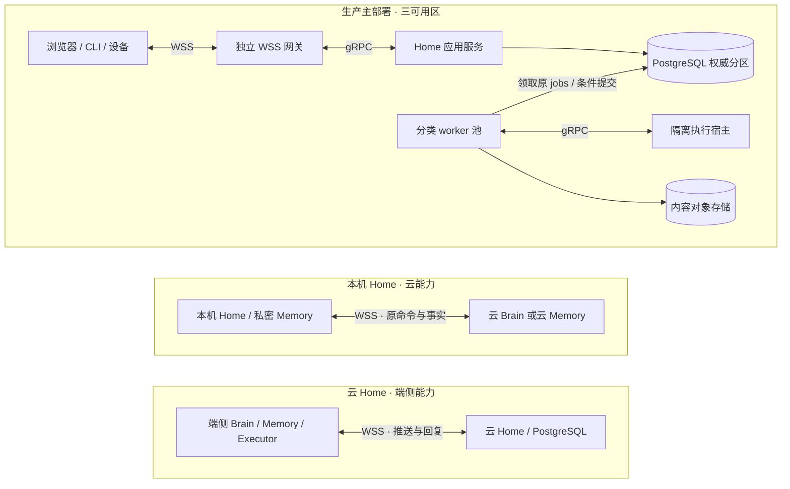
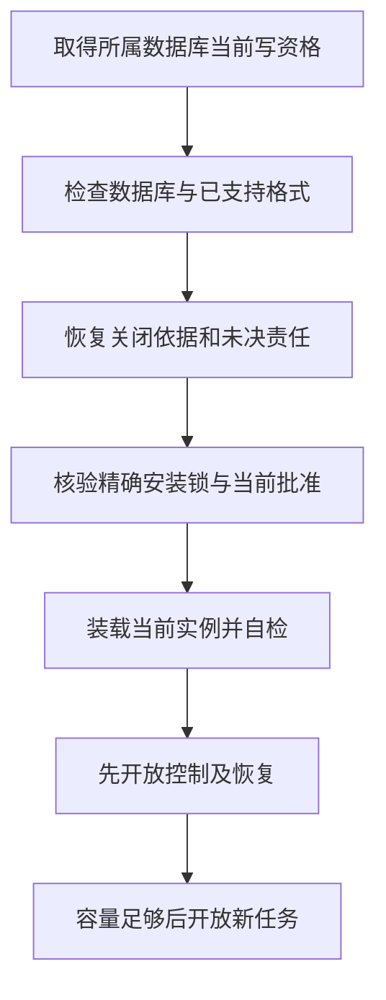

# 生产基线、部署与容量

[总览](README.md) · [生产分布式部署](deployment-production.md) · [存储与中间件](storage-and-middleware.md) · [宿主与扩展](extensions/README.md) · [验收](validation/README.md)

默认实现面向多用户生产分布式服务：独立 WSS 网关、Home 应用服务、按工作类别划分的 worker 池和隔离执行宿主分别伸缩；同提交域内的业务事实、回执与后续责任共同提交。完整单体仅用于开发调试，端侧组件和混合装配复用相同接口与状态语义。

本页维护语言、端云装配、容量假设及共同宿主接口。[生产部署](deployment-production.md)展开进程与多可用区拓扑、稳定路由、通道重绑、数据库切换、故障剩余容量和过载验收；[存储与中间件](storage-and-middleware.md)集中定义数据库、对象存储、连接池与工作唤醒的职责和取舍。分区与进程扩容不改变 Task Home。

## 1. 选型与替代条件

下列为本方案的默认实现选择，技术依据核查日期为 2026-09-26；安装锁还须固定经过验收的补丁版本和依赖摘要。

| 选择 | 采用原因、代价与替代条件 |
| --- | --- |
| Go 1.27 系列 | 云服务、本地宿主、CLI 和默认组件统一使用 Go，以同一套接口和并发控制代码装配单机与服务进程。维护者承担按 OS／架构构建制品，以及浏览器 SDK 的类型生成与映射成本；需要原生库的组件另固定 cgo 与系统依赖，不承诺所有制品均可静态链接。核查时最新补丁为 1.27.1，安装锁以实际验收版本为准；Go 在两个更新的大版本发布后停止支持原版本，须随受支持版本升级。[Go 发布政策](https://go.dev/doc/devel/release) |
| 同进程 Go interface；服务间 gRPC + Protobuf | 同进程直接调用并共享明确的事务句柄；跨进程服务按[gRPC 绑定](contracts/grpc.md)用 Protobuf 定义 RPC 外壳，内层复用严格 JSON 领域 Schema，生成客户端和服务端接口。部署拆分增加协议适配与兼容性验收成本，不能把需要共同提交的领域步骤拆成 RPC。模型供应商和第三方 API 沿用其原生协议，由适配器转换。[gRPC 服务定义](https://grpc.io/docs/what-is-grpc/core-concepts/) |
| 生产采用托管 PostgreSQL、对象存储与连接池／平台能力 | 单地域三个可用区，基础设施托管优先而不绑定厂商；数据库保存业务事实及 jobs，对象存储保存准确版本字节，连接池控制数据库并发。产品能力、失效行为和验收条件集中在[存储与中间件](storage-and-middleware.md) |
| PG jobs 共同提交，有限批扫与可丢通知配合 | 数据库保存唯一持久责任，批扫负责重新发现到期工作，通知加速唤醒。默认基础设施已提供事务、调度依据和恢复入口，独立 MQ／Redis 只在具体负载或集成收益得到验证后引入；启用条件与责任划分归[存储与中间件](storage-and-middleware.md) |
| 端云 WSS 双向长连接 | 浏览器、CLI 和设备共用命令、回复、交互和主动推送通道；端主动建链，不要求入站地址。接入层承担连接内存、慢端流控及重连成本，按[传输契约](contracts/transport.md)恢复原命令；HTTPS 保留发现、认证及大内容字节，上传／镜像管理通过 WSS／gRPC。相较设备另用 gRPC 双向流，少维护一套端云绑定 |
| 词法检索默认，向量索引为可替换派生能力 | 先确保权限过滤、来源和纠正可解释，再凭冻结评测比较检索质量；语义检索有明确收益时启用。完整策略归[记忆](memory/README.md) |
| 开发单体及适用端侧组件使用 SQLite WAL 与本地文件库 | 复用领域事务和恢复用例，减少调试装配成本；本机写队列串行，不能由多主机共享 SQLite 文件来扩容。生产容量与容灾按 PostgreSQL 配置单独验收。[SQLite WAL](https://www.sqlite.org/wal.html) |

生产服务以 Linux 为参考目标，开发与端侧宿主同时覆盖 Linux 和 macOS；CLI 和 Web 不绑定桌面应用框架。浏览器 UI 与 JavaScript SDK 可使用 TypeScript；Python 或其他语言工具通过进程／网络适配器接入，避免为生态适配而改变公共状态语义。上述均为拟实现与拟验收平台，不是现有可用产品声明。

## 2. 三种必须验证的装配

下图先给出生产主部署，再给出两种端云混合装配。节点表示进程角色或存储，实线表示通信与存储访问；每个具体任务仍只有一个 Home，Memory 和 Executor 可以保有自己的领域记录。完整三可用区副本关系见[生产拓扑](deployment-production.md#2-拓扑路由及数据放置)。

生产角色默认多副本运行，同一分区由一个数据库主写域及任务条件事务裁决；备用进程不凭超时创建另一个数据库主。角色划分为独立伸缩和隔离服务，一个角色可装配多个模块，需要共同裁决的事实继续共享短事务。

开发单体可在一个宿主装配 Home、默认三系统、SQLite 与本地内容库，用于复现和调试同一领域契约。它不作为生产规模、可用性或隔离基线。本地宿主启动仍先取得单实例锁并打开原数据库，再恢复未决 jobs、权限与设备控制事实，最后开放新接纳。

全部权威和依赖在本机的任务没有公网可用性前提。混合部署缺少远端依赖时，该步骤进入等待；云 Home 不可达时，端侧只能在已接纳的有限工作和许可范围内继续，不自行推进同一任务的新目标。

跨端 Brain 必须作为可独立替换的组件执行 Decide 合同；本机 Brain 调用云模型不满足此项验证。Memory、Executor 同理，至少分别验证一次远程部署与一次不同实现替换。

## 3. 持久化、备份与接替

生产 PostgreSQL 的同步提交、旧主隔离和候选提升条件以[生产可用性](deployment-production.md#availability)为准，连接池、备份及内容持久化职责以[存储与中间件](storage-and-middleware.md)为准。多个应用副本共享原分区权威，不以另建空库恢复同一 Home。

开发单体与适用端侧 SQLite 配置 WAL、foreign_keys=ON、synchronous=FULL；在 WAL 模式下 FULL 为每次提交同步 WAL，仍依赖操作系统和设备正确实现持久写入。[SQLite synchronous](https://www.sqlite.org/pragma.html#pragma_synchronous) 不把易失缓存写入当作接受任务。

大内容先写临时对象并同步，形成不可变版本后再把引用纳入业务事务。提交失败产生的孤儿对象可以清理；已被持久任务引用的对象先核对保留责任，不能按文件创建时间盲删。云对象存储需验证不可变版本读取、写后读取、摘要和删除回执能力；产品名称不代替这些验收。

备份包含一致数据库快照、引用内容及版本锁。SQLite 使用在线备份 API 或停写一致快照，不单独复制正在使用的主数据库文件。[SQLite Backup API](https://www.sqlite.org/backup.html)

备份恢复不能直接重开行动。恢复入口先隔离原宿主／旧数据库主，获取备份之后的授权撤销、命令接纳和外部执行记录，核对未决操作；不存在可证明完整的后续记录时，以只读诊断方式恢复，相关操作标缺口。丢失历史后从旧快照重复写入不属于灾备成功。

| 故障范围 | 恢复方式与成立条件 |
| --- | --- |
| 工作者进程崩溃，数据库完整 | 重新领取原 job，查原命令；旧 lease_epoch 不能再提交 |
| 本机进程重启 | 单实例锁、原数据库与控制事实完整；先恢复后开放新工作 |
| 云主节点故障 | 数据库平台完成旧主隔离、选主及持久记录完整性证明；Home 的逻辑 ID 不变 |
| 数据库或内容永久损坏 | 从一致备份及完整后续记录恢复；无法核清则限制行动，报告实际损失范围 |
| 插件格式升级失败 | 按[扩展设计](extensions/README.md)恢复兼容版本；不能用业务数据库回滚删除已发生的操作 |

生产已确认单地域三可用区：单可用区失效时，已确认账本 RPO=0，原 Home 恢复控制与查询 RTO≤60 秒；新工作开放时间另计，整地域故障按受限灾备恢复处理。这些是必须取得运行证据的目标，平台不满足旧主隔离、完整账本及第二耐久副本条件时停止相应写入。开发和端侧本地库不承诺磁盘毁损下零丢失；任何 RPO 都不授予重做未知副作用的资格。

## 4. 从规模目标推导负载

千万注册用户影响账户和长期存储，百万日活影响任务量，十万在线指用户数。设在线用户数为 `U`，每在线用户活跃会话／设备数为 `a`，每会话平均原逻辑服务连接数为 `b`（包含并行连接），则外部 WSS 连接数为 `C = U × a × b`。容量实验初值为 `U=100,000、a=2、b=1`，得到 20 万 WSS；这些展开值是测量假设，不是对用户设备行为的固定限制。

| 变量 | 初始假设 | 推导或用途 |
| --- | --- | --- |
| DAU、每天每活跃用户任务数 | 1,000,000；5 | 每日 5,000,000 个任务，平均约 57.9 个/秒 |
| 高峰与平均比 | 5 | 设计实验约 290 个任务/秒 |
| 每任务模型调用数、平均占用时间 | 4；8 秒 | 高峰约 1,160 次调用/秒、9,280 个在途调用；需单独验证供应商配额及费用 |
| 每任务从接纳至终态的平均活跃时间 | 300 秒 | 高峰持续且到达／完成率稳定时，约 87,000 个活跃任务；运行、排队、等用户与等依赖分别计数和测量 |
| 每任务业务提交数 | 暂按 20 作为建模下界 | 高峰至少按约 5,800 次事务/秒起测；另计领取、续租、Grant、回执、控制、清理及恢复写入，不把下界当数据库容量 |
| 每任务保存内容 | 200 KiB | 每日约 0.95 TiB 原始内容，未含副本、索引与截图；必须按用途设置保留期 |
| 在线用户、对象变化提示频率 | U=100,000；每用户平均每 10 秒一次 | 原始对象提示约 10,000 条/秒；向会话／服务订阅的实际扇出、合并率、快照重读及权限检查另计 |

对 `a × b` 相对初值进行 1 倍、2 倍、4 倍敏感性实验，保持同一用户任务负载，单独观察连接增长。下表心跳按每连接每 30 秒一组 ping/pong 估算；如果两端独立发起心跳，另计额外消息。全重连按 60 秒完成估算均值，实际峰值仍受退避、抖动及限流影响。

| 连接展开倍数 | WSS 连接 C | 心跳组数／秒 | 60 秒全重连平均握手／秒 | 单一发送方向按每连接 4 MiB 全排满 |
| --- | --- | --- | --- | --- |
| 1 倍：a=2、b=1 | 200,000 | 约 6,667 | 约 3,333 | 781.25 GiB |
| 2 倍：a×b=4 | 400,000 | 约 13,333 | 约 6,667 | 1,562.5 GiB |
| 4 倍：a×b=8 | 800,000 | 约 26,667 | 约 13,333 | 3,125 GiB |

排满值只是逐连接上限相加，不是可兑现的进程内存预算，也不包含 TLS、内部流和其他运行内存。实际按连接、租户、进程和故障后剩余容量中最先达到的边界背压。对象提示以每个实际匹配会话／服务订阅的扇出系数展开；例如初值两会话均订阅同对象时，10,000 次对象提示对应 20,000 次发送，随后还须测量完整快照读取的带宽与当前资格核验。

网关保持外部 WSS，内部 EndpointChannel 可重绑；30 分钟内部委托轮换只进入内部认证、建流、短时积压及订阅快照恢复预算，不按外部 WSS 全重连计算。网关退出则执行分批排空和端侧重连；两类事件的限额及恢复规则见[生产连接设计](deployment-production.md#connections)。

云端先按 tenant_id 路由到稳定 Home 分区，使大部分同用户工作落在同提交域；热点用户可为新任务配置额外 Home。每项任务在原创建命令定稿前选定 Home，创建后 task_id→home_id 映射不在执行中变动。路由重试指向原 Home，不随机落到新分区重新接纳；具体扩容与目录恢复见[稳定映射](deployment-production.md#21-稳定映射与扩容)。

首阶段就在生产进程形态下测量单分区的可接受延迟、批扫开销和写放大，再确定分区与各类副本数。独立网关和工作池是基线；是否增加外部队列或缓存，以[中间件改选条件](storage-and-middleware.md)和实测瓶颈决定。容量规划同时覆盖正常高峰、单区故障、内部通道重绑及集中重连、积压恢复，不能用理想平均值作为机器数量承诺。

## 5. 有界资源与过载

下列为参考实验的初始配置，均可按装配显式调小或经测试调大。它们不构成最终规模承诺。

| 资源 | 初始上限 | 达到上限时 |
| --- | --- | --- |
| 每用户活跃任务、模型调用在途数 | 16；4 | 同用户跨副本共享份额；接纳可排队到待处理上限，新模型调用等待 |
| 待处理任务／用户 | 100 | 接纳前返回 overloaded；已有任务不被丢弃 |
| 单任务决策轮数／上下文补充轮数 | 100；每次决策最多 3 次补充 | 保存可解释原因，等待用户调整或失败；不能重置计数绕过 |
| 内部委派深度／活跃子数 | 4；8 | 拒绝新委派，已有子继续受控收尾 |
| 单步安全重试 | 最多 2 次额外尝试 | 失败或原效果核对；不可重复动作不因此获得重试权 |
| 控制和收尾工作 | 每分区各有非零专用工作与数据库连接份额，按故障剩余容量核定 | 正常工作不能占尽；远端依赖仍需单独可用 |
| 持久存储保护水位 | 剩余空间低于 10% 停新接纳 | 留给已接纳回执、控制及收尾；不删除原未知责任 |

长连接另限制每连接在途请求、未交回投递、订阅数及队列字节，并为控制／收尾保留容量；具体初值以[传输限额](contracts/transport.md)为准，不能由 goroutine 数量代替背压。

公平调度同时受每用户、每提供方、每设备和全局并发约束。云端行级访问控制作为应用检查之外的防线，工作者使用不绕过 RLS 的受限角色；表所有者、超级用户及 BYPASSRLS 角色的例外必须在部署测试中排除。[PostgreSQL 行安全](https://www.postgresql.org/docs/18/ddl-rowsecurity.html)

Go 实现把已接纳工作保存在 jobs，再由有限工作池领取；应用工作 goroutine 数、channel 缓冲、RPC 在途数和流缓冲均有上限及所属生命周期。排队不为每项持久 job 常驻一个 goroutine。CPU 密集检索、推理和图像处理按资源预算运行在工作进程或独立服务，控制与收尾保留自己的工作份额。

## 6. 运行验证

生产测试从独立网关、Home 应用和 worker 多副本装配开始，覆盖条件更新竞争、单区故障、连接池耗尽、可丢唤醒全部丢失、内部通道重绑、网关集中重连、单租户洪峰和恢复积压。记录接纳、取消、核对、控制排队时间及拒绝比例，并在同一工作量下报告连接展开的三档结果。开发与端侧本地测试另覆盖断电模拟、磁盘满、内容缺失、单实例竞争和旧备份恢复。

生产同地域非模型接纳／控制提交以 p95≤300ms 为首轮时延目标，完整可用性口径归[生产验收](deployment-production.md#42-可用性与时延验收口径)；单可用区故障另验证账本 RPO=0 和控制／查询 RTO≤60 秒。必须固定硬件、负载和统计窗口，不包含外部模型完成或离线设备控制确认。开发单体可用 p95≤100ms 辅助发现本地退化，其结果不能替代生产目标。

## 7. 默认宿主的装配与持久接口

本节把选型落到首个实现的共同边界；各领域的表和业务事务归各模块的 implementation。宿主只提供事务、时钟、身份、内容介质与工作领取，不增加能绕过领域裁决的通用业务状态机。内核实现与 SDK 分发按同一精确安装锁冻结。

各领域实现为 Go package，向调用者暴露小型 interface 和领域值类型；应用服务组合规则、repository 与外部 port，具体数据库和网络代码作为适配器注入。CLI、本地宿主与云服务入口只承担配置和装配。Protobuf 生成类型在 RPC 适配器处映射到领域类型，领域规则不依赖传输连接；Go 工具链、模块依赖和生成器版本均进入可复现构建与安装锁。

`context.Context` 传递一次本地调用的截止时间和停止信号。请求断连或 RPC 超时不代表任务取消、事务未提交或外部效果未发生；调用方按原命令查询，业务取消仍以负责方持久决定为准。已接纳 job 由宿主生命周期和该工作的期限管理，不继承已结束请求的 context。调用 cancel 也不证明 goroutine 或外部调用已结束，释放工作槽前须观察实际退出，未结责任留在原记录中。[Go context](https://pkg.go.dev/context#CancelFunc)

| 宿主接口 | 输入与输出 | 成立条件 |
| --- | --- | --- |
| transaction | 同一租户、原命令上下文、纯本地读写闭包 → 已提交值／冲突／结果未知 | 不允许外部网络、模型或驱动调用；只有提交后才能发布接纳回执 |
| command_store | 原服务、租户、命令ID、规范请求摘要 → 原回执／关闭索引／首次接纳资格 | 唯一键由数据库约束，不能仅查内存缓存；回执与业务／job同事务 |
| job_store | 领域关联、工作种类、到期、领取代次 → 原工作 | 领取不是业务接纳，旧代次不得提交；详情归[运行时](task-runtime/implementation.md) |
| content_store | 已核验临时字节及准确引用 → 不可变内容 | 字节先耐久、引用后提交；元数据门禁互斥引用与孤儿清理 |
| identity_store／credential_store | 受信会话或令牌校验值 → 当前主体及范围 | 原始凭据不入领域表，令牌到期／撤销逐请求检查 |
| clock | 当前单调时间、UTC及可信界限 → 截止判断 | 无可信界限时关闭依赖远端缓存窗口的新启动；本地事务许可独立可用 |

生产以 tenant 和固定 Home 分区绑定数据库连接，各领域只能通过自己的 repository 修改事实，禁止事务中临时改租户。跨领域需要共同提交时，由宿主传递同一事务句柄给明确参与者；插件不能取得任意表访问接口。开发单体可让适用领域共享 SQLite 文件，复用同一事务 API；端侧独立 owner 仍只管理自己的账本。

生产按[运行时的锁定顺序](task-runtime/implementation.md#21-锁定顺序)，先取得原命令键，再判断祖先任务、预算与领域对象，最后保存工作和回执；不需要的层次跳过。首次命令以唯一键插入事务内占位，冲突方等待原事务后读固定决定，不能提交一项没有处理责任的空占位。执行、授权 owner 独立部署后各自提交，不能把共库代码路径当跨库原子事务。本地 SQLite 写事务采用单写队列与短 `BEGIN IMMEDIATE`，只在已有事务尚未建立且无外部动作时有限退避重试。

## 8. 首次启动、重启与迁移

图建模宿主开放入口的顺序。任何一步失败停在诊断和允许的本人管理入口；不能通过创建新空数据库或忽略旧安装锁宣称恢复成功。新数据库先建立根身份与受限会话，再核对发行制品及兼容性证据，通过[首装流程](extensions/implementation.md)创建第一份批准与激活；它不依赖完整改善评测系统先运行。

本地锁使用数据库目录内仅本用户可访问的 OS 排他锁，持锁句柄覆盖宿主生命周期；进程退出由 OS 释放，不以文件里旧 PID 是否存在自行接管。数据库目录必须处于本机支持的文件系统；多机共享目录拒绝开放写入口。云端写资格由数据库平台的主写域及旧主隔离保证，应用租约不替代数据库选主。

迁移先核验安装锁声明的可读格式范围和精确迁移步骤摘要。兼容迁移按[生产发布规则](deployment-production.md#production-release)在线限量回填；不兼容迁移才阻止受影响分区的新目标工作并排空相关责任。每个步骤以唯一 migration_id 保存开始、检查点和完成。数据库结构迁移在可原子提交范围内完成；内容重写采用新不可变版本并逐批提交映射，旧版本在责任交接前保持可读。步骤恢复先查检查点，不重复运行外部工具；不具备幂等或可核验恢复的迁移拒绝执行。步骤完成但答复丢失按原 migration_id 返回结果，不再次生成新数据版本。

重启先取得原数据库权威，再恢复控制、墓碑、待交回回执、未结费用及清理，随后重装当前精确组件并登记当前实例的就绪依据。旧 worker 可能发送过的动作按原身份继续查；不能凭“本进程没有发送过”认定未执行。旧活动指针只能定位应装载版本，不能代替[当前实例开放证明](extensions/implementation.md)。

## 9. 存储保护、关闭索引与备份

数据库和内容存储分别设置保护水位，触发后先禁止新任务、模型和上传，不再预留新增正文。每次正常接纳在预算内同时预留该工作最坏情况下的回执、控制和收尾元数据空间；生产通过平台容量与准入限额兑现保留空间，控制工作另留份额。开发及端侧文件库可按宿主能力使用应急文件，不能假设托管数据库允许应用操作其数据目录。必须通过空间不足实验验证可兑现的元数据容量，不能只配置“剩余10%”就声称任何故障均可继续写。

若连控制决定都无法耐久提交，入口明确返回不可用／结果未知，进程内同时尽力阻止新发送；不得答复“取消已保存”。可回收的临时上传与无引用内容优先清理，恢复可写空间后先恢复必要收尾；未知效果、命令去重和最后一份关闭依据不作为可删空间。重新验证持久性与容量后才能开放新接纳。

最小关闭索引长期保留，其键、值与可合并判据归[共同契约](contracts/README.md)。按每日 500 万任务，仅任务身份一年就约 18.25 亿个，命令与操作身份另计。设每天新增命令关闭数为 `N_cmd`、不可合并操作／任务关闭数为 `N_close`、平均索引记录含数据库开销为 `B`，则一年新增量约为 `365 × (N_cmd + N_close) × B`；B 必须用实际索引与页利用率测量。活动记录、完整历史和最小关闭依据的分区与归并按[存储设计](storage-and-middleware.md)实施，副本、备份和旧身份查询能力都进入容量预算；跨分区拆分不能遗失原 owner 映射。

备份清单绑定数据库一致切点、内容版本集合、安装锁、关闭索引与凭据恢复策略，写入完整摘要后才标记可恢复。恢复到旧备份需取得切点之后的关闭、撤权、命令和效果事实；无法证明完整时只读诊断，禁止新副作用。凭据不直接从备份恢复为有效新实例，密钥托管器先确认当前代次。备份内容与关闭索引分别列保留期和授权，不能把不再保存正文解释为允许恢复旧正文。

运行验收必须覆盖：双宿主争抢锁、写事务提交后杀进程、控制写入时磁盘满、未决操作期间数据库备份恢复、迁移中途崩溃，以及租户索引／领取公平性。跨模块可复现步骤见[故障实验设计](validation/fault-experiments.md)。
