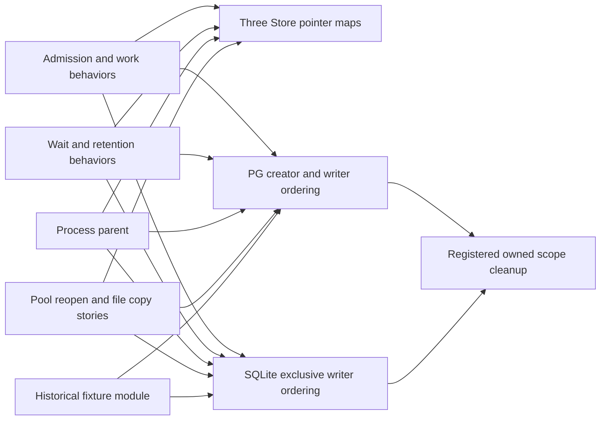
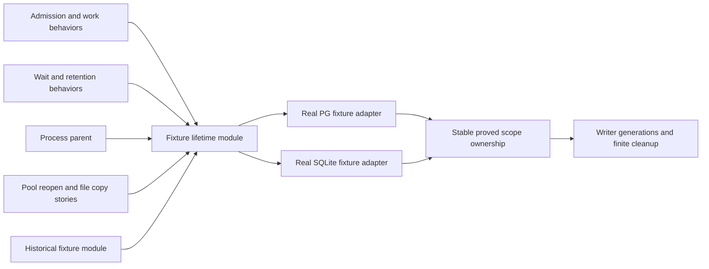

# 切片 02 architecture exploration — FINAL READONLY

最终准确 inspected code SHA：`6783307ebe7d802f78f9aa7bdb1a1464ec5749e1`（`codex/lerna-implementation`），2026-10-03，工作区 clean。完整切片基线：`8e7438e071727e25aa69e17fb81b2e53c416b78e`。已从准备 pin `6211bff647c61d9c6a4994cfbf254bc26d9fba7a` 按实际 git diff 窄刷新；本报告可用于最终 HTML 和候选选择。**FINAL READONLY 表示架构探索已固定，不表示两轴复核或整片 02 已退出。**

结论：**1 个 Worth exploring 候选，0 Strong，0 Speculative。** 候选仅深化真实数据库 conformance fixture 的 scope 归属与 writer 生命周期；当前产品 modules 的 depth 不支持额外重构。没有架构实现批准，也不把此候选列为切片 02 的正确性阻塞。

## 范围与实际热点

只读读取根 AGENTS.md、唯一领域上下文 CONTEXT.md（本仓库没有另建 GLOSSARY）、improve-codebase-architecture/codebase-design 两个 SKILL.md 与 HTML-REPORT.md、ADR-0003/0004/0010、runtime/data-model 架构、02 spec、adopted admission/layout/processing/legacy/scheduling/capacity-expiry/fair-eligibility/retention/lock-scope 决定、实际 issues 与 tracked code-review。沿最近 35 条真实 log 与热点文件展开，不把旧准备稿的判断直接沿用。

最新实际产品热点 `06ab246` 已合入 `96a0ecc`：持久 pool/config/FIFO、真实 lane 服务机会、同库多 owner 合计 quota、无执行额度 maintenance、scope binding 已实现。扫描覆盖 runtime、internal/durableworkdemo、host/durablework、两种真实 SQL adapter、recovery 的 admission/work/wait/retention/migration/process/pool fixture 与 psql 工具生命周期。旧准备 pin `7fa7594` 的“06未读取”限制已解除。

本轮没有改 repo/worktree，没有运行测试、启动或操作数据库、Docker 或其它服务。已记录的测试证据仅按 tracked docs 阅读，不声称独立重跑。tracked code-review 的 4 个 finding 全归单一 fixer：PG error cause、陈旧 README、Start/Finish 重复准备、Pool Run 下一唤醒；不重复列为架构候选，最终 refresh 已检查它们影响的 module 形状；探索当时两轴独立 follow-up 仍待报告；随后同准确6783307两轴均0新增、原4项关闭，详见[审查记录](code-review.md)。

## 当前 modules 已赚取 depth

- **Command admission module**：`runtime/admission.go:61`、`:67` 把原键优先、准确摘要、dependency gate、新命令截止、固定决定及 commit_unknown 留在同一短 Tx interface 后。删除会让这些顺序约束重回每个 consumer；现有 seam 有 leverage。`internal/durableworkdemo/service.go:46` 保留演示前态裁决，runtime 不解释 text/project；不要为未来 03 提前重做这一 interface。
- **实际处理 module**：`internal/durableworkdemo/step.go:11`、`:47`、`:64`、`:89`、`:208` 使 Claim/Start/事务外计算/Finish 的语义可经同一 Host seam 驱动。二次取可信时间是锁取得后的真实资格复核；不以“重复”删掉时点含义。最终 `prepareClaim`（`step.go:166`）已在同文件收拢 Start/Finish 准备，同时保留锁后第二次取时及 pool+Claim 双复核；这是已 tracked 修复，不另列候选。
- **Pool scheduling module**：`internal/durableworkdemo/pool_worker.go:14`、`:40`、`:98` 与 `work.go:50` 的 advisory selection → owner-local Claim 不是 shallow 透传。它必须在同一已声明 pool 的持久 FIFO/实际 quota 上重查，避免把建议当 authority；`maintenance.go:10`、`:101` 隔离受信维护与实际执行资格。删除会把多个当前 Host/worker 的公平、有限分页、scope/owner 知识外泄。较宽的内部 PoolRepository 有两种真实 adapter，隐藏协调/锁/计数/有限 metadata SQL，不能凭方法数或约 480 行认定 shallow。
- **两真实 SQL adapter**：`adapters/postgres/pool.go:17` schema 限定协调和 `adapters/sqlite/pool.go:16` 的 BEGIN IMMEDIATE、PG Claim 的 SKIP LOCKED 与 SQLite 单 writer/WAL/FULL/Close drain 是实际 variation，支持既有 seam。重复 SQL 外观不等于共享 ORM 收益；consumer 保留业务裁决、adapter 保留数据库 implementation 的 locality。ADR-0004 不需要重开。
- **Host assembly module**：`host/durablework/host.go:18`、`:24`、`work.go:16`、`:22`、`pool.go:8` 是既定装配 seam。aliases 和构造透传允许同一测试 surface 使用真实 consumer，不把业务迁回 host，不为删除几行增加抽象。
- **Process/psql modules**：真实 OS child 的有限 framing、cancel、Wait/reap，以及 exact CID cleanup 隐藏实质 implementation。删掉会把重要收尾知识散回故障 callers；不因文件长就拆通用 process 或 resource framework。

## 候选：集中 fixture 的稳定 scope 归属与可替换 writer 生命周期

**推荐强度：Worth exploring。依赖类别：ports & adapters。**

**Problem**：共享行为 caller 为重开、交给 child、限制连接数及清理，必须理解三张 Store-pointer map、PG creator 与 writer 的不同归属，以及 SQLite 独占 writer 的关闭次序。

**Solution**：让一个 fixture lifetime module 持有本次确证创建的 scope 归属，内部安排 PG/SQLite 的 writer generations 与有限清理，使普通行为 caller 取得真实存储并完成生命周期故事时不再手动维护这些规则；不预定具体 interface。

### 当前精确证据

| 当前路径与行                                                                                                           | caller 现在必须知道的 interface 事实                                                                                                                                                                                                                                                                                                                                      |
| ---------------------------------------------------------------------------------------------------------------------- | ------------------------------------------------------------------------------------------------------------------------------------------------------------------------------------------------------------------------------------------------------------------------------------------------------------------------------------------------------------------------- |
| `conformance/recovery/admission_test.go:26`, `:36`, `:54`, `:62`, `:154`                                               | PG 配置按创建 Store 指针登记；清理依赖这个仍有连接且 created=true 的 Store；reopen 通过原指针找配置，但新 Store 不自动继承归属或 registration。                                                                                                                                                                                                                           |
| `conformance/recovery/adapter_admission_test.go:38`, `:40`                                                             | 第二张全局 map 单独登记 reopener；共享行为 caller 须把正确旧 Store 传入，缺 registration 时在测试中失败。                                                                                                                                                                                                                                                                 |
| `conformance/recovery/sqlite_test.go:29`, `:31`, `:39`, `:88`                                                          | 第三张全局 map；reopen 必须先 Close 唯一 writer；durability 循环手动给每个 replacement 登记配置与 Cleanup。                                                                                                                                                                                                                                                               |
| `conformance/recovery/adapter_work_test.go:605`, `:608`, `:610`, `:612`                                                | 共同行为里识别 PG、保 creator 只为清理、另开实际 writer、给 writer 注册 reopener，然后才可真实 Close/reopen。SQLite 次序不同。                                                                                                                                                                                                                                            |
| `conformance/recovery/wait_test.go:33`, `:35`, `:38`, `:43`, `:44`                                                     | 为证明等待不占连接，caller 从配置 map 开 MaxOpenConnections=1 的实际 writer，再独立注册 cleanup/reopener，同时不能关 creator。此配置需求是当前真实测试，不是假设未来用法。                                                                                                                                                                                                |
| `conformance/recovery/retention_test.go:242`, `:244`, `:253`, `:257`, `:269`                                           | retention 另写 backend type switch 与 reopen/registration/cleanup；PG 并开连接、SQLite 先关旧 writer 的差异落在行为文件。07曾有第二次 reopen 缺登记的真实失败记录。                                                                                                                                                                                                       |
| `conformance/recovery/process_fixture_test.go:284`, `:289`, `:290`, `:293`, `:296`                                     | parent 从指针 map 抽 schema/path；SQLite 先 relinquish writer 给 child；PG parent creator 保清理归属。child descriptor 能打开 scope，不自动获得删除归属。                                                                                                                                                                                                                 |
| `conformance/recovery/migration_test.go:42`, `:269`, `:297`, `:362`, `:367`, `:371`, `:415`, `:434`                    | historicalFixture 已局部隐藏版本/故障/reopen，有 depth；两个 backend 仍各自安排 owned scope 与 current product writer。历史装载/来源验证保持独立，不塞进 lifetime module。                                                                                                                                                                                                |
| **06 新 caller** `conformance/recovery/pool_test.go:465`, `:718`, `:1188`, `:1203`, `:1204`, `:1315`, `:1317`, `:1340` | pool/FIFO/maintenance 重开复用现有 map seam；同 scope 两 PG Store 继续依赖 creator；真实闭库复制测试从 map 取得 SQLite path、关闭原 writer、打开新的 owned path、重开原 scope。跨 owner 的 pool 配置不改变物理 scope 归属规则。最终修复另在 `:966`–`:977` 配置并清理同 scope 的真实 fault-holder Store；此类专有故障保持实际配置，但普通 lifecycle bookkeeping 仍未集中。 |

以上证据并非重复行数：正确测试需要了解“同一已确证创建的物理测试 scope”与“可以退出、更换、交给 child 的 writer”两个生命周期。04 已实际修过 creator 被关导致清理失效；07 已实际修过重开注册缺失；06 增加同 scope 独立 Store 与实际 file-copy 正常/拒绝故事。这是当前 friction，不能据此宣称现在测试失败。

### Before / After 责任关系

Before（红色泄漏含义由 HTML 表达）：

After 候选（仅职责，不是具体 interface 设计）：

候选 seam 只位于当前 test fixture 获得/接替/交接真实存储的位置。产品 Store.Tx 的 same-Store/owner token、consumer 的 Host seam 和公共 command.get interface 保持；不把 scope/path 当成新的逻辑 owner，不复制产品 pool/FIFO 规则。

### depth / deletion test / leverage / locality

现有 `database`/`sqliteDatabase`/reopen helpers 已经隐藏创建配置与基本打开，它们不是可直接删除的 shallow 垫片：删除会把复杂度分回 callers。真正待深化的是**caller 仍需管理的归属和 writer 顺序**。

候选只有在删除普通 behavior caller 的 backend branch、pointer-map registration、creator 保活/cleanup 次序知识后才有 depth。删除拟议 module 会使这些规则重新出现在 work、wait、retention、process 和 pool callers，因此能产生 leverage；正确 creator/provenance 与所有 writer generations 的有限退出可在一处判断，产生 locality。

若最后只是移动三张 map、给现有 helpers 换文件，仍要求 caller 手动登记 replacement、安排 creator 或在业务故事里判断 backend，则 interface 知识没有减少，deletion test 只移动复杂度：**这种方案收益为零，不应实施。** 不用“至少六 callers”机械证明收益，不把 historicalFixture 已隐藏的故事重复包装成新工作。

可保留 backend 专有测试的具体配置/故障需求：single-connection 等待故事、PG 真独立连接竞争、SQLite 第二 writer 排除、真实完整闭库复制、历史 dump restore。隐藏 lifecycle ordering 不能隐藏这些测试正在验证的真实差异；只收拢普通 caller 不必学习的归属 bookkeeping。

### interface is the test surface

既有业务验收继续经实际 Host/可信 Clock/内部声明的 Tx-storage seam、公开 command.get、准确原 Job/Claim/Projection/PoolObservation 观察；继续使用真实 PG 与文件 SQLite，不增加内存 fake、私有业务行断言或内部调用次数断言，不跳过缺工具或必需数据库失败。

若实施，fixture lifetime module 的验证是当前真实生命周期故事：Close/reopen 后仍读回原身份与已保存状态；SQLite 下一 writer 只有在前 writer 退出后能接替；PG 独立 Store 共用原 scope 但成功 CREATE 归属仍保留；parent/child 交接不授权 child 删除；失败与取消后有限收尾报告实际结果。测试不是检查 map 项数或字段布局。

业务 assertions、故障同步点、正常对照与短有限 context 保持。四套冻结历史 artifact/source/checksum 及迁移故障仍由 historicalFixture module 负责；不为方便重写 fixture、制造旧行或生产 cleanup seam。

### 不改变的 known scope 与 historical unknown 限制

候选只能保护**本次确证创建并登记的 scope**：PG DropTestSchema 继续依赖本次 successful CREATE 的归属；SQLite 限本轮 owned temp path；产品、smoke、caller DB 与其它 scope 不清理。不存在基于 schema 名形状、prefix、时间或 table 行猜删除权限的捷径。

04 失败轮的 schema 归属已随退出进程 map 丢失，不能据模式重建 owns。新 module 不能追溯证明它已清理。07 unknown Docker CREATE 若没有完整 exact CID，也不能按 image/name/time 查猜删除；当前工具不会启动 psql，可能遗留未启动 container，文档限制保留。已完整登记 CID 的有限 cancel/cleanup 不等于 unknown CREATE 全控制平面回收。

psql/docker client process 生命周期、DB scope 归属、历史 artifact 装载不是同一种资源，不能合成一个宽 interface 的 global resource manager。当前候选不负责 nonce/name/label 跨进程控制平面回收，也不假称修好历史未知资源。

## Top recommendation

如用户要继续探索，先选 **fixture 的稳定 scope 归属与 writer 生命周期**，因为两个真实 adapter 与当前多个生命周期 caller 已有实测摩擦；先证明能减少 caller 所学 interface 再决定是否实施。它是可选 locality/leverage 改善，无现有 ADR 冲突，无未来 03、ORM、框架、生产吞吐或外部效果承诺。

## 最终窄刷新结果

准确 diff：`git diff 6211bff647c61d9c6a4994cfbf254bc26d9fba7a...6783307ebe7d802f78f9aa7bdb1a1464ec5749e1`；14 个 changed paths。已读完整 product/helper/fixture diff、新 `pool_wake_test.go`、`startup_test.go`、README diff 和 tracked `code-review-fix-evidence.md`。没有新架构候选，也没有已实现的 fixture lifetime 集中；原 **1 Worth exploring / 0 Strong / 0 Speculative** 结论保持。

- **Wake module**：`internal/durableworkdemo/pool_worker.go:131`、`:157`、`adapters/postgres/pool.go:490`、`adapters/sqlite/pool.go:488` 把所有声明 members 的 future due/lease 与 current/live-claimed 两修订的未结 deadline 汇总在现有 pool read seam 后；最早未来时间受 positive finite fallback 限制，已 due 但 quota/lock 不可用时不返回零等待。Run 实际进展后再给有限机会，空/blocked 时由每 lane 的注入 Timer 在 Tx 外等待，默认 WallTimer；新增 read 不跨 owner 修改 input/projection。此处增加真实 depth，不能为了删除透传再搬进 runtime 业务策略。新真实双库故事分别驱动短合法 retry window、non-anchor/current 更短 deadline、claimed 更短 deadline、zero-quota maintenance、正常 hash 和原 receipt；维护仍一 member/page/机会，不承诺首次 deadline wake 就遍历相关 member。
- **Start/Finish locality**：`step.go:110`、`:166`、`:227` 共享同文件准备，保留 pool→input→Job 顺序、两次可信 Clock 和两组实际资格验证；helper 有两个实际 callers，不扩大公共 interface。原严格 Start/Finish seam 及业务测试不变。该 tracked 修复无需再成为候选。
- **PG startup error module**：`adapters/postgres/store.go:34`、`:40`、`:41`、`:54`、`:64` 用脱敏 Error 和 cause Unwrap 保留 Is/As 分类；`startup_test.go:20`、`:63` 经真实 startup seam 观察取消/超时、实际 parse classification 和正常连接，不引入泛用 error framework。
- **Fault-holder lifecycle**：`conformance/recovery/pool_test.go:966`–`:977` 创建同已登记 schema 的独立真实 Store，仅 holder Tx 是有限 10s；业务 Store 仍 3s，外层仍 15s。`:985`–`:997` defer release + 11s 有限 join 覆盖失败，`:999`–`:1008` 在真实断言间核验 holder context/完成 channel，`:1012`/`:1014` 使用 exact holder Store 取得锁，最后该 Store 的 Cleanup 在 owning schema cleanup 前执行。历史失败 `118.936s` 与隔离诊断 `7.282s` 的真实 holder expiry 保留，不把它说成生产维护或新 wake 缺陷；这个局部修复没有集中三个 pointer maps 或普通 caller 的 creator/writer 知识。
- **Docs 与冻结范围**：runtime/SQLite/Host README 的旧 ticket06 未实现句已同步，demo README 明确 all members/两修订/有限正等待/无跨 owner mutation。实际 diff 的 migrations 0001–0005、四组 frozen v1/v2 source/fixture、public contract 路径为空；no DDL/contract/source change 与 parent/tracked evidence 一致。

证据归属明确：本 agent 未重跑测试。tracked evidence/root 报告的最终 sequential whole count1 normal **50.359s**、race **103.345s** 均维持 timeout120；此前实际失败未隐藏。它们支持实际 fixture/产品路径的已报告验证，不自动关闭两轴复核、架构选择或准确最终远端 CI。

候选表其余八类证据文件在本次 diff 中未变；pool_test 受新 import 和 fault-holder 块影响的行号已按最终代码重新定位。三 maps、PG creator 独立归属、SQLite writer 排除、parent/child 交接及完整历史 fixture 的分工仍实际存在；known scope 清理与 historical unknown schema/CID 限制全部保持。Root 可生成 HTML 并进入选择/grill；本轮没有改 domain 决定、ADR、repo/worktree/DB，也未开始架构实现。

## Root 最终选择

已生成临时HTML `/tmp/architecture-review-1791066712436.html`，包含before/after、Tailwind/Mermaid CDN和静态样式；实际xdg-open exit3，无GUI，不声称浏览器渲染。用户授权的Astra代理经5轮11项frontier确认现在实施唯一候选，详见[采用决定](architecture-decision.md)与[票10](issues/10-owned-fixture-lifetime.md)。不新增领域ADR或第二词汇表。

当前仅完成探索、选择与发布；票10实际重构/证据/独立复核和准确新CI仍待完成。02核心与修复的6783307真实CI已success，不冒充票10验证；历史未知scope/CID限制保持。

## c52e68b结构收益独立复核

# 02 architecture benefit — FINAL READONLY（结构收益已实现，cleanup 正确性待修）

准确 inspected root/code pin：`c52e68b46c619df0c8e5df1b27a0b5dded3ef65f`，工作区 clean。产品测试代码提交：`1863fc49a0e57c087ee599a8296c2ccdfcf96a6e`。比较范围：`c6220fdf194e1f954f3b2c65d1cf31fc839c359c...c52e68b46c619df0c8e5df1b27a0b5dded3ef65f`；核对原 `/tmp/lerna-02-architecture-exploration-final.md`、采用的 architecture-decision、票10 Comments、18个 recovery 测试文件的变化与新三个文件。只读代码/文档，无测试、DB、服务、secret读取或repo修改。

**结论：唯一候选 structurally closed；确有 depth/interface 简化，超过 helpers 搬移。Cleanup 正确性尚不能退出。** 两个独立审查轴已报告“已确认 holder 退出但返回历史错误”会阻断后续清理；root 正交单一 fixer。这个已批准失败收尾规则的实现缺口，不是新架构候选。本报告不自动提新 refactor，不宣称 whole02 完成。

## 已取得的结构收益

Before：普通行为 caller 以实际 Store 指针追踪配置/reopener，在各故事维持 PG creator、replacement登记、SQLite先关旧writer、parent/child交接和Cleanup次序。

After：普通行为 caller 以稳定 `ownedFixture` 取得实际 Store，调用 CloseWriter/Replace；fixture 持有确证 scope 与writer generations，并协作现有 child/PG holder 模块完成有限退出。具体后端故障与历史加载知识仍留原故事。

| caller family：最终路径/行 | caller 不再承担的知识 |
| --- | --- |
| admission：`conformance/recovery/admission_test.go:30`；`adapter_admission_test.go:38`、`:560`、`:562`、`:572` | factory 返回稳定handle；原map/reopener helper删除，重复接替不登记新的Store指针。原 receipt/Host/query assertions保留。 |
| work：`conformance/recovery/adapter_work_test.go:612`、`:614`、`:629`、`:632`；`:566` | Close/reopen故事删除PG creator保活分支；并发故事用ConcurrentWriter取得真实后端差异，不自己判PG开peer。 |
| wait：`conformance/recovery/wait_test.go:29`、`:31`、`:32`、`:236`、`:298`、`:389` | single-connection PG setup仍明确1连接和显式Migrate，但不再保独立creator、手工注册replacement及Cleanup。共享wait故事只Replace。 |
| retention：`conformance/recovery/retention_test.go:93`、`:106`、`:146` | backend type-switch reopen与两种配置map、replacement Cleanup全部删除；原body-gone/原receipt/新revision事实仍经Host观察。 |
| process：`conformance/recovery/process_fixture_test.go:297`、`:300`、`:304`、`:326` | parent不再从map找schema/path或区分PG creator/SQLite Close；统一释放父writer，原observer通过同handle接替。 |
| historical lifecycle：`conformance/recovery/migration_test.go:47`、`:161`、`:188`、`:271`、`:337`、`:373` | 原PG admin独立清理、SQLitecurrent闭包及自写Reopen移入fixture生命周期；loader仍自己载入准确历史字节、完成restore后Open。 |
| pool：`conformance/recovery/pool_test.go:466`、`:720`、`:1141`、`:1158`、`:1270`、`:1271` | FIFO/maintenance接替用同handle；same-scope PG peer自动登记，真实SQLite完整闭库复制进入新owned scope，不自己取map/关库/注册清理。 |

对整个 `conformance/recovery` 搜索，`configurations`、`sqliteConfigurations`、`admissionReopeners`、`reopenAdmissionStore`、`retentionReopen` 与 `sync.Map` 均无匹配。新 `registerOwnedScope`（`owned_fixture_test.go:199`）仅将确证scope写入外部审计文件，包含实际Sync/Close；不是Store-pointer lookup/reopener registry的搬家。

## module、seam 与真实 adapter

`conformance/recovery/owned_fixture_test.go:23` 持有 scope、admin、current、peers及窄的holder/child状态。`:102` Store直接返回actual writer，`:105` Open真实PG/SQLite Store，`:128` CloseWriter只在成功后清空current，`:138` Replace同scope接替。没有Record/Observe/SQL业务CRUD proxy；same-Store/owner/active Tx约束和Host/public command.get seam保持。

PG adapter在`:69`–`:76`由私有admin实际CREATE成功后置owns；所有业务writer和peer均另开（`:118`、`:225`），admin/owns使用仅在fixture文件，普通caller不获得删除权。最终Drop使用admin（`:181`），不是某个已关闭writer或schema名称猜测。

SQLite adapter持本轮owned目录（`:80`、`:84`）。Close返回错误时current仍保留（`:132`–`:135`）；Cleanup在Close错误后不RemoveAll（`:162`–`:176`）。真实失败故事 `owned_lifetime_test.go:140` 驱动Close timeout、目录保留、排他peer拒绝、回调退出后重复cleanup成功。CopySQLite（`owned_fixture_test.go:244`）先确认Close，再读取完整file、写新owned path并实际Open；原nonce被复制的scope拒绝故事仍在pool测试。

两个adapter为真实PG与文件SQLite，其删除归属与writer排他确实不同，既有seam有必要；不因“两个”机械创建一套新Go interface。PGPeer参数只供当前连接/有限holder故事。没有泛用resource callbacks、ORM、未来03或产品cleanup framework。

## locality 与删除测试

删掉新fixture module，多个当前caller必须重新实现CREATE归属、creator/writer分离、replacement登记、成功Close后接替、child/holder退出后清理，因此它赚取depth；这是跨六类caller与pool的实际leverage。生命周期知识在一个module具有locality，业务断言与后端故障仍各自集中。

OS退出实现仍在process module：`process_fixture_test.go:153`关联实际child；`:547`只有Wait获得ProcessState才确认退出，`:556`有限Kill/Wait保留未知状态；fixture的`:112`/`:156`不允许未确认child时重开/删除。PG实际锁callback仍由故事声明（`pool_test.go:973`、`:974`），窄fault adapter（`owned_pg_fault_test.go:29`、`:78`）登记、release、11s join。实际holder10s、业务writer3s没有变。

历史loader的hash/source、COPY/metacommands、准确schema替换与真实迁移fault仍在 `migration_test.go:224`、`:268`、`:291`、`:323`、`:347`、`:362`、`:387` 等原模块；Open/Replace不隐式Migrate。新interface测试 `owned_lifetime_test.go:20` 经真实Record→Claim/Start→两次替换→public query/Host→准确hello hash→ownscope消失→neighbor仍可读，不以字段布局、map数或调用次数证明。

## 正确性与证据限制

**尚待修复的cleanup退出项**：当前 `owned_fixture_test.go:153`–`:155` 对joinPGHolders任意error立即return；`owned_pg_fault_test.go:80`–`:81` 在joined后反复返回历史result。实际Within已退出且result非nil时，所有writer/peer和knownscope因此永远到不了Close/Drop；重复Cleanup也无法推进。两轴已确认；结构收益不能替代此Round4/Q8聚合/可重试要求。最终fixSHA须窄确认“退出已证实”与“历史业务错误”分开处理，未知退出仍保留scope；不退回caller排Cleanup次序。

票10报告的真实red0.554s→green0.553s、完整顺序count1 normal52.406s/race93.619s（各timeout120）、make checks与27 frozen hashes是实施者证据，本agent未重跑。实际diff的runtime/internal/host/adapters/contract/frozen fixture路径为空，符合无产品/0001–0005/合同/来源变化；不据duration声称性能收益。

初版可运行red还留下**两个失去准确名称的PG scopes**，与旧04未知schema、07 unknown CREATE/CID分别保留。实施者实际321 known PG namespaces与319 registered owned dirs absence，只覆盖登记范围，不能宣称新两scope/全部资源清零；不得按prefix、时间或行形状猜删。本轮结构closed不抹去这些真实失败。Whole02退出仍待cleanup修复、独立两轴报告及准确新CI。
