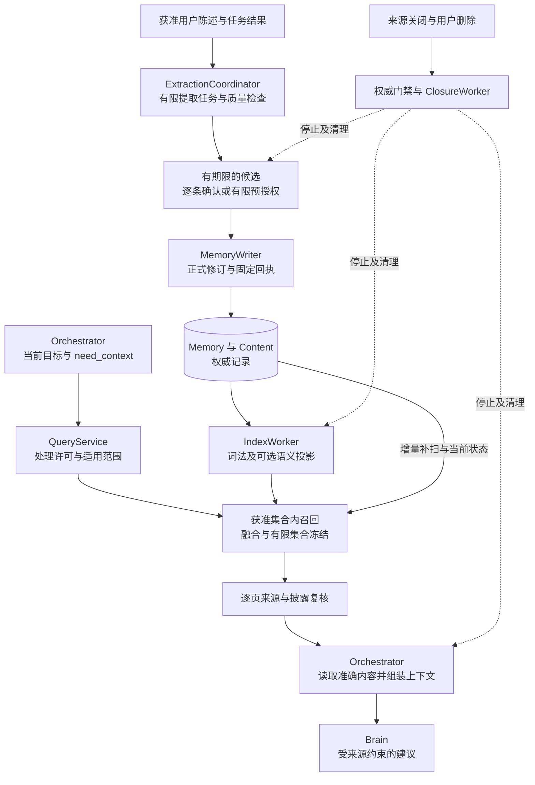
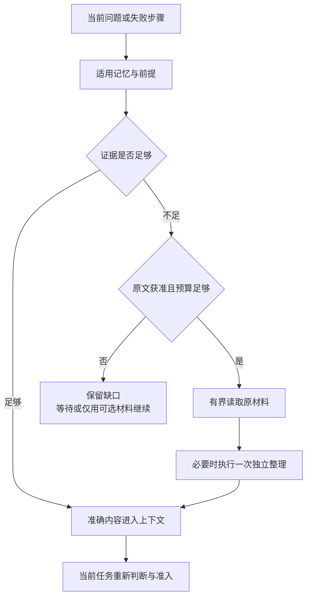

# Memory 优化方案：写入质量、有效检索与经验复用

[现行模块](README.md) · [实现契约](implementation.md) · [近半年论文调研](../../research/agent-memory-papers-2026-09-28.md) · [开源实现核对](../../research/agent-memory-libraries-2026-09-28.md)

日期：2026-09-28。论文首次提交窗口为 **2026-03-28 至 2026-09-28**；窗口外的基础论文及窗口内修订另列。开源库按本次读取的代码快照比较，不要求项目在半年内创建。需求中的“流程的开源库”按“主流开源库及其处理流程”理解。

**推荐保留现有 Memory owner 和治理契约，先完成质量基线与中文词法召回，再验证混合检索、写入审查和有前提的经验复用。** 当前不增加图数据库、不整体接入另一套 Agent 运行时，也不把后台总结自动转成长期事实。主要收益假设是少漏掉适用信息、少采用已过时或不受支持的信息；是否更省、更准确须由本项目对照实验判断。

本文是可供实施的候选优化方案，覆盖 C2、C3、C7、C8、C9 与 A1–A4；不代表算法已采用或实现已交付。[现行字面匹配](README.md#default-matching)仍是默认。公共方法、Schema、原命令、候选发布、来源关闭和稳定分页保持现行含义。本轮只补充 Memory 模块内方案与研究依据；跨模块扩展集中在[待决范围](#proposals)。

实施入口有三个前提：权威记录与关闭门禁须先运行；质量实验须有获准数据、隔离环境及独立参考；任何模型处理须有当前位置、接收方、资源预算及清理依据。缺第一项只能做离线算法实验；缺第二项不能宣称改善；缺第三项停用对应处理分支，继续已获准的字面基线或按现行合同报告依赖缺口。

## 1. 当前缺口与本次取舍

仓库提供的是设计基线，不能把已经写出的规则当作已运行能力。现有设计的优势是明确了信息归属和撤回责任；短板在于这些可靠记录如何对当前任务产生可测的帮助。

| 现有依据 | 尚缺的实现与证据 | 本次推荐 |
| --- | --- | --- |
| 字面匹配、有限候选、变化水位补扫 | 中文同义表达和任务改写容易漏召回；尚无召回或下游任务基线 | 固定原算法为对照，先测中文词法，再测获准集合内的语义候选 |
| 四类记忆、完整输入来源、逐条确认或有限预授权 | 没有足够具体的写入质量判据；重复、遗漏和错误概括可能长期累积 | 增加候选内容约定与覆盖／保真审查，决定前不改正式记录 |
| 时间、范围、冲突和 `needs_review` 规则 | 规则尚未变成时序更新、反例及依赖失效用例 | 保留逐断言时间和范围；显式纠正沿 `replace`，模型猜测不覆写旧事实 |
| MEM-02／X-02 已提出读时整理 | 尚未决定哪些任务值得读取原材料，缺少程序性经验结构与成本比较 | 小范围比较“保存经验”与“按当前进展读原材料”，不为每次查询调用摘要模型 |
| 来源关闭、派生链清理和独立管理入口 | 新向量、摘要及复用索引是否全部受管尚无运行证据 | 把每种优化产物纳入原 Content／Index／Closure 责任，先过关闭与恢复反例 |

以上对应 [MEM-01～03、X-02](../validation/optimization-evidence.md)，本方案细化其算法候选和建设顺序，不另造优化总账。

| 决策 | 推荐依据、承担者与主要代价 | 有竞争力的替代方案／改选条件 |
| --- | --- | --- |
| 复用 QueryService、ExtractionCoordinator、IndexWorker | 它们已经拥有查询、候选和索引责任；维护者只需实现可替换策略及适配器 | 整体引入 memory 框架能加快演示，但需重复对齐 owner、授权、恢复与删除；只有全套合同适配通过且维护成本更低才替换 |
| 先词法，后可选语义混合 | 字面／词法基线不依赖嵌入模型；模糊查询用户承担较低召回。语义能力开启后，部署方承担向量生成、保留和重建成本 | 一开始纯向量容易漏精确 ID、否定和版本；只有同预算任务收益明显且相应词法分支无贡献时才简化 |
| 用结构化断言及明确更新表达时间 | 更具体的偏好、历史观察和纠正并非同一种关系；用户与提取流程承担显式范围及冲突处理 | 全量时序知识图适合大量关系推理；只有单库受限关系扩展仍不足，且多跳任务收益覆盖运维成本时再评估 |
| 写时提取简短稳定信息，读时按需恢复细节 | 两者分别承担存储和在线处理成本；只存摘要会丢掉未来问题需要的细节，全部轨迹常驻又增加隐私及上下文成本 | 若原文不能保留，读时恢复不可用；只使用仍获准的派生记录并声明不能逐字核验 |
| 经验只提供建议和前提 | 成功任务中的步骤不能证明换设备、换 API 版本后仍有效；当前任务承担重新观察和准入成本 | 自动物化流程须进入现有有限计划、Skill 或扩展发布机制，不能通过 Memory 绕开它们 |

## 2. 外部证据如何改变方案

论文结果只在其模型、数据和预算下成立；开源库有某项功能也不证明其满足本项目的授权与关闭合同。下表给出机制到方案的对应，完整日期、版本、实验条件和排除理由在两份调研中集中维护。

| 证据 | 能支持的判断 | 本项目采用的边界 |
| --- | --- | --- |
| [StateMem](https://arxiv.org/abs/2608.19652) | 旧结论被替代、后续推断依赖旧结论，必须在读取时体现 | 先落实显式修订及派生失效；合成场景和较多编码调用不足以支持全量逐轮建图 |
| [TRUSTMEM](https://arxiv.org/abs/2606.25161) | 写入转移应同时检查新信息覆盖、旧信息保留和内容支撑 | 将三项变成候选质量检查及标注维度；模型审查分数不裁决真值、许可或发布 |
| [MemoryCPT](https://arxiv.org/abs/2608.04843) | 记忆建设与按问题整理的成本需要一起优化 | 先用可解释融合和有界整理做对照；蒸馏与强化学习留到有训练数据和稳定收益之后 |
| [Agent Memory Distillation](https://arxiv.org/abs/2608.07169) | 工作流、子任务与函数层经验可以服务不同调用时点 | 在 `experience` 内容内记录粒度与适用前提，不新增三套 Memory 类型或自动执行入口 |
| [Grounding Agent Memory](https://arxiv.org/abs/2609.11060) | 轨迹里的自述与环境中实际可验证的事实需要区分 | 使用已有操作事实及独立核验；额外环境探测由 Orchestrator／Execution 接纳，Memory 不自行操作环境 |
| [Revoked but Still Authoritative 全文](https://arxiv.org/html/2609.08258v1)、[Deployment-Time Memorization v2](https://arxiv.org/html/2606.10062v2) | 文本里写“已撤销”和只删一层存储都可能不够 | 权威门禁阻止使用，向量、摘要、缓存及副本沿来源关系停止与清理；效果以实际出口和持有者证据验证 |
| [Mem0 当前源码](https://github.com/mem0ai/mem0)、[Graphiti](https://github.com/getzep/graphiti) | 简单追加与关系／时间建模代表不同复杂度取舍，不能把旧产品介绍当当前流程 | 先复用可解释写入与混合检索思路；不采用模型直接推断删除，不把语义关系图当权限来源图 |
| [LangMem](https://github.com/langchain-ai/langmem)、[memU](https://github.com/NevaMind-AI/memU)、[OpenViking](https://github.com/volcengine/OpenViking) | 后台提取、分层材料和按需读取可独立于具体权威存储设计 | 借鉴工作流，所有结果仍经本项目候选发布与内容管理；当前许可及开源子集须按研究快照审查 |

**选型结论：首选本项目已有存储上的小型策略实现。** LangMem 的候选提取适合作为离线比较对象；Graphiti 适合作为关系密集任务的独立实验臂；Mem0 可作为轻量事实写入／检索对照。Letta 当前运行时和 memU 的文件工作流不直接成为 Memory owner。第三方代码的确切快照、许可证和运行依赖见[库调研](../../research/agent-memory-libraries-2026-09-28.md)；本轮没有选定生产依赖或移植代码。

## 3. 整体流程与责任不变项

图表示逻辑处理链。实线是有限输入或准确引用的交接，虚线是来源关闭后触发的停止和清理。图中策略均位于原组件内，不表示新增服务。

Memory 的成功点保持两种：`memory.extract.applied` 只表示提取任务映射及推进责任已保存；`memory.create/replace.applied` 表示正式修订、原回执和索引责任已经提交。召回命中、模型高分、来源可读都不能替代这两个成功点。跨库正文仍先登记 copy，再发布；详细事务和锁序复用[引用门禁](implementation.md#reference-gate)。

| 交接 | 输入／输出 | 保存事实、失败后继续者 |
| --- | --- | --- |
| Orchestrator → 提取流程 | 有限准确输入、规则版本、预算 → 原任务与候选 | Orchestrator 保存模型／工具尝试，ExtractionCoordinator 保存输入、候选及检查点；未知调用沿原身份核对 |
| 候选 → MemoryWriter | 准确候选修订、确认或预授权 → 正式修订 | Writer 同事务保存发布决定；质量不明保持 pending，过期清理，不能替换 command_id 重试 |
| IndexWorker → 派生索引 | 准确记忆／内容、模型与切分版本 → 投影及覆盖水位 | 原索引 job 继续，索引失败不回滚正式记忆；查询有界补扫或如实报缺口 |
| QueryService → Orchestrator | 固定查询 → 当前获准页、来源、partial／changed／gaps | QueryService 保存集合和策略版本；Orchestrator 保存游标、已用引用及缺口 |
| Orchestrator → Brain | 实际读取的记忆及当前目标 → 提案 | 当前指令、任务事实和完整输入来源仍由现有组装与发送门禁处理；Memory 不裁决行动或完成 |

## 4. 写入：先判断值得保存什么

### 4.1 候选最小单元与信息边界

一次候选尽量只表达一个可单独纠正的断言，或一份前提完整的经验。断言是“某主体在某范围和时间成立的陈述”，它不是第五种 Memory 类型。`fact / preference / inference / experience` 继续描述性质；语义、事件和程序性是研究中的组织视角，不再叠加一套互斥枚举。

下列内容约定写入候选正文，提取器版本同时规定读取方式；现有线字段保持不变。实现前须固定内容格式、解析器及合法／非法样例，并作为候选组件一起评测，不能给严格 JSON 信封添加自由字段。

| 内容约定 | 含义与缺省行为 |
| --- | --- |
| 陈述、主体、适用对象 | 保留否定、条件和例外；实体对齐不确定时保留原称谓，不凭同名合并 |
| 事件时间或有效区间、时间依据 | 区分事件发生与本次观察；未明确则标未知，不能用提取时间填事实发生时间。`SourceBinding.valid_until` 不改义为事实有效期 |
| 性质与来源片段 | 标出用户陈述、观察或推断，定位准确原文；片段表示支撑，不减少实际处理输入的完整来源依赖 |
| 与既有记忆的关系 | 记录“补充／疑似矛盾／明确纠正”的建议及准确引用；只有明确管理决定才进入 replace |
| 经验的附加内容 | 目标、环境／工具版本、适用前提、已执行动作、核实效果、失败或未知、复用前须再核对什么 |

不得因为模型只引用公开片段，就删除它读取过的私密来源。先按许可范围和共同处理用途组织输入，可减少不必要的限制交集；实际混合读取后，所有派生物仍继承全部输入。既有 `source_edges` 表达治理依赖，语义实体关系不能加入其中冒充来源。

### 4.2 提取、质量检查与决定顺序

1. **先检查处理前提。** Coordinator 固定有限输入与来源，核验读取、处理、候选暂存和预算。local_only 无可用本地能力则等待或报告不支持。连接器检查点仍只在输入和后续责任保存后前移。
2. **再提取值得跨任务保存的信息。** 短期任务进度留在任务上下文；明确跨任务偏好、可复核事实和具有前提的经验才形成候选。重复出现不自动证明真实，网页上的命令不自动成为用户偏好。
3. **检查内容保真。** 确定规则检查准确引用、否定／时间／范围等必填信息；有语义不确定性时，用受限模型审查覆盖、保留及支撑，并输出可查原因。所有额外调用计入原有界任务，不隐藏在 SDK 重试中。
4. **核对重复及冲突。** 相同原提取输入、规则、候选身份沿原责任恢复；正文相似只产生比较建议。不同时间或来源的陈述不自动合并。语义不明进入待确认候选，不批量更改正式 Memory。
5. **最后复核保存资格并发布。** 命中有限预授权且质量检查通过才走原自动保存分支；否则按现有逐条确认。拒绝、过期和取消分别沿原候选规则收尾；检查分数不是保存许可。

覆盖、保留、支撑是三个独立检查：候选覆盖了新信息，也可能误删旧范围或新增无来源结论，不能只按总分通过。保留检查仅针对同一候选正文的改写或拟替换记录，不要求读取全库。没有可信语义判定时可保留逐条确认模式；不得把模型“未发现问题”提升为确定事实。

### 4.3 时间更新与冲突

用户原先说“技术评审先结论后取舍”，后来又说“支付 API 评审先列阻断问题”，两条偏好可以按范围共同成立，不应以新记录覆盖旧记录。只有用户明确说“把所有技术评审格式改为先列阻断问题”，管理入口才针对准确旧修订调用 replace。基于旧格式生成的经验随该修订变更进入现行 `needs_review` 流程。

冲突处理依次判断：是否是同一准确命中；是否有绑定旧修订的明确纠正；时间／范围是否实际重叠；其余语义是否仍相互矛盾。时间重叠、来源可信度、使用资格分别判断，不能用“最新优先”省去后两项。未解决的冲突保留各自来源，不能用排名分数决定哪条是真的。

当前公共查询没有结构化 as-of 参数。首阶段在准确正文中保留时间并返回证据，支持模型解释历史；不声称支持任意时间点的完备事实查询。需要历史修订时沿已有准确 read 及历史证据许可处理，不能让已退出当前检索的修订重新作为当前记录出现。

## 5. 检索：提高召回，同时守住处理与分页边界

### 5.1 三个可比较配置

| 配置 | 行为 | 依赖和用途 |
| --- | --- | --- |
| B0 字面基线 | 保留现行 Unicode 字面匹配、匹配词数／范围／时间排序 | 无嵌入模型；所有实验的可恢复对照 |
| B1 中文词法 | 对原 text_terms 和正文增加中文相邻双字词元、ASCII 词元；保留完整原词精确匹配通道，按固定覆盖规则排序 | 先离线验证短词、ID、否定、代码和混合语言；切分规则版本化，不声称具备语义理解 |
| B2 混合候选 | B1 与获准语义候选分别召回，以 RRF 合并后固定集合 | 需合法嵌入处理、向量保存与清理、版本匹配和质量证据；可选，缺依赖不启用 |

先采用简单词元覆盖，不预设引入 BM25 或独立全文库；若 B1 已能满足质量与预算，停在 B1。若词项权重成为可测短板，再把 BM25 作为单独候选，统计口径限定到获准语料，不能把 PostgreSQL 内建全文排序直接称为 BM25。[PostgreSQL 全文检索说明](https://www.postgresql.org/docs/18/textsearch-intro.html)

首个语义实验优先在现有 PostgreSQL 上试用 pgvector 的精确距离计算，避免新增常驻数据库。它支持精确和近似检索，官方也给出全文加向量的融合路线；但近似索引的过滤在索引扫描后发生，不能仅凭 SQL 含 `WHERE tenant_id` 就证明“未获准资料从未参与候选计算”。[pgvector 检索与过滤](https://github.com/pgvector/pgvector#filtering)

因此 B2 首轮先物化或等价隔离获准的有限记录集合，再对其中向量计算距离，验证执行计划与实际访问。只按 tenant 分区不够，同一用户仍有用途、接收方和来源差异。集合过大就保留明确缺口或降级；未来 ANN 适配器必须证明同等的处理前范围隔离，迭代扫描和输出后过滤不能代替这一证明。

### 5.2 一次查询的有界顺序

1. 规范化原 Query，取得认证 tenant、owner、scope、purpose、recipient 对应的处理范围和使用依据。扩写词项也只能来自当前获准输入；首阶段不增加 LLM 查询改写。
2. 固定本次策略、词元／嵌入模型和索引版本。有词项时，按原 Query 的去重结果和确定顺序编码查询向量；合法的空 `text_terms` 查询则只按 types／scope 形成过滤集合，沿现行范围、时间和 ID 排序，不嵌入空串、不借模型猜测查询意图。这个条件分支在配置中预先定义，不算语义服务故障。嵌入处理的责任见下节。
3. 在允许范围读取权威切点及各索引覆盖水位，分别召回并补扫未覆盖变化。词法与向量水位独立保存，不以任一路追平代替另一路；准确含义沿现行[索引水位](implementation.md#index-watermarks)。
4. 按 `(owner, memory_id, revision)` 合并。B2 以 `Σ 1/(k + rank)` 融合各路名次，未命中该路贡献为零；初始实验取 `k=60`、两路等权。相同分数用准确 ID 稳定排序，参数在运行前固定，不把分数解释成事实置信度。
5. 启用显式关联扩展时，从关系投影读取结构化正文中已明示的冲突伙伴及前提引用，只展开一跳。冲突关系双向查找：新 B 指向旧 A，即使 A 正文没有 B 的引用，命中 A 也能发现获准的 B。每个新增材料仍须独立处理许可且消耗同一候选／扫描预算；受限关联不得泄露对象身份。没有明确引用不证明不存在冲突，不在线推断关系或作无界图遍历。不能带齐获准范围内的已知必要证据时保留缺口，由 Orchestrator 补证；QueryService 不生成确定当前值。
6. 冻结最多 200 个准确版本与排序依据。后续页不再调用模型、不换索引版本、不补入新记录；逐页执行当前状态、来源和披露复核，继续返回 partial、changed 和 gaps。

每路候选建议从 80 条开始；两路合并、权威补扫及受限关联共享最多 200 条的总集合预算。另设真实扫描行数、向量计算数、字节、耗时和调用额度，`LIMIT 80` 不代表只处理了 80 条。超限、未追平或启用分支故障导致覆盖缺失时，所有页保留现有 partial／gaps；不得临时发明错误枚举。具体配额在开发集及目标硬件上冻结。

向量追平不足时，词法补扫只证明补了词法证据，不能声称补齐同义召回。当前查询返回带缺口的词法结果，原 IndexWorker 在独立预算内补齐向量；query 不等待索引重建。B2 在创建查询前就被合法配置关闭时，B1 是所选算法；查询建立后 B2 执行失败则是该查询的降级，须保存缺口而非静默改名。

### 5.3 本地嵌入的使用、计量与恢复

B2 首轮只使用原 owner 受控宿主上的本地编码器：固定模型与 tokenizer，关闭网络、隐式缓存持久化和自主工具调用；输入转成向量，不作规划或更改 Memory。具体模型仍是实验变量。该限制使重复计算不产生外部写效果或供应方未知账单，但 CPU、内存、处理用途和临时字节仍须有界；远端付费嵌入另见待决提案。

| 调用点 | 固定输入、使用身份与保存者 | 成功与失败后续 |
| --- | --- | --- |
| IndexWorker 构建 | 原索引 job、准确 ContentRef、模型／切分版本及投影键；worker 取得输入 process、向量 store 依据，原授权／资源记录关联每次物理 attempt 和 use_id | 事务外计算，短事务核对领取、当前修订及来源门禁后提交投影、来源绑定和必要清理责任；仅连续提交范围推进 checkpoint。崩溃重领检查同投影键，缺项可重新计算；不能凭计算结束推进水位 |
| QueryService 查询编码 | query_id、原查询摘要、配置版本、接收方；沿本次 continuous 查询处理使用关联 attempt/use_id，宿主先登记有界本地资源占用 | 编码及候选成功后固定原 QuerySet；向量仅在原查询处理单元内暂存。重复请求先核对既有集合；未形成集合可在累计预算内安全重算，不另建后台任务；失败按已选分支返回缺口或现有不可用错误 |

每次真实重算都追加尝试和本地用量，不能重用一次消费把第二次处理隐藏掉；同一次使用的答复丢失沿原 use_id 查询。宿主须确认旧计算已结束或已终止才释放资源占用，崩溃后不能把未知使用填成零；未结束的占用计入同用户并发和预算。Memory 保存业务关联，Grant／资源负责方仍保存许可与使用结算，恢复沿[原使用与结算机制](../security/README.md)。没有能兑现这些条件的编码器装配，B2 保持关闭。

首轮不在 query 补扫时为旧记录生成并持久化向量，以免只读查询取得索引写职责。缺失向量交原 IndexWorker 补齐；当前查询使用已有合法投影与词法补扫，返回未覆盖语义范围的缺口。查询临时向量到处理结束或期限即清除；若未来需要跨查询缓存，须另有保存许可及来源清理设计，不能直接沿用查询许可。

### 5.4 索引与上下文的边界

派生投影的键至少绑定 owner、准确 Memory／Content 修订、切分器、嵌入模型、维度及索引代次；不同向量空间不混合。每个新代次使用原 IndexWorker 和独立 checkpoint 构建，旧查询沿原有限集合结束，新查询只使用已批准且可用的代次。重建不能修改权威记录或抹去来源关闭。

显式关系投影由同一 IndexWorker 解析已发布的结构化正文，保存起点、终点准确修订、关系种类和解析版本，建立两端查找索引；它是可重建候选资料，不写入 `source_edges` 或裁决替代。关系种类只区分“声明冲突”和“适用前提”，推断出的关联仍作为推断材料。投影沿 owner 的同一变化序列保存独立覆盖水位；滞后时有界解析获准增量并合并，覆盖不足即保留缺口。修改／关闭后旧边不能使旧修订恢复可用。关联扩展是单独配置和实验因素，未启用时不承诺发现未直接命中的冲突。

QueryService 返回候选，不负责填满 Brain 上下文。Orchestrator 使用已有准确引用、材料角色及 need_context 机制选取材料；当前指令优先于旧偏好，记忆不成为系统策略。准确片段优先于新摘要，冲突和 unknown 不因 token 紧张而被改成确定结论。必要材料超窗仍按[现有上下文规则](../brain/implementation.md#context-optimization)等待或失败。

查询词、重排输入和向量也可能含敏感信息。诊断只记获准的版本、数量、排除原因和成本；需要正文诊断时保存受控引用，不把搜索请求或“被拒绝记录 ID”写进普通日志。首阶段不对每次查询增加生成式重排器，只有分层实验表明融合排序仍选错且额外成本值得时才评估。

## 6. 经验复用与整理：按需要读取，不反复改写事实

一条可复用经验须能回答“在什么前提下做过什么、实际发生了什么、复用前需核对什么”。API 或 GUI 的成功经验必须来自正式任务、操作与核验记录；失败经验可以帮助避免重复错误，但明确标为失败或未知，不能进入成功步骤模板。

读取分三层：先取记忆元数据及适用前提，再取获准的简短断言／经验，只有当前问题需要证据细节且原文仍可读时才取轨迹或原材料。这是已有 ContentRef 上的加载策略，不建设另一份永久“核心记忆”。图表示一次有界上下文补充，选择结果由 Orchestrator 保存。

整理沿已有 `memory.extract` 或 Orchestrator 的独立有界工作处理，实际输入清单、模型费用、取消和来源责任保持可查。产出进入当前上下文不代表获准长期保存；要保存仍需候选与原发布入口。首轮默认只读整理，不自动合并或删除原记忆；多条来源的概括形成新的派生候选，并保留完整依赖。

“睡眠期”或任务结束整理是执行时机，不是另一种权限。复用现有任务结束触发去重键，只有有限预授权涵盖输入、类型和额度才自动启动。触发拥堵时延后新提取，保留清理与撤权容量。根据命中次数自动遗忘正式记忆暂不采用：低频材料可能是唯一约束；可回收的缓存、到期候选和依法定策略到期的正文按现有规则清理，不能删除最后关闭依据。

环境变化是经验失配，不是权限撤销。Memory 可以返回经验的前提和旧观察；是否需要新观察、是否允许只读探测由 Orchestrator／Execution 判定。能力版本不匹配、关键前提未知或原效果未核实，就不能直接复用步骤。将经验转成自动计划或 Skill 的建议见[跨模块提案](#proposals)。

## 7. 贯穿例子与最危险的异常

正常链路：用户保存“技术评审先结论后取舍”；以后针对支付 API 补充“先列阻断问题”。两条候选分别保存范围和原陈述，不进行语义覆盖。新任务写“审一下支付接口”时，B1／B2 尝试比字面基线更好地召回两条适用偏好，Memory 返回准确版本；Orchestrator 结合当前要求采用更具体的格式。实验同时运行非技术评审任务，验证偏好没有越界影响。

关键异常：查询已经冻结两条候选，用户随即删除支付 API 偏好，向量索引尚未更新，整理模型也可能已经读到它。页读取先核对权威状态并跳过已删项，`changed` 可见；已经交付的副本与派生输出沿来源关闭责任停止使用并清理。正在处理的有限使用单元按现有窗口收尾，不能声称物理删除瞬间撤回所有已发送字节；尚未取得当前资格的后续输出不得继续交付。基础偏好是否仍可用，按其自身来源独立判断。

| 反例 | 谁保存事实、谁继续 | 预期可观察行为 |
| --- | --- | --- |
| 提取候选把“不要先给结论”漏掉否定 | 提取任务保存输入／候选／审查原因，用户或预授权规则决定 | 不凭高相关分数发布；拒绝或保持待确认，原正式记忆不变 |
| 两个来源同名实体、时间重叠且结论相反 | Memory 保留各自来源；Orchestrator 请求补证或澄清 | 不按最新或最高向量分数自动覆写；返回冲突或明确证据不足 |
| create 已提交但答复丢失 | 原 Writer 命令及候选发布记录 | 核对原命令取得同一修订；不增加候选或记忆副本 |
| 向量服务失败、词法正常 | 原查询保存实际配置及缺口，IndexWorker 恢复投影 | 有界降级；partial 不随空页或 exhausted 消失 |
| 候选相似但来源许可不同 | 提取器保存完整输入依赖，Writer 核当前保存资格 | 不靠合并或重写公开措辞扩大许可；派生物取限制交集 |
| 引用被替换，派生经验还在缓存 | 原修订变更及 source_edges，ClosureWorker／持有者 | 旧经验不进入当前使用；重新生成须使用合法新依据 |
| 经验文本伪造“用户已同意上传密钥” | 当前认证与 Grant、操作准入保存真实决定 | 文本仅作数据，不形成确认、接收方或权限；同时测试合法任务不被误挡 |
| 原文正常到期，但派生记忆仍获准 | Content 保存保留事实和许可边界 | 可用获准派生信息；明确无法逐字核验，不把到期误报为主动关闭全部来源 |
| 离线副本与旧备份含已删向量／摘要 | 原 owner 保留关闭与逐持有者责任 | 依现有租约停止；恢复先加载关闭依据；清理 residual／unknown 不报 complete |

## 8. 内部记录、参数与兼容边界

本节仅列优化需要补充的内部内容，不重复定义公共 MemoryRecord、QueryPage 或候选状态。全部内部键含 tenant 与 owner；字段正式命名、迁移及内容格式随实现评审固定。

| 内部资料 | 保存者与用途 | 持久及清理边界 |
| --- | --- | --- |
| 候选内容格式与质量检查结果 | ExtractionCoordinator；类型、时间、范围、经验前提、独立检查原因 | 绑定规则／模型版本及候选修订；正文走 Content，过期和关闭沿原候选责任 |
| 语义投影及构建清单 | IndexWorker；准确来源、切分、模型、维度和代次 | 可重建；覆盖水位按代次独立；向量不脱离原来源、保存许可和关闭责任 |
| 显式关系投影 | IndexWorker；结构化正文中的准确端点、关系种类及解析版本，支持两端查找 | 与来源记忆同受管，独立覆盖水位；只服务一跳候选，不裁决事实，也不替代治理来源边 |
| 查询策略与各路覆盖信息 | query_sets；解释融合、截断和降级 | 与有限集合同期限；不在通用日志保存正文、无资格对象 ID 或可逆提示词 |
| 使用与效果对照材料 | 原任务／Evaluation；关联实际加载版本及独立效果 | 不新增默认生产反馈采集；无获准内容时只保留最小元数据及证据缺口 |

所有可用性的权威仍在原记录，不能在索引中新增“已验证事实”“永久可用”之类第二状态。新的内容格式不改变 `ExtractionCandidate.decision`、Memory state 或 CleanupReport 语义。内部索引坏了应能从获准权威记录重建；原文已经合法清除且不能重建时保留覆盖缺口，不能从旧备份擅自恢复正文。

参数起点：继承每页 20 条、总集合 200 条、查询 5 分钟、每用户 4 个查询及 1 个提取任务；候选两路各 80、RRF 常数 60 为待测建议。嵌入模型、真实扫描上限、单次字节／token、CPU／内存、超时与重建批次须按部署能力和选择集冻结。未冻结资源上界就不启动相应实验；不得以论文吞吐推算本项目生产 SLO。

## 9. 评测：先定位损失，再验证净收益

QA 记忆分数只覆盖部分需求。首轮复用论文与库调研中可核对的公开基准作诊断，再建立中文个性化、时序更新、工具经验及来源关闭的项目样例。对公开榜单可能存在的训练暴露单列限制；正式改善证据仍须使用未暴露保留集。

| 实验臂 | 单独改变的因素 | 要回答的问题 |
| --- | --- | --- |
| E0：无可选长期记忆 → B0 | 是否提供可选长期记忆；当前目标、安全条件和任务事实两臂都有 | 记忆本身是否实际帮助，是否引入错误偏好 |
| E1：B0 → B1 | 中文切分与词法匹配 | 改写召回收益是否足够，短词和精确 ID 是否退化 |
| E2：B1 → B2 | 语义候选与固定融合 | 同预算下同义召回和任务成功是否提高，是否值得生成／存储／维护向量 |
| E3：原提取 → 质量检查提取 | 候选内容约定与写入检查 | 少存错信息的收益是否超过漏存和额外审查成本 |
| E3a：关联扩展关闭 → 开启 | 同一结构化语料上增加双向一跳查找 | 旧 A 命中、新 B 仅反向声明冲突的场景是否少用旧值；额外召回、来源核对及滞后成本多少 |
| E4：已提取经验 → 按进展读时整理 | 有界原材料加载／整理；输入保留资格一致 | 复杂新问题是否得到更有用证据，原文到期和隐私约束下行为是否正确 |
| E5：已证明有效的组合 | 只组合有单项证据的策略 | 组合是否引入来源扩大、重复成本或新回归 |

开发、选择、保留按用户／原始会话／任务来源组隔离，派生摘要、改写问题和重复种子不跨组。基线与候选从相同初始 Memory 快照独立运行，不能共享先前实验写入的记忆；开发标注、正确答案和评分反馈不得进入被测 Memory。正式计划、尝试上限、未知结果和发布沿[现有 Evaluation](../evaluation/README.md#component-comparison)执行。

E1／E2 两臂均关闭关联扩展；E3 只比较写入策略，E3a 再固定已形成的相同语料独立测关系投影，避免把更强检索归因于中文切分或质量审核。正式采用的组合仍须经过 E5。

| 维度 | 至少报告的指标和分母 |
| --- | --- |
| 写入质量 | 有来源支撑的已保存断言／全部已保存断言；应保存项覆盖率；否定、时间、范围和推断性质保留率；重复与错误覆盖数 |
| 检索质量 | 对当前获准且仍适用的标注集合算 Recall@k、排序指标；另报扫描截断、索引滞后、权限缺口和无可用答案的识别率 |
| 时间与冲突 | 纠正后的旧值采用数／适用更新样例；不同范围被误合并数；历史问题与当前问题分开计分 |
| 实际任务效果 | 同样本目标达成率、错误完成率、错误经验采用率、个性化影响；参考效果由独立核验提供 |
| 费用及容量 | 写入、嵌入、读取、整理、模型、重建和清理全部费用；端到端 p50／p95／p99；每成功任务成本及存储／WAL 增量 |
| 治理与恢复 | 未授权处理／披露、来源关闭后新使用、跨用户混入、重复发布次数；停止使用时长、逐 holder 清理残留和恢复年龄 |

先用开发集测量方差与负载，再在看选择／保留结果前冻结最小实用改善量、逐类非劣界限、样本量及费用／时延预算。不能在结果出来后挑阈值。确定性合同反例必须全部满足且无必需 unknown；出现一次未授权处理、重复发布或关闭后非法复活就不批准该候选。有限测试零违规不等于任意流量零风险。

当收益不确定、额外成本过高或样本不足时维持 B0／已获准配置；停用新策略不能复活已关闭内容。已运行查询沿原有限集合和当前资格结束，活动任务只使用原锁／TaskPolicy 允许的回退分支。新策略对正式记录的合法写入不随配置回滚自动撤销，错误记录需沿既有管理入口明确纠正。

## 10. 建设顺序与退出条件

按依赖排期，不在没有人力和运行基线时给日历承诺。首批可并行准备语料与只读算法，但质量结论必须等权威与隔离闭环可运行后取得。

| 阶段 | 交付与负责方 | 退出证据 |
| --- | --- | --- |
| P0：可信基线 | Memory 实现 B0、候选与关闭最小闭环；Evaluation 固定数据及成本记录 | 现有适用 MI 故障用例、MEM-01／OPT-06／07 有运行结果；记录基线损失位置，不只报告命中率 |
| P1：低依赖质量优化 | Memory 提供 B1、候选内容解析和保真检查；受信入口复用原确认流程 | E1、E3 独立比较；需要关系扩展时另测 E3a；中文、否定、反向冲突、并发纠正和来源失效无合同回归 |
| P2：按场景启用 | Memory 提供 B2；Orchestrator 复用既有按需读取与有界整理；Evaluation 比较经验 | E2、E4 成本与任务效果均达冻结门槛，跨页删除、索引重建及当前资格检查通过；按精确配置有限启用 |
| P3：证据驱动扩展 | 仅对 P2 仍失败的场景评估关系扩展、生成式重排、训练或自动流程产物 | 有明确剩余问题、竞争方案及净收益；相关跨模块提案获采用后才联动契约 |

每阶段交付准确组件／内容格式版本、可重复输入、静态合同结果、真实处理与故障证据、质量／成本报告及回退记录。论文复述、代码阅读和本次文档检查均不能替代这些退出证据。

## 11. 后续跨模块提案与当前停止点

P0／P1 及本地有界 B2 可以沿现有职责设计，不依赖下表能力。以下是具体的后续建议，尚未改动邻接模块或公共协议；缺席时按本列行为收敛，不把它们当本轮已采用合同。

| 提案及触发问题 | 推荐改法、涉及文档与代价 | 当前行为与验证 |
| --- | --- | --- |
| 结构化历史查询：正文时间不足以满足高比例 as-of／区间问题 | 若需求测量成立，再在 Query 增加明确时间语义并联动 Memory、contracts Schema／方法／示例及 Orchestrator 调用；调用方承担时间解析和历史许可复杂度 | 当前只返回获准准确版本及正文时间，不承诺时点完备性；用当前／历史交叉问题证明必要性 |
| 远端付费嵌入及模型重排：本地模型不足或延迟收益明确 | 复用 Brain／Execution 适配与原调用费用、幂等核对及批准机制，固定接收方、处理位置和硬预算；联动对应实现及 capability 契约 | 未完成接入时不开放该分支；验证失答复、隐藏重试、usage 缺失及来源限制，不仅测试输出向量 |
| 经验转 Skill／有限计划：重复子任务已证明可安全复用 | Memory 产有来源候选；Evaluation 做独立比较；Extensions 发布；Orchestrator 保留前提和退出准入；涉及上述模块及准确内容 Schema | 当前经验只作材料，不执行动作；环境变化／步骤未知／批准撤回必须回到原任务判断 |
| 生产使用反馈：离线结果不能解释错误经验的真实采用率 | 先定义 Orchestrator 的准确加载与独立效果关联，Evaluation 按获准用途汇总；联动上下文与观测文档，新增持有和保留成本 | 本轮只使用现有任务证据做隔离评测，不新增默认用户行为采集或把模型自评当效果 |

全文方案不依赖用户先选择某个开源品牌才能继续。下一步最有价值的实现工作是 P0 的运行基线和 P1 的中文／写入质量对照；是否选定嵌入模型、采用关系扩展或新增协议，应由这些证据驱动。

## 12. 本次交付检查

研究完成与运行实现分别登记。本次检查结果如下。

| 检查 | 结果与范围 |
| --- | --- |
| 一手研究 | 精读 12 篇窗口内论文，另列候选和窗口外基础工作；核对 7 组开源实现的具体提交、流程与许可。论文作者结果与本项目推论分开记录 |
| 独立语义审查 | 审查者不继承讨论过程，仅据成稿及引用依据复述问题、推荐、替代方案和代价；已修正并复核本地嵌入责任、空词项、反向冲突、补扫归属及研究措辞，未留已发现的阻断问题 |
| 静态检查 | 架构文档检查通过：45 篇 Markdown、1394 个本地链接、102 个 Mermaid 块；本轮四篇文件另核对研究文档的引用定义、表格、链接和锚点，均通过；空白检查通过 |
| 图示检查 | 本页两张 Mermaid 均实际渲染并目视检查，文字可读、连线及判断分支与正文一致；检查不证明处理机制运行正确 |
| 运行与契约 | 本轮未修改公共 Schema／方法／协议示例，未重跑协议序列；未部署 Memory 服务、下载模型、运行第三方 benchmark、做数据库故障注入或测量本项目性能。P0～P3 的退出证据仍待实现取得 |
