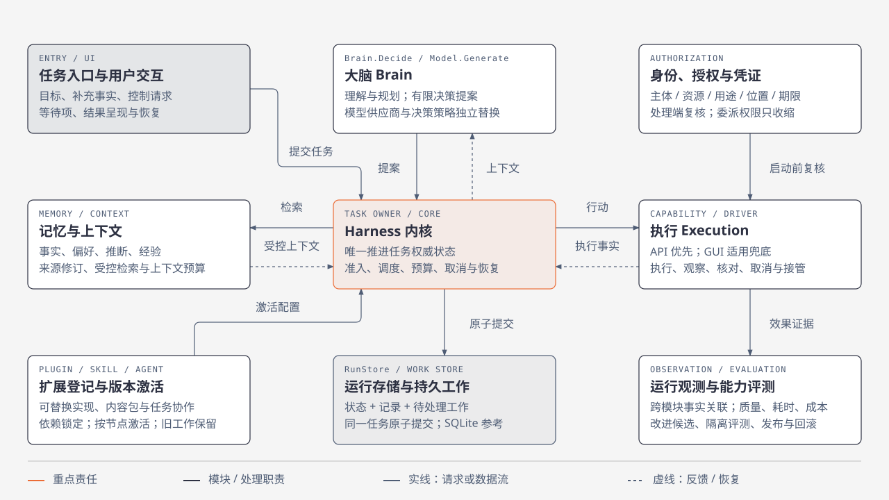
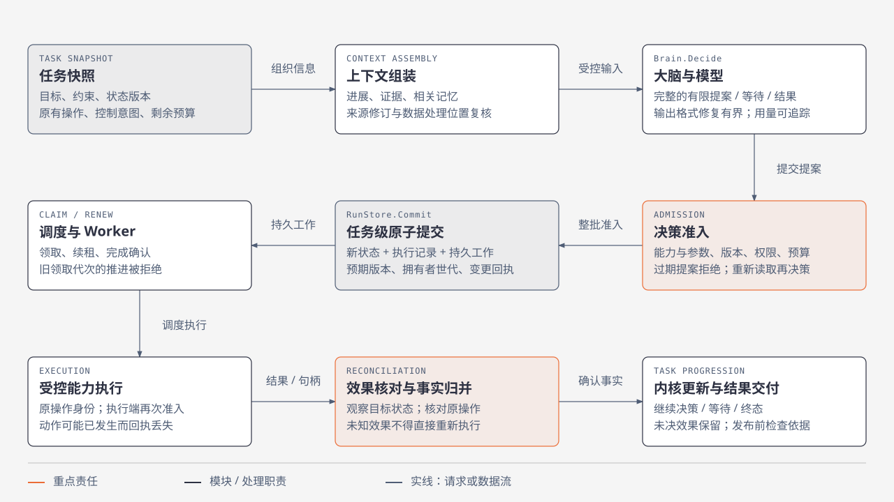
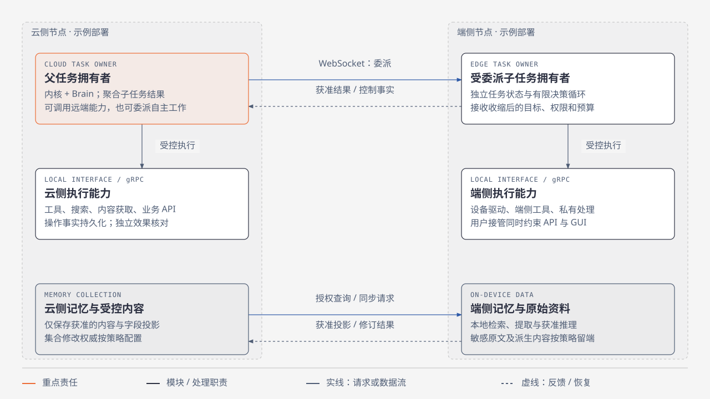
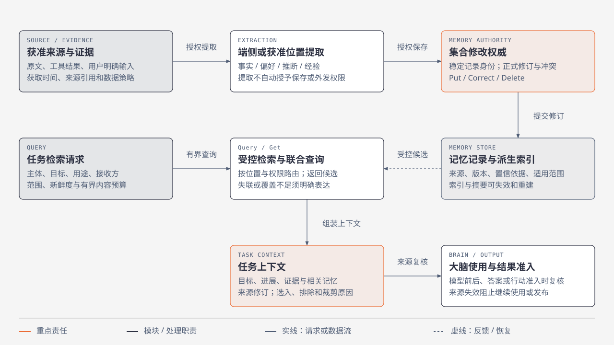
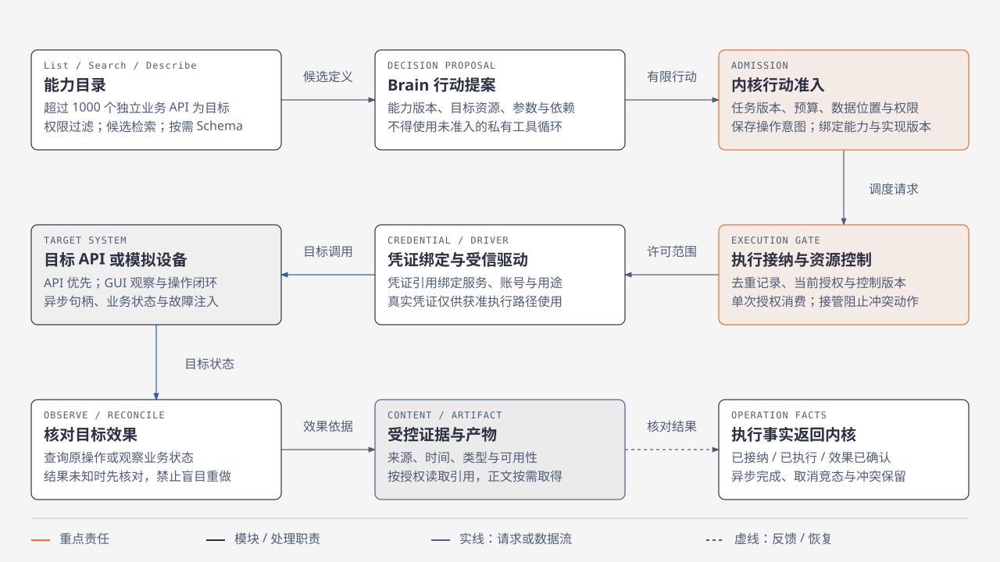
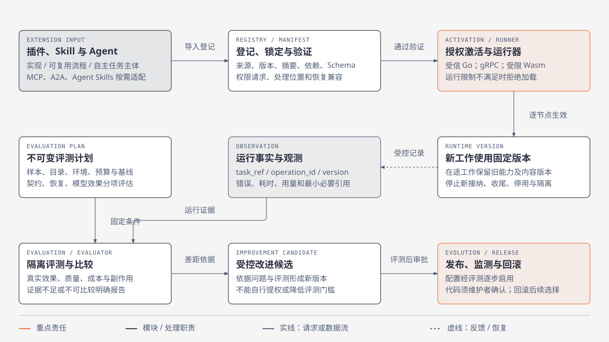

# Lerna Harness

面向通用 Agent 的端云 Harness。架构、能力目标及后续实施任务见 [架构入口](docs/architecture/README.md) 和 [实施票据](.scratch/harness-implementation/README.md)。

## 架构设计

内核管理持久任务，大脑提交有限提案，记忆提供受控上下文，执行返回可核对事实。以下六张图整理已确认的设计职责与目标，不表示所有模块均已实现或验收通过；实际实现进展见下方指南与实施报告。

可独立打开 [详细架构图集](docs/architecture/diagrams/lerna-harness-architecture.html) 查看宽幅排版。节点表示逻辑职责，不代表独立进程或 Go 包；橙色强调主要责任，蓝色连线表示跨节点或外部交互，虚线表示反馈或恢复相关返回。

### 01 / 系统总览：内核连接三大逻辑系统

逻辑职责不绑定进程或端云位置。图中展示主要关系；授权、观测与版本约束适用于全部相关模块。



**状态权威**：Brain 提出行动，Execution 报告事实，内核检查完成条件并决定任务状态。UI、调度器和外部 Agent 均不能直接写入任意终态。

**独立替换**：核心使用 Go Interface；供应商类型、数据库连接和设备细节留在 Adapter。启动组装选择实现，核心不反向依赖启动入口。

设计依据：[01-system-architecture.md](docs/architecture/01-system-architecture.md)、[02-runtime-and-state.md](docs/architecture/02-runtime-and-state.md)、[08-authorization-and-user-control.md](docs/architecture/08-authorization-and-user-control.md)。

### 02 / 任务运行：从提案到可核对结果

按主要处理顺序阅读。新一轮决策从最新任务快照开始；恢复直接读取持久事实，不依赖模型会话记忆。



**原子边界**：RunStore.Load / Commit / LookupCommit / ListRecoverable 隐藏存储实现。任务变更、记录与工作一起提交；记忆写入、外部动作不纳入该事务。

**不确定结果**：提交超时先 LookupCommit；动作超时先查询或观察效果。同一操作重发保持身份，相同标识配不同内容明确拒绝。

**有界自主**：决策、生成、行动、并发、委派深度与期限有预算。暂停、取消与新输入由内核落实；预算耗尽仍允许必要收尾和核对。

设计依据：[02-runtime-and-state.md](docs/architecture/02-runtime-and-state.md)、[06-brain-and-agent-collaboration.md](docs/architecture/06-brain-and-agent-collaboration.md)、[06-decision-admission-and-collaboration.md](docs/architecture/06-decision-admission-and-collaboration.md)、[04-recovery-state-and-failure-matrix.md](docs/architecture/04-recovery-state-and-failure-matrix.md)。

### 03 / 端云协作：部署位置与任务权威分离

这是允许的部署示例，不把大脑固定在云侧，也不把执行固定在端侧。记忆节点的读写与生命周期详见下一图。



**连接与契约**：进程内直接调用 Go Interface；同一部署侧跨进程用 gRPC；端云用 WebSocket。固定消息采用 Protobuf，动态输入输出采用 JSON Schema；原生节点连接使用 mTLS。

**离线边界**：本地能力齐备且授权可本地核验时继续；依赖失联节点的步骤等待。未送达的取消、撤销或接管保持待送达状态，不能提前宣称落实。

**所有权移交**：默认先停止新调度、准备目标，再封存源世代并发出激活凭据。只有目标持久化新世代才恢复；源端不能因回包超时自行重新激活。

设计依据：[03-contracts-and-protocols.md](docs/architecture/03-contracts-and-protocols.md)、[04-edge-cloud-and-recovery.md](docs/architecture/04-edge-cloud-and-recovery.md)、[08-authorization-lifecycle-and-interfaces.md](docs/architecture/08-authorization-lifecycle-and-interfaces.md)。

### 04 / 记忆与上下文：来源约束贯穿整个生命周期

任务上下文的恢复性保存不授予跨任务复用权。云端可路由查询，但不能默认获知端侧记录标题、命中数量或原文。



**五个独立维度**：分别控制存储位置、计算位置、可发现范围、返回范围和留存再使用。原文留端时，向云模型发送摘要、向量或片段仍须获准。

**修订与删除**：每个集合有唯一正式修改权威。非权威副本离线修改保存为待提交意图；重连核对原操作和基础版本，冲突不按设备时间静默覆盖。

**来源失效传播**：纠正、删除与用途收紧影响副本、检索索引、摘要及已组装上下文。派生内容不能获得超出来源的用途或披露范围。

设计依据：[05-memory-and-context.md](docs/architecture/05-memory-and-context.md)、[05-memory-data-and-lifecycle.md](docs/architecture/05-memory-data-and-lifecycle.md)、[05-edge-cloud-memory.md](docs/architecture/05-edge-cloud-memory.md)。

### 05 / 执行架构：发现、准入与效果确认分开

主路径展示一次行动的各层职责。异步查询、取消和用户接管沿原操作关联处理；目录可见性不等于执行许可。



**API 与 GUI 的边界**：只有目标语义、权限、处理位置和核对条件都满足时才允许 GUI 兜底。API 权限拒绝不能绕过；API 可能已经生效时也不能用 GUI 重复变更。

**专项验证**：联网问答核验实际来源、获取时间、引用支持和证据缺口；GUI 核验观察、点击、滑动、输入、返回、再次观察、中断和接管。模拟结果只证明声明的模拟范围。

**质量目标**：首次调用正确率 ≥90%，有限重试任务成功率 ≥95%。检索遗漏与内部纠错如实计分；Schema 合法、HTTP 成功或修复后完成均不能改写首次正确性。

设计依据：[07-tools-and-simulated-devices.md](docs/architecture/07-tools-and-simulated-devices.md)、[07-execution-contracts-and-validation.md](docs/architecture/07-execution-contracts-and-validation.md)、[11-specialized-validation-and-handoff.md](docs/architecture/11-specialized-validation-and-handoff.md)。

### 06 / 扩展与自进化：版本化接入，依据评测生效

发布形成新的激活版本，下一轮回到登记与激活流程。观测数据不能反向覆盖业务权威事实，回滚也不会撤销已发生的外部效果。



**接入语义**：MCP 映射工具与资源，A2A 映射任务协作，Skill 加载操作知识。适配方向、可选能力和版本分别验收，协议能解析不等于行为已兼容。

**隔离与权限**：同进程 Go 只接纳受信代码，独立进程本身不构成强隔离。受限运行器必须兑现文件、网络与资源限制；Skill 文本不能直接授予执行权限。

**发布证据**：能力按 L1 契约、L2 参考实现、L3 替换互操作、L4 恢复治理验收。质量目标与模拟测试不能代替实际模型和专项能力的完整验收。

设计依据：[09-extension-ecosystem.md](docs/architecture/09-extension-ecosystem.md)、[09-extension-contracts-and-activation.md](docs/architecture/09-extension-contracts-and-activation.md)、[10-observation-evaluation-and-evolution.md](docs/architecture/10-observation-evaluation-and-evolution.md)、[10-evaluation-contracts-and-release-gates.md](docs/architecture/10-evaluation-contracts-and-release-gates.md)。

完整消息字段、错误码、故障矩阵与评测样本保留在以上设计规范中。SVG 的字体随查看环境回退，HTML 图集保留完整的页面排版。

## 运行与实现进展

当前可运行内容包括 **01 票的 Go SDK 契约样例**、**02 票的本地身份、策略与授权**、**03 票的持久任务接纳与查询**、**04 票的有限 Worker 运行与恢复**、**05 票的任务控制**、**06 票的受限签名授权**、**07 票的受控证据与产物**、**08 票的有界模型问答**、**09 票的补充输入与重新决策**、**10 票的同步 API 执行与效果确认**、**11 票的异步调用与未知效果恢复**、**12 票的共享资源控制**和 **13 票的千级能力目录**，尚不是完整任务运行系统。

```sh
make sample                    # 可导入 SDK → Protobuf → 内存契约夹具
go run ./cmd/contractcheck      # JSON 契约报告；失败返回非零退出码
make verify                    # 生成一致性、编译、静态检查、race 测试和样例
```

参考工具链为 Go 1.26.1、protoc 36.1；Go 模块最低要求 1.26.0，Makefile 固定实际验证补丁版本。已提交生成代码，单独构建和运行不需要 protoc。首次获取 Go 模块需要网络，之后样例本身不联网，不需要模型、数据库或设备服务。

[SDK 使用、验证方法与边界](docs/implementation/01-sdk-contract.md) 说明协议子集、报告含义及依赖固定方式。本地模块路径暂用 `lerna`，尚未绑定公开托管地址。

[本地身份与授权指南](docs/implementation/02-local-authorization.md) 提供 `authctl` 初始化及管理入口。参考实现使用进程内接口与真实 SQLite 文件，无需独立数据库服务；执行 `go run ./cmd/contractcheck -profile local-auth-v1` 可验证授权和进程恢复。`make verify` 同时验证已实现票据的实现。

[持久任务指南](docs/implementation/03-durable-tasks.md) 说明 SDK 组装、授权条件和 RunStore 恢复契约。运行 `go run ./cmd/contractcheck -profile durable-tasks-v1` 验证真实 SQLite 任务接纳。

[有限 Worker 指南](docs/implementation/04-bounded-worker.md) 说明脚本 Brain、领取与续租、预算及恢复。运行 `go run ./cmd/contractcheck -profile bounded-worker-v1` 验证正式结果、竞争与真实子进程恢复；不需要模型或外部设备。

[任务控制指南](docs/implementation/05-task-control.md) 说明暂停、取消、明确恢复与在途核对。运行 `go run ./cmd/contractcheck -profile task-control-v1` 验证控制接纳、实际落实和真实进程恢复。

06 的签名授权、有限委派与撤销使用说明见 [受限授权实现](docs/implementation/06-restricted-grants.md)。

07 的受控引用、正文读取与清理说明见 [受控证据与产物](docs/implementation/07-controlled-content.md)。

08 的 Brain/Model 分离、生成预算、受控答案与恢复见 [有界问答实现](docs/implementation/08-bounded-answer.md)。`go run ./cmd/contractcheck -profile bounded-answer-v1` 验证本地契约；实际模型验收单独运行 `go run ./cmd/answercheck -env-file .env`，每次最多发出一个付费请求，不纳入 `make verify`。

09 的等待项回答、事实/目标更新和额度调整见 [任务更新实现](docs/implementation/09-task-updates.md)。运行 `go run ./cmd/contractcheck -profile task-updates-v1` 验证受控模型、并发回应和 SQLite 恢复，不调用真实模型。

10 的正式能力入口、单次许可消费、独立目标核验及报告交接见 [同步执行实现](docs/implementation/10-synchronous-execution.md)。运行 `go run ./cmd/contractcheck -profile synchronous-execution-v1` 验证持久模拟 API 与真实 SQLite 恢复，不调用真实业务 API 或模型。

11 的异步句柄、有限恢复、独立取消、可信进度与冲突证据说明见 [异步恢复实现](docs/implementation/11-async-recovery.md)。运行 `go run ./cmd/contractcheck -profile async-recovery-v1` 验证独立持久模拟作业、取消竞态和进程恢复。

12 的跨能力接管、恢复与目标围栏见 [资源控制实现](docs/implementation/12-resource-control.md)。

13 的 List/Search/Describe、当前权限过滤、准确版本准入与 1008 项模拟 API 见 [能力目录实现](docs/implementation/13-capability-catalog.md)。运行 `go run ./cmd/contractcheck -profile capability-catalog-v1` 验证完整目录下逐项 SDK 执行、独立业务效果、索引故障和真实进程恢复；不调用模型或第三方业务服务。

14 已提供 [模型提案与 API 执行循环](docs/implementation/14-api-brain.md)，支持同 Task 多步推进、整批准入、有限纠错、恢复及缺输入交互。`go run ./cmd/contractcheck -profile api-brain-v1` 验证 12 项离线行为；真实模型小回归已完成：一个提案驱动两个依赖动作；首次失败、修复与 token 用量均保留，Ark 单步包络限制仍适用。

18 正在实现 [受控个性化上下文](docs/implementation/18-personalized-context.md)。`go run ./cmd/contractcheck -profile personalized-context-v1` 验证 52 项本地契约，包括适用记忆改变回答/API 选择、来源失效阻止发布或启动，以及原身份下的回答、行动进程恢复、第二决策恢复、失效结算、有界重组及失败组装历史恢复与缺失元数据治理；使用确定性模型，不调用外部服务。该入口覆盖的契约及尚未完成的范围列在 JSON 报告中，不代表整票或模型质量验收完成。
