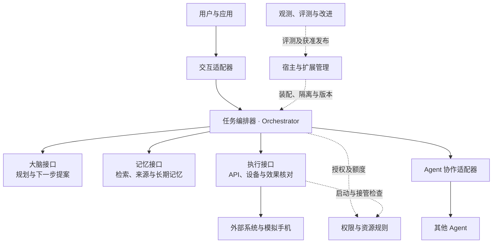

# Harness 架构方案（整理版）

本目录面向架构评审者、模块开发者和部署维护者，说明 Harness 如何接纳用户目标，在授权与预算内组织大脑、记忆、执行和其他 Agent 持续工作，并保存解释结果与中断恢复所需的事实。

首次阅读从本页进入[任务贯穿场景](walkthrough.md)，再按[阅读路径](reading-guide.md)进入负责的模块。需要先了解范围与指标时，阅读[建设目标](goals.md)；需要理解建模理由时，阅读[技术总览](technical-overview.md)。

本目录依据原架构方案整理，保留相同的设计范围、契约和验收边界。内核、SDK、默认组件及运行验收仍待实现；设计文档、静态样例和图示不能证明运行能力，见[交付状态](status.md)。已冻结范围的机器契约与示例共同约束参考实现；尚未进入公开协议的能力仍是设计接口，不能据此声明互操作已经完成。

## 1. 要解决的核心问题

一个用户可能让 Agent 核实信息、保存文档，再在手机上执行操作。模型可以提出错误步骤，工具可能已经产生效果却丢失答复，端点也可能在执行中失联。Harness 必须把这几件事分开处理：是否接受了目标、是否获准行动、行动发生了什么、结果达到什么质量、失败后由谁继续。

生产方案把 WSS 连接接入层、Orchestrator 应用、工作池和隔离执行宿主分开部署，使连接、任务推进和外部执行能够分别扩容与恢复。模块边界不等于服务或数据库边界：必须原子更新的业务状态与后续作业写入同一本地事务；跨数据库交接保存原命令、回执与恢复作业。

生产基线为单地域三个可用区，优先采用托管 PostgreSQL、对象存储及连接池。单区失效时已确认账本的目标为 RPO=0，原 Orchestrator 控制与查询恢复 RTO≤60 秒；目标文件字节和整地域灾备另有边界。这些保证成立的条件、恢复顺序和负载预算集中在[生产部署](deployment-production.md)，基础设施选择归[存储与中间件](storage-and-middleware.md)。

方案以已确认规模与恢复目标为约束，先采用少量成熟组件，再用稳态、故障剩余容量及积压恢复的测量确定配置。上述目标仍需实际运行验收。

## 2. 系统分工与事实归属

图表示逻辑职责，方框不代表独立进程。实线是任务处理调用，虚线是控制或装配关系；调用返回仍沿原关系传递。

**Orchestrator（任务编排器）**负责组织任务推进，保存目标、控制、预算和完成决定。每个任务通过 `orchestrator_id` 归属一个固定的逻辑负责方，可由本地宿主或共享权威数据库的云服务集群承载。该标识不指向某个工作进程；实例重启或更换后任务归属保持不变。同一用户的不同任务可以属于不同 Orchestrator。

| 事实 | 唯一裁决者 | 调用方取得的保证 |
| --- | --- | --- |
| 目标、控制、操作意图、任务预算、完成结果 | Orchestrator | 状态和下一项持久工作共同提交；重启可继续 |
| 模型请求、提案和调用费用记录 | 大脑适配器 | 提案绑定输入快照；提案不直接执行行动 |
| 实际启动、目标系统效果、设备占用 | Executor 及资源负责方 | 请求到达与实际效果分别记录；未知效果有继续核对的入口 |
| 记忆版本、来源、内容和副本清理 | 记忆或内容负责方 | 引用可定位准确版本；读取、同步和保存分别获准 |
| 许可、撤销、单次消费、离线额度 | 授权负责方 | 许可在指定范围内生效；离线撤销受已约定窗口限制 |
| 输入是否消费、外部子任务是否接纳、版本是否激活 | 对应业务处理方 | 各自有持久回执；界面展示或网络响应不能代替业务决定 |

「负责方」是一项裁决职责，并不要求新增服务。同一 Orchestrator 内需要共同决定的业务状态在所属数据库分片中原子更新，只有独立事实归属、信任隔离或伸缩需求需要时才拆开。字段与接口的权威位置见[契约索引](contracts/README.md#domains)。

## 3. 决定方案形状的选择

系统采用每任务固定 Orchestrator、一轮提案后独立准入、决定与后续责任共同提交，以及按原命令或对象标识恢复。每项选择的依据、代价与改选条件见[架构取舍](architecture-choices.md)；会改变用户可见行为和验收含义的规则见[设计决策](decisions.md)。

## 4. 连续阅读路径

| 阅读目的 | 入口 | 需要确认的内容 |
| --- | --- | --- |
| 了解系统 | [目标](goals.md) → [技术总览](technical-overview.md) → [架构取舍](architecture-choices.md) | 覆盖范围、事实归属与设计代价 |
| 跟踪一次任务 | [贯穿场景](walkthrough.md) → [任务编排器](orchestrator/README.md) | 提案、准入、效果、核验和异常恢复 |
| 实现模块 | [九模块索引](reading-guide.md#design-coverage) → 所属模块的 `implementation.md` | 内部职责、事务、持久记录和恢复责任 |
| 接入独立实现 | [共同契约](contracts/README.md) → [方法索引](contracts/methods.md) → [协议资产](contracts/protocol.md) | 输入输出、成功点、错误、查询与恢复 |
| 装配和部署 | [宿主装配](deployment.md) → [持久工作框架](reliable-work.md) → [生产部署](deployment-production.md) | 事务接口、进程职责、路由及故障域 |
| 安排实施与验收 | [工程落地](engineering.md) → [验收设计](validation/README.md) → [交付状态](status.md) | 建设顺序、证据要求与当前缺口 |

完整专题、图册及后续维护入口见[阅读路径与文档索引](reading-guide.md)。

## 5. 从主线进入详细实现

九个模块分别是任务编排器、大脑、执行、权限与隔离、记忆与内容、Agent 协作、应用与交互、扩展与宿主，以及观测评测与改进。模块入口说明职责、行为与取舍，实现篇说明数据流、事务、恢复与生产约束；[实现索引](reading-guide.md#design-coverage)提供对应章节。

软件模块、事实负责方、进程和数据库是四种不同边界。图中的容器不自动对应独立服务；需要共同裁决的事实仍在同一本地事务内提交。字段以同版 Schema 为准，真实故障、隔离和性能保证需要运行验收。

## 6. 启用前提与边界

参考实现先提供开发单体，再在本机 PostgreSQL 上集成独立网关、应用、worker 与执行宿主，验证跨进程交接及恢复。生产接入公司自有平台；首次上线前须完成相应生产准入验收，公司平台就绪不作为开发前提。

完整参考实现覆盖默认三系统、CLI／Web、搜索与内容获取、文件能力及多个有状态模拟手机。完整联网问答和模拟手机专项按第二阶段交付；本地 Brain、Memory、Executor 及混合装配仍须分别验证。

启用时须满足以下条件：

- 云模型、搜索服务或外部 Agent 缺失时，对应任务等待或明确返回不支持。全部权威与依赖均在本地的任务仍按原契约执行。
- 跨端执行需要已配对身份、目标服务的持久幂等记录、有效权限和有限额度。缺少任一条件，不派发新动作。
- 离线权限依赖对应平台的时钟与防回滚保证。缺少保证时，关闭依赖远端缓存的权限使用；全部权威在本机的模式不受此限制。

运行中跨 Orchestrator 迁移、离线共同修改同一权威对象、任意来源原生插件、真实手机支持和跨格式无停机升级，不属于参考实现的完成承诺。接入条件见对应专题；这些边界不减少 C1–C9、A1–A4 和两个专项的设计覆盖。
