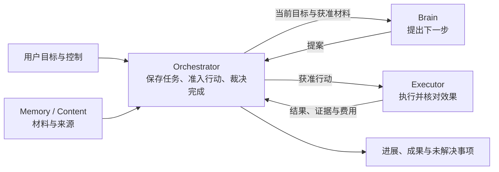

# Harness：从用户目标到可核对的结果

用户让 Agent 比较两个软件版本，给出来源，把报告存好，再在手机上创建提醒。模型能够提出步骤，却不能单凭一句“已经完成”证明文件已写入、提醒已建立。文件可能写好了而答复丢失，用户可能中途取消，最后一笔模型费用也可能晚到。

Harness 是承担这些任务责任的开源运行框架。它组织模型、资料、工具和其他 Agent 工作，保存每次已经作出的决定，并让后续工作能在中断后找到原来的依据。用户既能看到成果，也能分清正在等待什么、哪些动作已经发生，以及哪些事情仍无法确认。

## 先沿一项任务理解系统

任务编排器 **Orchestrator** 保存目标并决定下一步是否可以执行；**Brain** 根据当前资料提出建议；**Executor** 操作外部系统并核对实际效果；**Memory／Content** 提供有来源、可按版本引用的材料。

图中是逻辑职责。开发时可以把它们装入同一进程；生产按接入、任务入口、工作池和执行隔离分别部署。一个任务始终由原逻辑 Orchestrator 负责，进程接替则使用它的原账本。

第一次阅读建议从[一项任务的完整经过](task-journey.md)开始。它把正常链、用户介入和两种丢答复放在一起，随后[事实归属与关键选择](ownership.md)解释为什么需要这些边界。

贯穿例子中的文件目录是**已配置的受管目录**；模拟手机也是明确的验收目标。普通用户目录、网络盘和真实手机需要各自驱动与平台证据，不能直接继承示例中的恢复保证。

## 三个决定方案形状的选择

**任务只有一个推进者。** Brain 每次给出一份提案，Orchestrator 依据当前目标、控制、权限和预算裁决。这样不用在模型内部循环和任务账本之间维护两份恢复进度。代价是多轮任务的持久交接；依赖明确的有限计划可以减少不必要的再次推理。

**先保存责任，再跨外部边界。** 接纳任务、准入操作、保存控制时，把决定和后续工作共同提交。外部调用在事务之外进行。答复丢失后沿原命令和原操作查询，而不是猜测它没有发生。代价是保留未知、等待证据，以及在费用未清时继续占用预留。

**完成是一项有范围的判断。** 系统分别检查条件是否覆盖完整目标、每项必要条件是否通过，以及外部效果是否已经核清。确定性验证、开放质量评估和用户验收表达不同依据。自然语言质量与目标覆盖不能因字段齐全就变成确定性事实。

## 按需要进入主题

| 读者正在解决的问题 | 文档 |
| --- | --- |
| 一项任务到底经历了什么 | [任务经过](task-journey.md)、[事实归属与取舍](ownership.md) |
| 何时继续、等待、暂停、修订或结束 | [任务推进与控制](task-control.md)、[完成与证据](verification.md) |
| 模型如何取得输入，工具如何产生可核对的效果 | [Brain 与上下文](brain.md)、[执行与设备](execution.md) |
| 材料怎样保存、记住、授权和清理 | [内容与长期记忆](content-and-memory.md)、[授权与预算](authorization-and-budget.md) |
| 应用如何交互，其他 Agent 如何参与 | [应用与用户输入](applications.md)、[任务委派](collaboration.md) |
| 进程中断后由谁继续 | [持久工作](durable-work.md)、[部署与恢复](deployment.md) |
| 组件怎样首装、替换和改进 | [装配与生命周期](lifecycle.md)、[评测与发布](evaluation.md) |
| 如何接入、实现并验证 | [协议与 SDK](protocol.md)、[工程与验收](engineering.md) |
| 哪些边界仍未定，旧稿内容去了哪里 | [保证前提与待决事项](open-boundaries.md)、[来源与覆盖](coverage.md) |

核心处理链可以在本目录内连续阅读。精确消息字段、105 个既有领域方法、协议样例和校验向量仍引用原机器契约，避免同时维护两套 Schema；入口集中在[协议与 SDK](protocol.md)。

## 交付范围与证据状态

这是一套供实现和对照阅读的架构方案。可运行内核、默认组件与 SDK 仍待建设；本目录没有用叙述替代数据库、平台、模型或设备的运行证据。

最先贯通的任务链使用规则 Brain 或固定回放、有限授权、版本化内容、受管文件保存和独立读回。随后接入真实模型与费用、Web、本机多进程、联网取证和模拟设备。长期 Memory、子 Agent、动态发现、程序化工具、离线能力及改善发布按各自条件启用；普通任务不必同时依赖所有模块。

生产沿用单地域三个可用区、PostgreSQL 与对象存储，以及公司已有平台。已确认账本 RPO=0、控制与查询 RTO≤60 秒等数字是有适用条件的验收目标；它们不等于外部世界的“恰好一次”。开发阶段无需先建设生产控制面。

本版保留现有 ADR 的决定。发送窗口的平台机制、纯账务修订导致提案过期后的续行细则、公共结果的当前证据说明等尚未闭合的部分，在相关正文和[边界清单](open-boundaries.md)中明确列出，不作为已解决能力。
