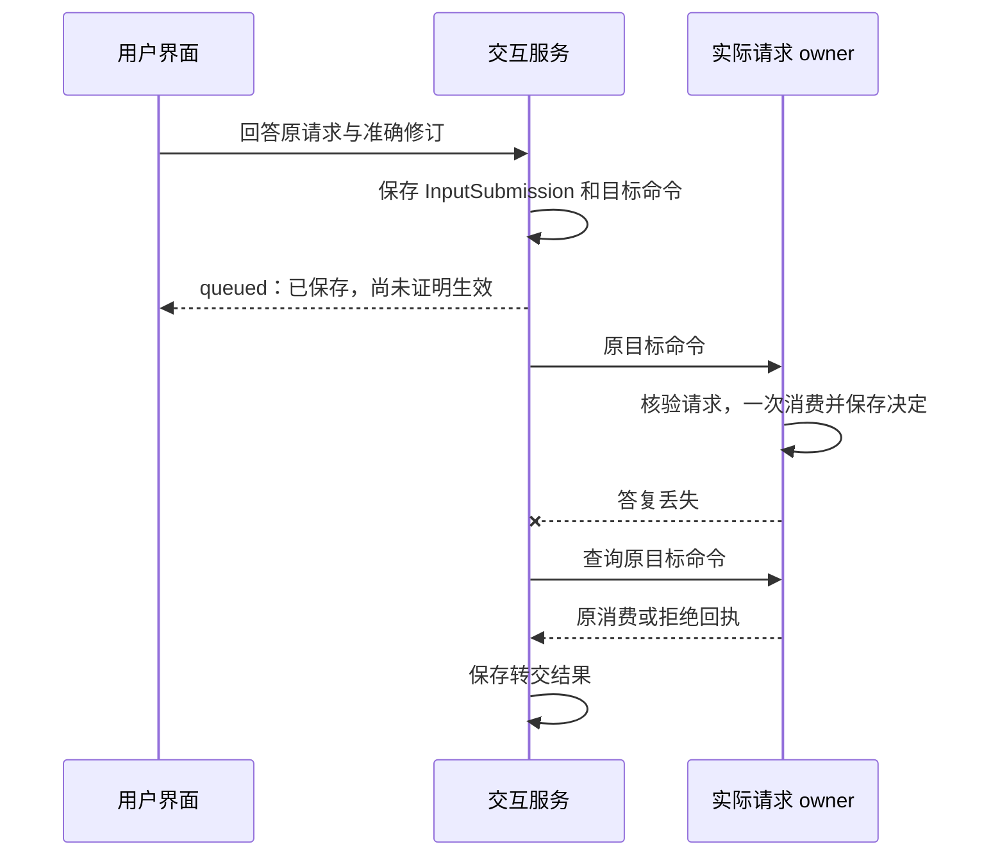

# 应用：把输入、任务与呈现连接起来

[入口](README.md) · [任务经过](task-journey.md) · [协议与 SDK](protocol.md)

用户眼中是一段持续对话，系统内部可能同时有已保存的消息、等待接纳的任务和已经发生但答复未到的动作。应用应让这些状态容易理解，同时从各自原记录取得事实。

## 1. Session 组织对话，Task 承担目标

Session 保存标题、消息顺序、获准历史和任务引用；Task 保存目标、控制、预算、行动和完成责任。一个对话可以有多个任务，API 创建的任务也可以没有对话。初版使用线性消息，每个 Task 至多固定一个创建来源 Session，其他界面可以引用它。

不再增加一套可以独立裁决完成的 Turn 或 Run。界面所说的“回合”按原提交、Decision、Operation 和回复关联分组。一轮 Decision 不一定等于一个回合，一个回合也不一定覆盖整个 Task。

用户输入按明确操作进入四条路径：新目标提交 Task；回答准确 InputRequest；修改或控制原 Task；只保存不引发行动的批注。含义不明时保留草稿并明确目标对象，不能把最近一句文本自动当作批准或取消。需要模型生成或计费的批注仍经过适当的 Task／Decision。

首发前，SDK 耐久保存原服务地址、logical_service_id 和完整 Command。Task 接纳后才补 Session 关联；关联写回丢失时查同一命令。若本端不能保存原身份，界面只能显示待发送，不能先发出可恢复写入。

关闭页面、归档 Session 或删除获准清理的消息正文，都不取消任务或清除账务。历史缓存绑定准确源修订，当前来源关闭后不能继续展示旧正文。

## 2. Surface 是完整快照，Presentation 是本设备意图

Surface 固定应用处理器版本、可选 Task 引用和严格声明式组件快照。独立记忆管理界面可以没有 Task；模型生成文本不能在其中运行任意脚本或任意管理 RPC。

应用事件只交给已绑定处理器。处理器需要幂等消费和原命令查询，才能承诺副作用事件可恢复。仅支持一次回调、不能查询原处理结果的接入不具备这项保证。

Presentation 保存本设备的打开／关闭意图和意图修订。用户关窗后到达的结果仍更新任务，但不重开窗口。旧连接、旧预览及旧页面世代的回调，也不能覆盖新意图或重新启用按钮。

Change 仅提示读取新快照，可合并、丢失或重建。显示“已经完成”必须来自原 Result 和当前可取得的依据，不能来自一条通知或模型流式文本。现有协议不因采用 WSS 就自动支持 token delta、音视频或渲染补丁。

## 3. 一份回答有两个持久交接点

InputRequest 由实际业务 owner 保存，固定类型、Schema、问题、准确请求修订及可选预览要求。交互服务保存 InputSubmission，固定回答及其唯一目标命令，再承担转交责任。

两台设备回答同一请求时，一份被消费，另一份得到明确拒绝。请求、候选或目标换版后，旧回答不能自动套用。验收请求还固定 goal_revision、候选引用和摘要，且不能豁免未知外部效果。

撤回与发送领取在交互服务内竞争：`queued` 撤回先提交则不再发送；领取先提交进入 `sending` 后，只能保存 `withdrawal_requested` 并核对实际消费。撤回输入与取消整个任务是不同命令。

必需预览由受信 Renderer 取得准确内容后启用依赖输入。业务端核对 `preview_refs` 覆盖、版本和当前许可；引用本身不构成阅读证明。请求 owner 失联时禁用新的依赖输入，已保存输入仍沿原目标恢复。

## 4. 结果先展示成果，再展示判断依据

默认结果视图给出可用成果、保存位置和仍未解决事项，再展开必要条件、完成依据、来源与成本。目标覆盖判断和逐条件判断应能关联同一目标修订，避免把新目标和旧报告拼成一张可信界面。

`verified`、`assessed` 和用户验收分别说明依据，不能统称“系统已验证全部要求”。宿主内部可以读取覆盖报告和判断缺陷说明；现行公共 Result 尚不完整提供这些结构化信息，第三方界面需遵守[公共结果边界](verification.md#public-result)，不自行补造证据。

状态短语也应对应事实。例如“取消已保存，手机端尚未确认停止”比一个全局“已取消”更准确。无正文读取权但仍有管理权时，显示最小可授权元数据及控制入口，不要求用户先读取正文才能取消或删除。

## 5. 跨 Orchestrator 目录怎样说明完整性

一个用户的任务可以来自多个逻辑 Orchestrator。身份权威提供受信来源目录及当前授权范围版本，新来源或授权扩展在生效前先登记；应用不能只查询当前默认分片。

目录按 `(created_at DESC, orchestrator_id, task_id)` 形成稳定总序，以完整二元任务身份去重。时间用于展示排序，不代表跨库因果或一致快照。各源先订阅变化再枚举有界快照，分页间合并提示。

完整全局下一页需要每个来源的下一候选；某源失联时，可显示已取得的部分结果并标缺口，不能签发声称完整的全局续页游标。新增任务落入已输出区间、来源目录或授权范围版本改变、变化流断裂时，旧游标失效并重建查询。

这里的完整性只覆盖已列来源的各自边界和连续变化，不是跨数据库同一瞬间的快照。Grant 扩大可能使历史任务新近可见，必须推进授权范围版本，不能等待不存在的 Task 变化通知。

## 6. 可选的定时入口和历史分支

定时应用拥有 Schedule 规则、时区、有效期、错过触发及重叠策略。每次实际触发先固定规则版本、计划时点与时区歧义消解，以及原目标 Orchestrator 和 Command，再走普通任务接纳。Job 的 due_at 负责唤醒扫描，不承担定时规则的业务含义。

修改规则只影响尚未建立的触发；发送结果未知仍查原命令。停用阻止新触发及可证明未发送的工作，已接纳 Task 的取消需独立指令。首个实现是否跳过错过时点、如何限制并行触发仍须配置决定；原稿的建议不在本版提升为既定选择。

Session 分支以后可用准确消息节点、来源截止位置和历史配置引用选择上下文。回退历史不回滚文件、费用或外部效果，也不恢复旧权限。首版线性历史、定时规则和复用子会话可先作为宿主内部组合；`session.*`、通用消息 steering／排队、Schedule 及分支的公共合同尚未冻结。

现有字段与输入状态见[原交互契约](../architecture/.draft/interaction/README.md)；会话范围见[Session 与 Task](../architecture/.draft/interaction/session-and-task.md)，定时规则见[触发设计](../architecture/.draft/orchestrator/scheduled-triggers.md)。
