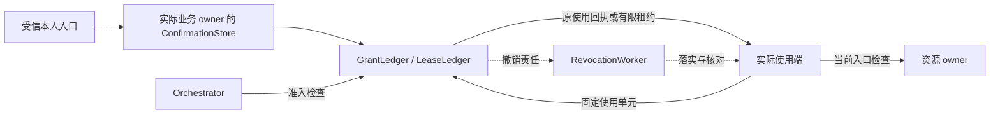
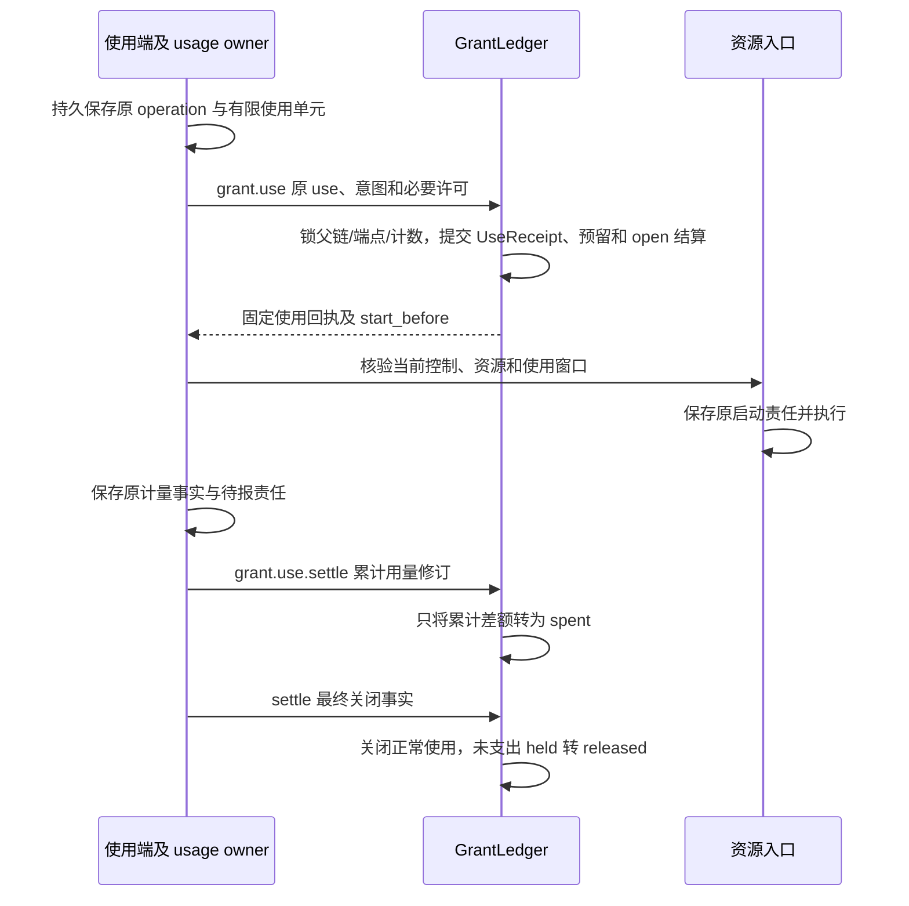
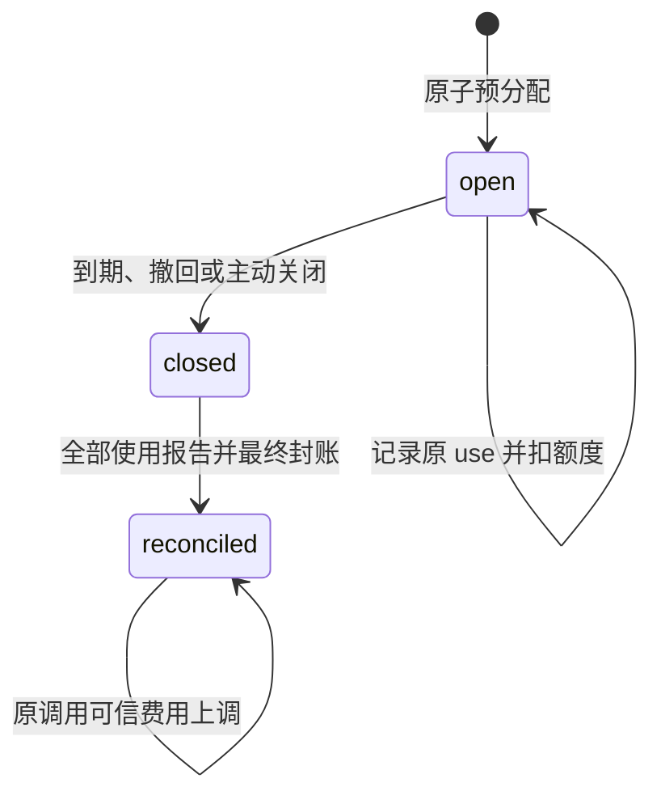

# 身份、授权与使用结算

授权模块以固定 Grant owner 的账本裁决谁可以在何处、为何用途使用哪些资源，并保存许可消费、撤销、费用结算和未完成传播责任。资源 owner 在实际入口执行决定，Orchestrator 的任务决策权不替代资源权限。

领域术语见 [CONTEXT.md](../../CONTEXT.md)，公共字段以 [协议 Schema](contracts/schemas/protocol.schema.json) 和 [方法登记](contracts/schemas/methods.json) 为准。本文定义授权行为；任务预算归 [Orchestrator](orchestrator.md)，内容来源和副本归 [Memory](memory.md)，实现及验证记录统一见 [review.md](review.md)。

## 组件与依赖

GrantLedger 保存授权权威；IdentityAdapter、ResourceNormalizer 和资源入口分别提供可信身份、规范资源和实际访问控制。Grant owner 对应策略决策点（Policy Decision Point，PDP），资源入口对应策略执行点（Policy Enforcement Point，PEP）；本项目在这个分工上增加持久许可消费与额度账本，不要求采用 XACML 协议。

| 组件 | 输入与产出 | 本地责任 |
| --- | --- | --- |
| IdentityAdapter | 已验证会话或端点凭据 → Subject | 绑定 tenant、actor、endpoint、instance 及凭据代次 |
| ResourceNormalizer | 类型化选择器 → 可判定资源集合 | 核验资源 owner、准确版本和规范化器版本 |
| ConfirmationStore | 固定原业务命令、本人决定 → Confirmation | 位于实际消费业务的 owner；与业务决定同事务消费 |
| GrantLedger | issue/check/use/revoke → 许可和使用回执 | 父链、范围、单次占用、计数与撤权 |
| LeaseLedger | allocate/settle → 离线预留及结算 | 单实例消费份额与最终封账 |
| PairingController | 配对会话、批准、领取 → Endpoint | 一次领取、原凭据恢复和秘密清理 |
| RevocationWorker | 原撤销修订 → 各使用端落实事实 | 传播、有限核对及未落实范围 |
| 使用结算与交回处理器 | 原计量账单 → 累计支出与原任务交回 | 费用差额、关闭证明、迟到账单和原交回结果 |

这些组件是领域包和端口，不要求分别部署。许可、父链、计数、使用和相应确认处于同一本地事务范围；远端身份、资源、凭据介质调用在短事务之外。后台处理复用 [可靠工作框架](reliability.md)，共享领取机制不共享授权裁决权。

下图从一次资源使用观察组件依赖；实线表示请求或依据交接，虚线表示持久责任的后续传播。

## 数据模型与状态

授权账本分别记录身份、许可、原使用决定和使用结算。`tenant_id` 是个人用户的数据与资源隔离边界，由认证入口确定；`owner_id` 是逻辑账本权威，`endpoint_id` 是登记端点，`instance_id` 是端点当前获准实例，三者不混用。

| 持久记录 | 理解行为所需的键与状态 | 约束 |
| --- | --- | --- |
| `grants`、`grant_parents` | grant、revision、policy、父许可；`active / revoked` | 到期另行判断；父链及计数留在同一本地事务范围 |
| `confirmations` | 原 consumer command、intent hash、挑战、期限；`pending / approved / denied / consumed` | 原命令和目标固定；拒绝不可消费 |
| `grant_uses`、`grant_use_items` | use、operation、usage owner、固定许可集合、窗口、占用 | UseReceipt 不可变；一次使用可同时需要多项许可 |
| `use_settlements`、`use_usage_revisions` | use、累计修订、spent/held/released、关闭证明；`open / final` | 累计差额入账；与原 UseReceipt 分离 |
| `grant_counters` | grant、单位、已分配及未结占用 | 金额使用十进制定点；不同单位不相加 |
| `offline_leases`、`lease_uses` | endpoint/instance、分配、期限、原 use；`open / closed / reconciled` | 一个实例账本消费和报告；首次消费仍为 open |
| 原实例账本、`lease_report_outbox` | lease、原使用及账单修订；单一未决报告 | 原计量事实与待报责任在本地共同提交 |
| `revocation_targets` | 原对象、目标端、要求修订、已落实修订 | 只单调推进已核实事实 |
| `pairing_sessions`、`endpoints` | pairing、nonce、码摘要；endpoint/instance、credential generation | 配对批准前位于独立预认证域，批准时才绑定 tenant |
| 最小去重与终态记录 | 域化原标识、关闭类别、决定摘要 | 正文和秘密清理后仍阻止旧标识重新消费 |

`read`、`process`、`store`、`sync`、`disclose`、`act`、`manage` 分别表示读取、指定位置处理、有限期保存、受管同步、向接收方披露、外部行动和具体管理操作。允许写文件不自动允许读取来源、读回验证、外发或保存为记忆；各用途分别核验。

`once` 只绑定一个固定意图的使用单元；`continuous` 在总限额和有效期内允许多个有限使用单元。读取一页、一次模型处理、一个设备动作各自声明边界。子许可的资源、动作、用途、接收方、位置、期限、额度和再委派深度逐维收缩；多条独立必要许可分别满足，不拼成它们各自都未允许的新用途。

GrantLedger 沿完整父链检查当前撤销和范围；达到装配的有限深度、缺父引用或无法判定子集时拒绝，不能由本地缓存的父许可批准继续签发。

资源规范化器只接受精确对象或受信可验证集合。文件能力从已登记租户根句柄解析规范相对路径，拒绝绝对路径、父目录跳转、别名及越界符号链接；执行端实际打开时再次逐段验证对象与版本。模型提供的路径前缀、URL 或字符串不直接成为许可范围。

## 关键时序

### 可信确认与许可签发

实际业务 owner 在原业务事务中一次消费 Confirmation；交互宿主负责取得规范意图、认证和呈现。确认机制的流程集中在此，界面如何读取准确正文见 [交互](interaction.md#请求与正文预览)。

1. 调用端先保存完整原 Command，固定 `confirmation_id` 和指向该 owner、该 ID、批准修订 2 的引用。
2. `confirmation.request` 验证 consumer 方法的准确输入 Schema、目标和当前前提，保存 pending 修订 1 与有限挑战。
3. 受信宿主通过 `confirmation.read` 取得规范意图，呈现主体、资源、动作、用途、接收方、位置、上限及期限。
4. `confirmation.decide` 核对原命令、意图摘要、挑战、期望修订和当前主体权限，保存 approved 或 denied 修订 2；它不执行业务。
5. 调用端提交原 Command。owner 再核当前权限、期限、原绑定，在业务事务中消费为修订 3，同时保存业务决定和回执；回滚同时撤销消费。

规范意图是业务 owner 与完整 consumer command 的 JSON 规范化方案（JSON Canonicalization Scheme，JCS）SHA-256 摘要。计算 `grant.issue` 时仅移除其派生 `payload.intent_hash` 避免自引用；预定确认引用仍参与摘要。原参数、截止或期望修订改变须形成新命令和新确认。

| 消费方法 | 可以作决定的主体 | 消费位置 |
| --- | --- | --- |
| `grant.issue`、`grant.lease.allocate`、`endpoint.pair.approve` | 有相应管理权的本人 | Grant owner 的业务事务 |
| `task.accept_result` | 有该任务管理权的本人 | 原 Orchestrator 的验收事务 |
| `evaluation.approve` | 有精确目标发布权的用户或维护者 | 发布批准 owner 的业务事务 |

维护者发布权不包含用户数据许可。owner 在展示、决定和最终消费三个点核验相应权限；普通聊天、任意按钮、模型输出和外部 Agent 的批准声明只作为数据。

`grant.issue` 在锁定原命令、确认和父许可后核验规范资源与子集关系，提交确认消费、Grant、初始计数及固定回执。会增加用户可见 Task 来源或披露授权权威的变更，还须先通过 [用户来源目录发布规则](deployment.md) 完成受影响来源预登记。

### 在线使用与启动

实际使用端先保存原操作，再以固定 use 申请全部必要许可，最后在资源入口登记启动。`grant.check` 只供当前准入判断，实际使用必须走 `grant.use`。

下图表示同一 Grant owner 的一次使用和独立结算；框内是各自的短事务，驱动调用位于事务之外。

`operation_id` 指使用端已经持久保存的有限业务动作：执行操作、模型调用、记忆修改原命令或固定查询及页。`use_id` 指该动作的一次用途；真实模型重试另建调用与 use，并另计费用。

GrantLedger 优先恢复原 use；首次消费按稳定键锁全部必要许可、父链、端点和计数，在锁内重查当前状态、范围及上限，全部通过才共同写占用。任何必要项失败则保存 denied、零占用。同 use 固定意图、许可、上限和 `start_before`，重复查询不能续期。

资源端只有在尚无原启动记录、窗口仍有效、本地控制与资源状态允许时首次启动。已有启动记录则核对原效果；未启动而窗口已过期则停止，重新行动需新授权。执行效果未知的处理归 [Execution](execution.md)。

跨 Grant owner 使用先保存各方原 use 决定，仅在全部允许且窗口仍有效时启动。部分允许、另一方拒绝或不可达时，处理端持久封闭该次发送；确证从未越过发送边界后，沿各获准 use 报告零实际用量和最终关闭。未知 use 继续查原标识，查明允许后沿同一关闭事实结清；边界不明则保留预留。新尝试需要新的有限使用单元，已消费 once 不恢复。

### 在线使用结算与迟到账单

使用结算独立于授权回执，Grant owner 只按原计量 owner 的可信累计事实更新账本。`grant.use` 允许时建立 `revision=1 / usage_revision=0` 的 open 结算，原预留全部放入 held。

| 结算输入 | GrantLedger 的处理 |
| --- | --- |
| 同一已决定命令 | 返回原回执，不重复入账 |
| 新累计修订 | 核对 use、operation、usage owner、许可及单位；只记新旧累计差额 |
| 效果或最终费用未知 | 保持 open；已知部分转 spent，未支出预留留 held，released 为零 |
| 原动作和正常计费窗口已封闭 | 核验关闭证明后 final，剩余 held 转 released |
| final 后可信费用上调 | 保持 final，追加累计费用差额；不恢复 once、启动窗口或已释放预留 |
| 退款、贷记或矛盾账单 | 标记对账缺口，不降低累计用量伪装负向事件 |

GrantLedger 分别核算使用数量与费用；已释放预留是历史事实，final 后的费用更正不能撤回它。

| 账本范围 | 字段关系 |
| --- | --- |
| 使用数量 units | 始终满足 `reserved = spent + held + released`；final 后不增加数量，held 为零 |
| open 费用 | released 为零，`held=max(0,reserved-spent)`；strict 正常上界成立时满足上述等式，estimate 或可信违约费用可超过预留 |
| 首次 final 费用 | held 归零，当时未支出的预留转 released |
| final 后费用更正 | spent 按可信累计费用上调，held 保持零，reserved 与 released 不变；此时不再要求上述等式，即使累计费用仍低于原 strict 上界 |

例如费用预留 4，首次 final 支出 2、释放 2，后续更正为支出 3 时仍保留释放 2。费用字段满足 `spent+held+released≥reserved`、`released≤reserved`，不能为维持等式冲销历史释放。`strict` 使用受信适配器可兑现的最大费用，`estimate` 使用原估算；两者超额均为 `max(0,spent-reserved)`。任何可信超额都记全额、记录保证失效或债务并停止同范围新计费，不截断真实支出。

GrantLedger 按 [任务预算的 strict/estimate 准入规则](orchestrator.md#预算结算与额度交接)核验原动作、适配器固定声明及本人接受记录，再保存不可变成本模式；调用方不能在 UseRequest 中自选较宽模式。离线和跨 Orchestrator 分配的成本资格也由该规则定义，本模块结算只处理原获准使用的真实账务。

任务关联 use 的可信费用上调，须与 `(use_id, usage_revision)` 唯一交回记录共同提交。这是事务发件箱（transactional outbox）：原费用提交后才能事务外向固定原 Orchestrator 发送 `task.billing_reconcile`，直到取得持久 JobAck。每个修订保留独立行；较新账单不能覆盖尚未交付的旧修订。

首次命令尝试固定载荷和期限；丢答复先查原命令，在期限内原样重投，期限过后仍无 JobAck 可为相同修订和摘要保存继任命令。原 Orchestrator 主动读 Grant 账、按固定物理计费来源归并累计差额；通知金额不直接记账。终态 use 和 Task 仍保留交回路由至可信更正窗口结束；没有可验证期限时保留最小计费账本及查询入口。

### 撤权、配对和端点身份

撤销事务先保存新修订、原回执和逐端传播责任，使用端按更高已知修订封闭新启动。`endpoint.revoke` 同时提升凭据代次；连接入口每条消息及披露前核验当前会话、端点状态与代次，获知撤销后关闭旧连接。

本地身份来自本人受控系统会话、数据目录和受限 CLI/Web 会话；Web 使用回环或受信生产入口、Origin 核验与会话防护。浏览器握手使用同源 Secure/HttpOnly Cookie，CLI 和设备使用 TLS 下的受限 bearer；凭据不进入 URL、日志或业务正文。传输认证细节归 [传输契约](contracts/transport.md)。

| 配对步骤 | 持久决定与恢复 |
| --- | --- |
| `endpoint.pair.begin` | 保存短期会话、client nonce、高熵私密设备码摘要和用户码摘要；预认证入口限流，不绑定调用方自选 tenant |
| `endpoint.pair.approve` | 本人核对设备、用户码、范围和挑战，批准事务绑定 tenant；不向批准页面交付设备凭据 |
| `endpoint.pair.claim` | 核对设备码、nonce、状态和期限；pending 只给退避，下一轮用新命令查同会话 |
| 首次有效领取 | 唯一创建 endpoint/instance 与受限凭据，短期加密保存原领取恢复包 |
| 已领取后的合法恢复 | 仅返回原端点和同一凭据结果；claimed 后撤销须走 endpoint.revoke |
| 恢复包过期 | 清秘密，保留最小领取记录；后续返回 gone 并重新配对，不重签原凭据 |

用户码用于人工匹配，不是设备登录秘密。本设计采用用户码、设备码与有限轮询分离方式，不宣称完整 OAuth 互操作。重新配对或凭据更新产生新实例绑定；同一有效实例断线沿原责任重连，新实例不自动继承旧实例的余额和未决操作。

### 离线租约与串行封账

离线租约（lease）把一份许可的有限范围、次数和费用预先划给单一 endpoint/instance 账本。签发事务先扣可分配余额；once 分配离线使用时同步封闭其在线消费通道。

下图只表示授权租约的开放和封账，箭头是账本状态变更；动作效果和是否出现过使用另查原使用记录。

租约期限取许可、来源、端点授权和显式离线上限的最小值。端侧在同一本地事务核验 open、当前控制、单调时间和剩余额度，再保存原 use 并扣额；关闭与首次消费由事务顺序裁决。默认宿主仅开放进程连续运行的远端离线窗口，重启、时间可信度丢失或旧快照恢复后先联网核验。

重连顺序为当前端点和撤销/内容关闭记录 → 原使用与累计用量交回 → 新远端工作。原实例账本是唯一报告者；Brain/Executor 的原计量事实和本地待报责任共事务保存，不能各自猜测全租约累计值。

同 lease 最多一个结果未确定的 `grant.lease.settle`。报告固定本批最多 100 条新增或修订明细、累计值、usage revision、完整命令及此前确认输出的 expected revision。累计截面等于上一已确认账本加本批更新，未入本批的新账单留待下一轮；原结果 confirmed 后才推进下一报告。

每条明细固定原 use、意图、operation、usage owner 和 billing ref。账单来源只按已登记的 Brain decision 或 Execution operation 读取原账；Grant owner 核身份、准确修订及累计值。final 需全部已发生使用已经报告、资源端封闭及正常费用窗口关闭；保存初次关闭依据与释放余额，状态收敛到 reconciled。

离线封账后只允许已有 use 的可信费用上调，保持原使用数量、结束标记、账单对象和初次封账依据。原实例串行汇总更高账单修订，owner 只追加差额，不新建 use、不重复释放、不倒转已释放金额。超额照实入账并停新计费；任务账务仍由原物理费用来源单独交回，不能把租约和原调用重复计入任务。

离线报告丢答复先查或重投原命令。仅当原期限已过，且原 owner 当前明确返回 not_found，才可用新命令发送同一修订及完整内容；gone、失联或结果未知都保留未决报告并停止后续自动结算。这一条件严于在线账单唤醒的继任尝试，不以通用重试策略替代。

## 失败处理

授权失败后的继续者依据原 use、原实例账本或原撤销修订恢复，不从 UI、连接状态或缓存反推业务事实。

| 失败或竞争 | 当下处理 | 恢复责任与用户可见结果 |
| --- | --- | --- |
| use 提交后丢答复 | 不再次消费，不启动未知使用 | 查 `grant.use.get`；原窗口不续期 |
| 两个 use 争同一 once | 计数锁和条件更新裁决 | 一次 allowed，另一次 denied 且零占用 |
| 确认批准后权限撤回 | 原业务消费拒绝 | 保留原决定，需新的有效确认 |
| 跨 owner 部分占用 | 封闭未启动行动，保持各原使用事实 | 有未发送证明才零用量封账；unknown 继续 held |
| 撤权与启动竞争 | owner 拒绝新 use；已知撤销端封闭新启动 | 逐端报告落实，已在途效果由 Execution 核对 |
| 权威库不可写或提交未知 | 不报告签发、消费或撤销已保存 | 查原决定；尽力阻断新发送 |
| 计量 owner 不可达 | 保留 unknown 和 held | 原计量核对者继续；超时、到期不释放未知额度 |
| 租约消费后恢复旧快照 | 关闭新离线使用 | 联网核验连续性，显示账务缺口 |
| 领取秘密已清理 | 返回 gone | 新配对形成新实例，原责任继续保留 |
| 最小去重记录缺失 | 相关权威只进入诊断恢复 | 不把“查无正文”当作从未消费 |
| 旧撤权 worker 回写时出现更高修订 | 只归并有效已核实事实 | 新要求继续，失效领取不修改受保护记录 |
| final 后账单更正丢交回 | 保留原 outbox 和每次尝试 | 原任务结算 job 持久确认后才结束交付 |

后台稳定键分别为撤销对象/目标端、use/usage revision、实例/lease、pairing 清理；其完成条件是已落实控制、持久 JobAck、已确认报告或真实秘密清理。公共领取和作业版本规则见 [reliability.md](reliability.md)。

## 保证与限制

本模块提供同 owner 的原子许可占用、精确命令确认绑定和可恢复的使用账本；保证依赖可信认证、资源规范化、实际入口执行、原权威存储和保留的恢复记录。它不证明外部动作已经发生，也不提供跨 owner 原子提交。

| 保证 | 前提与限制 |
| --- | --- |
| 一份 once 只绑定一项原使用 | 消费零费用或未启动仍不返还；不等于动作必执行或外部效果恰好一次 |
| 在线撤权限制新启动 | owner 提交后拒绝新 use；使用端获知后立即封闭，未知端既有回执最多到 start_before；初始窗口上限 30 秒 |
| 离线撤权有明确上界 | 用户显式接受有限窗口，默认关闭远端离线；要求即时撤权的资源须同权威提交或仅在线 |
| 离线份额不重复分配 | 原实例消费连续且不可回退；未最终封账的份额不因过期或失联重发给其他端 |
| 可信费用上界约束正常消费 | strict 依赖提供方兑现声明；estimate 仅为非硬上限；真实违约费用仍完整记账 |
| 本人确认精确绑定 | 确认/配对会话初始最多 5 分钟；业务 owner 与确认共事务，UI 不具备跨库消费权 |
| 用户隔离 | 数据库、索引、路径、队列、游标、缓存、上下文、模型批次和日志均绑定认证 tenant；默认错误不泄露其他用户对象存在性 |
| 外部内容不赋权 | Skill、网页、文件、模型与 Agent 输出保留数据角色；不能改主体、接收方或许可 |
| 原生扩展的隔离边界 | 默认加载受信代码和维护者审核的原生插件；开放不可信可执行扩展须有对应平台文件、网络、进程、凭据及资源出口隔离依据 |
| 可用性与公平性 | 权威不可达不新消费；各用户共享总份额，控制、撤销、原效果查询与清理保留有限容量 |

纯本地 owner 的当前授权不依赖公网；它与缓存远端许可的离线模式不同。拥有相同本地用户名不证明云端身份相同；首次装配不自动合并账号或迁移身份根。平台和适配器证据、待决能力见 [review.md](review.md) 与 [open-questions.md](open-questions.md)。

## 取舍与运行约束

授权模块优先把一次使用和余额置于可验证的本地事务；需要跨端可用性时采用显式有限份额，并承担未结预留的占用成本。

| 选择 | 代价 | 改选条件 |
| --- | --- | --- |
| 类型化资源集合与可判定子集 | 每个新资源类型要实现规范化器 | 明确业务规则无法表达时，再设计受限策略语言 |
| 当前权威裁决，不缓存 allowed 作为放行凭证 | 热点父许可和计数行限制吞吐 | 缩小共享范围或显式预分配，不复制余额横向扩写 |
| 业务 owner 保存并消费确认 | UI 要按目标路由确认；跨 owner 无统一消费事务 | 只有更改业务权威边界时重评，不能用 UI 数据库替代 |
| 在线有限窗口与可选离线租约 | 撤回传播存在窗口，未结费用锁住余量 | 强制即时撤回时取消相应离线路径，收拢访问权威 |
| 最小去重、关闭和必要计费关联长期保留 | 存储、备份和恢复成本随历史增长 | 引入可验证身份代际或不可延长接纳期限后，再证明可回收范围 |

部署按 [deployment.md](deployment.md) 实施。度量 use/settle/revoke 的提交延迟、父许可锁等待、冲突、未结 held 金额与龄期、最老撤销责任、结算写放大和最小记录增长。过载先拒绝新 use、签发与配对，保留撤回、原使用查询和封账写入空间；[故障实验](validation/fault-experiments.md) 覆盖真实账本、资源入口及对账边界。
