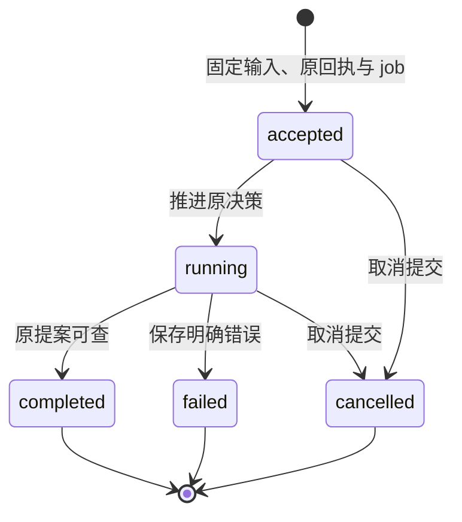
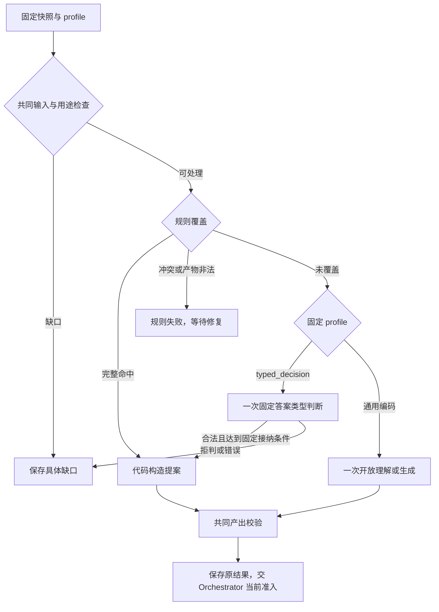
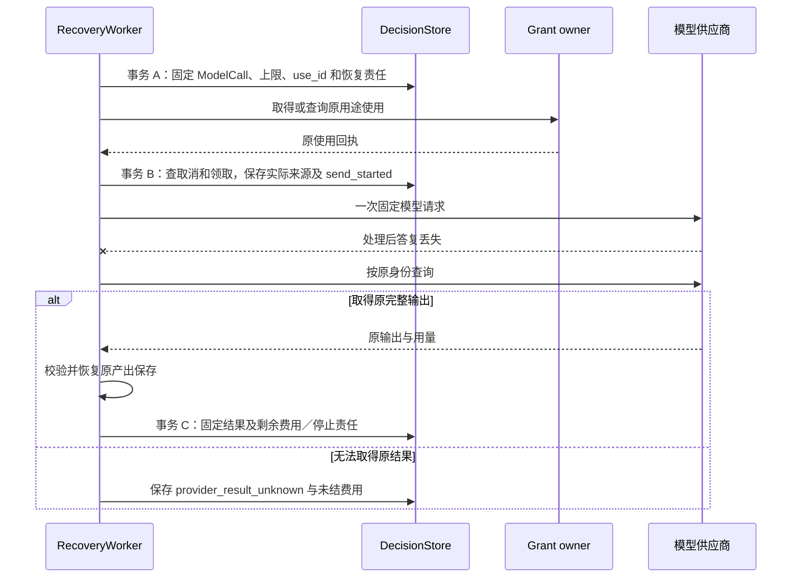

# Brain：固定上下文上的单轮决策

Brain 根据 Orchestrator 固定的目标、约束和事实保存一份提案或明确错误，每个 Decision 最多发起一次模型调用；行动准入和任务完成始终由 Orchestrator 裁决。

本篇定义上下文、规则与模型路径、产出保存及调用恢复。公开字段见 [protocol.schema.json](contracts/schemas/protocol.schema.json)，模型内部产出见 [brain-generation.schema.json](contracts/schemas/brain-generation.schema.json)；实现、可选路径启用状态及验证证据见 [review.md](review.md)。

## 组件与依赖

System One（S1）负责完整规则覆盖和固定答案类型的局部判断，System Two（S2）负责开放理解、规划与综合；二者共用 Brain 生命周期，跨轮协作由 Orchestrator 保存事实和调度。S1、S2 是决策角色，模型供应商或推理进程是其实现依赖。

| 组件 | 责任 | 依赖 |
| --- | --- | --- |
| DecisionService | 固定原决策的接纳、查询和取消 | DecisionStore、共同命令入口 |
| ContextReader | 读取准确正文、验证类型、来源和本次用途 | 内容 owner、[授权](authorization.md) |
| DecisionPolicy | 规则匹配，或使用本轮固定模型配置；受限答案按固定规格映射 | 受信策略、ModelProfile、DecisionSpec |
| ModelAdapter | 供应商编码、一次物理请求、流汇总及真实用量 | 精确模型版本或本地推理进程 |
| ProposalValidator | 结构、引用、能力参数和限额检查 | 固定 Schema、可见引用闭包 |
| RecoveryWorker | 原 Decision 推进、查询／停止原调用、发布产出和交回费用 | 公共 JobStore、模型／内容／授权 ports |
| DecisionStore | 接纳、调用准备、发送门禁、终态和原账单事实 | 宿主权威数据库及受限事务 |

Brain 的领域规则不依赖 RPC 或模型 SDK；模型适配器只编码和解释结果，不执行模型返回的工具调用。单机可使用 Go 接口，独立 Brain 使用同一 facade 的远程绑定；调用云模型不要求 Brain 自身远程部署。宿主装配和协议见[部署](deployment.md)及[契约](contracts/README.md)。

接纳请求的连接 context 只约束本次接纳及等待。持久接纳后的 worker 使用独立有界 context，依据原取消、期限和宿主退出信号处理；客户端断连不取消 Decision。请求／推理实际退出才释放本地槽，未结费用另行保留。

## 数据模型与状态机

Decision 固定一次快照，ModelCall 固定这轮可能发生的一次模型处理，Publication 固定产出保存责任。任一对象的工作领取变化都不替换这些业务身份。

| 对象 | 关键约束及持久关系 |
| --- | --- |
| Decision／DecisionInput | `(tenant, decision_id)` 唯一，原 Task、context_ref、profile、limits、来源和规范化输入摘要不变；同身份异输入冲突 |
| ModelCall | 每个 Decision 至多一项，model_call_id 唯一；准备固定输入、上限、计价和使用身份，发送门禁追加实际来源、接收方与请求摘要 |
| ModelAttemptFact | 原 model_call_id、fact_id 唯一；供应商请求号、返回、停止和用量事实只追加 |
| DecisionPublication | 每 Decision 一份；局部产出依赖、暂存引用、稳定内容／上传身份及原 content.put 命令固定 |
| DecisionOutput | 提案或错误在终态事务固定；completed 才有可交回 Proposal |
| BrainUsage／BillingOutbox | 原物理计费项与费用修订唯一，可信上调与交回责任共同提交 |
| DecisionClosure | 正文回收后保留原身份、输入摘要和终态依据，按[最小记录规则](reliability.md)处理 |

下图只描述 Decision 状态，箭头为 Brain 的本地提交；Task 成功不在图中。

ModelCall 的 `prepared / sent / returned / unknown / stopped` 与 Decision 状态分别保存；stopped 需要供应商或本地执行停止证据。终态 Decision 可以增加费用修订或获准诊断，但不改终态、不绑定另一快照。

| Proposal kind | 业务含义与交接 |
| --- | --- |
| act | 提出有限独立 invoke／delegate，或用 actions=[] 加非空 plan_delta 安装计划；两条路径互斥 |
| need_context | 请求有界的 memory／capability／operation／content 只读补充 |
| request_input | 提出可理解的问题、选项、材料及受影响条件，由交互建立持久请求 |
| complete | 绑定准确成果、条件、评估引用及推荐依据，交[任务验证](verification.md) |
| fail | 保存未满足条件及可执行建议，由 Orchestrator 结合当前事实终结或等待 |

共同 rationale 是短理由，assumptions 保留假设，evidence_refs 表示声称支撑；它们不要求保存隐含推理。`requirements_proposal` 和 `plan_delta` 的接受、消费及有限计划实例化只在 [Orchestrator](orchestrator.md) 定义。

## 上下文与材料选择

SnapshotAssembler 从原 owner 事实重建本轮 BrainContext，ContextReader 再核验准确输入和来源；上轮摘要不能成为目标、控制或效果的唯一副本。BrainContext 的 schema_version 为 `brain-context/1`，通过准确 ContentRef 传递。

| 内容组 | 必须保留的语义 |
| --- | --- |
| 目标与修订 | 原 Task、snapshot／goal／control 修订、完整目标和 Requirement |
| 控制与未决项 | 当前有效控制、原 unresolved_effects、必须／可选 gaps 与恢复入口 |
| 计划与事实 | 准确已接受 plan_ref、原 owner 已保存的事实及观察修订；假设另列 |
| 材料 | evidence／memory／skill／history 角色、准确内容、片段、完整来源及使用范围 |
| 能力 | 本轮实际可见的准确声明、绑定、完整输入输出、效果、重复与授权合同 |
| input_manifest | 实际参与处理的准确来源清单，由读取和发送组件形成 |

文本片段按 UTF-8 字节范围定位并检查边界；图像引用完整版本。选择片段减少实际读取字节，不扩大来源许可。工具凭据不进入上下文，网页、模型、Skill 或外部 Agent 中的指令都作为材料，不修改受信策略。

组装先固定任务修订及硬约束，解析正式事实和所需完整能力，再查询相关获准记忆、取得准确字节并核对摘要与处理位置，最后计算输入大小和来源闭包，保存快照、Decision 身份及费用预留。可选材料缺席可继续但保留 gaps；必要事实、能力契约或硬约束不足则返回 `context_incomplete`。

上下文窗口按最终 ModelProfile 编码计算并预留包装开销。默认依次裁掉无关历史、重复材料、低相关可选记忆，再缩短获准证据片段；目标、控制、未知效果和所用完整能力契约不可裁剪。最终编码仍超窗时不发送。相同准确引用和重复片段可以合并，不同版本、范围、时点或事实／推断不能仅因文本相似合并。

摘要必须有准确版本、完整来源和合法处理依据；生成新摘要是独立有界工作，不在同一 Decision 隐含第二次推理。摘要保留冲突、缺口、时间及范围，不能反复改写旧摘要来替代当前 owner 事实。原文到期时只能在允许的派生材料范围内继续，并说明不能逐字复核；优化实验不延长保存期限。

Brain 的输出继承本轮实际读取来源的并集，发送门禁另保存最终编码的实际来源与接收方。evidence_refs 只是提案引用，不代替处理清单；未被引用的私密偏好或历史仍进入输出来源。内容 owner 保存派生边并按[内容与来源治理](memory.md)决定当前用途。需要更宽用途的产出须获准重新生成或取得新许可，不能删除处理来源。

禁止保存的正文只走已验收临时路径，持久记录仅留获准最小身份、摘要和使用事实。重启后无法重取且尚未发送时返回 context_incomplete；可能已发送时保留调用未知与费用责任，不能因缺原文推定未调用。

### 补充上下文与能力选择

need_context 只允许 Orchestrator 执行有界、只读、获准的既有材料查询；网页搜索、抓取和设备观察属于新外部取证，使用普通 Operation。组装器按查询、范围及已有版本的摘要去重，记录新增、为空、拒绝或不可用；同快照的相同请求不重复查询。

大型能力目录先按领域、资源和意图找候选，再读取准确声明及实例绑定；少量固定工具可以直接提供完整声明。Brain 提出 act 前必须看过所用能力的完整合同，名称相似或向量命中不构成语义等价。缺必要版本、权限或实例时给出具体缺口，不猜参数或回退任意网络调用。

搜索摘要用于定位页面，事实支撑来自实际取得、可定位的正文；来源时间、获取时间与任务新鲜度分别记录。相互冲突来源保留各自依据。个性化只采用相关用户声明或获准记忆，可改变排序与详略，不改写客观证据。没有新事实却反复要同一材料时，Orchestrator 返回已有结果供 Brain 改写问题、请求输入或失败；依赖不可用由原工作等待，不用模型探活。

## 决策路径与跨轮协作

Orchestrator 根据受信目标结构、准确前项操作、计划步骤和完整输入识别阶段并固定 profile；无法唯一识别时选择 S2，不信模型自报阶段。Brain 先处理控制、未知效果、必要事实和用途，再匹配规则；完整命中才零模型产出，未覆盖才调用本轮已固定模型。

下图展示一个 Decision 的互斥路径，箭头表示本轮选择；任何新模型升级都回到 Orchestrator 建立另一 Decision。

规则完整命中要求目标与全部约束、规则和能力版本、绑定、事实适用性及动作限额同时满足。例子包括：准确蓝牙目标下构造观察、已证实关闭后构造 enable→observe_after 计划；产品／版本／来源／维度齐全时构造搜索；受信 URL、版本和类别足以确定筛选时选择读取页面。关键词、单布尔值或模型宣称理解不能覆盖任意附加约束。

开放目标的首次理解、正文综合、来源冲突和重规划仍使用 S2。S2 形成条件或计划，Orchestrator 接受后将准确版本和新事实放入新快照，后续阶段才可能匹配 S1。规则冲突或非法产物记录 `failed / invalid_output / after_change` 且无 ModelCall，等待受信策略修复；不以模型掩盖规则缺陷。

### 固定答案类型的局部判断

typed_decision 只处理候选、输出类型和接纳规则均已固定的局部语义问题。DecisionSpec 随安装配置不可变保存，固定适用阶段、支持约束、候选构造及顺序、模型版本、问题模板、答案类型、校准产物、阈值、拒判和并列处理、Proposal 映射及全部资源上限。

首个受限场景是报告选页：搜索候选的来源和版本已核实，但摘要相关性仍需判断。代码过滤不可访问、重复和错误版本候选，保存候选 key 到准确 URL、来源和能力参数的映射；按固定顺序取有限批并保留截断及未覆盖维度。一次请求为“候选×比较维度”建立独立评分问题，数量超限就缩小本批，不能拆成隐含多请求。

Jev 是提供固定答案类型判断的托管模型服务候选，经 ModelAdapter 接入 typed_decision；它不是 Harness 的公共协议。以下 state、instructions、Choice／Score／Noul 均属于该候选的适配语义，准确版本和验收状态见 [review.md](review.md#基线状态)。供应方接口不能凭这些名称推定，启用前须固定 DecisionSpec 与适配声明；路线背景见[模型调研](../research/system-one-models-2026-09-28.md#5-相邻路线不能按产品名视作等价模型)。

Jev 适配把目标和候选材料放入 state，每题 instructions 显式写候选身份与单维等级，问题名仅关联返回项。问题间不消费其他答案。代码按每维固定接纳规则筛选、固定维度顺序取最优、候选 key 处理并列，合并去重并受 max_actions 约束；缺维度保留 assumptions，完整 Requirement 不变。采用分数只决定读取什么，不能生成事实 ConditionResult。

ModelAdapter 先校验真实模型版本、题目集合、类型、有限数值、概率范围、选项全集及归一容差。Choice 的 choice 与最大概率项一致；Score 的 legend 与 criteria 匹配，等级完整，score 在 `[0,K−1]` 且与 `Σ(i×p_i)` 在固定容差内一致。未公开的 confidence 公式不猜测。受信映射从原候选复制 URL、能力、证据和条件，构造相同 Proposal；模型不生成 Grant、金额、设备身份、未知 URL 或 ContentRef 摘要。

Jev 的 Choice／Score／Noul 分别用于选项、有序评分和真假判断；分布形状 confidence 不是答案正确率，多个分数也不是可相乘的独立事件概率。阈值绑定具体题目与标注结果校准，允许“均不适合”或拒判，已知候选缺项先补事实。适配器和成本合同须按[发布准入](evaluation.md)核验，不能以牌价乘输入上限替代可信计费上界。

### 拒判与升级

拒判升级只适用于未发送前 `unsupported` 或合法返回但无可采用答案的 `precondition_failed / after_change`；Orchestrator 可按固定策略一次定向升级到指定通用 profile，并为新 Decision 单独检查当前快照、授权和预留。

| 情形 | Brain 记录及后续 |
| --- | --- |
| 控制／权限不允许、旧效果未清 | 返回原限制，交对应负责方；不升级绕过 |
| 必要事实或能力缺失 | need_context／context_incomplete，先补事实 |
| 规则冲突或非法规则产物 | invalid_output，无 ModelCall，等待策略修复 |
| typed 输入不支持且未发送 | unsupported，无 ModelCall，符合固定策略才另建 S2 Decision |
| 类型、版本、选项或数值非法 | invalid_output，保留原调用；按有限格式修复，不计正常拒判升级 |
| 合法答案未达到接纳前提 | precondition_failed，ModelCall returned；符合固定策略才另建 S2 |
| 可能发送而结果不可核对 | provider_result_unknown，先恢复原调用与费用 |
| 保存后目标或控制变化 | 保留原 Decision，Orchestrator 拒绝旧提案 |

Orchestrator 在首次 typed Decision 接纳前，用其 decision_id 作链根并关联当前目标修订和阶段；有计划再附步骤。失败、补上下文、候选改名或修订、重启都沿同一未关闭链，不重置升级次数。只有行动准入已推进到下一业务阶段、目标修订使链失效或任务终止才关闭链。

原失败、新 Decision、链根、升级消费、当前快照和固定新 profile 与调用责任共同提交；恢复读取原关联，不重复扣额度或建调用。S2 取得当前问题、准确候选和获准拒判诊断，原分数仍标模型派生；S2 给行动、补证、澄清或失败，不改名退回 S1。没有预算或权限就等待／收尾，after_change 不修改原 Decision。

## 关键时序与恢复

### 接纳、发送与取消

Brain 接纳固定输入、配置、回执与 run_decision 责任后，模型调用仍需单独准备和发送门禁。发送门禁先持久记录实际处理来源、接收方、用途和最终请求摘要，再发出供应商请求。

下图从已接纳 Decision 观察模型发送，箭头跨越 Brain 和供应商时是外部调用；事务 A／B／C 只覆盖 DecisionStore。

准备固定 model_call_id、输入摘要、最大输出、计价及必要 use_id，逐项取得原用途回执；任一不明先查原使用。最终编码后复核上下文大小、实际来源、处理位置和用途窗口，发送事务检查 Decision 可推进及 Claim 有效，再共同保存披露事实和 send_started。即使正文不得持久化，获准最小披露事实也须能先保存，否则不接纳该外发。

`prepared` 且没有 send_started 才能重核资格后继续原首次发送；有 send_started 就按可能已发送查询。供应商无查询能力时，本 Decision 以 provider_result_unknown 结束，Orchestrator 可在原任务剩余限制内另建新调用，不在原 Decision 重发。SDK、代理和网关透明重试关闭；远端一次供应商请求或本地一次独立推理各计一个 ModelCall，多个底层请求不能因外层只有一个 HTTP 或 SDK 方法而计成一次。

取消关闭未启动推理和提案采纳，已发送调用尽力停止并保留原费用核对。取消先提交，晚到结果只可留获准诊断，不再 completed；完成先提交则原结果可查。Orchestrator 目标修订只使原提案失去准入，不把 Brain 输出改写成另一快照结果。

### 新正文与计划的持久发布

Brain 在公共 Proposal 中只交付准确 ContentRef；模型新生成的报告和计划先使用本轮局部标识，受信内容流程分配身份、计算摘要并回填引用。

内部格式 `brain-generation/1` 包含有限 contents 和 proposal 模板；每项只有唯一 local_id、media_type 与 body，`{"$local_ref":"report"}` 引用本轮新正文，已有材料保留完整 ContentRef。局部引用只允许进入最终 ContentRef 类型字段或能力允许的位置，不能替换能力、主体、授权或预算。

处理顺序是：检查字节／深度／局部身份、引用存在与依赖无环 → 按依赖顺序解析 → 保存获准暂存及原 publication → 固定每项最终 content.put 命令 → 依原命令保存内容 → 回填准确引用 → 校验最终 Proposal → 提交终态。文本用 UTF-8，JSON 在引用回填后按共同 JCS 编码；模板摘要不是最终 JSON 摘要。

publication 首次外部保存前共同固定输出摘要、依赖、暂存引用、稳定 content_id/version/upload_id、原保存命令和恢复责任。每项来源至少包含本轮实际处理清单及引用的新内容，Brain 写入完整 plan.source_refs；模型不决定来源删减、保存许可、owner 或外发目的地。多个正文按依赖分别保存，全部引用可核验后才发布提案。

| 中断 | 恢复 |
| --- | --- |
| 输出到达但暂存未耐久 | 查原供应商结果；无法恢复则原调用 unknown／失败，不再次推理 |
| content.put 提交后失答复 | 查原 publication 命令，回填同一准确引用 |
| 部分保存后不可继续或最终非法 | 保存缺口，按原映射清理未采用产出，不交半份 Proposal |
| 取消先于终态 | 关闭未发保存，在途按原命令核对并清理，迟到保存不恢复提案 |
| 终态提交后失答复 | 查原 Decision，只返回固定结果 |

暂存和正式保存各需合法用途；不允许持久保存的输出不能进入该可恢复发布路径，须调用前报告缺口或使用另行验收的临时装配。Decision failed／cancelled 后仍保留未结保存和清理责任。

### 共同产出校验

ProposalValidator 按固定顺序检查：字节、深度与数组限额；kind 专属字段；所有引用属于本轮可见材料或获准产出；act 的准确能力与绑定；按固定输入 Schema 验证参数；行动独立性和 max_actions；complete 的准确成果、条件与评估引用。

任何一步失败都不执行部分工具调用，不猜默认参数，不按近似名称找能力。格式错误或截断结束本轮，修复由 Orchestrator 以新 Decision、机器可读缺口和剩余总限制处理。有限计划的无环、参数位置及通过条件语义按 [Orchestrator](orchestrator.md) 校验，不执行计划正文中的代码或任意表达式。

### 工作和账务交回

DecisionStore 通过[可靠工作](reliability.md)接入公共事务和 JobStore；接纳、阶段变化、终态及新账单与责任共同保存。领域事务先锁 Decision／调用／费用，再 Guard 原 Claim，实际网络和内容调用均在事务外。

| kind | 处理单位与结束条件 |
| --- | --- |
| run_decision | 固定 Decision 的一个阶段；终态已固定，未结费用／停止／发布责任已交接后结束 |
| reconcile_call | 原 ModelCall 的一次获准查询、停止或费用核对；所承担责任核清后结束，耗尽自动次数保留恢复条件 |
| billing_handoff | 原 Decision 未交付费用修订的一页；全部修订获得原 Task durable JobAck 才结束，不能只保留最高修订 |

可信上调账单沿原 ModelCall 增加费用修订并保存每修订 outbox，使用 source_kind=brain_decision、source_id=decision_id，usage_revision 为含该账单的 DecisionRecord.revision。完整命令尝试、过期继任、主动查账和单物理收费去重只在 [Orchestrator 账务规则](orchestrator.md#billing-corrections) 定义。费用预留与严格／估算资格见[预算](orchestrator.md#budget)，授权消费见[授权](authorization.md)。

在线 UseRequest.operation_id 绑定一次真实模型处理的 model_call_id，use_id 区分该调用的用途；离线 LeaseUsageItem 的 operation_id 与 billing_ref.id 在 Brain 路径填写可由 brain.get 查询的 decision_id，billing_source_kind=brain_decision。Brain 沿持久的 Decision→唯一 ModelCall 关联核对两类记录及原 use，既不把两个 ID 合并，也不把同一次收费在两种投影重复结算。规则零调用路径没有模型使用；新的物理模型重试必须另有 Decision、ModelCall 和使用身份。

## 失败处理

Brain 根据原发送事实决定恢复，任务权限、资料、模型错误和未知费用保留各自原因。

| 故障 | 持久结果及继续方式 |
| --- | --- |
| 接纳失答复 | 同 decision_id 和输入返回原记录；数据库不可写不 accepted |
| 必需字节／模态缺失或最终超窗 | 未发送时 context_incomplete，视觉输入不静默降为缺图文本 |
| 原使用回执未知 | 查原 use，不发送模型 |
| send_started 后崩溃 | 查原请求或 provider_result_unknown，保留费用，不按领取接替重发 |
| 无效输出或伪造引用 | failed/invalid_output，保存获准字段路径诊断，新修复计入原任务总限制 |
| 取消、过期或旧快照输出迟到 | 终态保持，原事实和费用可归并，提案不准入 |
| 原正文不得保存且重启不可恢复 | 保留最小事实与缺口，按是否可能发送分别处理 |
| profile／供应商持续不可用 | 有限退避、速率限制与熔断，保留原责任；其他独立 profile 可继续 |
| 可信费用违反上界或迟到上调 | 全额保存及持久交回，关闭受影响新发送，按原计费项追差 |

## 保证与限制

Brain 保证一轮固定输入、一份可查询结果和零次或一次可观测模型调用；该保证依赖原持久权威和适配器关闭隐藏重试。供应商内部采样或计算次数不在本地 ModelCall 计量边界，原结果查询也不等于证明供应商最多处理一次。

本地物理槽只在本进程请求或推理真实结束后释放；普通模型 API 只能约束客户端并发、发起速率和费用。远端实际并发硬上限需要供应商可核验停止或确定执行上界，缺此能力的部署不得声明该保证。未知费用不因连接关闭释放，本地槽也不因账单未结永久占用。

规则提案和类型合法答案仍需当前行动准入；模型分数、S1 名称或 S2 复核都不证明事实正确。完成保证由[任务验证](verification.md)定义，typed 选页只支撑下一次取证选择。固定版本和输入可重放不保证输出确定或判断准确。

固定答案类型路径启用前须具备受信阶段识别、准确规格和模型、一次请求适配、合法费用及用途、原调用恢复、升级共同提交和隔离评测。通用 S2→S1 任意子问题委派不由 instruction／assumptions 隐藏承载，所需模板、派生答案及步骤完成合同见[问题清单](open-questions.md)。

质量、费用和时延按完整任务对照，计入上下文处理、独立目标覆盖、拒判升级、补证、评估、返工及未知账单。若局部 S1 费用为 C_s，通用费用为 C_g，升级率 r，整理校准摊销 C_o，只有其他质量和成本相同时才用 `C_s + r×C_g + C_o` 作粗略比较；尾延迟按完整轨迹统计，不相加阶段 p95。正式门槛、分集和真值维护见[评测](evaluation.md)。

## 取舍

| 选择 | 代价 | 改选条件 |
| --- | --- | --- |
| 单一 Brain，S1／S2 跨轮合作 | 升级多一次持久交接和调用 | 独立评测证明多模型竞速／复核的增量价值且可承担披露、费用和取消责任时另设实现 |
| 规则优先，未知阶段 S2 | 规则覆盖与版本维护由实现者承担 | 稳定高频语义子问题有独立标签和净收益时启用 typed，而非给已可规则处理步骤增加模型 |
| 每 Decision 至多一次模型调用 | 格式修复和升级需要新身份与预留 | 多调用实现具备新的计量、授权及恢复合同后再扩展 profile |
| 内部局部引用再发布内容 | Brain 承担有限暂存、引用解析和保存恢复 | 不减少可恢复性与来源责任的替代产出合同经验证后改选 |
| Jev 作为受限托管试验候选 | 依赖供应商版本、费用及恢复合同 | 高频固定问题、领域标签与本地部署要求成立时评估本地固定问题模型路线 AnyJev；需要保留生成模型时，以施加类型约束的 TypeLLM 路线作对照 |
| 默认规则裁剪上下文 | 可能保留更多 token；摘要另有费用和来源维护 | 多次压缩／目标修订的完整任务对照证明摘录或独立摘要净收益后启用 |
| 经验通过受控发布进入规则或 Skill | 标注、反例、代码审查和版本维护成本 | 边界变化或维护成本超过收益时继续 S2；蒸馏训练另行评估 |
