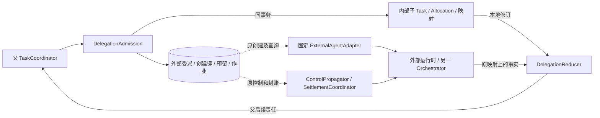
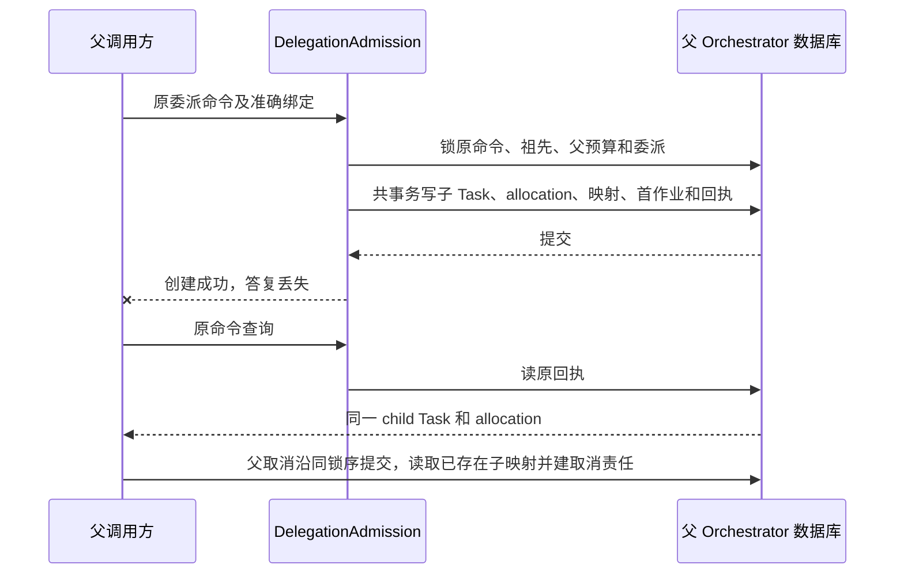

# Agent 协作与任务委派

协作模块把父任务的一项有界目标交给 Agent，保存唯一子任务映射，并将进展、结果、控制落实、未知效果和费用交回父 Orchestrator；父任务独立判断自己的条件是否满足。

内部 Agent 与父任务共用 Orchestrator 的任务生命周期；另一 Orchestrator 管理的 Harness Agent 和独立运行时都按外部委派处理。预算权威归 [Orchestrator](orchestrator.md)，实际效果归 [Execution](execution.md)，权限收缩归 [授权](authorization.md)。字段以 [协议 Schema](contracts/schemas/protocol.schema.json) 为准，实现与验证记录统一见 [review.md](review.md)。

## 组件与依赖

协作组件装配在父任务固定 Orchestrator 内，内部子任务复用 TaskCoordinator 和原任务循环。外部适配器只映射已登记版本的原生协议，不直接写父任务成功或扩张许可。

| 组件 | 负责的决定 | 依赖与恢复入口 |
| --- | --- | --- |
| DelegationAdmission | 父当前状态、准确 Agent 绑定、有界祖先链、权限和预算 | Agent 目录、授权、TaskCoordinator |
| InternalChildFactory | 同事务创建子 Task、allocation、双向映射和首次工作 | 父 Orchestrator 的任务/预算仓储 |
| ExternalAgentAdapter | 固定创建键、原任务查询、准确协议映射 | 原 provider/endpoint、安装时固定适配器 |
| DelegationReducer | 单调进展、成果、未决效果及事实冲突 | 既有子任务修订或受信远端证据 |
| ControlPropagator | 原控制和输入转交、逐入口落实 | 祖先控制、既有子任务/远端任务 |
| SettlementCoordinator | 原 allocation 的封账与后续更正关联 | 原接收方关闭证明及预算账本 |
| Collaboration Store | 委派、映射、修订、控制、关闭依据和作业 | 所属本地事务范围 |

下图按任务权威区分内部与外部路径；实线是本地用例或远端调用，虚线表示已持久保存的后续核对责任。

目录、内容和授权依据在事务外取得，事务内核验绑定与当前本地事实。外部网络等待不占父事务。协作用例及后台处理复用 [可靠工作框架](reliability.md)，内部创建不经过 RPC 形成第二提交点。

## 数据模型与状态投影

Delegation 固定父任务、准确目标/材料、Agent 版本、约束、期限、权限及 allocation；目标变化建立新委派前先处理原责任。子任务映射、效果和费用分别有事实来源，`phase` 是只读投影。

| 记录 | 键与固定关系 | 用途 |
| --- | --- | --- |
| `agent_descriptors`、`agent_bindings` | 精确版本/摘要、目标和结果 Schema、控制能力、权限/费用上限、adapter/endpoint | 受信配置，不接受模型改写 |
| `delegations` | 原 delegation ID、父 Task、revision、allocation | 保存交接事实，不另存可写 phase |
| `internal_child_links` | delegation ↔ child Task 双向唯一 | 同 Orchestrator 原子创建 |
| `external_task_links` | delegation、endpoint、creation key、remote Task | 创建键唯一，已知远端映射不可替换 |
| `incoming_delegations` | 认证 sender Orchestrator、parent delegation、原命令、child Task | 接收方幂等创建，与 incoming allocation 共事务 |
| `delegation_progress` | 原来源 revision、摘要、结果、effects pending、费用修订 | 同修订唯一；异内容是冲突 |
| `delegation_controls`、`delegated_inputs` | 原控制或远端请求/修订、固定转交命令、逐端事实 | 本地接纳和远端落实分别保存 |
| 原 receiver 对账 outbox、父结算 intent | allocation/usage revision、准确累计关闭摘要与命令尝试 | 引用预算权威账本，不复制费用权威 |
| `delegation_closures` | 原映射或不可接纳证明、目标封闭、效果核清和已结算依据 | 持久关闭决定及最小防复用关联 |

所有记录绑定认证 tenant；跨端额外绑定可信 sender 和原 endpoint/instance。父子 Task.status 各归自己的 Orchestrator，协作只归并获准事实。

### phase 的唯一计算规则

查询从同一 Delegation revision 已归并的本地事实按下表顺序取第一项。改变投影的事实与 Delegation revision、后续工作共同提交；查询本身不调用远端或增加修订。

| 优先级 | 已持久的事实 | phase |
| --- | --- | --- |
| 1 | 已提交满足关闭条件的 DelegationClosure | closed |
| 2 | 存在下列具体恢复或收尾缺口 | reconciling |
| 3 | 无上述缺口，已固定唯一内部或外部子映射 | active |
| 4 | 原创建仍在发送前准备 | preparing |

恢复或收尾缺口包括：创建已发或可能发送而接纳未知；原任务读取失败、同修订冲突、effects pending；控制未落实或已转交输入未确认消费；父/子已终结、委派取消、目标工作已封闭、创建确认永不接纳、接收方已关闭新消费中任一成立而 Closure 尚未提交。

普通非最终用量、例行查询、已确认暂停和尚未作答请求不单独构成缺口。当前墙钟和作业领取/退避不直接参与投影；到期先提交相应事实。恢复核清一次查询失败，即使 remote revision 未变，也可保存缺口消除并推进 Delegation revision；不能重复应用进展或费用。

closed 保留其原目标及当时已知责任关闭事实，后续可信费用更正独立追账并展示当前缺口，不倒退目标 phase。详细依据清理后返回 gone；存储不可读返回不可用，不从空记录重建 preparing。原接纳命令回执保持当时固定快照，不按当前 phase 重算。

## 关键时序

### 内部子任务原子创建

内部委派把父预留、唯一子 Task、委派映射和首次工作放入同一个短事务，父取消与创建沿相同祖先锁序裁决。

1. 优先查询原命令及最小去重记录；已决定命令返回原结果，不按父任务后来状态重算。
2. 取得准确目标、输入和已安装 Agent 配置，核验来源/权限及有限父链。
3. 按原命令 → 根到叶祖先 → 父预算 → 委派/子业务记录 → 作业记录顺序锁定。
4. 检查父仍可新增目标工作、期限、真实祖先无环及有限深度/活跃子数/用户任务数；模型提供祖先列表不作依据。
5. 子能力范围取父当前许可与 Agent 声明交集；子策略只允许有可信单次费用上界的计费能力，后续每次子行动仍核实际绑定。
6. 用同一事务句柄预留 allocation，创建子 Task、受限配置、唯一双向映射、子首次作业及原 applied 回执，共同提交。

下图表示原子创建和取消的可见顺序；连线为同事务写入或随后读取。

取消先提交则创建拒绝、不产生预留；创建先提交则取消必能发现子映射。任一参与仓储失败整体回滚，不单独重试子创建再次扣父预算。父直接读取同库子修订归并，无需子通过网络回传已经在本地的事实；远端 Brain 停机不影响读取已提交事实。

### 外部创建与另一 Orchestrator 接收

外部委派的 applied 只表示父侧固定请求、allocation、creation key 和发送责任已保存；唯一 remote Task 映射确认后才表示远端接纳。适配器在可能发送前持久登记边界，未知时只查原键。

| 外部交接步骤 | 所属事务与原身份 |
| --- | --- |
| 父侧接纳 | 固定受信 provider/endpoint、精确输入、权限、期限、上限、creation key 和后续作业 |
| 远端创建 | 使用原创建键，远端提供原键查询或可证明的同键幂等创建 |
| 答复或查询取得原任务 | 锁原 delegation，核原绑定/创建键，只接受唯一相同 remote Task |
| 继续观察 | 保存来源修订、准确结果、用量和未知效果，建立后续核对责任 |
| 原创建证实从未且永不会接纳 | 保存证明，才可关闭创建责任并进入原预算封账 |

暂时 not_found 不能证明不会迟到接纳。没有原键查询或可靠创建幂等能力的 provider 只能作为明确有界咨询能力，不接收有副作用委派；缺可信最大费用不接纳当前固定 allocation 计费委派。估算费用的父直接调用条件归 [授权](authorization.md#在线使用结算与迟到账单)，子任务不能从父 policy ref 推断本人接受估算。

另一 Harness Orchestrator 通过 task.submit 的 delegation context 接收，sender Orchestrator 必须等于认证 sender service。接收方先核原 allocation 命令回执及 `budget.read(role=owner)` 当前可消费分配，子预算精确等于分配上限、期限不更晚；同事务建立 incoming delegation、incoming allocation、唯一子 Task 和首次作业。

分配不可达、gone、已封账、接收方不符或预留未证明时不创建可消费子。父取消另向原接收方发送 budget.close：关闭与子创建竞争同一事务记录，关闭先提交永久拒绝迟到创建，创建先提交则封闭既有子新增消费。未知分配先保存最小禁止索引并核原父记录；没有 child ID 不能证明没有迟到创建。预算关闭、费用结算的完整规则归 [Orchestrator](orchestrator.md)。

### 单调进展与父任务采用

DelegationReducer 依据原提供方修订和固定远端映射归并事实，父任务只将获准子结果作为证据输入。

| 观察 | 归并规则 |
| --- | --- |
| 同 revision、同摘要 | 不重复进展、计费或无理由唤醒 |
| 同 revision、异内容 | 保存协议冲突，停止依赖该结果的目标推进 |
| 旧 revision | 不覆盖新状态，保留诊断关联 |
| 另一个 remote Task ID | 拒绝替换，继续查原任务 |
| 只有自然语言“完成” | 保存候选正文，不补译为效果已确认或已封账 |
| 子终态但存在未知写入 | 成果可以预览，effects pending 保留，阻止父成功 |
| 原读取失败后同 revision 查询成功 | 核清查询缺口并提交新 Delegation revision，不重复费用 |

原生接口没有单调修订时，适配器可保存回执摘要和受信观察序号，但不能由本地序号制造远端没有提供的终态语义。成果需准确版本、当前来源/披露许可和固定 result Schema；完整证据还应能连接父条件、子目标/输入、配置、创建键、结果范围、未决效果、控制和累计费用。原协议表达不了的事实保留 gap。

### 控制、输入与接管

父控制限制子任务新增目标工作，但不覆盖子自身控制意图。内部子在准入时读取真实祖先链；父暂停向已远端接纳的子操作传播新 TaskGate，父恢复只移除父造成的限制，不清子暂停。

| 控制场景 | 提交与后续 |
| --- | --- |
| 父取消，内部子已创建 | 父终态与子树取消责任共同保存，子再保存自己的实际取消 |
| 父取消，外部创建未知 | 停新目标，保留原创建查询；查出原任务后继续取消及封账 |
| 外部不支持暂停 | 明确外部仍可能运行，不报告全树暂停 |
| 已开始不可撤回动作 | 关闭后续发送，保留原效果核对 |
| 父已取消，子迟到成功 | 只收获准元数据、费用和效果，不启动综合或新保存任务 |
| 新控制取代未发送控制 | 新控制先提交再结束旧未发送工作；旧命令若可能发送仍查原结果 |

同远端缺少控制修订单调能力时，pause/resume 串行交接并确认，不能乱序并发。已知父终态不生成 resume。立即接管要求只能选择实际具备对应控制的 Agent；有限停止窗口写入准确适配声明，失联不延长期限或额度。暂停期间已有证据足以完成任务时，依 [任务完成规则](verification.md) 裁决，不冻结全部事实变化。

外部澄清保存原请求 ID/revision、准确答案、目标及允许输入类型。`collaboration.submit_input` 固定转交命令，区分本地接纳、发送和远端消费；丢答复查原请求/命令，两答案由远端一次消费裁决。权限补充走受信确认，仍受父范围约束；确需扩大父权限先变更父任务。取消后新输入请求不唤醒目标行动，原消费回执与收尾材料仍可按最小管理用途取得。

### 关闭委派与后续费用更正

DelegationClosure 仅在子目标、效果、控制/输入及原 allocation 全部满足关闭条件时提交；子成功或父取消都不足以关闭委派。

| 必须核实的关闭条件 | 依据 |
| --- | --- |
| 不会再开始子目标工作，或原创建永不接纳 | 原任务/创建封闭证明 |
| 全部内部子已终结，外部具有相应封闭保证 | 既有子任务或适配器当前事实 |
| 委派及受管后代无未知或可能迟到效果 | Execution 或可信外部效果证据 |
| 接收方已封闭新消费，当时可信账单完整，budget.settle 已应用 | 原 receiver 关闭证明及 allocation 结算 |
| 无仍可能触发目标行动的控制/输入转交 | 原控制落实和请求消费结果 |

关闭事务锁原 delegation 和 allocation，核固定映射或从未接纳证明，保存不可变 Closure 及证据引用、推进 revision，之后只继续必要清理、披露和审计。完整正文可清理，原 delegation/creation key/remote Task 的最小防复用关联继续保留。

协作只引用 allocation 作为唯一委派计费来源，累计费用的差额、超额及继任结算命令算法集中于 [Orchestrator](orchestrator.md)。适配器必须提供真实累计账单，不截断到分配上限；提供方单次上界违约和接收方总分配违规分别判断，可同时成立，缺证据的归因保持待查。

Closure 后原调用出现可信费用上调，接收方在预算账本共同保存更高累计关闭证明和对账 outbox；父保存对应结算 intent，再按原 allocation 核账。协作持续接收这些账务事实并显示缺口，不能因 phase closed 丢弃责任、重开目标或再次释放余额。退款和贷记进入独立对账，不降低累计量伪装更正。

## 恢复与失败处理

恢复者同时扫描未有 Closure 的委派，以及已 closed 委派关联的未交付对账 outbox、未结 intent 和作业。工作由原创建、控制、效果、输入及费用事实决定，不以 phase 分配业务动作。

| 缺口或故障 | 本轮行为 | 耗尽后保留的责任 |
| --- | --- | --- |
| 外部创建答复丢失 | 查询原键，或仅按已验证同键幂等契约重投 | 接纳 unknown、原预留、原创建映射 |
| 外部创建未知时父取消 | 核原键，找到原任务后取消 | 原控制及费用不能清零 |
| 原任务/适配器不可达 | 有限退避、每轮最多一次外部请求 | agent unavailable、下次恢复条件、control pending |
| 同修订冲突 | 保存原证据并停止依赖结果 | 适配器诊断和原任务核对 |
| 子效果未知 | 原凭据查询或获准独立核验 | effects pending，父不能成功 |
| 最终费用缺失 | 查询原账单和 receiver 关闭 | 原 allocation 未结，不因超时释放 |
| 输入消费未知 | 查询原请求和固定转交命令 | 不产生另一份答案 |
| 适配器升级不兼容旧责任 | 停新接纳，保留原版本/编码/创建键 | 没有安全核对器时明确恢复缺口 |
| 旧 worker 失效后收到真实答复 | 禁旧领取写映射；经独立认证事实入口归并 | 原唯一任务和有效接替作业 |
| 旧封账批次期间更高费用到达 | 新账务事实和工作版本共提交 | 旧完成/退避不抹除新责任 |
| 旧备份缺创建/关闭记录 | 禁止重新执行副作用委派 | 补当前控制及最小终结记录 |
| 外部永久丢账本 | 父可失败/取消并交付获准材料 | 外部效果和费用 unknown 仍真实可见 |

稳定作业键绑定原 delegation 的创建/观察、原控制或远端输入、原 allocation 的结算。创建作业只在唯一映射及后续观察共同保存后结束；控制/输入只在真实应用/消费回执保存后结束。公共领取和工作版本规则归 [reliability.md](reliability.md)。

每个自动创建/查询配置总次数、绝对期限和退避上限，耗尽后等待提供方恢复或受信处置，不无限循环。reconcile 只唤醒原映射查询；恢复事件不重置次数、期限或额度。用户可查原委派、继续原核对、取消或提交真实证据，不能以“当作没做过”删除未知责任并重建。

## 保证与限制

内部协作提供同事务唯一子创建，外部协作提供固定原映射上的可恢复交接；两者都保持父完成裁决和原费用/效果事实独立。

| 保证 | 前提与限制 |
| --- | --- |
| 内部父子创建与预留原子 | 同一 Orchestrator、本地事务与固定祖先锁序；远端 Brain/Executor 不改变 Task 权威 |
| 外部不因超时创建替身 | provider 支持原键查询或可靠同键幂等；暂时 not_found 不足以释放原创建 |
| 子权限不扩大 | 子配置是父许可和 Agent 上限交集，实际行动仍逐次准入；普通输入与子结果不赋权 |
| 委派固定费用上限 | 每个计费能力具有可信 strict 上界，接收方遵守 allocation；违约真实费用仍全部入账并停新计费 |
| 父控制传播 | 内部查祖先，外部按适配器实际能力与有限窗口；本地 applied 不表示全树 enforced |
| phase 稳定可解释 | 同一已归并修订同一投影；active 不证明正在运行，closed 不免除迟到费用更正 |
| 子结果可用于父证据 | 绑定准确版本、来源与证据范围；优质答案不抵消未知副作用或父必要条件 |
| 最小记录防复用 | 原映射、终结和未结计费关联持续保留；正文过期后可返回 gone |
| 公平恢复 | 深度、活跃子数、provider 并发和每用户任务数均有限，控制/查询/结算保留份额 |

缺原恢复、权限收缩、严格费用上界或所需控制能力时，关闭依赖该能力的委派；咨询输出也受来源和披露许可限制。具体适配能力与证据范围见 [review.md](review.md)。

## 取舍与运行约束

协作默认把内部任务留在一个提交域，只在独立运行时、信任或运维边界需要时付出远端交接成本。增加 Agent 数量必须由同总预算的任务效果和成本证明。

| 选择 | 代价 | 改选条件 |
| --- | --- | --- |
| 内部父子同 Orchestrator | 热父预算及祖先锁限制同树吞吐 | 独立信任/运维确有需求时采用外部契约 |
| 外部创建键和映射不可替换 | 网络分区时长期保留未知责任及预留 | 无法提供原任务恢复的 provider 只作有界咨询 |
| 只读 phase，持久 Closure | 查询需关联原事实，不能只读单列状态 | 仅在投影成本实测突出时缓存可重建投影，权威仍不改变 |
| 委派仅 strict 固定分配 | 无可信上界的计费模型不能委派 | 要支持其他成本模式，先设计并批准新的分配与封账契约 |
| 有限独立分支并行 | 重复上下文、子创建、父汇总和核验增加成本 | 单 Agent/并行/强依赖场景同预算比较证明净收益后再扩大 |

部署按 [deployment.md](deployment.md) 分 provider/tenant 限并发、退避和内容量；网络等待不持父锁。度量内部创建延迟、祖先/预算锁等待、外部创建 unknown 年龄、控制 pending、未结 allocation、协议冲突和结果字节；父等待子目标、未知效果及最终费用分别计时。验收见 [故障实验](validation/fault-experiments.md)，效果对照见 [evaluation.md](evaluation.md)。
