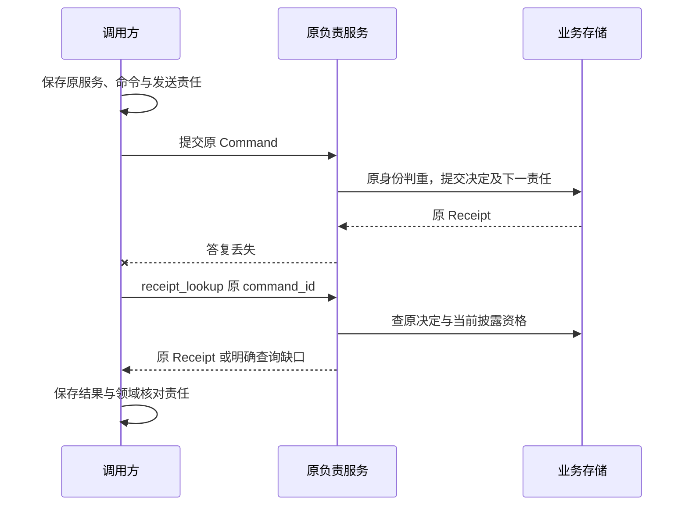

# 共同调用契约

共同契约让调用方在连接中断、重复发送和进程替换后，仍能查到原业务决定并继续原责任。各模块定义业务成功点，本页统一定义命令身份、回执、查询、错误和保留规则；同进程、WSS 与 gRPC 使用相同语义。

领域术语以 [CONTEXT.md](../../../CONTEXT.md) 为准；字段和方法以 [schemas/](schemas/) 为准；实现、发布与验证状态见 [review.md](../review.md)。

## 组件与依赖

调用方在发送前保存原命令和负责服务，接收方在本地事务中保存决定或处理责任，后台工作者沿原身份恢复。[可靠工作框架](../reliability.md)提供参考实现，不增加另一位业务裁决者。

| 规范位置 | 唯一负责的内容 |
| --- | --- |
| 本页 | 命令身份、幂等、回执阶段、错误、长期保留和版本解释 |
| [协议结构与集合恢复](protocol.md) | 编码规则、机器资产组合、有界列表与提示合并 |
| [方法索引](methods.md) | 从方法定位输入输出、目标和所属领域 |
| [WSS 传输](transport.md) | 发现、认证引导、帧、设备交付、上传和镜像 |
| [gRPC 绑定](grpc.md) | 服务身份、Protobuf 外壳、内部流重绑和连接分配 |
| 所属模块 | 业务状态、成功边界、外部效果和恢复责任 |

同进程通过 Go interface 传递领域对象，需要共同提交的步骤使用明确事务句柄；端云使用 WSS；独立 Harness 服务使用 gRPC；发现、认证及大内容原始字节使用 HTTPS。具体绑定不能改变 `applied` 的领域含义，也不能将传输取消解释成持久业务取消。

## 数据模型与状态

Command 是要求原负责服务裁决一次改变的请求身份，Query 是当前读取。连接、发送尝试和后台作业均不替代 Command。

| 对象 | 理解行为所需的字段 | 作用 |
| --- | --- | --- |
| Command | `command_id, method, target_id, expires_at, expected_revision?, payload` | `expires_at` 限制首次接纳；`expected_revision` 仅用于登记的条件更新方法 |
| Receipt | `command_id, stage, output?, error?, accepted_at?, decided_at?` | 表示原命令处理到哪一阶段，最终决定固定 |
| Query / QueryResult | `method, target_id, payload` / `output, observed_at, resource_revision?, cursor?, gaps?` | 返回原 owner 当前获准披露的事实与缺口 |
| Error | `code, retry, related_id?, current_revision?, retry_after_ms?` | 机器按代码和恢复动作处理，`message` 只供人阅读 |
| Change | `cursor, object_type, object_id, revision` | 提醒重新查询，不携带许可、效果或已消费证明 |

### 命令的唯一身份

接收方使用幂等键（idempotency key）`(tenant_id, logical_service_id, command_id)`，并保存 `method、target_id、expected_revision、expires_at、payload` 的规范化摘要。相同键与相同请求返回原决定；相同键与不同请求返回 `idempotency_conflict`，保留原记录。

规范化比较忽略对象键顺序，保留数组顺序，逐字比较字符串；传输摘要的规范编码见 [WSS 证明](transport.md#proofs)。SDK 在恢复时保留原请求结构，不补新默认值、不换预期修订、不升级解释版本。租户来自认证上下文，正文引用中的租户只能用于核对。

幂等范围包含逻辑服务。调用方须在首次发送前保存受信发现选定的原服务与完整命令；未知结果只向该服务查询或重投。映射变更、网关重连和进程替换均不允许把同一命令改投另一逻辑服务。[路由契约](transport.md#discovery)规定新任务选址与原任务恢复。

### 回执的三种阶段

接收方只返回方法登记允许的阶段；`applied` 的具体成功点由所属方法定义。

| 阶段 | 保存了什么 | 调用方下一步 |
| --- | --- | --- |
| `accepted` | 原请求和处理责任；尚无最终业务决定 | 查询原命令 |
| `applied` | 该方法的业务决定和后续责任 | 查询相应 Task、Operation、Activation 或其他对象 |
| `rejected` | 最终拒绝，原命令不再启动目标行为 | 按错误修正前提；参数变化使用新命令 |

例如 `task.submit` 创建任务，`execution.invoke` 保存原操作和执行责任，`task.cancel` 保存取消决定；这些方法的 `applied` 均不推导外部效果已经结束。具体对象状态另按领域状态机表达。

只登记 `applied/rejected` 的方法也可先持久保存内部准备责任，例如跨库 `memory.create` 和制品 `extensions.prepare`。重投或回执查询关联原准备，有限等待最终决定；本次请求超时不制造 `accepted` 或业务 `rejected`，后台继续原责任，不能返回“原命令从未存在”的 `not_found`。

### 接纳截止、条件更新与披露

接收方先查询原身份，再判断是否准许首次接纳。没有原记录且已过 `expires_at` 时拒绝；已有原责任在到期后继续处理和查询，实际执行期限由领域对象定义。

`expected_revision` 冲突使原命令被拒绝。调用方读取当前对象后重新决定，不直接改预期修订盲重投。数据库重试只能重做本地事务判断；网络、模型和工具动作在事务外执行。

当前披露检查适用于原回执查询和缓存重传。Receipt 可保持原阶段和时间、设置 `redacted=true` 并省略整个 `output`；不能任意裁掉部分字段后绕过结构和身份检查，也不能因撤权改写原业务决定。

## 关键时序

下图从发送方观察一次提交后失答复的恢复过程，箭头表示请求、持久提交和原回执查询；外部效果另由所属领域核对。

调用方收到 `accepted` 后继续查原命令；收到 `applied` 后转入方法规定的对象查询。查询失败只改变当前知识，不证明原业务未发生。

## 保留与清理

接收方先清理可过期正文，再保留足以拒绝旧身份重用的最小索引。完整回执至少保留至命令截止、全部责任结清，并满足部署声明的查询保留期；未知效果、费用、传播和清理责任保留继续处理所需的获准事实。

命令去重与终态记录长期保存租户、原服务、对象身份、原请求摘要和决定类别，不保存原始参数、凭据、正文或完整成果。清理完整回执后，同输入重投或查询返回 `gone`，异输入返回 `idempotency_conflict`，均不再调用业务处理器；只有没有记录时才可在当前有权范围返回 `not_found`。`gone` 是查询或传输错误，不能把历史 `applied` 重写为新的 `rejected`。

取消墓碑（tombstone）拒绝迟到操作，任务终态索引拒绝任务重启。只有任务终态记录仍永久覆盖原操作时，才合并操作索引；固定 TTL 不得删除最后一份拒绝依据。容量与备份必须计入这些索引，空间不足时关闭新接纳，保留旧责任。

## 失败处理

错误的 `retry` 是有限恢复建议，不扩大领域重试资格；超时、5xx 和断线均不能生成业务拒绝或证明未发生效果。

| code | 调用方动作 |
| --- | --- |
| `invalid_argument` | 修正输入，以新命令提交 |
| `unsupported` | 选择兼容实现或停止对应能力 |
| `unauthenticated / forbidden` | 恢复当前身份或用途权限 |
| `confirmation_required` | 走原业务 owner 的可信确认流程 |
| `revision_conflict` | 读取当前对象，重新决定 |
| `idempotency_conflict` | 查原记录并修正调用者，不能覆盖原身份 |
| `expired` | 先查原请求；新资格仅用于明确的新动作 |
| `not_found` | 核对查询范围和原责任，不据此认定外部效果未发生 |
| `gone` | 显示恢复缺口，禁止自动重做无幂等保证的动作 |
| `quota_exceeded / overloaded` | 有界等待、调整额度或计划；保留已接纳责任 |
| `dependency_unavailable` | 保存原标识与等待条件，有限退避 |
| `effect_unknown` | 查询原操作或请求受信处置 |
| `precondition_failed` | 读取关联对象，按领域规则继续 |
| `internal_error` | 可能提交时先查原命令 |

领域错误必须登记在同版 [methods.json](schemas/methods.json)。客户端不认识错误码时保留缺口并查询原记录，不自行解释为可以重做。

## 保证与限制

共同契约保证的是原身份下决定可追溯、重复传送不产生另一项同义业务，以及清理后旧身份不重新可用；前提是本地原子提交、固定负责服务、保留索引和当前身份检查成立。它不提供跨逻辑服务去重，也不把消息投递、回执提交、许可使用或外部效果合并成 exactly-once 保证。

连接成功、推送完成和 ReplyAck 均不证明用户已看到内容、输入已消费或工具效果发生。字段校验只证明给定数据一致；认证、事务持久化、目标真值和恢复须按 [验证要求](../validation/README.md)取得证据，状态统一见 [review.md](../review.md)。

协议主版本不兼容时拒绝；同主版本演进只允许已协商的兼容可选字段。未知方法、枚举或影响权限与成功含义的字段必须拒绝。发布集合同时固定正文、Schema、方法登记、递归引用和摘要；字段与业务含义冲突时整组契约不能发布，不能由实现挑宽松一方。

## 取舍

| 选择 | 代价 | 改选条件 |
| --- | --- | --- |
| 原命令查询与状态修订作为恢复依据 | 调用方须耐久保存原服务和请求，接收方须保留索引 | 出现可证明更强恢复语义且成本合适的日志协议时再评估 |
| 长期最小去重和终态记录 | 权威账本与备份持续增长 | 明确要求删除全部身份时，先设计可验证代际或不可延长接纳期限 |
| 同业务语义、多种传输绑定 | 每种绑定均需一致性验证 | 不因接口统一而强制进程内网络化 |
