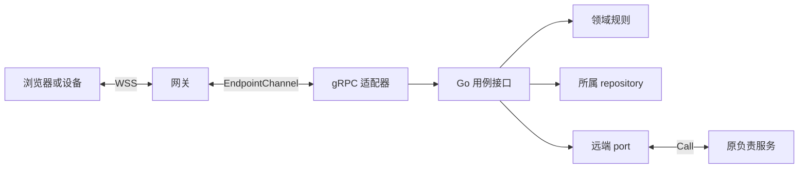
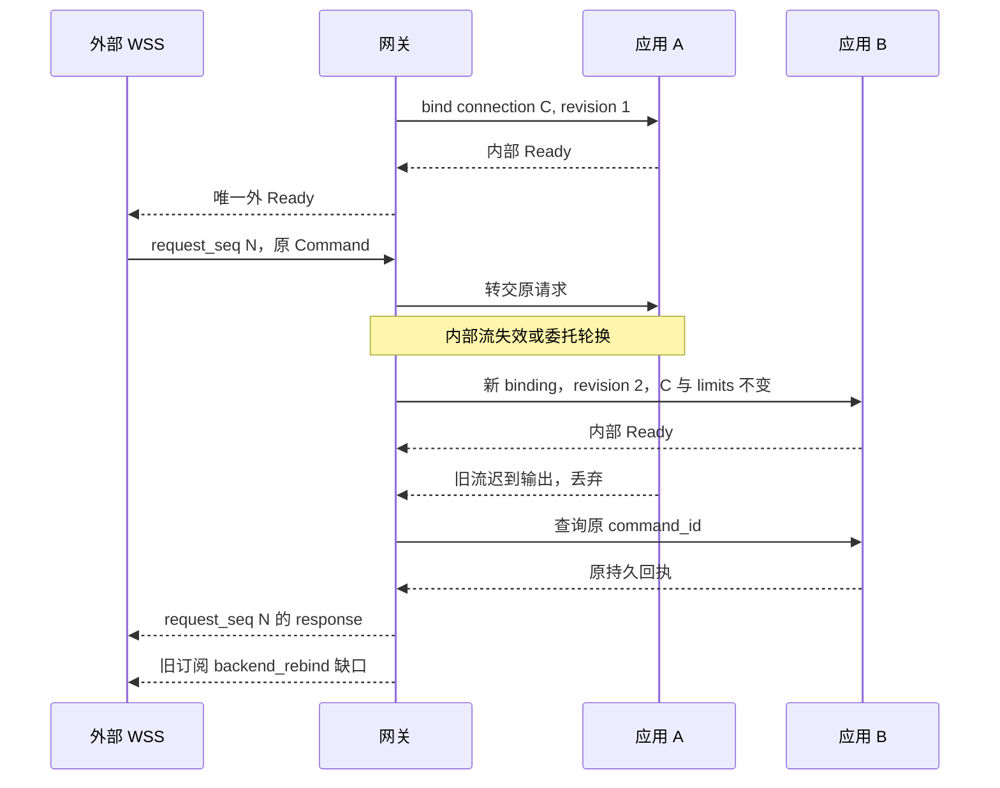

# 服务间 gRPC 绑定

Harness 独立服务使用 gRPC over HTTP/2 + TLS，`Call` 处理有限请求，`EndpointChannel` 转交已认证端云连接。领域规则继续使用 Go 用例接口和 [共同调用契约](README.md)，RPC 适配器承担有界解码、认证与分派。

本页定义 `harness-grpc-draft-1`；外壳字段归 [harness.proto](harness.proto)，内层对象归 [schemas/](schemas/)，实现与验证状态见 [review.md](../review.md)。模型供应商、工具、数据库和对象存储保持自身协议。

## 组件与依赖

调用者以 port 指向原逻辑服务，解析器只选择这个服务的健康副本。网关持有外连接，负责服务持有领域事实；更换应用副本不迁移 Orchestrator 或业务 owner。

下图表示适配和代码依赖，箭头指向被调用接口；框不等同于独立部署进程。

| RPC | 输入与输出 | 生命周期 |
| --- | --- | --- |
| HarnessService.Call | CallRequest → CallResponse | 命令、查询、原回执查询、上传/镜像管理；长期工作交原 job |
| HarnessService.EndpointChannel | 双向 ChannelFrame | 每条外 WSS 一个当前流，最多一个候选重绑流 |

## 数据模型与编码

Protobuf 只定义 RPC 外壳，bytes 携带严格 UTF-8 JSON；内层继续复用领域 Schema 和方法登记，不维护第二套领域字段权威。外层、JSON 结构和方法关联依次核验。

| Protobuf 分支 | 内层及关联 |
| --- | --- |
| CallRequest.logical_service_id | 准确原服务，服务端核对自身及凭据受众；不是任意转发 URL |
| command_json / query_json | 完整 Command/Query，method 种类与输入定义相符 |
| receipt_lookup_json | 原 command_id，查询原服务与当前租户 |
| upload_reserve_json / upload_lookup_json | UploadIntent / 原 upload_id |
| mirror_reserve_json / mirror_lookup_json / mirror_control_json | MirrorTicket / ticket_id / MirrorControl |
| receipt_json | 只回答 command 或 lookup，command_id 与原请求相同 |
| query_result_json | 只回答 query，output 由原 method 定义 |
| upload_json / mirror_json | 回答同名管理请求，准确对象、引用和输入绑定相同 |
| error_json | Error 本体，不生成业务 rejected |
| ChannelFrame.frame_json / binding_id | 完整 Frame、当前流绑定身份；frame.connection_id 与外连接相同 |

请求和响应须恰有一个非空 oneof 分支，ChannelFrame 两字段都必需。适配器在普通 Protobuf 解码前按冻结描述符扫描未知字段、重复单值字段和多个 oneof 分支并拒绝；handler 只见解码后对象时已无法识别被覆盖字段，因此需要受控 codec 或前置扫描。

外层大小限制为有效 max_frame_bytes 加 8 KiB 封装余量，默认 1 MiB + 8 KiB；logical_service_id 最多 4 KiB；内部 Command/Query 为 256 KiB，其余帧与输出按连接帧上限，另限深度和集合数。空 bytes 不是合法 JSON。JSON 严格解码后再做 Schema 和方法关联；不经通用浮点 Struct 转换修订号。

业务请求摘要和证明对原 JSON 使用 [JCS](transport.md#proofs)，不对 Protobuf 序列化字节计算。安装锁定清单固定 `.proto`、生成器、grpc-go、Protobuf runtime、Schema 和方法登记的版本与摘要。

## 身份与期限

每次 RPC 都以 mTLS 验证调用进程，并携带准确 rpc profile 与 auth mode；接收方从受信适配器构造 AuthContext，不从请求正文还原权限。

| 模式 / metadata | 凭据与当前核验 |
| --- | --- |
| `harness-rpc-profile` | 必须为 harness-grpc-draft-1 |
| `harness-auth-mode: service` | Bearer 服务令牌绑定 mTLS 调用服务与目标逻辑服务；装配限定它能代表的业务 sender |
| `harness-auth-mode: delegated` | Bearer 委托句柄，仅受信接入服务可提交；恢复原会话/端点及原业务 sender（如有） |

拒绝缺失、重复或未知身份头。Call 目标来自 logical_service_id，Channel 来自 harness-logical-service-id，两者核对接收服务和凭据受众。网关 mTLS 身份只证明中转，不能覆盖原 actor 或填作 sender_service_id；直接用户/端点没有业务 sender 时保持缺省。

IdentityAdapter 核验原 WSS 会话或端点凭据后签发至少 256 位随机委托句柄，记录调用接入服务、准确受众、tenant、原主体、原会话/凭据引用、到期和适用的 sender、人类会话或设备实例/凭据代次。actor_kind 与人类确认资格由权威记录填入，不能由接入调用者自报。有效期不超过原凭据期限和 30 分钟，句柄不进业务表或通用日志，也不透传浏览器 Cookie。

负责服务逐条消息核验委托及原资格；核验不可用时拒绝新工作和披露。原会话撤销或凭据代次变化立即使后续使用失败；只有内部委托将到期时，网关才凭仍有效原资格重新签发并重绑。没有签发与核验适配器就关闭代理入口，不降为网关管理员身份。

Call 设置有限 deadline，向下游传剩余时间；同地域接纳/查询参考上限 5 秒。数据库事务不跨网络等待，RPC/context 取消只结束本次等待，持久业务控制仍用原领域命令。时钟、租约和窗口统一使用 [ClockAdapter](../deployment.md)，暂停或时间回拨不延长旧资格。

EndpointChannel 正常最长 30 分钟，受更早的内部委托及原身份期限限制；候选 Ready 等待有独立短计时器，不能误作整条流的短 RPC deadline。单次请求期限、内部恢复窗口和外连接序号分别保存，轮换不重置它们。

## 内部绑定与重建

网关重建内部流时保持原外 connection_id、limits、序号高水位及在途关联，只替换 binding_id 和递增 binding_revision。当前绑定输出才可转交外部，旧流隔离不表示它未曾提交业务。

| Channel metadata | 规则 |
| --- | --- |
| harness-logical-service-id | 原准确服务 |
| harness-connection-id | 网关创建的外 WSS 身份，重绑不变 |
| harness-binding-id | 每个新 RPC 流/新应用 boot 的随机身份；同候选登记重试保持 |
| harness-binding-revision | 外 connection 内从 1 增长的安全正整数，无前导零十进制 |
| harness-limits-bin | 原有效 ConnectionLimits 的 JCS 字节，重绑完全相同 |
| harness-limits-digest | 上述对象的 sha256: 小写摘要 |

身份和绑定 metadata 解码后最多 16 KiB，limits 最多 4 KiB；缺字段、重复、摘要错误或不能支持原限额时拒绝。内部 Ready 回显原服务、connection 和 limits，网关验证后才能设当前流；只有第一次内部 Ready 形成外 Ready。

负责服务对 connection_id 原子比较代次：高代可替换；同代只有 binding_id、服务、连接、limits 以及登记的网关/应用 boot 完全相同才属重试；同代异身份冲突、低代拒绝。登记未知时网关可重试原候选或创建更高代候选，迟到旧请求不得读取新值再改写自己的代次。外连接槽存活时即使进程租约失效，也保留最高代次，防止删除后低代重新插入。

候选通过登记和 Ready 后，网关原子替换当前流，并按流对象与 binding_id 共同过滤输出。关闭旧流或释放在线路由须条件匹配原网关 boot、应用 boot、binding_id 和 revision，不能迟到删除新绑定；权威记录布局归 [部署](../deployment.md)。

下图从网关观察应用副本替换；箭头表示当前流上的请求与恢复，旧输出明确丢弃，外 Ready 只有一次。

### 未决请求如何恢复

内部流失败后，网关对新普通请求直接返回 dependency_unavailable，不无界排队。已发请求从最初接收起最多等待 5 秒，重绑和查询共用剩余期限；超过时返回明确错误，不能因稍后找回回执改写本次调用统计。

| 原等待 | 重绑后动作 |
| --- | --- |
| command | 向原服务 receipt_lookup；查到则回原序号，未知返回 retry=query_original，不自动重发写命令 |
| query、receipt_lookup、upload_lookup、mirror_lookup | 剩余期限内有限重读，原输入与外序号不变 |
| upload_reserve、mirror_reserve、mirror_control | 查原对象、不可变输入和控制修订，能核对才确认；否则原管理身份继续 |
| 未确认 Reply | 重交原 Reply，原 owner 返回同 Ack；设备未得 Ack 仍保留回复 |
| subscribe 未答复 | 剩余期限内重建本次订阅，回原序号，隔离旧输出 |
| 已建订阅 | 给客户端认识的旧 subscription_id 发 backend_rebind，暂停旧提示，客户端无 cursor 重订阅 |

网关在内部故障期间继续外心跳，最多 60 秒建立可用绑定；更早原身份或网关进程租约失效则立即停止业务与披露。60 秒后关闭外连接。此窗口不适用于原身份撤销/过期；内部重绑不加外连接配额、不重置序号、不加原等待槽。网关退出时外 WSS 断开，客户端按 [端云恢复](transport.md)继续。

## 地址发现与连接分配

连接适配器将原逻辑服务映射到受信平台的实际后端集合，短 Call 与长流分开分配。每进程、每后端集合只维护一份发现 watch 和缓存；不能依赖一次 DNS 或默认 pick_first 偶然均衡。

平台适配器提供完整实例身份、IP/端口、就绪和排空状态。Kubernetes 装配读取并合并相关 EndpointSlice，按实例去重，只分配 ready 且非 terminating 的目标；其他平台提供等价接口。地址仍受 mTLS 服务身份和每次逻辑服务核验约束。

| 发现步骤 | 有界规则 |
| --- | --- |
| 完整 LIST + watch | 从 LIST 返回资源版本开始 watch；每次快照与 watch 有本地新代次，替换后丢旧输出 |
| 定期刷新 | 抖动间隔最长 20 秒重新 LIST，单次最多 5 秒 |
| 快照有效期 | 从本次 LIST 发起起最多 30 秒；旧 watch、TCP 或本地重试不续期 |
| 断流/版本失效 | 提前有限重列举；超过有效期不新拨号/新流 |
| 删除/排空目标 | 立即停止新分配；已有流按原租约和有界排空继续 |

默认用标准 resolver 推送健康地址，配置摘要随安装清单固定；没有健康地址时不改用任意 VIP。新快照有效期间调用仍受目标准入、连接状态和原 deadline 限制。

| 流量 | 连接与选址 | 满额与退出 |
| --- | --- | --- |
| 短 Call | 按后端集合、mTLS 配置和预算类别复用 ClientConn，显式 round_robin；控制/核对与普通工作分组和槽 | 调用前取有限槽；满额或无目标有界失败，不无限 wait-for-ready |
| EndpointChannel | 每实际后端使用有限专用 ClientConn 池，在健康未排空且有槽目标中选本进程活动流占比最低者，平局随机 | 服务端在登记前原子核全局流上限；候选也占槽，本地估计不代替全局限额 |
| 目标退出 | 先停新分配，在途调用有界排空，长流按原外连接建立新绑定 | 发现变化和新副本不会自动迁移已建流 |

ClientConn 是逻辑连接管理器，可能含多个底层连接；不能按每请求、租户或 WSS 各建一个。每池成员流槽 S、每后端成员数 K、每进程后端数 B 及总物理连接都有硬上限，预算至少包含 B×K、短 Call 组和旧新连接排空重叠；后端承接 C 条长流时正常容量满足 K×S≥C，候选另有有限保留槽。实际 HTTP/2 流数与多个 ClientConn 是否形成独立物理连接须测量，不能按句柄数推容量。

每轮最多顺序尝试 3 个不同健康后端，每候选 Ready 等待最多 2 秒且不超过剩余恢复窗口；只有一个目标时只试一次。失败后先取消候选、确认退出并释放槽，再有限抖动退避和后端冷却，不能并发竞速登记。每个新流用新 binding 和更高代次；轮间及全局建流速率/并发有界，总恢复不超过 60 秒。首次握手从接收起至首 Ready 最多 10 秒，覆盖认证、配额和初始内部绑定；失败条件释放原额度，不借重绑窗口延长握手。

网关在正常流到期前带抖动重签委托并建至多一个候选，Ready 后切换关闭旧流。正常轮换、排空或故障才迁移旧长流；新增副本改善新分配，不承诺即时均衡。内部轮换引发订阅重建，其权限、分页和快照成本须纳入 [容量规格](../deployment.md)，不能只计建流数。

## 失败处理

Call 传输结果与业务决定分别解释。应用关闭写 RPC 的配置重试和并发 hedging，服务端仍须应对库透明重试，按原 command_id 去重；查询只在总 deadline 内有限退避。

| 可观察结果 | 解释与恢复 |
| --- | --- |
| OK + Receipt | 按原阶段与领域成功点继续 |
| OK + Error | 按登记 code/retry 及原身份处理 |
| UNAUTHENTICATED / PERMISSION_DENIED | 入口不能建立当前身份或路由资格；先前可能发送的业务仍保留查询责任 |
| RESOURCE_EXHAUSTED / UNAVAILABLE | 有界容量或依赖故障；写命令先查询原记录 |
| DEADLINE_EXCEEDED / CANCELLED | 本次等待结束，可能已经提交；不推导持久取消 |
| 内部流结束 / GOAWAY | 受控重绑、查原命令、重交 Reply、订阅给明确缺口 |
| 当前身份无法核验 | 停新工作与披露，不使用缓存延长资格 |
| 发现超期或池满 | 停新拨号/分配；已有责任按原身份恢复 |

## 保证与限制

gRPC 绑定保留原逻辑服务、业务身份、主体、限额和命令解释；前提是 mTLS、委托权威、严格解码、绑定代次条件更新和本地持久事实成立。流轮换隔离旧输出，不能取消旧副本已提交动作；业务唯一键与实际执行门禁仍需独立生效。

Protobuf 外壳不提供逐方法二进制强类型、压缩收益或 exactly-once 执行。HTTP/2 flow control、keepalive 和流写入成功不替代应用队列、当前资格和 ReplyAck。.proto 编译及有限向量只验证结构和给定前提，不能证明实际发现、池分配、跨语言互操作、原子性或容量；证据状态见 [review.md](../review.md)。

## 取舍

| 选择 | 代价 | 改选条件 |
| --- | --- | --- |
| Protobuf 外壳 + 严格 JSON | 双层解码及运行时校验 | 测量表明编码成本主导时，另定完整字段映射与兼容 profile |
| 网关持外 WSS，内部有限重绑 | 绑定代次、候选槽、在途恢复和订阅重建成本 | 不持久化整个 socket 以模拟无感迁移 |
| 平台实际地址 + 客户端有限池 | watch、LIST、流槽和失败处理复杂度 | 可验收的 L7 gRPC 代理可替换，但须证明身份、新流分配、排空和单区余量；仅 L4 VIP 不够 |
| 短 Call 与长流分组 | 更多有限连接和预算配置 | 保留控制/核对余量，避免长流占满底层 HTTP/2 槽 |
