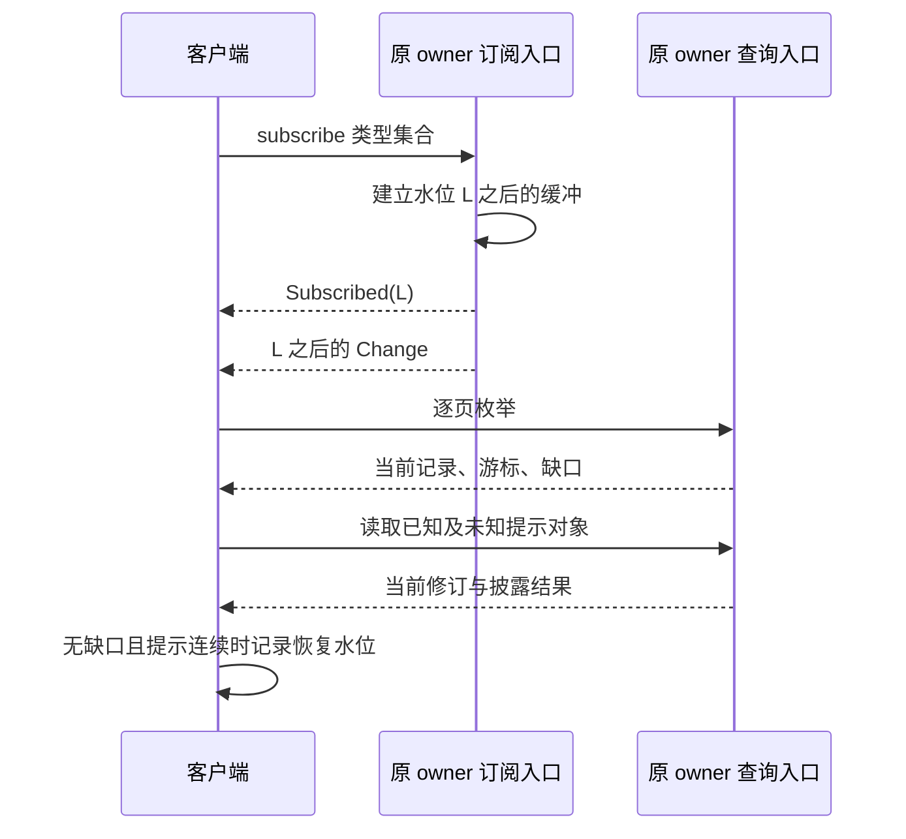

# 协议结构与集合恢复

协议结构把领域对象映射为可校验的消息，集合恢复把可丢提示与有界查询合并为可说明完整范围的客户端视图。共同命令语义见 [调用契约](README.md)，逐方法业务规则见 [方法索引](methods.md)；本页只定义编码和跨领域恢复规则。

配置标识取自机器资产：`harness/1` 与 `full-harness-draft-2`。版本发布、实现与验证状态统一见 [review.md](../review.md)。

## 资产与依赖

实现必须使用同版 Schema、方法登记和传输绑定。结构合法、方法关联成立、领域前提成立是三个依次执行的检查，不能互相替代。

| 资产 | 权威范围 |
| --- | --- |
| [protocol.schema.json](schemas/protocol.schema.json) | 共同对象、领域输入输出与序列容器 |
| [methods.json](schemas/methods.json) | 方法种类、目标、条件修订、输入输出、回执阶段及错误恢复 |
| [transport.schema.json](schemas/transport.schema.json) | Discovery、WSS 帧、交付、证明、上传与镜像 |
| [harness.proto](harness.proto) | gRPC Call 和 EndpointChannel 外壳 |
| [brain-generation.schema.json](schemas/brain-generation.schema.json) | 宿主内部正文构造和计划局部引用；最终 Proposal 仍过领域 Schema |
| [task-outcome.schema.json](schemas/task-outcome.schema.json) | 用于审查完成依据的独立投影，不替代完整协议 |
| [领域序列](examples/protocol/README.md)、[传输向量](examples/transport/README.md) | 有限记录之间的身份、修订、状态和恢复关系 |

每个服务可以声明方法子集，但须一并承担这些方法的查询和恢复义务。能力参数的开放结构只属于准确 Capability 版本、摘要及 Binding 对应的 Schema；能力 Schema 有界、封闭且所有引用固定，不允许校验时访问任意网络。

## 编码与方法映射

接收方先限制字节、嵌套深度和集合数量，再严格解码，执行 Schema 和方法关联，最后由领域 owner 核验当前资格和状态。

| 表达 | 规则 |
| --- | --- |
| 业务 ID | 小写类型前缀、下划线、32 位十六进制随机部分；不透明且不可复用 |
| ComponentRef | 准确版本与摘要共同绑定不可变制品 |
| ContentRef | 绑定租户、内容 owner、内容身份、版本、摘要、类型与字节长度 |
| ObjectRef / AuthorizationRef | 绑定 owner、对象身份与准确修订；授权引用另有 grant/use/offline_lease 种类 |
| 计数、修订、字节长度 | 非负安全整数，上限 `9007199254740991` |
| 金额 | 带单位的非负十进制字符串；不以浮点数比较额度 |
| 时间 | UTC `Z` 的 RFC 3339 字符串；跨端业务顺序以对象修订为准 |
| Command / Query | 逐方法检查种类、目标、输入及条件修订；payload 内相关目标须与 target_id 一致 |
| QueryResult | `resource_revision` 与输出修订一致；缺口显式表达 |

WSS 使用严格 JSON，gRPC 的 Protobuf bytes 承载同一对象。拒绝重复键、非法 Unicode、非有限数值和安全整数溢出；传输摘要与签名使用 [JCS 规则](transport.md#proofs)，不能先舍入再验签，也不能以 Protobuf 字节重定义业务摘要。

Receipt 的结构按阶段检查：`accepted` 有 `accepted_at`，没有决定时间与业务错误；`applied` 有 `decided_at` 和对应方法的输出；`rejected` 有 `decided_at` 和登记错误，没有输出。可用阶段由方法登记决定。原回执裁剪、过期和长期保留统一按 [共同契约](README.md)。

## 集合恢复

客户端对每个原 owner、每个获准类型分别建立集合与提示水位。单 owner 枚举不提供跨 owner 原子快照；跨 Orchestrator 的来源聚合由 [交互层](../interaction.md)负责。

### 类型与查询入口

订阅覆盖该主体在原逻辑服务中、所选类型下当前获准披露的完整集合。服务声明某类型前须同时提供其枚举与准确读取；不支持则在订阅时返回 `unsupported`。

| object_type | 完整集合的查询方式 | 单对象读取 | 保留的状态范围 |
| --- | --- | --- | --- |
| task | `task.list` 省略 statuses，读到末页 | `task.read` | 含终态，gaps 保留 |
| operation | `execution.list` | `execution.get` | 含关闭及效果未知 |
| memory | `memory.list` 使用 `types=[], states=[]` | `memory.inspect` | 含 disabled/deleted 管理元数据，不授予正文资格 |
| surface | `interaction.surface_list` 使用空 app/task 筛选、`include_expired=true` | `interaction.surface_read` | 含过期项，partial/gaps/不可达端保留 |
| activation | `extensions.list` | `extensions.read(kind=activation)` | 含 blocked/disabled；不枚举 InstallLock |
| grant | `grant.list` | `grant.read` | 含撤回及已到期许可；不授予使用资格 |

### 先订阅，再分页，再合并提示

客户端取得 `Subscribed.cursor` 后缓冲新提示，枚举完整获准集合，再读取水位之后所有提示中的对象，包括此前未知的 ID。领域页游标、`snapshot_at` 或创建时间上界都不等于订阅切点。

下图从客户端恢复一个 owner 的角度展示顺序；箭头表示订阅、集合读取和按提示查询，服务在分页期间持续投递提示。

客户端按对象保留最高记录修订。提示只提高“待查询修订”，不能充当记录；读到低于待查水位的旧记录时继续查询。同修订不同内容是协议冲突，须重新核对。权限失效时按当前披露结果撤去缓存，不能以较高历史修订恢复展示资格。Activation 的领域投影修订定义在 [扩展](../extensions.md)，读取、列表和 Change 必须使用同一修订。

### Operation、Activation、Grant 的共享分页

这三类列表在首次查询时冻结获准成员 ID，后续页读取成员的当前记录。冻结成员而非记录修订，避免跨请求持有数据库事务或长期 MVCC 快照。

| 项目 | 规则 |
| --- | --- |
| 输入 | `query_id, limit, cursor?`，limit 为 1–100，target 为准确 owner |
| 输出 | `query_id, owner_id, snapshot_at, expires_at, items, next_cursor?, exhausted, partial, gaps` |
| 绑定 | 认证 tenant、actor、业务 sender（如有）、owner、method、query_id、原 limit 和权限范围；网关不替代业务 sender |
| 成员顺序 | owner 一致读取当前获准 ID，按 ID 字典序固定有限成员集合 |
| 原样重读首部 | 复用原集合与不可延长期限；参数不符返回 `query_conflict` |
| 游标 | 不可伪造，绑定随机集合身份、位置及到期信息；跨身份、方法、owner 或查询复用拒绝 |
| 逐页进展 | 每页扫描至少一个未遍历位置或结束；最多扫描 1000 个位置、最多返回 limit 项 |
| 字节切页 | 接近帧上限提前停止，不越过尚未返回的获准成员；单条仍过大返回 `quota_exceeded` |
| 末页 | `next_cursor` 缺席当且仅当 `exhausted=true`；空页可以有后继游标 |
| 披露失败 | 发送前复核资格；不可读或来源不可达的成员不泄露 ID，只保留固定缺口码 |
| 缺口 | 仅 `membership_limit / member_unavailable / source_unavailable`；`partial` 当且仅当 gaps 非空 |

权限范围增减使旧集合在剩余保留期持续失效，即使权限从 A→B→A 也不能复活。调用方废弃分页，以新 `query_id` 重建；单纯传错 limit 只拒绝本次请求，不破坏原集合。记录修订增加而范围未变时正常返回新记录。

集合限制为 10000 个 ID 或 1 MiB 成员元数据先到者、10 分钟不可续期；每 tenant/actor/业务 sender/owner 合计最多 4 个活动集合。截断后所有页持续返回 membership_limit。查询槽和成员保存在 owner 共享存储，进程替换不丢失；有限清理回收槽，不为只读 query_id 建永久墓碑。携带旧 cursor 的过期请求总是拒绝；状态回收后无 cursor 的请求可建立新集合，但客户端收到新的时间对必须整体替换旧分页。不断更换 query_id 不重置主体累计扫描预算。Memory、Surface 自有的更小上限继续适用。

### 完整性与恢复预算

客户端只有在所有目标 owner/type 已到末页、没有 partial/gaps/不可达端，而且从起始水位到处理位置的提示连续时，才能标为“在该水位已完整恢复”。分页中权限改变、提示缓冲溢出或游标失效时立即撤销完整性标记；提示帧的缺口及暂停规则见 [WSS 订阅](transport.md#subscriptions)。

每轮恢复最多 100 页、10000 项、60 秒，任一上限先到即保留来源与类型级缺口。暂时失联、游标失效或权限变化最多自动重新开始 2 轮，抖动退避并共用原恢复预算；固定容量截断不立即重跑相同全量查询。预算耗尽后保留受权单对象查询，等待新的权限/容量事实、用户刷新或正常周期核对。

## 领域关系的归属

跨字段检查只能在明确业务语义下解释；本页不再定义第二套领域规则。下表是实现协议关联校验时应同时阅读的位置。

| 关系 | 权威文档 |
| --- | --- |
| 固定 Orchestrator、目标修订、完成与终态后费用核对 | [任务编排](../orchestrator.md) |
| 条件判断、旧证据适用性与实现缺陷 | [任务验证](../verification.md) |
| 原决策、局部正文与计划实例化 | [大脑](../brain.md) |
| 原操作、能力绑定、资源代次与控制门禁 | [执行](../execution.md) |
| 确认一次消费、线上/离线使用及最终费用更正 | [授权](../authorization.md) |
| 内容 bytes/control、来源继承、关闭及副本清理 | [记忆与内容](../memory.md) |
| Surface、准确输入请求与业务消费 | [交互](../interaction.md) |
| 委派 phase 投影、子任务映射与结算 | [协作](../collaboration.md) |
| 安装、当前实例和活动代际 | [扩展](../extensions.md) |
| 暴露原事实、报告适用性与发布批准 | [评测](../evaluation.md) |

## 失败处理

协议适配器拒绝结构与关联不一致的消息；客户端不把缺口转换为重新执行许可。

| 失败 | 处理 |
| --- | --- |
| 方法与 command/query 种类、target 或输出不匹配 | 拒绝消息并保留原身份，按方法登记恢复 |
| 未知 profile、资产摘要或必要方法 | 停止集成，安装匹配版本 |
| `query_conflict` / 权限范围变化 | 废弃旧集合，用新 query_id 重建 |
| `cursor_expired` | 废弃旧游标，按共同恢复预算重建 |
| 记录过大或集合截断 | 显示明确缺口，不跳过记录声称完整 |
| 同修订不同内容 | 标协议冲突，重查原 owner |

## 保证与限制

集合恢复提供有界、按 owner 可说明水位的视图，前提是 owner 的一致成员读取、当前披露检查及提示覆盖成立。它不提供跨 owner 原子快照，也不保证超过固定上限的集合能一次完整枚举。

Schema 和有限序列不能证明认证主体、许可、独立真值、字节存在或事务原子性；夹具中的 auth、许可、批准与环境是显式前提。验证类别与状态见 [验证说明](../validation/README.md)和 [review.md](../review.md)。

## 取舍

| 选择 | 代价 | 改选条件 |
| --- | --- | --- |
| Schema 唯一字段权威，登记映射方法 | 消息仍需运行时结构及关联校验 | 协议演进需整体冻结，不能旁建另一套字段定义 |
| 冻结有限成员、逐页取当前记录 | 无单时点一致快照，权限变化需重建 | 出现必须导出大规模历史快照的需求时另定接口 |
| 提示加当前查询 | 查询与缓冲成本，断流需有限重建 | 连续订阅收益经运行测量证明后再增加接续协议 |
