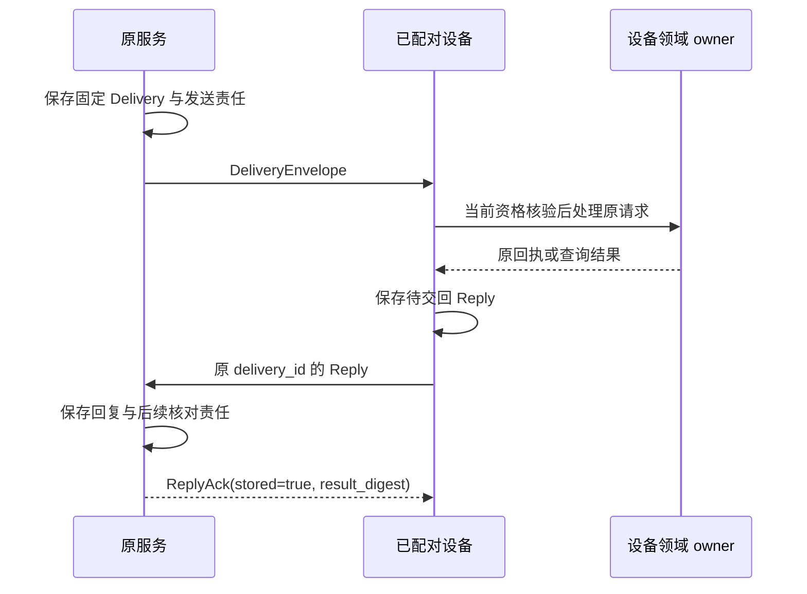

# 端云连接与可靠交付

端云传输通过一条 WSS 连接承载请求、设备投递、回复与变化提示；原命令和领域账本承担断线后的责任。HTTPS 负责发现、认证引导和大内容字节，上传与镜像的管理消息仍走 WSS 或 [gRPC](grpc.md)。

本页定义 `harness-wss-draft-3` 绑定；精确字段见 [transport.schema.json](schemas/transport.schema.json)，命令语义见 [共同契约](README.md)，实现与验证状态见 [review.md](../review.md)。

## 组件与依赖

网关持有外部 socket、请求关联和订阅状态，原逻辑服务持有业务事实，设备持有原决定及待交回 Reply。身份适配器在握手、每条业务消息和每次披露时检查当前资格；中转连接不创造持续授权。

| 入口 | 用途 |
| --- | --- |
| `GET /.well-known/harness` | 同源发现准确逻辑服务、协议和限额 |
| `WSS /v1/connect` | Command、Query、原回执查询、传输管理、投递与通知 |
| `HTTPS /v1/pairing/commands` | 仅 pair.begin / pair.claim 的有限认证引导 |
| HTTPS 上传、下载、镜像字节端点 | 原始字节；管理记录与内容许可仍由各 owner 裁决 |
| 内部 EndpointChannel | 网关向原服务转交；绑定与重建归 [gRPC](grpc.md#channel-rebind) |

## 发现、固定路由与连接

调用方先从用户或受信装配给定的稳定 HTTPS 地址取得原逻辑服务，再保存完整命令后发送。新任务选址只发生在首次发送前；原提交未知时始终回原逻辑服务，网关只选择它的健康进程。

未认证 Discovery 只公开协议、传输配置、连接路径和登录/配对能力，不泄露租户、端点、任务或内部路由。认证后的 Discovery 提供下列信息。

| 信息 | 核验 |
| --- | --- |
| logical_service_id、protocol、profile | 准确负责服务、`harness/1`、`full-harness-draft-2` |
| transport_profile、connect_path | `harness-wss-draft-3`、固定 `/v1/connect`，同源解析 |
| schema_digest、methods_digest、methods | 装配认可的准确资产摘要和本服务方法子集 |
| auth_profile、proof_profile | `session-cookie-or-opaque-bearer-1`、`orchestrator-jws-es256-1` |
| limits、retention、changes_supported | 当前连接能力、完整回执保留范围与变化订阅 |

客户端验证 HTTPS 证书和主机名，不随跨源重定向转交凭据，也不下载任意远程 Schema 执行。新任务的租户/用户映射由受信管理流程发布；受影响用户的来源关联须在开放选择前耐久登记。多个逻辑服务可共用网关，但稳定服务地址必须足以区分原服务，不能在映射换版后连接到新的默认服务。

发送 task.submit 前，客户端保存原 HTTPS 地址、logical_service_id、完整 Command 与规范请求摘要，成功后补存 `(orchestrator_id,task_id)`。无法耐久保存的宿主只标本端待发送，不发送提交。网关核对当前认证租户、连接服务、target_id 与 payload.orchestrator_id；不在业务帧到达时选新分片。路由不可确定则拒绝或保留未知。

### 握手与 Ready

客户端协商 `Sec-WebSocket-Protocol: harness-wss-draft-3`。网关取得外连接配额和原服务内部绑定后，首先且只发送一次 Ready；客户端核对 connection_id、原 logical_service_id 与 limits 后发送业务帧。内部重绑不发送第二个外 Ready。

每个 WebSocket 文本消息恰含一个完整 UTF-8 JSON Frame，拒绝二进制业务帧；WebSocket 分片不改变应用边界。后续帧携带当前 connection_id。Ready 只表连接可用，未接纳任何业务。

### 容量与双向读写

每个连接对在途、队列和订阅设硬上限，并为关闭责任保留容量。下列为参考初值；服务可声明较小值，但满足各约束且不在 Ready 后静默缩小。

| limits | 初值 | 约束 |
| --- | --- | --- |
| max_json_bytes / max_frame_bytes | 256 KiB / 1 MiB | 前者限制 Command/Query，后者含证明与包装；解析前计字节 |
| max_page_items | 100 | 领域页返回上限 |
| max_inflight_requests / max_pending_deliveries | 各 32 | 未答请求、未匹配 Reply 的投递 |
| max_queue_bytes | 每连接每发送方向 4 MiB | 已排队未写出应用帧 |
| control_reserve_bytes / control_reserve_items | 1 MiB / 4 | 小于总限额，字节预留至少容纳最大帧 |
| max_connections_per_identity_service / total | 2 / 16 | 同认证端点实例或浏览器会话的每服务与跨服务配额 |
| max_subscriptions | 8 | 每连接 |
| heartbeat_interval_ms / timeout_ms | 30000 / 90000 | 空闲 ping，原 nonce 的 pong 超时断开 |
| max_content_bytes | 部署固定有限正整数 | 字节和临时空间上限 |

普通工作达到总限额减控制预留后停止发送；取消、撤权、收尾、mirror_control、响应和心跳可使用预留，仍受总额限制。控制类别由受信方法登记判断：任务 pause/cancel/billing_reconcile、执行 control/cancel、brain.cancel、evaluation.cancel/revoke、grant/endpoint.revoke、内容 close/release_copy、resource.release、budget.close/settle、grant lease/use settle，以及 collaboration.control 的关闭/停止分支。发送者不能自报高优先级。

双方独立持续读写，等待 response 时仍读取控制和回复。队列长期不降、控制帧无法入队或心跳超时则关闭慢连接；持久 Delivery、Reply 和业务 jobs 继续恢复。外连接配额由身份权威分片共同检查单服务与总额，不能按网关进程计数；无法核验时拒绝新连接。进程租约（lease）和条件释放归 [部署](../deployment.md)，内部重绑不额外占外连接槽。

### 请求序号

request_seq 只关联当前 connection_id 上的一次端到服务 request/response。客户端单写循环在实际选中并写出请求前分配递增安全正整数，控制插队仍按实际发送次序分配；序号可跳跃，不是连续业务日志。

网关按外 WSS 接收顺序，先核对合法新号大于高水位并推进高水位，再做当前资格、容量和业务检查。随后返回错误也消费该号；重复或倒退号以 1002 关闭，不能用同号错误干扰原等待。服务只保存高水位及有限在途关联，不积累已完成历史。response 可以乱序；客户端丢弃已结束等待的迟到响应。

内部重绑由网关原在途记录发起恢复，保留原序号和内容，不重新过外请求准入、不推进高水位、不占新槽，端侧不能自报恢复标记。新网络尝试分配新序号，内含原 Command 保持不变。序号到 `9007199254740991` 后停止分配新号，继续已有等待及 Reply/Delivery，最多 5 秒排空后 1012 关闭并重连。

外断线释放连接状态，不释放业务责任。客户端抖动退避重连，参考从 1 秒增长到 30 秒；认证失败先重新认证。Ready 后先查原命令/Task，再恢复订阅。原记录全丢时，受信来源目录最多找回已接纳且可披露的 Task；无法定位的提交保持未知，不能改投重建。

## 认证与证明

浏览器以同源 Secure/HttpOnly Cookie 握手，服务校验 Origin；认证和配对 HTTP 写入口检查 CSRF。CLI 与已配对设备在 TLS 握手使用 opaque Bearer，不把凭据放 URL 或子协议，也不混用 Cookie/Bearer 让调用者选择身份。

Bearer 至少为 256 位密码学随机值，服务保存校验值和资格绑定；原文仅在安全凭据库及有限领取恢复记录保存。每条消息和披露重新核对到期、撤销、代次和范围，认证信息不从业务正文取得。

| 主体 | 认证与领域边界 |
| --- | --- |
| 浏览器 / CLI | 当前本人会话或受控系统凭据；localhost 不自动可信 |
| 设备 | tenant、endpoint、instance、credential_generation、期限和范围；不自动取得 Grant |
| 服务 | 受信装配映射逻辑服务与允许代表的业务 sender |
| 网关代理 | 仅转交受信委托，不能把自己的身份写成业务 actor 或 sender |
| 人类确认 | actor_kind 和 trusted_user_session_ref 由当前受信会话产生；普通输入或服务令牌不能自报 |

`AuthContext.sender_service_id` 表示原业务服务，来自服务凭据或已验证 Delivery 发送者；直接用户/端点没有业务 sender 时省略。网关 mTLS 只证明转交关系。[gRPC 委托](grpc.md)保留原主体；Confirmation 在原业务 owner 保存并消费，详见 [授权](../authorization.md)。

pair.begin 与 pair.claim 是受限匿名 HTTPS 入口，只接收这两个 Command，不接受调用方指定 tenant；approve 由已认证用户在独立受信入口决定。未批准时 claim 的 pending 是该次命令最终观察，后续轮询用新 command_id，原 pairing_id、私密码和设备 nonce 不变。领取成功和原回执同事务保存，失答复用原命令恢复同一凭据；不同命令不签第二份。安全领取窗口结束返回 gone 并重新配对，原会话终态仍拒绝重领，已取得凭据有效性按自身到期和撤销判断。

会话或设备凭据过期需重新认证和建链；撤销增代次，旧连接停止新请求和披露并关闭。仅内部委托轮换可保留外连接。新设备实例不直接继承旧实例操作或余额，旧责任按领域恢复。

### 控制与投递证明

Orchestrator 对完整 ControlSnapshot 生成 ES256 JWS Compact，接收端核验登记密钥及准确目标后才应用 TaskGate。签名证明来源，当前 Grant、资源占用和控制修订仍由领域门禁核验。

| 内容 | 固定规则 |
| --- | --- |
| protected header | `alg=ES256, typ=harness-control+jws, kid`；拒绝 none、其他算法、未知 header、消息自带 JWK 或取钥 URL |
| 控制 payload | issuer 等于 gate.orchestrator_id；tenant 与认证相同；audience 是准确 executor；完整 gate 与 issued_at/start_before 匹配 |
| 窗口 | 非空有限窗口，不超过双方装配的控制上限 |
| Delivery 证明 | typ 为 `harness-delivery+jws`；签完整 Delivery，发送服务须有权向准确接收实例路由 |
| 规范编码 | JCS（JSON Canonicalization Scheme）UTF-8；ES256 为 P-256、SHA-256、固定宽度签名 |

接收方依次做有界严格解码、登记 kid/算法检查、签名验证、实际完整快照及租户/受众匹配、时间和来源资格、领域门禁。JWS 输入是实际 protected header/payload 的 base64url 字节，不能改写后验证。JCS 拒绝重复键、非法 Unicode、非有限数和超安全整数；金额仍是十进制字符串。

密钥轮换先经既有受信关系登记新公钥再切换签发，旧公钥保留至不再可启动且满足历史审计。失信 kid 禁止新使用并传播；历史签名和过期证明只用于恢复证据，不延长资格。可信时间上界不可建立时关闭依赖远端窗口的新启动，纯本地共同事务按自身规则运行。

## 设备投递与回复确认

原服务在发送前保存 Delivery 与持续发送责任，设备在交回前保存原结果与 Reply；服务共同保存回复及下一领域责任后才发 ReplyAck。

| 帧 | 方向与含义 |
| --- | --- |
| ready | 服务→端；唯一首帧，固定连接与限额 |
| request / response | 端→服务 / 服务→端；按 request_seq 和 kind 关联 |
| delivery | 服务→设备；DeliveryEnvelope 含准确请求与签名证明 |
| reply / reply_ack | 设备→服务 / 服务→设备；按原 delivery_id 关联并可跨连接恢复 |
| mirror_ticket | 服务→设备；准确镜像票据，结果通过镜像查询确认 |
| change / snapshot_required | 服务→端；提示或明确连续性缺口 |
| ping / pong | 双向；关联原 nonce，不表示业务成功 |

Delivery 固定发送服务、接收 endpoint/instance、kind、原 request、request_digest 与 deliver_before，同 delivery_id 不同内容冲突。request_digest 为 request 的 JCS SHA-256。原命令首次接纳截止与投递截止分别检查。

| kind | request | Reply.result | 如何更新观察 |
| --- | --- | --- | --- |
| command | 原 Command | 原 Receipt 或 Error | accepted 后另建 receipt_lookup 投递 |
| query | 原 Query | QueryResult 或 Error | 同投递返回原读取快照；需要当前状态则新建 query Delivery |
| receipt_lookup | 原 command_id | 原 Receipt 或 Error | 查询失败不生成业务 rejected |

下图从两个持久交接边界解释 ReplyAck，箭头是请求与确认；设备收到 Ack 后才能结束该次回复交回责任。

服务核对设备实例、原请求和响应结构，相同 Reply 返回同 Ack，普通同 delivery_id 异结果冲突。Ack 丢失时设备有限退避重交，不能只等断线；内部重绑后仍可重交，服务不重复建后续 job。错误回复已经固定后，新的处理尝试可新建 Delivery，内含原 Command 不变；设备不可达是 dependency_unavailable，不伪造 not_found。

当前披露资格在 Reply 首发及重传前都检查。资格不足时设备保留原业务事实，持久关闭该 Delivery 的内容交付，改发 `withheld=true` 与严格 `forbidden / retry=after_change` 错误；服务单独保存披露关闭并 Ack，不把它当异业务结果冲突。已知关闭后丢弃迟到完整回复内容，资格恢复也需新 Delivery 查当前事实。副本清理仍按 [内容治理](../memory.md)继续。

每条连接仅为已发未匹配 Reply 占 pending 槽；断线不丢发送责任。设备队列满拒绝新接纳，优先交回已持久 Reply，并保留查询和关闭容量。

## 大内容上传与反向镜像

内容传输先产生耐久字节，再发布内容引用；管理 ID 只定位记录，当前主体与用途来自认证。基础配置采用幂等整份重传，不默认分块提交或 Range 下载。

### 上传与下载

| 入口 | 行为 |
| --- | --- |
| upload_reserve | 固定 upload_id、hash、长度、类型、截止，保存空间预留；异元数据冲突 |
| PUT `/v1/content/uploads/{upload_id}` | 有界接收原字节，核对 Content-Length/Type、摘要和长度，同步后原子置 ready |
| upload_lookup | 返回 reserved/ready/committed/expired 原状态 |
| content.put | 准确字节 ready 后，共同保存 ContentRef、来源、策略并转 committed；领域规则归 [记忆](../memory.md) |
| content.get bytes | 当前读取资格成立后取得有限下载定位，不自动登记副本 |
| GET `/v1/content/downloads/{download_id}` | 每次核验主体、接收方、copy、来源、用途及期限，输出准确字节 |

upload_reserve、upload_lookup、mirror_reserve、mirror_lookup、mirror_control 是五种传输管理 kind，不增加领域方法。断线后换 request_seq，保留原 upload/ticket/control 身份与输入；response 按原管理 kind 及对象关联。lookup 不重复预留或发布。

上传期限限制新字节与首次发布，已 committed 内容按 ContentPolicy 保留。重复 PUT 做有界一致性检查，ready/committed 返回原元数据，换字节拒绝。元数据在原内容分片，云端 ready 字节位于跨可用区共享耐久存储；单进程临时文件同步不够作为 ready 依据。清理与新引用登记锁同一元数据，防止已发布字节被当孤儿删除。

下载 `range_supported=false`，响应给 Content-Length、Content-Type 和 hash 强 ETag，客户端校验摘要与长度再使用。发送前复核资格，流式发送中按有界块检查关闭；重新定位不自动登记新副本。临时上传清理保留最小 ID/摘要/终结状态，原 ID 不可覆盖既有发布。

### 无入站设备的镜像

接收服务先向原内容 owner 注册自己为 copy holder，取得当前读取资格，再保存 MirrorTicket 预留空间，向绑定设备实例推送票据。设备只向当前受信连接对应服务主动上传；原 ContentRef、owner 和 copy_id 不变，接收方不经 content.put 改成自己的内容。

| 记录 / 入口 | 固定或递增内容 |
| --- | --- |
| MirrorTicket / mirror_reserve | ticket、upload、稳定 receiver_service、sender endpoint/instance、准确 ContentRef/copy、来源控制修订和截止，首次后不变，无任意 URL |
| PUT `/v1/content/mirrors/{ticket_id}` | 验设备实例、期限和准确字节，同步完成后 ready；同票据不能追加或换字节 |
| mirror_lookup | 查原 Mirror，包括关闭和清理状态 |
| mirror_control | 原 owner 提交 control_id、ticket/copy/content、单调 control_revision 与 restricted/closed 原因 |
| Mirror | reserved/ready/closed/expired、控制修订、保留期限及清理状态 |
| GET `/v1/content/mirrors/{ticket_id}/bytes?source_download_id=...` | 接收者用原 owner 当前 content.get bytes 结果定位并读取 |

设备收到票据后再次核验原 copy、来源与披露资格；接收者在写入中检查关闭，完整校验后开放。已 ready 镜像不因上传截止失效，保留归原 copy。每次读前都取得原 owner 当前 bytes 结果，核对引用、copy、下载期限及控制修订；旧结果不能覆盖较新关闭。原 owner 不可达则停读，control 查询不能代替字节资格，镜像基础路径不提供独立离线读。

原 owner 的 close/restrict 事务保存逐镜像控制发送责任，以原 control_id 提交 mirror_control。接收方核验 owner 身份，共同提交较新控制、关闭读取、state=closed、清理 job 与回执；restricted 也保守关闭整个镜像，新政策仍允许时重新登记副本、发新票据。控制答复丢失重投或 lookup，不以发送成功代替物理清理。

清理先关读取，再删临时和镜像字节，并通过 content.release_copy 回报停止、清理或残留。上传与关闭锁同一 ticket/copy，关闭先提交后迟到 PUT/ready 不能重开。控制身份属于原 owner，设备重启不使旧 copy 失去可关闭性；上传仍绑定原实例。

## 订阅与缺口

订阅只加速原对象查询，不交付业务决定。客户端提交非空去重的 object_types 与可选 cursor，服务返回 subscription_id、cursor、snapshot_required；范围、分页和完整性统一归 [集合恢复](protocol.md#collection-snapshots)。

cursor 绑定主体、原服务和准确类型集合。同过滤集合重新订阅替换旧 subscription_id，断线释放订阅；客户端忽略已替换订阅的迟到帧。首次或过期游标的 Subscribed 要求新快照，但服务先建新水位缓冲并继续发送 Change，客户端边枚举边缓冲。

| 已有订阅发生什么 | 服务行为 | 客户端行为 |
| --- | --- | --- |
| 保留缺口 / 队列溢出 | snapshot_required，reason=cursor_expired/queue_overflow，暂停旧 Change | 同过滤、不带 cursor 重订阅 |
| 内部流重绑 | reason=backend_rebind，保留旧 subscription_id 以传达缺口 | 放弃连续性，重订阅与新快照 |
| 权限范围增加或减少 | reason=authorization_changed，不泄露移除对象 ID，暂停旧订阅 | 撤销完整标记与未复核缓存，废弃旧分页后重建 |
| 控制帧无法入队 | 关闭连接 | 在恢复预算内重连 |

同对象提示可以合并到最高修订，但不能无声跨过未覆盖对象。权限适配器使受影响订阅失效；跨 owner 通知无法证明连续时至少每 30 秒核对范围，无法确认未变则停披露并保留缺口；这不替代每次发送的当前资格检查。持久取消/撤权仍走 Delivery/Receipt，不能降为可丢 Change。

## 失败处理

传输错误说明本次交接结果，不能覆盖原业务回执；具体 Error.retry 仍由 [共同契约](README.md)定义。

| 情况 | 返回与恢复 |
| --- | --- |
| 已保存决定 | response/Reply 中返回原 Receipt，按阶段解释 |
| 尚未接纳且输入/资格失败 | 当前 request_seq 的 Error，不伪造持久回执 |
| 握手认证/过载 | HTTP 401/403/429/503，未升级；重新认证或退避 |
| 非法帧、重复/倒退序号 | WebSocket 1002；原业务仍查询 |
| 消息过大 | 1009；修正容量 |
| 身份失效 | 1008；停止业务和披露后重新认证 |
| 慢端、过载、内部恢复超窗 | 1013；退避重连，保留原身份 |
| 网关退出或序号耗尽 | 1012；有界排空后重连 |
| 字节成功/超大/不存在/已回收 | HTTPS 200/201、413、404/410，按 Upload/Mirror 状态解释 |
| 无响应、断线、心跳超时 | 写请求先查原命令，不视为取消或未发生 |

## 保证与限制

投递链保证原请求与回复均有固定身份及恢复负责者，前提是双端持久记录、当前资格、准确证明和同版编码成立。ReplyAck 只证明服务保存了回复与下一责任，不证明外部效果、用户预览或业务消费；socket write、ping/pong 和流控更不具有业务成功含义。

签名证明来源与内容绑定，不产生当前权限。撤权不能召回已交付字节，实际清理继续由副本 holder 负责；远端有限窗口的动作按领域边界处理。字段、密码学向量与真实网络/事务/隔离分别验证，状态见 [review.md](../review.md)。

## 取舍

| 选择 | 代价 | 改选条件 |
| --- | --- | --- |
| 端云统一 WSS | 维护应用帧、双向流控、重连和证明 | 新绑定须完整保持共同业务语义及恢复义务 |
| 有界在途加序号高水位 | 连接状态丢失需按业务身份恢复 | 不为无感 socket 迁移持久化无限历史 |
| 整份内容重传 | 大文件中断可能重传全部字节 | 测得成本显著后增加独立分块恢复能力 |
| 基础镜像每次在线核验 | owner 不可达时停读 | 离线副本需另有明确授权与验收 |
| 内部重绑后重建订阅 | 增加权限与快照查询负载 | 连续接续收益经测量后另定协议 |
