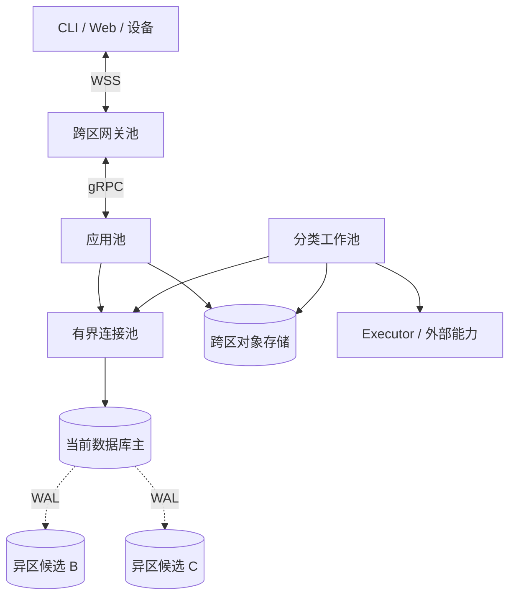

# 部署、存储与故障恢复

宿主将同一组领域组件装配为开发单体、本机多进程或生产分布式服务；生产使用单地域三个可用区、独立网关／应用／工作池和隔离执行宿主。实现与验证状态见 [review](review.md)，工程依赖和建设顺序见[工程方案](engineering.md)。

## 组件与依赖

生产进程按伸缩与故障边界分组，需要共同提交的事实仍在同一数据库分片中处理。数据库分片（shard）是独立数据库单元；表分区（partition）是库内布局。一个分片可以承载多个 Orchestrator，固定 Orchestrator 也可以在维护窗口更换物理位置。

| 角色 | 装入的职责 | 扩展单位 |
| --- | --- | --- |
| WSS 网关 | 握手、当前认证、有限关联、gRPC 转发、推送及慢端管理 | 连接、在途字节、握手及带宽 |
| 应用进程 | Task、准入、Input／Surface、协作、适用的 Grant／Confirmation | 短请求吞吐，不改变原事实归属 |
| 分类 worker | 领域处理器及[公共工作循环](reliability.md) | 工作类别、提供方及租户份额 |
| Executor／设备宿主 | 操作、资源 owner 和驱动的实际启动入口 | 独立资源，不复制同一设备控制权 |
| 管理与评测 | 安装、批准、隔离环境和实验执行 | 管理保留容量与独立实验配额 |

下图表示一个权威分片的生产拓扑。实线是请求或存储访问，虚线是跨区 WAL 复制；进程池均分布在 A、B、C 三个区。

公司平台提供部署、发现、身份、密钥、存储、负载均衡及观测接入。宿主暴露配置、liveness、startup/readiness、排空和退出入口。liveness 只检查进程失活，数据库暂不可达通过 readiness 封闭受影响入口，不触发所有实例反复重启。

| 装配 | 数据与连接 | 使用方式 |
| --- | --- | --- |
| 开发单体 | SQLite WAL、本地不可变内容库、进程内 Go 接口 | 一个宿主验证完整业务链 |
| 本机多进程 | 本机 PostgreSQL、固定实例发现、独立网关／应用／worker／Executor | 验证真实事务与跨进程恢复；可选 Compose |
| 公司平台生产 | 托管 PostgreSQL、跨区对象存储和平台池 | 按能力和冻结负载取得生产准入证据 |
| 本机 Orchestrator＋云能力 | 本地任务权威，远端 Brain／Memory／Executor 走共同契约 | 依赖远端的步骤失联时等待 |
| 云 Orchestrator＋端侧能力 | 云任务权威，端侧保存本域事实 | 端侧在已有有限许可内推进已接纳工作 |

Linux 是生产参考目标，Linux/macOS 为开发及端侧目标。SQLite 使用 WAL、`foreign_keys=ON`、`synchronous=FULL`、本机单实例锁和单写队列；不共享文件供多主机写入。后台责任不继承已结束请求的 context。

## 数据布局与权威读取

每项业务裁决读取原 owner 的当前权威记录；副本与缓存用于可重建位置或明确标注滞后的展示。单写者分区（single-writer partition）在此指数据库分片内只有一个有效主写域，应用和 worker 仍可多副本并发，以对象锁和条件事务裁决。

| 数据 | 默认放置 | 同事务要求 |
| --- | --- | --- |
| Task、内部任务树、预算、命令和 jobs | 原 Orchestrator 分片 | 领域改变、原回执与后续责任共同提交 |
| Grant 父链、Use、计数 | 原授权 owner | 许可父链不拆库；新增 Orchestrator 不复制余额 |
| Confirmation | 实际消费它的业务 owner | 确认消费与业务改变共同提交 |
| Memory、Content 元数据、来源及 copy | 同租户默认共库 | 发布、关闭及变化水位遵循[memory](memory.md)；分库使用原交接协议 |
| 上传、镜像和制品字节 | 原 owner 元数据＋共享不可变对象版本 | 字节先耐久、准确引用后提交 |
| 受管文件根 | 稳定 file_owner 定位；journal 与路径独占在原权威库 | 目标文件字节的故障域单列，详见[execution](execution.md) |
| 身份、凭据代次及连接总额 | 稳定 tenant／identity 分片 | 当前有效性在原身份权威裁决 |
| 词法索引、任务汇总、遥测 | 派生数据及只读副本 | 标注水位；披露前复核权限，不能裁决余额或不存在 |

不确定的命令结果只能回原 owner 查询。读副本“查无记录”不构成未接纳证据；不可变字节缓存命中仍须通过当前权限和关闭检查。插件仅取得受限 repository／port，不能获取任意表访问能力。

## 路由与用户来源目录

新任务由受信发现选择 Orchestrator；调用方在首次发送前持久保存原服务地址、原 Command、摘要和接纳期限。已有任务及未决命令始终使用保存的目标，网关仅解析健康进程。

| 映射 | 保存者 | 变化规则 |
| --- | --- | --- |
| 用户范围 → 新任务默认 Orchestrator | 受信管理端的版本化映射 | 只影响后续新任务 |
| task_id → orchestrator_id | 原 Task 事务 | 与接纳共同提交 |
| orchestrator_id／owner_id → 分片 | 受信持久放置目录 | 保留仍负有任务或去重记录的旧映射 |
| 逻辑服务 → 健康实例 | 平台发现 | 只更换处理进程，不更改业务目标 |
| 用户 → 来源和披露权威集合 | 用户所属身份权威 | 新归属或披露开放前预登记 |

身份权威在同一短事务中提交来源或披露权威的增删及单调 directory_version 推进；重建完成也将已核对集合与当前版本共同提交。

身份权威提供受信内部读端口 `read_user_sources(已认证 tenant_id, user_id)`，从一个已提交视图返回完整去重来源、每来源全部披露权威和 directory_version，或明确不完整／不可用。这不增加公开协议方法。每个来源至少登记原 Orchestrator；共享或 Grant 由另一 owner 裁决时，先登记该权威再让披露生效。

应用首屏及每次续页核对当前 directory_version，并读取目录列出的全部权威的可比较披露范围修订。缓存只有版本和内容摘要均匹配时才能提供集合。任何权威遗漏、失联或不可比较均形成权限缺口，跨来源列表规则归[interaction](interaction.md)。

受信管理端按以下顺序开放新来源：

1. 建立主写域、完整同步候选、原命令查询和 jobs 扫描。
2. 预留故障剩余容量和跨 owner 配额份额。
3. 为受影响用户耐久登记来源与所有披露权威；并发开户进入同一发布屏障，使用已生效版本或等待新版本完整登记。
4. 发布新任务发现映射，再开放新接纳。发现 GET 只读已发布映射，不代做登记。

跨库先登记可以留下空来源。扩展历史披露须先界定全部受影响来源；不能界定时不宣称完整披露已生效，无法阻止的外部变化使列表报告缺口。删除来源须证明不再有可查询 Task、未决提交或披露责任；删除授权权威须证明它不再影响当前及未决披露。

映射回退只影响新任务，已接纳于新来源的任务继续在那里。应用判重后才判断首次接纳是否关闭：旧入口不能证明原命令未接纳时维持未知，不转投另一分片。本地记录全失时，目录可帮助找到已接纳且可披露任务，不能凭目标文本重建未决提交。

目录恢复必须覆盖备份后的路由发布、空预登记和所有可能的共享／Grant owner 耐久引用；只枚举历来使用的 Orchestrator 不足以证明完整。证明前保留部分列表、暂停新归属发布与披露扩张。整分片搬迁使用维护窗口：停新写和发送准入、隔离旧写者、取得含 commands/jobs/去重记录和映射的完整切点、恢复并核对对象版本、更新放置映射，先开放控制与核对。失败保持维护状态。

## 持久存储与工作发现

PostgreSQL 保存唯一责任，有限索引扫描负责发现工作，通知只缩短等待。数据库及应用连接均有总额，LISTEN 使用少量独立连接。

| 路径 | 物理实现与边界 |
| --- | --- |
| 领取 | 按分片、类别、状态、due_at、稳定键有限扫描，短事务 `FOR UPDATE SKIP LOCKED`；领域裁决另锁真实对象 |
| 唤醒 | 业务提交后以独立短事务 NOTIFY；失败不改变业务成功，通知不增加 work_revision |
| 监听恢复 | 先提交 LISTEN，再扫当前到期项，随后结合通知与周期扫描 |
| 索引 | 活跃责任与历史完成分开；due_at 在查询过滤，不用移动的 now() 作为持久索引条件 |
| 连接池 | 开发有界直连，生产优先平台事务池；不足时比较 PgBouncer；每次事务以事务作用域设置并核验租户上下文 |
| 会话能力 | LISTEN、会话 advisory lock 绕开事务池；会话锁不能证明外部动作已停 |
| 维护 | 按热表配置 autovacuum/ANALYZE，计 WAL、旧行版本、索引重建、同步副本与备份空间 |

数据库使用不能绕过行级安全（row-level security，RLS）的受限角色，后台工作同样不得借管理员角色越过租户；连接复用不继承上次请求的会话租户状态。

通知载荷只含分片和类别，不含正文或凭据。发送器每分片／进程有限扫描，禁止每条 WSS 一个数据库轮询器。无积压时抖动退避，初始最大补扫间隔 1 秒；实际扫描行数、锁跳过和旧版本成本必须测量，SQL LIMIT 不证明底层工作有界。

去重键保持完整唯一性，体量增大时按完整键 HASH 表分区；时间不能加入去重身份后按月删除最后记录。普通历史正文可以独立按时间分区与清理。最小命令、取消与终态记录的保留规则归[调用契约](contracts/README.md)。

对象存储绑定准确 bucket／key／不可变版本，跨区耐久及摘要校验后才写 ready。实例退出后按原 upload_id／ticket_id 查询；部分上传有限整份重传，身份或摘要不同拒绝。发布与孤儿清理锁同一元数据；副本关闭与残留归[memory](memory.md)。

空间保护初值为剩余低于 10% 时停止新任务、模型和上传；正常接纳预留最坏回执、控制与收尾空间。控制都无法耐久提交时返回不可用或结果未知，不报告取消成功。优先清理临时上传和无引用字节，不能删除未决效果及最后去重记录。

备份清单包含一致数据库切点、准确对象版本、InstallLock、去重／终态记录、放置映射、来源目录及披露权威版本、路由发布历史和密钥恢复依据。SQLite 使用在线备份或停写一致快照。恢复先隔离旧写者并补齐切点后的命令、撤权、关闭及效果；历史不足时只读诊断。

## 在线绑定与进程生命周期

外连接额度、进程租约、在线绑定和持久投递分别保存。应用进程更换时网关重绑内部流；原业务交付继续沿 Delivery／Reply，协议细节归 [gRPC](contracts/grpc.md) 与 [WSS](contracts/transport.md)。

| 记录 | 保存者 | 裁决规则 |
| --- | --- | --- |
| 外连接额度 | 身份分片 | 锁身份行校验服务内及身份总额；按 connection_id 和 gateway_instance 条件释放 |
| 进程租约 | 涉及的身份或业务分片 | 每 boot、每分片一行；重启用新随机身份；过期 boot 永不复活 |
| online_bindings | 原逻辑服务分片 | 同 connection 接受更高 binding_revision；同代仅相同绑定和两端实例幂等 |
| 待发送记录 | 原领域 owner | 与业务同事务提交；连接消失不删除责任 |

网关先占外额度，再建立内部绑定，核验内部 Ready 后才发外 Ready。跨库失败条件释放原额度，崩溃由租约回收。内部重绑不重复占额。每次更换内部流或应用实例创建更高代次和新 binding_id；迟到低代不能覆盖，旧清理只删自身绑定。应用绑定失效后，外连接存活期间仍保留最高代次。

发送器按自己当前绑定的接收者集合与到期投递记录有界关联扫描；网络写入在事务外，持久收到 Reply 才推进交付。一个接收者多连接可能重复收到相同 Delivery，接收方按原身份去重。控制、认证和披露检查发生在每次发送前。

领域提示通过同事务 outbox 发布；发布器锁逻辑服务提示头，追加有序提示、推进水位并标记源项，不能按预分配序列号最大值跳过迟提交项。提示窗口初始为 24 小时与最大字节数先到者；缺口显式触发当前快照。Memory 自己的变化水位与该提示头是不同对象。

发布按角色排空：网关摘新握手、有限收尾、分批关 socket，再条件释放额度；应用停新绑定并让存活网关重绑；worker 停领取后保存未决阶段；Executor 封闭新实际启动并核对旧入口。新连接在旧额度释放前到达可以暂拒，不能移交旧 socket 身份。初始同批网关连接不超过全池 5%，网关／应用排空分别 60／30 秒，容器退出宽限 120 秒；请求自身期限不延长。

格式迁移采用兼容扩展、小批回填、切读写、观察后收缩。迁移固定身份、摘要、锁与检查点，失败只回滚当前批次。旧格式收缩前核对旧实例、未决责任和回退保留期；不兼容变化在分片维护窗口执行。应用回退不回滚业务账本，批准与实例开放规则归[extensions](extensions.md)。

## 时间与租约裁决

ClockAdapter 输出可信 UTC 区间、覆盖允许暂停的经过时间及信任代次；部署固定误差上界、样本有效期和暂停范围。数据库在短事务实际裁决处读取当前时间，不能用排队前或事务开始时刻延长期限。

| 参数 | 解释与检查 |
| --- | --- |
| ε | UTC 最大误差；签发者、候选数据库与消费者分别有平台依据 |
| ρ | 经过时间速率误差，`0≤ρ<1`；真实经过时间不超过 `Δm/(1−ρ)` |
| κ | 检查到实际发送／披露入口的最大间隔，超限先使旧信任代次失效 |
| L | 进程租约长度；初值 15 秒，每 5 秒续期，均须满足平台误差条件 |

远端许可要求 `消费者当前 UTC 上界 + 签发者 ε + κ < start_before`，并同时满足原已固定的本地经过时间截止，取较早者。UTC 回拨、重复回执或可信区间收窄都不延长原窗口。共库核验也检查批准与 Grant 绝对期限。

进程租约从续约请求发起时的本地 m₀ 计算，最迟停止点不晚于 `m₀ + (L−2ε_db−κ)×(1−ρ)`，括号须为正。回复到达时不能重新起算，续约回复还须早于上一已承认截止。部分单调时钟不覆盖系统睡眠，平台须计入主机／VM 暂停，或在恢复任何业务线程前封闭旧入口。

主库换钟证据不足时暂停租约续约与回收，隔离旧持有者；或在恢复可信经过时间后等待完整最大窗口及余量，耐久关闭旧 boot，再开放新身份。不能先回收额度后让旧发送器停下。该耗时进入恢复统计。

## 失败处理

数据库故障先隔离旧写者和核对历史，再开放控制与核对，最后开放新目标工作。

| 故障 | 处理与恢复条件 |
| --- | --- |
| 单网关退出 | 受影响端点新建连接，查原业务并恢复订阅；原任务不重建 |
| 内部流或应用退出 | 网关有限重绑原服务，丢弃旧输出；订阅按缺口恢复 |
| worker 退出 | 新领取查原阶段，旧代次拒绝回写；效果不由租约推断 |
| 数据库主／单区失效 | 旧主隔离、候选含全部确认提交、第二耐久副本就绪后恢复写 |
| 全部同步候选不可达 | 停相应新成功接纳，未知事务查原命令，不降为异步确认 |
| 身份、目录或披露权威不可达 | 封闭依赖它的新接纳／披露或报列表缺口，保留原责任 |
| 文件根失联 | 停该根新写，旧效果 unknown；不使用另一空目录接管 |
| 对象存储故障 | 依赖字节的步骤等待；元数据存在不证明字节存在 |
| 全地域损坏、旧备份缺历史 | 隔离原写域，诊断并补齐后续事实；不自动恢复旧行动 |

数据库推荐 `synchronous_commit=on`、等待至少一个异区候选耐久 WAL（`ANY 1` 的配置语义），不以 remote_write 当异区落盘证明。平台比较同一历史的候选并证明确认记录完整；提升后仍需第二耐久副本才开放相同级别写入。

## 容量与配额

容量实验将用户量展开为真实任务、数据库提交、连接、模型和恢复负载。数值与 SLO 的唯一表在[容量与运行指标](capacity.md)；配置在实验前冻结。

跨 owner 总配额初期使用受信配置的保守份额。每个用户／租户、提供方及维度固定计数 owner、份额和生效版本，同一总额的份额之和不超总额；速率窗口和突发量也拆分。新增进程共享原计数，评测 owner 同样占提供方份额。费用、速率、本地槽和远端物理并发分别计量。

管理端串行发布版本，原 owner 耐久拒绝旧配置重放。先用未分配余额扩容；转移既有份额须先在旧 owner 降上限并确认释放量，再增新方。失联、未知预留、在途本地槽和旧窗口用量不能被重新分配。估算费用仅约束新接纳，真实超额按[预算规则](orchestrator.md)记账。

## 保证与限制

生产目标为单可用区故障下已确认账本 RPO=0、原 Orchestrator 控制／查询恢复 RTO≤60 秒，前提是旧主隔离、完整历史、异区耐久副本、可信时钟和故障剩余容量。新工作开放时间另计；整地域故障采用受限灾备，无自动双地域可写承诺。

数据库保证不覆盖外部系统和单故障域文件根。跨区接管文件须另证根句柄解析、同目录原子替换、字节与目录持久化、跨副本路径独占和旧写者隔离。开发与端侧 SQLite 不承诺磁盘毁损下零丢失；原历史不完整时也不能重做未知效果。

全本地权威和依赖齐备的任务可以离线接纳和推进。混合部署只有预先授予的有限工作可以离线继续，端侧不接管云任务的新目标。单任务 Orchestrator 固定，整分片维护搬迁不等于在线重分片。

## 取舍

| 选择 | 代价 | 改选条件 |
| --- | --- | --- |
| 托管 PostgreSQL＋对象存储＋有限批扫 | 数据库承担领取、维护和历史增长 | 实测扫描／通知扇出成为瓶颈，再比较独立通知层总成本 |
| 原库保存 jobs，通知可丢 | 有界扫描带来恢复延迟 | MQ 仅加速原 job；若替代责任账本须重新评审双系统提交 |
| 进程缓存、默认词法索引 | 冷缓存回源及索引补扫成本 | 不可变读取或检索质量／负载证据支持时引入 Redis 或独立检索 |
| 保守跨分片配额份额 | 闲置额度不能即时转给热点 owner | 闲置及调整成为主要瓶颈后设计固定配额 owner 和预留／结算协议 |
| 平台提供高可用基础设施 | 接受其接口与产品限制 | 平台不能兑现功能、地域或成本约束时另评自建并明确值守责任 |
