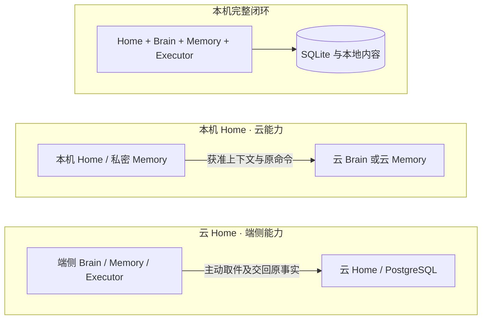

# 默认实现、部署与容量

[总览](README.md) · [宿主与扩展](extensions.md) · [验收](validation.md)

默认实现首先让开发者在个人机器上运行完整闭环，云服务采用同一业务接口和状态语义。云端增加的是多用户运营、持久基础设施和横向容量；本地进程不需要为了接口对称而启动一组空服务。

## 1. 选型与替代条件

下列为本方案的默认实现选择，技术依据核查日期为 2026-09-25；安装锁还须固定经过验收的补丁版本和依赖摘要。

| 选择 | 采用原因、代价与替代条件 |
| --- | --- |
| TypeScript + Node.js 24 LTS | 核心与 Web／扩展 SDK 共用类型工具，适合大量 I/O 调用；CPU 密集检索、模型推理和图像处理放工作进程或独立服务。相较 Go，承担运行时分发和依赖管理成本；相较 Python 核心，减少跨 Web SDK 的手工类型映射。此判断是项目选型，不是性能结论。Node 官方列出 24 为 LTS；生产只使用仍受支持的 LTS。[发布周期](https://nodejs.org/en/about/previous-releases) |
| 本地 SQLite WAL + 宿主文件内容库 | 无额外数据库服务，同文件短事务覆盖任务与 jobs。WAL 允许读写并行但同一时刻只有一个写者，且不适用于跨主机共享网络文件系统；本机写队列串行。超过测量容量时迁移到服务部署，而非让多台主机共享 SQLite。[SQLite WAL](https://www.sqlite.org/wal.html) |
| 云端 PostgreSQL 18 + 对象存储 | 使用条件更新、行锁和事务保存业务／工作责任。工作领取可用 SKIP LOCKED 避开其他领取者，它适合队列访问而不保证一致业务快照；真正业务条件仍锁行检查。[SELECT 锁定](https://www.postgresql.org/docs/18/sql-select.html) |
| 数据库 jobs；不引入默认消息中间件 | 减少数据库提交与队列发布的双写点。扫描和争用随负载增长后，可由提交后 outbox 驱动外部队列；队列只唤醒，不替代业务原记录 |
| HTTPS 命令、查询和可选 SSE；设备主动取件 | 易于单机与云共用，避免给每个域建立有序消息账本；增加查询流量，取件有延迟。实际需要双向低延迟时可替换连接传输，仍沿原命令恢复 |
| 词法检索默认，向量索引为可替换派生能力 | 先确保权限过滤、来源和纠正可解释，再凭冻结评测比较检索质量；语义检索有明确收益时启用。完整策略归[记忆](memory.md) |

Linux 与 macOS 是参考宿主目标；默认 CLI 和本地 Web 不绑定桌面应用框架。Python 或其他语言工具可通过进程／网络适配器接入，避免为生态适配而改变公共状态语义。上述均为拟实现与拟验收平台，不是现有可用产品声明。

## 2. 三种必须验证的装配

下图表示部署位置，箭头表示需要跨信任或网络边界的调用。每种装配都只有一个任务 Home，Memory 和 Executor 可以保有自己的领域记录。

本地服务启动时先取得宿主单实例锁并打开本地数据库，再恢复未决 jobs、权限变更和设备控制事实，最后开放新接纳。云进程可以多个，但由同一数据库主写域及任务条件事务裁决；备用进程不凭超时创建另一个数据库主。

全部权威和依赖在本机的任务没有公网可用性前提。混合部署缺少远端依赖时，该步骤进入等待；云 Home 不可达时，端侧只能在已接纳的有限工作和许可范围内继续，不自行推进同一任务的新目标。

跨端 Brain 必须作为可独立替换的组件执行 Decide 合同；本机 Brain 调用云模型不满足此项验证。Memory、Executor 同理，至少分别验证一次远程部署与一次不同实现替换。

## 3. 持久化、备份与接替

本地 SQLite 配置 WAL、foreign_keys=ON、synchronous=FULL；在 WAL 模式下 FULL 为每次提交同步 WAL，仍依赖操作系统和设备正确实现持久写入。[SQLite synchronous](https://www.sqlite.org/pragma.html#pragma_synchronous) 不把易失缓存写入当作接受任务。

大内容先写临时对象并同步，形成不可变版本后再把引用纳入业务事务。提交失败产生的孤儿对象可以清理；已被持久任务引用的对象先核对保留责任，不能按文件创建时间盲删。云对象存储需验证不可变版本读取、写后读取、摘要和删除回执能力；产品名称不代替这些验收。

备份包含一致数据库快照、引用内容及版本锁。SQLite 使用在线备份 API 或停写一致快照，不单独复制正在使用的主数据库文件。[SQLite Backup API](https://www.sqlite.org/backup.html)

备份恢复不能直接重开行动。恢复入口先隔离原宿主／旧数据库主，获取备份之后的授权撤销、命令接纳和外部执行记录，核对未决操作；不存在可证明完整的后续记录时，以只读诊断方式恢复，相关操作标缺口。丢失历史后从旧快照重复写入不属于灾备成功。

| 故障范围 | 恢复方式与成立条件 |
| --- | --- |
| 工作者进程崩溃，数据库完整 | 重新领取原 job，查原命令；旧 lease_epoch 不能再提交 |
| 本机进程重启 | 单实例锁、原数据库与控制事实完整；先恢复后开放新工作 |
| 云主节点故障 | 数据库平台完成旧主隔离、选主及持久记录完整性证明；Home 的逻辑 ID 不变 |
| 数据库或内容永久损坏 | 从一致备份及完整后续记录恢复；无法核清则限制行动，报告实际损失范围 |
| 插件格式升级失败 | 按[扩展设计](extensions.md)恢复兼容版本；不能用业务数据库回滚删除已发生的操作 |

参考本地模式不承诺磁盘毁损下零丢失；云部署须在上线前声明 RPO/RTO、持久化级别和跨故障域方式。RPO 允许丢失数据不等于允许重新执行可能已经发生的副作用。

## 4. 从规模目标推导负载

千万注册用户影响账户和长期存储，百万日活影响任务量，十万在线影响连接及通知。它们不足以直接计算模型并发或数据库规模。下面是一份用于容量实验的假设，不是已经证明可承载的配置。

| 变量 | 初始假设 | 推导或用途 |
| --- | --- | --- |
| DAU、每天每活跃用户任务数 | 1,000,000；5 | 每日 5,000,000 个任务，平均约 57.9 个/秒 |
| 高峰与平均比 | 5 | 设计实验约 290 个任务/秒 |
| 每任务模型调用数、平均占用时间 | 4；8 秒 | 高峰约 1,160 次调用/秒、9,280 个在途调用；需单独验证供应商配额及费用 |
| 每任务业务提交数 | 20 | 高峰约 5,800 次事务/秒；实际包含委派及恢复时重新测量 |
| 每任务保存内容 | 200 KiB | 每日约 0.95 TiB 原始内容，未含副本、索引与截图；必须按用途设置保留期 |
| 在线数、平均通知频率 | 100,000；每 10 秒一次 | 约 10,000 条通知/秒；不能据此推导上述事务通过 |

云端先按 tenant_id 路由到 Home 集群／数据库分区，使大部分同用户工作落在同提交域；热点用户再按 task_id 分区。目录保存 task_id→home_id 的稳定映射，任务创建后映射不在执行中变动。路由重试指向原 Home，不随机落到新分区重新接纳。

最初单分区压测确定可接受延迟、恢复扫描开销和写放大，再按测量结果增加分区。只有 jobs 扫描已成为瓶颈才增加外部队列，只有连接层已成为瓶颈才拆出独立取件／通知层。容量规划必须计入副本、故障剩余容量和集中重连，不能用理想平均值作为机器数量承诺。

## 5. 有界资源与过载

下列为参考实验的初始配置，均可按装配显式调小或经测试调大。它们不构成最终规模承诺。

| 资源 | 初始上限 | 达到上限时 |
| --- | --- | --- |
| 本机活跃任务／用户、模型并发／用户 | 16；4 | 接纳可排队到待处理上限，新模型调用等待 |
| 待处理任务／用户 | 100 | 接纳前返回 overloaded；已有任务不被丢弃 |
| 单任务决策轮数／上下文补充轮数 | 100；每次决策最多 3 次补充 | 保存可解释原因，等待用户调整或失败；不能重置计数绕过 |
| 内部委派深度／活跃子数 | 4；8 | 拒绝新委派，已有子继续受控收尾 |
| 单步安全重试 | 最多 2 次额外尝试 | 失败或原效果核对；不可重复动作不因此获得重试权 |
| 控制和收尾工作 | 各保留至少 1 个本机工作槽 | 正常工作不能占尽；远端依赖仍需单独可用 |
| 持久存储保护水位 | 剩余空间低于 10% 停新接纳 | 留给已接纳回执、控制及收尾；不删除原未知责任 |

公平调度同时受每用户、每提供方、每设备和全局并发约束。云端行级访问控制作为应用检查之外的防线，工作者使用不绕过 RLS 的受限角色；表所有者、超级用户及 BYPASSRLS 角色的例外必须在部署测试中排除。[PostgreSQL 行安全](https://www.postgresql.org/docs/18/ddl-rowsecurity.html)

## 6. 运行验证

本地测试覆盖写入后断电模拟、磁盘满、内容缺失、单实例竞争和旧备份恢复；云测试覆盖条件更新冲突、主故障、节点集中重连、单租户洪峰和恢复积压。记录接纳、取消、核对、控制排队时间及拒绝比例。

建议参考环境的本地非模型接纳 p95≤100ms、控制提交 p95≤100ms，云端同地域 p95≤300ms；这些是待测验收起点，必须固定硬件、负载和统计窗口，不包含外部模型或跨网生效时间。达不到时根据分段测量改写初始配置或实现，不宣称“最终规模已支持”。
