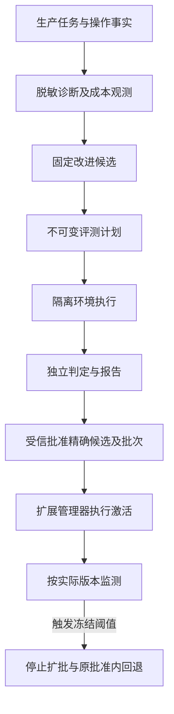
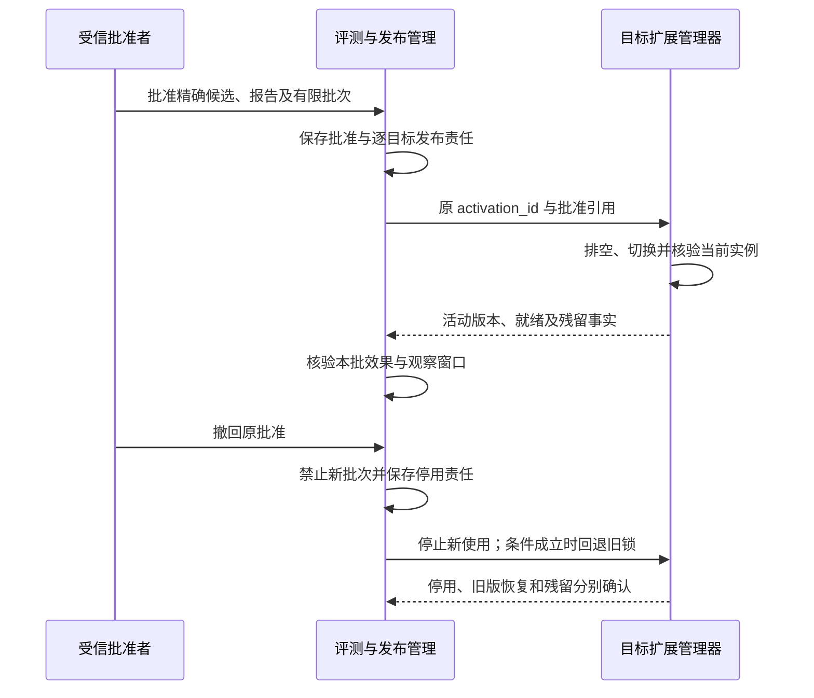

# 运行观测、能力评测与受控改进

[总览](README.md) · [项目目标](goals.md) · [系统验收](validation.md) · [版本激活](extensions.md)

本模块让一次任务可以诊断、让能力可以重复测量，并把有证据的改进送到有限发布范围，覆盖 C8、C9。运行观测保存诊断线索；评测保存固定计划和独立判定；发布批准保存允许启用什么；扩展管理器保存每个目标实际运行什么。它们共享关联标识，不合并成功含义。

默认复用宿主数据库、持久 job 和内容库。没有必需的隔离环境、独立真值或获准评测数据时，相应计划拒绝开始；不从任务自己的“成功”状态推断效果达标。当前文档给出契约及验收方法，未提供实际成功率或容量结果。

## 1. 观测事实与效果证据分别保存

关键业务决定、授权消费、操作效果及原命令回执保存在所属模块；观测丢失不能阻止原操作恢复。诊断事件只记录时间、关联 ID、版本、阶段、错误分类、时延及用量摘要。正文、提示词和截图默认不进入通用日志，需专项用途许可时使用受控内容引用。

默认增加 OpenTelemetry 适配器，通过 Span 表达一次处理，通过 Link 关联重试、子任务和异步收尾。OpenTelemetry 的 Link 支持关联同一或不同 Trace，便于诊断长任务；业务恢复仍按 task_id/operation_id/command_id 查询。依据：[OpenTelemetry Tracing API](https://opentelemetry.io/docs/specs/otel/trace/api/)。

业务记录需要恢复完整性；Trace 可以采样，样本缺失必须可见。延迟、错误率和用户资源隔离使用有界标签聚合，不把用户正文或任意任务 ID 放入高基数指标标签。获准诊断时再按受控关联 ID 查询详细记录。

选择“固定计划＋隔离成对比较”作为改进默认依据。直接比较生产日志更便宜，但用户目标、数据和环境变化会混入结论；生产监测用于发现退化，不直接声称因果收益。只有稳定分组、完整分母和明确用户数据许可具备后，才开展生产对照实验。

## 2. 计划冻结后，候选不能修改考题或判定器

EvaluationPlan 固定数据集版本、样本集合、基线与候选安装锁、环境、判定器、预算、重试及失败口径。创建后不可修改；调整产生新 plan_id 和摘要，旧报告继续指向旧计划。开始运行前再次检查数据用途、环境准备及预算，来源失效时暂停或拒绝受影响样本。

基线与候选各自从同一冻结初始状态运行，不共享可被前一运行修改的设备或记忆。样本的实际输入引用、种子、初始状态摘要和最终真值引用一并保存；需要网络实时性的样本注明获取时点及不可完全回放的部分。评测样本复制前按内容 owner 登记受管持有者，不能把生产日志默认视为获准训练或评测材料。

评测环境提供方实现 prepare、inspect、observe_truth、seal 和 destroy。prepare 按 run_id 幂等创建隔离环境，固定初始数据与种子；候选只接触任务侧观察与动作入口，不能读参考答案、改判定器或伪造真值。判定器通过独立只读通道取得效果证据。代码候选的评测依赖通过验收的代码隔离，数据型 Skill/配置候选也不能修改运行器与评分配置。

每个样本运行固定目标与预算。计划允许的重试生成新 attempt_id，但样本 ID 和原操作恢复身份不变；效果未知时仍按[执行规则](execution.md)核对，不能为了得到一个可评分答案重复未知写动作。样本结束后先封闭新动作并核清允许的在途责任，再取最终真值、评分和清理环境。

### 环境交接与取消

环境提供方是可替换 SDK 适配器，默认与评测工作者一起部署；它保存实际实例及封闭事实，评测数据库保存 run 与该实例的唯一映射。接口的操作键在首次调用前写入 run 的 job，不能以新实例掩盖原实例失联。

| 环境方法 | 输入与输出 | 效果确认 |
| --- | --- | --- |
| prepare | run_id、环境版本、初始状态/种子、额度；返回 environment_id | 环境已耐久登记且准备完成；答复丢失按原 run_id 查询 |
| inspect | 原 environment_id 或创建 run_id；返回当前实例、动作入口及责任 | 未找到必须说明查询范围；暂时未找到不证明从未创建 |
| observe_truth | 原环境、观测切点、判定器身份；返回受保护真值引用 | 只允许独立判定器读取，返回证据版本及仍在途动作 |
| seal | 原环境、原控制 ID；返回已封闭新动作及未终结工作 | 环境 owner 裁决实际封闭，命令接纳不能代替完成 |
| destroy | 原环境、封闭证据、清理策略；返回逐载体清理与残留 | 未 seal 或仍可写时拒绝销毁；清理失败沿原管理命令继续 |

用户取消评测后，运行器禁止新样本及新目标动作，为全部已创建环境保存 seal 责任。已完成样本保留原结果，未完成样本按冻结的中断口径记录 reason=cancelled；封闭及清理继续，即使评测的总期限已经结束。取消与准备答复丢失竞争时先核对原 run_id 是否创建环境，不提前释放全部配额。

联网问答既测固定内容回放，也测带实际取得时间的联网样本；两者结果分别报告。模拟手机环境提供多个独立设备、可观察 UI 和受保护的真实状态，点击、滑动、输入、返回、取消和接管都用实际状态变化判定。任务侧截图与判定侧真值不能来自同一份模型自述。

缺失证据、未知效果、超出次数和候选自身异常按冻结口径进入结果，不能删掉失败样本提高成功率。运行基础设施故障单列无效样本及覆盖缺口，完整分母仍可查；重测同一冻结样本必须保留原 run_id 的失败记录。量化口径和阈值由[系统验收](validation.md)集中定义。

## 3. 报告、批准、激活与回退

报告绑定 plan_id、全部运行结果与证据摘要，给出契约符合性、实际任务效果、时延、成本、样本覆盖和缺口。独立判定器可以是规则、受保护的真值检查或固定模型评估；主观评分必须声明评估模型、提示版本和不确定性，不能伪称客观证明。

改进候选包括记忆提案、Skill、执行策略、Agent 配置和可审查代码补丁。常规记忆更新按已有用途授权进入[记忆系统](memory.md)，不要求为每次用户偏好修订走软件发布；宣称效果改善仍需报告。Skill 和配置需通过评测后按批准范围逐步启用，插件与内核代码还必须经维护者审查。

批准固定候选制品、报告、有限目标集合、批次划分、观察窗口、退出阈值、期限及精确回退版本。用户或维护者通过[受信确认入口](interaction.md)批准，模型和候选自身没有此权限。一次批准可以预先包含多个有限批次；扩大目标集合、更换候选或降低阈值都需要新的批准。

发布 job 为每个目标创建唯一 activation_id，通过[扩展激活接口](extensions.md)交接。批次只有在所有目标报告实际绑定且 ready、观察窗口及最小样本均满足时才进入下一批；节点离线、样本不足或激活未知时等待或停止，不把命令 applied 当成整批成功。

远端在线激活或启动一项新工作前，目标节点以固定 use_id 调用 evaluation.approval_check，绑定 activation_id 或业务 work_id、目标、精确安装锁及当前实例。批准服务在当前批准有效时持久保存一次启动回执，返回 approval_revision 和 start_before；初始待测窗口为 30 秒，并受批准到期限制。max_offline_window=0 仅关闭离线续用，不把在线启动窗口缩为零。

处理端须在 start_before 之前登记该动作已使用回执，并在实际启动门禁再次核对期限；只启动绑定的原动作，回执不能用于任意新工作。同一 use_id 查询或重投返回原截止时间，不续期；到期且已证明原动作尚未启动时，可用新 use_id 核验当前批准，不能修改旧回执。回执已签发后短暂断线，只允许尚在窗口内的这一固定动作启动；不获得断网后继续创建其他工作的资格。已知撤回立即停止新启动；撤回未到达时可能在这段在线窗口内启动，必须如实报告这一竞态边界。

离线续用另由 evaluation.approval_lease 显式分配，只有 max_offline_window>0 才允许。租约绑定已激活的目标、锁与实例，返回 lease_id 和 continue_until，期限取批准到期及已批准离线窗口中的较早者；同一租约查询不延长期限。它只允许已有批准范围内的新工作，不允许离线激活新版本或扩批。期限到达或获知撤回后关闭新使用，远端持有者适用[离线时间与防回退规则](security.md)，重启不能沿用旧实例租约。

全本地批准与宿主共库时，把当前批准核验与启动登记放在同一事务，无需在线回执、离线租约或公网依赖。撤回响应只表示发布管理已保存决定与传播责任，节点尚未确认时保留未确认范围；批准检查与业务 Grant 始终分别成立。

达到退出阈值或撤回批准时，管理器先停止扩批并向目标发送停用。只有已预先批准的精确旧锁、当前格式兼容且旧版本信任仍有效时才自动回退；否则停用并报告恢复缺口。停用不会回滚已有外部效果，报告必须分别保留停止、旧版恢复和在途责任。

## 4. 不可变计划与可更新运行记录

| 对象／字段 | 权威与约束 |
| --- | --- |
| Observation：event_id、correlation、component_binding、time、kind、summary | 观测保存；correlation 引用业务 ID，summary 受数据最小化限制，不能代替业务账本 |
| Candidate：candidate_id、kind、artifact_ref、source_refs、baseline_lock | 精确制品及来源；评测期间不可修改，改动产生新候选 |
| EvaluationPlan：plan_id、digest、dataset_ref、sample_ids、split、seed | 精确且有界样本集合，区分开发集与保留验收集；冻结后不可换样本 |
| EvaluationPlan：baseline_lock、candidate_lock、environment_binding、judge_binding | 固定实现、配置、环境与判定器版本，候选无修改权限 |
| EvaluationPlan：metrics、thresholds、budget、retry_policy、invalid_run_policy | 阈值及失败口径运行前固定，禁止观察结果后降低门槛 |
| EvaluationRun：run_id、plan_id、sample_id、attempts、state、evidence_refs | state 为 queued、running、scoring、finished、blocked；blocked 保留继续责任 |
| EvaluationRun：outcome、usage、environment_ref | outcome 为 pass、fail 或 invalid；只有 finished 才有最终 outcome；清理状态独立 |
| EvaluationRun：cancel_requested、reason、environment_sealed、cleanup_state | 取消请求、实际封闭分别记录；cleanup_state 为 pending、cleaned 或 residual，清理未完不删除原环境映射 |
| EvaluationReport：report_id、plan_digest、run_refs、metrics、coverage、gaps、digest | 发布后不可改写；补跑生成新报告引用原结果 |
| ReleaseApproval：approval_id、revision、candidate_digest、report_digest、targets | 精确目标集合；state 为 active、revoked、expired，撤回后不可复活同一批准 |
| ReleaseApproval：approved_by、confirmation_ref、max_offline_window | 绑定受信批准主体与精确确认；离线续用上限默认零，非零必须明确批准 |
| ReleaseApproval：batches、window、minimum_samples、stop_rules、expires_at、rollback_lock | window 是每批观察窗口；回退锁可为空，为空不声称可自动恢复 |
| ApprovalUse：use_id、approval_id、approval_revision、target_id、lock_id、instance_id、action_kind、action_id、start_before | action_kind 为 activation 或 work；action_id 对应原 activation_id/work_id；固定回执由批准服务保存，处理端保存原动作的使用登记 |
| ApprovalLease：lease_id、approval_id、approval_revision、target_id、lock_id、instance_id、continue_until | 只对显式获准离线续用的已激活实例分配，不用于激活或扩批 |
| Rollout：rollout_id、approval_id、target_activations、current_batch、state | state 为 running、waiting、stopped、finished；逐目标事实来自扩展管理器 |

批准者身份、认证证据和管理权限使用[安全合同](security.md)。报告摘要防止引用对象悄然改变，但摘要本身不能证明判定器可信；运行环境和受信写入口仍须保证候选不能篡改证据。

| 方法 | 业务输入／输出 | 持久成功及后续责任 |
| --- | --- | --- |
| evaluation.plan_create | 候选、数据、环境、判定及预算；返回 plan_id/digest | applied 表示冻结计划已保存，尚未运行 |
| evaluation.run | plan_id、明确样本子集；返回 run_id 集合 | 一次保存运行与创建环境 jobs；每样本由原 run_id 恢复，不能隐式换环境逃避未知效果 |
| evaluation.cancel | 原 run_id 集合、预期控制修订、原因；返回已保存控制与待封闭环境 | applied 只证明停止新工作及封闭责任保存；各环境 seal 结果分别确认 |
| evaluation.read | 计划、run 或 report ID；返回获准事实及缺口 | 只读；来源正文仍按当前用途许可单独读取 |
| evaluation.approve | 精确候选/报告、批次、期限、退出及回退策略；返回 approval_id | 受信批准及发布 job 同事务保存后 applied；不证明目标已经激活 |
| evaluation.revoke | approval_id、预期修订、原因；返回固定撤回决定及未确认目标 | 保存撤回、停止扩批和逐目标停用责任；发布管理持续查询原命令 |
| evaluation.approval_check | use_id、approval_id、目标、精确锁、实例、action_kind/action_id；返回 ApprovalUse | 通过 Command 持久保存固定在线启动回执后 applied；只证明原动作在有限窗口内获准，同一 use 查询返回原截止 |
| evaluation.approval_lease | approval_id、已激活目标、精确锁、实例、所需窗口；返回 ApprovalLease | 仅 max_offline_window>0 且当前批准有效时持久分配；不证明实例已启动任何工作 |
| evaluation.rollout_read | rollout_id；返回每目标实际绑定、就绪、停用及恢复缺口 | 汇总可以部分完成，不能用全局状态掩盖单节点未知 |

环境销毁采用原环境管理命令；sealed 表示候选已不能继续写入，cleanup_state 单独表示物理清理。无法 seal 时保持 blocked 和额度占用，继续查询原环境，禁止直接创建新环境替代原责任。数据撤销按[内容治理](memory.md)停止后续使用并清理受管评测副本。

Rollout.finished 表示有限批次已执行及观察完毕，不解除当前活动节点的批准检查、撤回传播或回退责任。逐目标映射保留到目标停用、残留已核清及必要保留期结束；审批到期后产生停用工作。尚未活动的节点不再继续原批准，需新批准才能加入。

典型拒绝有 plan_conflict、source_unavailable、environment_unavailable、evidence_incomplete、approval_inactive 和 rollback_unavailable。调用方可以修复依赖后恢复原 run、查询原环境、停止发布或提交新的明确计划；不能修改旧计划、删除原失败或把停用改标为旧版恢复。

## 5. 异常交接与可观察验证

| 用例 | 前置／刺激 | 可观察结果与目标 |
| --- | --- | --- |
| EV-01 | 候选尝试改参考答案、评分阈值或提交伪造真值 | 隔离拒绝；报告保留攻击或失败，不产生有效通过；C8、C9 |
| EV-02 | 执行效果未知且评分进程重启 | 沿原 run、环境和操作核对，未知不计成功、不重复未知动作；C4、C8 |
| EV-03 | 删除失败样本或修改冻结计划后重交同 ID | 摘要或幂等冲突，原分母和失败仍可查；C8 |
| EV-04 | 批准后在一个节点激活答复丢失 | 查询原 activation_id，仅按实际就绪推进，其他目标结果保持独立；C9 |
| EV-05 | 激活与撤回竞争，部分节点离线 | 新批次停止，在线节点封闭新使用，离线目标标未确认并受有限窗口约束；C7、C9 |
| EV-06 | 新版改变状态格式后触发回退 | 兼容才报告旧版恢复，不兼容只报告停用与缺口；C9 |
| EV-07 | 观测后端丢失或采样关闭 | 任务照常按业务账本恢复，诊断显示缺口，验收不冒充完整取证；C5、C8 |
| EV-08 | 评测数据被撤权，环境清理暂时失败 | 后续使用停止，报告标来源缺口，物理清理继续有责任与残留；C2、C7 |
| EV-09 | max_offline_window=0，远端在线检查及同 use 重投 | 原动作可在有限 start_before 前启动；重投不延长窗口，断网不能凭它启动其他工作；C5、C9 |
| EV-10 | 在线回执签发后撤回，分别注入已知撤回和通知延迟 | 已知撤回端立即禁止新启动；未知端仅原动作可能在在线窗口内启动，状态保留竞态事实；C7、C9 |

评测并发、环境数、单样本时间、总调用费和保留字节必须由计划和宿主共同限定；耗尽时停止接纳新样本，保留原环境封闭与清理预算。生产任务与评测分配独立资源份额，避免候选压测耗尽取消和恢复容量。服务规模、专项质量及 1000 项 API 的证据由[系统验收](validation.md)汇总，不能由一次演示或接口结构合法替代。
