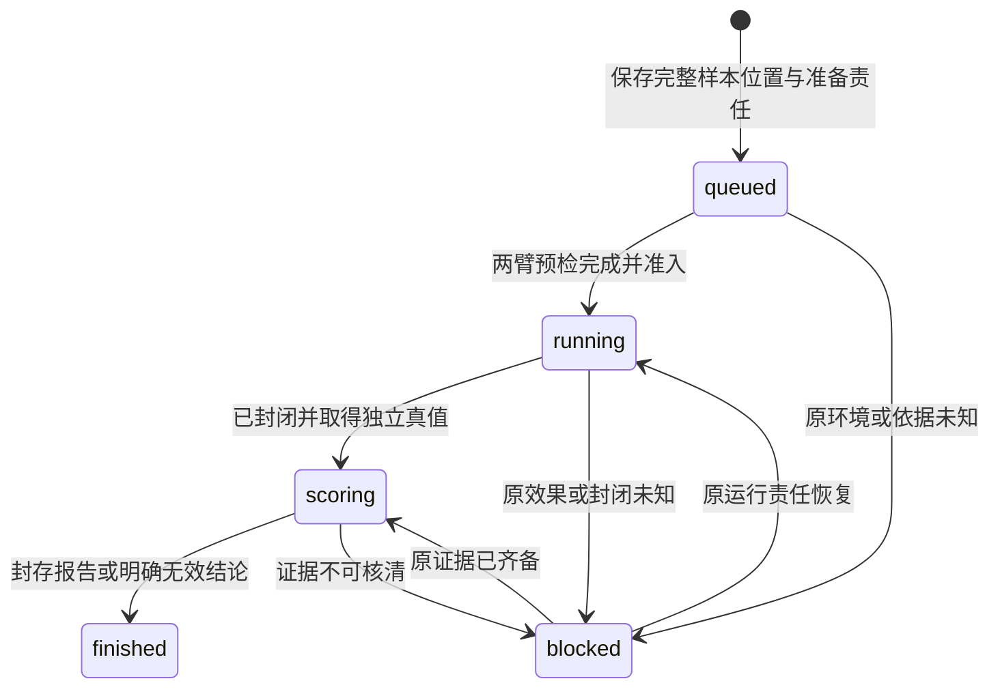
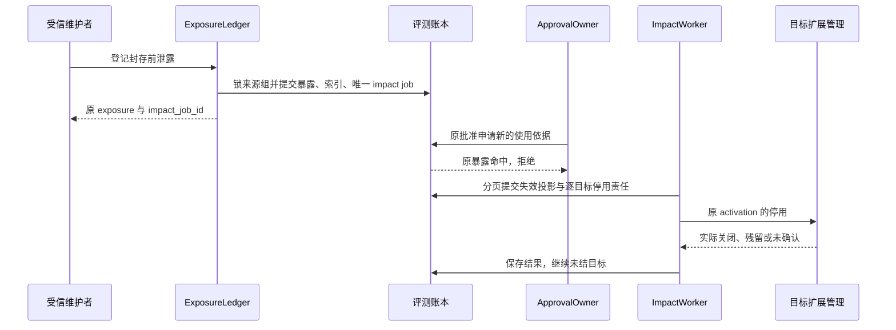

# 观测、评测与受控发布

评测模块把精确候选、冻结实验、独立证据和受信批准连接成可恢复的发布过程。观测解释发生了什么，报告回答候选达到了什么，批准限定可以启用什么，[扩展管理](extensions.md)确认目标实际运行什么；四者共享关联身份，分别保存成功事实。

统计分母、指标、阈值与比较方法唯一归 [验收规格](validation/README.md)，本文定义实现这些判断所需的账本和时序。字段归 [contracts/schemas/](contracts/schemas/)，实现与验证状态见 [review.md](review.md)。

## 组件与依赖

评测 owner 保存治理账本，独立实验池运行候选，发布工作者按固定目标推进。计划、来源组、正式次数、报告适用性和批准在同一权威事务范围内裁决；环境与目标实例的物理事实由原适配器返回。

| 组件 | 责任 | 外部依赖 |
| --- | --- | --- |
| CandidateRegistry / DatasetRegistry | 精确制品、候选谱系、数据用途、来源组与占用 | 内容 owner、受信维护者 |
| PlanService | 冻结计划、永久正式尝试序号和准入 | 准确安装清单、判定器与环境声明 |
| RunCoordinator / EnvironmentAdapter | 固定样本、尝试、环境创建、启动、封闭和清理 | 独立隔离环境、受保护真值通道 |
| ReportSealer | 完整分母、证据与不可变报告 | 内容库、固定判定器 |
| ExposureLedger / ImpactWorker | 原暴露事实、同步资格核验、分页影响处理 | 来源组索引及各环境/目标 |
| ApprovalOwner | 本 owner 的确认消费、批准、有限使用、撤回 | 受信人类会话、可信时钟 |
| RolloutWorker | 逐目标激活、观察、扩批和停用/回退 | 原扩展 owner |

这些组件复用 [可靠工作模板](reliability.md)，每轮先读当前领域阶段，再执行有限事务或外部调用。样本、环境、封存、影响扫描、发布及清理使用各自稳定作业键；作业重领不增加样本、物理尝试或正式次数，也不刷新启动窗口。业务锁后才锁作业记录，受领取保护的写回与下一责任同事务；迟到可信环境事实走原对象归并入口，失效领取不能直接提交评分或推进发布。

## 数据模型与状态机

EvaluationRun 是一份冻结计划的唯一整体运行，SampleRun 是一个样本在一个实验臂上的逻辑位置，Attempt 才是物理尝试。分批、恢复和安全重试保持原 Run、样本与分母。

| 对象 / 参考表 | 身份与唯一性 | 决定的事实 |
| --- | --- | --- |
| Candidate / candidates | candidate_id、digest、improvement_id | 精确制品、父谱系、基线和发布目的 |
| ImprovementPolicy | improvement_id 唯一 | 正式次数、停止规则、候选范围、整个过程推断方法 |
| DatasetPartition / partition_sources | partition_id；来源组关联 | development/selection/holdout 用途、准确样本、来源与权限 |
| HoldoutReservation | partition_id、plan_id、release_request_id 分别唯一 | 候选、正式申请、计划与独立测试集的永久绑定 |
| formal_attempts | `(improvement_id, attempt_index)` | 不因失败或取消返还的正式次数 |
| EvaluationPlan | plan_id、digest | 冻结样本、种子、清单、环境、判定、预算、统计与停止规则 |
| EvaluationRun / SampleRun / Attempt | plan 唯一 run；`(plan_id,sample_id,arm)` 唯一位置 | 整组运行、每臂结果、全部物理尝试与费用 |
| Environment / sample_start_admissions | environment_key 唯一；原样本臂、阶段及 attempt | 原实例、有限启动依据、封闭和清理责任 |
| Report / PlanEligibility | report_id/digest；plan_id/revision | 不可变报告与可滞后的当前适用性投影 |
| FeedbackExposure / source_group_gates | exposure_id；来源组/revision | 暴露范围、发生时间、证据及正式准入同步门禁 |
| exposure_impact_jobs | exposure_id 唯一 | 稳定扫描游标和逐项失效、封闭、撤回责任 |
| ReleaseApproval / ApprovalUse / ApprovalLease | approval_id、use_id、lease_id | 有限目标批准、准确动作的在线窗口、既有实例离线窗口 |
| rollout_targets / rollback_targets | `(approval_id,target_id)` / `(source_approval_id,target_id)` | 固定激活身份与每目标实际状态；回退不覆盖旧批准原发布记录 |
| closed_governance_keys | 原 owner、对象种类与身份 | 清理后仍保留次数、占用、关闭和暴露摘要 |

所有唯一键包含租户与原 owner。报告、样本正文按用途清理，正式次数、独立测试集占用、来源与暴露的最小索引继续保留；正文 gone 不允许重造报告、重跑原计划或把旧数据标为全新证据。

下图描述 Run 的工作阶段，箭头是证据足够后的阶段推进；取消、环境封闭、费用和清理独立于这个阶段。

`completed_samples` 只计全部所需臂已有最终结果的样本。内部 outcome 为 pass/fail/invalid，unknown 责任单独保存；公开 Run 不用单样本字段冒充整体进度。Run finished 不证明环境已销毁，`cancel_requested、environment_sealed、cleanup_state` 分别可查。

## 观测与失败归因

业务账本保存决定、效果、授权和费用，观测系统保存可采样诊断。默认 OpenTelemetry Span 表示一次处理，Link 连接异步、重试与子任务；恢复始终使用原 command/task/operation 身份。

通用日志只含关联 ID、精确组件版本、阶段、时间、错误、时延和用量摘要。提示词、截图和正文需专项用途许可并通过受控内容引用获取；指标使用有界标签，不把正文或任意 Task ID 作为高基数标签。Trace 缺失必须明确，但不影响原业务恢复。

| 归因类别 | 应核对的证据 |
| --- | --- |
| 目标覆盖 | 原目标、条件集合和覆盖报告；已登记条件全 pass 仍可能漏掉原要求 |
| 检索、选择、上下文 | 候选完整性、实际加载版本、最终输入与缺口，区分未召回、选错、加载迟和压缩丢失 |
| 参数、准入、资源 | 准确能力与参数、原准入决定，区分合理拒绝、错误拒绝和错误目标 |
| 传输与恢复 | 原命令、发送与查询事实，区分失答复、未执行和仍未知 |
| 工具语义与效果 | 独立目标真值、页/字段/时间范围，识别包装器漏页等问题 |
| 验证与呈现 | 判断规则、参考真值、Result 和 UI 修订，区分错误放行、误挡、unknown 和夸大 |

报告保留最早可证实问题、直接证据、后续影响和并存因素；无充分证据则归因未知。第二判定器仅可按冻结计划用于敏感性分析，其分歧不自动构成真值，也不能运行后挑有利判定器。

## 候选、数据与计划准入

正式改善先结束候选选择，再用未暴露独立测试集确认；开发、选择和确认的数据按来源任务组隔离。相同任务的改写、派生和重复种子属于同组，字节不同不自动独立。

| 计划用途 | 数据及报告 | 可以支持的批准 |
| --- | --- | --- |
| development / selection | 调试或选择；exploratory | 不支持正式改善 |
| compatibility_check | 契约、安全前提、环境和格式；conformance | compatibility，不声称相对能力改善 |
| release_confirmation | 固定候选、未暴露 holdout、正式过程策略；formal | improvement，全部适用验收要求须通过 |

候选开发者可读获准的开发与选择材料，不能读 holdout 答案、逐例评分或汇总成绩。受信维护者登记来源组和访问范围，保留全部候选、失败、取消和未形成报告的尝试。改名、换发布申请或新 improvement_id 都须关联既有来源，不清除历史。

### 正式次数与独立测试集占用

每个 release_request_id 只绑定一个候选、一份正式计划和一个独立测试数据子集。plan_create 同事务保存三者绑定、HoldoutReservation 和 ImprovementPolicy 的下一个 formal_attempt_index；竞争同申请或同数据子集只有一方成功。占用后即使取消或环境准备失败也不返还，原计划恢复保持原次数。

ImprovementPolicy 在首个正式计划前由受信维护者冻结候选范围、次数上限、停止规则和整个过程的比较/推断方法。默认只允许一次正式确认；多次须在任何 holdout 反馈开放前规定多重比较或序贯方法。缺策略或适用方法时可报告比例，但统计和改善判断为 inconclusive。换未暴露数据是必要条件，不许可不断换申请试到通过。

正式数据登记须确认来源组覆盖完整，并限制组数，使一次完整暴露范围能在协议上表达。历史来源缺失或超出上限时采用 [暴露处理](#exposure)的保守隔离，不截断证据继续正式使用。

### 创建计划的事务

PlanService 在事务外解析准确引用，再按原命令、tenant/owner 正式控制记录、升序来源组、计划/策略/占用的稳定顺序锁定并重读。它检查样本为获准子集、用途及来源有效、清单和环境/判定器固定、预算/期限/重试有界；正式用途还直接查询原暴露与 formal_quarantine，并核对剩余次数。成功后一起提交计划、次数、占用和原回执，无后续责任时不创建空 job。

EvaluationPlan 固定实际输入、两臂清单、环境、判定器、样本和种子、热身与缓存条件、抽样与相关结构、指标、阈值、最小实用改善、逐类退化、预算、重试、停止及整组无效口径。任何调整产生新计划，原正式绑定不改指新计划；改善失败也不能原地改为兼容发布，须另立明确申请并保留失败历史。

组件对照先在选择数据中一次改变一个策略，再验证有单项依据的组合。候选锁定模型、提示、包装器、Skill、上下文、记忆、验证器和限额；质量、安全与必要效果条件在两臂保持。构建、维护和评测成本单列，按预先声明的复用量摊销，复用不确定时报告区间或收支平衡条件。具体矩阵、指标与净收益口径见 [验收规格](validation/README.md)。

## 运行、评分与取消

run 接纳在一笔事务中保存唯一 Run、全部 SampleRun 位置和初始准备 jobs。同 plan 的另一 run_id 返回 precondition_failed 并关联原 run；分批和有限重试沿原位置进行。正式接纳再次按共同锁序检查来源组暴露与 quarantine。

### 环境责任

运行器在任何一臂启动前完成整对环境预检。两臂从相同冻结初始状态独立运行，不共享可变设备或记忆；冻结种子决定样本与两臂顺序。复制样本前向内容 owner 登记持有者，网络样本保留实际取得时间和不可完全回放范围。

| 环境接口 | 固定身份与成功点 | 失答复后的动作 |
| --- | --- | --- |
| prepare | 预存 environment_key 唯一绑定 run/sample/arm，准备完成后返回实际 environment_id | inspect 原 key，核对映射 |
| start_sample | 原环境、样本臂和 attempt，物理启动前核验有限许可和未 seal | 查询原 attempt，不创造替代动作 |
| inspect | 原 key 或 environment_id，返回实例、入口和残留责任 | 查询范围不明保留未知 |
| observe_truth | 原环境、观测切点、独立判定器 | 保留真值版本及在途动作 |
| seal | 原环境与控制身份，确认禁止新动作和未结工作 | 查原控制，保留封闭责任 |
| destroy | 原环境、封闭证据及清理策略，返回逐载体清理和残留 | 原命令继续；未 seal 或仍可写时拒绝 |

每次 prepare、首轮样本和重试交给环境前，评测 owner 在短事务中锁来源组，核对原暴露与 quarantine，保存绑定 run/sample/arm、阶段、attempt 和 gate_revision 的有限 `start_before`。EnvironmentAdapter 在实际启动前向原 owner 可认证查询，或验证其签名许可，再核对准确身份、实例及期限；不能信 worker 自报期限或 gate_revision。跨机时钟按 [ClockAdapter](deployment.md)保守换算，许可上限由宿主固定并通过撤回实验验收。

暴露先提交时拒绝新逻辑启动；许可先提交时只允许原动作在固定窗口内物理启动。环境已知暴露或 seal 后拒绝旧许可。队列中 job 不提供启动资格，新 attempt 需要新许可；未知写动作先按 [执行](execution.md)核对，不能为了评分重做。

### 报告封存

样本结束先封闭新动作、核清允许的在途责任，再取最终真值、按固定判定评分并清理。候选只见任务侧观察和动作端口，独立判定器从保护的只读通道取得真值；候选不能改计划、评分表或伪造真值。

ReportSealer 在事务外构造完整正文与摘要，事务内按共同锁序核对计划、全部样本修订、来源用途、原暴露与 quarantine 后封存。计划及来源组的规模须在装配上限内，使该最终核验可在有限事务完成。report_id 只对应一个摘要，后来的暴露改变适用性，保留报告内容。

报告分别记录 target_attainment、statistical_gate、improvement_gate 的 applicable、pass/fail/inconclusive 与原因；conformance 的不适用质量项不能标 pass。正式改善还须 contract_gate 全部通过。具体计算顺序、分母、比例目标、统计条件和分类退化见 [验收规格](validation/README.md)。

双方启动前预检失败记 invalid 并形成覆盖缺口；启动后的提供方及基础设施错误保留在冻结分母，unknown 不计已证明成功。仅预先固定的整组无效条件可使报告 inconclusive，不逐例剔除坏结果或挑最佳 attempt。

受信发行报告可经内部 import_conformance 端口导入，核验签名、来源、制品摘要和目标环境范围，保留外部运行身份并另记本机预检。该端口不接收 formal 报告，不伪造本机实验，也不开放普通调用方直接写成绩。

### 整体取消

cancel 先封闭 run 的新工作并为全部已创建、创建未知环境保存 seal 责任，再返回 applied。已完成结果保留；未完成位置按冻结中断规则记录 cancelled。封闭后仍核对效果、账务和 destroy；无法 seal 时 blocked、保留预留及原 key，不另建环境掩盖失联。总期限结束不取消清理责任。

## 暴露与证据适用性

原暴露事实在提交后立即参与正式准入，影响扫描只负责补投影和逐项传播。PlanEligibility 可以滞后；计划、运行、环境/样本/重试启动、报告封存、改善批准、ApprovalUse、ApprovalLease 和扩批都直接检查原暴露与 formal_quarantine，不能凭旧 eligible 放行。

### 反馈开放与异常泄露

feedback_open 只对完整封存报告开放获准反馈。它在输出前保存 exposure、准确来源组、主体、报告摘要、范围、时间、唯一 impact job 和原回执，再通过内容端口按当前权限返回；失答复仍已暴露。evaluation.read 在开放前只给进度、封存状态、当前适用性和准备故障，不泄露成绩、逐例答案、通过状态或可反推成绩的错误细节。

正常封存后反馈保持本报告适用性，禁止该数据进入后续正式确认；同来源组尚未封存的其他计划会受影响。非受控暴露发生在封存前、等于封存切点或发生时点不明时，正式资格失效，即使事后才发现也生效。已经封存的报告保留原摘要，读取同时返回当前适用性和原因。

受信维护者用 exposure_record 登记外部泄露，可没有 report_id。范围必须覆盖所有可能受影响组；无法缩小时取完整来源组集合。历史关联不全或超协议上限时，先经受信管理入口持久登记证据与 formal_quarantine，封闭该 owner 全部正式改善准入，再拆分准确可表达范围逐条登记和核对，完成后才解除隔离。

### 同步门禁与分页传播

DatasetRegistry 在登记时创建 source_group_gates。所有正式准入、反馈和暴露事务按相同 tenant/owner、升序来源组锁序执行；资格核验取共享锁，暴露取排他锁并推进 gate revision。暴露接纳事务只保存有限来源组、原事实、固定回执和一个 impact_job_id，不遍历全部计划。

ImpactWorker 按稳定来源关联索引分页。在每页事务中共同推进游标、写失效投影、环境 seal 和每 approval/target 的唯一撤回责任；扫描最后一页交接完成后结束，未完成的下游责任继续存在。并发新增责任不能被旧 worker 完成或退避覆盖。

下图只回答“批准已提交后发现更早泄露，何时停止新增使用”；箭头表示事务和传播，原暴露提交是新准入的同步判定点。

正常报告 A 开放反馈时，共源但未封存的 B 计划立即失去新准入与正式封存资格，扫描随后封闭环境。B 已逻辑准入的有限窗口动作与已发生效果仍沿原环境核对。撤回答复未知查询原目标，不把“已发控制”写成实际关闭。

## 批准与逐目标发布

批准者通过本评测 owner 的可信确认决定精确命令；ApprovalOwner 在同一批准事务核对并一次消费 Confirmation，保存批准及逐目标发布责任。候选、模型或 UI 自报同意没有批准权，确认通用规则归 [授权](authorization.md)。

approve 固定候选/报告摘要、有限目标集合、批次、观察窗口、最小样本、退出阈值、期限和回退引用。compatibility 核对 conformance、用途和格式；improvement 核对 formal、当前适用性及全部适用验收条件。改善事务也按来源组锁序直接检查原暴露；不可核验时不批准。

RolloutWorker 为每个目标保存唯一 activation_id，在发送及扩批前检查当前批准。只有本批全部目标实际绑定且当前 ready，观察窗口和最小样本满足且未触发阈值，才推进下一批；离线、激活未知、观察不足时等待或停止。扩大目标、更换候选或放宽阈值需新批准。

### 在线启动与离线续用

远端每项 activation、reopen 或 work 使用固定 use_id 向 approval_check 申请准确动作的启动依据。ApprovalOwner 核对目标、清单、实例、当前批准和证据适用性后保存 ApprovalUse；`start_before` 取批准到期与在线上限的较早者，参考上限为 30 秒。处理端在窗口内登记使用，实际启动准入再次核验期限和已知撤回。

| 依据 | 适用动作 | 恢复规则 |
| --- | --- | --- |
| 本地共同事务 | 批准 owner 与宿主共库的准确动作 | 当前批准、可信到期检查和动作登记一起提交，记录 commit_id；不伪造远端回执 |
| ApprovalUse | 一项 activation、当前代际的新实例 reopen、或一项 work | 原 use 返回原截止，不能复用给其他动作；到期且已证实未启动才可用新 use 核验 |
| ApprovalLease | 已激活目标与当前实例的显式离线续用 | `max_offline_window>0` 才可分配，期限不晚于批准到期与获准离线窗口；不能激活、扩批或转给新实例 |

`max_offline_window=0` 只关闭离线续用，在线固定动作仍可在有效窗口启动。获知撤回立即禁止新启动，短暂失联仅保留原固定依据内的资格。重启须取得本次 reopen，旧实例租约（lease）不继承；ClockAdapter 的时间信任改变或宿主暂停后先停止依赖旧本地截止的启动，再按原依据保守核对，不延长旧窗口。

### 撤回与独立旧版批准

revoke 同事务保存 revoked、停止扩批和逐目标停用责任；到期也产生停用工作。Rollout.finished 只表示有限批次和观察结束，不解除活动目标的当前检查、撤回、残留和回退责任。

新版 `rollback_lock` 非空时必须引用同一批准 owner 的独立旧版 ReleaseApproval。approve 共同核对旧批准当前 active、准确清单、目标覆盖、期限不早于新版以及旧报告自身适用性；固定引用及接纳时修订，不冻结它未来有效性。无回退清单时禁止携带旧批准引用。

触发回退后，RolloutWorker 按原新版批准/目标保存唯一新 activation 和预期当前代际，再核验旧批准当前状态、证据、来源用途、旧代码信任和当前格式可读性，满足才交 [扩展管理](extensions.md)切回。新 activation 的 approval_id 是旧批准，后续 work/reopen 沿旧批准核验；新版撤回不连带撤回旧批准。目标或批准不可达、旧批准失效或格式不兼容时，只停用并保留恢复缺口。

后来发布已改变当前代际时，旧回退命令冲突，记录“原恢复已被后续发布取代”，不改预期代际覆盖新赢家。回退失答复只查原回退 activation；迟到新版停用仍绑定旧 activation。新版停止、旧版 ready 和残留责任分别报告。

## 失败处理与容量

评测 owner 按原对象恢复失败，拒绝通过换样本、环境、数据用途或批准身份掩盖问题。

| 故障或拒绝 | 状态与继续责任 |
| --- | --- |
| `plan_conflict / holdout_unavailable` | 查原绑定；另选获准数据或显式探索，保留原次数 |
| `source_unavailable` | 停止后续使用，关闭受管副本并保留清理 |
| `environment_unavailable` 或创建未知 | inspect 原 environment_key；不造替代环境 |
| 未知效果、提供方超时 | 留在原分母、原操作和费用账中核对 |
| `feedback_not_ready` | 等原报告封存，不开放逐例成绩 |
| `evidence_incomplete` | 保留未封存或无效结论，不补跑“挑好成绩” |
| 已批准后发现早期泄露 | 原事实立即阻断新资格；分页传播停用，保留原报告 |
| `approval_inactive / rollback_unavailable` | 停止新使用或扩批，只报告可确认的恢复范围 |
| 部分目标失联或仅 applied | 逐目标等待/停止，不宣称整批成功 |
| worker 重领或旧写回 | 保持样本、attempt 和环境身份，过期领取拒绝写回 |

实验、生产任务、发布、撤回和清理各有有限资源份额。计划约束样本并发、环境数、单样本时间、总费用及字节；新实验超限排队或拒绝，已启动尝试保留结算与环境关闭预算。横向扩容以独立样本臂和目标为单位，正式次数、来源组和占用不能复制为新的可用额度。

观测独立样本与物理尝试量、环境准备/封闭/销毁延迟、未知环境龄期、报告构造及持锁时间、暴露到逐目标停用的分段延迟、最老扫描游标和发布等待。逻辑 job 数、样本数不能代替真实调用或事务量。

## 保证与限制

评测账本保证计划不被事后改写、分母和正式次数不因恢复重置、报告不可变且当前适用性可追溯；前提是来源谱系可核查、数据用途有效、独立环境和真值通道成立。摘要只能绑定内容，不能证明样本独立、判定器可信或候选隔离；代码隔离、真实环境和统计推断须独立取得证据。

暴露提交同步阻断原 owner 的新正式准入，但不能撤销远端已经取得的有限启动窗口或离线租约；失联目标可能在原窗口内行动，已发生效果、费用、seal 与清理继续核对。批准不产生业务 Grant，也不证明实例已经就绪。

生产日志比较可发现退化，不能直接声称因果改善；固定覆盖集比例不自动推广为总体统计保证。运行、隔离、故障与容量验证要求见 [validation](validation/README.md)，结论状态仅见 [review.md](review.md)。

## 取舍

| 选择 | 代价 | 改选条件 |
| --- | --- | --- |
| 固定计划、隔离成对比较 | 环境、独立数据与完整费用成本 | 具备稳定分组、完整分母和用户用途授权后，可增加生产对照实验 |
| holdout 与正式次数不可返还 | 中断也消耗独立数据 | 只能通过反馈前预定的整体策略放宽，不能事后返还 |
| 同步查原暴露、异步补投影 | 来源组锁竞争与查询成本 | 可测量优化索引和批次，不能以旧投影取代当前资格 |
| 独立旧版批准自动回退 | 提前维护旧报告、目标、期限和格式兼容 | 旧批准不可用则停用；需要人工新批准后再恢复 |
| 观测与业务账本分开 | 诊断可能有采样缺口 | 不因提高诊断完整度而默认复制受限正文 |
