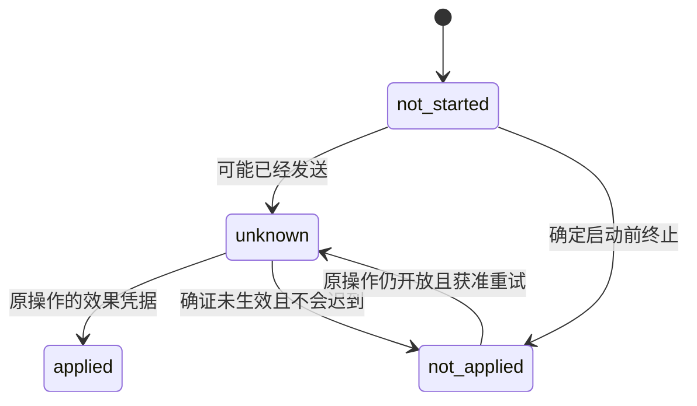
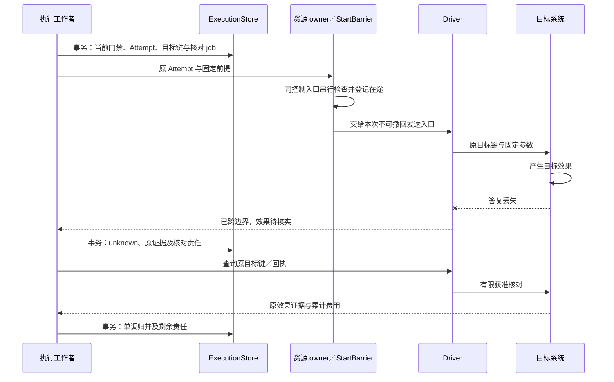
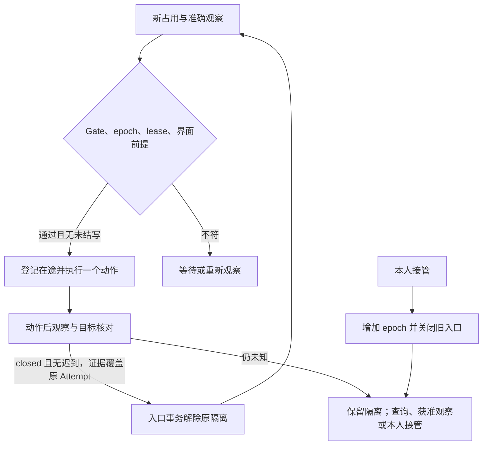

# Executor：操作效果与资源控制

Executor 使用固定能力和实例绑定执行 Orchestrator 已准入的有界操作，持久保存目标效果及核对责任；资源 owner 在实际发送入口裁决控制、占用和观察前提。

本篇定义操作恢复、能力装配、GUI 和受管文件。完整字段以 [protocol.schema.json](contracts/schemas/protocol.schema.json) 为准；命令与查询合同见[契约](contracts/README.md)，授权消费见[授权](authorization.md)，任务完成见[验证](verification.md)，实现和验收状态见 [review.md](review.md)。

## 组件与依赖

执行入口保存接纳，工作者推进原操作，StartBarrier 保护最后一个可拒绝旧控制的入口，Driver 提供目标证据；这些职责可共进程，跨 owner 时各自持久化原命令和后续责任。

| 组件／接口 | 输入与输出 |
| --- | --- |
| 执行命令入口 | 认证命令与容量 → 原回执／拒绝，接纳不等待目标动作结束 |
| CatalogPort.describe | 准确 capability／binding 引用 → 完整声明及当前可用性 |
| ExecutionStore.accept | 原 Invoke、认证 Orchestrator、规范摘要 → 唯一 Operation、接纳回执及执行责任 |
| GateStore.apply | 认证 ControlSnapshot → 单调门禁、逐入口落实事实及在途集合 |
| StartBarrier.enter | operation、attempt、当前 TaskGate、使用依据及资源前提 → 放行或启动前拒绝 |
| 固定 Driver.invoke／query／cancel | 原参数、目标键及尝试 → 目标凭据、结构化输出、发送／停止事实 |
| FactStore.apply | 原 Operation／Attempt、可信来源修订、证据和累计用量 → 新事实与后续责任 |
| 执行工作者 | 原工作领取 → 一次准备、原目标查询、停止或归并 |

Driver 的代码、配置、目标和凭据入口由 Binding 固定；模型只填业务参数。领域规则不依赖 WSS／gRPC 或具体 SDK，协议入口及 Driver 不能绕过门禁直接宣布效果。执行和资源 Store 是写权边界，同库可以共享受限事务，独立 owner 不构成跨库事务。

## 数据模型与状态机

Operation 保存一个不变意图及其持续核对责任，Attempt 保存一次实际发送；重复传送同一命令不是新 Attempt，更不是新 Operation。

| 记录 | 关键关系与约束 |
| --- | --- |
| CapabilityVersion | 固定行为、Schema、效果、重复、授权与限额；版本不可原地改义 |
| BindingRevision | 固定 capability、Executor、目标、Driver 和配置；当前 availability 另查 |
| Operation | `(tenant, operation_id)` 唯一，原 Invoke 和摘要不变；同身份异意图／执行端冲突 |
| Attempt／TargetCorrelation | 每次真实发送独立 attempt_id，保存准备和边界事实；目标幂等键归原 Operation |
| TaskGate／GateEntrance | 原 `(orchestrator, task)` 的最高控制修订；逐实际入口记录落实修订 |
| CancellationTombstone | 未见 Invoke 也保存原操作取消；[墓碑（tombstone）与终态保留](reliability.md)阻止迟到复活 |
| ResourceState／ResourceLease | 资源 owner 唯一写入 control_epoch、本人控制、占用及在途写集合；lease 绑定主体和实例 |
| Observation | 不可变设备、代次、界面修订、时间、焦点、坐标及准确截图／结构引用 |
| BillingOutbox | `(tenant, operation_id, revision)` 唯一，可信费用上调与交回责任共同提交 |

`execution_state=accepted / started / closed` 表示发送过程；`effect=not_started / unknown / applied / not_applied` 表示目标效果；`may_apply_later=true / false / unknown` 表示目标仍可能追加效果。closed 只封闭该操作的新目标发送，核对和费用可继续。

下图只描述 effect，箭头表示可证实的新事实或同一原操作获准的新尝试；任务状态和发送关闭不在图中。

applied 保存“声明效果曾实现”的事实；用户后来改动资源产生新观察，不撤销历史效果。只读 applied 表示取得声明的读取结果，质量评估 applied 表示取得报告，报告 verdict 仍可 fail。任务如何采用这些事实由[任务验证](verification.md)定义。

## 关键时序

### 接纳、准备、实际发送与核对

Executor 在接纳事务固定操作和后续执行责任，实际启动再检查当前控制、许可、期限、绑定、资源及观察。Receipt.applied 只确认执行责任已保存，目标成功以 Operation.effect 和证据为准。

| 接纳输入 | 本地裁决 |
| --- | --- |
| 相同原 operation 与意图 | 返回原记录，新 command 也不另建执行责任 |
| 同身份异意图／执行端 | idempotency_conflict，原记录不变 |
| 命中取消墓碑、任务终态或旧目标 | 保存／返回可查禁止事实，不创建可发送工作 |
| 有效固定意图和容量 | Operation、原回执及 execute job 共同保存 |
| 原存储不可核验或提交结果不明 | 保留未知，调用方查原 command／operation |

启动工作者在事务外取得原 use_id 的使用依据，准备事务检查 active/running、原目标、无取消、控制 start_before、operation deadline、使用窗口、绑定可用性、占用及观察，固定新 attempt_id、目标关联和核对责任。随后 StartBarrier 在资源 owner 再查最新 Gate、epoch、lease、观察和时间，持久登记在途责任，再交给驱动。

下图从已接纳写操作观察丢答复恢复；实线为调用，事务只覆盖本地 Store，入口临界区只串行交接，不持数据库事务等待目标答复。

执行准备之后崩溃即按“可能已发送”恢复，除非有可信入口证据证明未跨边界；不能从缺完成时间或 worker 超时推定 not_started。这与 [Brain 的 prepared／send_started](brain.md) 分支不同。驱动透明重试关闭，或每次物理请求完整暴露并经过能力的重复和计费规则。

控制在入口交接之前落实则拒绝本次发送；交接之后则列为在途，即使驱动尚未发出字节，也只能关闭后续发送并核对。独立资源 owner 先保存入站命令与在途责任，Executor 断连不丢已交接动作。准备或归并提交答复丢失时读取原 Attempt／Operation，不能凭“未看到 commit”重复发送。

结果正文或截图先以准确内容保存再提交可读取引用；附件保存失败留下内容缺口。目标已写成时保留真实效果依据，不因截图丢失改成未发生，也不虚构 ContentRef。

### 效果分类与允许重试

Executor 按“是否跨发送边界 → 有何目标凭据／查询能力 → 能力重复合同”的顺序决定恢复。HTTP 5xx、断连、空响应或暂时查不到记录都不能跳过效果判断。

| effect_class | 分类前提 | 允许恢复 |
| --- | --- | --- |
| read_only | 无目标业务副作用 | 在原授权、期限和预算内有限重取，记录每次费用及实际版本；旧读取成功仍须证据 |
| target_idempotent | 非只读，且目标提供同键同意图最多一次效果合同 | 先查原操作；仅在幂等键（idempotency key）作用域、保留期、参数及回放保证均仍有效时原键重放 |
| no_idempotency_guarantee | 其余操作，包括未能依赖目标幂等的操作 | 原操作仍开放、确证 not_applied 且 may_apply_later=false 才获准重试；否则只核对 |

目标显式拒绝且保证不迟到，才能报告确定未应用。幂等窗口到期保持原未知，不换键；相同意图换 API、GUI、Driver 或 Executor 属于新行动，Orchestrator 先证明不会重复原效果。补偿是独立操作、授权及预算，不隐含在 cancel 中。

FactStore 保持合法状态和修订单调：旧事实不覆盖新投影；applied 后资源改变另存观察；closed 拒绝新目标发送；unknown 只有原效果或不生效且不迟到证据才能核清。核对以每次一个有限查询推进，遵守能力和任务的最小期限及查询预算。自动额度耗尽后保存未知、必要权限和恢复条件，等待恢复事件、可信目标凭据或获准一次核查。

用户处置入口展示原操作、目标、发送时间、可能效果及现有证据，可接受目标回执、触发获准核查或结束自动推进。普通“我觉得完成了”只记录陈述，不直接消除未知；目标不能提供可信证据时保留该事实。

### TaskGate 与逐入口控制

TaskGate 约束原任务在执行端的所有操作，资源 control_epoch 约束设备占用代次，二者同时检查。Invoke 携带 Orchestrator 认证的初始 ControlSnapshot，execution.control 传播后续门禁；任一消息都可首次初始化，因此取消或暂停可以先到。

控制认证绑定原 Orchestrator、Task 和接收 Executor；模型不能签发。gate 只接受更高 control_revision，goal_revision 不倒退，同修订同内容去重、异内容冲突，更低修订返回当前事实。终态 gate 拒绝任何更高 active/running；恢复业务需要新 Task。

| 当前控制 | 可证明未启动的原操作 | 已可能启动的原操作 |
| --- | --- | --- |
| 同目标 paused | 保留 accepted/not_started，等待原 gate | 关闭下一次发送，尽力停止并核对 |
| 同目标 running | 新鲜凭据、使用和原期限齐备后唤醒 | 只沿能力允许的原恢复路径推进 |
| 目标修订 | closed/not_applied、无迟到并记 stale_goal | 保留原目标身份，核对旧效果 |
| 任务终态或操作取消 | 确定封闭并保存原因 | 封闭后续发送，在途责任保留 |

GateStore 更新与启动准备使用同一持久门禁；实际入口用同一串行控制点复核最新 gate，不能等 worker 消费通知后才生效。StartBarrier 同时检查任务、目标、取消墓碑、start_before、deadline、使用窗口、资源代次、lease 和 GUI 观察。

同 gate 修订的刷新使用新 command，仅在 Orchestrator 当前仍允许、主体与目标未变时更新 issued_at／start_before；原命令查询或重投返回原窗口。刷新不改原 Invoke、参数、费用、deadline、Grant 窗口或一次性消费，也不重开 closed。

ControlReceipt 的 enforced 修订取全部受控入口共同落实的修订。独立 owner 未确认时，Executor 保存转交 job，只报告 accepted 和逐入口 pending；队列接收或本地 gate 写入不是远端落实。新增入口先落实当前 gate 再接目标工作，移除入口先证明发送封闭再删除，不能删行抬高 enforced。

execution.cancel 对未知 operation 也持久保存 CancellationTombstone；迟到 Invoke 命中后返回禁止／gone，resume 不清墓碑。完整记录回收后保留取消、任务终态及命令最小记录，公共保留规则见[可靠工作](reliability.md)。原索引丢失、备份落后或权威不明时，关闭自动入口并恢复原状态。

## 能力与驱动装配

Capability 固定行为契约，Binding 固定实际目标和实现。API 优先，GUI 补充；目录搜索只帮助定位，准确版本、参数和真实效果由准入及 Driver 检查。

| 接入材料 | 维护者须固定的内容 |
| --- | --- |
| 行为身份 | 提供方命名空间、semantic_operation_id、版本、摘要、适用范围、前提和副作用 |
| 输入输出 | JSON Schema 方言、完整引用闭包、参数及输出约束 |
| 效果核对 | 效果谓词、证据类型、原键查询／取消支持、确定不生效及不迟到的依据 |
| 重复合同 | 有限尝试及退避、绝对核对期限；幂等类另固定键作用域、保留期与回放保证 |
| 使用与资源 | 资源、动作、用途、占用／确认要求、互斥域、输入输出字节、时长、物理请求与费用边界 |
| 实例绑定 | Executor、目标、Driver／配置版本、HTTP 方法／路径／编码、响应选择、凭据入口和网络范围 |

导入基线采用 OpenAPI 3.1.1，参数校验采用 JSON Schema 2020-12 的已声明词汇表；这是兼容范围选择。安装先解析全部 Schema 引用并固定摘要，再验请求／响应样本、补充业务合同和生成索引；OpenAPI 不证明目标幂等、费用上界或效果映射正确。可选值、null、枚举、单位、日期与分页均由驱动固定编码。

搜索按当前可见范围、规范资源范围、查询和有限分页返回候选；游标绑定主体与查询，扫描超限给 gaps。准确绑定独立有效时搜索故障不阻断已知工具；描述、当前资格或 Driver 不可核验时等待对应依赖。describe 不自动换版或把 disabled 改成 ready。`semantic_operation_id` 按提供方业务语义计数，版本、账号或驱动变化不增加此计数。

Driver 在执行位置注入密钥，模型不能替换地址、认证头或代码。重定向后再次检查网络范围，下载受大小、类型和用途约束。分页、轮询和大下载只在声明的有限范围内进行，每次物理请求可计量，不隐含新业务动作。返回文本作为数据，不改变 gate。

读取结果同时说明实际范围及不完整之处，能力 output_schema 和效果谓词须表达下列信息；它们不是 Operation 的新增通用字段。

| 输出维度 | 处理规则 |
| --- | --- |
| 范围 | 请求资源、筛选、排序、单位和版本，与可观察的实际范围分别保存；无法核实筛选时留缺口 |
| 分页／截断 | 页／游标、数量、上限、继续入口和终止依据；达到本地上限不等于遍历完整 |
| 时间／缓存 | 目标观察时间、获取时间、缓存依据分别记录；获取时间不能冒充未知观察时间 |
| 字段／证据 | 原记录或片段、关键字段、聚合依据可追溯；缺字段、空测试集、部分失败和覆盖未知可表达 |

只取两页且仍有游标不能满足“穷尽集合”；零测试且退出为零不能满足“运行要求的测试”。若完整读取属于能力效果谓词，缺页就不能 applied。精简证据保留范围、冲突、截断和来源；独立目标真值用于验证漏页、筛选无效、旧缓存、映射错误和隐藏重试，不能用包装器自身输出证明包装正确。

安全停用 Driver 关闭新发送，原操作沿固定版本的受限只读核对继续；原版本无法安全核对时保留缺口，不换语义不同的新版本。版本启停由[扩展](extensions.md)负责，费用 strict／estimate 条件只在[预算](orchestrator.md#budget)和[授权](authorization.md)定义。

## GUI 资源与本人接管

一个 gui.act 只执行点击、滑动、输入或返回中的一个有界动作，动作前使用新鲜观察、动作后取得新观察；同一资源域只有前一自动写动作核清且不可能迟到后才开放下一次。

Observation 固定 resource_id、control_epoch、ui_revision、有效时间、焦点、截图、可得结构及 viewport。viewport 明确逻辑像素、宽高、缩放和方向，坐标不跨观察版本复用；没有结构就省略 structure_ref，不造节点。`precondition_strength=atomic / best_effort` 表示平台的观察比较能力。

ResourceLease 是设备占用租约（lease），不是授权许可，也不是授权模块的 OfflineLease。资源控制代次在实际入口起隔离令牌（fencing token）作用；job 的领取代次只保护持久回写，二者不能替代目标隔离证据。

| 方法 | 资源 owner 的原子裁决 |
| --- | --- |
| acquire | 无本人控制、无有效旧占用、无可能迟到旧动作，建立新 lease_id 和更高 epoch |
| renew | 原 lease、expected_revision、主体和实例一致且未过期仍 active；只延长原期限并升修订 |
| get | 返回当前 owner、epoch、本人控制、lease 与在途集合，不改变状态 |
| takeover | 验本人管理依据，先升 epoch、撤销自动 lease 并关闭旧入口，再返回在途集合 |
| release | 比较 expected_control_epoch，当前持有者或本人交还；关闭占用／本人控制，保留在途项 |
| observe | 固定 `harness.gui.observe` 且 read_only 的 Invoke，沿普通操作、预算和恢复取得 Observation |

resource.observe 的 resource_id 与 Invoke.arguments.resource_id 一致。回执 applied 只确认读取责任，只有 Operation.effect=applied 才带真实 Observation；空结果不能作为新截图。本人查看可用独立 read 权限，不必先取得自动占用。gui.act 若要求后观察，启动前也核对额外读取用途及费用。

下图观察一个资源域，箭头表示正常动作推进或本人控制；“未知”支路不返回新自动写入口。

资源 owner 在交 Driver 前持久登记原 operation／attempt／epoch 及核对工作。新截图、同一 holder、有效 lease 或查询次数耗尽都不解除隔离。收到 Executor 提示后，owner 仍 execution.get 原操作，确认 closed、may_apply_later=false 且证据覆盖原 Attempt，再在入口事务比较原关联后释放。丢提示或失答复恢复原核对 job；不可达保持隔离并允许本人接管。

lease 到期封闭旧启动，不自动授予第二执行者；旧 lease 不续期复活。本人接管绕过自动队列，已越过物理入口的动作仍列在途。恢复自动执行须本人 release、核清迟到可能、新 acquire 和新观察。只有驱动证明资源域间不共享界面或副作用，才可按域独立并行。

### 固定设备入口恢复

设备发送入口固定在实际连接宿主，所有可写驱动经同一受信入口；宿主以稳定设备身份取得 OS 排他锁，并在驱动仍可能发送期间持有。锁身份不随容器、副本目录或 PID 改变，不能每个进程各建一把锁。

启动恢复先取得该锁，再恢复原去重／终态索引、Gate、epoch、Attempt 及回执；隔离旧本地发送者并核对原动作后，才允许新占用和观察。OS 锁释放只说明原进程不再持锁，不证明残留子进程、目标队列或已发动作结束；无法确认原状态完整或旧发送者停止时保持自动隔离，控制和必要只读核查继续。

设备入口不因云 worker 接替或 job lease 到期迁移到另一宿主。更换物理宿主先隔离旧入口、恢复完整原状态并核清在途，再恢复原逻辑 owner；目标支持可验证 fencing 的驱动可以独立验收自动接管。数据库唯一写权威与平台故障恢复见[部署](deployment.md)。

### 有状态模拟目标

模拟设备按独立身份保存页面栈、列表数据、表单草稿、焦点、ui_revision 和动作日志，至少三台设备不能共享同一内部状态。动作及日志在同一串行入口提交。

| 动作 | 状态与可观察依据 |
| --- | --- |
| 打开项目／新增页 | 推入页面或创建独立草稿，修订增加，新观察具有准确标题／草稿身份 |
| 输入／滑动 | 改指定字段或可见范围，修订增加，焦点和窗口可核对 |
| 保存 | 创建唯一目标项并关联原动作，退出草稿；原键查询取得目标 ID |
| 返回 | 弹出页面或按声明关闭草稿，新观察与页面栈一致 |

真值验证通过独立管理通道，Brain、普通驱动及能力输出不能读取验收答案或任意内部表。故障注入覆盖准备前后、门禁后、目标提交后、回执发布前和 Orchestrator 归并前，只改变时序／网络，不直接改最终效果制造正例。运行实验集中见[故障实验](validation/fault-experiments.md)。

## 受管文件的恢复合同

默认文件读写只在租户登记、单一受信文件 owner 控制的根内启用，操作固定相对路径、预期版本／不存在条件、准确输入与 Driver 版本；普通目录或网络盘使用自己的驱动合同。

OS 权限或隔离排除其他写进程和根内外硬链接别名，已有目标的链接唯一性不可证明则拒绝受管写。路径从受控根句柄逐段解析，不接受绝对路径、`..` 或越界符号链接；实际访问时重查同一文件身份、根和当前 Grant，不能授权后按原字符串重新打开。

读取使用同一已打开句柄并限制字节，保存前后身份、大小和摘要；变化无法稳定判断时 unknown／重读，不把混合字节当准确版本。输出要求 ContentRef 时，先获准保存实际字节后返回引用，缺保存用途不能用路径或摘要伪造内容。

写入在同路径持久独占下按如下顺序处理：

1. 保存绑定 operation／attempt、旧目标身份／版本、目标摘要和临时文件名的 journal。
2. 同目录独占创建临时文件，完整写入、校验并持久化；把临时文件身份写入 journal 并持久化。
3. 在文件 owner 同一入口锁内重查控制、来源使用及预期目标版本，使用路径句柄执行同文件系统原子替换，再持久化父目录和原操作依据。
4. 目录和证据耐久后归并 applied；跨边界前发现版本冲突保存 not_applied。未核清前保持路径独占，worker lease 到期不释放。

单独 rename 不提供版本比较，临时文件身份未持久前不得替换。恢复者先隔离原发送者、锁原路径，再查 journal、临时身份、目标身份／摘要及目录持久状态：目标仍旧且旧发送者不能再替换，才能确认未应用；目标正是原临时文件且摘要一致并完成目录持久化，才能确认应用。旁路修改、身份不可比较、迟到可能或存储语义不足均保持 unknown，并隔离后续写入；内容相同本身不是原操作执行证据。

## 工作、查询与费用交回

执行和资源 owner 各自接入[可靠工作](reliability.md)；责任键为 `(tenant, owner, kind, object_id)`，公共框架管理领取和责任竞争，Driver 合同决定是否能再次发送。

| kind／对象 | 有界处理与结束条件 |
| --- | --- |
| execute／operation | 一次准备或声明允许的发送；发送阶段关闭或恢复责任持久交给 reconcile 后结束 |
| reconcile／operation | 一次原键查询、停止或必要效果／费用核对；承担责任核清或已交接后结束 |
| control／gate 与入口 | 原控制命令及目标修订；实际入口确认才结束，更高修订新增责任不能被旧完成覆盖 |
| billing_handoff／operation | 未交付费用修订的一页；全部取得原 Task durable JobAck 才结束，旧命令尝试不被高修订覆盖 |

领取保护事务先按 Store 固定顺序锁 Gate、Operation、Attempt、资源和费用，资源按规范化 ID 排序，最后 Guard job；与 Orchestrator 同事务时服从其锁序。实际入口锁只保护交接瞬间，网络和授权不进入数据库事务。

可信费用上调与对应 outbox 同事务，交回固定 source_kind=execution_operation、source_id=operation_id、usage_revision=含账单的 Operation.revision。通知和过期继任、唯一计费来源、主动查账及累计追差遵守 [Orchestrator 账务规则](orchestrator.md#billing-corrections)。Operation.closed、usage_final 或 Task 终态都不删除新更正责任；没有可验证账单更正截止时保留最小账本与查询入口。

execution.list 使用当前 execution.get 披露资格和共享有限查询记录，冻结成员身份而不冻结旧对象修订；query_id、主体、原参数、成员、期限和位置按[集合查询合同](contracts/protocol.md)处理，不增设全局目录。恢复先读最小索引、门禁和未决 Attempt，再分页核对领域责任与 job，按原键补齐。

队列、速率和并发同时按用户、provider 和资源域限额，控制、接管、核对和费用有保留容量。进程槽、业务资源互斥和工作 lease 分别释放。停机排空封闭新接纳，原版本查询和未知清单保留；graceful shutdown 结束不证明目标动作结束。容量与故障域见[部署](deployment.md)。

## 失败处理

Executor 保留原操作的效果不确定性，恢复路径以可信目标和入口事实为依据。

| 故障／竞争 | 保存与继续方式 |
| --- | --- |
| Invoke 接纳后失答复 | 查原 command／operation，恢复原 job |
| 准备后、门禁附近或目标写成后崩溃 | 无确证时 unknown，按原目标键及效果分类核对 |
| pause 已落库而旧 worker 尚未收通知 | 实际入口读最新 gate 拒绝旧启动，不依赖通知消费 |
| 取消未知操作后迟到 Invoke | 命中长期墓碑，拒绝启动；resume 不解除 |
| Executor 已控制、独立 owner 未落实 | 逐入口 pending，保持转交责任，不报告全端 enforced |
| 接管、lease 过期、旧动作迟到 | 关闭旧 epoch 新入口，在途保留；不自动给第二写者 |
| GUI 写未知后又取得新截图 | 保持资源隔离，只核对、获准观察和本人管理 |
| 目录停用、同名版本或未知参数 | 精确绑定和 Schema 拒绝，不静默替换 |
| 内容保存／截图失败 | 保存真实效果依据及内容缺口，不回虚构引用 |
| OS 锁可取但旧子进程或权威记录不完整 | 保持自动隔离，先封闭旧发送者和恢复原权威 |
| 文件原子替换前后中断 | 原 journal、目标身份和目录持久证据裁决；不足时隔离原路径 |
| 可信账单在终态后上调或乱序通知 | 每修订 outbox 持久交回，Task 主动查原账按差额归并 |
| 目标限流／数据库或授权不可达 | 原责任等待，有限退避，保护控制与核对容量 |

## 保证与限制

Executor 区分持久接纳、目标发送和真实效果；网络回执、日志及 worker lease 不证明目标成功或未执行。无目标幂等或唯一核对证据时，系统可能长期保留 unknown，代价是任务不能完成或资源不能继续自动写入。

TaskGate 与控制传播保证已落实入口拒绝旧控制下新启动；Orchestrator 刚提交而失联端未收到时，旧凭据仍可能在有限 start_before 内启动。全局停止以逐入口确认和在途集合表达，不声称即时撤回不可逆动作。

固定宿主 OS 锁只隔离同机入口；资源 epoch 必须在实际入口检查，目标侧 fencing 才能支持相应跨宿主隔离。GUI 原子界面比较在有状态模拟目标成立；真实平台的 best_effort 观察不能声明绝不误点，高影响动作需目标确认或政策要求的本人确认及独立平台验收。

受管文件保证以前述独占根、稳定句柄相对解析、目标身份比较、同文件系统原子替换及持久化语义为前提。普通用户目录、网络盘或可绕过 owner 的写者不继承此保证。

能力目录与 Schema 验证的是固定合同及参数，实际业务语义、读取完整性和恢复映射依赖 Driver 与独立目标验证。模拟器结果不外推真实设备；吞吐、覆盖和正确率由[验证计划](validation/README.md)和 [review.md](review.md)记录。

## 取舍

| 选择 | 代价 | 改选条件 |
| --- | --- | --- |
| API 优先、GUI 补充 | 无适用 API 的任务需要更多逐动作交接 | 已有 API 无法覆盖行为时使用具备独立观察与效果合同的 GUI，不以换通道重做未知效果 |
| 能力和 Binding 分开固定 | 大目录需要搜索加准确描述，维护者补齐效果合同 | 小工具集可直接载入完整声明，版本和启动核验保持 |
| 一个操作一个有界动作 | 长 GUI 流程有更多准入和观察 | 目标自身原子的业务 API 可作为一个操作；脚本不得隐藏多项无界副作用 |
| 持久在途集合隔离 GUI 资源 | 未知效果降低可用性 | Driver 证明资源独立或目标支持可核验终结后细化资源域 |
| 设备入口固定宿主 | 不能靠云 worker 扩容提升单设备写并发 | 目标提供且验收可验证 fencing 后评估自动跨宿主接管 |
| 受管文件限定受控根 | 不覆盖任意普通目录与网络盘 | 新驱动逐项证明其路径、独占、版本和持久恢复合同后开放 |
