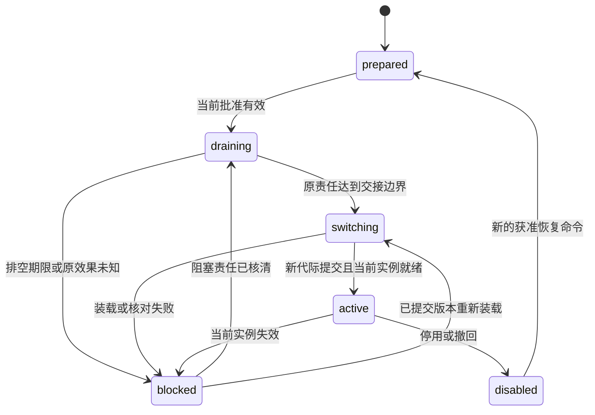
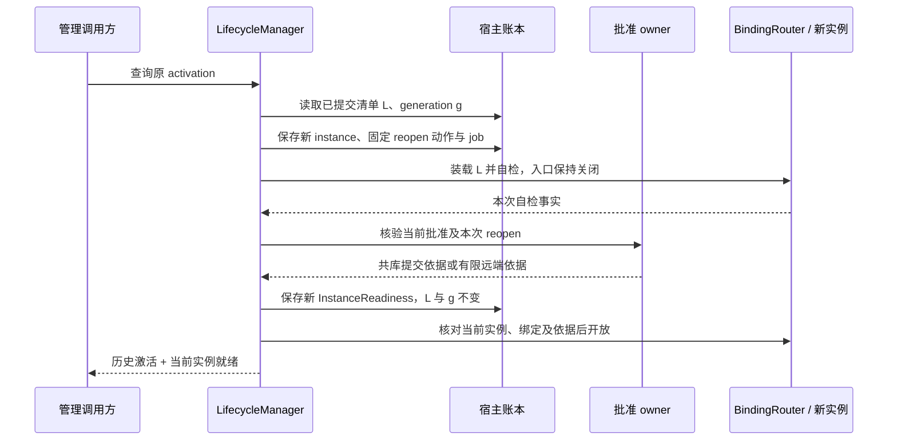

# 扩展安装与版本切换

扩展管理把精确制品装配为可调用组件，并保存安装、切换、停用及清理的恢复责任。安装锁定清单（InstallLock）固定制品、依赖、配置和平台；发布批准（ReleaseApproval）决定允许启用的范围；活动绑定决定当前版本；实例就绪决定此刻能否派发工作。这四项事实分别确认。

本文定义宿主装配与生命周期，批准规则唯一归 [评测与发布](evaluation.md)，共同恢复机制归 [可靠工作](reliability.md)，字段归 [contracts/schemas/](contracts/schemas/)，实现与验证状态见 [review.md](review.md)。

## 组件与依赖

受信最小宿主先提供身份、账本、制品校验、管理入口和恢复调度，再装载受管组件。管理池有独立且有限的领取、并发、等待和调用预算，组件未 ready 时仍能诊断、停用和继续原步骤。

| 组件 | 负责的接口与事实 | 依赖 |
| --- | --- | --- |
| ArtifactReader / PackageVerifier | 取得准确字节，检查摘要、文件、路径、依赖和信任 | 内容端口、平台文件与隔离适配器 |
| LockStore | 发布不可变 InstallLock 及制品可用事实 | 宿主数据库、不可变制品目录 |
| LifecycleManager | prepare、drain、activate、deactivate、dispose 与重开恢复 | 管理账本、可靠工作模板、组件生命周期接口 |
| BindingRouter | 核验当前代际、当前实例和实际入口，执行派发 | ActiveBinding、进程租约、当前启动依据 |
| ApprovalClient | 共库批准核验或远端有限启动依据 | 原批准 owner |
| ReferenceCollector | 登记及核对任务、原操作、迁移和回退持有者 | 各原业务 owner |

管理数据库事务不包含下载、装载、迁移或远端批准调用。LifecycleManager 先提交固定步骤与继续责任，再取得外部事实，最后在短事务归并；作业领取不能代替实际实例隔离。旧领取不能写 ready、推进代际或清掉新停用责任，可信迟到事实由独立的原步骤归并入口核验。

### 扩展形式与 SDK

受信内置组件以 Go package 随宿主构建，独立安装的可执行扩展以受控子进程或服务交付，跨进程采用 [gRPC](contracts/grpc.md)。同进程接口用于模块分工；默认不使用 Go 动态 plugin，内置代码升级需要排空并重启精确宿主制品。

| 扩展点 | 必须保留的契约 |
| --- | --- |
| Brain | 有界单轮提案、准确输入版本、原决策及调用费用恢复，见 [大脑](brain.md) |
| Memory | 准确修订、当前来源用途、删除和派生索引，见 [记忆](memory.md) |
| Executor | 精确能力、原操作、启动与效果分离、查询和接管，见 [执行](execution.md) |
| 外部 Agent / UI | 原命令、子任务映射、准确输入与真实消费，见 [协作](collaboration.md)、[交互](interaction.md) |
| Skill / Agent 配置 | 不可变内容、来源、依赖、适用范围和限制 |
| 生命周期适配器 | prepare、inspect、drain、activate、deactivate、dispose，以及原管理步骤查询 |

Go SDK 提供认证上下文、命令身份、内容引用、截止和结构化错误；跨进程客户端由公共契约生成，Web/JavaScript 客户端可用 TypeScript。任何组件都通过所属模块接口改变事实，不能直接改其他模块业务表。

Skill 与 Agent 配置随制品保存适用材料：应触发、不应触发和证据不足的任务实例；准确工具与版本依赖；所需观察与可支持条件；依赖缺失、冲突、等待和退出规则；实际字节及配置摘要。材料可以是清单文件或受控 ContentRef。关键词仅定位候选；选择与计划准入由 [大脑](brain.md)和 [Orchestrator](orchestrator.md)负责，装载不提升指令优先级或数据用途。

## 数据模型与状态机

宿主用不可变清单解释历史版本，用当前绑定与当前实例解释实际运行。完整字段查 Schema，以下只列决定并发与恢复的记录。

| 记录 / 参考表 | 关键身份 | 不变或单调的事实 |
| --- | --- | --- |
| Artifact / artifacts | `digest` 唯一 | 实际字节、核验与信任证据 |
| InstallLock / install_locks | `lock_id` | 完整依赖、配置、平台、格式；变化产生新清单 |
| LockReference / lock_references | `(lock_id, owner_kind, owner_id)` | holder 原责任；引用变化推进 `reference_revision` |
| Activation / activations | `activation_id` | 目标、新旧清单、批准和预期旧代际；历史启动依据不改写 |
| ActiveBinding / active_bindings | `(target_id, port)` 唯一 | 一个当前 `generation` 和 lock |
| InstanceReadiness | `(target_id, instance_id, generation)` | 本次装载、自检和启动依据；重启重新取得 |
| LifecycleStep / MigrationStep | 原 activation、领域和固定 step_id | 原步骤效果、重入判据与查询责任 |
| management_jobs | 原 activation / instance / step / kind | 管理继续责任；使用公共 JobStore，业务身份独立 |
| closed_extension_keys | 原管理身份 | 清理后仍阻止旧命令重新执行 |

`Activation.revision` 是对外可见投影修订，独立于活动 `generation`。phase、ready、停用或残留变化在同事务递增 revision 并保存变化提示责任；真实观察被持久保存时才更新 `last_observed_at`。read、list、Change 使用同一 revision，普通读取不制造新修订。[集合恢复](contracts/protocol.md#collection-snapshots)负责权限、分页及迟到投影合并。

下图只描述一个目标的 Activation 阶段，箭头表示有持久事实支持的转换；任务状态、包安装状态和节点在线状态分别保存。

## 安装与首装时序

prepare 只有在字节完整、已核验且 InstallLock 耐久可用时才返回 `applied`。内部准备可先持久化，按 [共同回执规则](contracts/README.md)处理等待，不额外创造 accepted 阶段。

1. ArtifactReader 以原准备身份下载到独立暂存目录，限制字节、文件数和目录深度。
2. PackageVerifier 拒绝绝对路径、路径逃逸、越界符号链接、重复覆盖入口和未声明文件；默认不执行包内安装或构建脚本。审核构建在独立环境完成，产出新固定制品再安装。
3. 依赖求解产出有限、无冲突的完整集合，校验来源、契约主版本、平台、格式和信任要求。SemVer 范围仅用于此时求解，实际清单固定精确版本及摘要。
4. 核验取得字节、展开后的文件集合和各依赖摘要；同步字节并原子发布至 `artifacts/digest` 后，短事务提交制品可用记录、InstallLock 和原回执。
5. 装载时从受管不可变目录重新核对准确入口；平台文件权限或句柄须阻止核验后替换。检测到替换先封闭新启动，再由原 owner 处置旧实例和操作。

| 存储位置 | 用途 |
| --- | --- |
| `staging/prepare_id` | 尚未发布的临时下载与展开结果 |
| `artifacts/digest` | 已核验、不可就地覆盖的制品 |
| `locks/lock_id` | 便于诊断的清单导出；数据库仍为权威 |
| `runtime/instance_id` | 当前进程状态与安全句柄，重启重建 |
| `migrations/step_id` | 原迁移步骤产物，绑定可查询步骤 |

首装通过同一兼容发布流程：受信发行程序启动最小宿主，核验随包契约报告和目标环境预检，将外部 conformance 报告通过受信内部导入端口保存，保留原运行来源。目标机器的差异必须预检补齐，不能把外部报告标为本机运行结果。缺可核验材料时先做 compatibility_check。

批准 owner 以本地受信确认建立有限目标的 compatibility 批准；首装 Activation 使用 `old_lock_id=null, expected_generation=0`。离线首装可使用获核验的随包材料及共库批准，不依赖 Brain 批准自己。材料或激活失败时保留管理入口、原步骤和暂存引用。批准分类、确认消费与报告导入归 [评测](evaluation.md)。

## 版本切换与重启

LifecycleManager 默认先排空旧绑定，再装载新版本；任务引用的清单在任务期间不变。activate 的 `applied` 只表示切换意图和继续责任已保存，实际开放须完成后续步骤。

### 排空与提交

activate 接纳事务锁定目标绑定，核对新旧清单、原批准及预期代际，共同保存 Activation、原命令回执和后续管理责任。`applied` 回执固定返回原 activation_id；后续阶段只更新 Activation 的可查询事实，不改写该回执。管理沿 prepare → 停止新接纳 → drain → 装载/迁移 → 自检 → 提交代际 → 开放入口恢复。

同一目标、同一预期旧代际的竞争切换只有一个能提交新活动代际，其余记录 `generation_conflict`。接纳事务到代际提交之间还跨越排空和装载；短事务行锁不能独自覆盖这段时间。竞争意图在接纳时排他占用，还是可先接纳并在代际提交时裁决，尚需冻结，见 [Q-03](open-questions.md#需要明确的设计接口)；不得据当前契约假定两种方式等价。

排空先禁止旧绑定接纳相关新工作，要求各 holder 交回可核对的释放或接管事实。

| 持有者 | 可交接事实 |
| --- | --- |
| Orchestrator | 任务不再使用清单，原操作已有独立保留绑定 |
| Brain | 原调用已终结，或未知调用仍有可查询负责者 |
| Executor | 原效果与驱动查询责任已交接 |
| Memory | 当前数据、索引与原写责任能由目标版本读取 |
| 发布管理 | 回退保留窗口结束或明确的新保留策略生效 |

HTTP 超时、进程退出和 UI 终态均不是释放证明。期限到达时保存阻塞 holder 并转 blocked；未知原操作继续由旧驱动核对，不交新驱动重发。同意保留旧实例并存的无状态实现，须另外证明状态与资源隔离。

内置 Go 组件通过启动新宿主制品装载；独立扩展通过启动或连接精确组件装载。迁移在首次调用前保存固定 step_id、前置格式摘要和恢复责任，适配器必须能查原步骤并给出重入与完成判据；只有执行能力而不能识别旧效果的迁移不能自动启用。

自检完成后宿主取得绑定准确 activation、实例和清单的启动依据，再按预期旧代际共同提交 ActiveBinding、Activation 的历史启动依据及对应投影修订。这个提交证明活动版本已切换；原 activate 接纳回执保持不变。共库批准参与同一事务，远端批准在事务外取得并在有限窗口内登记；完整规则归 [启动依据](evaluation.md#startup-evidence)。BindingRouter 每次派发核对当前代际、当前进程及该项 work 的有效依据。

### 提交后崩溃

宿主恢复时先查原 Activation、步骤和 ActiveBinding。代际未提交则继续原排空或切换；已提交则装载该清单，自检并取得本次 `reopen` 依据，保持原 generation，不重迁移。

下图从“活动绑定已提交、原答复丢失”切入；箭头表示恢复查询和本次实例准入，原历史依据始终保留。

历史 `startup_evidence` 和远端 `activation_use_id` 不因重启刷新；`instance_readiness` 绑定当前新实例。新实例不继承旧实例离线租约。read/list 必须核对实例当前进程租约及绑定，旧 ready 行不能证明进程仍在；无法核验返回 `dependency_unavailable`。观察到失效后，恢复者条件提交 blocked、清空 ready_instance、递增 revision，并继续原代际的 reopen。

## 停用、回退与清理

deactivate 在权威绑定事务中封闭原 activation/代际的新使用入口，保存原回执与残留交接责任；之后才报告 `new_use_disabled`。已接纳工作是否还可物理启动，由其领域控制与当前安全检查决定。`previous_version_ready` 和 `residual_work` 独立返回，不从“停用成功”推导全部工作结清。

回退是新的准确旧清单激活，使用 [评测](evaluation.md#rollback)定义的独立旧批准。LifecycleManager 核对旧代码仍可信、旧批准当前有效、旧版本能读取新版产生的所有当前格式，条件满足才切回；迟到停用仍核对原 activation/代际，不能关闭后来版本。授权撤销、消费、删除和外部效果不随软件回退。不可逆迁移在批准前给出独立恢复方案，失败时只报告停用与修复缺口。

### 引用与 dispose 竞争

业务 owner 在接纳使用清单的责任时取得引用。共库时引用和业务一起提交；跨事务边界时先以固定 holder/原命令预登记，再发送原业务命令。答复未知则保留引用并查原命令，只有原 owner 的可查终结或独立驱动接管事实才允许条件释放。尚未发送的预登记也有自己的核对与关闭步骤。

ReferenceCollector 不通过当前进程对象推断全部 holder。dispose 先在引用权威事务封闭该 lock 的新引用取得，再比较 expected_revision、reference_revision、全部预登记与释放事实；任何 holder 未知则 blocked。新业务只能等待或选择另一获准清单，不能绕过已关闭的引用入口。

清理按准备删除、物理删除、保存终态索引推进。下载中断且未发布的临时内容可以回收，持久引用的制品、驱动、迁移与回退材料留到最后引用释放；物理删除失败沿原命令恢复，命令去重身份按 [共同保留规则](contracts/README.md)继续保留。

## 失败处理

管理错误返回原责任或格式证据，使调用者能选择继续核对、停用或新的获准版本。

| 失败 | 状态与恢复 |
| --- | --- |
| 半包、摘要或路径错误 | `package_invalid`；无可激活清单，修正制品后用新摘要准备 |
| 依赖或契约不兼容 | `dependency_conflict / contract_unsupported`；重新形成完整清单 |
| 无合格隔离 | `isolation_unavailable`；不装载该可执行实例 |
| 批准失效或不可核验 | 关闭新启动；查原批准，不刷新旧窗口 |
| 同目标代际竞争 | `generation_conflict`；读当前绑定重新决定 |
| 原操作、holder 或迁移未知 | `drain_blocked`；保留驱动、原步骤及费用责任 |
| 格式不兼容 | `state_incompatible`；保留当前数据和迁移证据，选择兼容版本或独立恢复方案 |
| 代际提交后进程退出 | 原代际重开；管理查询可用，自检和本次依据完成前入口关闭 |
| 清理或磁盘容量不足 | 拒绝新准备，保留停用、核对和清理份额；不强删未结制品 |

宿主对包数、依赖深度、暂存字节、并存清单、排空期限和管理并发设硬上限。发布批次另限制同时排空目标数。观测按阶段记录耗时、最老阻塞引用、当前实例/代际、关闭原因、批准延迟、迁移恢复和清理积压；“历史已激活但当前不就绪”必须单独标出。

## 保证与限制

宿主保证在原管理身份下恢复安装和切换，且同一目标/端口只有一个权威活动代际；前提是制品不可变、绑定条件提交、holder 交接、当前实例检查与批准核验成立。活动指针、探活和历史 ready 都不足以单独证明实际可用；作业租约也不隔离失控组件。

安装 Plugin 不产生业务 Grant，Skill、模型和外部 Agent 内容始终是不可信输入。默认同进程只接纳受审核代码；恶意原生代码隔离要求独立 OS 身份或等效隔离、文件与网络出口控制、密钥隔离、资源上限、跨用户隔离和终止证明。仅子进程、goroutine 或 SDK 限制不满足该前提；缺适配器时拒绝不可信可执行扩展。

撤回对失联目标的边界取决于 [批准窗口](evaluation.md#startup-evidence)，停用不抹去已发生效果。字段与状态序列无法证明真实磁盘耐久、代码停止或隔离；故障实验及运行证据见 [validation](validation/README.md)，状态见 [review.md](review.md)。

## 取舍

| 选择 | 代价 | 改选条件 |
| --- | --- | --- |
| 精确锁定、直接装配 | 更新需新清单与重新验证 | 多个不兼容依赖无法按宿主隔离时考虑多版本装配 |
| 默认排空再切换 | 切换目标的新工作暂停，未知操作可能长期阻塞 | 无状态实现证明资源和格式隔离后允许并存 |
| 原步骤可查后才自动迁移 | 适配器必须实现恢复判据 | 不具备判据则采用人工可审查迁移方案 |
| 引用完整释放后清理 | 失联 holder 占用磁盘 | 需先增加可证明责任转移机制，不能按超时猜测释放 |
| 独立进程协议替代 Go 动态 plugin | 维护协议及进程生命周期 | 仅编译时受信装配继续使用 Go interface |
