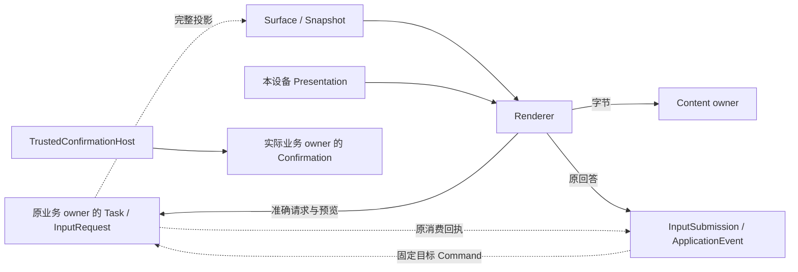
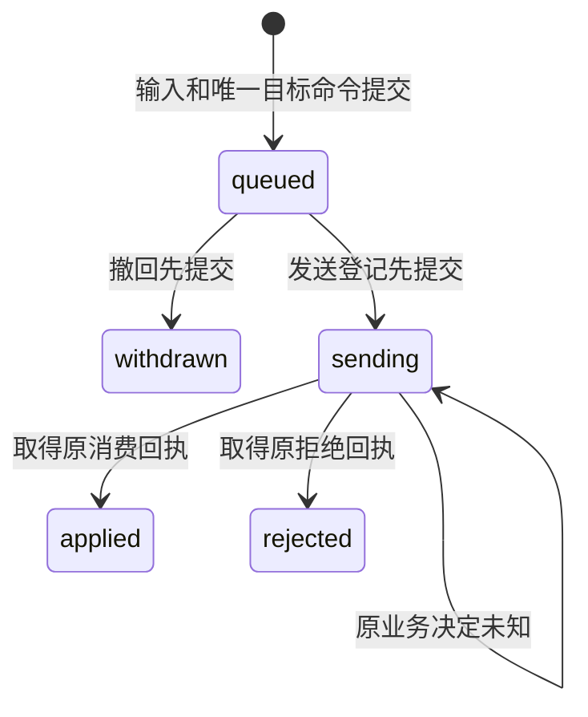
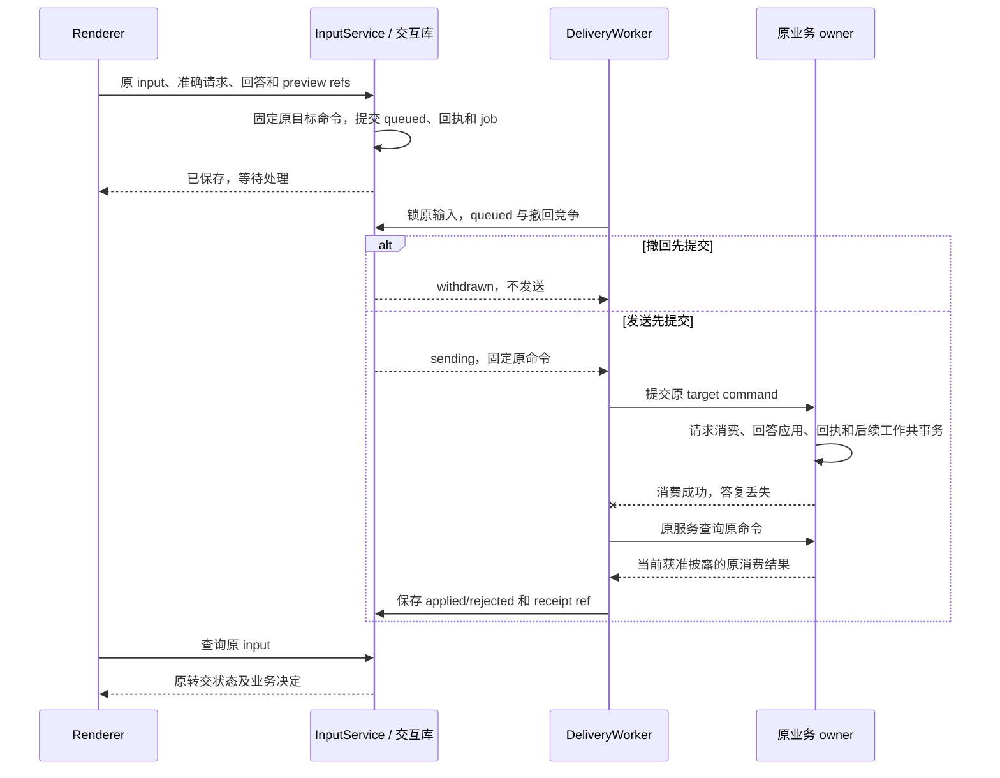

# 界面、用户输入与跨端呈现

交互模块保存界面对象（Surface）、设备呈现意图和可靠输入转交，使用户能查看任务、回答请求、管理资料及接管执行；任务、许可和请求的最终消费仍由各自业务 owner 裁决。

本模块提供 CLI 与 Web 宿主，共享准确请求、输入恢复和声明式快照契约。公共字段以 [协议 Schema](contracts/schemas/protocol.schema.json) 为准；授权与确认消费见 [authorization.md](authorization.md)，内容持有与清理见 [memory.md](memory.md)，实现与验证记录统一见 [review.md](review.md)。

## 组件与依赖

交互服务负责持久状态，Renderer 和 TrustedConfirmationHost 负责宿主呈现；连接网关只认证、路由和维护有限发送队列。各组件可以同进程组合或分别扩容，不增加第二个任务裁决者。

| 组件 | 负责的事实或行为 | 依赖 |
| --- | --- | --- |
| SurfaceService | 固定应用绑定、完整快照与来源修订 | InteractionStore、已登记应用处理器 |
| ProjectionWorker | 从原业务事实生成完整快照，持续核对来源 | 原 Orchestrator/业务 owner、可靠工作框架 |
| InputService | 固定原输入、目标命令和撤回竞争 | 请求 owner、受信路由与应用登记 |
| DeliveryWorker | 原目标发送、原决定查询、回执归并 | 目标业务服务的幂等命令及回执查询 |
| PresentationStore | 每设备 open/close、意图修订与 seen revision | 已认证 endpoint |
| Renderer | 严格组件渲染、准确请求与正文读取、依赖输入启用 | Content owner 和请求 owner |
| TrustedConfirmationHost | 取得规范意图、本人认证和决定转交 | 实际业务 owner 的 ConfirmationStore |

下图按持久权威划分交互对象；实线表示读取或固定引用，虚线表示可靠转交或后台投影。

同宿主共库时，输入登记与业务消费可合并事务；跨库时先持久接纳输入，再事务外转交，后续事务保存业务回执。公共接纳、领取和工作版本规则集中于 [reliability.md](reliability.md)，WSS/gRPC 与消息恢复集中于 [transport.md](contracts/transport.md)。

## 数据模型与状态

Surface、SurfaceSnapshot、Presentation 和 InputSubmission 各自有生命周期。关闭一个设备页面只改变该设备呈现意图，不取消任务、不撤销输入，也不销毁业务请求。

| 记录 | 关键事实与约束 |
| --- | --- |
| `surfaces`、`surface_revisions` | owner、app binding、可选 task ref 创建后固定；每修订保存完整快照及不可变摘要 |
| `surface_projection` | 已发布 last source revision、已核实 required source revision 均单调；关联存续时保持周期核对责任 |
| `presentations` | surface/endpoint 唯一；open、intent revision、seen revision 分别记录 |
| 原 owner 的 `InputRequest` | 准确 request ID/revision、Schema、期限、必需预览、allowed actions；open/consumed/expired/superseded |
| `input_submissions` | input ID、回答、请求和预览、目标 logical service、完整原 Command 固定 |
| `application_events` | event ID、独立 app binding、事件类型、准确负载、固定目标 Command |
| delivery/projection 作业 | 稳定输入/事件/Surface 键，关联原业务标识和未结责任 |
| `surface_queries`、`aggregate_task_queries` | 有期限的查询成员、来源版本、未输出候选及页推进状态 |
| `submission_closures` | 原输入、目标 owner/command、请求与决定摘要 |

完整回答和正文按来源政策清理，未结输入的目标映射与转交责任继续保存。最小输入去重记录不保留正文；原记录清理后返回 gone，冲突参数按公共幂等契约拒绝，不能重新消费。

下图只表示 InputSubmission 的转交状态，箭头由本地竞争或原业务回执驱动。

sending 后撤回仅保存 `withdrawal_requested`；没有业务停止消费证明不能改成 withdrawn。原入口没有请求撤销能力时，UI 提供原任务取消或纠正入口并继续核对。

## 声明式快照与请求

Surface 只接受有限的已知组件及准确请求引用；表单字段只由业务 owner 的 InputRequest Schema 定义。组件和表单结构是封闭集合，模型不能加入脚本、任意事件目标或可执行 URL。

| 组件 | 展示内容 | 输入及安全边界 |
| --- | --- | --- |
| text | ContentRef，plain 或 markdown | 禁止原始 HTML、脚本；链接由受信导航器打开 |
| media | 准确 ContentRef、替代文字、声明的呈现类型 | 当前字节取得并校验后呈现，不按扩展名提升权限 |
| table | 有限纯文本列/单元格 | 初始最多 20 列、100 行，每格 512 字符；大表作为内容附件 |
| input | request ref 与呈现标签 | 字段只从该准确请求读取，不复制第二份 Schema |
| action | request ref、action ID、标签 | action 必须在请求 allowed actions 内 |
| status | 有限状态码与标签 | 仅呈现，不能裁决业务已成功 |

InputRequest 的 fields 只支持 text、integer、boolean、choice、choices，字段名唯一；文本有长度、整数有范围、选项及最大选择数有上界。未知字段、重复选项和超限答案在宿主及业务端分别拒绝。无法用该子集表达的请求进入受信专用入口，不加载任意远端 Schema 执行器。

Surface 的 request refs 覆盖所有 input/action 块；同请求多处显示仍只消费一次。任务 Surface 只由原 Orchestrator 的受信投影器创建/登记；独立 Surface 绑定固定应用处理器，不能将任意事件路由到任意管理方法。

### 请求与正文预览

Renderer 先向实际请求 owner 调 `interaction.request_read` 取得准确请求，再取得全部必需正文，最后才启用依赖输入。它完整取得字节、核 hash 并完成要求的呈现；提交的 preview refs 绑定实际预览版本。

`request_read` 返回问题、Schema、期限、必需 ContentRef、allowed actions 和当前状态；旧修订返回 revision_conflict。acceptance 另绑定 task、goal revision、准确 candidate 和 hash；application 不绑定任务。请求 owner 不可达、正文缺失或权限变化时，禁用依赖该材料的输入，仍可使用无该依赖的其他功能。

业务消费复核请求修订、期限、必需引用覆盖、当前来源和权限。可信确认的创建/决定/消费流程统一见 [授权](authorization.md#可信确认与许可签发)；普通输入和受信确认不相互转型。

## 关键时序

### 创建、投影与快照读取

Surface 更新采用完整快照和单调来源修订，变化提示仅唤醒读取。新设备或断线设备从当前获准快照恢复，不依赖连续渲染指令。

`surface_create` 核验已登记应用版本、主体、组件、请求绑定和内容范围，同事务保存 revision 1、回执及变化提示；任务 Surface 同时保存固定投影关联和首次核对责任。`surface_update` 比较 expected revision，独立应用由固定 handler 更新，任务投影还比较 source revision；旧来源不能覆盖新快照，同修订异内容冲突并回查原 owner。

ProjectionWorker 从原正式记录生成完整投影，将新获知的 required source revision 与必要作业共同保存；last source revision 只随完整快照发布前移。当前追平后作业仍以有界 waiting 定期核对，Task 终态、设备关窗或快照过期都不自动终止。仅当 Surface 按保留策略清理、保存投影停止依据并交接全部未结输入/内容/清理责任后才结束。

Change 可以重复、合并或丢失，只提前已有核对工作；无通知时周期查询仍发现新修订。旧工作回写按公共工作版本裁决，不能结束处理期间新增责任；一个 Surface 一个投影责任，不按连接重复建作业。

`surface_read` 每次重核当前披露和内容依赖。known revision 相同且获准呈现未变才返回 not_modified；权限、来源或字节可用性改变时，即使业务源修订未变也返回快照或 gaps。Renderer 按原内容期限失效缓存，收到关闭或到期停止新阅读，重新开放先核当前依据。

### 输入接纳、转交与消费

InputService 在 queued 提交前固定唯一目标及完整原命令；DeliveryWorker 只沿该目标查询或原样发送，业务消费结果取得后才向 UI 显示生效。

下图从两个数据库观察一份输入，箭头表示调用，三次本地提交分别保存接纳、发送边界和消费事实。

接纳事务核对 input/surface/request revision、准确 answer 和 preview refs，从固定处理器及受信路由解析 logical service、target、method 和 command ID。无法确定原业务服务及回执查询入口时拒绝接纳；服务地址变化可发现原 logical service 的新健康实例，不能重新选业务目标。

原输入回答、预览和目标不可改变。用户编辑使用新 input ID，但业务请求仍只有一次有效消费。queued→sending 与 withdrawn 在锁原输入后同事务竞争；领取作业本身不等于获得业务发送资格。发送前崩溃和发送后失答复均查原命令，确证未接纳且期限允许才原样重投；命令期限到达不抹去此前已接纳的回答。

Orchestrator 或 handler 在业务事务核 owner、kind、revision、deadline、未消费状态及预览，保存消费、回答应用、回执和后续责任。两设备答案一胜一拒；目标或候选变化拒绝旧回答，不自动套新版本。回执正文不可披露时可返回获准消费状态，UI 不需要重取敏感回答来确认历史结果。

### 独立应用与管理入口

`interaction.application_event` 仅用于无 task ref 的独立 Surface，固定 event、surface revision、app binding、事件类型、负载和预览。注册 handler 声明有限事件、准确 Schema、管理权限及原命令查询服务，目标不能由调用方指定。

| 固定处理器 | 事件用途 | 业务决定 |
| --- | --- | --- |
| memory-candidates | candidate.reject | Memory owner 比较候选修订和管理权，保存拒绝及清理 |
| memory-manager | record create/replace/delete | 生成原 Memory 命令，复核领域权限及期望修订 |
| registered-app | manifest 声明的有限事件 | 原 handler 幂等消费并提供原决定查询 |

application event 的 applied 只确认交互层持久接纳，输出仍可为 queued；原 handler 的 applied 才证明业务消费。没有原决定查询能力的处理器不接入有副作用事件。模型按钮不能安装 handler 或授予权限；拥有删除/取消权但无正文读取权时，仍提供获准最小元数据和控制入口。

### 设备呈现与任务结果

Presentation 按 surface/endpoint 和 expected intent revision 保存打开或关闭意图。缺省记录为 closed、intent revision 1、seen revision 0；首次修改以 expected 1 竞争创建并返回 revision 2。迟到成果只更新 Surface，不能重开设备已关闭页面，也不改变另一设备的意图。

结果视图先呈现结论、准确成果和关键待处理项，详情关联当前目标条件、证据和限制。Task/Result、未知效果、控制落实、委派费用和内容清理均取原 owner；模型总结中的“完成”只作为正文。同任务的覆盖、条件与 Result 使用一致 goal revision，未齐全时显示更新中；跨 owner 来源修订分别保存。

| 原权威事实 | 呈现与可执行后续 |
| --- | --- |
| 条件未通过、覆盖遗漏或材料不足 | 显示要求、缺口及来源；原权限内补证，含义或许可需本人决定时再输入 |
| 原操作效果未知 | 显示原操作与核对进度；“继续核对”只唤醒原责任，不重做动作 |
| 授权/依赖等待 | 显示负责方和所需改变，按钮绑定当前准确请求 |
| 任务取消，远端未确认停止 | 同时显示终态及未确认范围 |
| 内容禁止新使用，副本有残留 | 分开显示逻辑关闭、离线窗口和逐 holder 清理 |
| 证据不可读或来源不可核验 | 展示获准历史判断及当前缺口，不用缓存冒充当前证据 |

默认宿主的内部只读投影提供目标覆盖；仅有公开协议字段的适配器若拿不到该信息，保留缺口，不猜完整性。设备接管直接访问 [Execution 的资源控制](execution.md)，不经过 Brain 或普通聊天队列。

### 单 owner 目录与跨 Orchestrator 列表

Surface 单 owner 列表复用 [集合恢复契约](contracts/protocol.md#collection-snapshots)，跨 Orchestrator Task 列表由应用聚合原来源，原 task.list 始终只服务一个 Orchestrator。用户来源及披露权威登记的唯一规则归 [deployment.md](deployment.md)。

聚合器首屏从受信身份端口取得同一提交视图中的完整来源、每来源完整披露授权权威集合和目录版本。它查询这些授权 owner 的当前披露范围修订，组成可比较复合 token；目录不完整、owner 不可达或版本不可比较都标授权缺口，不当作空集合。

1. 固定认证用户、过滤、来源/授权权威集合、目录版本及各授权 token。
2. 对各固定来源先建立变化水位并缓冲，再读取 task.list 首屏，保存本地 upper bound。
3. 为每个未耗尽来源取得下一候选，按 `(created_at DESC, orchestrator_id, task_id)` 合并。全标识去重，同名 task ID 来自不同 Orchestrator 仍是不同任务。
4. 保存各来源未输出候选、继续位置、最后全局排序键和不可延长期限；原页结果与位置条件提交，使重复游标返回同页和后继游标。
5. 每页前后及宣称遍历结束前，重核目录、完整授权 token 和变化水位。逐条披露仍在原 Orchestrator 判断。

| 查询期间变化 | 聚合行为 |
| --- | --- |
| 新 Task 排序键落入已输出段 | 标排序缺口，旧游标失效并新查询；不追加到旧页尾 |
| 新 Task 落入未输出段 | 在原本地上界允许范围内按总序进入后续页 |
| 目录换版或新增来源/授权权威 | source_changed，旧查询不混入新来源 |
| 授权范围变化 | authorization_changed，清旧完整性声明和失效内容，新查询发现新获准历史任务 |
| 来源超时、目录不可读或授权无法核验 | 可以展示来源标记的 partial/gaps；不提供可宣称全局有序完整的续页游标 |
| 提示水位断裂或缓冲溢出 | 原完整性失效；恢复后新首屏，不把迟到来源拼到旧页尾 |

空本地页仍有游标时继续有界扫描；预取未输出候选必须保留，不能因来源游标前进而跳过。仅在目录和授权版本不变、所有固定来源到末页、无 partial/gaps/超时/排序缺口且变化水位连续时，声明“所列来源在各自查询上界内已遍历”。时间戳和本地 upper bound 不提供跨分片因果顺序或同刻快照。

## 失败处理

交互恢复从原 input/command 和当前获准快照开始，连接重建、传输 ACK、ReplyAck 和 Change 不决定业务消费。

| 故障或竞争 | 用户可见行为 | 持续责任 |
| --- | --- | --- |
| queued 提交后失答复 | 查询原 input，显示已保存或原拒绝 | InputService 保持一个目标命令 |
| 发送/消费未知 | sending、待核对，不反复提交新答案 | DeliveryWorker 查原服务和命令 |
| 两端回答 | 一次消费，另一端明确已消费并刷新 | 原请求 owner |
| 预览后来源关闭、到期或请求换版 | 依赖输入拒绝，显示准确缺口 | 请求 owner 重建有效请求；用户重新预览 |
| Surface 可达，请求 owner 失联 | 禁用新依赖输入；已保存输入仍待转交 | queued 可撤回，sending 继续原查询 |
| 旧投影到达 | 不回退，冲突回查原来源 | ProjectionWorker |
| 所有变化提示丢失 | 从完整快照和周期来源核对恢复 | 原投影作业持续存在 |
| 关闭页面后成果到达 | 本设备保持 closed，主动打开后查成果 | PresentationStore |
| 交互数据库不可写 | 不报告 queued/withdrawn 或保存成功 | 浏览器最多保留本端待发送 |
| handler 已消费但回执丢失 | 原 handler 查询恢复，不换处理器 | 原 event delivery |
| 凭据撤销后的旧长连接 | 拒绝新消息和披露，原已提交事实保留 | 身份入口及原 owner |
| 已领取作业失效后回执到达 | 独立认证归并可保存原事实，旧领取不能结束新工作 | 接替 worker 沿原标识处理 |

input delivery 的完成依据是发送前撤回或已保存原业务 applied/rejected；event delivery 以原 handler 决定为准；projection 在关联存续期间继续核对，仅在获准清理和责任交接后完成。通用实现见 [reliability.md](reliability.md)。

## 保证与限制

交互模块保证持久接纳与固定转交身份、准确版本绑定和可恢复快照；它不从界面状态推断用户理解、业务效果或跨 owner 完整快照。

| 保证 | 前提与限制 |
| --- | --- |
| 输入可靠转交 | queued 已提交到持久宿主且固定目标有原回执查询；纯浏览器待发送内存不提供清除数据后的恢复 |
| 请求一次消费 | 原业务事务比较请求修订并消费；交互层 applied 只证明本地接纳 |
| 发送前撤回 | queued 与 sending 竞争中撤回先提交；sending 后只保证保存核对请求 |
| 受信正文预览 | Renderer 完整取得并呈现准确内容；preview refs/seen revision 不证明旁路客户端已呈现，更不证明用户阅读或理解 |
| 快照可恢复 | 完整读取及周期投影持续可用，提示可以丢失；not_modified 不延长正文许可 |
| 跨来源遍历声明 | 仅覆盖固定来源各自上界，依赖目录、授权范围版本及连续变化水位；不提供全局同刻快照 |
| 内容清理 | 受管缓存按当前控制与期限处理；用户导出、截图和终端滚屏按载体能力报告，不声称抹除已看见内容 |
| 有限公平服务 | 新输入、目录和连接受用户总限额；控制、撤回、回执核对及既有转交保留容量 |

## 取舍与容量

交互模块选择完整快照、单一请求 Schema 和业务 owner 消费，以缩短恢复路径；代价集中在当前依赖读取、投影刷新和多来源扇出。

| 选择 | 代价 | 改选条件 |
| --- | --- | --- |
| 完整快照，提示只唤醒 | 大页面重复读取，维护快照版本 | 实测带宽或频率成为瓶颈时增局部补丁，保留完整读取 |
| 请求 Schema 仅存业务 owner | owner 不可达时不能启用表单 | 无法用封闭字段表达时采用受信专用入口，不复制权威 |
| 跨 owner 输入先存再交 | 增加一个持久转交与回执归并阶段 | 同宿主同事务时合并提交，外部语义不变 |
| Task 列表按需聚合 | 来源数量增加时扇出和授权核验成本上升 | 实測瓶颈后评估可重建索引，当前披露仍由原 owner 判定 |
| 受信 Renderer 承担预览 | 业务端不能识别仅复制正确引用的未预览旁路 | 明确需要防旁路时另定受信取阅凭据；仍不能证明人已理解 |

初始限额：每用户 100 个活动 Surface、100 个排队输入/事件、8 条 WSS 连接；每快照 100 组件/128 KiB；表单 32 字段、每字段 100 选项；目录每页 20/冻结 200。连接帧和字节上限归 [transport.md](contracts/transport.md)。超额在接纳前拒绝，已接纳输入继续；Change 可合并，慢端可断开并从快照恢复。

度量接纳延迟、最老 delivery、sending 未决年龄、业务回执到呈现延迟、来源投影滞后、披露核验、快照大小、连接及重连峰值。请求消费、页面呈现和本人阅读分别报告；[故障实验](validation/fault-experiments.md) 分别覆盖 CLI、Web 和后续宿主，证据范围见 [review.md](review.md)。
