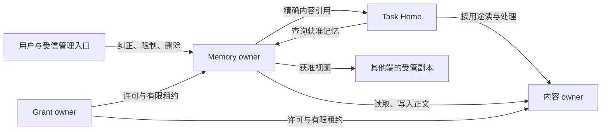
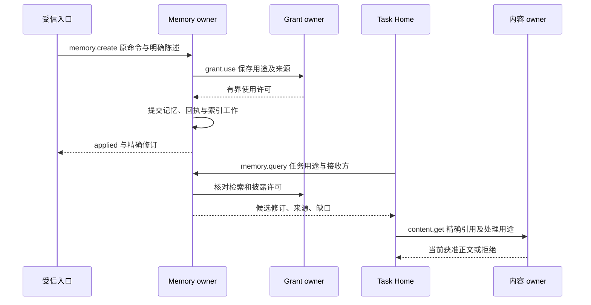
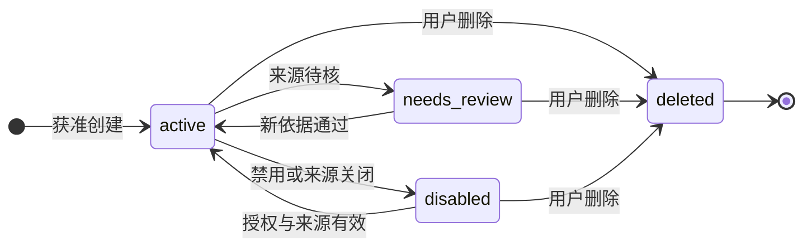

# 记忆、内容与来源

[整体设计](README.md) · [目标](goals.md) · [授权规则](security.md) · [大脑](brain.md)

本模块让任务能够使用个人信息与经验，并让用户能够纠正、限制和删除它们。覆盖 C2、C3、C7、C9 及三系统替换要求；对联网问答提供来源，对手机操作保存获准的观察与结果。本文定义设计契约，参考实现和运行验收均待交付。

## 1. 边界与选择

**任务上下文**是 Task Home 为一次决策选择的目标、进展、证据和内容引用，随任务保留策略管理；**长期记忆**是取得独立保存许可、可以跨任务检索的记录。进入模型上下文不自动产生长期记忆，也不自动允许发送给云模型。[任务运行](task-runtime.md)保存上下文版本与使用责任，本模块保存记忆修订、检索依据和清理责任。

**owner** 是对象所属账本的逻辑负责方，不是当前调用进程。一个记忆库只有一个固定 Memory owner，同一用户可有本地私密库和云端共享库；Task Home 可以与两者不同。一个库失联时不在另一端改写它。用户可以在本地库新增独立记录，日后显式合并；它不能冒充远端旧记录的新修订。

内容 owner 保存正文及其版本；任务、执行或记忆模块可以拥有内容。默认内容 port 与业务模块共用本地存储，不另设必须联网的中心服务。其他模块替换内容实现时，仍须提供本页的引用、权限、保留和清理行为。

图中箭头表示调用或资料交接；各 owner 保存自身事实，身份和许可规则见[授权](security.md)。默认同进程装配可直接调用并合并同库事务，跨端才使用[公共接口](contracts.md)。

| 决策 | 推荐理由与代价 | 改选条件 |
| --- | --- | --- |
| 库内单写者，跨库查询显式聚合 | 纠正和删除有确定顺序；离线端不能自动改远端记录，用户承担稍后的冲突选择 | 出现同一条记忆必须多端同时离线编辑的需求，再设计冲突合并与删除优先规则 |
| 正文为版本化内容，索引只是候选 | 可替换索引而不改变来源和授权；读取多一次权威核对 | 全部内容与索引同事务且同权限域时可合并读取，仍保留相同外部行为 |
| 默认词项／字面召回，可选语义候选 | 首个实现不依赖嵌入供应商，也避免默认外发；模糊关联的召回较弱 | 隔离评测证明语义检索收益，并具备嵌入处理、保存、删除许可后启用 |
| 获准视图单向同步 | 副本用途与保留明确；不把聊天记录复制到每个设备 | 明确历史同步需求时建立独立视图，不能扩大现有视图含义 |

## 2. 信息类型与正常链路

| 类型 | 写入依据 | 使用规则 |
| --- | --- | --- |
| `fact` 事实 | 用户明确陈述或可定位的来源证据 | 保留观察时间、适用范围与相互冲突的来源；不把过时事实当当前状态 |
| `preference` 偏好 | 用户明确表达的习惯或选择 | 当前指令优先；更具体且适用的偏好优先；同范围矛盾时交用户澄清 |
| `inference` 推断 | 由限定输入和方法得出的候选判断 | 展示推断性质与置信度，不自动升级为事实 |
| `experience` 经验 | 正式任务结果、操作事实和适用前提 | 必须区分计划、实际行动和核实效果；一次成功不声明普遍有效 |

用户说“技术评审先给结论，再给取舍表，仅用于技术评审”。受信入口展示保存内容、用途和范围，取得 `store` 许可后调用 `memory.create`。Memory owner 在一个事务中写入记录、原命令答复和索引工作；`applied` 表示权威记录已经可读，索引更新可以稍后完成。新任务查询这条偏好，内容 owner 在读取、传给所选模型、展示输出各次交接检查对应用途。模型据此调整输出，实际影响由验收样例验证。

来源证明回答“资料从何而来”，授权回答“此刻允许如何使用”；两者缺一时不能继续相关使用。来源控制元数据与原文保留分别管理：原文按已确认策略到期清理时，可以保留获准的最小来源证明及派生使用许可；这不等于用户要求关闭来源及派生物。缺原文时标明证据保留边界，不声称仍可逐字核验。记忆中的置信度不能替代许可、来源当前状态或外部事实核验。

## 3. 检索、修改与提取

### 3.1 查询与匹配页

查询先按认证用户、库、用途、接收方、类型和适用范围过滤，再在允许处理的字段上产生候选。搜索需要 continuous 许可：候选处理按受信库范围创建有限使用单元，返回前再按已固定结果的精确来源取得披露使用依据；两个用途分别计数。once 仅支持来源和输出范围可预先固定的精确 read，不以一次搜索承诺未知结果集合。默认匹配对 ASCII 大小写折叠，其余按 Unicode 码点字面匹配；多个查询词取并集，按匹配词数、范围具体程度、观察时间降序排序，以 `memory_id` 打破同分。短查询和索引缺口采用有扫描上限的权威记录扫描，超限明确 `partial`。默认规则不宣称具有中文分词或语义理解能力。

初次查询冻结有限有序的 `(memory_id, revision)` 集合、排序依据与截止时间，生成不透明游标。后续页只遍历这个集合；每次返回前重新核对当前记录状态、来源、用途和披露权限。被删除、修订或撤权的项跳过，返回跳过数量与 `changed`，不返回受限对象标识；新记录留给新查询。空页可以带下一游标，调用方不能把空页当全部结束。

游标绑定认证用户、调用主体、接收方、原查询摘要、库 owner、集合与遍历位置，不携带正文。每页消耗至少一个未遍历位置或返回 `exhausted=true`。集合过期返回 `cursor_expired`，调用方重新查询；新查询不会重置任务累计扫描与返回预算。跨库聚合由调用方保存每库游标和缺口，不能把部分库返回包装成完整结果。

`memory.list` 用于用户管理，按 ID 列出当前控制元数据，不要求旧正文仍可读；固定 ID 集合之后逐页读取当前修订。`memory.inspect` 允许直接取得获准的当前修订、限制和清理状态。管理结果仍受最小披露权限约束，无正文读取权不妨碍用户删除自己有管理权的记录。

### 3.2 写入和并发

`create` 以原命令唯一约束防重复；`replace`、`restrict`、`delete` 必须携带 `expected_revision`。Memory owner 在事务内比较修订并保存新记录、固定回执和后续工作。冲突返回 `revision_conflict`，调用方读取新修订后由用户或任务重新判断，不能自动换期望值重试。

`replace` 表示用户纠正或更新，旧修订退出检索，其依赖内容不能继续被当作当前记忆。旧内容只在仍获准的历史证据范围保留；对外传播失效记录，派生记忆进入 `needs_review`。若新结论确实使用过旧正文，其来源仍包含旧修订，不能删掉这条依赖伪装独立来源。`needs_review` 不进入任务查询；用户以新依据明确重写，或重新提取后生成独立有效修订。

正文先在内容库完成持久保存，再提交引用和业务记录。正文已保存而业务事务失败形成孤立内容，由有界清理工作回收；清理选择与新引用登记通过同一元数据门禁互斥，避免删除刚被采用的正文。存储不可写时返回不可用或提交未知，不能报告已经保存。

写答复丢失时，调用方用公共原命令查询取得固定决定，查询和内容披露仍受当前权限约束。写入已经生效但现已无读取权限时，可以返回获准的提交状态，不重新披露正文。不得换 `command_id` 把提交未知变成第二次写入。

### 3.3 端侧挖掘与提取

端侧连接器先声明可观察来源、有限输入范围和稳定检查点；用户分别批准读取、处理、候选暂存及长期保存。`memory.extract` 接纳一个有限提取任务，原命令与输入集合持久保存后返回 `accepted`；Task Home 负责执行、取消和预算，本模块保存候选及发布决定。连接器扫描检查点只有在对应输入和下一步责任已保存后前移。

本地私密资料优先用本地可用模型；没有获准且可运行的本地处理能力时等待或报告不支持，不能自动切云。调用云模型必须获准向精确接收方 `process` 与 `disclose`；只允许保存一条偏好，不等于允许上传提取它的完整聊天。

提取结果先按四类记录形成候选。每个候选继承实际处理输入的完整来源约束，模型没有引用某段输入也不能自动排除它。默认逐条确认；用户可以预授权有限来源、类别、用途和额度内的自动保存。自动规则只能处理约定的候选，不能扩大输入扫描范围或改变来源限制。常规获准记忆更新无需声称“系统已进化”，改进收益由[评测](evaluation.md)另行证明。

可选任务结束触发器按 `(task_id, terminal_revision, extraction_policy_version)` 去重，仅对用户选定类别启用，生成独立提取任务；原任务失败、取消或效果未知时不自动提取为成功经验。提取失败不修改原任务结果。

## 4. 隐私、视图与清理

### 4.1 隐私分层

| 策略 | 允许路径 | 缺依赖时的行为 |
| --- | --- | --- |
| `local_only` | 声明端点上的读取、处理与保存 | 无本地能力就等待；派生摘要、向量和布尔结果也不能自动外发 |
| `controlled_remote` | 明确列出的接收方、用途、保留期和处理位置 | 接收方或来源证明不可核对时拒绝新交接 |
| `replicated` | 已登记视图中的受管副本 | 没有同步／保存许可、有效租约或清理能力时不建立副本 |

分类用于表达默认路径，最终许可按具体动作逐项检查。原始内容、索引、派生记忆、模型输入／输出与 UI 缓存分别登记持有和保留责任。任务上下文需要临时保存时也必须获准；禁止保存的内容只能进入部署可兑现的临时处理路径，不产生持久正文日志。

### 4.2 获准视图与独立 owner

视图是 Memory owner 为指定接收方生成的有限对象集合及投影，绑定用途、租约、保留期和当前规则版本。接收端是只读副本；其本地编辑另存为待提交意图，联网后按原 owner 的期望修订提交。远端库失联不会阻止用户操作本地独立库。

`view.open` 固定快照切点与有限对象集合；`view.pull` 先完成快照页，再传连续变化。接收端在同一事务中应用修订／墓碑、清理工作和接收游标，之后才 `view.ack`。重复页不重复写入；变化日志缺口返回 `resnapshot_required`，接收端禁用无法证明连续的旧视图并重新建立，不沿断裂游标继续。

接收端每次实际使用仍检查视图范围和当前许可，不能凭同步成功取得永久使用权。在线用当前授权；离线只用[有限租约](security.md#offline)。收到撤权立即停止新使用，未收到时最晚在租约到期停止；发布方不能把消息发出当作对方已经停止。要求即时撤权的内容不开放离线副本使用。

### 4.3 禁用、删除与恢复

下图只建模一条记忆的逻辑可用性；物理清理作为独立维度记录，不强行画成单一成功状态。

`delete` 的 `applied` 表示 owner 已提交墓碑、封闭新使用并保存逐持有者清理工作，不表示所有物理字节已擦除。墓碑不因备份恢复而复活；重新保存相似内容必须是新的明确命令和新对象身份。`restrict` 只能收紧用途、接收方、保留期或范围，放宽限制需要新的明确授权。

内容 owner 保存持有者登记和反向来源关系。登记在交付正文前完成；同库消费者可在本地事务中登记，跨端由 `content.register_copy` 持久接纳后再披露。来源关闭后，各持有者先停止使用，再清理自己负责的正文、索引、缓存、暂存和派生物，分别回报。未知持有者不得被忽略；无法登记或无法兑现清理条件时拒绝该条内容交付。

物理清理状态为 `pending | complete | residual | unknown`，按持有者聚合；有任何未知或残留都不能显示全部完成。备份、断网设备、用户导出和外部供应商分别列明范围与最长保留声明，不把本地 SQL 删除等同于设备介质擦除。无法兑现确定清理期限的路径，不接纳带该期限要求的资料。

恢复实例先恢复未过期墓碑、来源限制和未完成清理工作，再开放正文读取；仅有旧备份而无法取得当前关闭依据时，相关内容保持禁用。来源 owner 暂时不可达是 `source_unavailable`，不是来源被删除；必要信息等待，可选记忆在任务明确显示缺席后继续。

## 5. 集中字段与接口

公共身份、幂等、回执和错误格式见[公共契约](contracts.md)。表中版本字段是业务修订；接口版本由公共调用层表达。引用不授予权限，正文和来源字段不得放入默认日志。

| 对象 | 必需字段与约束 |
| --- | --- |
| `ContentRef` | `tenant_id, owner_id, content_id, version, hash, media_type, byte_length`；hash 对应完整不可变正文，owner 与版本不变；tenant 由服务校验 |
| `SourceBinding` | `source_ref: ContentRef, relation, observed_at, valid_until?, policy_ref`；relation 为 user_statement、observation、derived；来源图无环，派生保留完整处理输入依赖 |
| `ContentPolicy` | `classification, allowed_locations, allowed_recipients, allowed_purposes, retention_until, offline_allowed`；具体使用还需有效 Grant；组合来源取限制交集 |
| `MemoryRecord` | `memory_id, owner_id, revision, type, content_ref, sources[], scope, observed_at, confidence?, state, policy_ref`；state 为 active、needs_review、disabled、deleted；墓碑只保留获准的身份、修订和清理依据；置信度只表示声明的方法估计 |
| `Query` | `owner_ids, text_terms[], types[], scope, purpose, recipient_id, limit, cursor?`；分页必须沿原查询，空词项须提供类型或范围限制 |
| `QueryPage` | `items[], next_cursor?, exhausted, partial, changed, gaps[]`；items 仅包含当前获准记录，partial 指扫描或提供方不完整，exhausted 只针对原有限集合 |
| `View` | `view_id, owner_id, recipient_id, filter, projection, policy_ref, lease_ref?, revision, snapshot_cursor, change_cursor, expires_at`；filter 不接受任意可执行脚本 |
| `CleanupReport` | `object_ref, closure_revision, holders[{holder_id, use_stopped, physical_state, residual_reason?, retry_after?}]`；汇总保留逐持有者依据 |
| `ExtractionCandidate` | `candidate_id, extraction_task_id, proposed_type, content_ref, sources[], scope, proposed_policy, decision`；decision 为 pending、saved、rejected，保存关联实际记忆修订 |

| 方法 | 业务输入 → 输出 | 持久责任与恢复 |
| --- | --- | --- |
| `memory.query` / `memory.read` | Query；或精确 ID／修订、用途、接收方 → QueryPage／当前获准记录与正文引用 | owner 保存有限查询集合；超时可有限重查；精确修订失效不静默换新版 |
| `memory.list` / `memory.inspect` | 管理过滤与游标；或 ID → 当前获准控制元数据 | 正文不可读仍可管理；不暴露无管理权限的条目 |
| `memory.create` / `memory.replace` | 类型、正文、来源、范围、策略；replace 带期望修订 → 新修订 | 记录、原答复及后续工作同事务；丢答复查原命令 |
| `memory.restrict` / `memory.delete` | ID、期望修订、收紧规则或删除原因 → 当前修订与清理入口 | 提交关闭及清理责任后 applied；旧正文权限不作为删除前提 |
| `memory.extract` | 有限输入、检查点、提取规则与预算 → 提取任务 ID | 接纳及任务启动责任先持久；后续按原任务查询／取消 |
| `memory.view.open` / `memory.view.pull` / `memory.view.ack` | 过滤、接收方及用途；游标；已应用页 → 视图／页／固定 ACK | owner 保存视图与发送切点；副本保存应用及游标，双方按原页恢复 |
| `memory.cleanup.get` | 对象及关闭修订 → CleanupReport | 只报告已取得事实，离线持有者保留未完成 |
| `content.put` / `content.get` | 正文、来源与策略 → ContentRef；精确引用及用途 → 获准正文 | put 先保存正文再提交元数据；get 每次核对当前使用条件 |
| `content.register_copy` / `content.release_copy` | 精确引用、持有者、用途、保留期；停止使用及清理证明 → 固定登记／清理回执 | 登记提交后才交付；清理答复丢失沿原命令重报 |
| `content.close` | 精确引用、期望修订、限制／关闭原因 → 关闭修订与清理入口 | owner 封闭新交付并保存传播责任；不等待所有持有者才响应 |

可执行错误包括：`revision_conflict` 读新修订重决策；`cursor_expired` 新建有限查询；`source_unavailable` 等待或声明可选资料缺席；`source_closed` 不再使用；`forbidden` 申请新授权；`resnapshot_required` 禁用旧视图并重建；`quota_exceeded` 等待额度或缩小请求。是否已经写入仍以原命令查询为准，错误不能推导“原写入一定未发生”。

## 6. 容量与验收

默认实现采用[部署方案](deployment.md)的事务库和内容库。索引异步更新以同库索引工作补齐，未追平期间查询扫描明确的变化区间，超过上限返回 partial，不伪造全量结果。查询、提取、同步、索引和清理按用户分开计费与限流；清理及撤权传播保留服务份额，不能被批量提取消耗殆尽。

初始待测配置：查询最多 200 个候选、每页 20 条、集合保留 5 分钟；单用户最多 4 个活动查询和 1 个提取任务；单次提取最多 100 个内容引用，另按字节／模型 token 限制。部署可下调，提升需用热写、跨端和清理积压场景验证；这些是实验起点，不是性能结论。

| 用例 | 前置与刺激 | 可观察结果／目标 |
| --- | --- | --- |
| 偏好实际生效 | 保存限定技术评审的偏好，执行评审与非评审两个任务 | 仅适用任务采用输出格式，记录精确来源；C2、V1 |
| 写答复丢失 | create 提交后断连，重投原命令 | 一条记录、同一修订和固定回执；C5、A4 |
| 热写分页 | 查询后新增／修改／删除记录，并在两页间撤权 | 原集合有限结束，失效记录不披露，新记录不混入；C2、C7 |
| 私密提取 | local_only 来源，仅有云模型可用 | 提取等待或不支持，正文、摘要和向量均未外发；C2、C7 |
| 分区撤权 | 副本取得有限租约后离线，owner 删除 | owner 已禁用；离线副本不晚于租约截止停止，物理状态仍 pending；C5、C7 |
| 清理恢复 | 删除提交后进程崩溃，再从含旧正文的备份恢复 | 先应用关闭依据，正文不可用，清理工作继续且不报告虚假完成；C7 |
| 冲突修订 | 两端以同一 expected_revision 替换 | 一次成功、一次冲突，派生旧记忆停止参与查询；C2、A4 |

本页完成的是职责、接口和故障预期定义。语义、链接、图示检查记录在[审查记录](review.md)；真实清理、隐私出口、跨端恢复与召回质量均须参考实现提供运行证据。
