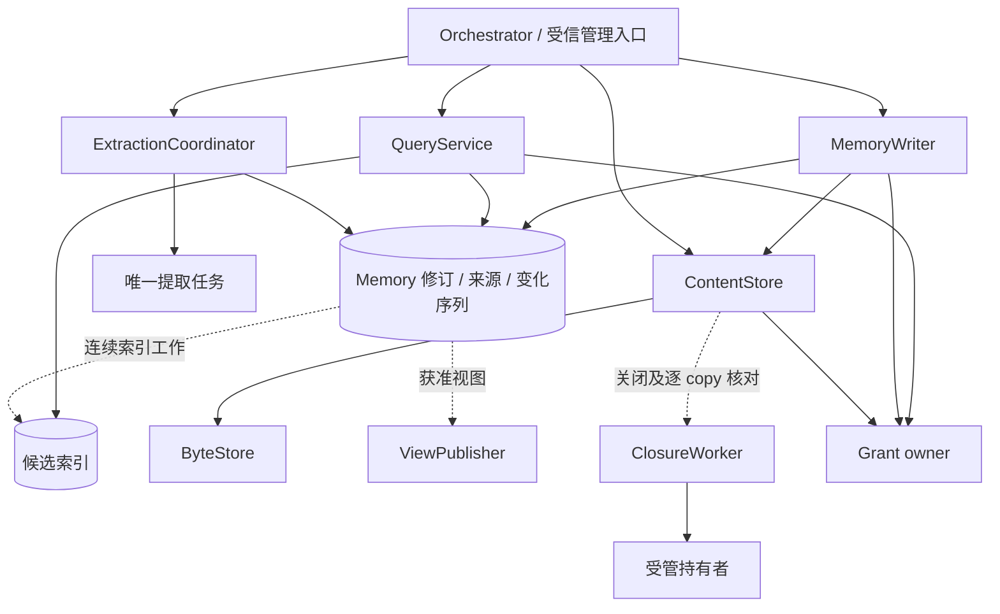
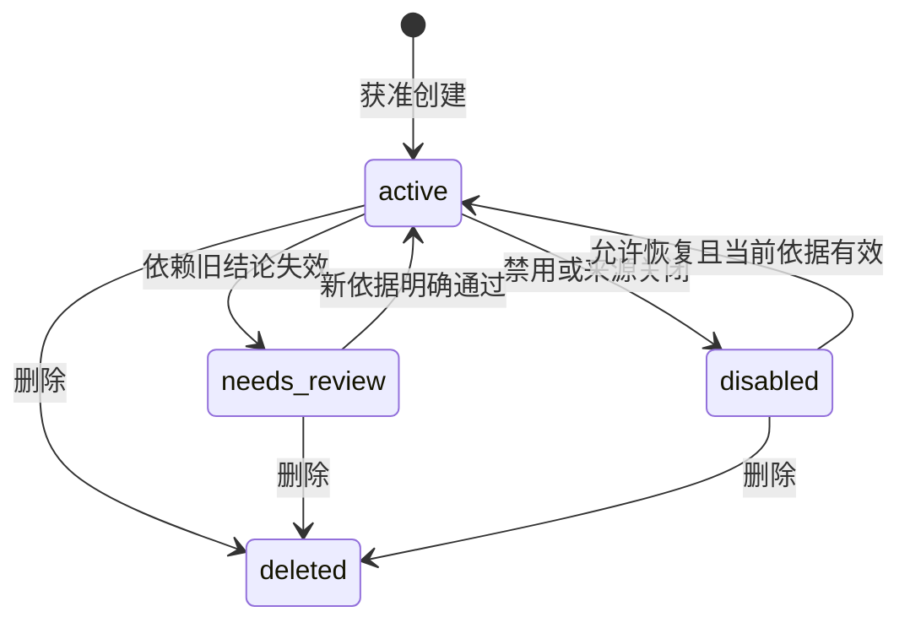
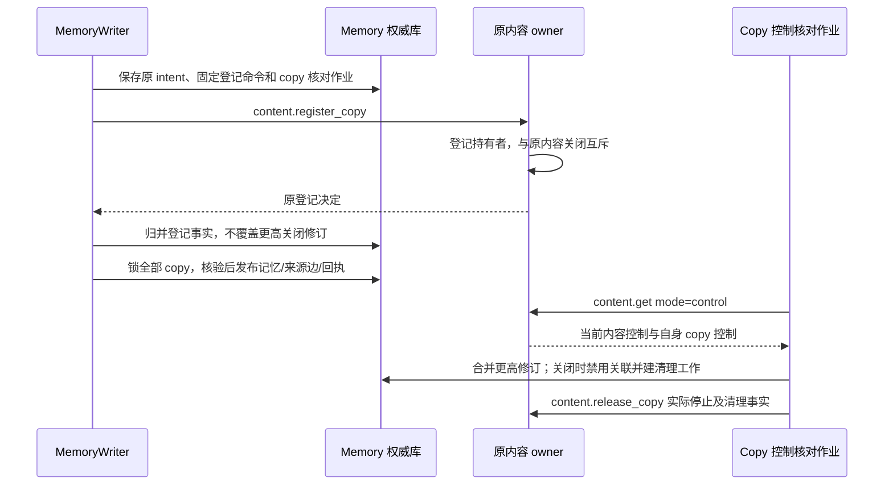

# 记忆、内容与来源

Memory owner 保存获准跨任务复用的记忆修订，内容 owner 保存准确字节、来源限制和副本清理责任；Orchestrator 选择当前任务所需材料，材料进入上下文不自动成为长期记忆。

领域含义见 [CONTEXT.md](../../CONTEXT.md)，字段以 [协议 Schema](contracts/schemas/protocol.schema.json) 为准。本文定义保存、查询、提取、内容交付和清理；许可消费归 [授权](authorization.md)，任务上下文归 [Brain](brain.md)，实现与验证记录统一见 [review.md](review.md)。

## 组件与依赖

每个记忆库固定一个逻辑 Memory owner；同一用户可以拥有本地私密库和云端共享库，Orchestrator 可以位于第三处。默认同租户 Memory 与 Content 元数据共用本地事务范围；独立部署通过持久副本登记交接，内容字节和索引均不能自行裁决使用权限。

| 组件 | 职责 | 持续责任 |
| --- | --- | --- |
| MemoryWriter | 修订比较、写入、候选唯一发布、收紧和删除 | 原写命令及其引用准备 |
| QueryService | 处理前范围过滤、候选、排序、冻结集合及分页 | 有期限的 query set；调用方保存游标和缺口 |
| ExtractionCoordinator | 固定提取输入、Orchestrator 任务映射及候选 | 原提取任务、候选决定和暂存清理 |
| IndexWorker | 按连续变化构建可重放索引 | 索引版本及连续检查点 |
| ViewPublisher | 固定视图快照、连续变化和 ACK | 未确认页、日志保留和旧副本收尾 |
| ContentStore / MetadataStore | 正文元数据、来源图、控制、持有者及原子事务 | 准确内容版本和逐持有者事实 |
| ByteStore | 有限暂存、准确字节读取、共享对象或本地目录 | 原 upload/ticket 的字节与清理观察 |
| ClosureWorker | 来源关闭传播、副本控制核对、停止和物理清理 | 原 copy 和关闭修订，直到责任结清 |

下图从数据引用观察依赖；实线是同步调用或记录引用，虚线是从所属数据库继续的持久工作。

规则函数负责范围匹配、排序、策略子集及候选决定，不访问远端或数据库。应用层取得当前依据后执行短事务；正文、索引、Grant 和远端 owner 调用在事务外。存储装配归 [部署](deployment.md)，幂等接纳、作业领取与受保护回写归 [可靠工作](reliability.md)。

## 数据模型与状态

记忆的业务修订、内容不可变版本、owner 的变化序号和各消费者检查点表达不同事实。正文引用不授予使用权，索引只是候选投影，原始内容到期和主动关闭来源也分别记录。

| 记录 | 关键事实与约束 |
| --- | --- |
| `memories`、`memory_revisions` | owner/memory ID、单调 current revision；准确正文、来源、范围不可就地改写 |
| `source_edges`、`policies` | 精确来源依赖与不可变策略修订；派生依赖无环，包含完整实际处理输入 |
| `memory_change_heads`、`memory_changes` | 每 owner 的已提交连续变化末端和共同提交的变化项 |
| `index_checkpoint` | 每索引版本的连续已应用序号，不使用单条 Memory revision |
| `query_sets` | 主体、接收方、查询摘要、配置、期限、有限有序准确修订和初始覆盖缺口 |
| `extraction_jobs`、`extraction_candidates` | 固定输入和唯一任务；候选修订、决定及实际保存的 Memory 引用 |
| `views`、`view_snapshot_items` | 接收方、用途、固定快照、变更起点及连续 ACK |
| `content_objects`、`content_controls` | 准确 ContentRef、固定 hash/长度、单调控制修订与策略 |
| `content_copies`、`content_mirrors` | 原引用、holder、用途、期限；镜像只有原内容的只读字节 |
| `reference_intents`、`held_copy_gates` | 原 Memory 命令、全部固定 copy 与登记命令；独立单调的 control/copy 修订及本地可用状态 |
| `content_closures`、清理记录 | 墓碑（tombstone）、逐持有者停止/清理事实和未结责任 |

来源记录（provenance）描述产生者、输入及过程；派生依赖（data lineage）连接完整处理输入，用于传递限制和关闭。它们不证明事实真实，也不授予许可。多来源处理采用限制交集；模型未引用某段输入，不会消除实际读过它的依赖。

ContentPolicy 的分类给出默认允许路径，实际读取、处理、保存和披露仍分别取得 [Grant 使用依据](authorization.md)。原文、向量、摘要、模型输入/输出、UI 缓存和临时任务上下文各自登记持有与保留；禁止保存的资料只能走可兑现的临时处理路径，不进入持久正文日志。

| 内容分类 | 允许路径 | 缺少条件时 |
| --- | --- | --- |
| `local_only` | 声明端点上的读取、处理和保存 | 无本地能力则等待；摘要、向量及布尔推断也不自动外发 |
| `controlled_remote` | 明确接收方、用途、保留期和处理位置 | 接收方或来源不可核对则拒绝新交接 |
| `replicated` | 已登记获准视图中的受管副本 | 缺同步/保存许可、适用租约或清理能力则不建立副本 |

| 类型 | 适用内容 | 采用规则 |
| --- | --- | --- |
| `fact` | 用户明确陈述或可定位观察 | 保留观察时间、范围及矛盾来源 |
| `preference` | 明确习惯或选择 | 当前指令优先，更具体的适用范围优先；同范围冲突需澄清 |
| `inference` | 限定输入和方法得出的推断 | 保留推断性质及方法置信度，不升级为事实 |
| `experience` | 正式任务、实际操作和核实效果 | 区分计划、行动、失败、未知和成功；列复用前提 |

下图只表示记忆的逻辑可用性；箭头为业务状态改变，物理清理是独立维度。

`needs_review` 不参与任务查询。明确 replace 使旧修订退出当前检索，其依赖记忆进入待核；若新结论实际用了旧正文，仍保留那条依赖。用户以新依据明确重写，或重新提取形成独立有效修订。已删除内容不能复活，相似资料重新保存使用新的明确命令和对象 ID。

物理清理独立采用 `pending / complete / residual / unknown`，按 holder 聚合；任一未停止、未知或残留都阻止汇总 complete。删除后的记忆由最小控制记录和墓碑表达，不保留含正文的 MemoryRecord 作为伪删除。

## 关键时序

### 正文提交与记忆写入

ContentStore 先取得完整准确字节，MemoryWriter 再提交业务引用与修订。`memory.create` 的 applied 表示权威修订已保存；索引可以随后追平。

1. 上传端按 [传输协议](contracts/transport.md) 预留有限暂存，上传完整字节并校验 hash、media type 和长度。
2. `content.put` 以原 upload、预期 ContentRef、完整来源与策略提交元数据；同一准确引用不能被不同字节覆盖。
3. MemoryWriter 取得管理/保存用途及当前来源依据；跨库引用先完成下一节的持久登记。
4. 写事务优先查原命令，依次锁 owner 变化序号行、按固定键排列的内容/copy 状态、候选和记忆业务行；外层原命令、任务与预算锁和最终作业锁顺序见 [可靠工作](reliability.md)。
5. create 检查唯一命令；replace/restrict/delete 比较 `expected_revision`。新修订或墓碑、业务引用、全部来源边、变化项、原回执及后续作业共同提交。
6. IndexWorker 继续原变化范围；答复丢失只查原命令，不另建记忆。

`restrict` 只收紧用途、接收方、位置、保留期和范围，owner 比较策略子集；放宽需新的明确授权。修订冲突由用户或原任务读当前版本后重新决定，不自动更换 expected revision。

引用登记和垃圾清理锁同一内容元数据行。清理先标记不可新增引用，再核无业务引用和持有者；登记必须检查该标记。字节已落地但元数据或业务事务失败形成孤立内容，沿原暂存责任有界回收；已经被业务采用的对象不能仅凭创建时间删除。

### 跨库引用与关闭竞争

跨库 Memory 发布先持久保存 reference intent、全部固定 copy 和控制核对责任，再向原内容 owner 登记持有者；本地发布与本地已知关闭共用 copy 行锁。正文及实际处理的远端来源都要登记，不能在恢复中换 copy 或遗漏输入。

下图以两个数据库观察登记和发布；箭头表示调用或本地提交，先后关系仅覆盖已经传到本地的控制事实。

准备事务不等于 memory.create applied。登记成功但发布失败、取消或进程退出时，原 intent 恢复查询原登记结果，继续合法发布或收尾原 copy，不把本地回滚当作远端登记不存在。

`held_copy_gates` 分别单调合并 `control_revision` 和 `copy.revision`，同修订异事实拒绝。原内容 closed 或 copy 已停止均封闭该 copy；控制关闭早于登记答复时先保存最小 closed 状态，迟到登记只补事实。发布事务核验全部登记、本地状态、原使用窗口和来源；关闭先提交则拒绝发布，发布先提交则随后禁用并清理。

普通 holder 定期通过 `content.get(mode=control)` 核对原准确引用及 copy，登记准备和重启时优先运行。失败时阻塞依赖的在线使用，不推断来源被删除；通知只提前原作业，不能取代定期查询。作业持续到实际停止、物理 complete 的 release 报告获原 owner 接纳；pending/residual/unknown 继续有界等待。

### 连续变化序号、索引与查询

Memory owner 的变化序号行与业务变化共同提交，保证消费者看到的是已提交连续区间。写事务锁 `memory_change_heads`，从 last sequence 后分配本次恰需的有限连续区间，追加变化并更新末端；回滚连取号一起回滚，后写者等前一事务结束。

所有影响 Memory 权威状态或视图投影的 create/replace/restrict/delete、关闭归并及派生状态修改都走此序列。只改 Content 控制的事务可以不锁它，但取得内容锁后不得反向加入 Memory 写入，应保存后续责任。不能用普通数据库 sequence、时间戳或变化表最大值代替已提交末端。

查询先取得允许处理的记录与字段，再生成候选，最后取得准确结果披露依据。搜索使用 continuous 许可的有限处理单元；once 只适用于来源及输出可预先固定的准确 read。未经许可正文不能先参与排名再被输出过滤。

| 默认查询步骤 | 具体规则 |
| --- | --- |
| 范围规范化 | Scope 的 task types、resource IDs、purpose tags 组内为空不筛选，非空取交集；不同维度同时成立。请求至少含词项、类型或非空范围之一 |
| 字面匹配 | 词项去空去重，每项最多 256 Unicode 码点；ASCII 折叠大小写，其余逐码点匹配；多词项取并集 |
| 稳定排序 | 匹配词数降序 → 非空范围维度数降序 → 非空范围元素总数升序 → observed_at 降序 → memory ID 升序 |
| 索引补扫 | 同一短 REPEATABLE READ 快照读取已提交末端 R、索引连续检查点 I 和获准变化，补扫 `(I,R]` 后与索引候选去重 |
| 固定结果 | 保存有限 `(memory_id, revision)`、排序依据、配置版本、期限及初始缺口；事务不跨客户端页请求保留 |
| 页披露 | 当前状态、准确修订、来源、保留期和披露权限逐项复核后返回 |

IndexWorker 在事务外幂等构建索引，再在短事务核对领取、范围连续成功和工作版本，前移 I，始终 `I ≤ R`；中间失败不越过。处理旧批次期间的新变化保持待办，不随旧批次完成消失。默认词法索引与权威库共分片、共快照；库外索引须固定与 I 对应的不可变段或等价快照，缺少它只能返回缺口。

查询去重只合并同 owner、同对象、同准确修订的重复命中；相似正文、同名主体或较新时间均不证明同一事实。时间、范围不同可同时成立；语义冲突保留来源和缺口，排序不裁决真伪。复合正文各断言保留自身观察时间，摘要生成时间不覆盖来源时间。

### 稳定分页与管理读取

Memory query 的每一页只遍历原有限准确修订集合，并重新判断本次可披露内容。游标绑定认证主体、接收方、owner、原查询摘要、集合和位置；同 query ID 改条件拒绝，新查询不重置任务累计预算。

| 页内事件 | 结果与继续方式 |
| --- | --- |
| 原成员修订、删除或失去披露许可 | 跳过，增加 skipped count 和 changed；不披露被跳过对象 ID |
| 来源不可核验 | 不输出该项，partial 和不含对象标识的 gap；不当作 source closed |
| 候选截断或补扫超限 | 初始缺口保存在集合，所有页持续 partial |
| 新记录或扩权让旧记录新可见 | 不插入原集合；调用方以新 query ID 取得新范围 |
| 空页仍有未扫描位置 | 保留 next cursor；每页至少消费一个位置或 exhausted |
| 集合过期 | cursor_expired；不能续旧集合 |
| 集合遍历完毕 | exhausted 只说明原集合结束，不消除 partial，也不证明此刻全库完整 |

`position` 表示页起点，`scanned_count` 是消耗的集合位置，items 是仍获准子集；无 next cursor 当且仅当 exhausted。同页重读可因当前权限收紧减少内容，不增加集合外对象。跨库聚合由 Orchestrator 保存每库游标和缺口，不形成跨 owner 原子快照。

`memory.list` 固定 ID 集合，逐页返回当前管理元数据；`memory.inspect` 直接读获准控制、限制和清理状态。正文不可读不妨碍有管理权的用户删除记录。通用 owner 集合恢复和订阅流程见 [集合契约](contracts/protocol.md#collection-snapshots)。

### 提取、候选与发布

`memory.extract` 只接纳一个有限提取责任，Memory owner 保存准确输入、规则及唯一 Orchestrator 任务映射后返回 queued；Orchestrator 执行模型、工具、预算和取消，Memory 保存候选及发布决定。

连接器声明有限可观察来源和稳定检查点；读取、处理、暂存和长期保存分别获准。检查点只在本批输入及下一责任均持久后前移。输入固定准确 ContentRef、规则 ComponentRef、字节/token、候选数、期限及费用上限；local_only 缺本地能力则等待或报告不支持。

候选采用 `pending / saved / rejected`，已决定终态不改写。每次模型调用保留完整输入清单，候选继承其完整限制并进入有限期暂存。默认逐条确认；自动保存仅用于用户预授权覆盖的来源、类别、用途、范围、期限和额度。

| 发布或结束动作 | 决定与恢复 |
| --- | --- |
| 明确保存候选 | `memory.create` 带准确 candidate ref；Writer 锁候选，核 pending、内容/类型/来源/范围一致，与正式记忆、saved、实际引用和回执共同提交 |
| 两端并发确认 | 候选唯一发布约束裁决；同命令返回同结果，新命令不能发布第二条 |
| 编辑候选 | 形成新候选修订或普通明确用户写入，不修改已经确认的对象 |
| 拒绝候选 | 固定受信 `memory-candidates` 处理器消费 candidate.reject，核管理权和修订，同事务 rejected、回执和暂存清理 |
| 取消提取 | 关闭新处理和 pending 自动发布，已保存记忆保持原事实；仍有效的已产生候选可由用户另行明确确认 |
| 候选到期或来源关闭 | 拒绝保存，沿原暂存责任清理 |
| 任务结束触发 | 仅用户选定类别，按 task/terminal revision/policy version 去重；失败、取消或效果未知不自动提成成功经验 |

可选质量检查将一次候选限制为可单独纠正的断言或前提完整的经验。正文格式保留主体、否定、条件、事件时间/有效区间、性质和准确来源片段；未明时间标未知，不能挪用来源许可的 valid_until。经验增加环境/工具版本、实际行动、核实效果与复用前核对项。质量检查分别审查覆盖、原信息保留和来源支撑，保留检查只处理该改写候选或拟替换记录，不要求全库处理；分数不替代保存许可，语义不明留待确认，不自动 replace。

### 内容读取与持有者控制

内容消费者在收到正文前登记固定 copy、准确引用、实际 holder、用途、接收方和保留期，再请求字节。登记 applied 只保存持有者责任；读取时重新核验内容、来源与用途。

| `content.get` 分支 | 返回与核验 | 后续责任 |
| --- | --- | --- |
| 默认或 `mode=bytes` | ContentBytesGetOutput，绑定原 ContentRef、copy、主体、接收方和有限 download ID | 不创建 copy；下载前及长下载有限块继续核当前状态，失效停止后续字节 |
| `mode=control` | 当前认证 holder 自身的 ContentControl 与最小 ContentCopyControl | 正文 closed、保留期结束或读取 Grant 撤回后仍可收尾；无 download ID，不授予 read/store 或新使用窗口 |

control 输出只含自身 copy 的引用、holder、修订、use stopped 和 physical state，不含其他副本、用途清单、清理证据或凭据。服务调用采用受信 sender service，直接 holder 采用 actor；payload 不选择 holder。输入 mode 与输出分支严格绑定，认证身份失效仍拒绝。

下载定位不延长原授权或保留期，重复 get 可以换定位而不能换原责任。字节缺失时展示缺口，hash 不替代正文。已交付字节沿原 copy 停止与清理；详细 HTTPS 字节端点归 [传输](contracts/transport.md)。

### 无入站设备的镜像交付

无入站地址的设备向已配对连接服务的受信镜像接收端主动上传原内容，镜像不取得新 owner 或新的 ContentRef。接收地址只从受信装配解析，资料本身、模型参数和任意 URL 不改变目的地。

1. 原内容 owner 提交 `content.register_copy`，实际 holder 指向镜像接收端。
2. 接收端核原登记，以原 MirrorTicket 预留有限空间；票据固定 ticket/upload、receiver service、sender endpoint/instance、准确引用、copy、来源控制修订及期限。
3. 接收端沿设备主动建立的 WSS 发送票据，设备复核 copy、来源、接收方、用途、期限和固定地址，再主动传原字节。
4. 接收端核 hash、长度和类型，将准确对象版本与 ready 元数据原子关联。云暂存和镜像使用跨实例共享字节存储。
5. 每次镜像读取仍向原 owner 请求当前 bytes 结果；接收端验证受信响应，绑定 download ID、copy、控制修订及期限，再交付本镜像字节。
6. 原 owner 关闭时保存逐镜像传播责任；接收端按原 ticket/control ID 和单调修订关闭读入口、保存清理，再清暂存、镜像和派生缓存。

基础上传不要求 Range，中断后在原 ticket 期限内整份重试，复用 upload ID；ready 且元数据相同返回原结果，不同字节拒绝。失答复查 mirror lookup；新实例不能沿用旧实例上传许可，但当前认证 owner 实例仍可恢复关闭通道。票据到期重传须重新核验原 owner 当前条件。

基础配置对 restricted 更新也关闭整个镜像；仍允许复制时重新登记和传输。原 owner 不可达停止新的镜像读取；ready、旧 ticket、旧 bytes 回复和 control 分支均不自动形成离线使用许可。具体传输帧、Reply/ReplyAck 和上传状态契约归 [transport.md](contracts/transport.md)。

### 获准视图与增量同步

视图固定接收方、用途、投影、保留期和原快照，仅单向发布获准对象。接收端本地编辑作为待提交意图，联网后向原 owner 以 expected revision 提交；它不改写副本为新权威。

`view.open` 在有界 REPEATABLE READ 事务中按原命令 → owner 变化序号 → 视图的锁序，读取同一快照下的已提交末端 S 和有限对象版本集合，保存后结束事务。它不递增变化序号，也不能分两次时刻读取 S 和对象。超出总对象数、元数据字节或时长上限返回 quota_exceeded，不留下成功视图。

`view.pull` 先遍历固定快照，再取 S 之后连续 Memory 变化；每页固定 page ID、起止游标和阶段。Memory 变更使对象退出过滤时发送墓碑，进入时发送当前获准 upsert；每页仍复核来源、权限和准确内容。接收端同事务应用修订/墓碑、清理责任及游标，之后 `view.ack` 连续已应用位置；重复 pull/ack 不重复应用，不越过缺页。

变化日志回收先锁 owner 变化序号，再锁视图/检查点。短 READ COMMITTED 事务在取得锁后用新语句读取必要水位，避免漏掉刚登记的视图；不降低 last sequence，不从剩余日志最大值重建。必要历史缺失则 resnapshot_required，禁用无法证明连续的旧视图、建立新快照并保留旧副本清理。

另一个 Grant owner 单独扩权不产生 Memory 变化，原视图不会自动发现新获准旧对象。扩权确认后或需要当前完整授权集合时重新 view.open；exhausted 只覆盖原快照及后续 Memory 变化。filter 仅类型与 Scope，projection 仅 metadata/content refs，不接收脚本。

### 来源关闭与物理清理

内容 owner 在关闭事务内比较控制修订、封闭新交付、保存墓碑及逐 holder 清理工作；持有者先封闭关联新使用，再核对或终止已经进入的有限使用单元，最后按自身范围清字节。

`use_stopped=true` 需要全部关联入口及在途单元的停止事实，单改可用状态不够。`physical_state=complete` 需要正文、派生物、索引、缓存及暂存的实际清理证据；`content.release_copy.applied` 只证明 owner 保存了报告，不把 residual/unknown 提升为 complete。

普通副本通过原 control 查询恢复，镜像另可接收 MirrorControl；关闭传播按完整 source edges 覆盖摘要、经验、向量、模型输入/输出及 UI 缓存。无法登记 holder 或不能兑现要求的清理期限时，在交付前拒绝。

原文按已确认保留策略正常到期时，可在独立许可下保留最小来源和派生物，说明无法逐字核验；主动关闭来源则传播到受管派生物。恢复实例先加载当前禁用/删除记录、来源限制和未结清理，再开放读取；旧备份不能证明当前关闭记录时保持相关内容禁用。

## 可选检索与经验策略

默认查询保持字面基线 B0；B1、B2、显式关联和读时整理是分别选择、配置和评测的策略，不改变写入、分页或清理契约。实验与采用依据归 [评测](evaluation.md)，具体启用记录归 [review.md](review.md)。

| 策略 | 处理规则 | 固定依赖 |
| --- | --- | --- |
| B0 字面 | 上文默认排序与补扫 | 无嵌入模型 |
| B1 中文词法 | 中文字符二元组（character bigram）、ASCII 词元，保留完整原词精确通道 | 切分和覆盖规则版本；不默认引入 BM25 |
| B2 混合候选 | B1 与语义独立候选，以倒数排名融合（Reciprocal Rank Fusion，RRF）得分 `Σ 1/(60+rank)` 合并，未命中路贡献零，同分按准确 ID | 两路各最多 80、等权；共享 200 总集合上限 |
| 显式一跳关联 | 仅正文明确的冲突及前提引用，冲突支持双向查找 | 独立关系投影、水位、解析版本；不写治理 source edges |
| 读时整理 | 先元数据和前提，再短断言，需要时有界读取原材料并整理 | 原上下文任务或独立提取任务，准确来源和费用；保存另走候选发布 |

B2 首轮在原 owner 受控宿主运行固定模型/tokenizer 的本地编码器，关闭网络、隐式持久缓存和自主工具。先物化或等价隔离获准有限集合，再计算其中向量距离；SQL 事后过滤、仅按 tenant 分区或 ANN 迭代扫描不能代替处理前隔离。空词项的合法过滤查询不编码空串；直接按范围、时间和 ID 排序。

词法、向量和关系投影各自保存连续水位；词法补扫不证明补齐语义召回。向量不足或已选分支故障返回原查询的 partial/gaps，原 IndexWorker 后台补齐，不在只读 query 中生成持久向量。建立前合法关闭 B2 是选择 B1，建立后失败是降级，二者分别记录。

索引键绑定 owner、准确 Memory/Content 修订、切分、模型、维度和代次；重建不改权威修订。每次真实编码重算独立登记尝试和 use、本地 CPU/内存及费用；确认旧计算结束或终止才释放资源，unknown 不记零。查询向量仅在原处理单元内暂存，结束或到期清理。

关联扩展每项独立取得处理许可，和两路候选/补扫共享扫描预算；受限端点不泄露 ID，不无界遍历。命中旧 A 时可发现新 B 明示的反向冲突，但无显式边不代表无冲突；必要材料带不齐保留 gap。Memory 不填满 Brain 上下文，Orchestrator 按当前要求、准确片段和 need_context 选择材料。

查询词、向量及重排输入按敏感材料处理。普通诊断只记获准版本、数量、排除原因和成本；正文诊断使用受控引用，不记录无权对象 ID、查询正文或可逆提示词。

经验只提供前提与建议。能力版本变化、关键前提未知或原效果未核实，当前任务须重新观察和准入；按命中次数自动遗忘正式记忆、自动将经验转成 Skill/计划、远端付费嵌入、结构化 as-of 查询均见 [问题清单](open-questions.md)。

## 失败处理

Memory 的恢复以原命令、准确引用、连续序号和逐持有者责任为依据。查询缺口必须进入 Orchestrator 上下文，返回几条有用材料不消除完整性缺失。

| 故障或竞争 | 行为 | 继续者 |
| --- | --- | --- |
| 写已提交但答复丢失 | 原命令恢复同修订；当前无正文权限只返回获准状态 | 调用方与 MemoryWriter |
| replace 并发 | revision_conflict，读当前修订后重决策 | 原管理入口或任务 |
| 索引落后/损坏 | 有界补扫或扫描，超限 partial；旧命中不恢复旧正文 | QueryService / IndexWorker |
| 跨库登记失答复 | 查原登记，不发布未知关系，不换 copy | reference 作业 |
| copy 关闭先到、登记后到 | 高修订 closed 保留，发布拒绝并清理 | MemoryWriter / ClosureWorker |
| 两端确认同一候选 | 一次正式发布，另端读已决定结果 | MemoryWriter |
| 内容存储不可用 | 可管理获准元数据及提交逻辑关闭；正文缺口，字节清理 pending | ContentStore / ClosureWorker |
| 来源暂不可达 | source_unavailable，不误报删除；必要材料等候，可选材料显式缺席 | 原任务及控制核对作业 |
| 副本已应用、ACK 丢失 | 原页幂等恢复，应用和游标不分离 | ViewPublisher / 接收端 |
| 变化日志断裂 | resnapshot_required，禁旧视图并保留旧清理 | 接收端和原 owner |
| 镜像上传失答复或实例退出 | 查原 ticket/upload 和共享准确对象版本 | 原设备及接收端 |
| 原 owner 失联而镜像 ready | 禁止新镜像读取 | 原 content.get 核对 |
| 已关闭后旧备份恢复 | 先恢复最小控制和未结责任，无法证明则禁用 | 恢复实例 |
| 清理残留或未知 holder | 不汇总 complete，不丢责任 | 原关闭记录及每个 holder |
| 作业处理旧批次时新增工作 | 已核实事实可单调归并，新责任继续；失效领取禁止回写 | 所属作业处理器 |

稳定作业键分别绑定 index version、extraction ID、原 Memory command、原内容 owner/copy、准确关闭版本/holder 和 view/work kind。同步 query、分页和 control 读取仍是查询，不转成后台业务队列；其 Grant 使用独立办理。

## 保证与限制

Memory 提供单库修订顺序、可恢复发布、准确引用和可见缺口；正确性依赖原 owner 的权威记录、处理前授权与完整来源/持有关系。它不把检索相关度、同步成功或删除回执扩张为更强保证。

| 保证 | 前提与限制 |
| --- | --- |
| 单库唯一写权威 | 远端库失联不在其他端改写它；本地独立库可新建独立记录，之后显式合并 |
| 写入成功可读 | 索引异步，通过有界补扫覆盖；超过上限返回缺口，不承诺无限扫描 |
| 共库关闭与发布互斥 | 同事务同锁；跨库只与已同步本地关闭互斥，原 owner 刚关闭而尚未查回时仍可能发布，后续使用继续在线核验 |
| 稳定有限查询 | 集合及顺序固定，每页当前披露；不等于当前全集、语义穷尽或跨库同刻快照 |
| 原来源限制随派生传播 | 完整实际输入已登记；原文到期后可能仅保留获准最小证据，不能逐字核验 |
| 删除封闭新使用 | applied 表示墓碑和清理责任已保存，不能证明所有字节已擦除 |
| 离线副本有限停止窗口 | 只按 [授权租约](authorization.md#离线租约与串行封账) 原范围使用；获知关闭立即停，未获知最迟期限到期；即时撤回资源不开放离线 |
| 受管物理清理 | 备份、断网设备、用户导出、终端显示和外部提供方按各自能力报告 residual/unknown，不宣称远程抹除用户已看见内容 |
| 基础镜像只提供在线使用 | 每次取得原 owner 当前 bytes 结果；ready 不提供独立离线读能力 |
| 权限与事实分别核验 | 置信度和检索分数不能替代许可、来源状态或外部事实核验 |

## 取舍与容量

Memory 优先将可纠正的权威记录与可替换的候选索引分开，保留清理和原责任恢复容量。提高检索质量的代价必须通过同预算的实际任务效果判断。

| 选择 | 代价 | 改选条件 |
| --- | --- | --- |
| 单 owner 串行提交变化序号 | 热 owner 短写事务及快照登记存在行锁等待 | 实测成为瓶颈后评估独立已提交发布流程，重新证明补扫与快照衔接 |
| 默认词法索引与库内补扫 | 中文改写及语义召回有限 | B1/B2 独立对照有净收益且处理、保存、清理均可兑现 |
| 单向获准视图 | 离线编辑须重新提交意图，扩权须新视图 | 明确需要多端同时离线编辑同一记录时，另设计合并与删除优先规则 |
| 正文版本与索引分离 | 读取增加当前权威核验 | 同事务同权限域可合并读取，外部行为保持一致 |
| 基础镜像每次在线核验 | 原设备失联时镜像不可新读 | 明确需求及有限离线许可、控制恢复验收齐备后再扩展 |
| 写时简短记忆、读时按需材料 | 原文不能保留时无法恢复细节；整理增加实时成本 | 仅在同口径实验表明收益覆盖成本时选用整理 |

查询、提取和视图的初始限额统一见[容量配置](capacity.md#决策与记忆的有限输入)。实际扫描、来源核验和计算量分别预算，页大小不等于处理量。

过载先限制新提取、上传、视图，再收紧新查询；保留删除、来源关闭、原上传核对和清理容量。记录扫描/返回比、partial 比例、索引滞后、最慢视图 ACK、暂存预留、重传放大、关闭到停止延迟及最老清理龄期；最小删除记录、source edges、WAL、备份和重建空间计入存储预算。验收入口见 [故障实验](validation/fault-experiments.md)，质量实验与证据见 [evaluation.md](evaluation.md) 和 [review.md](review.md)。
