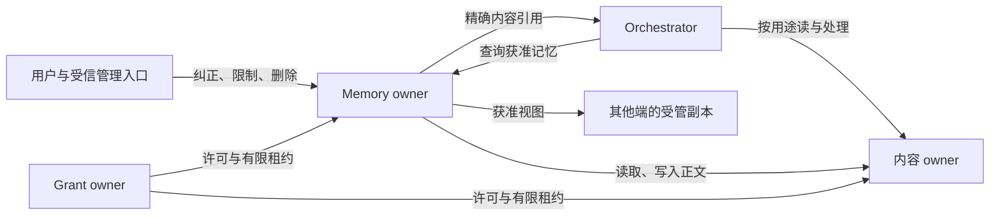
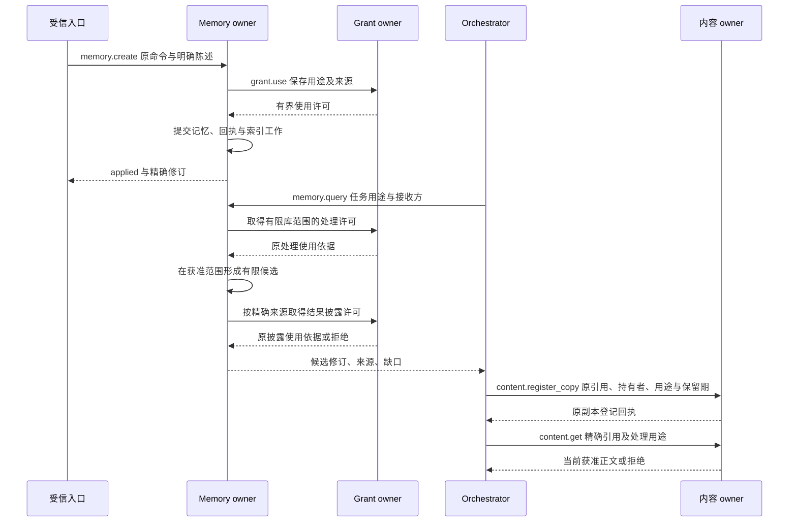
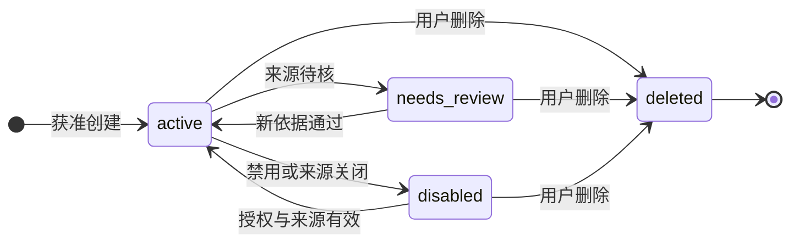

# 记忆、内容与来源

[整体设计](../README.md) · [目标](../goals.md) · [授权规则](../security/README.md) · [大脑](../brain/README.md) · [模块 UML](../uml-models.md#memory)

本模块规定跨任务保存和复用个人信息、经验的条件，以及用户纠正、限制和删除后的处理方式。实现人员可从本页了解完整行为，再按阅读路径实现写入、检索、同步与清理。覆盖 C2、C3、C7、C9 及三系统独立替换要求。

Memory owner 保存记忆修订和检索依据；内容 owner 保存准确正文、来源及副本清理责任；Orchestrator 选择当前任务所需材料并组织使用。三者分别保存自己的权威事实。

本页与实现设计构成现行设计基线，参考实现和运行验收仍待交付。替换实现必须保持 owner、来源、许可、修订、分页和清理语义。字面召回和初始配额是默认实现选择；中文词法、混合检索、候选质量检查和经验整理仍是待评测策略，不因写入设计文档而成为默认。

## 阅读路径与规则归属

先用本页理解保存、查询和关闭的完整行为，再按实现职责进入后续文档。完整规则在下表所列位置维护，研究证据和检查记录不另行定义运行契约。

| 顺序 | 文档 | 负责定义 |
| --- | --- | --- |
| 1 | 本页 | 模块边界、关键取舍、写入与查询行为、内容治理、集中字段及方法语义 |
| 2 | [实现设计](implementation.md) | 软件组件、持久对象、事务与锁序、索引水位、候选发布、内容交付及恢复 |
| 3 | [质量优化策略](optimization-plan.md) | 写入保真、B0／B1／B2 检索、显式关联、本地嵌入和读时整理的候选机制及采用边界 |
| 4 | [容量、验收与建设顺序](validation.md) | 配额起点、行为与故障用例、质量对照、指标、启用与回退门槛、阶段退出证据 |

精确协议字段以[机器契约](../contracts/schemas/protocol.schema.json)和[方法登记](../contracts/schemas/methods.json)为准；领域含义在本页[集中定义](#memory-contracts)。外部依据见[近半年论文](../../research/agent-memory-papers-2026-09-28.md)与[开源实现](../../research/agent-memory-libraries-2026-09-28.md)。研究结论不表示本项目已实现相应能力。

## 1. 边界与选择

**任务上下文**是 Orchestrator 为一次决策选择的目标、进展、证据和内容引用，随任务保留策略管理；**长期记忆**是取得独立保存许可、可以跨任务检索的记录。进入模型上下文不自动产生长期记忆，也不自动允许发送给云模型。[任务运行](../orchestrator/README.md)保存上下文版本与使用责任，本模块保存记忆修订、检索依据和清理责任。

**owner** 是对象所属账本的逻辑负责方，不是当前调用进程。一个记忆库只有一个固定 Memory owner，同一用户可有本地私密库和云端共享库；Orchestrator 可以与两者不同。一个库失联时不在另一端改写它。用户可以在本地库新增独立记录，日后显式合并；它不能冒充远端旧记录的新修订。

内容 owner 保存正文及其版本；任务、执行或记忆模块可以拥有内容。云端默认内容元数据与对应业务记录处于同一本地事务范围，正文放跨实例共享对象存储；个人设备保留适用的本地存储。其他模块替换内容实现时，仍须提供本页的引用、权限、保留和清理行为。

图中箭头表示调用或资料交接；各 owner 保存自身事实，身份和许可规则见[授权](../security/README.md)。同进程以 Go 接口组合，共事务职责共享事务句柄；独立服务跨进程使用 gRPC，端云使用 WSS，均沿[公共接口](../contracts/README.md)。

| 决策 | 推荐理由与代价 | 改选条件 |
| --- | --- | --- |
| 库内单一写入权威，跨库查询显式聚合 | 纠正和删除有确定顺序；离线端不能自动改远端记录，用户承担稍后的冲突选择 | 出现同一条记忆必须多端同时离线编辑的需求，再设计冲突合并与删除优先规则 |
| 正文为版本化内容，索引只是候选 | 可替换索引而不改变来源和授权；读取多一次权威核对 | 全部内容与索引同事务且同权限域时可合并读取，仍保留相同外部行为 |
| 默认词项／字面召回，可选语义候选 | 首个实现不依赖嵌入供应商，也避免默认外发；模糊关联的召回较弱 | 隔离评测证明语义检索收益，并具备嵌入处理、保存、删除许可后启用 |
| 获准视图单向同步 | 副本用途与保留明确；不把聊天记录复制到每个设备 | 明确历史同步需求时建立独立视图，不能扩大现有视图含义 |

## 2. 信息类型与正常链路

| 类型 | 写入依据 | 使用规则 |
| --- | --- | --- |
| `fact` 事实 | 用户明确陈述或可定位的来源证据 | 保留观察时间、适用范围与相互冲突的来源；不把过时事实当当前状态 |
| `preference` 偏好 | 用户明确表达的习惯或选择 | 当前指令优先；更具体且适用的偏好优先；同范围矛盾时交用户澄清 |
| `inference` 推断 | 由限定输入和方法得出的候选判断 | 展示推断性质与置信度，不自动升级为事实 |
| `experience` 经验 | 正式任务结果、操作事实和适用前提 | 必须区分计划、实际行动和核实效果；一次成功不声明普遍有效 |

例如，用户要求保存「技术评审先给结论，再给取舍表，仅用于技术评审」。受信入口先展示保存内容、用途和范围，取得 `store` 许可后调用 `memory.create`。

Memory owner 在一个事务中写入记录、原命令答复和索引工作。`applied` 表示权威记录已可读；索引更新可以稍后完成。新任务查询这条偏好时，内容 owner 分别在读取、传给所选模型、展示输出的交接处检查用途。模型采用偏好后的实际影响，由验收样例验证。

| 发起方 → 处理方 | 交接输入 | 持久成功点 | 失败后由谁继续 |
| --- | --- | --- | --- |
| 受信管理入口 → Memory owner | 原命令、明确内容、来源和保存依据 | owner 同事务提交记忆修订、原回执及索引责任 | 管理入口查原命令；owner 补齐索引，不能让调用方再建一条 |
| Orchestrator → Memory owner | 库、用途、接收方和有限查询 | owner 固定查询集合，返回当前获准项及完整性；结果不等于正文永久可用 | Orchestrator 保存已用版本、游标与缺口，按[分页规则](#memory-pages)继续 |
| 内容消费者 → 内容 owner | 先以原命令登记精确引用、持有者、用途与保留期，再用该 copy_id 请求正文 | 登记回执只证明持有者责任已保存；`content.get` 当前核验通过后才交付获准字节，无入站设备主动上传到受信接收端 | 消费者沿原登记命令核对、停止并清理副本；镜像不改变 owner，缺少正文或不满足使用条件时返回缺口 |
| Memory owner → 受管副本 | 获准视图页、修订或墓碑 | 副本同事务提交对象变化、清理责任和游标后确认 | owner 保留未确认交付；副本沿原页恢复，断裂时重建 |

使用许可的消费由 [Grant owner](../security/README.md)裁决；Memory owner 不能根据资料已在本地推导出可读取或可外发。表格仅汇总交接责任，完整字段在[集中契约](#memory-contracts)。

来源记录（provenance）描述资料的产生者、输入和生成过程。派生依赖（data lineage）记录内容由哪些输入生成，用于追踪来源变更及清理范围。使用、生成与派生关系可对应 [W3C PROV 的通用概念](https://www.w3.org/TR/prov-o/)。

来源记录与当前授权分别核验；缺少任一必要依据时，停止相关使用。本项目还要求沿完整处理输入传播用途限制。来源记录本身不授予权限，也不证明内容真实。

来源控制元数据与原文保留分别管理：原文按已确认策略到期清理时，可以保留获准的最小来源记录及派生使用许可；这不等于用户要求关闭来源及派生物。缺原文时标明证据保留边界，不声称仍可逐字核验。记忆中的置信度不能替代许可、来源当前状态或外部事实核验。

## 3. 保存、提取与修订

### 3.1 写入和并发

`create` 以原命令唯一约束防重复；`replace`、`restrict`、`delete` 必须携带 `expected_revision`。Memory owner 在事务内比较修订并保存新记录、固定回执和后续工作。冲突返回 `revision_conflict`，调用方读取新修订后由用户或任务重新判断，不能自动换期望值重试。

`replace` 表示用户纠正或更新，旧修订退出检索，其依赖内容不能继续被当作当前记忆。旧内容只在仍获准的历史证据范围保留；对外传播失效记录，派生记忆进入 `needs_review`。若新结论确实使用过旧正文，其来源仍包含旧修订，不能删掉这条依赖伪装独立来源。`needs_review` 不进入任务查询；用户以新依据明确重写，或重新提取后生成独立有效修订。

正文先在内容库完成持久保存，再提交引用和业务记录。正文已保存而业务事务失败形成孤立内容，由有界清理工作回收；清理选择与新引用登记通过同一内容元数据行锁互斥，避免删除刚被采用的正文。存储不可写时返回不可用或提交未知，不能报告已经保存。

写答复丢失时，调用方用公共原命令查询取得固定决定，查询和内容披露仍受当前权限约束。写入已经生效但现已无读取权限时，可以返回获准的提交状态，不重新披露正文。不得换 `command_id` 把提交未知变成第二次写入。

### 3.2 端侧挖掘与提取

端侧连接器先声明可观察来源、有限输入范围和稳定检查点；用户分别批准读取、处理、候选暂存及长期保存。

`memory.extract` 接纳有限提取任务。原命令、输入集合和唯一 Orchestrator 任务映射持久保存后，接口返回 `applied`，输出 `state=queued`。这表示推进责任已保存，不表示已经生成或保存候选。Orchestrator 负责执行、取消和预算；本模块保存候选及发布决定。

只有对应输入和下一步责任都已保存，连接器才能前移扫描检查点。

本地私密资料优先用本地可用模型；没有获准且可运行的本地处理能力时等待或报告不支持，不能自动切云。调用云模型必须获准向精确接收方 `process` 与 `disclose`；只允许保存一条偏好，不等于允许上传提取它的完整聊天。

提取结果先按四类记录形成候选。每个候选继承实际处理输入的完整来源约束，模型没有引用某段输入也不能自动排除它。默认逐条确认；用户可以预授权有限来源、类别、用途和额度内的自动保存。自动规则只能处理约定的候选，不能扩大输入扫描范围或改变来源限制。常规获准记忆更新无需声称「系统已进化」，改进收益由[评测](../evaluation/README.md)另行证明。

可选任务结束触发器按 `(task_id, terminal_revision, extraction_policy_version)` 去重，仅对用户选定类别启用，生成独立提取任务；原任务失败、取消或效果未知时不自动提取为成功经验。提取失败不修改原任务结果。

候选的持久化与确认见[实现设计](implementation.md#4-端侧提取与候选发布)；如何减少遗漏、无依据概括和错误经验，见[候选质量策略](optimization-plan.md#write-quality)。两者分别规定发布契约和待评测的提取方法。

### 3.3 时间、冲突与去重

去重默认只合并相同 owner、对象及准确修订的重复命中。相似正文不等于同一事实：设备在 t1 关闭、t2 打开是两个观察，两个范围不同的偏好也可能同时适用。查询返回既有 type、scope、observed_at、sources 与准确内容，复合正文中的各项断言另保留各自时间／范围，不能用整份摘要的生成时间覆盖源观察时间。语义冲突无法判定时保留不同来源和缺口；排序靠前不能证明该记录当前正确。

明确 replace 使旧修订退出当前检索；来源不同而相互矛盾的记录，不能仅因较新就删除另一份。获准整理可将冗余显示合并，但保留全部来源、事实／推断性质和适用边界；无法保留这些信息便不合并。Memory 的 partial、changed 与来源缺口必须进入 Orchestrator 上下文，不能因返回的几条材料看似足够便改报完整。这些约束由[记忆与长任务组合用例](../validation/optimization-evidence.md#scenarios)验证。

## 4. 查询与使用

### 4.1 查询的授权边界

查询先按认证用户、库、用途、接收方、类型和适用范围确定允许处理的记录与字段。索引只在这一范围内产生候选；未经许可的正文不能先参与排名再仅在输出时过滤。

搜索需要 continuous 许可。候选处理按受信库范围创建有限使用单元；取得有限结果后，再按精确来源取得披露使用依据，两个用途分别计数。once 仅支持来源和输出范围可预先固定的精确 read，不以一次搜索承诺未知结果集合。许可无法取得时返回拒绝或负责方不可用，不能降级为未授权扫描。

### 4.2 默认匹配与索引补齐

参考实现先用字面匹配：ASCII 大小写折叠，其余按 Unicode 码点匹配；多个查询词取并集。候选依次按匹配词数、范围具体程度、观察时间降序排列，以 `memory_id` 打破同分。短查询也遵守扫描上限。这一算法便于复现和本地部署，不宣称具有中文分词或语义理解能力；替换为语义检索时仍保留本页的授权、版本与分页规则。

权威记忆提交和索引更新可以相隔一段时间。owner 记录索引已连续处理的变更序号，即索引检查点，在未追平区间补扫权威记录，再合并去重候选；扫描超过上限则返回 `partial` 与缺口。由此，写入成功不必等待索引，但查询不能把未覆盖的变化伪装为完整结果。具体事务库与索引装配见[部署方案](../deployment.md)。

中文与语义召回的替代配置见[检索策略](optimization-plan.md#retrieval)；其启用不改变处理前授权、权威补扫和逐页复核的含义。

### 4.3 稳定分页与管理读取

初次查询冻结有限有序的 `(memory_id, revision)` 集合、排序依据和截止时间，并生成不透明游标。后续页只遍历该集合，每次返回前重新核对当前记录状态、来源、用途和披露权限。

被删除、修订或失去披露权限的项会被跳过。页结果返回跳过数量和 `changed`，不返回受限对象标识；来源无法核验时，还须返回 `partial` 和缺口。新记录留给新查询。冻结集合遍历结束，不表示此刻所有新获准记录均已枚举。

空页可以带下一游标，调用方不能把空页当作全部结束。

游标绑定认证用户、调用主体、接收方、原查询摘要、库 owner、集合与遍历位置，不携带正文。每页消耗至少一个未遍历位置或返回 `exhausted=true`。候选或补扫达到上限时返回 `partial` 与缺口，不以有限集合结束声称检索完整。集合过期返回 `cursor_expired`，调用方重新查询；新查询不会重置任务累计扫描与返回预算。跨库聚合由调用方保存每库游标和缺口，不能把部分库返回包装成完整结果。

`memory.list` 用于用户管理，按 ID 列出当前控制元数据，不要求旧正文仍可读；固定 ID 集合之后逐页读取当前修订。`memory.inspect` 允许直接取得获准的当前修订、限制和清理状态。管理结果仍受最小披露权限约束，无正文读取权不妨碍用户删除自己有管理权的记录。

## 5. 内容、视图与清理

### 5.1 隐私分层

| 策略 | 允许路径 | 缺依赖时的行为 |
| --- | --- | --- |
| `local_only` | 声明端点上的读取、处理与保存 | 无本地能力就等待；派生摘要、向量和布尔结果也不能自动外发 |
| `controlled_remote` | 明确列出的接收方、用途、保留期和处理位置 | 接收方或来源记录不可核对时拒绝新交接 |
| `replicated` | 已登记视图中的受管副本 | 没有同步／保存许可、有效租约或清理能力时不建立副本 |

分类用于表达默认路径，最终许可按具体动作逐项检查。原始内容、索引、派生记忆、模型输入／输出与 UI 缓存分别登记持有和保留责任。任务上下文需要临时保存时也必须获准；禁止保存的内容只能进入部署可兑现的临时处理路径，不产生持久正文日志。

### 5.2 获准视图与独立 owner

视图是 Memory owner 为指定接收方生成的有限对象集合及投影，绑定用途、租约、保留期和当前规则版本。接收端是只读副本；其本地编辑另存为待提交意图，联网后按原 owner 的期望修订提交。远端库失联不会阻止用户操作本地独立库。

视图按以下顺序同步：

1. `view.open` 在同一数据库快照中固定 owner 的已提交变更序号上界和有限对象版本集合。序号来自与业务共同提交的[变更序号记录](implementation.md#memory-change-head)，不能用普通数据库序列的最大值代替。
2. `view.pull` 先返回快照页，再返回该序号之后的连续 **Memory 对象变化**。每页仍按当前授权、来源和正文保留规则检查。
3. 接收端在同一事务中应用修订／墓碑、清理工作和接收游标，提交后才发送 `view.ack`。重复页不重复写入。

变化日志有缺口时，返回 `resnapshot_required`。接收端禁用无法证明连续的旧视图并重新建立，不沿断裂游标继续。

其他 Grant owner 后来扩权，可能使一条旧 Memory 新获准，但不会产生 Memory 变化。因此，旧视图的 `exhausted` 只表示固定快照和后续 Memory 变化已遍历，不保证已经枚举当前全部新获准旧对象。

扩权确认后，签发方或接收方须重新 `view.open` 才能取得当前完整集合。无法得知外部扩权时，需要完整集合的使用者也须主动重新开放视图，不能将旧视图当作当前授权全集。

接收端每次实际使用仍检查视图范围和当前许可，不能凭同步成功取得永久使用权。在线用当前授权；离线只用[有限租约](../security/README.md#offline)。收到撤权立即停止新使用，未收到时最晚在租约到期停止；发布方不能把消息发出当作对方已经停止。要求即时撤权的内容不开放离线副本使用。

无入站地址的设备通过[受控反向交付](implementation.md#52-无入站设备的受控反向交付)提供大内容：原 owner 先登记副本，已配对的接收服务再预留绑定原 ContentRef、copy_id 和发送实例的有限上传 ticket，经 WSS 推送票据后设备主动上传。接收地址仅从受信装配解析，接收端校验字节并保存只读镜像，不以 content.put 改变内容所有权。上传就绪不授予读取许可；基础镜像每次读取先取得原 owner 当前 content.get 结果，失联时停止新的读取。已有显式离线副本设计另行验收，镜像不会自动获得离线使用许可或延长原期限。

### 5.3 禁用、删除与恢复

下图只建模一条记忆的逻辑可用性；物理清理作为独立维度记录，不强行画成单一成功状态。

`delete` 的 `applied` 表示 owner 已提交墓碑、封闭新使用并保存逐持有者清理工作，不表示所有物理字节已擦除。墓碑不因备份恢复而复活；重新保存相似内容必须是新的明确命令和新对象标识。`restrict` 只能收紧用途、接收方、保留期或范围，放宽限制需要新的明确授权。

内容 owner 保存持有者登记和反向来源关系。登记在交付正文前完成；同库消费者可在本地事务中登记，跨端由 `content.register_copy` 持久接纳后再披露。来源关闭后，各持有者先停止使用，再清理自己负责的正文、索引、缓存、暂存和派生物，分别回报。未知持有者不得被忽略；无法登记或无法兑现清理条件时拒绝该条内容交付。

普通 copy 的持久状态核对作业使用 `content.get(mode=control)` 查询自身登记及原内容控制。即使正文读取许可已经撤回，当前认证 holder 仍可查询以完成收尾。该查询不返回下载定位，也不授予处理或保存许可；原 owner 不可达时，依赖使用保持 blocked。

已有镜像还可接收 MirrorControl，通知丢失后仍通过查询恢复。owner 保留 pending，直到 holder 以 `content.release_copy` 回报实际停止和清理事实。完整流程见[跨库引用的发布条件](implementation.md#reference-gate)。

上述生产跨库发布和普通在线 copy 采用在线核验；已有显式离线使用许可仍按原范围和期限独立验收。control 查询不签发或续期离线使用许可；获知关闭立即停止，未获知时最迟到原许可到期停止，不扩大既有离线窗口。

物理清理状态为 `pending | complete | residual | unknown`，按持有者聚合；有任何未知或残留都不能显示全部完成。备份、断网设备、用户导出和外部供应商分别列明范围与最长保留声明，不把本地 SQL 删除等同于设备介质擦除。无法兑现确定清理期限的路径，不接纳带该期限要求的资料。

恢复实例先恢复最小内容禁用与删除记录、来源限制和未完成清理工作，再开放正文读取；仅有旧备份而无法取得当前禁用与删除记录时，相关内容保持禁用。来源 owner 暂时不可达是 `source_unavailable`，不是来源被删除；必要信息等待，可选记忆在任务明确显示缺席后继续。

## 6. 集中字段与接口

公共身份、幂等、回执和错误格式见[公共契约](../contracts/README.md)。表中版本字段是业务修订；接口版本由公共调用层表达。引用不授予权限，正文和来源字段不得放入默认日志。

| 对象 | 必需字段与约束 |
| --- | --- |
| `ContentRef` | `tenant_id, owner_id, content_id, version, hash, media_type, byte_length`；hash 对应完整不可变正文，owner 与版本不变；tenant 由服务校验 |
| `SourceBinding` | `source_ref: ContentRef, relation, observed_at, valid_until?, policy_ref`；relation 为 user_statement、observation、derived；派生依赖图无环，派生保留完整处理输入依赖 |
| `ContentPolicy` | `classification, allowed_locations, allowed_recipients, allowed_purposes, retention_until, offline_allowed`；具体使用还需有效 Grant；组合来源取限制交集 |
| `ContentControl` | `content_ref, control_revision, state, policy_ref, cleanup_ref?`；state 为 active、restricted、closed，关闭不能复活；策略引用不授予正文读取 |
| `ContentCopyControl` | `copy_id, content_ref, holder_id, revision, use_stopped, physical_state`；仅自身登记的控制投影，省去其他副本、清理证据和使用依据 |
| `MemoryRecord` | `memory_id, owner_id, revision, type, content_ref, sources[], scope, observed_at, confidence?, state, policy_ref`；state 为 active、needs_review、disabled；删除后的状态由 MemoryControl 与墓碑表达，只保留获准的对象标识、修订和清理依据；置信度只表示声明的方法估计 |
| `Query` | `query_id, owner_ids, text_terms[], types[], scope, purpose, recipient_id, limit, cursor?`；分页必须沿原查询，空词项须提供类型或范围限制 |
| `QueryPage` | `query_id, owner_id, items[], position, scanned_count, skipped_count, next_cursor?, exhausted, partial, changed, gaps[]`；items 仅包含当前获准记录；partial 指候选／补扫上限或来源不可核验造成的缺口，changed 标记冻结成员的可见性变化，exhausted 只针对原有限集合 |
| `View` | `view_id, owner_id, recipient_id, filter, projection, purpose, retention_until, lease_ref?, revision, snapshot_cursor, change_cursor?, expires_at, state`；filter 只含类型与 Scope，projection 为 metadata／content_refs，不接受脚本 |
| `CleanupReport` | `object_ref, closure_revision, physical_state, holders[{holder_id, copy_id, use_stopped, physical_state, residual_reason?, retry_after_ms?}]`；汇总保留逐持有者依据 |
| `ExtractionCandidate` | `candidate_id, owner_id, revision, extraction_task_id, proposed_type, content_ref, sources[], scope, proposed_policy, decision, memory_ref?`；decision 为 pending、saved、rejected，保存关联实际记忆修订 |

| 方法 | 业务输入 → 输出 | 持久责任与恢复 |
| --- | --- | --- |
| `memory.query` / `memory.read` | Query；或精确 ID／修订、用途、接收方 → QueryPage／当前获准记录与正文引用 | owner 保存有限查询集合；超时可有限重查；精确修订失效不静默换新版 |
| `memory.list` / `memory.inspect` | 管理过滤与游标；或 ID → 当前获准控制元数据 | 正文不可读仍可管理；不暴露无管理权限的条目 |
| `memory.create` / `memory.replace` | 类型、正文、来源、范围、策略；create 可带 extraction_candidate_ref，replace 带期望修订 → 新修订 | 记录、原答复及后续工作同事务；丢答复查原命令 |
| `memory.restrict` / `memory.delete` | ID、期望修订、收紧规则或删除原因 → 当前修订与清理入口 | 提交关闭及清理责任后 applied；旧正文权限不作为删除前提 |
| `memory.extract` | 有限输入、检查点、提取规则、确认模式与预算 → queued 的唯一提取任务映射 | 映射及启动责任提交后 applied；后续按原任务查询／取消 |
| `memory.view.open` / `memory.view.pull` / `memory.view.ack` | 过滤、接收方及用途；游标；已应用页 → 视图／页／固定 ACK | owner 保存视图与变更起始序号；副本保存应用及游标，双方按原页恢复 |
| `memory.cleanup.get` | 对象及关闭修订 → CleanupReport | 只报告已取得事实，离线持有者保留未完成 |
| `content.put` | upload_id、预期 ContentRef、来源与策略 → 提交内容 | 正文字节走独立认证传输；元数据提交不改变原来源归属 |
| `content.get`，默认或 mode=bytes | 精确引用、copy_id、用途、接收方及使用依据 → ContentBytesGetOutput | 返回有限下载定位，不创建副本；镜像读取也使用此分支，每次核对当前读取条件 |
| `content.get`，mode=control | 仅 mode、content_ref、copy_id → `{mode:control, control:ContentControl, copy:ContentCopyControl}` | 当前认证 holder 查询自身控制；正文 closed 仍可收尾，不创建 download_id，不产生读取／保存授权 |
| `content.register_copy` / `content.release_copy` | copy_id、精确引用、持有者、用途、保留期；停止使用及清理证据 → 固定登记／清理回执 | 登记提交后才交付；清理答复丢失沿原命令重报 |
| `content.close` | 精确引用、mode=restrict／close、原因；信封带期望修订，restrict 带新策略 → 关闭修订与清理入口 | owner 封闭新交付并保存传播责任；不等待所有持有者才响应 |

可执行错误包括：`revision_conflict` 读新修订重决策；`cursor_expired` 新建有限查询；`source_unavailable` 等待或声明可选资料缺席；`source_closed` 不再使用；`forbidden` 申请新授权；`resnapshot_required` 禁用旧视图并重建；`quota_exceeded` 等待额度或缩小请求。是否已经写入仍以原命令查询为准，错误不能推导「原写入一定未发生」。

## 7. 容量与验收入口

查询、提取、同步、索引和清理按用户分别计费与限流，清理及撤权传播保留服务份额。完整配额集中在[容量配置](validation.md#capacity)；故障恢复不能通过取消扫描上限、丢弃关闭责任或跳过清理换取吞吐。

[验收设计](validation.md)先覆盖用户可见行为和 MI-01～27 故障，再按 E0～E5 比较候选策略。静态协议和文档检查不证明召回质量、隐私出口、数据库竞争或跨端恢复；真实能力以对应阶段的运行证据为准。
