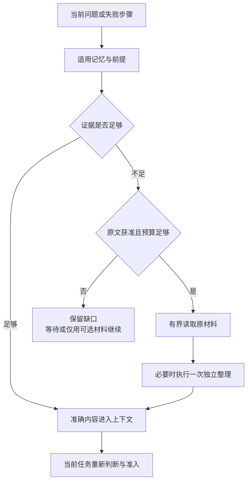

# 记忆质量优化：候选提取、检索与经验复用

[模块主线](README.md) · [实现机制](implementation.md) · [对照与建设顺序](validation.md#experiments) · [论文依据](../../research/agent-memory-papers-2026-09-28.md) · [开源实现](../../research/agent-memory-libraries-2026-09-28.md)

本页面向 Memory 策略实现和评测人员，说明候选提取、检索及经验复用的待评测方案，细化 [MEM-01～03、X-02](../validation/optimization-evidence.md) 的建设方向。现行字面匹配仍是默认。B1 中文词法、B2 混合检索、显式关联扩展和模型质量检查，均须分别取得证据后启用。

公共 Schema、候选发布、来源关闭和稳定分页遵循[模块契约](README.md)。本页不新增协议方法，也不改变成功含义。实施时先建立运行基线，再按写入质量、检索及经验整理的顺序选择实验。

推荐先补齐运行基线、中文检索和写入质量，再评估混合召回与按需经验整理。质量实验的前提是获准数据、隔离环境和独立参考。模型处理还须具备当前位置、接收方、资源预算和清理依据。

权威记录与关闭机制尚未运行时，只能开展离线算法实验。不具备合法处理能力时，停用对应分支，继续已获准基线或报告依赖缺口。阶段安排与验收见[建设顺序](validation.md#roadmap)。

## 1. 优化目标与取舍

仓库提供的是设计基线，不能把已经写出的规则当作已运行能力。现有设计的优势是明确了信息归属和撤回责任；短板在于这些可靠记录如何对当前任务产生可测的帮助。

| 现有依据 | 尚缺的实现与证据 | 推荐 |
| --- | --- | --- |
| 字面匹配、有限候选、变化水位补扫 | 中文同义表达和任务改写容易漏召回；尚无召回或下游任务基线 | 固定原算法为对照，先测中文词法，再测获准集合内的语义候选 |
| 四类记忆、完整输入来源、逐条确认或有限预授权 | 没有足够具体的写入质量判据；重复、遗漏和错误概括可能长期累积 | 增加候选内容约定与覆盖／保真审查，决定前不改正式记录 |
| 时间、范围、冲突和 `needs_review` 规则 | 规则尚未变成时序更新、反例及依赖失效用例 | 保留逐断言时间和范围；显式纠正沿 `replace`，模型猜测不覆写旧事实 |
| MEM-02／X-02 已提出读时整理 | 尚未决定哪些任务值得读取原材料，缺少程序性经验结构与成本比较 | 小范围比较「保存经验」与「按当前进展读原材料」，不为每次查询调用摘要模型 |
| 来源关闭、派生链清理和独立管理入口 | 新向量、摘要及复用索引是否全部受管尚无运行证据 | 把每种优化产物纳入原 Content／Index／Closure 责任，先过关闭与恢复反例 |

| 决策 | 推荐依据、承担者与主要代价 | 有竞争力的替代方案／改选条件 |
| --- | --- | --- |
| 复用 QueryService、ExtractionCoordinator、IndexWorker | 它们已经拥有查询、候选和索引责任；维护者只需实现可替换策略及适配器 | 整体引入 memory 框架能加快演示，但需重复对齐 owner、授权、恢复与删除；只有全套契约适配通过且维护成本更低才替换 |
| 先词法，后可选语义混合 | 字面／词法基线不依赖嵌入模型；模糊查询用户承担较低召回。语义能力开启后，部署方承担向量生成、保留和重建成本 | 一开始纯向量容易漏精确 ID、否定和版本；只有同预算任务收益明显且相应词法分支无贡献时才简化 |
| 用结构化断言及明确更新表达时间 | 更具体的偏好、历史观察和纠正并非同一种关系；用户与提取流程承担显式范围及冲突处理 | 全量时序知识图适合大量关系推理；只有单库受限关系扩展仍不足，且多跳任务收益覆盖运维成本时再评估 |
| 写时提取简短稳定信息，读时按需恢复细节 | 两者分别承担存储和在线处理成本；只存摘要会丢掉未来问题需要的细节，全部轨迹常驻又增加隐私及上下文成本 | 若原文不能保留，读时恢复不可用；只使用仍获准的派生记录并声明不能逐字核验 |
| 经验只提供建议和前提 | 成功任务中的步骤不能证明换设备、换 API 版本后仍有效；当前任务承担重新观察和准入成本 | 自动物化流程须进入现有有限计划、Skill 或扩展发布机制，不能通过 Memory 绕开它们 |

### 1.1 研究支持的范围

[论文调研](../../research/agent-memory-papers-2026-09-28.md)按首次提交日期核对近半年工作，集中保存阅读版本、实验设置和限制。StateMem 支持显式替代及依赖检查，TRUSTMEM 支持把覆盖、保留、支撑分开审核；MemoryCPT 支持比较建设与在线整理的总成本，AMD 支持按工作流、子任务和函数粒度组织经验。它们没有证明本项目需要逐轮建图、训练专用模型或采用固定的性能目标。

来源撤销与派生残留论文用于扩展失败用例：文本里声明撤销、停止再次输出敏感词和物理清理是不同证据。相应反例集中在[策略验收](validation.md#strategy-cases)，事实与许可仍由原 owner 裁决。

开源实现优先作为算法参考或隔离对照：LangMem 的纯提取接口适合候选流程，Graphiti 的时间与检索配方适合关系密集任务比较，Mem0 的轻量事实流程可作对照；Letta、memU 和 OpenViking 的材料组织与后台整理不直接替代 Memory owner。具体提交、许可证、流程漂移及治理差距在[开源库调研](../../research/agent-memory-libraries-2026-09-28.md)集中定义。首选仍是现有 Go 组件和存储上的小型策略实现，尚未选定生产第三方依赖。

## 2. 写入：候选内容与质量检查

### 2.1 候选最小单元与信息边界

一次候选尽量只表达一个可单独纠正的断言，或一份前提完整的经验。断言是「某主体在某范围和时间成立的陈述」，它不是第五种 Memory 类型。`fact / preference / inference / experience` 继续描述性质；语义、事件和程序性是研究中的组织视角，不再叠加一套互斥枚举。

下列内容约定写入候选正文，提取器版本同时规定读取方式；现有协议字段保持不变。实现前须固定内容格式、解析器及合法／非法样例，并作为候选组件一起评测，不能给严格 JSON 信封添加自由字段。

| 内容约定 | 含义与缺省行为 |
| --- | --- |
| 陈述、主体、适用对象 | 保留否定、条件和例外；实体对齐不确定时保留原称谓，不凭同名合并 |
| 事件时间或有效区间、时间依据 | 区分事件发生与本次观察；未明确则标未知，不能用提取时间填事实发生时间。`SourceBinding.valid_until` 不改义为事实有效期 |
| 性质与来源片段 | 标出用户陈述、观察或推断，定位准确原文；片段表示支撑，不减少实际处理输入的完整来源依赖 |
| 与既有记忆的关系 | 记录「补充／疑似矛盾／明确纠正」的建议及准确引用；只有明确管理决定才进入 replace |
| 经验的附加内容 | 目标、环境／工具版本、适用前提、已执行动作、核实效果、失败或未知、复用前须再核对什么 |

输入应先按许可范围和共同处理用途组织，以减少不必要的限制交集。一旦模型混合读取，所有派生物仍继承全部输入；不能因为模型只引用公开片段，就删除它实际读取过的私密来源。

既有 `source_edges` 表达治理依赖。语义实体关系不能加入其中冒充来源。

### 2.2 提取、质量检查与决定顺序

1. **先检查处理前提。** Coordinator 固定有限输入与来源，核验读取、处理、候选暂存和预算。local_only 无可用本地能力则等待或报告不支持。连接器检查点仍只在输入和后续责任保存后前移。
2. **再提取值得跨任务保存的信息。** 短期任务进度留在任务上下文；明确跨任务偏好、可复核事实和具有前提的经验才形成候选。重复出现不自动证明真实，网页上的命令不自动成为用户偏好。
3. **检查内容保真。** 确定规则检查准确引用、否定／时间／范围等必填信息；有语义不确定性时，用受限模型审查覆盖、保留及支撑，并输出可查原因。所有额外调用计入原有界任务，不隐藏在 SDK 重试中。
4. **核对重复及冲突。** 相同原提取输入、规则、候选标识沿原责任恢复；正文相似只产生比较建议。不同时间或来源的陈述不自动合并。语义不明进入待确认候选，不批量更改正式 Memory。
5. **最后复核保存许可与来源状态，再发布。** 命中有限预授权且质量检查通过才走原自动保存分支；否则按现有逐条确认。拒绝、过期和取消分别沿原候选规则收尾；检查分数不是保存许可。

覆盖、保留和支撑须独立检查。候选即使覆盖了新信息，也可能误删旧范围或新增无来源结论，因此不能只按总分通过。

保留检查只针对同一候选正文的改写或拟替换记录，不要求读取全库。缺少可信语义判定时，可以保留逐条确认模式；不能把模型「未发现问题」提升为确定事实。

### 2.3 时间更新与冲突

用户原先说「技术评审先结论后取舍」，后来又说「支付 API 评审先列阻断问题」，两条偏好可以按范围共同成立，不应以新记录覆盖旧记录。只有用户明确说「把所有技术评审格式改为先列阻断问题」，管理入口才针对准确旧修订调用 replace。基于旧格式生成的经验随该修订变更进入现行 `needs_review` 流程。

冲突处理按以下顺序判断：

1. 是否为同一准确命中。
2. 是否存在绑定旧修订的明确纠正。
3. 时间和范围是否实际重叠。
4. 其余语义是否仍相互矛盾。

时间重叠、来源可信度和使用许可分别判断，不能用「最新优先」省去后两项。未解决的冲突保留各自来源，不由排名分数决定真假。

当前公共查询没有结构化 as-of 参数。首阶段在准确正文中保留时间并返回证据，支持模型解释历史；不声称支持任意时间点的完备事实查询。需要历史修订时沿已有准确 read 及历史证据许可处理，不能让已退出当前检索的修订重新作为当前记录出现。

## 3. 检索：候选生成、融合与关联

### 3.1 三个可比较配置

| 配置 | 行为 | 依赖和用途 |
| --- | --- | --- |
| B0 字面基线 | 保留现行 Unicode 字面匹配、匹配词数／范围／时间排序 | 无嵌入模型；所有实验的可恢复对照 |
| B1 中文词法 | 对原 text_terms 和正文增加中文字符二元组（character bigram／2-gram）、ASCII 词元；保留完整原词精确匹配通道，按固定覆盖规则排序 | 先离线验证短词、ID、否定、代码和混合语言；切分规则版本化，不声称具备语义理解 |
| B2 混合候选 | B1 与获准语义候选分别召回，以 RRF 合并后固定集合 | 需合法嵌入处理、向量保存与清理、版本匹配和质量证据；可选，缺依赖不启用 |

先采用简单词元覆盖，不预设引入 BM25 或独立全文库；若 B1 已能满足质量与预算，停在 B1。若词项权重成为可测短板，再把 BM25 作为单独候选，统计口径限定到获准语料，不能把 PostgreSQL 内建全文排序直接称为 BM25。[PostgreSQL 全文检索说明](https://www.postgresql.org/docs/18/textsearch-intro.html)

首个语义实验优先在现有 PostgreSQL 上试用 pgvector 的精确距离计算，避免新增常驻数据库。它支持精确和近似检索，官方也给出全文加向量的融合路线；但近似索引的过滤在索引扫描后发生，不能仅凭 SQL 含 `WHERE tenant_id` 就证明「未获准资料从未参与候选计算」。[pgvector 检索与过滤](https://github.com/pgvector/pgvector#filtering)

因此，B2 首轮先物化或等价隔离获准的有限记录集合，再对集合内的向量计算距离，同时验证执行计划和实际访问。只按 tenant 分区仍不足以满足要求，因为同一用户的数据仍有用途、接收方和来源差异。

集合过大时，保留明确缺口或降级。未来 ANN 适配器必须证明同等的处理前范围隔离；迭代扫描和输出后过滤不能代替这项证明。

### 3.2 一次查询的有界顺序

1. 规范化原 Query，取得认证 tenant、owner、scope、purpose、recipient 对应的处理范围和使用依据。扩写词项也只能来自当前获准输入；首阶段不增加 LLM 查询改写。
2. 固定本次策略、词元／嵌入模型和索引版本。有词项时，按原 Query 的去重结果和确定顺序编码查询向量；合法的空 `text_terms` 查询则只按 types／scope 形成过滤集合，沿现行范围、时间和 ID 排序，不嵌入空串、不借模型猜测查询意图。这个条件分支在配置中预先定义，不算语义服务故障。嵌入处理的责任见下节。
3. 在允许范围读取已提交变更序号上界及各索引检查点，分别召回并补扫未覆盖变化。词法与向量水位独立保存，不以任一路追平代替另一路；准确含义沿现行[索引水位](implementation.md#index-watermarks)。
4. 按 `(owner, memory_id, revision)` 合并。B2 以 `Σ 1/(k + rank)` 融合各路名次，未命中该路贡献为零；常数与权重按[实验配额](validation.md#capacity)固定。相同分数用准确 ID 稳定排序，参数在运行前固定，不把分数解释成事实置信度。
5. 启用显式关联扩展时，从关系投影读取结构化正文中已明示的冲突伙伴及前提引用，只展开一跳。冲突关系双向查找：新 B 指向旧 A，即使 A 正文没有 B 的引用，命中 A 也能发现获准的 B。每个新增材料仍须独立处理许可且消耗同一候选／扫描预算；受限关联不得泄露对象标识。没有明确引用不证明不存在冲突，不在线推断关系或作无界图遍历。不能带齐获准范围内的已知必要证据时保留缺口，由 Orchestrator 补证；QueryService 不生成确定当前值。
6. 按[总集合上限](validation.md#capacity)冻结准确版本与排序依据。后续页不再调用模型、不换索引版本、不补入新记录；逐页执行当前状态、来源和披露复核，继续返回 partial、changed 和 gaps。

两路合并、权威补扫和受限关联共享同一总集合预算，各路候选上限见[容量配置](validation.md#capacity)。此外，还须分别限制真实扫描行数、向量计算数、字节、耗时和调用额度。`LIMIT 80` 不代表实际只处理了 80 条。

超限、索引未追平或已启用分支故障导致覆盖缺失时，所有页继续返回现有 partial／gaps，不临时新增错误枚举。具体配额在开发集及目标硬件上冻结。

向量未追平时，词法补扫只能补充词法证据，不能证明同义召回已经完整。当前查询返回带缺口的词法结果，由原 IndexWorker 在独立预算内补齐向量；query 不等待索引重建。

应区分配置选择与运行降级：创建查询前，B2 已被合法配置关闭，则 B1 是所选算法；查询建立后，B2 执行失败，则属于本次查询降级，须保存缺口，不能静默改名。

### 3.3 本地嵌入的使用、计量与恢复

B2 首轮只使用原 owner 受控宿主上的本地编码器：固定模型与 tokenizer，关闭网络、隐式缓存持久化和自主工具调用；输入转成向量，不作规划或更改 Memory。具体模型仍是实验变量。该限制使重复计算不产生外部写效果或供应方未知账单，但 CPU、内存、处理用途和临时字节仍须有界；远端付费嵌入另见待决提案。

| 调用点 | 固定输入、使用标识与保存者 | 成功与失败后续 |
| --- | --- | --- |
| IndexWorker 构建 | 原索引 job、准确 ContentRef、模型／切分版本及投影键；worker 取得输入 process、向量 store 依据，原授权／资源记录关联每次物理 attempt 和 use_id | 事务外计算，短事务核对领取、当前修订及来源可用状态后提交投影、来源绑定和必要清理责任；仅连续提交范围推进 checkpoint。崩溃重领检查同投影键，缺项可重新计算；不能凭计算结束推进水位 |
| QueryService 查询编码 | query_id、原查询摘要、配置版本、接收方；沿本次 continuous 查询处理使用关联 attempt/use_id，宿主先登记有界本地资源占用 | 编码及候选成功后固定原 QuerySet；向量仅在原查询处理单元内暂存。重复请求先核对既有集合；未形成集合可在累计预算内安全重算，不另建后台任务；失败按已选分支返回缺口或现有不可用错误 |

每次真实重算都追加尝试和本地用量，不能重用一次消费来隐藏第二次处理。同一次使用的答复丢失时，沿原 use_id 查询。

只有确认旧计算已结束或已终止，宿主才释放资源占用。崩溃后的未知使用不能记为零，未结束的占用继续计入同用户并发和预算。Memory 保存业务关联，Grant／资源负责方保存许可与使用结算，按[原使用与结算机制](../security/README.md)恢复。没有能兑现这些条件的编码器装配时，B2 保持关闭。

首轮不在 query 补扫时为旧记录生成并持久化向量，以免只读查询取得索引写职责。缺失向量交原 IndexWorker 补齐；当前查询使用已有合法投影与词法补扫，返回未覆盖语义范围的缺口。查询临时向量到处理结束或期限即清除；若未来需要跨查询缓存，须另有保存许可及来源清理设计，不能直接沿用查询许可。

### 3.4 索引与上下文的边界

派生投影的键至少绑定 owner、准确 Memory／Content 修订、切分器、嵌入模型、维度及索引代次；不同向量空间不混合。每个新代次使用原 IndexWorker 和独立 checkpoint 构建，旧查询沿原有限集合结束，新查询只使用已批准且可用的代次。重建不能修改权威记录或抹去来源关闭。

显式关系索引由同一 IndexWorker 解析已发布的结构化正文，保存起点和终点的准确修订、关系种类及解析版本，并建立两端查找索引。关系种类只区分「声明冲突」和「适用前提」；推断出的关联仍是推断材料。该索引是可重建的候选资料，不写入 `source_edges`，也不裁决替代关系。

关系投影沿 owner 的同一变化序列保存独立覆盖水位。索引滞后时，有界解析获准增量并合并；覆盖不足则保留缺口。修改或关闭后，旧边不能使旧修订恢复可用。关联扩展是独立配置和实验因素，未启用时不承诺发现未直接命中的冲突。

QueryService 返回候选，不负责填满 Brain 上下文。Orchestrator 使用已有准确引用、材料角色及 need_context 机制选取材料；当前指令优先于旧偏好，记忆不成为系统策略。准确片段优先于新摘要，冲突和 unknown 不因 token 紧张而被改成确定结论。必要材料超窗仍按[现有上下文规则](../brain/implementation.md#context-optimization)等待或失败。

查询词、重排输入和向量也可能含敏感信息。诊断只记获准的版本、数量、排除原因和成本；需要正文诊断时保存受控引用，不把搜索请求或「被拒绝记录 ID」写进普通日志。首阶段不对每次查询增加生成式重排器，只有分层实验表明融合排序仍选错且额外成本值得时才评估。

## 4. 经验复用与读时整理

一条可复用经验须能回答「在什么前提下做过什么、实际发生了什么、复用前需核对什么」。API 或 GUI 的成功经验必须来自正式任务、操作与核验记录；失败经验可以帮助避免重复错误，但明确标为失败或未知，不能进入成功步骤模板。

读取分三层：先取记忆元数据及适用前提，再取获准的简短断言／经验，只有当前问题需要证据细节且原文仍可读时才取轨迹或原材料。这是已有 ContentRef 上的加载策略，不建设另一份永久「核心记忆」。图表示一次有界上下文补充，选择结果由 Orchestrator 保存。

整理沿已有 `memory.extract` 或 Orchestrator 的独立有界工作处理，实际输入清单、模型费用、取消和来源责任保持可查。产出进入当前上下文不代表获准长期保存；要保存仍需候选与原发布入口。首轮默认只读整理，不自动合并或删除原记忆；多条来源的概括形成新的派生候选，并保留完整依赖。

「睡眠期」或任务结束整理只规定执行时机，不提供另一种权限。流程复用现有任务结束触发去重键，只有有限预授权覆盖输入、类型和额度时才自动启动。触发拥堵时延后新提取，为清理和撤权保留容量。

暂不采用按命中次数自动遗忘正式记忆的策略，因为低频材料可能是唯一约束。可回收缓存、到期候选和按保留策略到期的正文，仍按现有规则清理；不能删除最后的内容禁用或删除记录。

环境变化是经验失配，不是权限撤销。Memory 可以返回经验的前提和旧观察；是否需要新观察、是否允许只读探测由 Orchestrator／Execution 判定。能力版本不匹配、关键前提未知或原效果未核实，就不能直接复用步骤。将经验转成自动计划或 Skill 的建议见[跨模块提案](#proposals)。

## 5. 内部记录与兼容边界

本节仅列优化需要补充的内部内容，不重复定义公共 MemoryRecord、QueryPage 或候选状态。全部内部键含 tenant 与 owner；字段正式命名、迁移及内容格式随实现评审固定。

| 内部资料 | 保存者与用途 | 持久及清理边界 |
| --- | --- | --- |
| 候选内容格式与质量检查结果 | ExtractionCoordinator；类型、时间、范围、经验前提、独立检查原因 | 绑定规则／模型版本及候选修订；正文走 Content，过期和关闭沿原候选责任 |
| 嵌入向量与索引构建清单 | IndexWorker；准确来源、切分、模型、维度和代次 | 可重建；覆盖水位按代次独立；向量不脱离原来源、保存许可和关闭责任 |
| 显式关系索引 | IndexWorker；结构化正文中的准确端点、关系种类及解析版本，支持两端查找 | 与来源记忆同受管，独立覆盖水位；只服务一跳候选，不裁决事实，也不替代治理来源边 |
| 查询策略与各路覆盖信息 | query_sets；解释融合、截断和降级 | 与有限查询集合采用相同的保留期限；不在通用日志保存正文、无权访问的对象 ID 或可逆提示词 |
| 使用与效果对照材料 | 原任务／Evaluation；关联实际加载版本及独立效果 | 不新增默认生产反馈采集；无获准内容时只保留最小元数据及证据缺口 |

所有可用性的权威仍在原记录，不能在索引中新增「已验证事实」「永久可用」之类第二状态。新的内容格式不改变 `ExtractionCandidate.decision`、Memory state 或 CleanupReport 语义。内部索引坏了应能从获准权威记录重建；原文已经合法清除且不能重建时保留覆盖缺口，不能从旧备份擅自恢复正文。

模型、扫描、字节／token、CPU／内存、超时及重建批次等配置按[容量与实验要求](validation.md#capacity)固定；未确定资源上界不启动相应实验。

## 6. 后续跨模块提案

P0／P1 及本地有界 B2 可以沿现有职责设计，不依赖下表能力。以下是具体的后续建议，尚未改动邻接模块或公共协议；缺席时按本列行为收敛，不把它们当已采用契约。

| 提案及触发问题 | 推荐改法、涉及文档与代价 | 当前行为与验证 |
| --- | --- | --- |
| 结构化历史查询：正文时间不足以满足高比例 as-of／区间问题 | 若需求测量成立，再在 Query 增加明确时间语义并联动 Memory、contracts Schema／方法／示例及 Orchestrator 调用；调用方承担时间解析和历史许可复杂度 | 当前只返回获准准确版本及正文时间，不承诺时点完备性；用当前／历史交叉问题证明必要性 |
| 远端付费嵌入及模型重排：本地模型不足或延迟收益明确 | 复用 Brain／Execution 适配与原调用费用、幂等核对及批准机制，固定接收方、处理位置和硬预算；联动对应实现及 capability 契约 | 未完成接入时不开放该分支；验证失答复、隐藏重试、usage 缺失及来源限制，不仅测试输出向量 |
| 经验转 Skill／有限计划：重复子任务已证明可安全复用 | Memory 产有来源候选；Evaluation 做独立比较；Extensions 发布；Orchestrator 保留前提和退出准入；涉及上述模块及准确内容 Schema | 当前经验只作材料，不执行动作；环境变化／步骤未知／批准撤回必须回到原任务判断 |
| 生产使用反馈：离线结果不能解释错误经验的真实采用率 | 先定义 Orchestrator 的准确加载与独立效果关联，Evaluation 按获准用途汇总；联动上下文与观测文档，新增持有和保留成本 | 先使用现有任务证据做隔离评测，不新增默认用户行为采集或把模型自评当效果 |

采用决策以[同口径质量与成本对照](validation.md#experiments)为依据；缺收益证据时维持原配置，未决提案只限制依赖它的能力。
