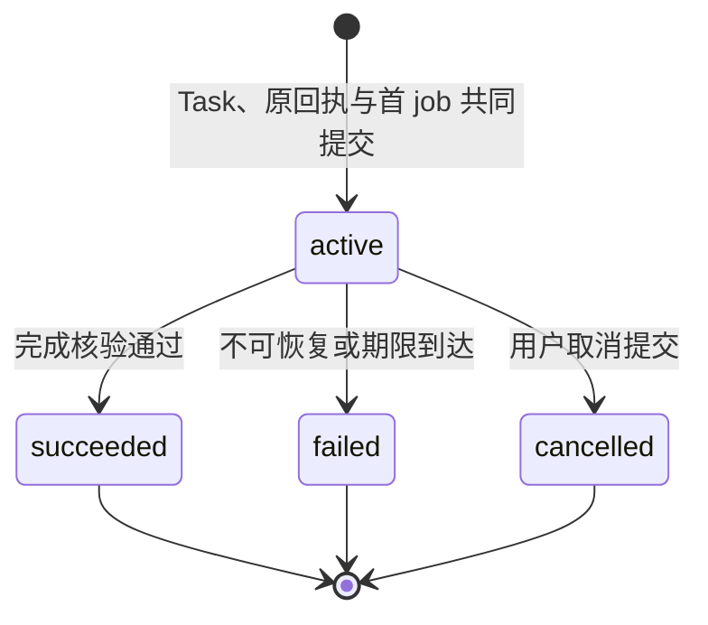
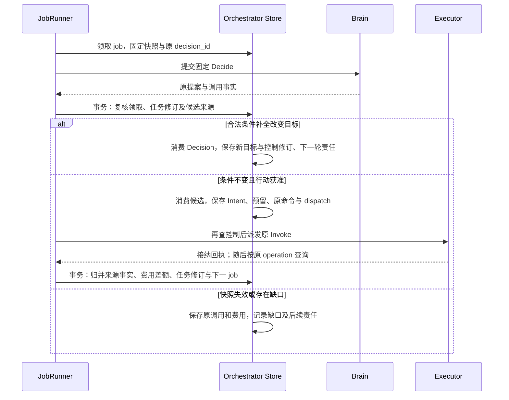
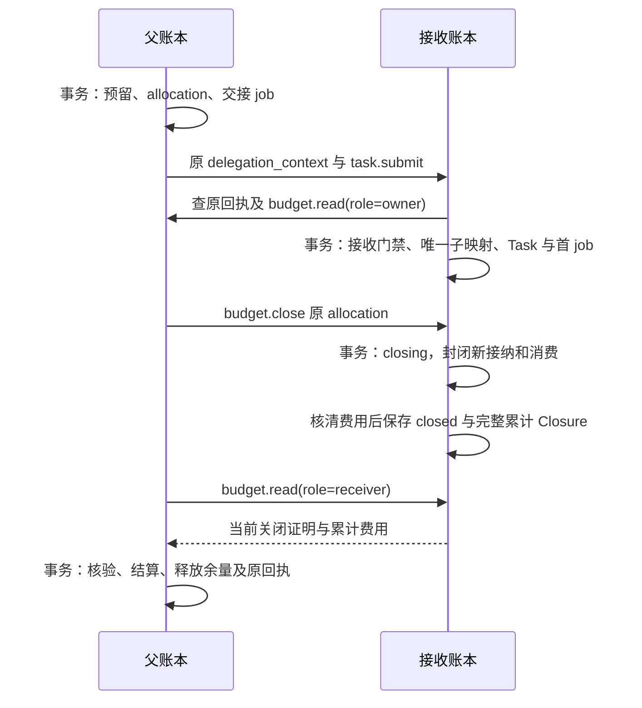

# Orchestrator：任务、准入与预算

Orchestrator 保存任务目标、控制和预算，将提案准入为持久操作，并依据执行事实和条件核验决定任务终态；每项 Task 始终属于同一个逻辑 Orchestrator。

本篇定义任务推进、计划实例化、控制传播及账务。条件和完成依据见[任务验证](verification.md)，操作效果见[执行](execution.md)，公共接纳、作业领取与回写见[可靠工作](reliability.md)。完整字段以 [protocol.schema.json](contracts/schemas/protocol.schema.json) 为准，实现与验证状态见 [review.md](review.md)。

## 组件与依赖

TaskCoordinator、预算账本和计划实例化器共享任务的本地事务边界；Brain、Memory、Executor 通过可替换接口提供提案、材料和效果事实。生产中的命令入口与工作池可以分开运行，内部函数不因此成为独立服务。

| 组件 | 输入与输出 | 依赖 |
| --- | --- | --- |
| CommandHandler | 认证命令 → 原回执或固定拒绝 | 公共命令接纳、TaskCoordinator |
| TaskCoordinator | 当前任务、候选、依赖修订 → 任务变更及后续工作 | Task Store、BudgetLedger、核验规则 |
| SnapshotAssembler | 获准目标、事实、能力及材料 → 固定 BrainContext | [Brain 上下文合同](brain.md#context)、[Memory](memory.md)、能力目录 |
| PlanMaterializer | 固定计划与已核实前项输出 → 完整行动候选或缺口 | 计划版本、步骤准入映射、条件记录 |
| FactReducer | 原负责方的对象修订 → 当前事实、费用差额与唤醒 | 执行、决策、委派事实接口 |
| BudgetLedger | 预留、累计账单、额度关闭证明 → 各单位余额 | 原计费来源及本域账务记录 |
| JobRunner | 原工作责任 → 一次有界处理及后续责任 | 公共 JobStore、Brain／Executor／Collaboration ports |

领域组件依赖受限事务和领域值类型；WSS、gRPC、SQL 与模型 SDK 位于适配层。内容读取、授权查询、模型及远端执行在事务外完成；事务内比较已固定的引用、修订和仍有效的资格。同宿主、同库、同信任边界可以合并许可消费或执行接纳，否则按[共同命令合同](contracts/README.md)交接。

## 数据模型与状态机

Task 的状态、控制、等待、效果和账务是独立维度。调度器按本次工作所需维度判断，界面也分别显示，避免把“已取消”解释成所有外部动作和费用均已结束。

| 维度 | 值及使用规则 |
| --- | --- |
| `status` | `active / succeeded / failed / cancelled`；终态不重开 |
| `control` | `running / paused`；表示任务自身选择，内部子任务另计算祖先共同限制下的有效控制 |
| `wait_reasons` | `input / authorization / dependency / budget / effect / capacity`；每项绑定等待对象及恢复条件，多个原因可以并存 |
| `open_effects` | 原操作中效果未知或仍可能迟到的集合；终态也可以非空 |
| `accounting_open` | 尚待最终费用的调用或额度分配；由原预留及结算责任覆盖 |

下图只描述 Task.status，箭头表示 Orchestrator 的终态提交；暂停和依赖等待不进入该状态机。

Task 保存原始目标和解释后的 Requirement。每条条件有稳定身份、原文依据、`effect|quality` 类型、判断规则及必要性；模型派生解释不覆盖用户显式约束。Task 在接纳时固定准确 TaskPolicy 和安装配置，后续目标修订不暗换策略或版本。具体对象、金额、接收人、发布范围等会改变行动效果的歧义先形成输入请求。

下表列实现必须保留的关系和唯一性，正文或完整公开字段不在本篇复制。所有键隐含 `tenant_id`。

| 逻辑记录 | 关键关系与唯一约束 |
| --- | --- |
| Task、RequirementVersion | Task 是聚合根；条件在 `(task, goal_revision, requirement_id)` 内唯一 |
| Snapshot、PlanVersion | 快照不可变；计划按 `(task, plan_id, plan_revision)` 固定目标修订和正文引用 |
| DecisionConsumption | 一个 `decision_id` 只消费一次，保存采纳或失效原因 |
| PlanStepAdmission | `(task, plan_id, plan_revision, step_id)` 只准入一次，固定实际参数摘要及 operation／delegation 映射 |
| OperationIntent | `operation_id` 唯一；固定 Invoke、原执行命令与预留；意图事实归本域，效果事实归 Executor |
| ReceivedFact | `(owner, object_id, revision)` 唯一；同修订异摘要冲突 |
| ExecutorBinding | `(task, executor)` 唯一；新增绑定与派发共同提交，供控制传播读取完整集合 |
| CurrentOpenEffects／Delegations | 与准入、归并同事务维护的完整未结集合；内部子任务终结同时更新父关联 |
| 核验记录、TaskResult | 当前覆盖、检查及唯一成功结果的存储与门禁见[任务验证](verification.md#records) |
| BudgetBalance／Reservation | 每任务、每单位一项余额；每笔预留固定唯一物理计费来源 |
| Allocation／IncomingAllocation | 父分配身份唯一；接收方以 `(parent_owner, allocation_id)` 唯一映射至至多一个子任务 |
| CorrectionIntent／Outbox | 原计费来源和费用修订唯一；账单与交回责任共同保存，命令尝试另保留 |
| PolicyAcceptance | 受信管理入口按租户、本人、准确策略、单位、范围和期限保存；估算 Task 固定关联原记录 |

## 关键时序

### 接纳、决策、行动与事实归并

Orchestrator 的接纳成功点是 Task、原提交回执、初始预算和首项工作共同持久化；接纳不等待模型推理。数据库不可写时返回不可用，接纳答复丢失后查询原命令，沿同一 Task 恢复。

下图从一个决策轮次观察交接，实线箭头是调用或返回；带“事务”的节点是本地提交，网络调用不占事务锁。

提案消费按以下顺序在同一 Task 条件事务中裁决：

1. 查询原 `decision_id` 的消费记录；已消费返回原结果。未消费再核对 Claim、Task 总修订、固定快照、有效控制及期限。快照失效只保留原调用和费用。
2. 若有 `requirements_proposal`，核对 `base_goal_revision`、稳定条件身份、完整字段与原文依据。遗漏原约束、降低必要性或无法判断目标含义的变化不部分采纳，整份提案保存缺口；改变目标含义交本人 `task.revise`。
3. 合法条件与当前集合完全相同则继续原 kind；数组重排不制造变化，也不能通过换条件 ID 绕开已有约束。
4. 条件确有变化时，只保存新条件、目标与控制修订、Decision 消费、下一轮及逐执行端传播责任；本提案的 actions、complete 和 `plan_delta` 全部失效。旧目标未派发工作失效，已启动效果继续核对。
5. 只有无条件变化时处理 `act / need_context / request_input / complete / fail`，将消费结果与该分支的后续责任共同保存。complete 交[完成核验](verification.md#completion)，不直接写 `succeeded`。

行动候选有三种互斥来源：Brain Decision、计划步骤、受信固定核验检查。受信核验沿原 `check_id` 或 `(task, goal_revision, coverage_revision)` 准入，不能由模型、网页或普通请求自报。三类候选均检查当前任务及祖先、准确能力和参数、依赖、目标约束、授权、资源冲突、未知效果、期限及预算，随后共同保存原意图、预留、dispatch、候选消费和 Task 修订。一个检查已由 Brain 或计划准入评估时，verify 只恢复原操作。

独立且无资源冲突的行动可以组成有限批次，每项仍有独立身份和预留；依赖前项结果的行动分轮准入。dispatch 在发送前再次核对有效控制与期限，恢复时读取已固定 Invoke，不用当前 Task 重拼参数。Executor 接纳后，dispatch 将责任交给原 operation 的 poll。

FactReducer 先认证原负责方与对象关联，再按来源修订归并。相同修订和摘要不重复记费或唤醒，旧修订不覆盖当前投影，同修订异内容或非法状态倒退保存冲突并停止依赖该事实的新行动。新事实、当前投影、Task 修订、费用差额及下一责任共同提交；迟到事实可以通过独立去重入口保存，失去领取的 worker 不能借此准入行动或完成任务。

### 有限计划的安装和实例化

PlanMaterializer 仅执行有限无环图（directed acyclic graph，DAG）的依赖解析和字段复制；计划不是授权单位，也没有另一套持久调度循环。完整格式见 Schema 的 `BrainPlan`；Brain 的正文发布流程见[产出保存](brain.md#publication)。

| 计划要素 | 裁决规则 |
| --- | --- |
| 版本基线 | `base_plan_ref` 必须等于任务当前准确引用；无计划只接受 null 基线和 revision=1，后续保持 plan_id 并递增一版 |
| 直接行动与安装 | 非空 actions 不带 plan_delta；actions=[] 必须有合法非空计划。安装只消费 Decision、保存版本并唤醒 decide，首步另按步骤键准入 |
| `depends_on` | 前项全部结束、无迟到效果且输出已核实才满足；评估操作完成不等于评估通过 |
| `pass_conditions` | 当前目标、准确成果和规则对应的当前选定检查全部 usable/pass；有效 fail 交 Brain 修订，缺失或 unknown 保留核验责任 |
| `action_template` | 固定 invoke／delegate 模板；没有模板的步骤交下一轮 Brain 展开 |
| `operation_output` | 编制时已有的原操作和准确证据引用；不可替换为较新输出 |
| `step_output` | 只指本计划直接或传递前项；沿同计划版本的唯一准入映射解析原 operation／delegation 及核实输出 |
| 参数绑定 | JSON Pointer 只写 invoke.arguments 或 delegate.goal_ref／input_refs 的允许位置；不覆盖能力、身份、预算、授权和控制；目标不重复或互为祖先，父路径须存在，不隐式扩数组、转类型或执行表达式 |

JobRunner 的 decide 优先尝试当前计划：事务外取准确依赖、按指针复制字面值，完成后按准确能力或 Agent Schema 校验；事务内再比较目标、计划、依赖及所选条件的缺陷门禁，将实际来源、参数摘要、条件依据和步骤准入映射共同保存。已有步骤准入返回原操作，不重新读取新值。指针缺失或类型不符形成明确缺口。

计划修订只废弃未准入步骤。已准入操作、预算、未知效果仍保留；新计划复用旧效果须显式引用 operation_output 并重新检查适用性。GUI 后续动作仍需前一动作后的新观察。可复用计划模板的配置必须固定适用目标、环境和输入前提、证据及退出条件；前提无法受信核验时交回 Brain，退出模板不构成重做未知效果的依据。

### 控制和目标修订

暂停、恢复、取消、目标修订及终态提交都递增控制修订，并与全部已绑定 Executor 的传播责任共同提交。Executor 的落实及逐入口回执由[执行控制](execution.md#task-gate)定义。

| 用户动作 | 本地事务及后续行为 |
| --- | --- |
| pause | 保留原工作，阻止新 Decision、质量评估及目标行动；归并、核对、收账及已有充分证据的完成继续 |
| resume | 重新计算有效控制并唤醒仍可执行的原工作；不延长期限、补足预算或解除子任务自身暂停 |
| cancel | 提交 cancelled，关闭新目标工作，为已派发操作保存取消／核对责任；迟到成功仅更新事实 |
| revise | 仅 active 可修订；保存新目标，废弃旧提案和未派发工作，保留已启动操作；冲突效果核清后再规划；终态后的新目标另建关联任务 |
| deadline 到达 | 提交 failed 与 deadline_exceeded；效果、控制落实和账务收尾继续 |

内部子任务的有效 running 要求自身及全部祖先均 active/running；祖先关系从真实任务树读取。祖先控制变化在同一事务中按根到叶更新有界活动子树的有效控制修订及逐端传播，父控制确认范围包含这些门禁。新子任务同时受用户任务容量、委派深度和活跃子数约束。外部委派的关闭责任见[协作](collaboration.md)。

完成与取消以同一 Task 事务提交顺序裁决，先终结者保持。成功事务采用[任务验证](verification.md#completion)的合取规则并保存固定 Result、终态及传播／收尾责任；失败或取消保留独立结束说明和未决项，不发布成功 Result。

## 预算、结算与额度交接

BudgetLedger 按明确单位和计价版本保存精确十进制金额，每项调用在启动前预留，每次账单只归并原计费来源的累计差额；调用次数、运行时间、token 和费用分别设限。

| 模式 | 准入条件与余额处理 |
| --- | --- |
| strict | 每个计费项有可信单次上界，预留上界后检查 `spent + reserved ≤ limit`；固定 allocation 始终使用 strict |
| estimate | 本人已接受准确 TaskPolicy 的非硬上限、能力／单位／预算范围和期限；仅允许未经过 allocation 的直接调用，原 Task 与全部费用 Grant owner 在同一受信本地事务内核验接受关联；预留有限估算额 |

估算接受由宿主受信 TaskPolicyRegistry 展示准确策略后，沿固定管理命令保存本人、策略摘要、显示内容摘要、范围及期限。task.submit 在接纳事务绑定原 acceptance；每次计费准入重新检查其有效性、固定策略、适配器声明和在线 Grant 资格的交集。模型或请求布尔值、公开 policy_ref、远端转述均不构成接受依据。任一 Grant 对该单位要求硬上限时拒绝 estimate；撤回接受关闭新使用，原账单保留。相关开放问题见[问题清单](open-questions.md)。

费用未知时保留原预留，自动核对次数耗尽转明确等待或受信核查；只有可信最终账单或可验证不计费证明才结清并释放差额。实际费用超过估算、可信单次上界或任务限额仍全额入账、记债并关闭受影响的新计费；数据库不能用无条件余额 CHECK 拒收真实账单。新的账务事实不恢复暂停或已终结的目标工作。

`task.adjust_budget` 比较 Task 修订并提交完整原单位上限集合；不得更换单位、低于已支出与仍承担义务，或超出估算 Task 原接受范围。调额只变 limit 和 Task.revision，按需解除 budget 等待，不修改目标、控制、期限或支出；终态拒绝调额。

### 唯一计费来源与迟到更正

一笔 Reservation 固定一个 `(source_owner, source_kind, source_id)` 作为物理账单权威，Brain、Executor、Grant 等其他用量投影只留证。远端接纳后才能确定来源时先保留预留，在唯一绑定约束下固定来源；冲突时保留缺口。

计费 owner 保存可信上调账单时，同事务保存该费用修订的事务发件箱（transactional outbox）及固定 `task.billing_reconcile` 命令尝试。通知只唤醒原 Task 的 settle；Orchestrator 认证 owner、核对原计费绑定，按 `(source_kind, source_id, usage_revision)` 归并，返回持久 JobAck 后源方才结束该修订交付。JobAck 不表示费用已经入账。

每个修订保留独立交回记录，较新账单不覆盖未交付旧命令。答复不明沿原命令查询或重投；原期限过后仍无 JobAck 时，为同一来源修订和摘要保存继任命令并保留旧未知尝试。相同修订异摘要冲突；旧通知在更高可信累计值已经入账后返回原 job 的 applied/no-op，不倒退费用。

settle 主动读取原 Brain Decision、Operation、UseSettlement 或接收方 Closure，核对可信账单与当前累计修订，只追非负上调差额，并与来源修订、余额、事故及作业记录共同提交。r1 通知读到 r2 可直接归并 r2；之后两者重投都不双扣。Task、源对象及旧 settle 终态都不终止更正责任，原责任键可以重开；已释放额度不倒流。退款和贷记属于独立对账范围。

### 固定额度分配

父任务把 allocation 计入 reserved 后，接收方才能在这份额度内消费；父聚合展示的子费用不再次扣账。内部子任务在共享事务内完成父预留、allocation、子 Task 和首 job。跨 Orchestrator 使用固定 allocation_id、原分配命令和各自本地账本。

下图描述跨 Orchestrator 额度的正常生命周期；箭头表示命令或权威查询，各“事务”只覆盖所在负责方。

父 Allocation 的 `allocated / settled` 和接收门禁的 `open / closing / closed` 分别保存。接收方认证 sender_service_id，再查原分配回执及 owner 当前状态、准确修订、接收方、单位、上限和期限；历史 applied 回执不能替代当前 allocated 状态。接收事务以 `(parent_owner, allocation_id)` 串行子创建与关闭，一个 allocation 最多接纳一个子任务。

关闭先到时，即使未取得原 allocation，也保存最小禁止索引与核验工作并返回 closing。取得准确单位、证实从未接纳且不会再接纳后，才形成零用量 closed 证明；无法查询父方时不虚构单位。创建先到时，关闭封闭该子的新增消费并核对全部在途费用。`budget.close` 只关闭消费，目标取消另走任务控制；到期、失联、父取消或子答案均不代替关闭证明。

父方 budget.settle 比较 allocation revision，验证原 receiver、完整单位、最终累计费用修订和不可再消费证明。首次结算将原预留转为实际支出并释放余量。超 allocation 仍据可信原账单全额结算，分别记录提供方突破单次上界（provider_bound_breach）和接收方放行超过总额（receiver_allocation_breach）；两者可以并存，未明原因保留 incident_pending。仅从总额超限不能判断责任方，证据不足则保留预留和核对。

closed 后的可信上调保持消费关闭，接收方提高 usage_revision、保存完整累计 Closure 及更正 outbox。父 settle job 先保存准确 Closure 摘要、当前 expected_revision 和固定结算命令尝试，再执行结算；失答复查询原命令及当前 allocation。原尝试过期且该累计账单尚未应用时才建立同账单继任命令，旧命令迟到造成修订冲突后读取当前累计值，不能再扣一次。

已 settled 的更正必须各单位不降且至少一项上调，只追加差额，不重开消费或倒流已释放预留。更正可能使已花掉余量的父任务超预算，此时记债并停新计费；累计仍在原 allocation 内时，不误报分配违约。超额事务保存本域受影响提供方／接收方绑定的禁用事实和发往安装负责方的持久报告；其他分片是否停用由其发布职责裁决。

## 工作责任与有界访问

JobRunner 复用[公共 Claim／Guard／Raise／Finish](reliability.md)，本域只定义责任键和完成条件。作业键为 `(tenant, task, kind, object_id)`；重领不重置原命令、候选消费、轮数、费用或期限。

| kind／对象 | 单次处理与交接条件 |
| --- | --- |
| decide／Task | 一个当前决策或有限计划实例化；候选已消费或失效，下一责任已保存后结束 |
| dispatch／operation 或 delegation | 一次原命令提交或回执查询；接纳并建立 poll，或确定禁止派发后结束 |
| poll／operation、decision 或 delegation | 一次原事实读取；目标责任已结或剩余责任已交给 verify／settle 后结束 |
| verify／Task | 当前覆盖、条件及准确成果的有限核对；缺口保存等待，新评估仍走行动准入 |
| control／Executor | 一个要求修订的逐端控制；实际落实该修订才结束 |
| settle／原计费来源或 allocation | 当前累计账单；归并并保存剩余责任，新可信账单可重开 |
| extract／原请求 | 向独立获准记忆提取交接；接收方接纳或确定拒绝后结束，不改变原 Result |

所有任务事务先锁原命令键，再按根到叶、同层 task_id 锁必要祖先，随后锁预算单位、意图、参与领域门禁及业务行，最后锁 job。核验领域先按稳定实现键锁 evidence gates，再锁条件；缺陷登记不反向锁 Task。Memory 参与时先取其 owner 变更序号，再取 Memory 门禁和业务行。领取事务结束后再开领域回写事务，不能持 job 锁反向锁祖先；数据库重试不改变原 expected_revision 或重发外部调用。

访问热路径按以下集合取数，避免每轮遍历历史或拼接多个一对多明细。

| 路径 | 权威读取与写入集合 | 有界条件 |
| --- | --- | --- |
| 接纳 | 原命令／终态点查，策略与容量；共同写 Task、当前条件、单位余额及首 job | 单任务、Schema 限定条件与单位 |
| 准入 | 祖先、固定快照／计划、唯一来源键、预算；共同写意图、预留、绑定及派发 | 有限祖先深度及单轮行动 |
| 事实归并 | 按来源对象与修订分组取当前投影及预留；共同保存差额和下一责任 | 每批事实及关联对象有上限 |
| 完成 | 当前覆盖、所选检查及全部组合依赖、命中缺陷、未结委派和效果分别读取 | 每个集合有完整性依据和处理上限，超界或重建未完成则不成功 |
| 控制 | 真实活动子树及每项端绑定；共同保存有效控制和传播 | 子树与绑定容量在新增前约束，不分页拆散原子祖先控制 |
| 领取／恢复 | 到期候选；各域未结对象与原 job 集合比较，按原键补齐 | 有限扫描页、稳定前进键、查询期限 |
| 列表 | 本 Orchestrator 的 `(created_at DESC, task_id)` 索引候选及当前披露资格 | 固定上界、扫描量、返回量及字节量，不为凑满一页无限扫描 |
| 结算 | 一个原来源或 allocation、单位余额、更正意图及事故 | 正文事务外读取，金额按原来源保留身份 |

未结集合在准入时登记、核清后才移出，并与 Task 修订共同提交。公开数组大小不证明底层责任完整；异步展示缓存不能用作“无未决项”的证明。完成路径只读当前集合，历史任务、事实和检查在审计或恢复中分页读取。

task.list 每页重新检查资格，游标绑定主体、过滤摘要、固定 created_at 上界及最后扫描键；短期共享查询记录另绑定授权 owner 的范围代次。范围改变返回 revision_conflict，当前资格不可核验返回 dependency_unavailable；撤权或删除项跳过并报告 gaps。created_at 上界不是提交水位，分页中较晚提交的任务可能留待新查询。跨 Orchestrator 合并由[交互](interaction.md)负责。

应用候选数上限与数据库物理扫描量分别计量；LIMIT 不能证明索引页、旧版本和过滤成本有界。查询还须有限期限，执行计划与实测用于决定物理索引、表分区或额外投影。调度按用户、用户内任务轮转，控制与收尾保留容量，详见[部署](deployment.md)。

## 失败处理

Orchestrator 在失败后恢复原业务身份和责任；只有依赖发生可验证变化才重新准入目标工作。

| 故障 | 保存与继续责任 |
| --- | --- |
| 接纳提交后失答复 | 查原 command→Task 映射；首 job 恢复同任务 |
| Brain 返回时目标／控制已变 | 保存原 Decision 与费用，旧提案失效；按当前控制保存新轮责任 |
| 派发或目标写入后失答复 | 查原 command／operation；保留预留与 poll，不用新操作替身 |
| 旧领取回写或新增责任与旧完成竞争 | 由公共领取与工作修订拒绝覆盖；可信迟到事实另行去重归并 |
| 暂停、取消与完成竞争 | Task 条件事务串行；先提交终态保持，暂停既有充分证据可完成 |
| 权威存储提交不明或旧主未隔离 | 停止新写入／行动，先恢复同一权威并查原身份 |
| 依赖长期不可用或核对次数耗尽 | 保留具体等待、原期限和受信核查入口；到期终结目标，已有收尾继续 |
| 同修订异事实、账单或来源绑定冲突 | 保存冲突，停止依赖该事实的新工作并核对原负责方 |
| 预算违约或迟到上调 | 真实金额入账、一次追差、记债与停新计费；任务及原消费不重开 |
| 正文清理后旧 ID 重放 | 按[长期最小记录](reliability.md)返回 gone／冲突，不重建 Task 或操作 |

## 保证与限制

Orchestrator 的原子性覆盖本地 Task、预算、消费记录和持久责任；跨 Brain、Executor、授权 owner 或接收账本通过原命令恢复，不提供跨库事务或任意外部效果的 exactly-once 保证。

严格预算的 `spent + reserved ≤ limit` 以前置可信上界及提供方履约为前提；真实违约账单必须入账。estimate 只约束启动时的有限预留，最终账单可以超限。网络分区期间未关闭的 allocation 不返还，代价是额度闲置。

暂停和取消在动作边界生效，逐端未确认与在途效果可继续存在。终态不可重开；终态任务仍承担费用、原效果与控制落实责任。无未知效果的完成依据来自完整权威集合及[验证门禁](verification.md)，不来自模型声明、公开数组截断或通知。

任务公平性和恢复进度依赖有限工作单位、保留容量及可恢复唯一写权威；同 Task、祖先树和单位余额仍是串行热点。进程扩容不消除这些事务成本。容量目标及运行证据统一见[部署](deployment.md)和[验收状态](review.md)。

## 取舍

| 选择 | 代价 | 改选条件 |
| --- | --- | --- |
| 任务协调、计划与预算共域 | 大任务树放大锁和控制写入 | 有测量证明现有限额不足时，先收紧树或采用显式外部委派，再评估边界拆分 |
| 条件变化后另开决策 | 增加一轮费用和延迟 | 只有新合同能证明旧行动在新条件下等价且仍保留清晰准入语义，才重新讨论 |
| 有限计划加逐步准入 | 复杂分支仍需 Brain，模板有维护成本 | 冻结对照证明重复工作可安全模板化后扩展；不从单次成功自动学习可执行流程 |
| 固定 allocation 保守交接 | 分区时额度闲置，追账需要双方记录 | 明确需要跨域估算且能冻结可认证超额交接合同后再开放 |
| 当前集合支撑完成热路径 | 写入时维护投影和完整性 | 只有 SQL、恢复及容量证据表明替代组织更好时改变物理布局，领域原子边界保持 |
