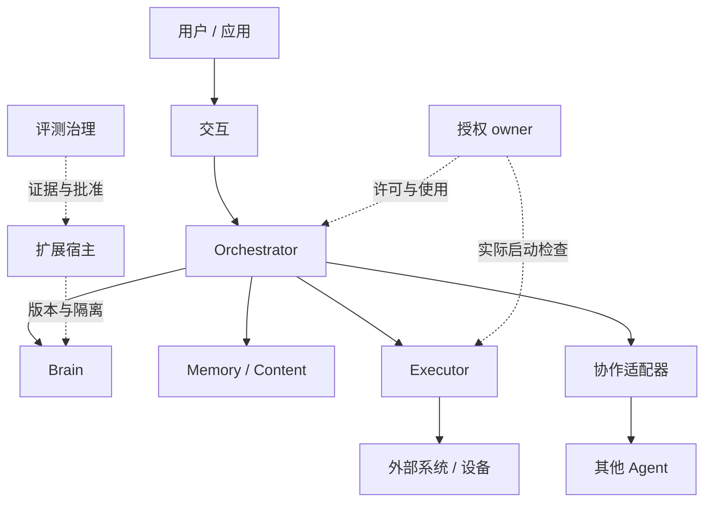
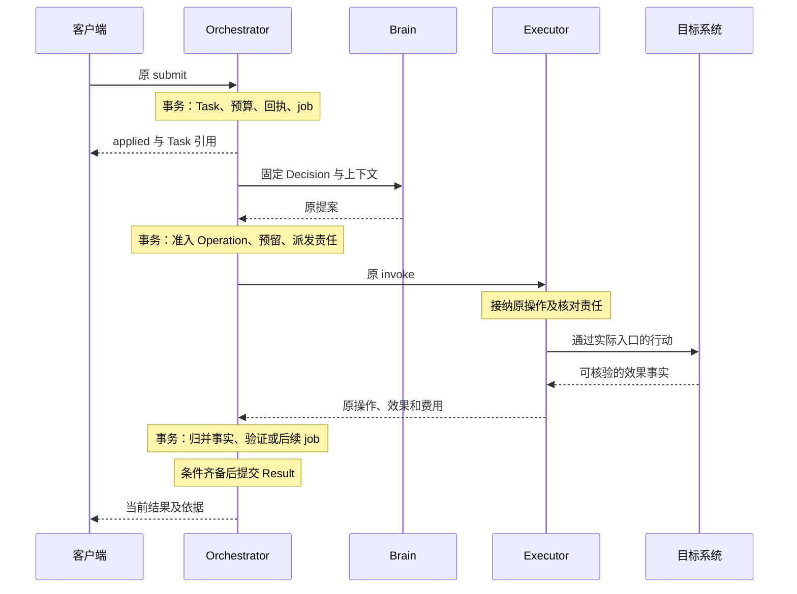

# 系统主线：从目标到可核查结果

每个 Task 固定归属一个逻辑 Orchestrator，由它裁决目标、行动准入、控制和完成；Brain 提出建议，Executor 报告效果，Memory 管理可复用材料。进程可以更换，任务负责方及原业务身份保持不变。实现与验证状态见 [review](review.md)。

## 组件与事实归属

模块划分按事实裁决责任，部署划分按伸缩和隔离需要。同一数据库中的业务事实与下一责任共同提交；独立 owner 用持久原命令和可查询事实交接。

下图表示逻辑调用关系。实线是业务调用，虚线是授权或装配关系，节点数量不等于服务数量。

| 事实 | 裁决组件 | 读者应区分的对象 |
| --- | --- | --- |
| 目标、控制、预算、准入及 Result | Orchestrator | 逻辑任务负责方与当前 worker |
| 模型输入、原调用、提案与费用 | Brain | 建议与已获准行动 |
| 发送、占用、实际效果 | Executor／资源 owner | 请求接纳与目标发生效果 |
| 条件检查和证据当前适用性 | Orchestrator 的验证组件及声明的 Evaluator | 评估运行完成与条件通过 |
| 许可、一次消费和使用结算 | 授权 owner | 获准、开始使用、最终费用 |
| 内容版本、记忆、来源及副本关闭 | Memory／Content owner | 内容引用、当前权限和物理清理 |
| 输入消费、委派接纳、实例开放 | 各自实际业务 owner | 界面呈现或网络答复与业务决定 |

项目术语中的 Operation 包含一个有界行动及持续核对责任，区别于网络上的一次请求。InstallLock 是不可变版本清单，不是互斥锁。长期记忆须有独立保存许可，任务上下文不会自动成为记忆；其余领域定义见 [CONTEXT](../../CONTEXT.md)。

## 一次完整任务

以“读取指定版本资料，比较指定维度，附来源，保存到授权位置并读回”为例，Orchestrator 把目标形成条件，分别核对信息覆盖、报告质量和文件效果。下表只串联交接，具体裁决规则由链接文档定义。

| 顺序 | 负责方与持久交接 | 实现入口 |
| --- | --- | --- |
| 1．提交目标 | 客户端保存原命令及选定服务；Orchestrator 原子接纳 Task、回执、预算和首 job | [调用契约](contracts/README.md)、[可靠接纳](reliability.md) |
| 2．形成条件 | Orchestrator 保存目标修订及必要条件，建立完整目标覆盖检查 | [完成验证](verification.md) |
| 3．决定下一步 | Orchestrator 固定上下文；Brain 核对实际输入、来源和模型调用，返回绑定快照的提案 | [Brain](brain.md) |
| 4．准备材料 | Executor 取得实际资料；Memory／Content 保存准确引用和使用范围 | [执行](execution.md)、[记忆](memory.md) |
| 5．生成报告 | Brain 把草稿经受控保存转换为准确 ContentRef，Orchestrator 固定候选成果 | [生成正文](brain.md) |
| 6．准入并执行 | Orchestrator 核对当前目标、控制、授权与预算；Executor 负责实际启动、原操作日志和效果核对 | [任务编排](orchestrator.md)、[授权](authorization.md)、[执行](execution.md) |
| 7．核验完成 | 验证组件将必要条件与准确成果、效果和证据匹配；Orchestrator 提交固定 Result | [完成验证](verification.md) |
| 8．呈现和收尾 | Surface 投影 Result、依据及缺口；费用和清理继续沿原责任处理 | [交互](interaction.md) |

下图回答跨域成功点在哪里。实线为请求或事实交接，虚线返回业务回执；标注的事务均局限于所属数据库。

## 异常怎样回到主线

恢复读取原负责方保存的事实，再决定是否继续；同一用户打开新端点不产生第二个任务写者。

| 中断 | 继续位置 |
| --- | --- |
| 提交答复丢失 | 按原服务和 command_id 查询，不能用新命令重建同一意图 |
| 模型建议返回前目标变更 | 按 Task 当前修订重新决策，旧调用费用仍归原来源 |
| 文件已写、答复丢失 | 查询原 Operation 与目标日志，未知期间保留核对责任 |
| 用户暂停或取消 | 原控制事务裁决新工作；远端落实和已发效果分开展示 |
| 来源关闭或授权撤回 | 相关 owner 封闭新使用，逐持有者核对副本与残留 |
| 任务结束后更高账单到达 | 沿原计费来源追累计差额，目标终态保持 |
| 新进程启动或旧版本恢复 | 核验完整账本、准确版本和当前批准，再开放相应入口 |

## 保证与限制

系统以可恢复的持久责任组织工作，不承诺任意外部系统全局恰好一次效果。命令幂等、授权使用、实际效果、完成证据及物理清理分别由对应 owner 提供有条件的保证。

结果的 verified、assessed、user_accepted 表明完成依据，强度与适用条件归[验证](verification.md)。固定 Orchestrator 使失联任务承担等待；当前设计不提供同一任务离线跨端自动接管。生产账本恢复和外部字节故障域归[部署](deployment.md)。

## 取舍

固定负责方和本地事务降低多写者、共享余额与恢复交接的复杂度，代价是部分失联期间的可用性。只有明确需要同任务离线接管，且能证明旧写者隔离、在途效果核对、权限与预算转移时，才重新设计归属协议。

Brain 按一轮快照提出有界建议，Orchestrator 掌握循环；多轮任务支付交接开销。测量证明交接主导延迟且批处理能兑现相同控制和恢复检查点时，再调整决策粒度。有限计划的具体规则归[任务编排](orchestrator.md)。
