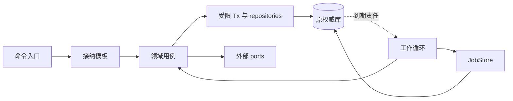
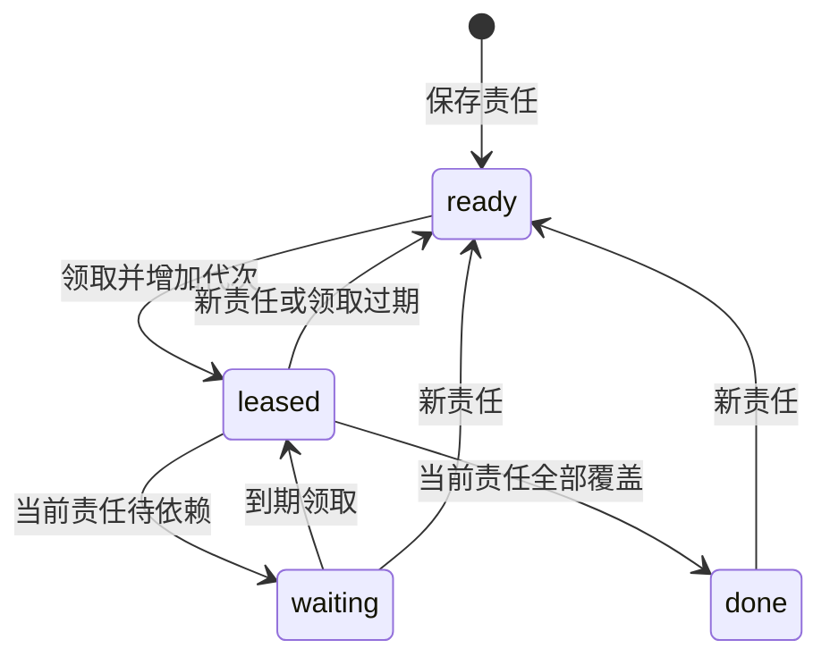
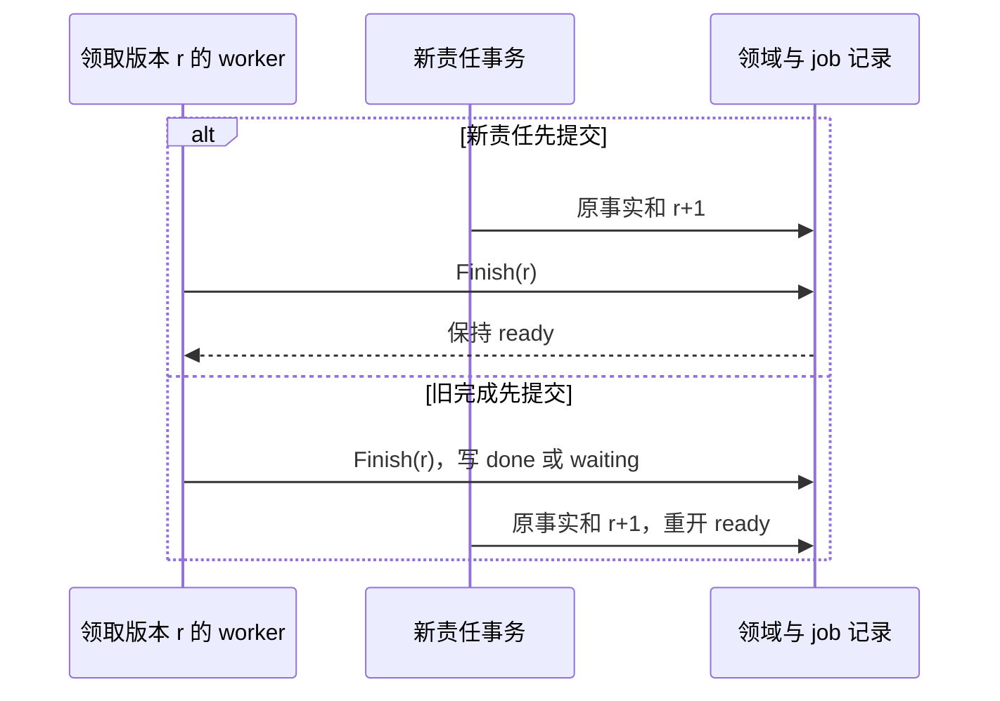

# 可靠接纳与持久工作

公共框架把业务事实、原命令回执和下一项工作提交到同一本地事务，并提供领取、接替和条件回写；领域处理器决定业务成功、外部效果和可否重试。实现及验证状态见 [review](review.md)。

## 组件与依赖

每个事实负责方（owner）装配自己的接纳模板、领域处理器和逻辑 JobStore，共用实现代码，使用所属权威库。第三方组件只需遵守[调用契约](contracts/README.md)，无需采用这套内部框架。

这里采用事务发件箱（transactional outbox）模式：领域事实和待执行责任共同提交，后台在事务外交付。jobs、Delivery 或费用交回记录已经承担 outbox 责任时，不再复制一份能独立裁决成功的队列。Job 是一次后台责任，区别于用户 Task 和物理 Attempt。

下图表示一个 owner 内的依赖。实线是本地调用或存储访问，虚线是从原库重新发现工作；跨 owner 调用在事务外进行。

| 接口 | 行为 | 调用边界 |
| --- | --- | --- |
| `transaction.Within(scope, participants, fn)` | 返回 Committed、RolledBack 或 CommitUnknown | 闭包只做本地读写；participants 由宿主装配 |
| `command_store.Lookup/Reserve/SaveReceipt` | 按原键及摘要判重，保存方法允许的阶段 | 与领域事实或准备责任同事务 |
| `job_store.Raise(tx, key, source, due)` | 合并已确认的新责任，增加 work_revision | 领域用事实唯一键或来源修订证明该责任不是重复通知 |
| `job_store.Hint(tx, key, due)` | 提前已有未结工作的到期时间 | 不建 job、不重开 done、不增加版本 |
| `Claim(scope, pool, limit)` | 在已预留容量内有限领取 | 提交确认后才能处理；只锁 jobs |
| `Renew(claim, until)` | 延长当前有效领取 | 不换代，不复活过期领取，未知续约不延长已确认截止 |
| `Guard(tx, claim)` | 锁内核对领取者、代次及当前截止 | 取得全部领域锁后再锁 job |
| `Finish(tx, claim, disposition)` | 条件提交 done、waiting 或 ready | 领域给出完成依据，框架检查两种版本 |
| `WorkHandler.Handle` | 用多个短事务和有限外部步骤推进责任 | 返回成功不自动把 job 标为 done |
| `WorkHandler.Reconcile` | 按未结记录索引及可恢复游标修复缺失 job | 保留原业务键；不重造命令或推断外部未执行 |

宿主启动时检查每种 kind 的处理器、事务参与者、业务键、期限、尝试策略和恢复入口。缺处理器或重复绑定时关闭该类新接纳，保留旧记录的诊断入口。精确接口和适配器版本随 InstallLock 固定。

## 数据模型与状态机

JobStore 用责任版本识别新工作，用领取代次隔离旧工作者；两者独立递增。下表是内部存储语义，不新增公开 Schema 字段。

| 字段组 | 含义 |
| --- | --- |
| scope、responsibility_key、kind | 原 owner、受信身份域和稳定领域责任键，共同唯一 |
| job_id、source_ref | 不复用的作业身份及原领域记录引用；大正文与凭据不进入领取索引 |
| state、due_at | ready、leased、waiting、done；下一处理时间和可诊断等待依据 |
| work_revision | 新责任共同提交时递增；通知、到期、领取、续约不递增 |
| holder_id、lease_epoch、lease_until | 本次进程启动身份、领取代次和数据库裁决截止 |
| observed_work_revision | Claim 中固定的领取观察值；回写时不可刷新为最新值 |
| 原尝试数、期限、预算关联 | 随原领域责任保留，重领和重开不清零 |

领取使用租约（lease）限制时间，`lease_epoch` 是本地回写的隔离令牌（fencing token）。它只有在写入接收方检查时才生效，不能隔离不识别该令牌的外部设备或提供方。

下图表示同一个 job_id 的已提交状态变化。边表示逻辑转移，不要求每条边对应单独 SQL。

Raise 首次创建 ready；已有 done 或 waiting 重开 ready；已有 leased 保留当前领取，仅增加责任版本、取更早 due_at。新责任不能偷换已固定的发送载荷。合法清理后重建同一责任键使用新 job_id，旧 Claim 不得命中新行。

## 关键时序

### 接纳与提交未知

接纳模板先校验当前身份、路由、方法结构和入口容量，再按[共同命令键](contracts/README.md)判重。配对方法使用其预认证身份域，普通业务不能选择该例外。

1. 已有完整记录时，核对摘要并按当前披露权限返回原阶段；最小去重记录按契约返回 gone 或冲突。
2. 首次接纳在唯一键保护下复核期限、控制、授权和领域条件。
3. 同步决定保存业务、合法回执和下一责任；多阶段接纳保存准确输入、准备事实及恢复 job。
4. 只有确认提交后才返回成功阶段；通知在提交后发送，失败不改变业务决定。

方法未声明 accepted 时，内部准备仍不对外增加新阶段。查询或重投关联原准备并有限等待，超时沿原查询契约继续；不能把已有准备报告为 not_found，也不能提前给 applied。

| 事务结果 | 处理规则 |
| --- | --- |
| Committed | 返回已持久决定；领域拒绝也可作为 rejected 值提交 |
| RolledBack，明确数据库竞争 | 仅在确认未提交、闭包无外部动作且重试预算内重新运行；原 expected_revision 和摘要不改 |
| RolledBack，其他错误 | 不自动生成业务拒绝；沿原命令和错误契约核对 |
| CommitUnknown | 查询原命令或原业务阶段，保留预留和恢复责任；不重跑外部步骤 |

Tx 仅在闭包内有效，不跨 goroutine、租户或数据库使用，不允许嵌套事务冒充共同提交。外部身份解析、授权获取和字节准备在事务外完成，本地条件在事务内复核。

### 领取、执行与条件回写

工作循环先预留本池实际容量，再有限领取；数据库确认领取后才执行。Claim 提交未知时，适配器按调用内保留的候选快照查询 holder、epoch 和截止，只返回已确认项，观察版本仍用领取时的值。候选快照丢失就不执行，等待原 job 接替。

处理器按“短事务准备 → 事务外调用 → 短事务归并”推进，可在一次有限 Handle 内多次执行。每个不可恢复步骤前保存原身份及核对责任。后台 context 属于宿主和原责任期限，请求断连不取消已接纳工作。本地并发槽在实际调用退出后释放。

锁序为原命令键、领域声明的祖先／预算／控制／对象锁，最后所有参与 job 行；同类按稳定键排序。取得 job 锁后发现还需新的领域锁，应回滚重组事务。隐式外键锁与唯一索引锁也进入数据库适配器验收。

Guard 与 Finish 在实际裁决处读取数据库当前时间。领取失效使整个受保护事务回滚；来源可独立核验的迟到事实通过新领域事务归并，不能让旧 worker 绕过 Guard。

| Finish 条件，按表中顺序判断 | 原子结果 |
| --- | --- |
| job_id、state、holder、epoch 或期限不匹配 | 拒绝全部受保护写入 |
| 领取有效，当前 work_revision 大于 Claim 观察值 | 保存仍合法的原事实，置 ready，保留较早 due_at；禁止旧 done 或旧退避 |
| 领取有效，版本相同，领域证明责任已完成或持久交接 | 置 done；后继责任须共同提交或已有可核验的远端接纳关联 |
| 领取有效，版本相同，仍待依赖 | 保存依赖、有限退避和 due_at，置 waiting |
| 当前版本小于观察值 | 拒绝并报告数据或适配器异常 |

下图回答新增责任会不会被旧完成覆盖。实线为竞争事务访问同一 job；两种提交顺序都保留新责任。

同一事务既归并事实又产生新责任时，先 Raise 再 Finish；Finish 必须看到增加后的版本。高频重试耗尽时仍保留领域要求的低频核对或受信处置责任。

## 失败处理

恢复从原责任与原业务身份开始，通知和进程状态只用于加速发现。

| 故障点 | 继续者与动作 | 保留依据 |
| --- | --- | --- |
| 接纳后失答复 | 调用方查原回执，worker 继续原工作 | 原 command、准备或业务事实、job |
| worker 退出或租约到期 | 新 worker 查原阶段；旧回写拒绝 | 原发送和用量关联 |
| 外部返回 unknown | 领域查询目标，按领域契约判断安全重试 | 原 operation、预留、未决责任 |
| 续约结果未知 | 最迟在此前确认截止停止受保护动作 | 原 Claim，未知不延长期限 |
| 可信效果或费用迟到 | owner 独立核验身份与单调修订，新事务收取 | 原事实及后续责任，Task 终态不重开 |
| 唤醒全部丢失 | 到期索引有限扫描 | jobs 是持久责任，NOTIFY 不是 |
| 格式不识别、处理器异常 | 关闭受影响新接纳，退避和诊断 | 不把异常标 done |
| 库或字节损坏 | 按[部署恢复](deployment.md)隔离和核对 | 缺失证据如实保留 |

持续关注远端变化的关联在建立时保存周期核对责任，追平后 waiting，直到领域声明关联关闭。Hint 不能唤醒已结束的生命周期。Reconcile 用于修复缺陷或迁移遗漏，正常并发正确性不能依赖事后补扫。

## 保证与限制

共同提交依赖同一本地事务、真实耐久确认、当前时间依据和完整历史。Guard 保证旧领取不更新受保护本地事实，不能撤回已经进入外部系统的字节。外部效果是否发生和安全重试由[执行](execution.md)、[大脑](brain.md)等领域判定，框架不提供全局恰好一次效果。

自动处理受有限容量、期限、尝试数与领域可查询性约束；依赖永久不可用时，框架保留可诊断责任，不承诺无条件完成。终态 Task 与 done job 不授权删除最后去重、取消墓碑（tombstone）或尚未结清的效果与费用记录。

## 调度与观测

宿主按 owner、租户和类别公平轮转，控制、撤权、结算、清理及原回执查询保留容量。等待不占 goroutine 或数据库连接，领取批量不得超过已预留处理容量。存储适配、维护与空间保护归[部署](deployment.md)。

| 计量面 | 需要分开记录的量 |
| --- | --- |
| 事务 | 接纳、准备、领取、续约、事实提交、恢复修复的 SQL、WAL、字节、锁等待及 commit/rollback/unknown |
| 调度 | 扫描行数、命中率、最老未覆盖责任年龄、领取到开始延迟、版本落后回写 |
| 外部请求 | 原提交、回执查询、事实查询、安全重试及实际物理发送次数 |
| 恢复成本 | 相对冻结正常负载的额外事务、查询、字节、积压与净排空率 |
| 费用 | 原物理计费来源及修订；多模块投影不能重复收费 |

Raise、续约和重领不重置积压年龄；周期核对的生命周期与当前逾期年龄分开。高基数 ID 进入受控日志，指标按有限类别聚合，正文和凭据不进入通用遥测。故障验收见 [FW 套件](validation/fault-experiments.md#framework)。

## 取舍

公共模板减少各域重复编写接纳和接替分支，代价是宿主维护接口、两种数据库适配及共用故障套件。多数模块必须绕过模板时，应收缩模板，保留共用原语，不增加按模块名分支的通用业务状态机。

逻辑 JobStore 统一行为而允许各域独立表布局，代价是每种映射都要兑现同事务责任合并。某适配器不能兑现时，须另行评审其保证，不能作为透明替换。公共框架不新增调度服务或跨库事务。
