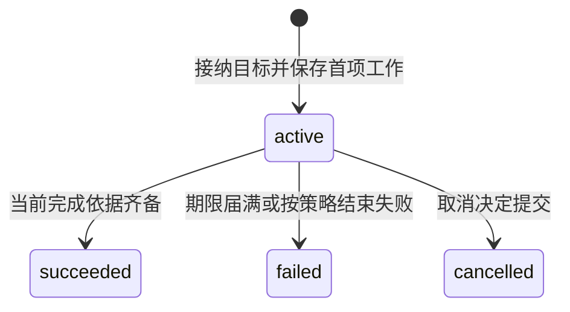

# 任务推进与控制

[入口](README.md) · [完成核验](verification.md) · [持久工作](durable-work.md)

Orchestrator 的工作是把新事实变成下一项合法责任：继续决策、准入行动、等待条件，或提交终态。它同时服务同步命令和后台作业，两条路径使用相同任务规则。

## 状态回答不同的问题

Task 的 `status` 表示目标责任是否结束：`active`、`succeeded`、`failed`、`cancelled`。`control` 表示本任务是否允许运行：`running` 或 `paused`。输入、授权、依赖、预算、效果和容量缺口记录在 `wait_reasons` 中，各自有对应对象及解除条件。

`open_effects` 保存未知或可能迟到的操作；`accounting_open` 表示未结费用。于是“已取消、写入未知、费用待结”是一种能够准确表达的状态，而不是互相冲突的三个结果。

暂停和等待不增加另一组任务终态。暂停期间，既有充分证据仍可支持成功；期限继续计时，届满记录 `deadline_exceeded`。取消和成功竞争时，以先提交的终态为准。迟到事实进入原效果或费用记录，原终态保持不变。

## 一轮提案如何被消费

Task 接纳时固定 TaskPolicy，包含工具范围、确认等级、回路限额、评估方式和费用模式。Snapshot 记录本轮目标、条件、材料、配置和依赖修订，Decision 身份在发送 Brain 之前保存。

Brain 返回后，Orchestrator 先查原 `decision_id` 的消费记录。已处理的 Decision 返回原结论；未处理的提案在条件事务中检查当前修订、有效控制及领取资格。旧提案的调用记录和费用保留，但不因返回较晚获得新的行动效力。

提案携带 `requirements_proposal` 时，先比较条件完整内容。条件相同继续处理；合法补全实际改变条件时，只保存新条件、目标及控制修订、下一轮责任，并使同提案的行动、完成建议和计划变更失效。改变目标含义、显式约束或必要性，需要用户通过 `task.revise` 修订。

条件不变且提案仍有效时，按以下分支推进：

| 提案 | Orchestrator 的决定 |
| --- | --- |
| `act` | 把行动候选送入统一准入；通过后保存原操作意图、预留及派发责任 |
| `need_context` | 有界读取已存在且获准的材料，保存结果或缺口，供后续快照使用 |
| `request_input` | 创建限定回答范围的 InputRequest，进入对应输入等待 |
| `complete` | 进入覆盖、条件、当前缺陷和未结效果检查，满足后才提交成功 |
| `fail` | 核对原因与当前事实，决定等待、补救或提交失败 |

真实网页抓取、设备观察和新的质量评估经过行动准入。重复请求同一份已有上下文复用已保存结果；依赖离线时等待原对象恢复，不靠持续请求模型探测。

## 候选先定形，行动再准入

所有会改变金额、收件人、正文、路径、筛选或用途的模板和 hook，在准入前完成。受信规范化器确定实际资源，固定准确 Capability、Binding、InstallLock、配置及最后参数。驱动后续可以更新签名和凭据，但业务语义继续对应这一份固定意图。

远端依据先在事务外取得。准入事务锁定所需领域记录，再检查：

1. 候选所依赖的任务与目标修订、工作领取仍有效，来源消费记录尚不存在。
2. 本任务及全部同域祖先活动且允许运行，期限未到。
3. 能力、参数、绑定及安装依赖准确，授权和预算足够。
4. 本次资源没有冲突，原未知效果没有阻塞这一行动。

通过后，原意图、执行命令、预算预留、唯一来源准入记录和派发 Job 共同提交。Brain 提案、计划步骤和固定核验规则生成的候选共用这条路径；固定规则不能借核验名义绕过权限或暂停。

独立行动可以作为有界批次准入，每项仍有独立操作与预留。依赖前项输出的行动在真实结果到达后再准入。派发和实际发送还要检查各自需要保持当前的控制、用途及期限。

## 可选计划把已明确的依赖交给代码推进

默认 ReAct 直接采用 Brain 的行动提案。可选 Plan 表达有限、无环的步骤；`PlanMaterializer` 只把已核实输出代入后续候选，不承担行动许可。

一次 `act` 提案选择直接行动或安装计划：前者有 actions 且无 plan_delta；后者 actions 为空，引用合法非空计划。计划以原 `base_plan_ref` 比较当前版本，首次为版本 1，后续同 plan_id 逐版修订。首步骤也由后续作业生成候选，再独立准入。

步骤按 `(task_id, plan_id, plan_revision, step_id)` 去重。`depends_on` 的前项须已结束、无迟到效果且输出核实；`pass_conditions` 要求当前适用的所选条件判断为 pass。评估操作已完成但报告 verdict=fail 时，依赖仍不满足，不能另挑历史 pass 覆盖。

参数来源只有固定字面值、已有原操作输出、同计划直接或间接前项输出。JSON Pointer 用于取值，不运行脚本或表达式。映射不覆盖主体、授权、预算或控制。来源缺失、类型错误、版本不符时保存缺口并重新决策；计划改版不改变已准入操作，复用旧输出要显式关联并复查适用性。

## 新反馈怎样取得继续资格

Orchestrator 按受信 owner、对象、修订去重归并事实。相同修订且摘要相同是重复；同修订异摘要是负责方冲突；新修订须符合合法变化。归并事实、累计费用差额、进展分类和下一项工作在同一事务保存。

TaskPolicy 固定累计续行、修复及连续无进展上限。每个新 Decision 或实际准入的计划步骤占一次续行额度；原身份重派、重领不重复计数。目标修订、重启、暂停或更换 Brain 都不清除累计额度。

| 反馈 | 计数与后续处理 |
| --- | --- |
| 新的有效目标、结果、回答，或原 unknown 核清 | 更新准确输入依据，可以清零连续无进展数；累计额度及费用保留 |
| 重复通知、原 Decision 重报、同对象同修订 | 返回原归并结论，不增进展或无进展次数，不创建新 Decision |
| 新 Decision 格式错误、合法拒判或无可准入建议 | 一次消费对应拒绝与恢复条件；修复和升级受累计额度约束 |
| 原效果、账务或子任务没有新事实 | 对原对象有限核对；相同读取不算进展，也不算模型无进展 |

有效输入摘要比较语义依赖，不包含通知 ID、领取代次、token 累计或纯账务修订。达到连续上限时，有明确恢复对象就保存现有等待种类及 `resume_condition`；期限或累计额度耗尽时，先处理在途工作和既有充分证据，再按策略结束目标推进。原效果与费用继续收尾。

### 尚需明确：纯账务变化使提案过期

当前草稿保留 Task 总修订门禁，账务归并也可以增加该修订。设 Decision 使用 r，旧操作的费用更正先提交为 r+1，目标和证据未变、预算仍充足，随后原提案返回。现有规则会拒绝旧提案，但没有完整规定这次失效如何取得下一轮资格、如何计入修复及无进展。

“stale_snapshot 重新组装”和“纯账务不构成有效新输入”不能单独给出唯一恢复算法。本版保留总修订检查，不自行采用旧提案，也不擅自定义一次免费重算。实现前需明确这一分支的持久后续责任和计数，并用账单先到、提案先到两种顺序验收。详见[待决事项](open-boundaries.md#revision-progress)。

## 用户输入与目标修订

`task.input` 回答一个尚未消费的请求，只补请求明确开放的参数；`task.revise` 修改仍活动任务的完整目标与约束。回答绑定 request_id、request_revision 和适用目标，修订比较 Task 的 expected_revision。

例如尚未确定保存目录时，回答“受管目录 reports”可以补参数；既定 archive 改为 reports 则是目标修订。“不保存了”改变必要条件，也需要修订。自由文本怎样解释和固定原命令见[应用与输入](applications.md#input-routing)。

消费回答时，业务事务核对身份、请求状态、版本、期限、回答范围、必要预览及当前权限。两个不同回答竞争时，先成功提交者消费，另一方得到请求已消费的拒绝；同一原命令重投则返回原决定。目标修订使绑定旧目标且尚未消费的请求被替代。回答只解除对应输入等待，不清除暂停和其他缺口。

## 控制传播与父子关系

暂停、恢复、取消、目标修订及终态提交都增加控制修订，并与逐执行端传播责任共同保存。执行端持久保存 TaskGate，按 control_revision 合并乱序快照。界面把本地决定与实际入口落实范围分别显示；只有当前修订的完整范围确认后，才显示控制已确认。

未收到暂停的远端仍可能在旧 `start_before` 窗口内启动；窗口到期限制新启动，已发动作仍需核对。这一保证依赖[时间与实际入口](deployment.md#clock-adapter)。

内部子任务与父任务共用 Orchestrator 事务。有效运行要求自身及全部祖先 active、running；父恢复不清除子任务自己的暂停。父子创建、准入和控制按根到叶锁定，创建时限制深度与子树规模，使传播事务有界。

父目标实际修订后，默认取消旧目标下活动内部子树，已取得材料按新目标复核后可复用；旧操作和费用继续核对。外部委派沿原创建、取消与封账协议收束。新委派不继承旧身份，也不重置父任务累计额度。终态后的新目标建立关联原任务的新 Task。

## 内部实现职责

CommandHandler 处理认证后的命令与回执；TaskCoordinator 执行目标、控制、准入和完成规则；SnapshotAssembler 固定输入；FactReducer 归并可信事实；BudgetLedger 管理预留与结算；可选 PlanMaterializer 产生候选；JobRunner 推进后台责任。它们是可组合的代码职责，共享本域事务，生产分别装入应用和工作进程。
