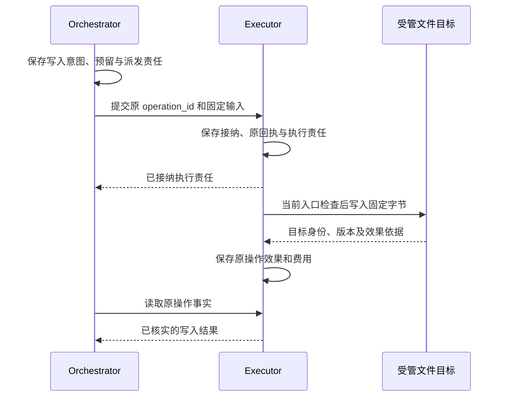

# 一项任务的完整经过

[入口](README.md) · 下一篇：[事实归属与关键选择](ownership.md)

用户提出：“比较 A、B 两个软件版本的差异，附上来源，把报告保存到受管目录，再在模拟手机上创建提醒。”这项工作包含资料获取、内容判断和两个外部效果。下面沿同一任务说明每个参与者何时接手、用户能确认什么，以及中断后如何继续。

## 1. 先建立一项可以找回的任务

应用保存用户原文，并将准确目标发布为可按版本引用的 Content。它从受信发现中选择逻辑 Orchestrator，在第一次发送前固定完整 `task.submit` 命令、目标服务和待交付记录。后续重试使用相同身份与内容。

Orchestrator 核对身份、目标、任务策略、期限和预算，在同一短事务保存 Task、原回执和首项后台工作。`task.submit` 返回 `applied` 后，用户可以确认任务已经建立；模型尚不一定开始运行。应用把 Task 关联回原会话，随后通过查询取得进展。

如果接纳已经提交而答复丢失，应用查询原服务的原命令。它可以补回同一个 Task 关联，不能将同一提交改投另一个编排器。会话消息负责组织对话，任务记录负责继续履行目标；页面关闭不会取消任务。

## 2. 把目标展开为完成条件

Orchestrator 保留完整原始目标和显式约束，再保存判断完成所需的 Requirement。Brain 可以帮助提出条件，但条件提议本身不证明它覆盖了原目标。

| 原要求 | 条件关心什么 | 所需依据 |
| --- | --- | --- |
| 比较两个指定版本并给出来源 | 差异准确、范围完整、引用能够支持结论 | 实际取得的来源正文，以及针对准确报告版本的质量评估 |
| 保存报告 | 受管目标路径已保存同一份候选报告 | 原写入效果、目标版本和独立读回 |
| 创建提醒 | 目标设备中的内容、时间与要求一致 | 获准设备、当前观察及目标记录 |

另有一项覆盖核验：这些条件是否遗漏了用户要求。受限目标模板可以作确定性映射；任意自然语言需要适用的语义评估。缺少报告、实现或完整输入时，任务留下具体缺口。新的模型核验仍作为获准行动处理并计费。

同一提案既补充条件又建议写入时，只要条件实际改变，Orchestrator 就先提交新目标修订，再请求下一轮决策。本轮的写入建议不会顺便执行。这是现有选择：多付一轮费用与延迟，换取行动和完成使用同一组已固定条件。重复相同条件不会制造新修订。

## 3. 取得资料，形成准确候选

Orchestrator 从当前目标、条件、控制、原操作事实和获准资料组装 Snapshot，固定这轮 Decision 的输入与配置。Brain 可以用确定性规则作判断；需要模型时，一项 Decision 至多发送一次物理模型请求。

搜索和网页获取是 Executor 的有界操作。搜索结果中的摘要用于选择来源，正文获取另留准确内容、来源时间和截断范围。工具返回成功只说明它完成了所声明的读取，未必已经取得用户目标需要的全部资料。

Brain 根据已取得正文生成报告，将候选字节保存为 Content，再返回引用这份候选的提案。质量检查、文件写入和最终结果都关联准确版本。候选修改后，需要重新判断哪些旧证据仍适用。

`need_context` 可以补读已经存在且获准的材料。新的网络搜索、设备观察或额外推理要经过各自的行动或决策准入，因而有独立的费用、期限和恢复身份。

## 4. 准入一次写入，再确认目标效果

报告质量评估通过后，Orchestrator 检查当前控制、目录权限、预算、版本前提及未决效果。它共同保存不可变的写入意图、费用预留和派发工作，然后把原操作交给 Executor。

图中的接纳和写入效果是两个成功点。Executor 接受责任后仍可能等待权限或发现版本冲突；Orchestrator 不能在接纳回执到达时就显示文件已保存。

默认文件驱动只对单一受信文件 owner 管理的根提供这条恢复路径。其他进程写入、硬链接别名和不支持的存储语义会破坏证明前提。普通用户目录和网络盘需要独立能力声明与验证，详见[文件效果](execution.md#managed-files)。

随后准入独立读取，从目标文件取得实际字节，与候选报告核对。读取原写入参数、模型缓存或写入回执都不能代替这次目标读取。

## 5. 用新观察推进设备动作

创建提醒前，执行端取得设备自动占用和新鲜观察，再依据本次界面状态执行一个有界动作。需要后续动作时重新观察。资源控制代次、任务控制修订和后台作业领取分别检查，承担不同职责。

用户本人接管时，资源 owner 先提高控制代次、撤销自动占用并封闭旧入口，再报告仍在途的动作。交还自动执行需要核清旧效果、重新占用和观察。未知点击不会因换了工作者或取得一张新截图而自动变成可重做。

## 6. 汇总完成依据

Orchestrator 提交成功前，检查当前覆盖记录、每项必要条件及全部未结操作。内部子任务必须终结，外部委派必须关闭后续目标行动；未知或仍可能迟到的效果先核清。已取得的证据在完成事务中复查目标、成果和实现缺陷修订，随后共同保存 Result 与 Task 终态。

报告的内容质量依赖评估，因此这个例子的完成依据通常为 `assessed`，即使文件和提醒效果已有确定性证据。Result 保存成果引用、条件依据及限制。账务尚未最终核清时保留预留和结算责任，可以在任务成功之后继续处理。

`verified` 只描述已固定客观条件的依据；目标覆盖可能仍来自语义判断。应用应把这两层说明一起呈现。公共协议目前能够表达什么、不能表达什么，见[完成与证据](verification.md#public-result)。

## 7. 两种丢答复，恢复方式不同

| 丢失位置 | 已知事实 | 恢复者做什么 |
| --- | --- | --- |
| Executor 已接纳，给 Orchestrator 的答复丢失 | 原操作可能已由 Executor 推进 | Orchestrator 查原命令和原 Operation；重投仍沿原身份，不建立第二项写入 |
| 文件目标已写入，给 Executor 的答复丢失 | 写入可能已发生，但效果尚未归并 | Executor 查原 journal、目标身份及版本；证据不足时保留 unknown 并隔离冲突写入 |

第一种主要靠双方账本交接恢复；第二种需要外部目标证据。仅有可靠消息队列不能把第二种不确定性消除。

默认文件驱动可以在满足独占、原文件身份及目录耐久等条件时核对原替换。其他目标可能只提供幂等键，也可能完全无法查询。能否重试由准确能力合同决定；无法证明安全时，任务可以失败或取消，原效果仍保持未知。

## 8. 用户中途介入

用户在报告写入答复丢失后取消任务，Orchestrator 先保存取消，再传播控制。创建提醒等新的目标工作停止；原报告是否已经写入仍继续核对。后来确认写入成功，只补充原操作和费用，Task 保持 `cancelled`。

暂停则保留继续原任务的可能：暂停期间不启动新的决策、评估和行动，但已充分的证据仍可促成完成。用户修订目标时，旧提案和未派发工作失效；已经派发的动作继续按原身份核对。具体竞争与父子传播见[任务推进与控制](task-control.md)。

这条链解释了 Harness 保存多类记录的原因：一份建议、一次准入、一个外部效果和一个完成结论，在正常路径中相邻，在故障路径中却可以分别成立。
