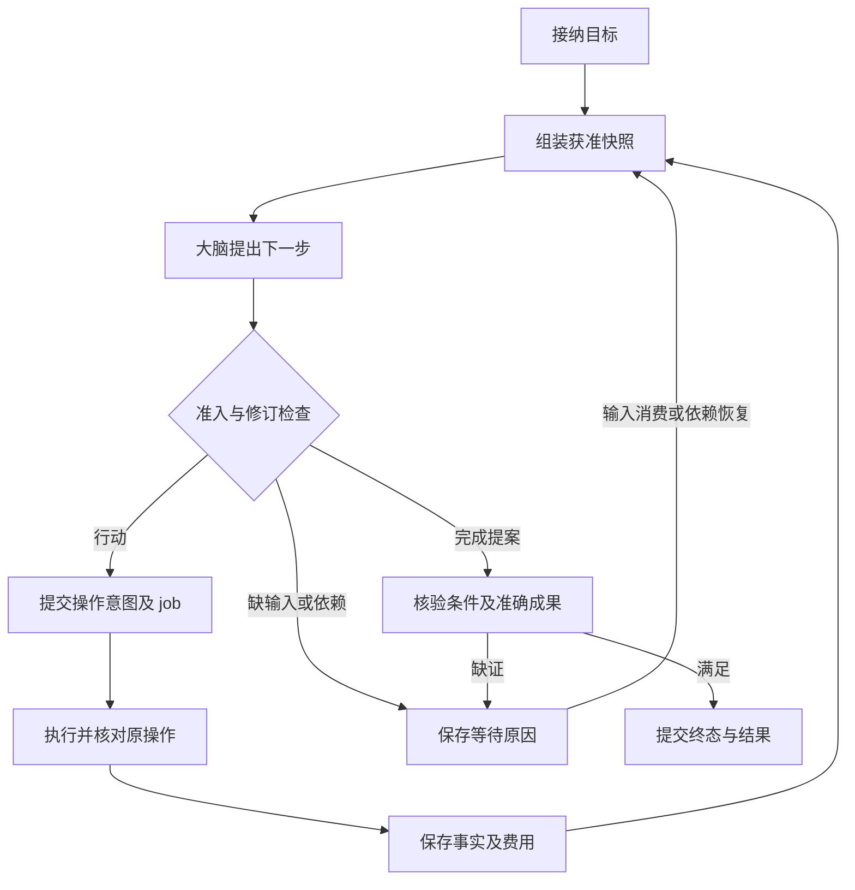
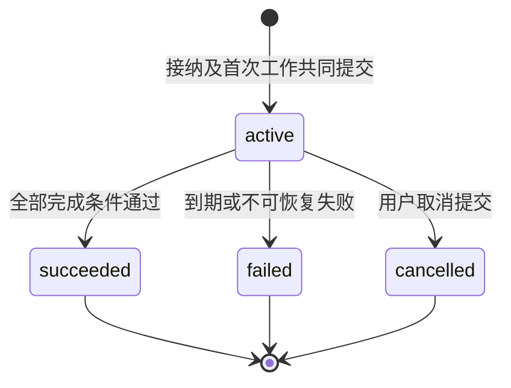

# 任务运行时：从目标到持久推进

[总览](README.md) · [大脑](brain.md) · [执行](execution.md) · [共同契约](contracts.md)

Task Home 保存任务目标、控制、额度、操作意图和完成决定。它把一次决策的可用事实交给大脑，再把有效提案准入为持久工作。Executor 保存真实效果；运行时依据这些事实推进任务，不把模型输出或请求日志当作执行成功。

默认将任务管理、上下文组装、准入、调度和结果核验放在同一模块。它们需要围绕同一个任务修订作决定，拆成独立服务会增加本地事务之外的恢复关系。独立替换边界放在 Brain、Memory、Executor，而不是运行时的每个内部函数。

## 1. 最小任务闭环

以“核实两个软件版本的差异，附引用，保存至指定目录”为例。Home 先保存原目标和调用者明确约束；目录不明时建立输入请求。取得获准来源后，大脑生成候选答案；质量评估绑定这份候选，文件写入和读回则绑定同一内容摘要。Home 仅在条件、效果和成果版本一致时完成。

任务接纳的成功点是 Task、原提交回执与首项 job 同时持久化。存储不可写时返回不可用，不能先显示“已接纳”再依赖内存补写。接纳一般不等待模型推理；缺能力但可能由用户补充的任务可保留明确等待，确定不支持则拒绝并说明具体缺口。

## 2. 目标、计划和完成依据

原始用户目标始终保留。运行时记录解释后的 `requirements`，每项包含稳定 ID、原文依据、类型 `effect|quality`、判断方式和必要性；模型生成的解释标记为派生，不能覆盖显式约束。默认问答采用质量评估，不要求事先安装每种主题的任务流程。涉及具体对象、金额、发布范围等高影响歧义时，先取得用户输入再行动。

计划是可修订的工作假设，不是执行权限。任务接纳时绑定执行策略版本，策略规定工具范围、确认等级、回路限额和允许的评估方式。安装新工具只需声明能力、授权与效果合同；只有业务需要更强的完成保证时才增加专用验证器。Brain 可提交绑定 base_goal_revision 的 requirements_proposal；Home 只自动采纳保留显式约束且不降低必要性的解释补全，并递增 goal_revision。改变目标含义或降低必要性必须经用户 task.revise，所有旧提案按修订检查。

模型自称“全部满足”不能提高保证等级。没有机械检查覆盖的自然语言约束仍属质量判断；用户可以查看解释后的目标并纠正，运行时不宣称已穷尽识别任意自然语言中的所有隐含要求。

| `completion_basis` | Home 必须具备的依据 | 保证与限制 |
| --- | --- | --- |
| `verified` | 每个必要条件均有适用的确定性验证，全部绑定当前目标修订及成果版本 | 客观约定条件通过；检查方法本身有适用范围 |
| `assessed` | 所有必要效果条件已证实，开放质量由固定规则与评估实现给出通过记录 | 声明评估来源与局限，不当作真实正确率或确定事实 |
| `user_accepted` | 必要效果条件已证实，用户通过受信入口接受准确成果版本和可见限制 | 用户验收开放质量，不能把未知写入改为成功 |

有混合判断时，先检查效果，再按必要质量条件取最弱依据：存在依赖用户验收的条件则为 `user_accepted`，否则存在评估则为 `assessed`，其余才为 `verified`。用户接受结果的动作不放宽行动权限。未满足必要条件时可交付部分材料，但任务不得进入 `succeeded`。

完成还要求受管内部子任务全部终结，外部委派已证明封闭新目标行动，并且本任务及其委派的未知或仍可迟到效果均已核清。不能只检查父本地操作表便忽略仍能行动的子任务。已封闭目标工作后的费用核对可以独立继续。

## 3. 状态、控制与终结

下图只描述 Task.status；暂停和等待不是这个状态机的节点。

| 独立维度 | 取值与责任 |
| --- | --- |
| `status` | `active / succeeded / failed / cancelled`，只有 Home 修改；终态不可重开 |
| `control` | `running / paused`；暂停阻止新决策和新目标行动，允许核对、收账及已具备全部证据的完成 |
| `wait_reasons` | 可同时存在的 `input / authorization / dependency / budget / effect / capacity`，逐项带所等对象与恢复条件；解决一项不清空其他项 |
| `open_effects` | 引用仍未知或仍可能在外部生效的原操作；与 Task.status 独立 |
| `accounting_open` | 尚待最终费用的调用或额度分配；以保守预留约束，单独欠费核对不必阻止已有确定成果 |

取消提交后，Home 停止新目标工作并为已派发操作建立取消或核对责任。取消不撤销已发生的文件修改。`cancelled` 可以带 `open_effects`；迟到成功仅更新事实及收尾，不把任务改回成功。期限到期记录 `failed` 和 `deadline_exceeded`，同样保留收尾责任。

暂停是动作边界控制：已发出的单次动作可能继续。只有执行端确认看见控制并阻止后续启动，才可展示该端已暂停；失联端显示待确认。暂停期间不启动新的质量评估来推进目标，但此前已经得到的全部证据可以使任务成功。这样“暂停请求”和“外部动作已完成”不互相掩盖。

用户可对 active 任务调用 `task.revise`。Home 保存新目标修订，废弃尚未派发的旧提案与 job，保留已经启动的操作。新目标若与在途效果冲突，进入 effect 等待，先核对再规划。旧证据仅在仍能明确满足新条件时复用，并产生绑定新 goal_revision 的核验记录；终态后改变目标则建新任务并显式关联。

暂停、恢复、取消、目标修订和终态提交都递增 `control_revision`，与本地决定同事务保存向所有已绑定 Executor 的控制 job。控制快照带 home_id、task_id、goal_revision、status、control 和修订，按[执行端 TaskGate](execution.md)持久应用。新派发附当前 Home 认证的快照和有限启动截止；旧控制或迟到 invoke 不能覆盖较新门禁。已接纳未启动的旧目标操作由执行端核清为未应用，已经可能启动的则保留效果责任。

内部子任务对外的 TaskGate.control 是**有效控制**：只有自身及全部祖先都 active 且 running 时才为 running，其余为 paused。子 Task.control 仍保留自身选择。祖先控制改变时，Home 在同一事务中递增受影响子任务的 control_revision、重新计算有效控制并保存逐执行端传播 job；父控制确认范围包含这些子门禁。恢复父任务只重新计算，不能解除子自身暂停；祖先终结后的子取消继续落实。用户任务数量和并发配额包含内部子任务，使这项同 Home 更新有界。

## 4. 一轮推进与提交边界

工作者先领取 job，再读取固定任务修订、策略、输入、能力版本及获准材料。模型调用在事务外完成。回传 Decision 只能引用该快照；若目标、控制或关键证据修订已变化，保存调用事实及费用，丢弃旧提案的行动效力，重新调度需要的一轮。

准入按以下顺序执行，分支互斥，安全条件分别检查：

1. 检查任务仍 active、目标修订匹配、本人及内部祖先链均未暂停或终结、尚未到期；不满足时不产生新行动。派发前重复这项检查，父恢复不能解除子自身暂停。
2. 校验提案类型、准确能力绑定、参数、依赖和目标约束；缺材料、输入或权限则保存对应等待对象。
3. 检查资源冲突、先前未知效果、当前授权资格及预算。远端授权证据先在事务外获取，过期则重取；执行端启动仍须落实[授权门禁](security.md)。
4. 在同一短事务内按 expected revision 保存操作身份、不可变参数与预留额度、派发 job、任务新修订及原决策消费记录。

独立且资源不冲突的行动可以作为有界批次准入；互相依赖的行动必须取得前项事实后再准入。GUI 默认逐观察执行一个动作，不能预先批量批准依据未知界面的点击。

| 原子提交 | 同时保存什么 | 提交外的下一步 |
| --- | --- | --- |
| 接纳任务 | 原 command 回执、Task、目标修订、初始预算、首 job | 组装和推理 |
| 准入行动 | 原 decision 消费、Operation 意图、预算预留、dispatch job | Executor 接纳和启动 |
| 应用执行事实 | 按 `(executor, operation, revision)` 去重的事实、账务变化、任务修订、下一 job | 新一轮或完成核验 |
| 消费输入／控制 | 原 command、输入或控制修订、失效 job 标记、后续工作 | 通知远端并查询确认 |
| 提交完成 | 固定结果与依据、任务终态、关闭新目标工作、结果可查及可选记忆提取 job | 交互读取、独立提取任务 |

同宿主、同存储、同信任边界可将 Executor 接纳或 Grant 使用纳入相应事务，但外部动作永远在提交后。独立模块替换后改用持久命令交接；不承诺跨库原子性。

## 5. 恢复与调度

job 是必须继续履行的责任，包含唯一 `job_id`、业务关联、kind、due_at、attempt_count、lease_epoch 和有限重试策略。默认类别为 decide、dispatch、poll、control、settle、extract；业务对象保存最终事实，job 完成不代表业务成功。

领取在短事务内递增 lease_epoch。过期领取可被重新领取，旧工作者不能再写任务结果；它可能已经发出的远端操作仍按原 operation_id 核对。派发者在第一次调用前已保存全部不可变输入和原命令，重启后查原回执。不能因“任务领取过期”生成新的副作用身份。

同一任务默认一个决策 job；已声明独立的操作可并发。调度按用户轮转，再按用户内任务轮转，控制和收尾单列保留容量；限额详见[部署](deployment.md)。阻塞工作按 due_at 重试或等具体对象变化，不把所有等待任务循环送给模型。

| 异常 | 保存的事实与继续者 | 后续行为 |
| --- | --- | --- |
| 创建事务已提交，接纳答复丢失 | 调用方保留 command_id；Home 保存任务映射 | 查原命令或原键重投，返回同任务 |
| 模型返回时用户修订目标 | 大脑保留费用与输出；Home 发现 revision 不符 | 不派发旧行动，按新快照再决策 |
| 外部写入后响应丢失 | Executor 原操作未知；Home 保留预留与 poll job | 核对原目标效果，不换新操作重复写 |
| 暂停、完成、取消并发 | Home 对任务行按修订串行提交 | 先提交的终态保持；暂停不伪称已撤回外部行动 |
| 持久存储提交结果未知 | 原业务键和 job 关联可重建 | 先恢复同数据库权威并查询；数据库分裂或原主未隔离时不另起写者 |
| 依赖长期不可用 | wait_reasons、原期限和恢复对象 | 有限等待，到期失败并继续已有收尾 |
| 未知效果不能进一步核对 | 原事实及失败原因、受信处置入口 | 用户可补充可验证证据或结束任务；不能直接点击“视为未执行”开放重试 |

## 6. 额度与有限执行

Home 的任务额度采用 `spent + reserved ≤ limit`。每次调用先按声明的最大消耗预留；明确少于预留的最终费用才释放差额。费用以整数最小计价单位和计价版本记录，禁止混用不同货币或把估计值当最终账单。调用次数、运行时间、模型 token 和费用各有独立限额，任一耗尽都阻止对应新工作。

模型费用不明时按上限保留或保守结算，真实账单迟到按原计费项调整，不能再次累计全部金额。本地并发槽与未知费用不是同一资源；具体边界见[大脑调用恢复](brain.md)。无法提供可信最大费用的适配器只能在用户明确接受估算预算的配置中启用，不得声称严格费用上限。

内部子任务的可支配额度从父任务 reserved 中划拨；父聚合报表展示子费用，但不再扣一遍。不同 Home 使用唯一 allocation_id 交接固定额度，父侧未证明子侧封闭后不返还。分区时额度宁可闲置，不同时在两端消费。

| 方法 | 输入与持久结果 | 失败后的动作 |
| --- | --- | --- |
| `budget.allocate` | 父任务、allocation_id、接收方、单位、上限、期限；共同保存父预留与交接 job | 原 allocation 查询；不明时不另分同笔额度 |
| `budget.settle` | allocation_id、最终累计费用、原结算版本、不可再新增消费的证明 | 重复结算返回同结果；证据不足继续预留 |
| `task.adjust_budget` | expected_revision、每项新上限 | 低于已消费及仍承担义务则冲突；加额不恢复暂停也不延长期限 |

默认每轮补上下文次数、决策轮数、单步重试、用户等待期限和收尾查询间隔均由装配配置给出有限值。未知责任超出自动查询次数后转受信处置，仍可查询；不通过删除记录清空预算或设备互斥。

## 7. 字段与方法查阅

共同标识、引用、版本、错误和 Command／Receipt 见[共同契约](contracts.md)。下表是 Task 与 Result 的权威字段定义；大对象均使用获准 ContentRef。

| 对象 | 字段与约束 |
| --- | --- |
| Task | `tenant_id, task_id, home_id, submit_command_id, goal_ref, goal_revision, requirements, policy_ref, revision, control_revision, status, control, wait_reasons, deadline, budget, open_effects, accounting_open, result_ref?`；Home 和原提交绑定不可变；祖先控制按同 Home 任务链检查 |
| Requirement | `requirement_id, kind, source_ref, rule_ref, required`；rule 引用机械检查、评估规则或用户验收；依据不足不能标 pass |
| OperationIntent | `operation_id, task_id, goal_revision, decision_id, capability_ref, binding_ref, input_ref, input_digest, grant_refs, reservation_id`；准入后不可改参数；效果字段由 Executor 提供 |
| ConditionResult | `requirement_id, goal_revision, artifact_ref, verdict, basis, evidence_refs, evaluator_ref`；verdict 为 pass/fail/unknown，引用准确成果与适用规则 |
| Result | `task_id, goal_revision, artifact_refs, completion_basis, condition_results, limitations, completed_at`；只供 succeeded；失败／取消返回独立结束说明和未决项 |

| 方法 | 业务输入 → 输出 | 成功含义 |
| --- | --- | --- |
| `task.submit` | goal_ref、目标 Home、明确约束、策略选择、预算及期限 → Task | 接纳与首项工作持久化，不保证任务成功 |
| `task.read` / `task.list` | task_id 或过滤条件／游标 → 当前获准快照 | 查询不引发行动，目录只包含本 Home 的任务 |
| `task.result` | task_id → 固定 Result 或尚未成功的状态说明 | 返回原结果，成果字节按当前权限另取 |
| `task.revise` | expected_revision、新 goal_ref、明确约束变化 → 新修订 | 旧在途效果保留；新目标等待冲突解决 |
| `task.pause` / `task.resume` / `task.cancel` | expected_revision、控制理由 → 本 Home 决定及逐远端确认状态 | 本地决定已保存；远端生效另查 |
| `task.input` | request_id、request_revision、内容或选择、准确预览绑定 → 消费回执 | 一次消费；授权输入走独立受信签发入口 |
| `task.attach_evidence` | 原 operation_id、可核验证据引用 → 核验 job | 接纳证据不直接改变效果或终态 |
| `task.accept_result` | request_id、request_revision、候选摘要、goal_revision、受信用户决定 → 验收记录 | 核对请求类型、版本和未消费状态，同事务消费请求、保存验收及后续核验 job；原命令返回原回执，另一命令竞争同请求只可一份生效 |

task.list 使用固定查询上界及稳定 `(created_at, task_id)` 游标，逐页重新检查当前披露权限；已删除或已撤权项跳过并记录缺口，不能为了补齐数量无限扫描。跨 Home 目录由应用合并来源明确的结果，不建立第二个任务裁决者。

## 8. 验证要点

| 前置及故障 | 可观察结果 | 目标 |
| --- | --- | --- |
| 接纳后立即崩溃并重复提交 | 唯一 Task 和初始 job，可查同回执 | C5、A4 |
| 写入答复丢失，再暂停／取消 | 原 operation 保留；不重新写入；迟到效果不重开 cancelled | C4、C5、C7 |
| 相同成果只通过模型评估 | Result 标 assessed，不能标 verified | C1、C8 |
| 用户验收但还有未知副作用 | 不进入 succeeded，显示原操作及核对入口 | C4、C7 |
| 预算下调与子任务迟到费用竞争 | 不突破承担义务，不双计、不提前返还 allocation | C5、C7 |
| 旧工作者在重领取后回传 | 旧提交被拒，原远端操作仍沿原身份核对 | C5、A4 |
| 暂停时最后一份既有证据到达 | 不启动新工作，满足全部条件则正常完成并可解释顺序 | C5、C7 |

上述是设计判据，真实并发、存储故障与恢复仍须由[系统验收](validation.md)执行。
