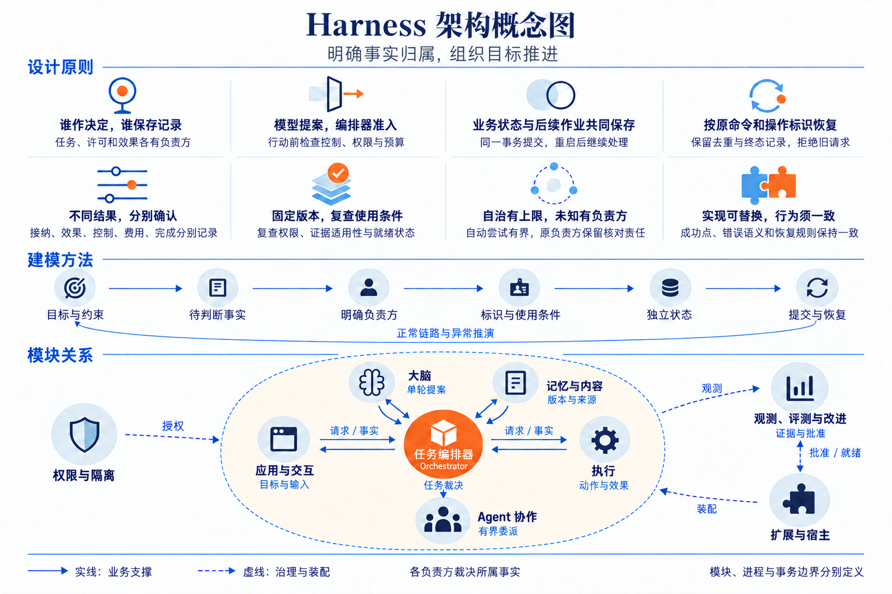

# 技术总览：事实边界、抽象原则与建模方法

[方案入口](README.md) · [可编辑系统全景图](diagrams/system-panorama.drawio) · [设计决策](decisions.md) · [共同契约](contracts/README.md)

Harness 接纳用户目标，组织大脑、记忆、执行与其他 Agent 持续工作。生产主线是面向多用户的分布式服务：各类事实由固定负责方裁决，每次决定和继续履行的责任一起保存，再依据实际证据推进目标。模型输出、网络答复、外部效果和任务完成各自有明确的确认点。

本文是[正常处理链](walkthrough.md)之外的建模与图册导读，解释为何保留这些边界和对象。状态含义归所属模块，精确字段归同版 Schema，跨模块取舍归[设计决策](decisions.md)；本页的例子用于解释这些选择，不另行定义行为。

下文使用三个基础概念：

| 概念 | 含义 | 必须区分的对象 |
| --- | --- | --- |
| owner（负责方） | 某类对象的固定逻辑裁决者 | 不一定是独立服务或工作进程 |
| Orchestrator（任务编排器） | 组织任务持续推进，裁决目标、行动准入、控制和完成；每个任务固定归属一个 Orchestrator | `orchestrator_id` 标识逻辑归属，实例重启或进程替换不改变它 |
| Operation（操作） | 经 Orchestrator 准入的一个有界行动及其持续核对责任 | 请求重复传送不产生另一项操作 |

概念图用直白标题和一句行为说明解释各项原则，再串起建模顺序与模块分工；双向联系概括请求和事实回传，治理连线作用于相应参与者。内部组件和具体交接继续按第 2 节进入可编辑全景图查阅。

## 1. 从用户目标看决定架构形状的矛盾

个人智能应用需要连续完成研究、写作、文件处理和设备操作，也要在用户修改目标、撤回许可或接管设备时及时收束。模型可以解释自然语言并提出行动，却无法仅凭自己的输出证明目标系统发生了什么。外部系统已经写入而连接断开、手机仍离线执行、模型费用迟到，都可能发生在任务已暂停或取消之后。

为保证任务在中断后仍能继续，系统需要保存下一步工作、已接纳的决定、可能发生的动作，以及尚未履行的责任。缺少这些事实时，超时后无法判断应该补做还是避免重复副作用，用户也无法判断取消后的实际结果。

方案采用一轮提案、独立行动准入、按原命令或操作标识恢复，并在使用前复查权限与状态。代价是更多持久交接、保守预留及失联等待；完整比较与改选条件见[架构取舍](architecture-choices.md)。下文说明模块、owner、进程和本地事务范围的对应关系。

## 2. 系统全景图的阅读方法

[system-panorama.drawio](diagrams/system-panorama.drawio) 是原生可编辑的逻辑全景图。图按任务处理、治理装配和外部依赖分区，九个模块分别作为容器，内部用组件框、依赖箭头和精简对象标注表达主要结构。先看模块间交接，再沿模块内部箭头识别入口、裁决、存储与恢复的分工；完整字段、保证边界和异常行为在本文及所属模块详设中查阅。

任务处理主线按以下顺序阅读：

1. 交互模块把目标交给 Orchestrator。
2. Orchestrator 组装获准事实，请 Brain 提出下一步。
3. Orchestrator 将通过准入的行动交给 Executor 或协作模块。
4. 效果、子任务结果和费用回到 Orchestrator，形成下一轮工作或正式结果。

Memory／Content 为主线提供可定位版本、来源和当前可用资料。用户输入由实际业务 owner 消费，界面只保存呈现与转交事实。

治理关系按职责阅读：

- 实际使用端向 Security 取得使用依据，内容和资源入口执行当前限制。
- Extensions 装配精确实现并管理实际实例。
- Evaluation 汇集获准观测，在隔离评测中取得独立证据，再把批准交给 Extensions。

治理关系约束任务处理，各方仍分别承担撤回、停用和恢复责任。

最后检查外部边界：模型提供方、API／文件／设备目标、其他 Agent 或另一 Orchestrator 都可能独立失败。跨过这些边界前，必须已经固定原对象和后续责任；返回时要确认得到的是接纳、效果、控制还是费用事实。

### 2.1 四种边界分别回答什么

| 视角 | 回答的问题 | 本方案中的例子 |
| --- | --- | --- |
| 软件模块 | 哪段代码封装哪些规则，通过什么接口协作 | 任务编排器把目标修订、准入、事实归并与调度放在一起；Brain、Memory、Executor 可独立替换 |
| owner／Orchestrator | 谁能最终裁决并保存某项事实 | Orchestrator 决定 Task；Executor 保存 Operation；资源 owner 裁决实际设备入口；Grant owner 裁决许可消费 |
| 进程 | 哪些职责共同故障、伸缩或隔离 | 一个宿主可装配多个模块；Brain 与索引工作者也可分池运行，仍读写原 owner 账本 |
| 本地事务边界 | 哪些业务更新可以原子提交 | 同库 Task、预算、候选消费与 dispatch job 可以共同提交；远端 Executor 接纳另有提交点 |

模块、owner、进程和数据库没有一一对应关系。Memory 模块包含记忆与内容两类 owner 职责；内容 port 也可随其他业务模块装配。Confirmation 能力由实际消费确认的业务 owner 保存并参与其事务，不因代码复用而形成一个跨库确认中心。云端多个工作进程共享原 Orchestrator 的权威库，接替工作进程不会改变任务负责端。

### 2.2 主要交接索引

图中编号标识一组业务关系。请求、回传或查询按该行解释，调用返回沿原关系传递；同一条关系上的不同方法可以有不同成功点。控制与装配边不表示业务事实自动同步。

| 编号 | 交接关系 | 传递的关键内容与回传含义 |
| --- | --- | --- |
| F01 | 交互 ↔ 实际业务 owner | 固定输入／控制命令、准确请求及预览；回传消费决定、任务事实或获准快照 |
| F02 | Orchestrator ↔ Brain | 固定快照、决策身份与限额；回传原提案、错误及模型用量，Orchestrator 再准入 |
| F03 | Brain ↔ 模型提供方 | 准确模型配置与获准输入；回传输出、请求凭据和用量，无法核实时保留缺口 |
| F04 | Orchestrator ↔ Memory／Content | 有界查询、精确内容引用与用途；回传当前获准材料、来源、修订及完整性 |
| F05 | Orchestrator ↔ Executor | 固定 Invoke、控制和核对请求；回传接纳、效果、费用及逐入口控制事实 |
| F06 | Executor ↔ 外部目标 | 原目标键、一次发送及查询／停止；回传目标凭据、实际观察或未知 |
| F07 | Orchestrator ↔ 协作 | 有界子目标、精确 Agent 绑定与预算；回传唯一子映射、进展和未结责任 |
| F08 | 协作 ↔ 外部 Agent／另一 Orchestrator | 原创建、控制、输入与查询；回传原任务、结果、费用及目标行动封闭依据 |
| F09 | 实际使用端 ↔ Security | 固定用途和使用标识；回传授权使用记录或有限租约，资源入口仍单独检查控制状态与占用情况 |
| F10 | 各事实 owner → Evaluation | 获准且脱敏的关联事实和观测材料；诊断采样不替代领域账本 |
| F11 | Evaluation ↔ Extensions | 精确批准、原激活命令及当前批准核验；回传实际版本、实例就绪和残留责任 |
| F12 | Extensions → 模块实现 | 精确安装锁定清单、配置、隔离与生命周期管理；装配不授予用户业务权限 |

F09 和 F12 概括多方共用的边界关系，不能据此推导所有模块都由同一在线服务裁决。尤其 F10 的观测汇集不改变事实归属；丢失 Trace 或通知时，任务仍由原业务记录恢复。

[模块与数据 UML 图册](uml-models.md)按两种静态视角继续展开：组件页表达提供接口、内部职责与所需接口；领域页表达关键属性、事实归属与关联多重性。全局两页后接九模块各两页，关系成立的条件及完整定义在导读集中链接。

## 3. 八条抽象原则及其取舍

### 3.1 按事实裁决划分职责

从「谁负责确认并保存这项事实」划分职责边界，可以把目标决定、许可消费和实际效果分清。Orchestrator 能裁决任务是否采纳一步行动，只有 Executor 及目标证据能说明动作效果；Grant owner 能允许使用资源，资源 owner 仍须检查实际入口。

同一任务修订下必须共同判断的准入、预算和后续工作留在 Orchestrator。把它们拆成独立服务会增加恢复交接，却没有增加独立裁决能力。真正需要独立实现、信任隔离或部署的位置，通过已有 port 分离；同库协作显式共享事务，业务表仍由所属模块访问。依据见[Orchestrator 内部依赖](orchestrator/implementation.md#module-shape)和[启动检查](execution/implementation.md#module-shape)。

### 3.2 让提案与行动许可有一次明确交接

Brain 消费固定快照，返回 `act`、`need_context`、`request_input`、`complete` 或 `fail`。Orchestrator 根据当前目标、祖先控制、授权、能力和预算决定是否采纳；输入已过期时保存原调用及费用，再拒绝旧提案的行动效力。模型适配器只处理模型请求，不运行模型返回的工具。

这一选择让任务只有一套推进与恢复进度，代价是长 GUI 流程和多轮推理的交接次数。已确认计划可以由 Orchestrator 将准确前项输出代入后续步骤，再走相同准入，减少无必要的模型调用。若改成 Brain 自管长循环，仍须逐步提供等价的控制检查、用于恢复的操作标识和可验证检查点，不能只减少接口次数。依据见[单轮决策](brain/README.md)与[计划步骤实例化](orchestrator/implementation.md#41-有限计划的确定性物化)。

### 3.3 把决定和后续责任一起提交

接纳任务时保存 Task、回执和首 job；准入行动时保存不可变意图、费用预留和派发 job；取消时保存终态、控制传播和原操作核对责任。这样，一份已返回的业务决定总能在重启后找到继续者。

`job` 是持久的待履行责任，最终业务事实仍在 Task、Operation 或所属领域对象上。领取租约只约束谁能提交本轮处理结果，无法撤回已经发出的网络字节。网络、模型和工具调用位于短事务之外；跨库之后双方分别保存责任，不能把本地共同提交的原子性带到远端。代价是增加少量业务记录和恢复扫描，换得接纳后的责任不依赖进程存活。依据见[提交边界](orchestrator/README.md)和[共同调用成功点](contracts/README.md)。

作业租约有效期间仍可能加入新工作；提交作业完成状态前，须比较领取时与当前的作业版本。类似地，分配过序号不等于该序号之前都已提交，Memory 的索引和视图使用 owner 内共同提交的变化水位。两种比较分别防止新工作被旧完成覆盖、迟提交数据被游标跳过，完整规则归[工作领取](orchestrator/implementation.md)与[记忆索引和视图](memory/implementation.md)。

### 3.4 按原标识恢复，保留去重与终态记录

命令标识回答「这次提交处理过没有」，操作标识回答「这个有界意图发生了什么」，尝试标识用于区分执行尝试；尝试准备记录不证明请求已经发送。答复丢失时，先查原负责方、原命令和原对象；允许重投时仍保持原请求及原意图。修订冲突要求读取当前事实重新判断，不能只替换期望修订后盲发。

同键不同请求被拒绝，原回执查询不会延长启动窗口。完整材料清理后，长期最小去重与终态索引继续阻止旧命令、取消操作或终结任务复活；返回 `gone` 明示原完整依据已不可返回。它带来持续存储与备份成本，正文及敏感材料则独立清理。固定 TTL 无法证明取消先到时迟到请求已失效，因此当前不删除最后一份拒绝旧请求的记录。依据见[保留决策 D-11](decisions.md#retained-identities)与[命令恢复](contracts/README.md)。

### 3.5 分开接纳、效果、控制、账务与完成

`Receipt.stage=applied` 表示该方法规定的决定已持久保存；对 `execution.invoke`，它确认执行责任接纳；对 `task.cancel`，它确认 Orchestrator 取消决定。`Operation.effect=applied` 才表示声明的目标效果有证据，Task 的成功还需核验当前目标的必要条件。

独立维度让异常可以如实表达：任务已取消而写入未知，执行端已封闭后续发送而旧动作仍可能到达，目标已完成而最终账单尚未收到。字段比一个成功布尔值多，但调用方因此知道还能否行动、该查什么、哪些预留必须保留。相同原则也适用于输入转交与消费、记忆删除与物理清理、发布批准与实际就绪，详见第 4 节。

### 3.6 固定历史版本，并复查当前使用条件

版本和摘要固定「当时使用的是什么」：目标、候选、能力、模型配置、内容、安装锁定清单和报告都不能在原命令或对象标识下悄悄换义。每次使用前还要检查「现在能否继续用」：资料可能被撤权，驱动可能停用，报告可能因早期泄露不能再用于正式评测，宿主也可能在重启后尚未就绪。

因此，准确引用并不自动授权，历史成功回执也不保证下一次使用有效。查询分页固定候选集合后，每页仍核对当前披露权限；不可变报告保留原摘要，当前证据适用状态另存；历史激活不代替本次实例的开放依据。重复检查增加读取和等待，但避免缓存、旧版本或旧批准绕过用户当前决定。依据见[记忆分页](memory/README.md#memory-pages)、[评测证据适用性](evaluation/README.md)和[实例重启](extensions/implementation.md#key-sequence)。

### 3.7 自治有明确上限，未知有明确继续者

决策轮数、单步尝试、核对期限、查询扫描、预算、委派深度及离线窗口均有限。自动核对耗尽时，负责方保存未知、已取得证据、下一次可检查条件及所需授权与恢复条件，转入等待或受信处置。任务可以失败或取消，原效果和账务责任继续存在。

跨端即时停止和无限离线可用无法同时兑现。当前选择由 owner 拒绝新使用，已获知控制的入口封闭新启动，失联端受原有限窗口约束；跨 Orchestrator 未封账额度继续预留。普通模型 API 也分别声明客户端并发、发起速率、费用和远端物理并发能力。依赖任务承担等待和预留成本，部署为控制、查询、撤权与清理保留容量。依据见[有限离线](security/README.md#offline)、[模型恢复](brain/README.md#model-recovery)与[生产过载处理](deployment-production.md)。

### 3.8 替换实现须保持可验证的行为契约

Brain、Memory、Executor 以及 Agent、UI 和生命周期适配器可以改变内部实现。替换单位须同时提供它声明的方法、准确字段、权限约束、成功点、查询恢复和错误后的动作，不能只实现正常调用签名。普通 JSON 模型、不同索引或远端驱动都按实际能力声明保证。

内部表名、调度算法和进程布局属于参考实现；命令与对象标识、使用前置条件和用户可见行为属于共同契约。安装锁定清单固定制品及依赖，兼容发布验证契约，宣称改善的发布另需完整评测证据。Schema 与序列校验验证结构和关联，实际隔离、耐久提交、恢复及目标效果需要运行证据。代价由适配器开发者承担，换得其他模块不必随替换修改完成规则。依据见[契约层次](contracts/README.md)、[扩展要求](extensions/README.md)与[验收边界](validation/README.md)。

## 4. 从目标到对象和提交边界的建模方法

### 4.1 先提出要裁决的问题，再给对象命名

建模沿同一条顺序展开：用户目标与约束 → 必须判断的事实 → 唯一裁决者 → 对象标识、修订和使用前置条件 → 独立状态 → 本地事务及跨域交接。每一步都用正常链和一个最可能推翻设计的异常验证；新增对象应对应独立事实或必须恢复的交接。

以保存报告为例，首先区分「候选质量达到要求」和「指定文件已保存该候选」两个必要条件。再问谁能分别证明它们，哪个版本的候选被评估和写入，答复丢失时能查到哪个原对象。由此得到 ConditionResult、OperationIntent、Operation 和 Result 的分工，而非先设计一个把全部状态塞进去的任务日志。

| 要裁决的问题 | 分开的对象 | 分开之后能解释什么 | 完整规则 |
| --- | --- | --- | --- |
| 模型建议是否已成为获准行动 | DecisionRecord、OperationIntent、Operation | 提案已返回，仍可能因目标或控制变化而没有行动效力 | [提案消费](orchestrator/implementation.md#proposal-consumption) |
| 同一份报告是否既有质量依据，又已保存到目标 | ContentRef、ConditionResult、Operation、Result | 候选版本、条件判断、外部效果与任务成功各自有据 | [条件核验](orchestrator/verification.md) |
| 许可已使用，为何零费用也不能再用一次 | Grant、UseReceipt、UseSettlement | 一次性授权的消费与数值费用结算分别记录 | [授权结算](security/implementation.md) |
| 用户点过按钮，业务是否已经消费 | Surface、InputSubmission、InputRequest、ConfirmationRecord | 呈现、转交、准确预览和本人确认分别由实际负责方保存 | [输入交接](interaction/implementation.md) |

这些对象由裁决问题推导出来。只有身份、变化和继续责任确实不同，才需要拆分；准确字段查所属模块及 [Schema](contracts/schemas/protocol.schema.json)，不从此处的解释表生成另一份领域定义。

### 4.2 互斥状态与独立维度分别表达

同一对象在同一状态维度中只能取一个值；可以同时成立的事实应分字段保存。判定时先选互斥分支，再对授权、控制、期限、费用等独立条件逐项检查，避免用一条 `else if` 隐藏另一项未解决限制。

保存报告的最小例子已经需要两个对象各自保留独立维度：Task 的目标状态、控制和未决责任；Operation 的发送状态、效果和可能迟到性。把它们压成一个「成功／失败」会丢失取消后仍可能写入的情况。完整枚举归[任务状态](orchestrator/README.md#state)和[执行效果](execution/README.md)。

例如 `Task.status=cancelled`、`open_effects` 非空且 `accounting_open=true` 合法：目标推进已结束，原动作效果及费用仍待处理。`Operation.execution_state=closed` 只禁止再发送目标动作，旧动作在目标系统排队时仍可 `effect=unknown` 且 `may_apply_later=true` 或 `unknown`。两者都不能凭「已关闭」推导外部世界没有变化。

反过来，`Task.status=active` 与 `control=paused` 也合法。暂停阻止新决策、评估和行动；此前已经取得的证据若满足全部完成条件，Orchestrator 仍可以提交 `succeeded`。完成须核清本任务及委派的未知或可能迟到效果，费用未最终核清则可独立保守预留。完整约束见[任务状态](orchestrator/README.md#state)、[操作效果](execution/README.md)和[完成判断投影](contracts/examples/README.md)。

### 4.3 用提交点确定恢复责任

每个写方法必须说明四件事：

1. 在哪里固定原请求。
2. 哪些决定与责任共同持久化。
3. 答复能够确认到哪一步。
4. 提交后失联，由谁继续处理。

外部网络调用放在两个本地提交点之间。无法将调用合并进事务时，须显式保存这段不确定性。

| 本地提交 | 同时保存的最小事实 | 外部后续及继续者 |
| --- | --- | --- |
| Orchestrator 准入 | 原候选消费、操作意图、预算预留、dispatch job 及执行端绑定 | Orchestrator 工作者发送原命令，查原回执及 Operation |
| Executor 启动准备 | 原操作、Attempt、目标关联与核对责任，并检查当前控制、授权与资源条件 | 实际资源入口再次复核后发送；Executor 记录目标证据或未知 |
| Orchestrator 取消 | 任务终态、控制修订、旧工作失效与逐端控制／核对责任 | Orchestrator 传播；执行和资源端报告已封闭入口及在途集合 |
| 业务 owner 消费输入或确认 | 准确请求的一次消费、业务决定、原回执和后续工作 | 交互查原目标命令；业务 owner 继续已接纳责任 |
| 原计费 owner 在终态后取得上调账单 | 原计费标识、新累计费用修订、固定交回命令及持久 outbox | 原 owner 重投 `task.billing_reconcile`，Orchestrator 持久唤醒原结算作业并主动查原账；原任务目标保持终态 |

同宿主、同信任边界且共库时可以合并适用事务，逻辑成功含义仍保留。拆到无法共享本地事务的数据库后，发起方保存原请求与查询 job，处理方保存决定与自己的后续工作；返回已收到也不能让处理方丢弃尚未完成的效果核对。

## 5. 从模型回到处理链

沿[贯穿场景](walkthrough.md)可以检查这些对象是否足够：同一份报告先成为已保存内容，再被提案和条件记录引用，随后形成独立写入与读回操作；写入答复丢失和取消分别依靠原效果及控制责任收束。正常链和两种丢答复的位置集中在该场景，本页不再复述。

逻辑模块映射到生产进程时，继续区分「哪个 owner 裁决」和「哪个进程承载」。具体进程、存储及故障域归[生产部署](deployment-production.md)，同进程事务与接口归[宿主装配](deployment.md)。实现与机器契约的查阅路径统一回到[方案入口](README.md#4-连续阅读路径)。
