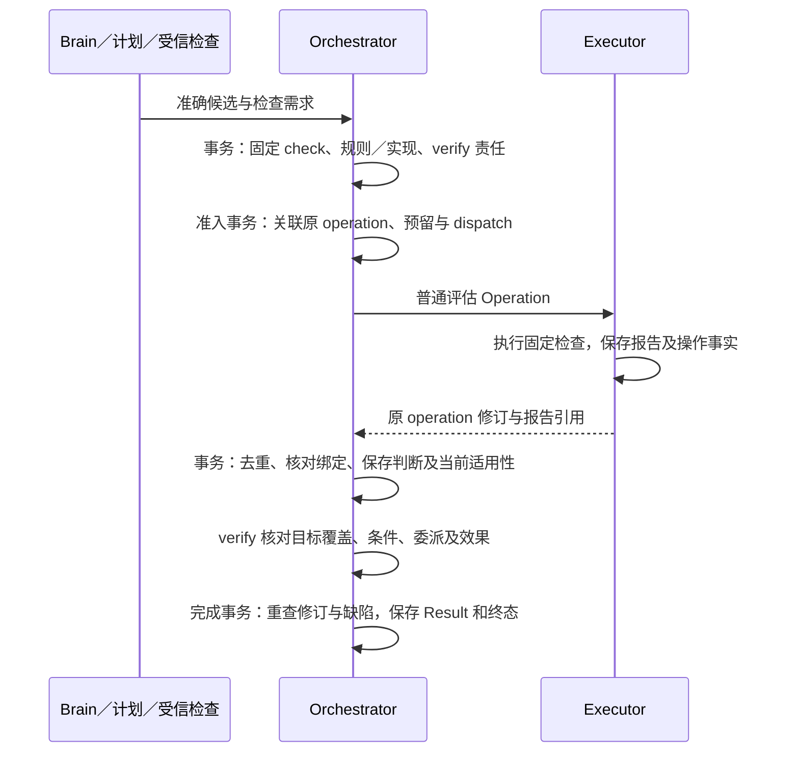

# 任务验证：条件、证据与完成

Orchestrator 只有在完整目标得到覆盖、必要条件对准确成果通过、受管目标行动封闭且效果核清后，才保存成功 Result；Executor 的效果事实、验证器的判断和任务完成分别裁决。

本篇集中定义判断规则、验证器选择、条件记录、证据适用性及完成门禁。字段以 [protocol.schema.json](contracts/schemas/protocol.schema.json) 为准；运行实现、协议开放范围和验证证据统一见 [review.md](review.md)。

## 组件与依赖

任务验证复用 Orchestrator Store、能力目录、安装锁定清单、普通 Operation 和任务级 verify job。内置确定性比较可以直接使用已有事实；新的模型评估、外部取证或工具动作都经过[普通行动准入](orchestrator.md)。

| 负责方 | 输入、输出和责任 |
| --- | --- |
| 验证器提供方 | 提供准确实现、支持规则、条件与成果范围、必需证据、结果含义、局限及反例；外部能力另声明费用、查询和有限恢复 |
| 目录与安装维护者 | 检查代码信任、输入输出和证据绑定，登记规则／实现映射并固定准确安装配置 |
| 受信评测维护者 | 保存独立样本、参考判定、用途准入证据及已证实判断缺陷；按[评测](evaluation.md)记录误判、漏判和拒判 |
| 受信批准者 | 批准准确制品、用途和目标；批准事实与实例就绪分别检查 |
| Executor | 按能力效果谓词保存原操作、目标凭据或评估报告；评估 `effect=applied` 可以对应报告 `verdict=fail` |
| Orchestrator | 固定规则与候选，选择实现，保存判断及当前适用性，独立汇总完成 |

“判断规则”规定检查什么和通过条件，“验证器”（evaluator）是实现该规则的代码或模型配置。验证器不拥有任务最终裁决权；它既可以是受信本地比较，也可以是驱动的效果映射或普通质量评估能力。

## 数据模型与状态

核验记录固定历史判断，当前适用性另存；修改目标、成果或登记缺陷都不重写“当时判断了什么”。公开 ConditionResult 是判断值，内部 check_id 用于恢复和唯一准入，不增加公共实体身份。

| 逻辑记录 | 固定输入及约束 | 当前投影／恢复用途 |
| --- | --- | --- |
| RequirementVersion | `(task, goal_revision, requirement_id)` 及准确 rule_ref、原文依据和必要性 | 当前目标的条件集合 |
| GoalCoverage | task、goal_revision、coverage_revision、完整目标、全部条件摘要、规则／实现及原报告；同输入至多一个未结束核验 | 当前覆盖选择、缺口和 verify 责任 |
| ConditionCheck | check_id、任务／目标／条件、准确 artifact／rule／evaluator、策略及安装配置，原 operation 可选 | 同条件及准确成果至多一份当前选定汇总记录；原操作关联承担发送去重 |
| ConditionResult | verdict、basis、准确成果、证据和实现；规则沿所属 RequirementVersion 定位 | 原报告和判断不可变 |
| Applicability | `usable / unknown / inapplicable` 及原因 | 只有 usable 的当前 pass 可被采用；unknown 与 inapplicable 都不能放行 |
| CompositionDependencies | 固定组合规则的原 dependency_check_ids | 有界无环，完整记录组成依据；完成及缺陷检查覆盖每个依赖 |
| EvaluatorEvidenceGate／EvidenceDefect | 每个准确 evaluator_ref 的固定门禁及单调修订，受信缺陷身份、规则／范围与依据 | 缺陷登记与完成串行，分页影响工作可恢复 |
| TaskResult／EvidenceNotice | 每任务唯一 Result、所选 coverage_revision／check_id 和门禁修订；缺陷说明另关联原结果 | 成功结果不因新账单或新缺陷修改；说明保持独立 |

一个报告的 fail 是有效质量结论，unknown 表示证据或判断不足；执行报告失败则首先是操作事实。候选换版建立新检查，目标换版即使复用原报告也要建立绑定新 goal_revision 的检查并保存复用理由。

## 关键时序

### 先固定判断，再运行检查

Orchestrator 从任务固定策略和安装配置中选择唯一实现，选择顺序不得依本次分数改变。验证器声明以准确内容版本保存，不能临时向 Capability 或 ConditionResult 添加自由字段。

1. 读取当前 Requirement 的准确 rule_ref，确认判定对象、必需证据、方法和允许的依据。
2. 固定候选 ContentRef、版本及摘要，筛选明确支持规则、条件、成果与证据范围的实现。搜索只定位，准入读取完整声明。
3. 按 TaskPolicy 预先固定的优先顺序及并列规则作唯一选择，保存依据；配置无法确定唯一选择时记录配置缺口。
4. 检查当前实例、批准与用途、已登记缺陷、控制、授权、预算和剩余次数。暂时离线等待原依赖；仅允许固定策略预先声明的不可用切换。

多个实现不同时运行后挑有利结果。需要组合判断时，规则在运行前固定各实现职责、组合算法及分歧处理，成本计入任务预算。有效 fail 不能靠换验证器、重跑同候选或改评分标签消除。

任务不追随 latest；升级创建新安装配置或规则供之后任务使用。当前任务只用固定集合中仍合法的分支，目标修订也不顺便更换策略和安装锁定清单。新要求超出集合时，记录依赖、交付部分材料或另建采用新配置的任务。

下图展示一份质量报告的责任交接；箭头表示调用或持久事实，标注事务只覆盖本地负责方。

Executor 的评估输入包含准确条件、规则、候选及获准证据，报告保存实际实现、配置和证据；模型评估另固定模型和提示配置。Orchestrator 归并时核对认证来源、任务／目标、候选摘要、规则／实现和必需证据，缺完整报告不能产生 pass。原检查关联、报告、任务修订及 verify 唤醒与事实归并共同提交。

### 完整目标覆盖

GoalCoverage 独立核对“条件集合是否充分”，ConditionResult 核对“已登记条件是否通过”；完成时两者同时成立。覆盖输入包含当前完整目标、全部 Requirement 与 source_ref，不能只采用条件提议者摘出的条款。

| 覆盖报告内容 | 规则 |
| --- | --- |
| 固定对象 | task、goal_revision、完整目标 ContentRef、条件集合摘要、准确核验规则与实现 |
| 原要求映射 | 每项已识别要求保留原文位置、关联 requirement_id、覆盖理由与缺口；允许多对多映射 |
| 核验方式 | 已登记受限模板可做确定性映射；自然语言按固定规则语义评估，不能由字段齐全或 Brain 自报推定充分 |
| 当前选择 | 保存 pass／fail／unknown 及适用性；缺报告、漏项、冲突或不适用都阻止成功 |
| 展示 | 展示原要求、条件关联、核验方式和局限；详细映射用受控内容，语义覆盖限制进入 Result.limitations |

覆盖检查使用同一 verify 和普通评估准入。TaskPolicy 固定核验规则、准确声明、唯一选择顺序及有限尝试／修订额度；开始时锁 Task，保存 coverage_revision、完整输入、待核原因及责任，再关联必要评估。恢复查同一原身份，不重新分配或调用。

例如“比较两个版本、附出处、保存报告并读回”，只登记前三项时全部 pass 仍有读回缺口；反过来，覆盖充分但写入效果未知仍不能完成。覆盖报告发现可补全遗漏后，同事务保存缺口、Task 修订、verify 和 decide；新快照携准确报告及 gaps，Brain 再补条件或提出澄清。真正改变条件依[条件先提交规则](orchestrator.md)另开目标修订；暂停保存责任，不启动新模型判断。

### 核验恢复与复用

verify 的唯一责任键为 `(tenant, task, verify, task)`，每次处理当前覆盖、条件及候选的有限集合；当前选择、适用性和任务修订与责任共同提交。新事实与旧完成竞争由[可靠工作](reliability.md)处理，不能以换 check_id 重置累计尝试、费用或期限。

| 交接 | 同时保存 | 恢复方式 |
| --- | --- | --- |
| 固定候选 | 原检查、准确绑定、缺口及 verify | 读取同一检查，必要外部评估再准入 |
| 准入评估 | check→operation、意图、预留、原命令及 dispatch | 查原 command／operation，重领不多建调用 |
| 取得报告或用户验收 | 去重事实、判断、费用变化、Task 修订与 verify | 同修订只归并一次，异内容冲突 |
| 需要新证据／新候选 | 新检查身份与旧记录关联，原任务累计限制保留 | 取得真实变化后再评估，不择优重跑 |
| 暂停／取消／失败 | 原报告、费用、效果与必要收尾 | 暂停可用既有充分证据，终态只收尾 |

复用原证据逐项检查：条件含义与规则、成果准确版本、资源与事实范围、观察时效、来源与当前用途，以及已登记缺陷均仍适用。任一项不可确定则 unknown。成果改动后，原评分只属于原版本；操作历史 applied 不因资源后改动消失，但未必满足“当前文件为该内容”的条件。

只读重取产生矛盾结果时按固定规则的来源优先级、范围和时点处理；无适用规则则保留 unknown 并补证，不能选最高分。用户验收只在固定规则允许的开放质量范围生效，客观条件变化或降低必要性需要本人修订目标；可信确认消费见[授权](authorization.md)，请求和准确正文预览见[交互](interaction.md)。

### 最终完成事务

Orchestrator 在完成事务中同时满足以下条件，再保存唯一 Result 与终态：

1. 当前目标修订一致，所选覆盖报告绑定完整当前输入、usable/pass 且没有未解决覆盖缺口。
2. 所有必要条件对最终准确成果均有当前适用 pass，固定规则、实现、策略匹配；组合检查的全部组成依据也通过缺陷门禁。
3. 受管内部子任务全部终结，外部委派证明新目标行动已封闭，本任务及委派没有未知或可能迟到的效果。
4. 当前未结集合具有完整性依据；缺陷查询、组合依赖或未结集合超限／重建未完时保留核验责任。

事务按 [Orchestrator 锁序](orchestrator.md)锁 Task、所选实现的 evidence gates、条件与其他领域行，分别读取条件、未结委派和效果；不遍历无限历史或从展示缓存证明空集合。最终保存选中 coverage_revision、check_id 集合、门禁修订、固定 Result、终态及控制／收尾责任。暂停允许该事务采用已有充分证据；新的评估不在完成事务内启动。未最终核清的纯费用可由保守预留和结算继续承担。

Result 的 completion_basis 按必要条件的最弱依据汇总：必要效果先全部核实；质量条件有用户验收则 `user_accepted`，否则有评估则 `assessed`，其余才为 `verified`。保证含义集中在本篇末节。未满足必要条件可以交付部分材料，Task 保持未成功。

### 判断缺陷进入完成门禁

普通退役、批准到期和版本升级关闭新使用；已证实判断缺陷才影响既有报告的采信。受信维护者登记准确实现／规则版本、影响范围、证据和登记身份；范围无法可靠细分时覆盖该版本的已知范围，不让模型临时解释范围放行。

缺陷登记先独占锁定该 evaluator 的固定 evidence gate，递增修订，追加不可变缺陷及分页影响责任；不在登记事务锁整批 Task。完成事务在 Task 之后按稳定实现键取共享门禁锁并直接读命中原缺陷，不能只信影响投影。不同任务的共享读兼容，缺陷登记与完成互斥。

| 事务顺序 | 结果 |
| --- | --- |
| 缺陷先提交 | 命中依据不能促成完成，即使活动任务的 applicability 尚未被扫描更新 |
| 完成先提交 | 原 Result 与终态保持；EvidenceNotice 另关联原 check／coverage 和 defect，解释依据变化 |
| 缺陷范围或查询不可确定 | 适用性 unknown，保存核验缺口 |

影响工作按有限页枚举 condition_checks、goal_coverage 及引用它们的组合记录。活动任务保存 unknown、原因和原 verify；终态保存独立说明。扫描按 Task→gate→条件→job 锁序提交进度后再确认该页，重启从原游标继续。查询说明和迟到报告归并也查原缺陷，迟到 pass 不恢复失效证据。系统不因此建立全历史自动重做或主动通知流程。

来自远端的缺陷材料通过受信登记入口认证并导入本域；普通插件或模型输出不能改证据资格。`evaluation.approval_check` 只证明启动批准，不能代替当前证据缺陷核验。更强跨域用途的前提及协议缺口见[问题清单](open-questions.md)。

## 失败处理

Orchestrator 先区分检查执行失败、有效 fail、证据不适用和目标效果未知，再保存对应责任；解决一个原因不清除其他等待。

| 情形 | 记录与后续处理 |
| --- | --- |
| 无匹配规则／实现、配置次序不完整 | 条件 unknown，记录准确缺口；合法补充后恢复，确定不支持或到期后结束目标 |
| 实现离线、批准失效 | 原合法报告独立保留；新检查等待或走策略已声明的固定切换 |
| 评估已执行但失答复 | 查原 command／operation 和报告，不另造检查收费 |
| 超时、格式损坏或报告不完整 | 记录原费用及 unknown；按有限恢复，耗尽后明确等待／补证 |
| 有效 fail | Brain 补源或修订准确候选后重评；上限耗尽则停止，不换评分标签 |
| 候选、规则或目标变化 | 原报告不变，复核复用资格或建立新检查 |
| 证据冲突且固定规则不能裁决 | unknown，按原来源补证；满意度不能覆盖客观冲突 |
| 质量通过但写入未知／子目标未封闭 | 保留效果／委派责任，拒绝 succeeded |
| 已知缺陷命中 pass | 保存原判断，当前依据不能放行；重核仍受暂停、费用和次数限制 |
| 原检查或影响扫描中断 | 依原 check／operation／游标恢复，保存下批责任后结束本批 |

## 保证与限制

完成依据说明“根据什么通过”，不把可重放、发布批准或结构合法解释成真实正确率。

| 依据／用途 | 可陈述的保证 | 前提与限制 |
| --- | --- | --- |
| `verified` | 每个必要条件有适用的确定性验证，绑定当前目标和成果 | 仅覆盖已固定客观条件；自然语言目标覆盖仍可能由语义评估完成，其方法与限制需另展示 |
| `assessed` | 必要效果已证实，开放质量按固定规则及准确实现判断通过 | 普通用途需审查规则／范围、绑定合同及典型正反例；无专项校准时不声明定量准确率 |
| `user_accepted` | 受信入口记录用户接受准确成果及可见限制 | 只接受开放质量；必要客观效果仍须核实，不扩大行动权限 |
| 高影响或额外质量保证 | 仅在固定用途的独立样本、参考依据、指标阈值、分歧处理及当前缺陷资格齐备时启用 | 缺失时禁用该用途，不降为普通 assessed 绕过要求 |
| 缺陷与完成串行 | 本域受信登记成功后，命中证据不能绕过完成门禁 | 只覆盖本地事务范围已登记缺陷，不证明远端未送达缺陷不存在 |

专项评测分别报告误判（不满足判通过）、漏判、unknown／拒判率和原因，并按适用类别、缺证与冲突分层。模型与人工一致仅在明确参考及分歧处理下有意义，一致不自动是真值。compatibility、单任务 assessed 和验证器准确性分别报告；静态 Schema 和恢复测试不能替代判断质量证据。

所有新评估受自动查询、评估次数、候选修订、总轮数、绝对期限及费用的交集约束。依赖恢复唤醒原责任，不重置累计限额。历史 Result 的缺陷说明在固定结果之外呈现，其开放接口范围见 [review.md](review.md)。

## 取舍

| 选择 | 代价 | 改选条件 |
| --- | --- | --- |
| 复用能力、安装和普通操作 | 提供方需补齐适用声明、反例与版本化证据 | 出现独立事实归属或现有生命周期无法承载时再评估独立验证服务 |
| 目标覆盖与条件通过分别核验 | 开放目标可能增加评估轮次和费用 | 对照证明更简单检查覆盖同一适用范围后替换策略 |
| 普通质量允许 assessed | 用户承担声明方法下、无统一定量正确率的限制 | 明确业务需要更强保证时用固定 TaskPolicy 收紧准入 |
| 退役与判断缺陷分开处理 | 需要受信缺陷登记、门禁及可恢复影响扫描 | 新业务要求主动重做历史结果时另定义范围、授权与成本合同 |
| 固定候选次序、保留有效 fail | 无法以多跑取优提高表面成功率，部分任务进入等待 | 组合方法有独立规则与验证证据时，在运行前固定组合再启用 |
