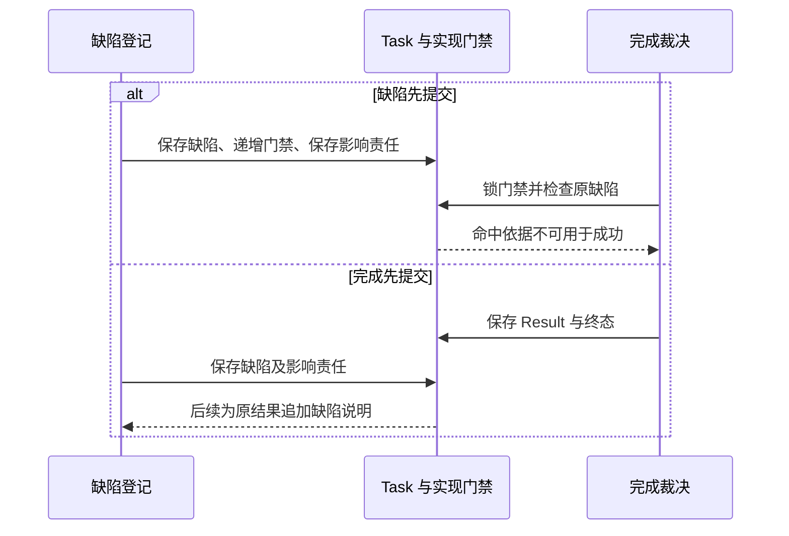

# 完成、证据与判断缺陷

[入口](README.md) · [任务推进](task-control.md) · [评测与发布](evaluation.md)

报告已经生成、评估调用已经结束、文件已经保存，分别只证明一部分工作。完成裁决需要把用户要求、实际成果和适用证据连起来。Orchestrator 负责最后裁决，验证器负责按准确规则产生某项判断。

## 先检查没有漏掉目标，再检查条件通过

Requirement 将目标展开为效果条件和质量条件。ConditionResult 判断某项条件，绑定目标修订、准确成果、规则、实现与证据范围。即使所有已登记条件都通过，也可能少登记了“读回”或“附来源”，因此另有目标覆盖记录。

覆盖输入包含完整原目标、全部条件及来源对应，不能只采用条件提议者摘出的条款。报告保留每项已识别要求的位置、对应条件、覆盖说明和缺口，固定规则、实现、配置与 coverage_revision。当前适用且 pass、无未解决缺口，才支持完成。

受限模板可以用确定规则检查映射。任意自然语言使用固定规则下的语义评估；Brain 自报“完整”或 Schema 校验通过，不构成覆盖证据。需要新的模型判断时，TaskPolicy 选择获准评估能力，以普通 Operation 保存输入、预留、派发和报告，计入原任务限额。

条件和目标实际变化后，旧覆盖报告保留历史依据，新检查重新绑定输入。含义不明时请求澄清；发现漏项时沿条件补全规则处理。用户无需逐项批准自动形成的正常条件，但降低必要性或改变目标含义必须由其明确修订。

## 三类完成依据

| 依据 | 它确认的范围 | 仍需说明的限制 |
| --- | --- | --- |
| `verified` | 每项必要条件由适用确定性检查通过 | 只覆盖固定客观条件；目标覆盖若为语义判断须单独说明 |
| `assessed` | 必要效果已核实，开放质量按固定规则和实现判断通过 | 报告方法、范围及局限；未经专项校准不宣称定量准确率 |
| `user_accepted` | 必要效果已核实，本人接受准确成果及可见限制 | 只满足允许由用户验收的质量条件，不消除未知效果 |

混合条件按必要条件中最弱的依据标记：含用户验收时为 user_accepted，否则含质量评估时为 assessed，其余为 verified。这个算法不把语义覆盖自动升级为确定性验证。

条件要求保存准确字节时，可以机械核对路径、版本和摘要；条件要求报告分析充分时，通常需要开放评估。一次评估 Operation 的效果为“报告已产生”，报告 verdict 仍可能是 fail 或 unknown。执行成功与质量通过不可互换。

## 固定选择规则，避免挑选通过结果

TaskPolicy 及任务安装配置预先限定准确检查规则和有限候选实现，按固定顺序选择。新增工具、同名新版验证器或活动配置更新，不自动进入在途 Task。目标修订超出原配置支持范围时，等待、交付部分材料或建立新任务，而不是临时换一套宽松规则。

判断结果要适用于当前目标、成果版本、资源、观察时点和覆盖范围。历史 pass 不能抵消当前有效 fail；重复调用失败评估器直到偶然通过也不能构成采用规则。只在原策略允许、输入或恢复条件确已变化时再次检查，并保留每次原身份及费用。

旧证据可复用，但要记录复用依据：条件含义和规则仍适用，准确成果与覆盖范围一致，来源当前获准，未命中当前已登记缺陷。成立时保存绑定新目标修订的核验记录，原记录不改写。

## 在一个完成事务里作出最后决定

前置报告、正文和远端事实先取得。完成事务按固定锁序锁 Task、所依赖实现门禁和当前核验记录，再执行以下判断：

1. 覆盖记录对应当前完整目标与全部条件，并且 pass。
2. 每项必要条件有准确、当前适用的通过依据。
3. 所依赖的规则和实现仍具备用途资格，没有命中的判断缺陷。
4. 本任务及委派没有未知或可能迟到的效果；内部子任务终结，外部目标行动已封闭。
5. 共同保存所选判断、Result、终态、控制传播和必要收尾责任。

完成事务中没有新的模型判断或外部取证。竞争失败后读取当前事实，再决定如何核验；旧事务前取得的结论不绕过当前门禁。费用未最终核清可以独立继续，原预留仍在。

## 验证器退役与发现判断缺陷

普通停用、到期或升级阻止新调用，不自动证明旧判断有错。可信维护者登记判断缺陷时，缺陷按规则、实现版本和适用范围匹配证据。组合判断保留全部组成依赖，不能让一个受影响的子检查藏在汇总 pass 中。

默认缺陷原事实与实现门禁在同一受信本地事务范围保存。登记事务提高门禁修订，并建立分页影响责任；完成路径直接查原缺陷，活动任务投影是否已经更新不影响门禁生效。

影响作业有界分页。活动任务撤去受影响依据并重新核验，仍遵守暂停及原预算；已经成功的任务保留 Result 和终态，追加缺陷范围及补救说明。无法准确划分影响范围时，保守覆盖已确认有问题的版本范围。

外部缺陷先经受信入口导入本域。本地串行保证不证明远端没有尚未送达的缺陷；安装批准的启动回执也不是证据当前适用性证明。需要跨域当前缺陷保证的用途，在交接、范围及时效合同齐备前不启用。

## 公共结果目前表达到哪里

Result 固定目标修订、成果引用、completion_basis、condition_results、limitations 和完成时间。目标覆盖的语义方法与限制写入 limitations，内部覆盖记录没有完整的公共结构化对应物。

所以“全部已列条件确定性通过”与“整个自然语言目标确定性满足”仍有差别。应用解释 verified 时应展示这层范围，而不能仅靠标签宣称后一种保证。

成功后缺陷说明目前由默认宿主获准诊断视图展示，`task.result` 继续返回原固定 Result。第三方协议尚未提供这套附加说明的完整查询合同。本版没有增加字段或自造接口：历史结果可查，不等于第三方已能查询当前全部证据资格。公共表达及跨域资格查询保留在[待决边界](open-boundaries.md#result-contract)。

## 质量保证如何准入

普通开放评估先固定规则、实现、配置和用途范围，并审查契约、典型正反例及缺陷处理；可以采用 assessed，专项校准缺失须明示。确定性验证另须有谓词实现、证据映射、边界与否定反例，以及目标或模拟目标验证。

高影响或额外准确性保证由 TaskPolicy 预先规定独立样本、参考依据、分歧处理、指标阈值和缺陷核验范围。证据不够时该用途关闭，不自动降为普通 assessed。模型给出分数、任务自报成功率或 JSON 合法性都不能替代独立准确性测量。

能力提供方维护声明与缺陷信息，宿主负责注册、选择和执行门禁，受信评测维护者取得独立证据，批准者核对用途资格。任务验证不要求每一项普通工作都先跑完整改善评测系统，但这些职责必须有具体承载者。
