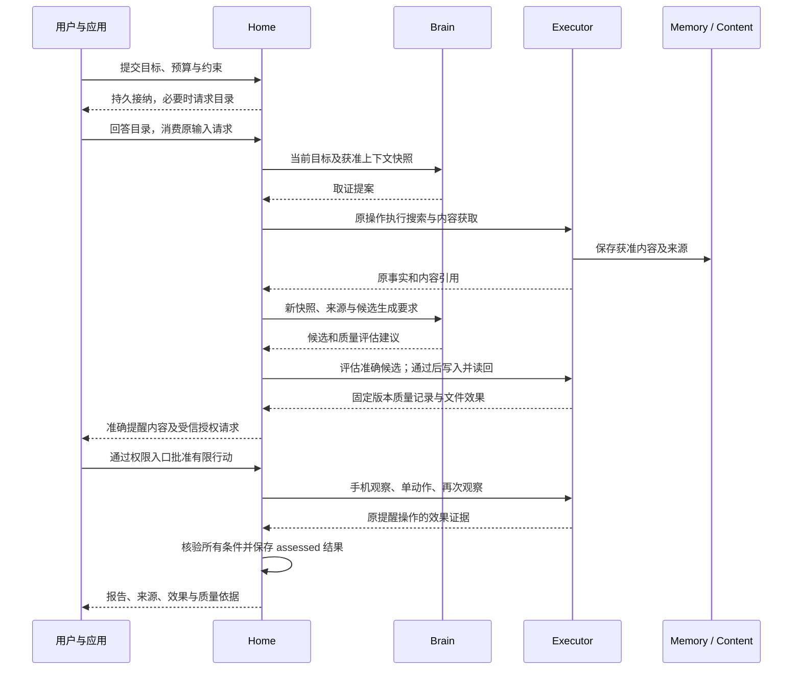

# 一次任务如何完成，以及中断后谁继续

[总览](README.md) · [任务运行时](task-runtime.md) · [验收](validation.md)

贯穿目标：“查清 A 与 B 两个软件版本的差异，附来源，保存到我指定的目录；随后在模拟手机中建立一条提醒。”例子同时包含开放质量与客观效果。它是设计推演，不表示搜索服务、模型或模拟器已经实现。

## 1. 场景装配与用户可见承诺

Home、大脑和记忆在本机；搜索经网络适配器，文件由本机 Executor 操作；模拟手机可以在另一端。用户已有读取指定来源、处理资料和写入报告目录的许可，但尚未授权创建提醒。写入目录若不明确先询问；手机行动则建立绑定准确内容的授权请求，两者分别处理。

所需能力是 search、fetch、file.write、file.read、phone.observe、phone.action，各有精确版本和可核对性声明。手机不存在或没有持久原操作记录时，任务不得默默改用“已发送操作”作为成功条件。若只有本地文件能力，仍可接纳报告部分，并明确等待或拆分尚不支持的手机目标。

| 必要条件 | 依据 | 完成判断 |
| --- | --- | --- |
| 比较准确、覆盖指定范围 | 实际获取的来源、获取时间、固定质量规则和候选答案版本 | 开放质量评估；有缺口则披露或继续取证 |
| 报告保存到准确位置 | 用户输入消费、目录规范化、候选摘要、写入和读回证据 | 文件对象及读回摘要匹配 |
| 提醒内容正确且已建立 | 当前授权、目标设备、准确文本及时间、动作前后观察、模拟器事实 | 原操作关联的状态变化通过检查 |

本任务整体最多按 assessed 完成，因为比较质量仍依赖评估。文件与手机操作必须各自得到客观证据，不能被“用户觉得答案不错”替代。

## 2. 正常主链

图中箭头表示业务交接；同本机的短事务可合并，图中省略查询权限和费用预留的重复细节。

评估器是装配时允许的具体实现；这里采用与生成步骤隔离输入的固定规则评估，并保留来源支撑记录，不声称独立模型天然无偏。评估失败时不能照常写入并标完成；若任务允许保存草稿，必须把“草稿”作为另一个明确产物及操作意图。

用户对目录的回答只是任务输入，不能顺带授予永久记忆保存；用户对手机的许可也不包含读取通讯录。任务成功后，只有用户启用了相应用途，才创建独立的记忆提取任务。提取失败不改写原成果。

## 3. 写入已发生但答复丢失

假设报告已经保存，Executor 的答复丢失，此时用户取消任务。Home 先提交 cancelled，阻止创建提醒；原文件 operation_id 和核对 job 保留。Executor 根据固定文件目标、版本条件和摘要查询原效果，发现确已写入后回传 applied 及证据。Home 更新 open_effects，不重开任务，也不删除用户文件。

文件后来被用户手工改过时，当前内容不同不证明原写入没发生。Executor 需要原操作日志或目标版本证据；没有则继续 unknown。界面提供查看原操作、补充可核验证据或结束自动核对，不能提供“视为没执行并重写”来掩盖不确定性。

## 4. 手机失联、接管和目标修订

| 变化 | 负责方与行为 | 用户可见结果 |
| --- | --- | --- |
| 提醒动作尚未接纳就失联 | Home 留下原命令，重连后按同键查询／接纳 | 明确等待设备，不创建第二个提醒操作 |
| 手机已经点击保存但答复丢失 | 手机 Executor 保存启动和核对责任；Home 查询原操作 | unknown 阻止成功，不再点击“保存” |
| 用户在手机本地接管 | 设备负责方更新控制代次，拒绝旧代次的新动作；已发生动作照实核对 | 接管本机新动作立即受阻，云界面确认可能延后 |
| 用户把目标改为只要报告 | Home 更新目标修订，撤销未启动提醒意图；已开始的提醒仍核对 | 不用新目标消除旧目标的副作用责任 |
| 远端授权已撤回而手机离线 | 设备按最后有效许可和已接受窗口判断；到期停止新行动 | 窗口内可能仍行动，不能宣称全局即时撤回 |
| 原任务 Home 失联 | 设备只完成已接纳且仍获准的有限操作 | 另一端不自动成为同任务的 Home |

## 5. 哪一刻可以说成功

任务接纳由 Home 的事务证明；Executor 接纳由原操作回执证明；效果由目标系统事实或适用观察证明；任务成功由完整条件和准确成果绑定证明；用户完整取到成果还需要内容读取成功。这五个时点可以相隔很久。

若报告质量只得到评估，最终 Result 明确标 assessed。如果用户验收取代某项质量评估，标 user_accepted，仍须完成文件及提醒效果核验。若整个任务改成“把我给定的字节保存并读回”，且全部必要条件都有机械证据，才可以标 verified。

以上正常与异常路径对应[系统测试](validation.md#scenarios)的持久接纳、未知效果、控制竞争和隐私检查。贯穿场景通过不能替代联网问答或手机 GUI 的独立质量验收。
