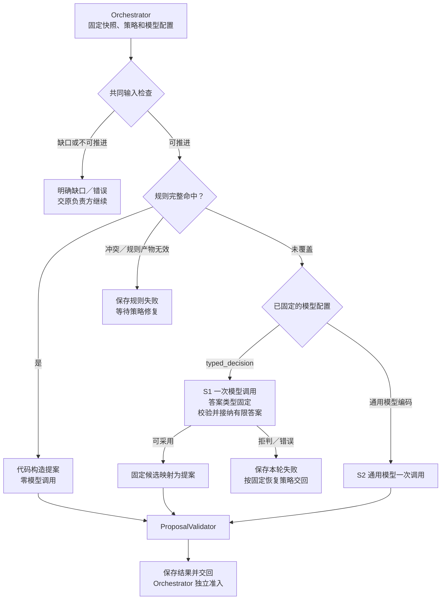
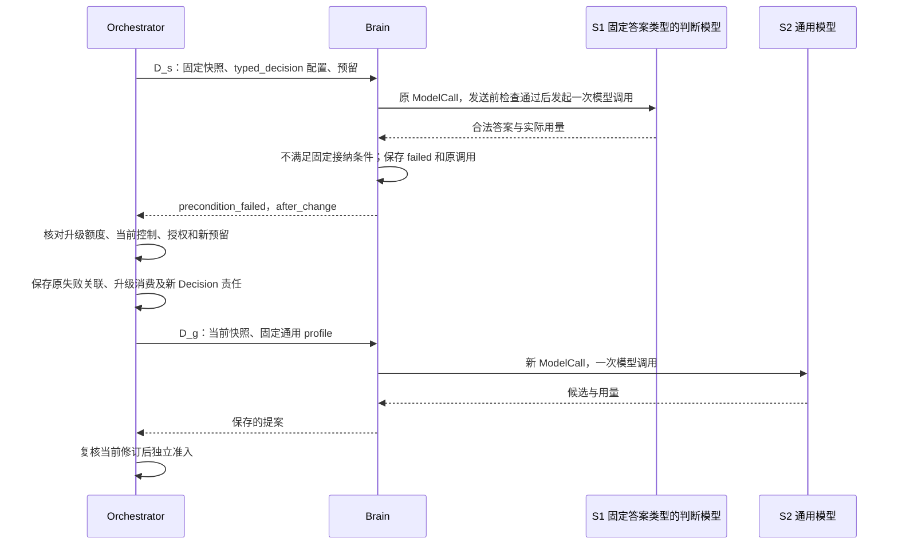

# Brain 决策路径：规则、固定答案类型的模型判断与升级

[模块主线与双系统分工](README.md#dual-system) · [实现与恢复](implementation.md) · [外部模型调研](../../../research/system-one-models-2026-09-28.md)

本文定义单轮选择、规则覆盖、固定类型答案映射及跨轮升级的完整行为。S1 包括规则快速路径和固定答案类型的模型判断两条路径，S2 使用通用模型；总体职责和任务交接见模块主线。规则命中不创建 ModelCall，任一模型路径每个 Decision 至多一次模型调用。

固定答案类型的模型路径为可选设计，按第 6 节条件完成实现、适配与评测后才启用。首个候选是规则无法处理的报告选页，选 Jev 作为托管试验后端；当前无本项目模型质量、费用或延迟实测，供应方性能证据集中在调研笔记。

## 1. 三条路径如何分工

Orchestrator（图表中记为 H）已固定输入快照和 model_profile_ref。Brain 先检查控制、未知效果、必要事实及用途授权，再尝试规则；完整命中则构造提案，未覆盖才调用已选模型，规则冲突则保存失败。未知阶段与初次开放目标的 profile 选择按[整体协作](README.md#dual-system)处理，不在 Brain 内新增一次分类调用。

下图表示一个 Decision 内互斥的产出路径。共同输入检查包括控制、未知效果、必要事实及用途授权；受限模型分支还须经过现有发送门禁。Orchestrator 的当前准入是返回后的独立步骤。

## 2. 规则快速路径的执行范围

规则读取当前固定快照，输出新的完整提案，不能重用旧目标下已失效的行动。完整命中要求目标及约束、规则和能力版本、绑定、事实适用性、动作限额同时满足。关键词、单个布尔值、模型宣称“已理解”都不足以证明覆盖任意自然语言；初次理解的约束遗漏必须纳入独立评测。

| 首批规则 | 触发依据 | 新提案及边界 |
| --- | --- | --- |
| 蓝牙 D2：观察 | 已接纳“开启绑定设备蓝牙”的完整条件，设备与观察能力准确，无额外未覆盖约束 | 构造当前设备的 observe；身份和引用来自本轮快照 |
| 蓝牙 D3：开启后观察 | 原观察确认同一设备关闭，状态版本适用，旧效果已核清且控制允许 | 构造 enable → observe_after 有限计划；启用带观察版本，后续观察等待原效果核清 |
| 报告 D2：模板搜索 | 产品、版本、官方来源及比较维度已经确定，模板覆盖全部维度 | 按产品填查询参数；域名可信性不由模型名称猜出 |
| 报告 D3：有界选页 | 受信来源范围、准确 URL、版本及材料类别可以完成确定筛选，数量符合限额 | 构造读取候选正文的独立行动；选页不证明正文支撑结论 |

蓝牙 D1 的自然语言理解保留；若条件在 D1 后更新为 g2，D1 携带的行动和计划全部丢弃，D2 只从 g2 重建。报告 D1 的条件理解、D4 的正文综合，以及独立质量／引用语义评估（原样例 O7）保留。计划实例化、引用回填和文件读回比较继续由现有代码处理。

原[调用分析与逐字段样例](../../../../.scratch/architecture-review/model-call-optimization-2026-09-28.md)给出限定 fixture 上的正常路径：蓝牙 2／3 次降为 1 次，报告 5 次降为 4 次，另命中有界选页规则时为 3 次。这些是加入独立目标覆盖门禁前的历史合成对照，不是现行方案完整任务的调用上限或实际费用结论。原报告只有四个可按规则筛选的候选，给它另加固定答案类型的判断模型没有必要。

规则未覆盖和规则错误分别处理：前者可走本轮指定模型，冲突或无效规则产物须先修复策略。错误记录及后续责任集中在[异常与升级](#43-拒判错误和升级分别处理)。

## 3. 固定答案类型的判断：以报告候选选页为例

推荐先试验规则不能完成的只读选择。例如，搜索返回多篇官方文档，域名和版本已经核实，但哪个页面更可能解释目标部署限制，需要理解摘要。固定答案类型的判断模型可以给候选评分，减少为这个局部问题生成完整规划文本的需要；其判断只决定下一批读取什么，不决定事实是否成立。

### 3.1 从固定候选到读取提案

1. Orchestrator 组装当前目标、完整比较维度、已取得搜索结果及来源，固定适用于“候选选页”阶段的模型配置。缺产品、来源或候选时，先补相应事实；不能靠评分制造候选。
2. DecisionPolicy 先尝试规则。仍需语义判断时，代码筛除不允许访问、重复或版本不符的候选，保存候选 key 到准确 URL、来源、能力参数的映射。按固定顺序和上限取本批，保存被截断及未覆盖维度；候选超限不能默认为已经搜索充分。
3. ModelAdapter 发送一次受限请求。Jev 的 `state` 带目标与候选材料；按“候选 × 比较维度”生成独立 Score 问题，每题只评该页对一个维度的预期取证价值，明确页 key、目标维度及单维等级描述。问题总数随乘积检查上限，超限则缩小本批候选并保留未处理范围，不能在同 Decision 隐式拆成多次请求。问题名只关联返回结果，**不会进入底层模型**，所以候选身份必须写入问题的 `instructions`。[Jev 请求语义](https://docs.typesafe.ai/api)
4. 同一请求的评分独立读取同一状态，问题之间不能消费答案。代码先按每维度固定接纳条件筛选，再按固定维度顺序取该维度得分最高的页面，并按候选 key 处理并列；合并去重后最多保留 `max_actions` 页。未获候选或因动作限额未选入的维度，在提案 `assumptions` 中明确仍待取证，完整 Requirement 保留不变；这只是预计取证范围，不能据分数声明某维度已核验。多个分数不是相互独立事件概率，不能相乘得出“全部可靠”。
5. 代码从映射复制 URL、准确能力和绑定、条件及证据引用，构造 `act`。`rationale` 用模板说明“依据候选相关性评分选择待取证页面”，不伪造模型解释。ProposalValidator 校验后保存，Orchestrator 复核当前修订、权限和额度，才创建读取操作。
6. Executor 取得正文后形成新的正式事实。下一轮 D4 根据真实正文综合，材料不足便补证；O7 仍独立评估准确报告版本的质量及引用语义。搜索摘要和模型分数不能代替正文支撑，也不能直接生成 ConditionResult。

一次 Jev 请求可包含同状态上的多个独立问题，但总输入、最长问题和数量均由本地配置限制；不能在其中安排“先读取网页，再判断正文”。评分结果作为模型派生判断保存，来源包含全部实际处理材料，遵守原有用途和保留规则。[State 语义](https://docs.typesafe.ai/concepts/state)、[并行问题](https://docs.typesafe.ai/patterns/fan-out)

### 3.2 适用边界

本路径只选择下一批读取内容。D1 保留完整自然语言理解，D4 保留正文与计划生成；任意设备指代、时间或附加约束不能压成固定标签。后续若试验有限意图识别，须已有受信入口或可定位的参数候选，并独立验证“未覆盖／需澄清”判断。准确设备布尔状态、状态版本复制和计划后继继续用规则。

O7 的质量与引用语义仍是独立评估操作；将来替换限定子判断须另测整套评估器漏判及替换契约，不能从选页准确率推断。授权、效果核对与完成裁决继续归原负责方，概率分数不改变其保证。

### 3.3 选型与概率接纳

首轮选 Jev 是因为它直接提供 Choice、Score、Noul 三种判断接口，便于在相同候选上测试，无需先维护自托管推理栈；这不是已证实的成本最优结论。AnyJev 的固定问题 head 更适合高频稳定问题、有领域标注及本地部署要求的场景；TypeLLM 保留生成模型及类型约束，适合作为受限输出对照。三者的机制和实验条件不同，具体证据见[路线对比](../../../research/system-one-models-2026-09-28.md#5-相邻路线不能按产品名视作等价模型)。

Jev Choice 给选项概率，Score 给有序等级的期望，Noul 给真假概率。Choice／Score 另有分布形状 `confidence`，不能当成该答案正确率；Noul 没有这个独立字段。首轮按任务定义是否采用 Score 的等级期望、分布或供应方 confidence，绑定具体题目及标注结果校准，不设置脱离验证集的统一“0.95 即安全”。[Score 定义](https://docs.typesafe.ai/primitives/score)、[Confidence 定义](https://docs.typesafe.ai/confidence)

候选全集未覆盖、所有分数不满足接纳规则或明确“均不适合”，都应允许拒判。拒判覆盖率高会增加升级成本，但强制选择会将未覆盖问题变成错误行动。已发现候选缺项不能仅靠增设一个“其他”选项声称补齐；缺事实先补事实，尚有语义选择才考虑通用模型。

## 4. 固定配置与异常处理

### 4.1 固定配置与职责

ModelProfile 的 `typed_decision` 编码及 `decision_spec_ref` 字段见[对外契约](README.md#brain-contracts)。本节定义其决策规格内容，不增加公共方法或 Proposal 类型。`decision_spec_ref` 指向安装配置中的不可变决策规格，无独立注册服务。Orchestrator 固定 profile 时同时固定其引用闭包，不能让相同 profile 运行时读取“最新版阈值”。

| 决策规格内容 | 固定规则 |
| --- | --- |
| 适用范围与候选构造 | 任务阶段、支持约束、准确能力版本、来源限制与用途授权、候选顺序及数量、截断和缺项行为 |
| 问题与模型 | 精确供应方模型版本、原语、instructions、等级／选项说明；问题模板及动态候选绑定均进入最终请求摘要 |
| 答案接纳与映射 | 每题的校准产物版本、阈值、拒判条件、并列顺序、结果到 Proposal 模板的映射 |
| 资源边界 | state、单题、总输入、问题数及响应大小上限；一次实际推理请求，不隐藏重试、修复或补充查询 |

规格覆盖、候选和答案接纳由 DecisionPolicy 判断，请求编码及供应方原始响应检查由 ModelAdapter 完成；两者职责按[软件分工](implementation.md#module-shape)装配。DecisionStore 沿原记录保存规格版本、候选映射摘要及获准诊断，调用继续复用发送和恢复流程，不新增数据表。禁止保存的原文或分数不因调试需要落库。

响应检查先验证真实模型版本、题目集合和类型，再检查有限数值、概率范围、完整选项及分布归一容差。Choice 的 choice 须与最大概率选项一致；Score 的 legend 须逐项匹配固定 criteria，等级键完整，score 位于 `[0,K−1]` 且在约定容差内等于 `Σ(i × p_i)`。容差和并列处理按供应方契约固定；未公开的 confidence 公式不自行猜测。最终候选必须仍能映射回本轮准确引用，随后接受原 ProposalValidator。它只检验契约，不证明模型选对了页面。

受信映射可构造现有 `brain-generation/1` 内部模板：只读选页不产生新正文，`contents` 为空；若规则构造新的有限计划，按既有内容发布流程保存再回填引用。模型不生成 ContentRef 摘要、Grant、金额、设备身份或未知 URL。新正文发布的失答复仍恢复原 publication，不重新推理。

### 4.2 模型调用、费用与供应方边界

本文按适配器可观测边界统计模型调用：远端模型的一次供应商请求，或本地模型的一次独立执行，分别记为一个 ModelCall。该口径包括不生成自由文本的 Jev 请求，不代表供应商内部的推理、采样或前向计算次数。一个 SDK 方法若展开成多次供应商请求，必须分别计量，不能登记成一个 ModelCall。AnyJev 的多候选旋转及 TypeLLM 的多字段请求须核对实际请求数；适配器或本地代理即使再包一层 HTTP，也不能把其发出的多个请求计为一次。不符合单次调用边界的模式不进入本版 profile。

Jev 适配器须关闭 SDK 和代理的透明重试，固定模型版本并核对返回版本；初始实验可用调研时的 `jev-1.13.0`，不以 `jev-latest` 作为冻结评估对象。HTTP 返回的输入／输出 token 按实际保留；输出当前免费不表示 output_tokens 为零，用量缺失不能填零，也不自动意味着 `usage_final=true`。[版本与限制](https://docs.typesafe.ai/models)、[SDK 与恢复缺口](../../../research/system-one-models-2026-09-28.md#4-与-harness-调用契约的适配缺口)

本次未找到服务端幂等、查询原结果、取消后结算终结或可信单次费用上界的完整公开承诺。严格预算模式下，上界未核实便不激活该 profile。估算模式须满足[资源边界](README.md#model-recovery)中的全部既有前提，不新增估算授权，也不把牌价乘输入上限视为硬上界。发送后失联且不可查原结果，沿[原模型恢复](README.md#model-recovery)结束为 `provider_result_unknown`，保留费用责任。

### 4.3 拒判、错误和升级分别处理

规则无覆盖与规则错误须区分：前者才允许按本轮固定模型配置推理；冲突规则产生不同效果、或规则产物校验失败时，保存 `failed / invalid_output`、`retry=after_change` 并省略 ModelCall。Orchestrator 保存策略依赖缺口，待负责方修复并启用新版本后以新 Decision 继续；不能用模型隐藏规则缺陷。等待超过任务期限或策略允许范围时按现有任务失败／终止规则收尾。

接纳阈值是本轮已固定的前提。合法答案未达到该前提时，使用已有 `precondition_failed / after_change`，不把它当成格式损坏。本轮只保存失败、已返回的 ModelCall 与用量，不能在相同 decision_id 内再调用通用模型。

| 情况（按先决条件顺序判断） | Brain 记录 | 后续责任 |
| --- | --- | --- |
| 控制／权限不允许，或存在未核清外部效果 | 按现有控制、`forbidden` 或原未知责任处理 | 原负责方解决，不用模型升级绕过 |
| 必要事实或能力缺失 | `need_context` 或 `context_incomplete`，新外部取证仍经正常行动 | Orchestrator 补充获准事实；依赖不可用则等待，不用升级探活 |
| 输入不在已固定 `typed_decision` 配置的支持范围，尚未发送 | `failed / unsupported / after_change`，无 ModelCall | 满足下述策略时，Orchestrator 可另建通用模型 Decision |
| 返回内容违背类型、选项、数值或版本约束 | `failed / invalid_output`，保留原调用事实 | 按既有有限修复策略另建 Decision；不适用下述正常拒判升级 |
| 返回合法，仍有语义选择，但没有可采用答案 | `failed / precondition_failed / after_change`，ModelCall 为 returned | 满足下述策略时，Orchestrator 可另建通用模型 Decision；没有可用预算便等待或收尾 |
| 可能已发送而结果不可核对 | `provider_result_unknown`，调用及费用保留未知 | 先恢复原调用；不存在“置信度低所以重试”的依据 |
| 提案已保存，但目标／控制／能力已变 | 保留原 Decision 终态，Orchestrator 拒绝原候选 | 新快照重新检查规则和配置，旧分数不能沿用到新候选 |

升级复用 Orchestrator 现有“失败后换新 Decision”的入口，所需固定策略须在启用试验前实现：依据原 profile 的 `typed_decision` 编码、上述错误码及 ModelCall 是否 returned／缺省、本次决策链的升级记录判断，禁止解析错误文案路由。只对 `unsupported` 或合法拒判允许一次定向升级，新的尝试也计入任务总轮数、期限和费用。配置不支持升级时，该 profile 不作为自动试验路径启用。

选页阶段可能尚无正式计划，升级额度不能依赖 plan_id／step_id。Orchestrator 在首次 `typed_decision` Decision 接纳前，用该 decision_id 作为本次决策链的根，随当前阶段保存内部关联；存在计划时再附步骤引用。相同目标修订、相同阶段下已有未关闭关联时，失败、补上下文、候选修订和重启均沿用它，不重置额度。只有提案已被准入并推进到读取等下一业务阶段、目标修订导致原链失效或任务终止时，才关闭该关联；仅记录失败不能重新开链。

Orchestrator 将原失败、新 Decision、链根及已消费的升级额度，与当前快照、新模型配置和调用责任共同提交；恢复时读取原关联，不能重复扣额或另建升级。`after_change` 此时指配置改为已指定通用模型并重新核验当前输入，原 Decision 不变。预算或授权不足时不得发送；任务策略允许等待则保留具体恢复条件，否则按原任务规则收尾。升级后的 S2 读取当前问题、准确候选及获准拒判诊断，原分数保留模型派生性质。S2 应给出行动、补证、澄清或失败，不将原问题改名后退回 S1；仍失败时使用原有限修复／失败机制。因目标修订使原链失效，或已经推进到新的业务阶段后，才按当前目标和阶段重新判断能否使用 S1。

下图仅表示合法拒判的升级，不代表所有错误都走此分支；结果返回但费用未结的责任继续留在原调用。

## 5. 收益怎样计算

先与规则优化后的路径比较。规则能解决时固定答案类型的判断模型增加成本；只有原本需要模型的语义选择，才有替换收益。报告 R4 的正常路径将 D3 换为固定答案类型的判断模型，仍为 4 次模型调用，只改变其中一次的模型与用量；D3 拒判后再调用通用模型变为 5 次。R3 已由规则选页，为 3 次，无须插入新模型。以上是原 fixture 的局部路径计数，包含 O7，但未包含新目标覆盖核验。现行完整任务还须计入覆盖评估、必要的重新核验及其费用；只有已登记受限模板作确定性完整映射，或已有报告对当前目标／条件仍可合法复用时，该门禁才可能零新增模型调用。不能从 D1 的自然语言理解或模型自报覆盖推定这一前提。

设该语义步骤直接用通用模型的平均成本为 `C_g`，固定答案类型的判断模型为 `C_s`，升级率为 `r`，新增整理／校准摊销成本为 `C_o`。仅在其余步骤成本及质量相同时，替换路径的粗略成本为 `C_s + r × C_g + C_o`，模型调用期望为 `1 + r`。若升级子集的通用调用更贵，必须用该子集的实际均值；后续补证、返工、错误处置和未知费用另纳入完整任务账本。自托管还计 GPU 空闲、装载、运维和标注，不能只用活跃推理时间估算。

时延按完整任务轨迹统计，包含组装、排队、持久化、网络、模型、升级及后续读取。拒判路径的串行等待可能拉高尾延迟；p95 不能由各阶段 p95 相加得出。公开 Jev／AnyJev／TypeLLM 数字只用于提出实验假设，不承诺本项目更快或降低某个百分比。

## 6. 验证、启用与后续范围

能力与 Skill 选择的诊断由实际处理组件形成：Execution 记录候选范围与 describe 后的准确绑定；Brain 记录本轮实际送入的 Skill／能力版本、所提选择和阶段；Orchestrator 记录准入或拒绝依据。缺候选、选错、需要时尚未加载、加载后无增益分别统计，不能让模型自行声称已加载某 Skill。Skill 材料的完整性见[扩展材料合同](../extensions/README.md#skill-materials)，获准诊断按[失败归因规则](../evaluation/README.md#failure-attribution)关联。

规划提示、提案粒度和 Skill 选择先固定模型作单因素对照，再测确有依据的组合；按联网问答、研究保存及有状态模拟 GUI 分层。每项都与现有规则优先路径比较，计入补上下文、拒判升级、独立核验和返工的全部轮数。少调用但漏约束不算改善，组合收益不能当作每个组件独立有效；实验规格见[组件对照](../validation/optimization-evidence.md#experiments)。

先实现可离线重放的规则和 固定类型答案映射，证明字段来源、拒判及恢复分支；再在有完整费用和用途依据的隔离环境做真实对照。比较组为当前通用路径、规则优化路径、规则加固定答案类型的 S1、规则加受限输出通用模型。按[评测设计](../evaluation/README.md)划分 dev／select／holdout，并按任务来源分组去重；公开 JevBench 只作探索，不当独立验收集。模型、题目、阈值或候选构造改变均形成新配置并重新评估。

| 验证项 | 输入或故障 | 必须观察到的结果 |
| --- | --- | --- |
| 规则与范围 | 蓝牙开／关、附加“不影响连接”、规则冲突、陈旧观察 | 只在完整覆盖时零模型；新约束不丢失，冲突不隐式调模型，旧效果继续核对 |
| 语义质量与校准 | 中文／英文、否定与指代、候选缺项、改名重排、说明冲突、注入文本 | 独立标签下统计采用后错误率、拒判率、覆盖率；Choice／Noul 按匹配标签计算 Brier／ECE，Score 按等级质量与分布校准分别报告 |
| 跨轮协作 | 条件修订、新事实与计划冲突、无进展往返、同原因误归为权限或语义问题 | 旧目标行动／计划失效；按实际问题交原负责方；候选改名不重置升级次数，任务总限额累计 |
| 全任务质量 | 完整目标覆盖、选页后真实抓取、报告综合及 O7 | 任务成功、约束遗漏、引用支撑和后续补证不因局部提速恶化；标签及评估方法先冻结，关键错判单列 |
| 一次调用边界 | SDK／代理重试、多个问题或字段、响应格式错误 | 每次底层请求可计量；本轮不多发，真实多调用模式被拒绝或另行设计 |
| 拒判升级 | 低分、支持范围变化、费用不足；H 保存升级后重启 | 原调用费用保留；新 Decision 最多消耗一次既定升级额度；重启不重复创建或发送 |
| 外部未知与取消 | 发送后丢响应、usage 缺失、取消、迟到结果与账单 | 不补零、不盲目重发；原恢复／费用责任保持，取消或过期提案不执行 |
| 配置及产出 | 返回版本漂移、问题遗漏、NaN、Score 与分布不一致、未知候选、阈值变化、保存失答复 | 固定版本与本轮映射可核对；无效输出拒绝，原 publication 恢复不再推理 |
| 成本与时延 | 同任务、相同来源与约束、匹配网络／并发条件 | 全调用、全费用及端到端 p50／p95 同口径；明确样本数、误差区间与未知账单 |

标签由领域评审者依据明确规则建立，模型生成的答案不能独自充当真值。阈值在 select 集确定后冻结，holdout 报告采用后错误率及不确定区间；任务量不足以支持错误率上界时继续收集，不把“样例全过”当可靠性证明。质量容忍度、费用目标和延迟门槛由对应任务的激活标准预先确定。

启用顺序为规则快速路径 → 报告选页隔离对照 → 限定阶段小流量；`typed_decision` 配置只在适配器、费用依据、恢复及升级策略均落实且评测通过后激活。漂移或不满足门槛时，由配置负责方停止受影响的新 `typed_decision` 决策，之后的新任务可采用已批准的规则加通用模型；活动任务仅可使用原安装锁定清单／TaskPolicy 已声明且当前合法的回退分支，否则等待或结束。在途 Decision 仍沿原版本恢复，不追改输入或清除费用。AnyJev 本地固定问题、有限意图选择和 O7 子判断属于后续单独评估范围。

以上均为待实施验证。逐轮 S2 复核若作为单独实验，记录其全部调用及增量价值；不能将双跑实验的质量与不复核路径的成本拼接为同一结论。通用子问题委派和经验进入 S1 的范围见[模块演进边界](README.md#6-验收与演进边界)。
