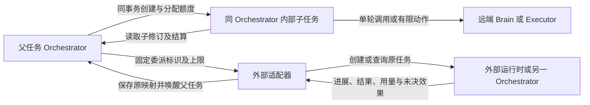
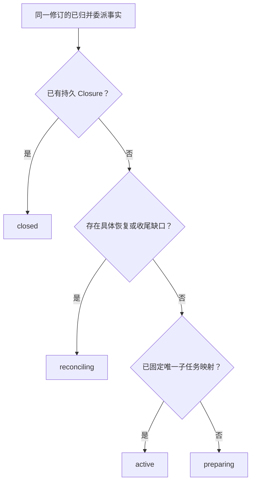

# Agent 协作与任务委派

[模块与数据 UML](../uml-models.md#collaboration) · [可编辑 UML 图册](../diagrams/uml-models.drawio)

[总览](../README.md) · [任务运行](../orchestrator/README.md) · [公共调用契约](../contracts/README.md)

协作把父任务中的一个有界目标交给 Agent，并把进展、结果、成本和仍未收束的行动交回父任务。它覆盖 C1、C5、C6、C7 及 A3、A4。内部 Agent 使用 Harness 的任务生命周期；外部 Agent 保有自己的运行时，另一 Orchestrator 管理的 Harness Agent 也按外部委派处理。

本页规定委派事实及接口。任务状态与预算归[任务运行](../orchestrator/README.md)，真实执行效果归[执行系统](../execution/README.md)。当前交付为设计；外部适配器没有证明原任务查询、权限收缩及费用边界时，不开放依赖这些保证的委派。

实现阅读：[模块结构与依赖](implementation.md#module-shape) → [可靠工作接入](implementation.md#reliable-work-integration) → [委派对象流转](implementation.md#data-flow) → [内部创建事务时序](implementation.md#key-sequence) → [生产部署和容量](implementation.md#production)。本页定义委派行为，实现篇集中规定子任务事务、外部映射、控制、封账及故障实验。

协作复用[可靠接纳与持久工作框架](../reliable-work.md)的公共模板。内部委派仍由父 Orchestrator 在同一事务创建子任务与预算；外部工作沿原创建键恢复，完成一次作业不代表子目标、效果或费用已经结清。公共模板和协作适配器均需按实现篇的故障实验验收，当前仍为设计规格。

## 1. 父子任务共用本地数据库事务

默认内部子任务与父任务共用 Orchestrator，一次短事务保存委派、子任务、预算分配及首次工作。子任务可使用远端 Brain 或 Executor，但决策与任务事实仍在原 Orchestrator。父任务直接读取本地子任务修订；无需用远端 Agent 端点回传同一库已有的事实。

另一种简单方案是让每个内部 Agent 拥有自己的 Orchestrator。这会把子任务创建、取消和预算分配都变成未知远程提交，只有独立运维或独立信任边界才值得承担；这类场景统一使用外部委派契约。代价是网络分区时父任务可能长期不能核清外部责任。委派不迁移父任务，也不让两个 Orchestrator 同时更新同一个任务。

下图中的框表示裁决与保存责任，箭头是交接。远端调用的位置不改变内部任务的 Orchestrator。

父任务把“比较两个版本的 API 变化”交给研究 Agent，可以并行继续整理输出格式。子任务产出有来源的比较材料，父任务按自己的条件核验后保存报告。子任务声称成功只提供一份输入；不能直接提交父任务成功，也不能擅自扩大读取来源和写入目录。

| 发起方 → 处理方 | 固定交接对象 | 成功依据 | 未确认时谁继续 |
| --- | --- | --- | --- |
| 父 Orchestrator → 同 Orchestrator 子任务 | delegation、受限目标、配置和 allocation | 子任务、额度分配、原回执及首 job 同事务创建 | 父按原委派查映射；无需依赖远端端点回报本地事实 |
| 父 Orchestrator → 外部适配器 | 原 delegation_id、准确目标、许可及费用上限 | 本地委派和远端发送责任已保存 | 父 Orchestrator 的 job 查询原委派；不重复分配额度 |
| 适配器 → 外部运行时 | 原创建键及收缩后的条件 | 远端原任务可查并建立唯一映射 | 适配器沿原键查询，再控制该任务；未知创建不换键重发 |
| 外部运行时 → 父 Orchestrator | 原任务修订、结果、效果及累计用量 | 原映射上的事实已保存；父完成仍独立核验 | 适配器修补遗漏和冲突；父保留未决效果及预留 |
| 父 Orchestrator → 内外部子任务 | 原控制命令及适用祖先控制 | 本地决定与逐端实际生效分别可查 | Orchestrator／适配器继续传播和核对，失联项不能报告全树已停 |

结果接收、子目标封闭、效果核清和费用封账不是同一个时点。下一节分别定义接纳与结算，控制规则随后展开；字段不再另造一组聚合“完成”状态。

## 2. 接纳、推进与结算

委派交接须能把父方条件、准确子目标／输入、配置及原创建键连到子结果版本、证据范围、未决效果、控制落实范围和累计费用。复用 Delegation、子任务原事实及 Closure 保存，咨询正文放受控引用；原生协议表达不了的部分保留 gap，不能把提供方一个 success 字段补译成全部责任关闭。父 Orchestrator 在自己的目标覆盖与条件核验中决定子结果证明了哪一部分，子结果内容、成功状态和预算关闭均不直接提交父成功。

内部委派按以下顺序处理，所有检查通过后才提交创建。

1. 核心核对父任务仍允许新目标工作，目标、材料和所选 Agent 配置均为精确版本。
2. 校验祖先链及宿主配置的最大深度、活跃子任务数、并行额度；拒绝父子循环。所有参数有上限，缺配置时不允许无限递归。
3. 以父当前许可和 Agent 声明的交集形成子任务能力范围；目标内容、Skill 或 Agent 输出不能增权。
4. 将子策略限定为只允许具可信单次费用上界的计费能力；子任务每次行动准入再核对实际绑定。仅有获准估算预算的适配器留在父任务直接调用路径，不进入当前委派契约。
5. 调用 budget.allocate，并在同一事务创建唯一 delegation_id、child_task_id、allocation_id、受限配置与首次 job。
6. 父任务按子任务修订观察进展。子终态到达后，先核对结果来源和未决效果，再按 budget.settle 结算并决定父后续工作。

预算完整规则由[任务运行](../orchestrator/README.md)定义。分给子任务的额度仍是父的承诺支出，父不得再次使用；子费用只记一次，汇总按原 allocation_id 上卷。子任务结束不自动释放全部额度，必须证明原分配已经最终结算、没有还能新增费用的调用；超时和失联都不提供这个证明。

外部委派在父 Orchestrator 先保存固定请求、额度和发送 job，适配器再发起远端创建。远端必须用委派键查询或幂等创建原任务；收到远端任务 ID 后保存唯一映射，并继续查询同一个对象。创建答复丢失时，先查询该键；没有原键查询或创建幂等能力的提供方，不允许接收有外部副作用的委派，只能作为有界咨询能力使用。

适配器接纳只是本地责任已持久化；remote_task_id 已固定才表示远端接纳。结果必须绑定远端修订、明确的成果版本、用量和未决效果。原生状态无法表达关键区别时，适配器保留 unknown 和原始证据引用，不把“请求完成”翻译为“任务效果已确认”。

目标 endpoint_id 通过已登记信任关系绑定远端身份；远端声称相同用户名或返回另一个地址，不改变接收方。向另一个 Orchestrator 委派时，远端只创建由它负责的新任务，固定 parent_delegation_id 并按该键去重；它不能直接修改父任务或使用父的剩余余额。身份和共享资源许可按[授权契约](../security/README.md)核对。

远端能力声明按每项保证选择路径：当前委派使用固定 allocation，缺可信最大费用时不接纳会计费的委派；获准估算预算仅用于没有 allocation、费用 Grant owner 与原 Task 处于同一受信本地事务范围的父任务直接调用。子任务不能从父 Task.policy_ref 推定用户已接受估算，也不能将内部接受记录跨域转述为新增授权。无原任务恢复能力禁止副作用委派；无可靠取消不用于要求立即接管的工作。咨询输出也仍需来源和披露授权。声明与实际行为不符时停用该适配器的新委派，保留已有任务的查询与真实账单责任；实际收费突破可信单次上界，或接收方违反固定 allocation 总限时，也须依可信原账单记全额、分别核验两种事故原因并停止受影响新计费，二者可以并存，不能把超额截断为 allocation 上限。
出现可信超 allocation 费用后，子／接收方先封闭新增消费、核清原调用，再以可信账单证据出具最终 Closure。父方沿原 allocation 一次结算真实用量、记录超额债务，并分别判断提供方单次上界违约与接收方分配违规（可同时成立），未知证据保持待查，停止受影响的新计费委派；证据仍缺时保留原预留和待核对责任，不能因子任务已结束便宣告费用结清。
正常封账后如收到可信的原调用上调账单，子／接收方以更高用量修订更新同一 closed 证明，并同时保存向父方唤醒核对的持久工作；父方虽已保存委派 Closure，仍按原对账作业读取当前账单并以固定结算命令只追新旧累计差额，不重开子任务或已释放额度。更正导致父预算超限时停新计费并展示追账债务；退款、贷记另行对账。

## 3. 控制不会抹去子任务事实

父暂停阻止继续创建或启动子目标工作。内部子任务准入时在同一 Orchestrator 读取祖先链控制；任一祖先暂停或已终止，就不准入新的目标工作。父暂停不改写子的 control，父恢复也不能清除子自身暂停。Orchestrator 按[有效控制规则](../orchestrator/README.md#state)更新子任务对外控制修订及传播工作，已远端接纳的子操作也受新的 TaskGate 限制；父暂停确认必须包括这些子任务启动限制的实际落实。各任务期限仍独立计时。已有证据满足完成规则时，可按任务运行规则完成；暂停不是强制冻结所有状态变化。

父取消与同 Orchestrator 子创建按事务顺序裁决：取消先提交，创建拒绝；创建先提交，取消记录同时建立子树取消责任。子任务随后保存实际取消，已启动动作仍由 Executor 核对。父取消可以先成为终态，但 open_effects 和未结费用继续展示；迟到子成功不重开父任务。

外部控制按固定 command_id 发送并查原结果。外部 Agent 不支持暂停时，父界面明确显示“外部仍可能运行”，不声称整棵任务树暂停。失联期间只能依靠预先约定的动作、费用和控制有效期约束远端；需要立即可中断的设备任务不得委派给不具备相应控制的 Agent。

`phase` 是委派查询的只读展示投影。创建、控制、效果、输入消费和费用各有原事实，关闭由持久 Closure 证明；再维护一套可写阶段会重复记录这些判断。因此按下图顺序从同一已归并修订计算 phase，业务准入和恢复直接检查原事实，不以展示值驱动工作。closed 表示委派目标与封账时已知责任已结清，不替代子任务状态；以后可信费用更正沿原 allocation 独立追账并显示当前缺口，不倒退该目标 phase。

箭头表示查询判定顺序，不表示阶段转移。具体缺口及事实来源集中定义于[投影规则](implementation.md#phase-projection)。普通运行期间费用尚未最终结算、例行查询和已确认暂停不会单独构成缺口；active 也不证明子当前正在执行。无法取得当前权威记录时返回查询不可用或明确缺口，不从空记录计算 preparing。

## 4. 权威记录与接口

共同 Command、认证身份、幂等冲突及回执 stage 见[公共契约](../contracts/README.md)。下表字段由协作模块定义；所有记录绑定认证得到的 tenant_id，ID 不承载权限。

| 对象／字段 | 约束与权威 |
| --- | --- |
| AgentDescriptor：agent_id、version、digest、kind | kind 为 internal 或 external；安装时固定，不采信模型临时声明 |
| AgentDescriptor：goal_schema、result_schema、control_support | 声明目标及结果格式、pause/cancel/query 能力；不支持项显式列出 |
| AgentDescriptor：permission_ceiling、cost_bound、adapter_version | 配置方声明允许上限及费用保证，授权仍由实际资源负责方裁决 |
| Delegation：delegation_id、parent_task_id、agent_binding、revision | parent_task_id 不变；配置绑定包括精确版本、摘要及适配器版本 |
| Delegation：goal_ref、input_refs、constraints、deadline | 精确内容引用及收缩后的约束；目标变化创建新委派，先处理旧责任 |
| Delegation：allocation_id、permission_refs、ancestor_ids | 对接预算、授权及有界祖先链；不允许把父完整凭据交给远端 |
| Delegation：child_task_id 或 remote_binding | 内部保存子 ID；外部保存 endpoint_id、remote_task_id 及创建键；二者互斥 |
| 远端创建关联：parent_delegation_id | 外部适配器发送固定 delegation_id；接收方支持本方案时以认证发送方与该 ID 为创建唯一键，不据此获得父库写权限 |
| Delegation：phase、remote_revision、control_pending | phase 按上述顺序从已归并事实派生，只读；远端修订与控制答复分别保存，不由 phase 推测 |
| Delegation：result_ref、usage_revision、effects_pending、settlement_ref | 绑定可查询的原结果、累计用量与最终结算；缺项继续核对 |

| 方法 | 业务输入与输出 | 持久成功及重启后的继续者 |
| --- | --- | --- |
| collaboration.delegate | 父任务、Agent 绑定、目标/材料、约束、额度；返回 delegation_id 与已知子映射 | 内部 applied 包含子创建；外部 applied 表示本地委派和发送责任建立。父 Orchestrator 的 job 继续交接 |
| collaboration.read | delegation_id；返回当前修订、子映射、进展、控制及结算缺口 | 只读，不把查询成功当成远端已停止 |
| collaboration.control | delegation_id、pause/resume/cancel、原因；返回固定控制决定及待确认范围 | 保存控制及后续 job 后 applied；远端尚未应用时明确 pending |
| collaboration.reconcile | delegation_id；返回已保存的核对 job 标识 | 只唤醒原映射查询，不建立新远端任务；重复调用合并工作 |
| collaboration.submit_input | delegation_id、原远端请求 ID/修订、答复引用；返回本地转交及远端消费状态 | 沿固定子命令查询或重投；扩权需求转[受信确认入口](../interaction/README.md)，普通回答不扩大许可 |

写接口不要求调用者等到任务完成。本配置的协作写方法在决定与后续责任共同保存后返回 Receipt.applied；外部创建、控制应用、效果确认和预算结清使用各自字段，不返回未登记的 Receipt.accepted。委派查询与命令回执在原责任未收束前不可清理；完整内容清理后，最小委派终结记录及唯一映射索引长期保留，旧委派标识返回 gone 而不重新创建。

## 5. 最容易出错的恢复路径

| 场景 | 处理、继续者及用户可执行动作 |
| --- | --- |
| 外部已创建，答复丢失，随后父取消 | 父保留创建键和全部预留；适配器沿原键查出任务并取消。创建核清前不返还额度、不换键重建 |
| 旧进展晚于较新终态到达 | 按提供方修订去重，保留原事实摘要；冲突进入核对，不能以本地接收时间覆盖终态 |
| 子任务成功，仍有未知写操作 | 保存候选结果但不能据此完成父任务；Executor 或外部适配器继续核对。用户可取消父任务或提供可验证材料，不能把未知改成成功 |
| 父已取消，远端后来成功 | 收取获准结果元数据、用量及效果事实，关闭原责任；不启动新的综合或保存任务 |
| 远端声称零费用，既有账务尚未知 | 只接受声明过的可信累计用量和最终结算证明；否则保留费用上界，提供账务核对入口 |
| Agent 请求读取额外私密内容 | 输入请求不携带批准；用户在受信入口决定精确许可，重新核验后继续原委派，无法满足则拒绝该步骤 |

用户界面至少允许查看原委派、重试原核对、取消和提交核验材料。没有接管权限时不提供“重建另一个任务以覆盖原任务”的快捷动作。永久失去账本时如实报告责任缺口，相关额度与副作用不能靠人工改状态消失。

局部错误与调用方动作固定为：agent_unavailable 等待已绑定提供方；agent_contract_unsupported 选择满足要求的其他候选，但先核清已发委派；delegation_conflict 读取原记录；depth_exceeded 收窄拆分；delegation_pending 沿原键查询；control_unsupported 展示实际控制边界。通用权限、额度和修订错误沿[公共契约](../contracts/README.md)处理。

## 6. 验证及实现边界

委派配置先比较单 Agent、有限独立分支并行和强顺序依赖三类任务，固定总预算、工具、模型、来源及同等初始状态。统计实际重复上下文、子创建与等待、父方汇总／核验、取消及费用核对，按每个真实完成任务的总成本和端到端时延判断；不能只保留最快完成的分支。按[组件对照](../validation/optimization-evidence.md#experiments)证实净收益后才选择性启用更多委派，不默认增加递归深度。收益不足时调整之后任务的配置，已有未知子效果仍沿原映射恢复，不能改回单 Agent 重做。

| 用例 | 前置／刺激 | 可观察结果与目标 |
| --- | --- | --- |
| CO-01 | 同一内部委派并发提交并在答复前崩溃 | 一个 child_task_id、一个 allocation_id、一次首次 job；C5、A4 |
| CO-02 | 外部创建成功后断线并取消父任务 | 重连查同一远端任务，取消及费用继续核对，无第二任务；C5、C7 |
| CO-03 | 子申请超出父许可或递归上限 | 创建拒绝且无预算转移；C6、C7 |
| CO-04 | 两份相同累计用量、旧修订进展和迟到成功 | 费用只扣一次，终态不倒退，取消父不复活；C5、C8 |
| CO-05 | 远端副作用未知而返回优质答案 | 父成果可预览，但成功门槛仍阻止提交；C1、C4 |
| CO-06 | 远端 Brain 停机但本地子事实已提交 | 父可直接消费本地事实；替换 Brain 无需改父完成规则；A2、A3 |
| CO-07 | 同一修订先后读取、创建答复未知、子终态但费用未知、Closure 保存后清理正文 | phase 由对应修订事实唯一派生；缺口优先于映射，Closure 优先于历史缺口；完整依据清理后返回 gone，不重新变成 preparing |

最大委派深度、活跃子数、轮询间隔和每用户核对并发是待测配置，必须设置有限值。控制与核对保留独立调度份额，过载时拒绝新委派，已接纳责任不丢弃。外部协议兼容性按适配器实际版本及上述用例声明，不以名称相同推定互操作通过。
