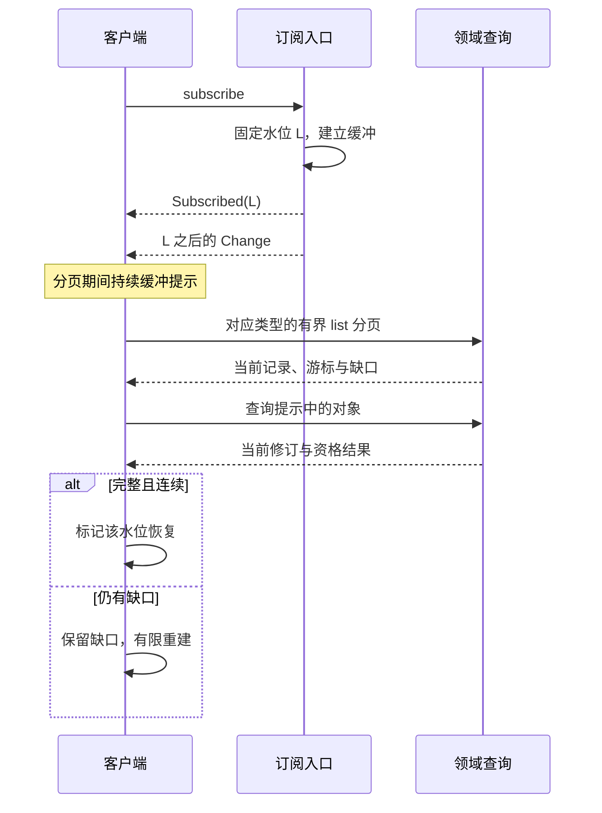

# 协议字段、方法登记与恢复一致性

[共同调用语义](README.md) · [传输配置](transport.md) · [方法查阅](methods.md) · [序列用例](examples/protocol/README.md)

本页与机器资产定义未发布的 `harness/1`、`full-harness-draft-2` 配置。当前 105 个领域方法包括预算关闭、输入读取、费用结算、可信确认，以及 Operation／Activation／Grant 集合恢复所需的三个枚举查询；当前登记无 reserved 方法。发现、WSS 双向交接、认证证明与内容字节另由传输配置规定，服务间 RPC 另由[gRPC 绑定](grpc.md)规定，不能把领域方法数量当作完整服务互操作证据。

`frozen-draft` 表示当前修订具有精确输入、输出和关联用例，仍可随未发布设计统一修订。发布时须共同冻结正文、Schema、登记及用例摘要，不能以另一份变化中的正文解释已发布消息。进程内实现使用相同对象与业务语义，不要求先编码网络报文。

## 1. 资产及实现边界

| 资产 | 权威内容 | 实际检查 |
| --- | --- | --- |
| [protocol.schema.json](schemas/protocol.schema.json) | 共同对象、全部领域输入输出、正文类型与序列容器 | JSON Schema 2020-12、日期格式及封闭业务对象 |
| [methods.json](schemas/methods.json) | 方法种类、输入输出映射、目标、条件修订、回执阶段、错误与恢复动作 | 按具体方法分派，不接受同名异义或自由字段 |
| [transport.schema.json](schemas/transport.schema.json) | 发现、WSS 帧、投递、回复、上传、去重与终态索引查询和证明载荷 | 独立结构与跨字段向量；共享对象引用领域Schema |
| [领域校验](../validation/validate_protocol.py) | 有限记录序列的身份、版本、状态及恢复关系 | 每个方法至少一项有效调用，新增方法有结构与关联反例 |
| [Brain 内部生成格式](schemas/brain-generation.schema.json)及[构造校验](../validation/validate_brain.py) | 新正文局部引用、准确保存结果及有限计划前序输出 | 宿主内部适配规格；最终 Proposal 仍须通过公共 Schema，不作为另一条领域线接口 |
| [传输校验](../validation/validate_transport.py) | 原请求／回复摘要、三类交接、内容发布及去重与终态记录 | 结构与关联校验，另运行公开密码学向量 |
| [harness.proto](harness.proto) | 服务间 Call 与 EndpointChannel 的 Protobuf 消息封装；JSON 内层复用以上 Schema | 描述符编译与消息映射检查；不等同于 gRPC 服务互操作 |
| [完成判断投影](schemas/task-outcome.schema.json) | 独立结果与效果关系 | 保持原5正例／9反例，不作为完整协议 |

这些资产可以指导两个实现交换同义数据，但没有服务、数据库或驱动。身份、许可、实际效果和来源关系的夹具是构造前提；字段合法不能证明这些前提在运行环境真实成立。安装、签发、创建界面及内容交接已经有精确方法，不再以“预先装配”替代其协议定义；部署缺少相应适配器时按所属模块拒绝或等待。

## 2. 编码与共同决定

| 对象／字段 | 精确选择 |
| --- | --- |
| 标识 | 小写类型前缀、下划线和32位十六进制随机部分；不透明、不可复用，不是凭据 |
| ComponentRef | id、三段version及digest；安装后绑定精确不可变制品 |
| ContentRef | tenant_id、owner_id、content_id、version、hash、media_type、byte_length；引用准确字节版本 |
| ObjectRef | owner_id、id、revision；定位可变对象的准确修订 |
| AuthorizationRef | kind=grant/use/offline_lease、owner_id、id、revision |
| 数值与时间 | 计数／修订／字节长度为安全整数，最大9007199254740991；金额为带单位的非负十进制字符串；时间使用UTC Z |
| Command | command_id、method、target_id、expires_at、payload；只有登记的条件更新方法携带必需expected_revision |
| Query | method、target_id、payload；没有command_id、首次接纳截止或业务持久接纳含义 |
| Receipt | command_id、stage及对应字段；业务决定固定，可按当前披露权限隐藏完整output |
| QueryResult | output、observed_at，可带resource_revision、cursor、gaps；元数据不能与输出修订矛盾 |
| Error | code、message、retry及有限辅助字段；按准确方法登记解释恢复动作 |

端云 WSS 每帧携带严格 JSON；服务间 gRPC 在 Protobuf bytes 中携带同一严格对象。Protobuf oneof、内层 Schema 与方法关联分别校验，不用二进制序列化字节重定义领域请求摘要。完整映射见[gRPC 编码约束](grpc.md#2-protobuf-与领域字段的权威)。

金额不使用浮点计算。签名与传输请求摘要使用[传输配置](transport.md)定义的JCS；拒绝重复键、非法Unicode和整数舍入。原命令请求结构在重试时保持不变，SDK不得补上新默认值、替换预期修订或升级解释版本。

每个方法的target固定为准确对象或负责服务，payload中有关联目标时两者必须一致。所有租户身份来自认证上下文；引用中的tenant只能用于核对，不能授予选择租户的能力。配对的有限预认证例外另按传输配置处理，不把夹具AuthContext当作匿名端点已经认证的证明。

### 回执与恢复

accepted必须有accepted_at，不能带decided_at或业务错误；applied必须有decided_at和该方法合法output；rejected必须有decided_at和已登记Error，不能带output。允许的阶段逐方法登记。execution.invoke的applied确认Operation及执行责任已提交，Operation.execution_state=accepted仍表示尚未跨越发送边界；Operation.effect独立描述目标效果。

当前披露允许固定回执设置redacted=true并省略整个output，不允许任意部分裁剪后逃过结构或身份检查。redacted不改变stage、原时间或原请求，也不使调用方可以重新执行原动作。

完整回执清理后，长期命令去重记录按[共同保留规则](README.md)返回gone或输入冲突，不构造新的业务rejected覆盖原applied。原方法回执查询和传输错误分别表达；取消和终态身份保持禁止重新启动。未结责任不受普通查询保留期清理。

### 按类型订阅的集合恢复

订阅的范围是当前主体在原逻辑服务上、所选类型下获准披露的完整集合，不要求客户端预先知道对象 ID。服务只声明自身负责且同时实现下表枚举与准确读取的方法；不支持的类型在 subscribe 时返回 unsupported。一个 owner 的完整枚举不表示跨 owner 全局完整，客户端对每个已登记并订阅的负责端分别保存水位和缺口；用户任务的跨来源排序、游标与完整性由[应用聚合契约](../interaction/README.md#cross-orchestrator-list)定义，不扩展单 owner `task.list` 的裁决范围。

| object_type | 集合查询及无筛选输入 | 单对象当前查询 | 集合的披露边界 |
| --- | --- | --- | --- |
| task | task.list：省略 statuses，沿 next_cursor 到末页 | task.read | 原 Orchestrator 当前获准任务，含终态；gaps 非空不能标为完整 |
| operation | execution.list：query_id、limit、cursor? | execution.get | 原 Executor 当前获准 Operation，含已关闭及效果未知记录 |
| memory | memory.list：types=[]、states=[]，沿 next_cursor | memory.inspect | 当前获准管理控制元数据，含 disabled／deleted；不授予正文读取资格 |
| surface | interaction.surface_list：app_ids=[]、task_refs=[]、include_expired=true | interaction.surface_read | 当前获准 Surface，含过期项；partial、gaps 或 unreachable_endpoints 均保留缺口 |
| activation | extensions.list：query_id、limit、cursor? | extensions.read(kind=activation) | 原安装 owner 当前获准 Activation，含 blocked／disabled；不枚举 InstallLock |
| grant | grant.list：query_id、limit、cursor? | grant.read | 原 Grant owner 当前获准 GrantRecord，含 revoked／按时间已到期；不授予许可使用资格 |

客户端先取得 Subscribed.cursor 并开始缓冲后续提示，再发起上表集合查询。领域页游标、snapshot_at 或 task.list.upper_bound 都不是订阅提示水位；尤其 created_at 上界不代表事务提交切点。客户端先合并当前集合，再处理从订阅水位起的所有提示；提示中的未知 ID 也必须按表读取，不能只刷新已知对象。各 owner 只保证自己的查询与提示覆盖，不提供跨 owner 原子快照。分页期间有缺口、权限范围改变或提示缓冲溢出时，旧集合不能被提升为完整；`task.list` 的披露范围代次变化使本来源旧页游标返回 `revision_conflict`，应用聚合游标也须重新建立。

图中的两个入口属于原负责服务的逻辑职责，查询经既有 WSS／gRPC 传递。Change 在分页期间持续到达，图仅画出一次；查询提示中的对象时也包含客户端此前未知的 ID。

execution.list、extensions.list、grant.list 复用同一个分页结构，target_id 为准确 owner_id。输入为 `{query_id,limit,cursor?}`，limit 为 1–100；输出为 `{query_id,owner_id,snapshot_at,expires_at,items,next_cursor?,exhausted,partial,gaps}`，items 分别是完整 Operation、Activation、GrantRecord。获准枚举与相应单对象查询使用同一当前披露策略，不能因列表入口降低敏感字段权限。

这三个查询在首次接纳时，以 owner 本地一致读取固定当前获准成员 ID，按 ID 字典序保存有限集合；冻结的是成员，不是记录修订。后续页返回成员的当前记录，修订升高不使其自动缺失。服务以认证的 tenant、actor、业务 sender（存在时）、owner、method、query_id、原 limit 和当前权限范围绑定查询；代理网关身份不替代业务 sender。同 query_id 原样重读首部复用原集合与期限；条件或权限范围改变返回 query_conflict，调用方先废弃旧分页再以新 query_id 枚举。游标是不可伪造的不透明集合／位置引用，跨身份、owner、方法或查询移用也拒绝，正文中的 ID 不能选择认证范围。

每页至少扫描一个未遍历位置，或以 exhausted=true 结束；单页最多扫描 1000 个位置并最多返回 limit 项，响应字节接近帧上限时提前切页，不能越过尚未返回的获准成员；单条记录仍过大则返回 quota_exceeded。空页可以带 next_cursor。next_cursor 缺席当且仅当 exhausted=true。每次发送前重新检查当前披露资格；成员已不可读或权威来源不可用时不输出其 ID，返回不含敏感标识的 gap。权限范围增减会使原集合在其剩余保留期内持续失效，后来恢复同一权限范围也不能复活旧分页；调用者单纯改错 limit 只拒绝该请求，不使原集合失效。不能仅跳过撤权项后继续声称覆盖当前集合；新可见的历史对象也要求新集合。范围未变而记录更新时直接返回当前记录。这三个输出的 gaps 只允许固定原因码 membership_limit／member_unavailable／source_unavailable，禁止自由文本与对象 ID。partial 必须与非空 gaps 同时出现；exhausted 仅表示冻结集合遍历结束。

初始上限为每集合 10000 个 ID 或 1 MiB 成员元数据先到者、10 分钟不可续期、每 tenant／actor／业务 sender／owner 合计 4 个活动集合；查询槽与集合保存于 owner 的共享存储，副本切换不依赖原进程内存。容量截断返回 partial=true、gaps 包含 membership_limit，后续页保持该标志；携带 cursor 的请求在集合到期或已清理时返回 cursor_expired。到期集合及查询槽按有界清理回收，不为只读 query_id 建永久墓碑。cursor 必须绑定内部随机集合身份及不可延长的到期信息，旧 cursor 即使碰到同 query_id 的新集合也不能续接。服务仍保留旧集合时到期请求返回 cursor_expired；旧状态已回收后，不带 cursor 的请求可建立新集合并给出新的 snapshot_at／expires_at，带旧 cursor 仍拒绝。客户端重建时使用新 query_id；收到同 query_id 但快照时间对改变的首部必须整体替换，不能接在旧分页后。每页有独立扫描／返回预算，同一主体不断更换 query_id 不重置累计预算。这里不保留跨请求数据库事务或长期 MVCC 快照；集合自身不是业务事实或新领域目录。Memory、Surface 原有更小的集合上限继续生效。

客户端只有在所有目标类型／owner 的枚举均已到末页、没有 partial／gaps／不可达端且从起始水位至处理位置的提示连续时，才可标记“在该水位已完整恢复”，不能称为不再变化的全局快照。恢复每轮最多 100 页、10000 项、60 秒；任一上限先到即保留明确缺口。暂时失联、游标失效或权限改变最多自动重新开始 2 轮，带抖动退避并共用原恢复预算；仍不足则展示来源与类型级缺口，保留已知对象的受权查询，并等待新权限／容量事实、用户刷新或正常周期状态核对。固定容量截断不立即重跑相同全量查询，不以不断重订阅制造快照风暴。

Activation.revision 是可见持久投影的独立修订；phase、ready_instance、instance_readiness、new_use_disabled 或 residual_work 等任何可见变化都在同事务递增它并写变化责任。last_observed_at 仅在真实观察被持久保存时更新，普通读取不制造新修订。generation 仍只表示活动绑定代际。extensions.read、extensions.list 与 Change.revision 对应同一个 revision；QueryResult.resource_revision 若出现也必须一致。客户端对所有带修订投影按对象保留最高值，迟到旧记录不能覆盖较新事实，同修订不同内容视为协议冲突并重新核对；提示只推进“需查询”的最高水位，不能代替尚未取得的记录。旧查询到达且低于待查询水位时继续读取；权限失效或移除以当前查询结果及缺口处理，不由修订高低重新授予展示资格。

## 3. 领域关联及正文类型

| 领域 | 必须保持的关系 | 完整机制 |
| --- | --- | --- |
| 任务与预算 | 固定 Orchestrator、原提交及操作身份；修订递增；余额与分配不重复消费，封账后才归还；列表切点有界 | [Orchestrator](../orchestrator/implementation.md) |
| Brain与计划 | 原决策固定快照及至多一次模型调用；上下文正文及有界计划都有准确结构，确定性实例化仍逐步准入 | [大脑](../brain/implementation.md) |
| 能力与资源 | 精确版本和实例绑定；resource.observe仍产生原Operation；资源代次、GUI观察和TaskGate同时有效 | [执行](../execution/implementation.md) |
| 许可与配对 | Subject来自受信身份，确认一次消费；离线租约为 open／closed／reconciled，已知使用从账本读取；单次使用与离线分配不扩大来源用途；配对回复丢失不重复发凭据 | [安全](../security/implementation.md) |
| 记忆与内容 | 实际处理输入完整继承来源；上传字节与引用一致；稳定分页、派生候选、视图确认及清理分别保存 | [记忆](../memory/implementation.md) |
| Surface与输入 | input 块只引用准确 request_ref，表单结构由业务 owner 的 InputRequestView.schema 提供；呈现意图、实际预览、排队转交与一次业务消费分别判断 | [交互](../interaction/implementation.md) |
| Agent协作 | phase 是依据同一修订事实生成的只读摘要；closed 必有持久委派关闭记录，active 必有唯一子映射；创建未知及未结责任分别保存，不换远端任务掩盖失联 | [协作](../collaboration/implementation.md) |
| 安装与批准 | 首装／兼容证据与正式改善用途区分；历史激活不变，当前实例开放重新核验；本地事务与远端回执均可表达 | [扩展](../extensions/implementation.md)、[评测](../evaluation/implementation.md) |

`evaluation.exposure_record` 的 applied 输出是 `{exposure, impact_job_id}`：原评测 owner 已共同保存暴露事实、来源组关联、唯一影响扫描 job 与原回执。job 身份不枚举受影响计划，也不证明异步失效投影或撤回已完成；正式计划、报告封存、批准与继续使用的准入仍须同步核验原暴露门禁。一个暴露可影响超过单帧列表上限的计划，不能以截断的 ID 列表定义成功。

`UseRequest`、`UseReceipt` 和 `UseSettlementRecord` 均携带不变的 cost_bound；原请求的 max_cost 在 strict 下是可信最大费用，在 estimate 下只是有限预留额。原使用的可信账单可使 `spent_cost` 高于 `reserved_cost`；final 封闭新动作使用，但供应商对同一原操作的可信更正账单可按新修订继续增加已发生费用，不复活原 once 资格、不倒回已释放额。跨 Orchestrator `RuntimeBudgetClosure.final_usage` 也可如实高于原 allocation：原父 owner 核验 `proof_ref`、原计费身份、单次可信上界及接收方分配门禁后全额入账，不能把超额都归为提供方违约。父方分别判定 `provider_bound_breach` 与 `receiver_allocation_breach`，可同时成立；`RuntimeBudgetAllocation.incident_causes` 记录已证实原因，`incident_pending` 标尚待查明的部分。Closure 不自报原因；已 settled 且累计高于 allocation 时，父输出至少含一项已证实原因或明确 pending。接收方 `closed` 后可信原账单更正可保留同一 closed_at、allocation_id、receiver_id 与 spending_closed，递增 `usage_revision` 和累计 `final_usage`；父方已 settled 的 allocation 仍可用新 `budget.settle` 命令、当前 expected_revision 与这份完整 Closure 只追记增量，已释放预留不倒流，也不重开任务或子方消费。原命令重放仍返回原回执。Schema 和构造序列只能检查身份、单位与修订，不能证明账单真伪或 TaskPolicy 的本人接受。

离线使用通过 `grant.lease.settle` 独立结算。`LeaseUsageItem` 固定原 use、operation、usage_owner_id、billing_source_kind 和 billing_ref 的 owner/id；billing_ref 指原 Decision／Operation，分别通过 brain.get／execution.get 核验；金额变化须绑定更高原账单修订。首次封账后仅允许 reconciled→reconciled 的原费用上调，保留用量、使用关闭事实、closure_ref 与首次 final_settlement_ref，不能增加 use 或再次释放余额。可信费用可超过原分配，owner 如实追差额并封闭受影响新计费；离线准入仍只允许 strict。原实例账本是唯一累计报告者，每 lease 仅一个未决 settle；同域计量源持久更新待报责任。结果未知时沿原命令恢复，期限已过且原 owner 明确 not_found 才能换 command_id；gone 或失联保留缺口。Task 按原物理计费来源核对，不能将租约账与调用账重复计入；完整规则见[离线结算](../security/implementation.md#8-离线分配重连与封账)。

`task.billing_reconcile` 的 applied 输出为 `{job_id, resource_id=原 task_id}`，只确认原结算核对责任已耐久唤醒。输入的 `source_kind` 为 brain_decision／execution_operation／grant_use／budget_allocation，`source_id` 分别指原 Decision／Operation／Use／Allocation；`usage_revision` 为原来源相应的 DecisionRecord／Operation／UseSettlementRecord／RuntimeBudgetClosure 费用事实修订，`usage_digest` 是该累计事实的规范摘要。原计费 owner 在可信上调与固定 outbox 同事务保存后发送；Orchestrator 核认证 sender、原 source→Task 绑定及同修订摘要，主动读取原权威账单再结算，不信通知金额。来源不知道 Task 当前修订，故无 expected_revision；通知答复丢失沿原命令查询或重投；原首次接纳期限过后仍未取得 JobAck，源 owner 可持久生成同一来源修订及摘要的新 command_id，原 Orchestrator 跨命令归并同一 job，不能据旧尝试超时推断未应用。旧账单经核对已被较新修订覆盖时可返回同一 job 的 no-op 回执，同修订异摘要冲突。静态用例仅验证给定来源绑定和记录一致性，不证明账单真实性、outbox 投递或后台 job 完成。

Invoke.arguments和行动模板最终参数仍按准确Capability版本、摘要及Binding对应的能力Schema检查。开放的是工具声明的参数结构，不是任意领域消息；能力Schema必须是有界、闭合且引用已固定的声明。夹具仅允许本地引用，运行安装同样须固定所有依赖，不能为校验访问任意网络。

字段之外的不可机械证明条件仍需真实实现裁决，例如来源限制的子集关系、可信用户确认、Grant是否有效、独立真值是否存在。序列容器里的已知许可、请求、批准或环境是显式测试前提；报告必须说明它们未由该静态工具自行建立。

`content.get` 保持同一查询方法，按输入分成互斥的 bytes／control 模式。省略 mode 或 mode=bytes 沿原输入返回 ContentBytesGetOutput 下载定位；mode=control 只携带准确 content_ref 与 copy_id，向当前认证 holder 返回 `{mode:control, control:ContentControl, copy:ContentCopyControl}`。后者仅供自身持有者停止／清理恢复，正文关闭后仍可查询，不含 download_id，不授予读取或保存资格。输出必须与请求模式关联，镜像读取只能采用 bytes 分支；完整字段和恢复机制见[内容接口](../memory/implementation.md#51-小元数据与大字节分开)，正反关联见[持有者控制序列](examples/protocol/55-content-holder-control.json)。

## 4. 方法覆盖

完整签名索引见[methods.md](methods.md)，逐方法错误码及可行恢复动作直接查登记表。本配置不再允许以reserved作为已列领域接口的替代；某个具体服务可以只声明自己实现的子集，但必须一并实现相应查询及恢复义务。

| 所属模块 | 严格方法数 | 查询与恢复重点 |
| --- | --- | --- |
| [brain](../brain/README.md) | 3 | 请求、输出、阶段、错误与命令与对象标识关联见方法登记 |
| [collaboration](../collaboration/README.md) | 5 | 请求、输出、阶段、错误与命令与对象标识关联见方法登记 |
| [evaluation](../evaluation/README.md) | 13 | 请求、输出、阶段、错误与命令与对象标识关联见方法登记 |
| [execution](../execution/README.md) | 15 | 请求、输出、阶段、错误与命令与对象标识关联见方法登记 |
| [extensions](../extensions/README.md) | 6 | 请求、输出、阶段、错误与命令与对象标识关联见方法登记 |
| [interaction](../interaction/README.md) | 10 | 请求、输出、阶段、错误与命令与对象标识关联见方法登记 |
| [memory](../memory/README.md) | 18 | 请求、输出、阶段、错误与命令与对象标识关联见方法登记 |
| [security](../security/README.md) | 18 | 请求、输出、阶段、错误与命令与对象标识关联见方法登记 |
| [orchestrator](../orchestrator/README.md) | 17 | 请求、输出、阶段、错误与命令与对象标识关联见方法登记 |

## 5. 从静态资产取得什么证据

正常序列保存调用方可观察的原回执、查询结果和权威前提。反例通过具体JSON路径改变身份、版本、数量、资格或阶段，每项必须命中它声称破坏的规则；仅因无关格式错误拒绝不算该语义被验证。校验器保留原40方法的回归，不以新增覆盖掩盖已有行为退化。

运行符合还须启动两个独立实现，从接纳入口产生调用，在提交前、提交后回复前、对方确认后本方记账前三处注入故障，并查验双方业务记录及目标真值。签名向量通过不证明认证系统可用；全部 105 个方法的构造序列通过也不证明事务、权限或容量成立。可复现命令与最新计数见[交付审查](../review.md)。
