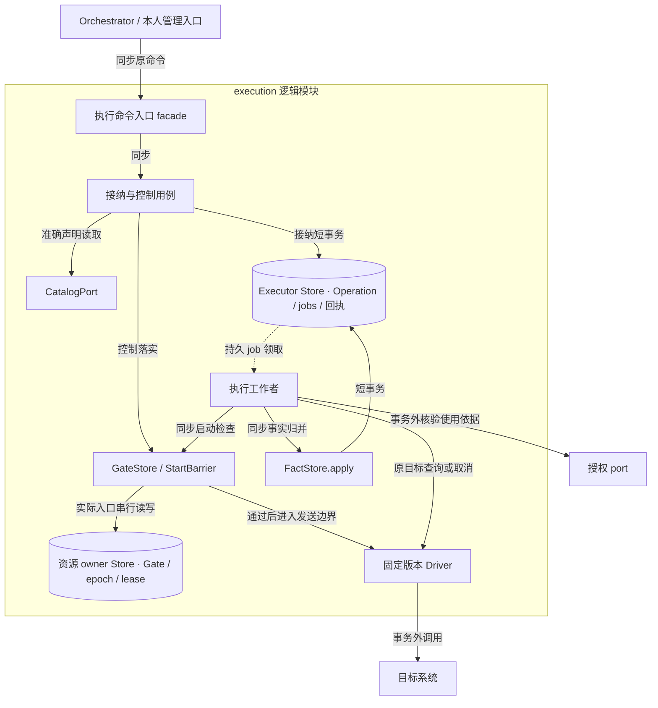
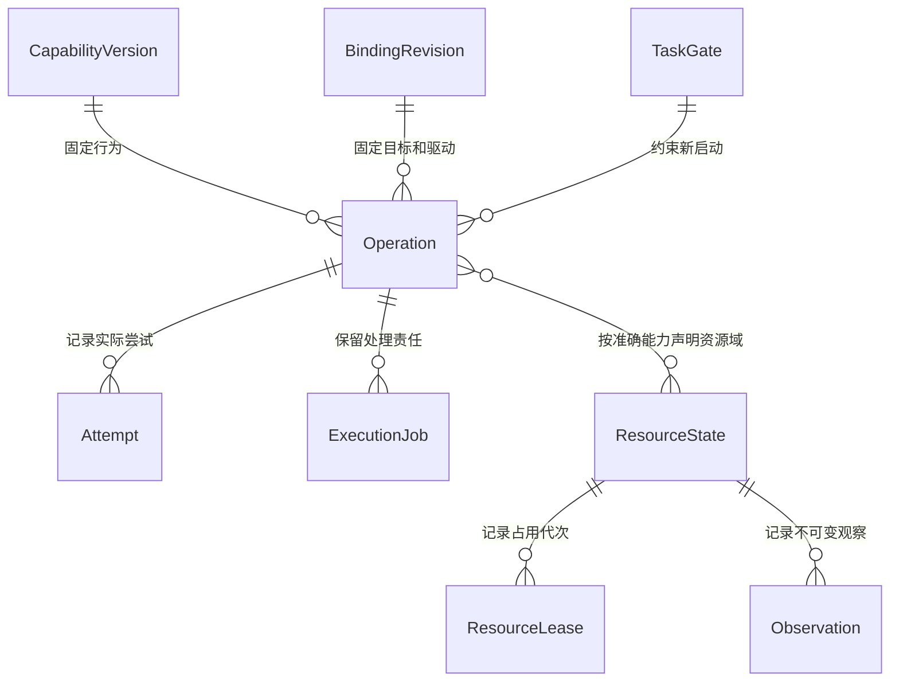
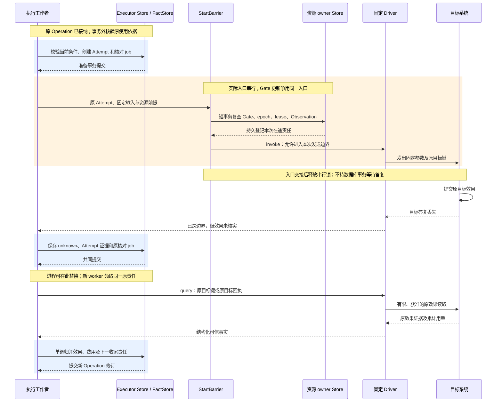
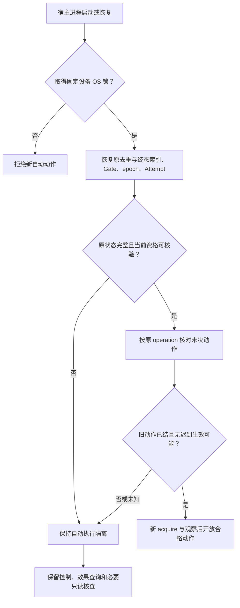

# 执行实现：原操作、发送门禁和资源 owner

[模块主线](README.md) · [任务实现](../orchestrator/implementation.md) · [授权实现](../security/implementation.md) · [线协议](../contracts/protocol.md)

本页将执行主线落为参考实现。Executor 接纳一项原操作，资源 owner 裁决实际入口，驱动提供目标效果证据。三个职责可共进程，但外部副作用总在业务提交之后；网络成功和 Receipt.applied 都不代替 Operation.effect。

参考实现支持声明完整的 API 驱动、版本化文件能力和有状态模拟手机。真实手机或任意原生不可信驱动需要各自的平台验收；缺少可验证入口、效果核对或必要权限时，按能力契约拒绝或保留未知，不能从模拟器保证推断真实平台保证。

<a id="module-shape"></a>
## 1. 模块结构与内部接口

执行模块对外 facade 是执行命令入口，承接执行、控制、目录和资源方法；内部按接纳／控制用例、执行工作者、门禁与效果规则、Store／port／Driver 适配组织。下述接口名是参考实现的职责，不是已经实现的类。宿主注入存储、授权 port 和固定版本 Driver；WSS／gRPC 处理器与具体驱动不能绕过门禁直接更新效果。



图中实线为同步调用或读写，虚线为持久 job 驱动。Executor Store 与资源 owner Store 是写权边界；默认可共库，分开部署时通过原命令和确认交接，不共同提交。资源 owner 的 StartBarrier 是发送前检查与串行控制点，也是最后一个可拒绝旧控制修订下动作的入口；目标已经接受的动作进入在途集合，此时收到取消不能报告未执行。

| 内部接口 | 固定输入 | 输出及限制 |
| --- | --- | --- |
| 执行命令入口／接纳与控制用例 | 认证主体、固定原命令、当前容量 | 路由到所属用例与原回执；不在请求栈等待目标动作完成 |
| 执行工作者 | 原 operation、工作种类和领取代次 | 调用原使用核验、启动／查询／取消与事实归并；不自创替代 operation |
| CatalogPort.describe | capability_ref、binding_ref | 完整准确声明与当前可用性；不替调用授权 |
| FinalInput.prepare（准入用例内的函数） | 候选参数、固定声明／规则、已获准材料 | 返回最后参数、规范资源及有界变换依据；无目标调用，不新增公共方法 |
| ExecutionStore.accept | 原 Invoke、认证 Orchestrator、规范化摘要 | 原 Operation 与接纳 Receipt，或固定拒绝 |
| GateStore.apply | 认证 ControlSnapshot | 最新 gate、逐入口执行修订及在途清单 |
| StartBarrier.enter | operation、attempt、TaskGate、使用依据、资源前提 | 允许进入不可撤回发送边界，或明确启动前拒绝 |
| Driver.invoke | 固定输入、attempt_id、原目标幂等键 | 目标凭据、结构化输出、已跨发送边界标记 |
| Driver.prepareRequest（驱动内的函数） | 原输入、固定映射、原 Attempt | 产生保持原语义的请求表示；没有发送权限，实际出口仍经过 StartBarrier |
| Driver.query | 原目标键／收据、有限查询权限 | 原效果证据或仍未知；不新建业务动作 |
| Driver.cancel | 原目标关联 | 尽力停止事实及能否证明不再生效 |
| FactStore.apply | 原 operation、单调修订、证据及累计用量 | 原事实与下一核对责任共同提交 |

驱动在加载时固定版本和配置摘要。Executor 不会把模型生成的 URL、请求头或任意驱动名称注入这些接口；模型只提供准确能力的业务参数。

准备、编码与结果组装在现有接纳用例、Driver 和 FactStore 内实现，可以共用函数和同一存储记录；表中函数不要求新增进程、registry、准备服务或 RPC。Orchestrator 使用的业务变换必须能在其准入前按准确声明完成；远端 Driver 无法预先说明的语义改写不能以额外内部函数之名隐藏到 Invoke 之后。

ExecutionStore.accept 封装接纳的条件事务，GateStore.apply 封装控制单调合并，FactStore.apply 封装效果和费用规则后提交；它们接入[公共接纳与工作模板](../reliable-work.md#interfaces)的受限事务参与接口而不开放任意表写权限。Store 适配器处理数据库语句，Driver 处理目标协议，领域规则只依赖它们的固定输入、证据与错误。资源 owner 和执行工作者可在同一进程，是否跨网络由资源所属位置决定，不按内部接口数量拆服务。

execution.list 由现有查询入口读取本 owner 的 Operation 仓储，复用 execution.get 的当前披露策略。共享存储中的有限 collection_queries 保存认证范围、query_id、原参数、按 ID 排序的成员、期限与位置；页读取不固定旧记录修订，也不跨请求持有事务。查询槽、扫描上限、权限变化失效、partial 与提示合并统一按[集合恢复契约](../contracts/protocol.md#collection-snapshots)实现；此表仅为临时查询状态，不增加全局目录或业务 owner。

<a id="reliable-work-integration"></a>
### 1.1 公共模板在执行域的接入

执行命令入口使用公共接纳模板；执行工作者将执行、核对、控制交接和费用交回处理器注册到有界工作模板。ExecutionStore、GateStore 和 FactStore 仍封装本域裁决，逻辑 JobStore 映射本 owner 的 execution_jobs。统一模板减少接纳失答复和责任覆盖分支的重复实现；接入代价是各 Driver 及资源 owner 必须继续提供自己的发送边界和效果证据，框架无法从领取状态推导它们。

| 接入点 | 事务参与者及保存内容 | 框架和领域的分工 |
| --- | --- | --- |
| Invoke 接纳 | ExecutionStore 锁原命令、TaskGate 和 Operation／取消索引，核验固定意图、绑定及容量 | 公共模板在 `transaction.Within` 内保存原回执，领域共同保存 Operation 和 `Raise(execute)`；新命令携相同 operation_id 仍按业务身份去重 |
| 控制与资源裁决 | GateStore 单调保存当前 gate、逐入口事实、资源占用或禁止依据 | 同库参与者共享受限 Tx；独立资源 owner 使用原命令与各自事务，Executor 的控制转交作业直到实际入口确认才完成。可同步结束的 acquire／renew／查询不空建 job |
| 启动准备与实际入口 | ExecutionStore 固定 Attempt、目标键和核对责任；StartBarrier 在资源 owner 核对最新 Gate、epoch、lease、观察有效性和时间窗口 | 工作者先在事务外取得用途依据，准备事务按领域锁序最后 `Guard` 原 Claim；事务提交后才能交实际入口。公共领取既不替代 StartBarrier，也不把两个 Store 合成跨库事务 |
| 效果和费用归并 | FactStore 按原 Operation／Attempt、可信来源与修订归并效果、迟到可能和累计用量 | 领域事实、必要 `Raise` 及 `Finish` 同事务；可信费用上调同时保存每修订 outbox，终态不抹去交回责任。独立事实入口去重接收迟到证据，但无权凭旧领取启动或结束工作 |

领取保护的事务先锁本域需要裁决的 Gate、Operation、Attempt、资源与费用行，最后锁作业记录并调用 `Guard`；各领域行内部的固定顺序由同一 Store 适配器声明，资源仍按规范化 resource_id 排序。参与同一本地事务范围内的 Orchestrator 事务时服从其统一锁序，不能先持 job 锁再调用 GateStore／FactStore。实际入口锁仅保护交接瞬间，目标网络调用不在数据库事务内等待。

责任键为 `(tenant, executor_or_resource_owner, kind, object_id)`。owner 取实际保存该责任的逻辑负责方；跨 owner 分别建自己的作业记录，通过原命令交接，不共享领取。以下内部 kind 不改变公共 Operation、Receipt 或 Gate 的字段。

| kind／object_id | 单次处理范围和操作／控制命令标识 | 领域完成／等待条件 |
| --- | --- | --- |
| execute／operation_id | 固定 Invoke 的一次启动准备及声明允许的发送；每次物理发送保留 attempt_id，目标业务键属于原 Operation | 原发送阶段已关闭，或后续查询／停止责任已持久交给 reconcile，才请求完成；缺用途、控制或入口资格时等待／确定拒绝，不借框架退避重复发送 |
| reconcile／operation_id | 一次原目标键查询、获准停止或必要效果／费用核对 | 所承担效果、迟到可能和费用均核清或已持久交接才能完成；自动额度耗尽保留未知、凭据缺口和恢复条件，原 Operation.closed 本身不足以结清 |
| control／TaskGate 与目标入口的组合键 | 当前固定控制命令和要求落实修订；各命令尝试保存原 command_id 与期限 | 取得该实际入口的落实事实才请求完成；处理中更高控制修订由 Raise 保留，不能用旧 applied 关闭新控制责任 |
| billing_handoff／operation_id | 有限页未交付费用修订；每修订保存独立 outbox 和命令尝试 | 保存本页进度且全部待交付修订已取得原 Orchestrator 的 JobAck 才完成；仍有下一页保留续页责任。答复未知查原命令，命令到期按领域规则建立同修订继任尝试 |

准备后崩溃即进入“可能已发送”核对，与 Brain 的 `prepared` 且无发送标记分支不同。恢复者读取原 Attempt 和能力重复合同后选择 query、允许的原键回放或继续 unknown，公共处理器错误不能自动触发 Driver.invoke。job 的 lease_epoch 只限制领取保护的提交；资源控制代次、TaskGate 与设备隔离仍分别约束实际入口。

公共 `Finish` 会再次判断本次 Claim 能否覆盖当前作业记录，完整规则归[公共工作提交](../reliable-work.md#completion)。本域处理器的完成结论不表示目标效果成功；具体成功与安全重试条件继续由第 3、4 节裁决。

## 2. 持久记录和并发边界

ExecutionStore 通过原 Operation 入口统一管理接纳、尝试、效果与返回内容；下表记录不要求应用逐项 CRUD 或各自提交。Attempt、Effect 和费用必须能分别表达，且终态后仍可能有核对责任。Orchestrator 的 OperationIntent 属于另一份准入事实；组合查询或同进程装配不能把两端交接伪装成跨库原子写入。

| 记录 | 必要数据 | 并发及保留约束 |
| --- | --- | --- |
| capabilities | 行为版本、摘要、完整 Schema、授权、效果与重复合同 | 版本不可原地改义；被原操作引用时保留 |
| bindings | capability_ref、目标、driver_ref、configuration_ref、availability | binding_id 与 revision 固定，停用另有当前指针 |
| operations | 原 Invoke、摘要、发送状态、效果、可能迟到、费用 | `(tenant, operation_id)` 唯一，意图不可替换 |
| operation_billing_outbox | (tenant, operation_id, revision) UNIQUE | 可信上调费用修订、原 Orchestrator／Task、固定对账命令和交付状态；操作终态仍可待交回 |
| attempts | operation、attempt_id、准备时间、发送边界、目标键和结果 | 每次实际发送独立行，原业务幂等键不变 |
| task_gates | Orchestrator、task、最高控制修订、有效控制、终态标记 | 与发送准备及实际入口串行检查 |
| gate_entrances | gate、入口、已落实修订、未决原因 | 全端 enforced 取全部必要入口的最低已落实修订 |
| operation_cancellations | Orchestrator、task、operation、原取消命令、关闭原因 | 未见 Invoke 也写入；不按 TTL 删除 |
| resource_states | resource、owner、control_epoch、人工控制、当前 lease、在途写动作集合 | owner 唯一写者；同一 GUI 资源域未核清的自动写动作阻止后续自动写入口 |
| resource_leases | lease_id、持有者及实例、epoch、修订、期限、state | 原 lease 不能换主体；过期不自动证明旧动作结束 |
| observations | 原 observation、epoch、界面修订、期限、准确截图引用 | 不可变；动作验证读取同一版本 |
| target_correlations | operation、目标关联键、可信回执引用 | 不以相似截图或自然语言描述替代唯一关联 |
| execution_jobs | [公共工作记录](../reliable-work.md#work-record)：job_id、责任键、kind、状态、due_at、work_revision、lease_epoch、lease_until、尝试与等待依据；关联原 Operation 或入口 | 本 owner 的 `(tenant, kind, object_id)` 唯一；查询、控制及效果归并有独立容量，物理表映射逻辑 JobStore |
| closed_identities | 原操作／任务身份、最小摘要、关闭修订 | 长期禁止再初始化，不保存正文 |

以下是附在原 Operation／Attempt 上的内部记录组，可与上表合并或保存为准确 Content 引用，不要求逐组建物理表。它们不增加公共 Invoke／Operation／UseRequest 的字段，也不改变现行 `intent_hash` 的计算规则；有界诊断摘要不是第二份业务意图或授权账本。

| 内部记录组 | 最小内容及作用 | 更新规则 |
| --- | --- | --- |
| 最后输入依据 | 准入使用的最后参数／准确引用、Capability／Binding、解析得到的 InstallLock／配置、规范资源和来源；有界变换顺序与规则摘要 | Operation 接纳后不变；与原 Invoke 的最后参数一致。禁止保存的原文只留获准的最小依据，不复制到 trace |
| 请求编码依据 | Attempt、固定映射版本、实际方法／目标／资源／接收方、用途、请求尺寸、原键、凭据引用与作用域；许可允许时留请求摘要或正文引用 | 每次实际请求关联原 Attempt 和内部请求位置；签名／时间等传输值可变，已准入语义不可变，秘密字节不入普通日志 |
| 原结果与覆盖 | 原 Operation／Attempt、准确结果／媒体引用、原目标凭据、Schema／映射版本、已观察范围、分页／筛选／截断、观察与获取时间、失败项及可复核限制 | 每份已保存原结果不可变；后续核对追加版本，FactStore 归并效果、费用及后续工作，不原地改旧正文 |
| 来源位置与完成位置 | 认证原任务中可用的计划／行动来源位置；本次有界收集中观察到的完成位置及各操作结果修订 | 只作诊断，不新增 owner 全局序号账本；来源位置不由完成快慢推导，跨 owner 不建立虚假的全局顺序，时间未知就保留未知 |
| 实时呈现游标 | 原对象与尝试、有界片段序号、缺片说明、已知最终结果引用 | 可丢／可重建；最终事实优先，不能作为 Effect、费用封账或任务完成依据 |

执行存储将同一任务 gate 与发送准备放入一致事务边界。共享资源入口另锁 resource_state；多个资源按规范化 resource_id 排序，不能由模型指定加锁顺序。执行工作者不在数据库事务内等待远端授权或网络答复。

资源 owner 为一个资源维护串行发送入口。门禁内读取最新本地 gate、epoch、占用和观察；只有仍满足全部条件，才把本次动作交给驱动的不可撤回入口。控制更新使用同一入口锁，所以“控制已到达但工作队列尚未消费”不会留下继续启动窗口。入口锁只串行交接瞬间；GUI 的连续动作还由持久在途写集合隔离，不能把释放短锁理解成前一动作已结束。

独立 owner 部署时，Executor 保存转交控制 job。只有 owner 确认实际入口已应用 gate，才将该入口计入 enforced；代理收到消息、入队和写入 Executor 本地 gate 都不足以确认远端门禁生效。

<a id="data-flow"></a>
### 2.1 原操作与实际尝试的对象流转

Operation 保存不可变意图和当前执行事实，Attempt 保存一次实际发送的准备及目标关联。Capability／Binding 版本决定如何解释原输入，TaskGate 和资源记录则是每次启动必须重新检查的当前控制。后两者不能被冻结为 Operation 接纳时的一次性许可。



图为持久关联：一个资源可被多个历史操作引用，不表示可以并发使用；只有需要该资源的能力建立关系。Attempt 每次发送独立，目标业务幂等键始终属于原 Operation。Observation 的截图正文在内容负责方保存，执行记录只保留准确引用及验证前提。

| 阶段 | 创建、持久化与传递 | 消费与清理依据 |
| --- | --- | --- |
| 接纳 | 接纳用例固定 Capability／Binding 与原 Invoke，事务写 Operation、原 Receipt 和 ExecutionJob | Orchestrator 取得的是执行责任；目录更新不改原意图和绑定 |
| 准备 | 执行工作者取原授权使用依据，准备事务新增 Attempt、目标关联和核对责任 | StartBarrier 使用最新 Gate、epoch、lease 和 Observation 检查本次入口；领取过期不撤销已准备 Attempt |
| 发送 | 固定 Driver 获得原参数、Attempt 和目标键，向目标传递一次声明允许的请求 | 目标回执及边界证据返回工作者；丢答复仍保留原目标关联，不另造操作 |
| 核对归并 | Driver.query／cancel 返回原效果与停止事实；FactStore.apply 提交单调效果、累计用量和下一 Job；费用上调同事务增加对账 outbox | Orchestrator 读取原 Operation 并归并；通知只唤醒查询，不能代替权威事实 |
| 关闭及清理 | 效果已核清且迟到可能消除后关闭原责任；内容按引用和用途保留 | 清理完整 Attempt／日志前保留必要证据；取消墓碑、任务终态记录和命令去重索引长期留存 |

执行结果正文与 Observation 都可能比操作元数据大得多，先以不可变内容保存再提交引用。写内容失败不能提交一项带可读取证据的 applied 效果；目标本已写成时效果依据与内容缺口分别记录，不能因截图或附件丢失抹掉真实副作用。

## 3. 从接纳到可能已经发送

接纳事务验证认证 Orchestrator、目标、准确绑定和参数，查询原 operation 及长期取消索引，然后合并不倒退的 TaskGate。新的 active gate 不能覆盖已保存的终态索引。

| 当前输入 | 接纳结果 |
| --- | --- |
| 原 operation、完全相同意图 | 返回原 Operation；新的 command 不能建立第二份执行责任 |
| 原 operation、不同意图或执行端 | idempotency_conflict，不覆盖原记录 |
| 取消墓碑命中 | 返回固定禁止事实；不建立可发送工作 |
| 终态 TaskGate 或旧目标 | 拒绝启动，保存可查原因 |
| 有效意图且容量足够 | 操作、原回执和执行 job 共同提交 |
| 存储结果无法确定 | 不伪造 accepted／not_started；调用方查询原 command_id／operation_id |

`execution.invoke` 的 Receipt.stage 为 applied 时，只表示 Operation.execution_state=accepted 的接纳事实已持久保存。接纳之后实际开始也可立即反映在返回快照，但不能把传输 Receipt.accepted 和执行状态 accepted 混作同一个枚举。

<a id="final-tool-admission"></a>
### 3.0 候选变换、最后校验与准确绑定

`FinalInput.prepare` 由原 Orchestrator 的准入用例使用受信装配调用，处理顺序固定为：读取准确能力／绑定和规则 → 完成有界模板、hook、wrapper 语义变换 → 严格校验最后参数 → 规范化实际资源及来源用途 → 固定输入与安装绑定。默认路径没有变换时仍执行后四步。准备函数只处理已经获准取得的材料；还需读取文件、向模型提问或访问目标时返回缺项，由原领域接纳相应有界工作，不把这些动作藏在纯准备函数内。

| 检查 | 内部行为 | 失败后继续 |
| --- | --- | --- |
| 变换顺序及规则 | 规则和模板来自准确安装组合；显式返回替换值，避免多个 hook 共享可变参数。限制规则数、材料与输出尺寸，留有界前后摘要 | 失败或不能取得准确变换结果时返回候选缺口；没有获准结果便不构造可派发 Operation |
| 最后 Schema | 固定方言与已解析引用闭包；按声明拒绝封闭位置的未知字段、错误类型／单位、范围和空值，不靠 SDK 宽松转换修补 | 正确重拟候选；同一原命令不能用新参数重投，错误字段不被忽略后继续发送 |
| 规范资源及用途 | 按受信 normalizer 解析准确 owner、目标版本、路径／设备、正文来源、接收方和位置；正文引用核对当前用途 | 规范化失败不放宽为通配。缺权限交 Grant owner，缺材料交其原 owner，不从 hook allow 推导许可 |
| 准确目录与安装 | 最后参数匹配准确 Capability／Binding；经 Extensions 查同一 Driver、配置及 InstallLock 的当前资格和实例 ready | 同名工具、新版本或新配置不是替代项；当前资格不可核验则等待／拒绝，不静默切换 |
| 固定与准入 | 原 Orchestrator 按最后意图核查目标条件、控制和预算，保存原 Operation／派发责任；准备诊断与原意图关联 | 条件修订先提交后重新决策，见 [ADR-0006](../../../adr/0006-adopt-requirements-before-actions.md)；不能同时沿旧条件准入 |

所需确认绑定最后规范意图。hook 改了收件人、金额或正文摘要后，原确认不能复用；原 Grant 已覆盖合法变换后的准确范围时可以照常 use，不要求仅因执行过 hook 再次确认。公开参数只包含现行 Invoke 允许的最后业务输入，安装和变换诊断由可信装配关联，不让模型自报可信规则、InstallLock 或控制快照。

Executor 收到 Invoke 后复验固定 Schema、绑定、原意图和可用性，但不重跑语义 hook 或补默认业务字段。准入后确需修改输入时交原 Orchestrator 重新形成候选：旧操作可证明未启动时先关闭旧发送责任；已有可能效果时继续原核对，不能通过修改原 Operation 绕过未知效果。原字节、摘要或诊断引用无法核对时保持缺口，不能以当前模板重新生成一份近似原输入。

### 3.1 启动准备

执行工作者在事务外取得或查询原 use_id 的授权依据，检查最后请求所需全部用途及预算依据，再进入启动准备事务。检查：任务 active/running、原目标修订、无取消索引、控制 start_before、原 deadline、使用窗口、准确绑定／安装当前资格、剩余请求及费用范围、资源占用及观察条件。任何一项不满足都不能发送。预算核验沿原 Orchestrator 准入和已固定使用单元执行，同域可共同核对，跨域使用原有有限额度／启动依据，不新增全局预算事务。

满足条件后新增 attempt_id，保存本次准备、目标关联及核对责任，再提交。接着进入资源 owner 的实际发送门禁，重新检查最新 gate、原使用依据、安装资格和实际资源条件；当前 Grant 检查遵守 [Security 的使用与撤权窗口](../security/README.md#final-tool-use)，没有跨 owner 即时撤权承诺。

```text
run_original(operation):
  load immutable intent and original target key
  obtain or query the exact bounded authorization use
  persist start preparation and attempt_id under latest task gate
  enter resource owner send barrier
  recheck latest gate, epoch, lease, observation and all time bounds
  if barrier refuses: persist provable not-started outcome
  else: call pinned driver with original key and this attempt_id
  persist target facts and usage together with next recovery work
```

准备后崩溃、门禁放行后答复丢失、驱动无法证明是否跨发送边界，都按可能已发送处理。不能因 attempts 表没有完成时间就改为 not_started。过期工作领取可重领，但新工作者只处理同一 operation 与目标键。

驱动自行重试必须关闭，或把每次物理请求完整暴露为计费与重复检查的一部分。调用库的默认重试配置不是业务幂等证明。

<a id="key-sequence"></a>
### 3.2 发送入口与丢答复核对时序

下图展开一次目标写入，固定 Driver 支持原目标键查询。蓝色区是本地数据库事务；橙色区是资源 owner 的发送临界区，其锁与控制落实共用，不能误作跨目标网络事务。



若控制在橙色临界区之前落实，StartBarrier 拒绝本次启动；之后落实则将该 Attempt 视为在途，即使驱动尚未把字节发给目标，也只关闭后续发送并继续核对。独立 owner 的入站命令和在途责任也须持久化，Executor 失联不能让它丢掉已交接动作。图中两个 Store 不构成共同事务。

目标缺少原键查询时，恢复严格采用固定能力声明的替代证据；没有可信证据则持续 unknown，不能补一条模拟成功结果。准备事务或归并事务丢提交答复时先读原 Attempt／Operation 修订；不因工作者未看到 commit 成功而重新发送。

<a id="dispatch-encoding"></a>
### 3.3 固定语义之后的驱动编码与真实出口

`Driver.prepareRequest` 只执行已绑定的协议映射：方法、路径模板、参数位置、数值单位、日期／空值编码、正文和响应选择器均由准确版本决定。业务默认值、收件人替换、自动补偿或隐含新动作应在候选阶段处理，不能借编码补进已准入 Operation。运行时签名、时间和凭据可按原作用域生成，其变化不能改变业务参数、资源、接收方或用途；恢复时不要求重用过期签名，但仍核对原意图和准确映射。

这是默认驱动内部的函数，不是新增公共 Driver SDK 方法。第三方仍沿既有 invoke／query／cancel 接入，由已验证的宿主包装及实际出口实施同等核查；无法验证完整出口时不开放相关能力，而不是要求调用方学习第二套编码协议。

| 顺序 | 内部处理与保存 | 不允许的出口 |
| --- | --- | --- |
| 1：编码 | 从原 Invoke／准确 Content 和固定安装映射产生请求表示，计算实际尺寸并关联原 Attempt；保留获准的最小编码依据 | 编码函数不发目标请求，不执行未声明网络探测、工具、模型或子 Agent 调用 |
| 2：核查完整请求 | 校验完整路径、查询、正文、附加字段和接收方与原意图等价；受信凭据入口核查凭据作用域。记录所有声明内的请求种类及剩余物理请求／字节／费用范围 | 不能只验主参数，再由 wrapper 附加日志、正文、回调地址或另一个业务动作 |
| 3：耐久准备和实际门禁 | 原 Attempt、目标关联和核对责任耐久提交；实际入口重查 TaskGate、原 use、当前已知撤权、安装资格、资源身份及有限窗口 | 领取成功、准备函数返回或存储接纳都不能触发发送；提交未知先查原记录 |
| 4：受控发送 | 只有通过门禁的请求表示进入目标驱动；每次物理请求关联原 Operation／Attempt 及内部请求位置，记录已知发送边界与实际用量 | 透明重试、额外写请求、另一个目标键或无限轮询不得从驱动内部绕过重复与预算规则 |
| 5：后续页／下载／核对 | 仅按固定映射解析目标返回的游标或引用；每次请求重新核对实际目标、用途、窗口及剩余限额，保存有限进度 | 未声明域名、重定向接收方或附件不能因出现在合法响应中自动获得权限 |

目标解析和网络连接核对同一经过验证的地址范围，避免“先检查 DNS，随后另一次解析换到越界地址”；每次重定向重新规范化并检查目标、协议和凭据交付范围。文件入口继续采用受控根句柄解析。无法证明这些实际入口检查的 Driver 不进入相应 ready 能力；这项准入前提由[Extensions](../extensions/README.md)与[平台安全验收](../security/README.md#boundary-validation)提供，不从进程或 VM 名称推断隔离。

有限分页、下载或轮询可以属于一个声明的有界动作，但其全部物理请求都计入上限和费用，不能只计算最外层 invoke。再次发送目标动作按原 Attempt／重试规则建立依据；只读子请求保留内部位置和观察范围，不能伪装为已核清的原动作重发。达到任一上限就停止新增请求并形成部分覆盖或未知依据，所需继续工作由原 owner 保存，不能自行扩大预留。

准备后崩溃沿原 Attempt 恢复。已准备但无法证明未交给入口时仍可能已发送；编码错误若在任何发送准备／交接之前被可靠阻断，可记录确定未启动。入口已经交接后发现字段或目标不符，先停止后续出口，保存真实已发生或未知事实及异常，不伪造“校验失败所以什么都没发生”。核对只使用保留的原版本受限路径，不能装载当前同名 wrapper 重做原动作。

## 4. 效果归并及重试算法

Operation 的发送状态和效果独立。发送关闭后，effects 仍可能 unknown 或 may_apply_later=true。下表给出事实合并的允许边界；完整状态含义仍归[主线](README.md)。

| 已知事实 | 新输入 | 归并结果 |
| --- | --- | --- |
| not_started | 跨发送边界证据或无法判定发送 | unknown；保存原尝试 |
| unknown | 能绑定原操作的目标效果凭据 | applied，保存证据版本 |
| unknown | 确证未生效且不会迟到 | not_applied，may_apply_later=false |
| applied | 后续资源被用户修改 | 保留历史 applied；另存新资源观察 |
| closed | 建议重新发送目标动作 | 拒绝；允许原效果查询与必要收尾 |
| 任意状态 | 较旧事实修订 | 不覆盖当前投影，保留可审计引用 |

发生失败时先判断发送边界，再检查目标凭据和查询能力，最后应用效果类型的重复策略。不能根据 HTTP 5xx、连接超时或“当前未查到”跳过前两步。

只读能力在剩余授权、期限和预算内有限重取。目标幂等能力先查原键，只有固定键作用域、保留期、相同参数和回放保证仍成立时才原键重放。无幂等保证的能力只有明确 not_applied 且不会迟到时，才允许仍开放的原操作获准重试。

同一意图换 API、GUI、驱动或执行端都属于新行动。Orchestrator 必须取得不会重复原效果的依据；Executor 不能自行把 unknown 转移给另一设备。补偿也有新的操作、预算和授权，不隐藏在 cancel 内。

核对 job 每次执行一个有界查询，按能力声明退避，受绝对核对期限和专属预算约束。耗尽自动额度后保留原不确定事实，等待可读目标凭据、恢复事件或受信的一次核查；停止自动高频查询不删除迟到事实入口。

可信费用上调沿原 Operation 增加修订，不能因 execution_state=closed、usage_final 曾为 true 或原 Task 终态而舍弃。在保存更高累计费用的 FactStore 事务中，按 `(operation_id, Operation.revision)` 唯一持久保存交回 outbox 及首次有限期限的 command_id，使用原 Invoke 固定的 orchestrator_id、task_id 调用 `task.billing_reconcile`，携带 `source_kind=execution_operation`、原 operation_id、该修订及 usage_digest。交回 worker 只发送唤醒，不以通知金额改 Task 账；答复未知先查询或在原期限内重投同一命令；原尝试到期仍未获 JobAck 时，保留其审计身份并为同一来源修订和摘要保存新 command_id 的后继尝试。原 Orchestrator 按来源修订业务键返回同一 JobAck，即使旧尝试已经应用也不双扣；只有取得其持久保存原 settle 作业的 JobAck 后完成交付。重启扫描全部未获 JobAck 的 outbox，不按旧核对 job 的 done 或操作终态过滤。Orchestrator 主动读原 `execution.get`，核验原 Task／Operation 绑定与准入时固定的唯一计费来源；同一物理收费的 Grant use、Brain 等投影只留证，不重复扣预算。原目标动作与已释放授权数值不因账单更正重新开放。
每个上调修订保留独立 outbox 行；每次命令尝试固定 ID、载荷和期限，旧尝试保留在原命令记录中，r2 不覆盖未获 JobAck 的 r1。原 Orchestrator 收到 r1 时可主动读到 r2 并先归并较新累计额；以后 r1／r2 迟到或重投按已持久的最高来源修订确认，只有同一修订不同摘要才冲突。完整 Attempt 可按原清理规则回收，但原 Operation 的计费身份、累计账、已交回修订及供应商更正关联须保留至可验证的账单更正期限结束；没有该期限时保留最小计费账本与查询入口，不能靠终态压缩切断上述 outbox。

## 5. TaskGate、控制刷新和长期禁止索引

Gate 只接受更高 control_revision；同修订同内容幂等，同修订异内容冲突。目标修订不可倒退，终态身份不可恢复。较低控制返回当前事实，不把旧 pause 重新施加到新 resume 上。

同 gate 修订的新控制凭据可以更新 issued_at／start_before，但不能改 gate、原 Invoke、操作 deadline 或授权使用。原 command 重投必须返回原窗口；需要刷新时 Orchestrator 建立独立固定命令。

整端 ControlReceipt 的 entrances 是当前受控入口集合。安装新入口前先落实当前 gate；未完成时不可接目标工作。移除入口前证明它已封闭且不会继续发送，再从集合移除，不能靠删行抬高 enforced。

### 5.1 取消先到与清理

未知 operation 的取消必须创建最小取消墓碑。此时执行端没有原 Invoke，不能推算其最晚启动或重投时间；取消墓碑不得按固定 TTL 删除，也不能被 task.resume 清除。

完整取消记录与正文按策略清理后，最小索引仍保留原 Orchestrator、task、operation、取消依据和必要摘要。迟到 Invoke 命中后返回 gone 或固定禁止事实，不产生新的可发送操作；更改字段也不能复用该 operation_id 启动。

TaskGate 终态同样压缩为长期任务终态索引。只有原任务从未登记、没有任务终态索引且认证控制有效时，才允许初次初始化；索引不可用、从旧备份恢复或存储损坏时，先关闭自动行动并核对原权威。

完整原回执已清理后的查询是 gone，不是另一份业务 rejected Receipt。索引还保存请求摘要时，同 ID 异请求返回 idempotency_conflict。统一查询协议编码格式见[共同契约](../contracts/README.md)。

## 6. 能力目录与 API 驱动装配

<a id="catalog-conformance"></a>
目录接入验收同时检查“是否有这个成员”和“本次是否可用”：按认证可见范围解析精确 capability 与 binding，核对提供方命名空间、Schema 引用闭包和实例状态，再由原准入与发送门禁判定。虚构 ID、跨提供方同名能力、旧绑定和参数合法但目标不符分别保留反例；前者不能落到模糊匹配的另一个工具。固定绑定独立有效时目录搜索不可达不必停用它；描述、当前资格或真实驱动无法核对时才等待相应依赖。大目录基线按[语义操作计数](../validation/README.md#metrics)报告召回、选对、准入及实际效果，不能把 Schema 通过率当业务正确率。

目录将声明与绑定分开。Capability 固定业务语义、输入输出 Schema、效果类型、验证、重复、授权和限额；Binding 固定执行端、准确目标、驱动与配置。搜索结果只包含候选引用和简短说明，描述查询返回完整固定版本。

| 冻结对象 | 实现必须检查的字段 |
| --- | --- |
| Capability | capability_id、version、digest、semantic_operation_id、description、input_schema、output_schema、effect_class |
| verification | predicate_ref、evidence_kinds、query_supported、cancel_supported、可选 not_applied_rule_ref |
| retry | max_attempts、initial_backoff_ms、max_backoff_ms、reconciliation_timeout_ms；幂等类必须有 key_scope、key_retention_ms、replay_guarantee_ref |
| authorization | resource_scopes、actions、purposes、requires_lease、requires_confirmation |
| limits | max_duration_ms、max_input_bytes、max_output_bytes、max_physical_requests、cost_bound、max_cost、mutex_domains |
| Binding | binding_id、revision、capability_ref、executor_id、target_ref、driver_ref、configuration_ref、availability |

`cost_bound=strict` 表示可信上限；estimate 的 max_cost 只是本次预留估算额，仅当原 Orchestrator 与费用 Grant owner 在同一受信本地事务范围内、可直接核验原 Task 内部的用户接受记录，且全部必需 Grant 无该费用单位硬 limit 时启用。执行端固定原 Capability／Binding 与 operation_id，Grant owner 通过受信原操作而非 UseRequest 自报核验模式；公开 policy_ref、跨域缓存或仅有在线连接均不能证明同意，缺少同域核验时 strict-only。固定跨 Orchestrator allocation 和离线租约不使用 estimate。实际费用超估算仍按原 use 上报，停止同范围新计费，不把超额改写成其他操作的费用。Capability 声明只是接入者的受信合同，必须有目标测试证据，不能从 JSON 合法性推导保证兑现。

接入流水线从已固定的 OpenAPI 基线生成参数映射，由接入者补充业务副作用、幂等键、查原效果和授权声明。安装先解析全部 Schema 依赖，固定其摘要，验证请求与响应样本，再生成候选索引；未补完业务合同的 API 不进入可执行目录。

Schema 的内容本身是 JSON Schema 文档，因此保留其标准词汇表达能力；安装校验必须验证声明方言与可解析引用。协议夹具只接受本地已解析引用，且参数根对象关闭未知字段。SDK 与服务都使用同一固定能力版本继续验证 arguments。

`capability.search` 以认证可見范围、规范化资源范围和查询文本筛选，分页最多取请求 limit。游标绑定查询及身份，扫描超限给 gaps；搜索失败时已经固定的准确绑定可独立使用。`capability.describe` 不把 disabled 改为 ready，也不自动返回替代版本。

实际 HTTP 编码在驱动中固定方法、路径模板、参数位置、单位、空值、分页、响应选择器和网络范围。凭据在执行位置注入；重定向和下载仍逐项受目标和字节上限约束。返回文本只作为业务数据，不能改变 TaskGate 或发出额外调用。

默认受管文件驱动使用现有 Capability／Binding 和 `execution.invoke`，不新增通用文件 RPC。Binding 指向一个租户专属、由单一受信文件 owner 管理的受控根；OS 权限或隔离须排除其他进程写入及根内外硬链接别名，已有目标的链接数不能证明唯一时拒绝受管写入。路径参数被受信规范化器转换为根内相对段和准确资源身份，作为原 intent_hash 的一部分。读取和写入均从根目录句柄逐段以不跟随符号链接的方式打开；实际入口重新验证句柄所属根、文件身份和当前 Grant，不能在授权后再按未经验证的字符串路径打开。平台若无法验证这种句柄相对访问或无法排除其他写者，不启用该根的可恢复写保证。

文件读取从已打开的同一文件句柄按字节上限读取，记录前后身份、大小及内容摘要；变化无法稳定判定时返回 `unknown` 或需重读，不把混合字节当一份准确版本。需要 ContentRef 的能力在获准保存期限内把实际读得字节提交给内容 owner 后才返回引用；缺少该保存用途时拒绝这种输出，不凭路径或摘要伪造正文。

文件写入的原 Operation 固定目标相对路径、预期版本／不存在条件、来源 ContentRef、输入摘要和驱动版本。文件 owner 跨 Executor 副本对该路径只开放一个未决写者：先持久保存含 operation_id、attempt_id、旧文件身份／版本、目标摘要和临时文件名的 journal；同目录独占创建临时文件，完整写入、校验并持久化，再把取得的临时文件身份写入 journal 并持久化。在文件 owner 的同一入口锁内重新核验当前控制、来源使用及预期目标版本，然后以该路径句柄执行同文件系统原子替换并持久化父目录；单独的 `rename` 不提供版本比较。未持久记录临时文件身份前不能替换目标；若此时崩溃，原 journal 仅用于清理未提交的临时文件。只有目录与原目标证据持久后，才把原效果归并为 applied；版本冲突在跨发送边界前记录 `not_applied`，不能覆盖另一写者。路径独占与 journal 在结果核清前持续保存，不能因 worker lease 到期自动解除。

替换后答复或进程丢失，恢复者先隔离原本地发送者，锁同一路径并查 journal、临时文件身份、目标当前身份／摘要和目录持久状态。目标仍为旧版本且原发送者已不能再替换时，可确认本次未生效；目标身份就是记录的临时文件且摘要一致、并完成目录持久化时，可确认原写入。目标被旁路修改、文件身份不可稳定比较、原发送者仍可能迟到，或存储不保证同目录原子替换／持久化时，保持原操作 `unknown` 并隔离后续写入。不能仅凭“目标内容看起来一样”推断原操作执行过。普通用户目录与网络盘按独立驱动声明和验证，不自动继承该 journal 的证明。

安全停用驱动阻止新发送；旧操作核对所需的受限实现继续保留。确实无法安全查询旧版本时报告原版本缺口，不能换版本伪造同一事实。

<a id="output-coverage"></a>
### 6.1 返回范围与工具语义验收

读取成功只证明取得能力所声明的结果，不能从 HTTP 成功、JSON 合法或空结果推断满足用户目标。能力维护者在准确 output_schema 与效果谓词中固定下表的适用语义，驱动保存实际取得的报告到 Operation.result_ref／evidence_refs；Executor 验证格式及可核对凭据，Orchestrator 依据任务条件判断是否足够。下表是能力内容的设计要求，不向公共 Operation 增加通用自由字段，也不假设所有提供方都能报告真实总数。

| 输出维度 | 声明与缺失行为 |
| --- | --- |
| 请求与实际范围 | 固定资源、查询、筛选、排序、单位和适用版本；能观察到的实际生效范围另列，无法核验筛选是否生效时保持缺口 |
| 分页与截断 | 记录本次读取页／游标、返回数、字节或条数上限、继续入口与终止依据；只有可核验地遍历声明集合才称完整，达到本地上限不能称结束 |
| 时间与缓存 | 区分目标观察时间、获取时间及缓存依据；未知观察时间不能用本次读取时间冒充，旧缓存不能满足明确的新鲜度条件 |
| 证据与字段 | 关键字段、原记录／片段引用和聚合计算依据可追溯；缺字段、部分失败、空测试集与覆盖未知必须可表达，不能用默认值补成成功 |
| 媒体与附件 | 原返回项数／类型及对应准确引用、失败或未取得项、尺寸与转换限制；多个媒体项逐项关联，不只留下第一项。超限或类型不支持显式报告已保留范围 |

例如分页搜索只取得前两页但还有下一游标，可以是声明允许的部分读取结果，仍不足以满足“穷尽指定集合”；测试命令退出为零但发现零个测试，也不证明要求的测试执行过。若完整读取是能力自身的效果谓词，缺页时便不能将该谓词记为 applied。目标不提供稳定全集或时间证据时，只报告已观察范围和 unknown，由 Orchestrator 决定补证、交付部分材料或等待。

结构化精简证据优先保留任务所需字段、记录／片段定位、筛选及聚合方法，并继承全部实际来源；原文不再可读时说明复核限制。不能只保留有利行或删掉冲突、截断信息。维护者在隔离目标中给出独立真值，故障夹具覆盖漏页、忽略筛选、字段映射错误、旧缓存、空集及 SDK 隐式重试；测量以真实驱动请求和目标状态为据，不能拿该包装器自身输出来证明它没有丢数据。详见[OPT-03～05](../validation/optimization-evidence.md#scenarios)。

<a id="result-provenance"></a>
### 6.2 原结果归并、实时片段与派生呈现

返回处理采用“取得原材料 → 固定准确结果及覆盖 → 校验声明与目标凭据 → 归并原事实 → 生成用途特定呈现”的顺序。驱动返回的文本和结构均作数据处理，不能在解析途中发出新的业务动作。原结果按许可及声明上限收集；超限处保留已取得项、停止原因和可用继续依据，不声称保存了完整的原响应。

| 材料 | 关联与保存 | 裁决及恢复 |
| --- | --- | --- |
| 准确原结果 | 关联原 Operation、Attempt、目标请求位置、结果／Schema／映射版本；大字节与各媒体项先保存不可变 Content，再提交 result_ref／evidence_refs 和覆盖报告 | 同份结果不原地改写；正确结构与正确语义分别检查。缺原文或必要页时说明复核限制，独立真值判断是否完整 |
| 目标效果证据 | 原目标关联键／可信回执、证据版本、观察范围与时间 | FactStore 只凭满足准确能力谓词的证据更新 Effect；包装器、摘要和输出 Schema 不能自行证明 applied／not_applied |
| 逻辑来源与完成位置 | 原准入中可用的计划／行动位置、operation_id；本次有界收集的完成位置和各操作结果修订 | 聚合按原身份关联后再按源序呈现；不按“第几个返回”猜归属，不设全局完成序号表。独立 owner 的完成时间不能制造全局总序 |
| 实时片段与最终结果 | 原对象／Attempt、片段位置及缺口、最终结果引用 | 明确标为 provisional 的有界片段可先显示、可丢，不要求逐片提交；最终持久版本是重连读取依据。旧 Attempt 的迟到片段不覆盖当前结果，片段完结不关闭核对／计费工作 |
| 模型／UI 占位和摘要 | 派生所用原版本、转换规则及覆盖限制；必要时明确这是合成 interrupted 或部分输出 | 仅修复可读输入或呈现。占位不是目标回执，不写入原 Effect，也不能被当作实际原结果替换 result_ref |
| 实际用量与 settlement | 沿准入固定的计量来源、原 Attempt／use 累计归并；区分已知部分用量与最终封账依据 | 结果完成、连接关闭、进程退出或取消均不证明费用为零或已 final。原账单上调继续原交回责任 |

结果正文保存失败时分开处理：写动作已有可信效果凭据，便保存可允许的效果依据及正文缺口；不能把已发生效果退回 not_started。完整读取本身是效果谓词时，必要媒体或页未取得则该谓词不成立；只有“允许的部分读取”被声明为结果时才按其实际范围报告。保存用途不足时不复制禁止正文或伪造 ContentRef，记录获准的最小依据，交原 Orchestrator 处理任务证据缺口。

FactStore 在同一本地事务提交原效果／结果引用、累计用量、覆盖缺口和下一核对／交付工作。宣称结果或业务状态已生效的 Change／terminal hint 在原事实或相应快照提交可读后发出，只作读取加速；临时 live 片段可在最终提交前显示，沿有界易失缓冲处理，不为每个 token 或 stdout 片段建作业和提交。事务提交未知先查原 Operation／Attempt。已经取得但归并尚未确认的目标凭据沿原身份重新提交，不能因为流消费端收过文本便跳过归并。派生呈现读取准确原版本并检查当前披露权限，不能为了缓冲或重连复制已撤权正文。

取消或流错误时，先关闭本次后续发送并记录边界，再归并已取得结果／用量和未决责任。合成 interrupted 可以让模型输入配对完整，但原 Operation 仍保留 unknown、可能迟到、覆盖缺口与费用范围。目标后来给出可靠回执时沿原 Operation 追加事实，旧占位与曾展示的进度都不阻止归并。模型 stream 与其物理请求 settlement 由[Brain](../brain/README.md)保存，Interaction 的连接水位与终态 hint 依[原呈现合同](../interaction/README.md)，本节不新增跨模块流权威。

## 7. 资源占用、观察和接管

本节规定现有资源合同。可跨 Operation 存活的 kernel、后台进程及有状态工作区另按[可复用执行环境](programmatic-tools.md#reusable-environment)记录环境身份、占用与实际退出；只有使用该能力才需要这些内部记录，当前 resource 方法不自动构成通用 kernel 管理协议。

Capability.semantic_operation_id 标识提供方命名空间中的语义业务操作；版本、驱动和账号变更不增加这个计数身份。resource.observe 必须绑定该字段为 `harness.gui.observe` 且 effect_class=read_only 的准确声明，不能用便利入口调用普通写工具。

资源 owner 使用 ResourceLease 表示自动执行占用，用 control_epoch 表示当前控制代次。任务控制修订与资源代次同时检查，不能相互替代。本人查看设备可以使用独立 read 权限，不要求先取得自动执行占用。

| 方法 | 条件检查与提交 |
| --- | --- |
| resource.acquire | 当前无人手动控制、无有效旧占用、无可能迟到旧动作；建立新 lease 及更高 epoch |
| resource.renew | 原 lease_id、expected_revision、主体和实例一致，仍 active 且未过期；仅延长原期限并增加 lease revision |
| resource.get | 返回当前 owner、epoch、人工控制、可选 lease 与在途操作，不改状态 |
| resource.takeover | 本人管理依据有效；增加 epoch、撤销自动 lease、封闭旧入口，返回在途集合 |
| resource.release | 比较 expected_control_epoch，当前持有者或本人管理入口交还；关闭占用／人工控制，保留在途集合 |
| resource.observe | 携带固定 gui.observe Invoke；沿执行接纳、许可、费用与恢复路径取得新 Observation |

占用到期后旧入口停止新发送；原动作可能仍生效时不自动授予第二执行者。下一次成功 acquire 建立新的代次和 lease_id，旧 lease 不能续期复活。

resource.observe 的 payload 为 `{resource_id, invoke}`，Invoke.arguments.resource_id 必须相同，并绑定准确只读 gui.observe 能力。applied Receipt 确认原读取责任；输出为 `{operation, observation?}`，只有真实 effect=applied 时携带 Observation。没有图像时调用方按原 operation 查询，不能把空结构当新截图。

Observation 固定 resource_id、control_epoch、ui_revision、captured_at、expires_at、截图和可得结构引用、focus、viewport 与 precondition_strength。viewport 声明逻辑像素、宽高、缩放和方向；动作坐标不跨观察版本复用。缺结构信息可以省略 structure_ref，但不能编造节点。

GUI 动作必须引用仍新鲜的观察与当前占用。发送门禁在模拟器内部比较界面修订、epoch、焦点和动作前提后改变状态；动作后获得新的观察。若后观察需要额外 read 权限，启动前即核实该权限存在。

资源 owner 在交给驱动前持久登记该资源域的在途写操作及核对 job。只读观察和原操作核对可在授权下继续；新的自动 `gui.act` 即使来自同一 holder、引用了更新的观察，也必须等待原操作已终结且不会迟到改变界面的可信依据。owner 收到原 Executor 的完成提示后仍以 `execution.get` 核对原 operation，确认发送已 `closed`、`may_apply_later=false` 且目标证据覆盖原 Attempt，再在资源入口事务中比较原 operation、attempt、epoch 后解除隔离；提示或查询答复丢失时重试原核对 job，调用方用 `resource.get` 查看是否仍隔离。缺少证据或原 Executor 不可达则保留隔离并允许本人接管，不能靠租约到期、查询预算耗尽或重新观察来释放。若驱动声明可独立并行的资源域，先证明它们不会共享界面状态或目标副作用，再按域分别维护在途集合。

本人接管独立于自动任务队列。资源 owner 先增加代次、关闭自动入口，再答复接管；已经进入不可撤回目标的动作仍列在 inflight_operation_ids。交还自动执行需要本人 release、核清迟到效果、新 acquire 和新观察。

## 8. 有状态模拟器的最小实现

每台设备保存独立身份、页面栈、列表数据、表单草稿、焦点、ui_revision 和动作日志。默认至少三台设备，禁止以共享同一内部状态的三个标签冒充多设备。

| 页面／动作 | 状态变化 | 可用于验证的事实 |
| --- | --- | --- |
| 列表点击项目 | 推入详情页，增加 ui_revision | 新观察含准确标题及返回入口 |
| 列表打开新增页 | 建立独立草稿并改变焦点 | 表单观察及唯一草稿身份 |
| 输入 | 修改指定表单字段，增加修订 | 新观察包含输入内容与焦点 |
| 滑动 | 改变可见区间，增加修订 | 页面仍在原设备且窗口不同 |
| 保存确认 | 创建唯一目标项及原动作关联，退出草稿 | 独立查询可沿原操作找到目标 ID |
| 返回 | 弹出页面或按声明关闭草稿 | 新观察与页面栈一致 |

模拟器动作执行和内部日志在同一串行入口提交，因此可提供 atomic 观察前提。真值检查读取独立管理通道；Brain、能力输出和普通驱动查询都不能读取验收答案或任意内部表。

可注入断点包括准备前、准备后、门禁检查后、目标提交后、答复发布前和 Orchestrator 归并前。故障注入只改变可控时序或网络，不直接手改最终效果状态来制造正例。

## 9. 调度、恢复和停机

执行工作按用户、提供方和资源域分队列，实际领取同时受这些限额约束。任务工作租约、进程并发槽和设备业务互斥分别保存；连接关闭只释放进程资源，不证明外部动作终结。

每操作核对只有一个 reconcile 作业记录。FactStore 保存新领域事实时同事务调用 `Raise`，可丢通知只加速扫描；不同查询 command 可以合并下一次工作，但各自原回执必须可查。执行工作者使用公共 Claim／Guard／Finish，不自行实现另一份 done／退避竞争算法。控制、接管、撤权和查询保留容量，目标洪峰不能排在它们前面耗尽持久空间。

重启先恢复去重与终态索引、TaskGate、资源代次、未决 attempts 和原回执，再开放新动作。恢复适配器按有限页核对 Operation、在途 Attempt、逐入口控制和未交付账务是否有对应原作业记录；缺少时在原领域事务补齐，不能根据新进程内存推导未发送。不能证明旧发送已结束时将资源置为自动执行隔离；本人管理和必要只读核查保持可用。

升级排空只阻止新的原操作接纳，保留旧版本核对。停机日志记录仍未知的 operation 和资源，重启按原 operation_id 恢复；不能以 graceful shutdown 完成便认为目标动作已终结。

<a id="entrance-recovery"></a>
### 固定设备入口的恢复

默认将设备发送入口固定在实际连接设备的宿主。所有可写驱动经同一受信入口访问设备；宿主以稳定设备身份取得 OS 排他锁，并在整个驱动可发送期间持有。锁位置与身份不随容器副本、工作目录或进程编号变化，不允许不同进程各自创建一份锁。绕过入口仍能写设备的驱动不满足此装配条件。



该图建模新自动动作的开放，不把效果核对本身当成新动作。OS 锁释放只证明原宿主进程不再占有该锁；原驱动子进程、目标队列或已经提交的动作仍须核对。驱动生命周期必须受入口管理，恢复时先封闭或确认原本地发送者已退出，再依原 Attempt 查询目标；无法确认时保持隔离，不能先开放设备再补核对。

设备入口不因云端实例失联或 job 租约到期自动迁往另一宿主。OS 锁不能隔离另一台机器上的旧发送者；若目标不支持可验证的发送者隔离，就不自动跨实例接管。更换物理宿主须先隔离原写入口、恢复完整原状态并核清在途动作，再恢复原逻辑 owner。能够由目标验证 fencing 的驱动可另行验收自动接管能力，不作为默认平台保证。

三个版本各自保护既定边界：job 的 lease_epoch 只防旧领取者提交；资源 control_epoch 落在实际入口，裁决控制代次；TaskGate 修订裁决原任务是否可启动。设备 OS 锁保证同机入口唯一，均不能代替已发动作的效果证据，也不为所有领域 owner 新增通用 epoch。

<a id="production"></a>
## 10. 生产部署、性能与资源隔离

执行 API 入口和处理无共享资源的工作者可在固定逻辑 Executor 内横向扩展，共享原 PostgreSQL 写权威和持久 jobs；批量扫描、通知与连接池遵守[生产数据布局](../storage-and-middleware.md#durable-work)。能力目录按准确版本缓存，操作与控制仍由原负责方保存。设备上的资源 owner 保留唯一实际入口；增加云端副本不能增加一台设备的可用写并发。进程替换与跨可用区恢复遵守[公共可用性策略](../deployment-production.md#availability)和[设备入口恢复](#entrance-recovery)，不更换原 operation 的执行端身份。

| 扩展单位与串行键 | 执行方式 | 限制与瓶颈 |
| --- | --- | --- |
| 目录查询与不同资源的原操作 | 无状态入口按 tenant、provider、resource 分配有界作业记录 | 准确版本缓存可复用；当前 availability、授权和门禁不能当永久缓存 |
| `(tenant, operation_id)` 与 Attempt 准备 | 同一原操作串行推进，领取代次仅保护提交 | 多 worker 只能恢复原操作；旧 worker 是否仍可能发送由实际门禁和目标事实裁决 |
| `(Orchestrator, task_id)` 的 Gate | 控制修订单调合并，逐入口传播；当前入口集合可查 | 控制传播扇出受已绑定执行端数量约束，不能以本地数据库提交延迟代替全端生效延迟 |
| `(owner, resource_id)` 的发送入口 | Gate、epoch、lease 与观察检查使用同一资源入口锁 | 同设备单入口是业务约束；驱动证明资源独立后才可细分资源域 |
| 原目标键与提供方配额 | 按准确驱动合同执行原键查询及允许重放 | 供应商限流与幂等保留窗口影响恢复能力，扩充本地 worker 不会消除约束 |

| 依赖中断 | 保持的事实及对外表现 | 恢复前不能做的事 |
| --- | --- | --- |
| Executor 数据库不可写或写资格不明 | 新接纳不可用；原命令结果可能未知，现存操作继续按原 operation_id 核对 | 不从空缓存建立 Operation 或开放新的发送责任 |
| 资源 owner／设备失联 | 原租约、在途 Attempt 和控制 pending 保留；设备入口到窗口后关闭新启动 | 不因连接超时、worker 租约到期或另一个云副本存活而接管设备 |
| 授权负责方或当前控制不可核验 | 可保存已发生结果与核对缺口；没有新使用资格就等待 | 不延长原 start_before、使用窗口或 operation deadline |
| 目标系统超时／限流 | 按是否跨边界保存失败或 unknown，原查询有限退避 | 不换工具、设备或新目标键重做未知效果 |
| 内容介质不可写／不可读 | 截图和附件保留明确缺口；已有目标效果依据继续保存 | 不回传虚构 ContentRef，不把内容缺失改写为目标未发生 |

连接池、Driver 并发、图片内存、内容写入和查询吞吐分别限额；大截图使用有界流与准确内容引用，避免在多个 worker 中复制完整字节。目标超时会占用调用槽，因此原效果查询、控制／接管和账务归并各有保留容量。耗尽高频自动查询后保留原责任，依恢复事件或受信核查继续；禁止靠删除 unknown 操作减轻积压。

在[公共工作观测](../reliable-work.md#observability)关联 command、job、领取与作业版本后，按[公共容量方法](../deployment-production.md#capacity)，分别记录接纳延迟、准备事务锁等待、实际入口等待、Driver 延迟、目标限流率、在途与 unknown 年龄、控制提交至每入口 enforced 的耗时、截图字节率及核对预算消耗。同设备吞吐以动作占用时长和强制新观察成本估算，API 吞吐则受提供方配额与响应长尾约束，二者分开压测。

验收负载应包含独立设备并行、一台设备持续热点、提供方长尾、节点集中重连及旧 worker 迟到。需要证明控制和核对在新动作过载时仍能前进，且资源只存在一个有效发送入口。云数据库故障时由平台证明旧主隔离；端侧无法证明原状态完整时保持自动执行隔离。可用性来自这些明确边界，不承诺在未知效果下立即恢复新动作吞吐。

## 11. 故障断点与独立断言

各 owner 的 JobStore 适配器先通过[公共故障用例](../reliable-work.md#validation)，再执行本节实际发送与设备门禁实验；领取适配通过不构成设备隔离证据。每个实验记录认证主体、准确版本、原 command／operation／attempt、前后 gate 和资源代次、目标日志及累计费用。需要通过真实入口执行，静态序列不是该运行证据。

| 编号 | 初始状态与刺激 | 断言及恢复 |
| --- | --- | --- |
| EX-01 | Invoke 持久接纳后丢答复并重启 | 同 operation 和作业记录恢复；Receipt.applied 不被当作目标成功 |
| EX-02 | 准备事务提交、发送前崩溃 | 无确证时报告可能已发送；恢复查询原目标键，不创建新意图 |
| EX-03 | 目标写成后丢答复 | target_idempotent 原键查询／有限重放；no_idempotency_guarantee 只核对；无第二效果 |
| EX-04 | pause 已写 gate，旧 worker 尚未消费控制队列 | 实际发送门禁拒绝旧控制修订下的启动；不能仅凭旧缓存授权发送 |
| EX-05 | 取消未知 operation，清理完整记录，迟到 Invoke | 长期禁止索引仍在；无启动；同身份不能恢复 |
| EX-06 | 终态 gate 压缩后重放较高 active 修订 | 任务终态索引阻止重新初始化；不产生自动工作 |
| EX-07 | 独立 owner 未收到控制，Executor 已收到 | Receipt 只能报告 accepted／逐入口 pending；owner 实际落实后才 applied |
| EX-08 | 自动动作已准备，本人接管后旧动作迟到 | epoch 增加；未跨入口者拒绝，已跨入口者列为在途并核对 |
| EX-09 | lease 过期但旧动作仍可能迟到，另 Orchestrator acquire | 拒绝第二自动执行者；不能用失联超时替代效果终结 |
| EX-10 | 观察后界面改变，使用原坐标点击 | 模拟器原子比较拒绝；重新观察；无错误页面副作用 |
| EX-11 | acquire／renew 回答丢失，重投同命令 | 原 lease 与期限返回；renew 不换主体、不复活已接管 lease |
| EX-12 | API 版本同名、目录停用或参数未知字段 | 准确绑定校验拒绝错误版本及参数；不会静默切驱动 |
| EX-13 | 图像读取失败、Observation 仍被伪装返回 | 查询结果不能给 applied 读取证据；任务记录缺口而非复用旧图 |
| EX-14 | 磁盘接近保护水位，同时新动作洪峰 | 新接纳过载；原控制、核对和结果归并仍有持久容量 |
| EX-15 | 同一设备同时启动两个宿主进程，首进程崩溃后留有驱动子进程 | 第二进程未取 OS 锁不开放；取锁后仍先处理原发送者并核对 Attempt，不从锁释放推定无在途动作 |
| EX-16 | 设备宿主失联，云端 job 被另一实例领取 | 原未知效果与隔离保留；没有目标隔离证据就不建立另一设备发送入口 |
| EX-17 | 原去重与终态索引缺失或备份落后，设备 OS 锁可取得 | 只允许控制及必要核查；恢复原权威之前不初始化新资源代次或放行旧任务 |
| EX-18 | GUI 写动作越过入口后丢答复；同一持有者用新观察启动下一点击，随后旧动作迟到 | 资源 owner 仍拒绝第二自动写动作；查询或只读观察不解除隔离；核清原动作后比较原 operation／attempt／epoch 才允许继续 |
| EX-19 | 受管文件写在临时字节持久、原子替换、目录持久化、Operation 归并各点崩溃，并试图借符号链接或旧版本改写目标 | 原 journal 和目标文件身份区分已写、未写与 unknown；越界访问拒绝；同路径另一自动写者在未决期间不能进入 |
| EX-20 | 终态 Operation 连续收到 r1／r2 可信上调账单；FactStore 事务、交回答复和 Executor 进程依次故障，停机超过原命令期限再以新 ID 交回且 r2 通知先到且原 Task 结算 job 已 done | 每修订账单与固定 outbox 同时存在或同时缺失；r2 不覆盖 r1 原命令；原尝试到期后新命令按来源修订合并同一 JobAck，重启分别交回。Task 可读最新累计额而只追差额，随后 r1／r2 通知均不重扣、不重启目标或与 Grant use 投影双扣 |

补充最后准入与结果交付的配对向量；每行同时保留拒绝反例和合法正例，均尚未运行。实际目标入口、内容库和账单来源提供独立断言，不能用包装器自己的输出证明它没有改义或丢项。

| 断点 | 刺激与合法正例 | 必须观察到的独立事实 |
| --- | --- | --- |
| EX-21 | hook／模板／wrapper 最后改金额、收件人、正文或类型；正例为准确 Schema 及 Grant 覆盖的合法变换 | 非法最后参数／用途不符时出站为零；合法最后值正确发送一次，Operation 与其一致，allow 不生成许可 |
| EX-22 | 同名工具、目录更新、原 InstallLock 失效；正例原准确绑定独立有效但搜索断线 | 旧操作不切同名工具或新配置；当前资格失效／不明就等待或拒绝，原绑定仍可独立核验时可用，不因搜索断线全局停用 |
| EX-23 | use 已允许，实际入口前 pause／撤权／费用范围耗尽；正例全部原依据仍有效且确定未启动 | 最新本地可核验依据阻止新发送，未知 use 先查；合法原操作首次发送不再次消费 once，不把跨端窗口称即时停止 |
| EX-24 | 规范化后换路径、符号链接逃逸、同名路径落另一租户；正例稳定根句柄与匹配版本 | 核对实际对象，越界访问为零；合法访问通过，拒绝不能消除此前可能的效果 |
| EX-25 | 编码改单位／收件人、加日志／回调／未声明重定向；正例固定百分号、日期／空值编码及同作用域签名刷新 | 目标实际解码语义匹配原意图；非法出口被阻断且不泄漏凭据，合法映射通过，每次请求可计量 |
| EX-26 | 原来源 A、B，按 B、A 完成；重复通知、旧 Attempt 片段晚到 | 按原身份关联再依源序呈现，完成快慢不交换内容；旧片段不盖最终结果，重放不重复业务事实，不创建跨 owner 总序 |
| EX-27 | 缺页、忽略筛选、旧缓存、伪空集；正例为完整合法空集、声明允许的部分读取和完整多页读取 | 独立真值核查实际范围／时间，缺项不冒充完整；允许的部分结果准确报告，合法空集满足其声明读取效果但不自动满足额外任务条件 |
| EX-28 | 非首项媒体必要，某项超限／不支持／保存失败；正例上限内全部合法媒体 | 每项关联取得或失败，不能静默只取第一项；超限保留实际范围和限制，合法全部项可读取；依准确谓词判断效果和任务证据 |
| EX-29 | 临时流已显示，最终提交答复丢失，取消后合成 interrupted，后来取得原效果回执 | 临时片段不逐片建 job／强制提交；原效果仍 unknown 核对，占位不替换原结果或释放未知费用；生效 hint 等原事实可读后发，迟到证据正确归并 |
| EX-30 | 最小可信写回执已保存而大结果 Content 保存失败；另测试完整读取缺媒体及合法完整保存 | 写效果不因正文缺口被删除，完整读取不伪报 applied；缺保存用途不落禁止正文，合法引用先耐久再与原事实／jobs 共同提交 |
| EX-31 | 分页／下载／轮询达到请求、字节或费用上限；正例原声明内有限完成 | 每个实际请求沿原身份计量；达到上限停止新增请求、保留覆盖／unknown 与恢复条件，合法序列通过，无隐含业务动作 |

[目录序列](../contracts/examples/protocol/21-capability-catalog.json)和[资源序列](../contracts/examples/protocol/22-resource-lifecycle.json)覆盖精确字段、绑定、占用修订和接管关联；签名、门禁原子性、设备效果与磁盘故障须通过以上运行实验。上述补充复用既有 EXE-01～03、SEC-01／02、UI-01／02 和全成本要求，不改变共享实验分母或公共协议。
