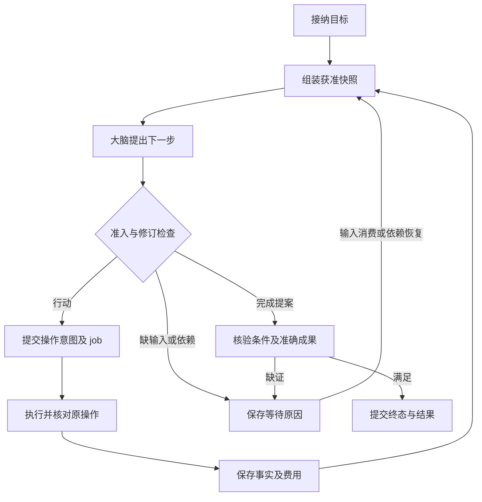
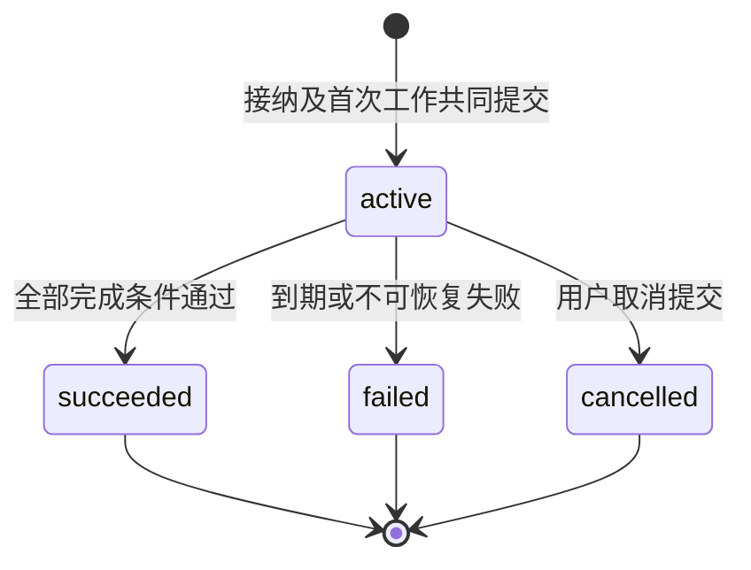
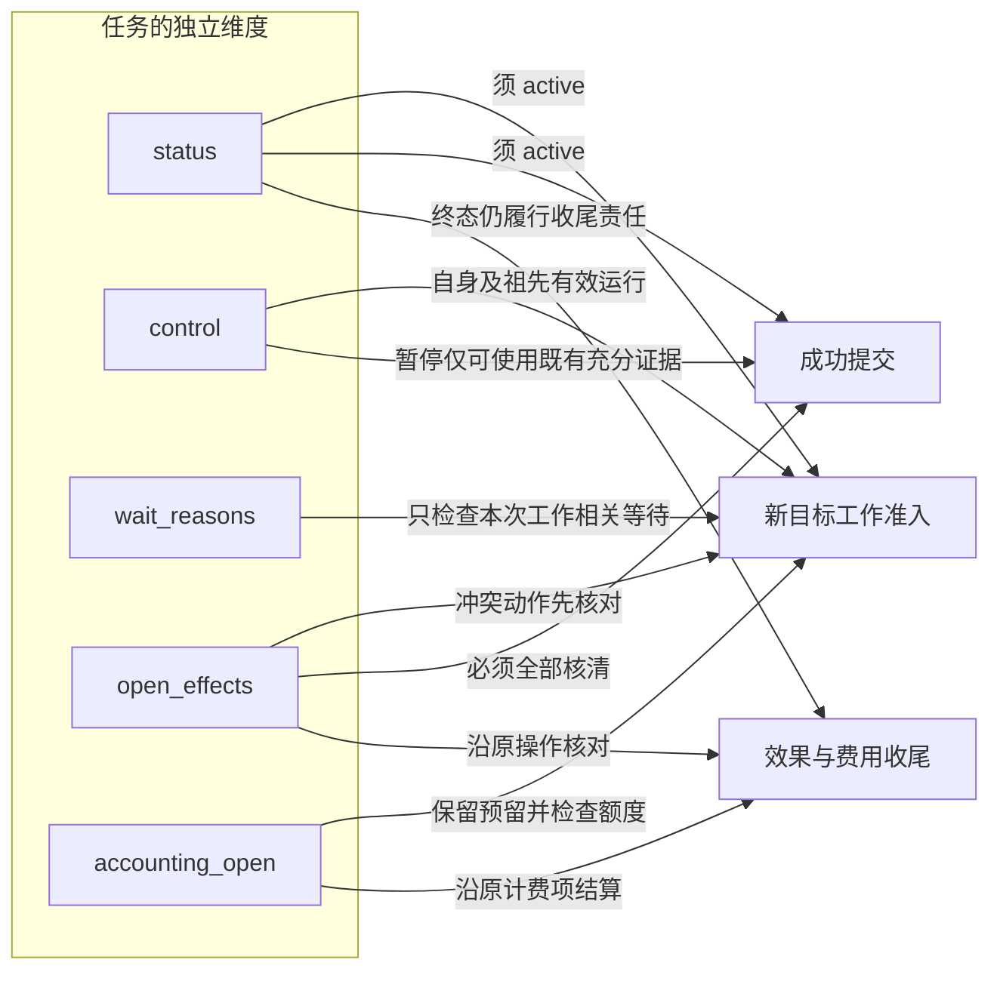
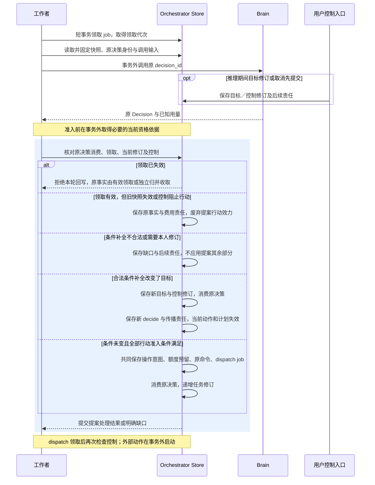
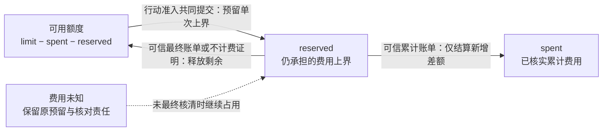
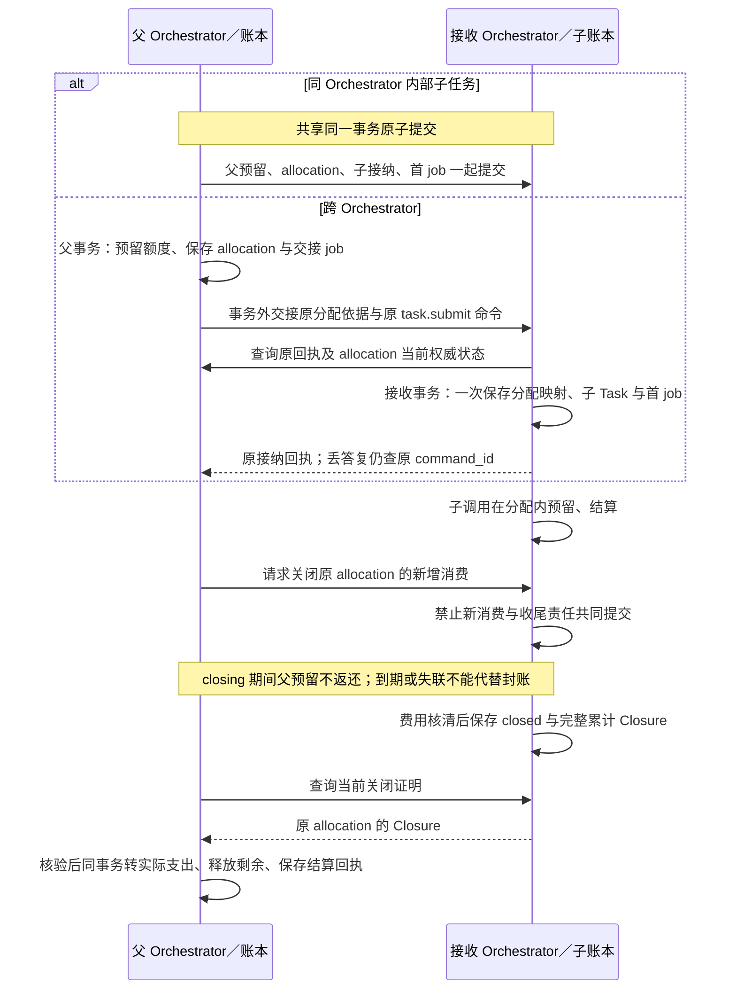
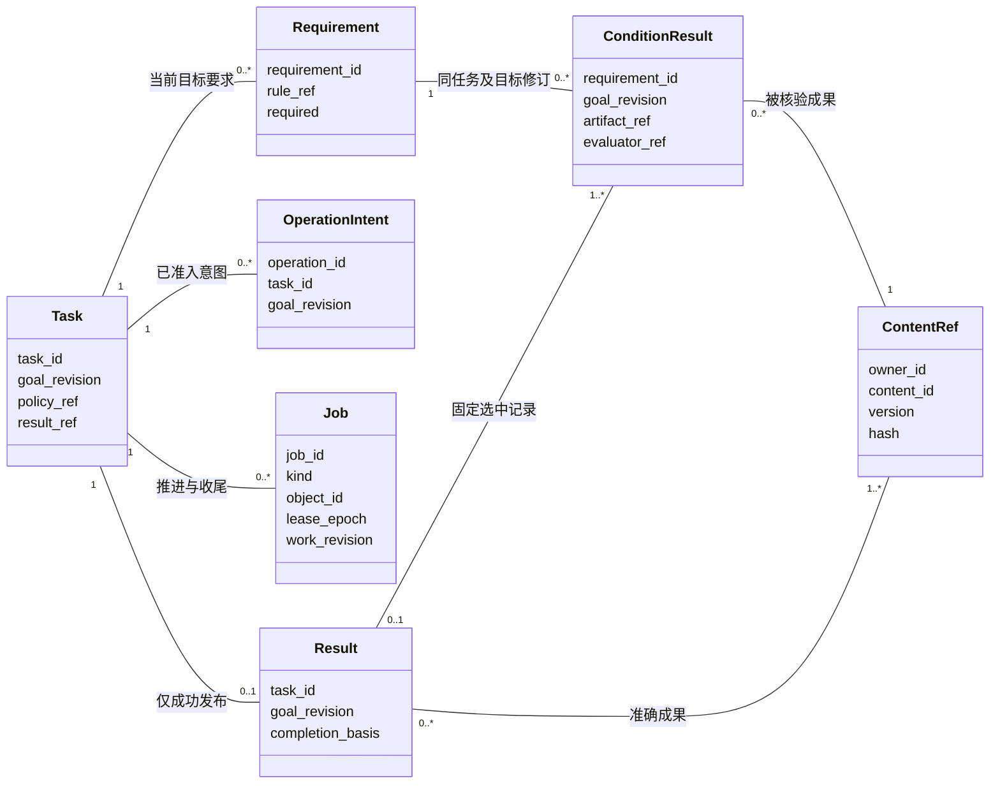

# Orchestrator：任务编排与持久推进

[模块与数据 UML](../uml-models.md#orchestrator) · [可编辑 UML 图册](../diagrams/uml-models.drawio)

[总览](../README.md) · [大脑](../brain/README.md) · [执行](../execution/README.md) · [共同契约](../contracts/README.md)

Orchestrator 保存任务目标、控制、额度、操作意图和完成决定。它把一次决策的可用事实交给大脑，再把有效提案准入为持久工作。Executor 保存真实效果；Orchestrator 依据这些事实推进任务，不把模型输出或请求日志当作执行成功。

默认将任务管理、上下文组装、准入、调度和结果核验放在同一模块。它们需要围绕同一个任务修订作决定，拆成独立服务会增加本地事务之外的恢复关系。独立替换边界放在 Brain、Memory、Executor，而不是 Orchestrator 的每个内部函数。

阅读路径：本篇建立任务主线 → [验证生命周期](verification.md#verification-lifecycle)展开条件、评估与完成责任 → [实现篇](implementation.md#module-shape)落实提交与恢复，其中[框架接入](implementation.md#reliable-work-integration)说明领域事务与公共模板的交接。实现查阅：[对象关系](implementation.md#data-flow) · [准入与恢复时序](implementation.md#key-sequence) · [账务关系](implementation.md#accounting-relations) · [访问路径](implementation.md#access-paths) · [生产部署和容量](implementation.md#production)。

## 1. 最小任务闭环

以“核实两个软件版本的差异，附引用，保存至指定目录”为例。Orchestrator 先保存原目标和调用者明确约束；目录不明时建立输入请求。取得获准来源后，大脑生成候选答案；质量评估绑定这份候选，文件写入和读回则绑定同一内容摘要。Orchestrator 仅在条件、效果和成果版本一致时完成。

任务接纳的成功点是 Task、原提交回执与首项 job 同时持久化。存储不可写时返回不可用，不能先显示“已接纳”再依赖内存补写。接纳一般不等待模型推理；缺能力但可能由用户补充的任务可保留明确等待，确定不支持则拒绝并说明具体缺口。

### 跨模块交接的成功边界

| 发起方 → 处理方 | 交接对象 | 可以确认的成功 | 答复丢失后的继续者 |
| --- | --- | --- | --- |
| 应用 → Orchestrator | 原提交命令、目标及获准配置 | Orchestrator 共同保存 Task、回执和首 job | 应用查原 command；Orchestrator 恢复原 job，均不重建任务 |
| Orchestrator → Brain | 固定快照、decision_id、期限与额度 | Brain 保存该决策的结果或明确缺口；不表示提案获准 | Orchestrator 查询原决策；Brain 核对原模型调用并回收用量 |
| Orchestrator → Executor | 已准入的原操作、控制快照和固定输入 | Executor 保存接纳决定及后续执行责任 | Orchestrator 查原 command／operation；Executor 继续原效果核对 |
| 交互入口 → Orchestrator | 请求 ID／修订、准确材料及原输入命令 | 一次消费与唤醒／验证工作共同保存 | 入口查原回执，不把同一回答转成新消费 |
| Orchestrator → 应用 | 固定 Result 及成果引用 | Result 已可查；字节实际取得另确认 | 应用按原 Result 取获准内容，不要求 Orchestrator 重做动作 |

同宿主可合并提交，但不能合并上表的成功含义。Brain 提案、Executor 接纳、效果证据和正式 Result 是不同事实；“方法已应用”以该方法的定义解释。完整信封与恢复查询见[共同契约](../contracts/README.md)。

## 2. 目标、计划和完成依据

原始用户目标始终保留。Orchestrator 记录解释后的 `requirements`，每项包含稳定 ID、原文依据、类型 `effect|quality`、判断方式和必要性；模型生成的解释标记为派生，不能覆盖显式约束。默认问答采用质量评估，不要求事先安装每种主题的任务流程。涉及具体对象、金额、发布范围等高影响歧义时，先取得用户输入再行动。

计划是可修订的工作假设，不是执行权限。任务接纳时绑定 `policy_ref` 指向的准确 TaskPolicy（ID、版本、摘要），策略规定工具范围、确认等级、回路限额、允许的评估方式及费用模式。安装新工具只需声明能力、授权与效果合同；只有业务需要更强的完成保证时才增加专用验证器。

Brain 可在任一种提案中携带绑定 `base_goal_revision` 的 `requirements_proposal`。Orchestrator 先裁决条件补全，只自动采纳保留显式约束且不降低必要性的变化；真正改变条件时递增 `goal_revision` 与控制修订，消费本次 Decision，并持久保存下一轮决策及控制传播责任。同一提案其余部分全部失效，包括 actions、完成请求与 `plan_delta`，不把旧快照下的行动改绑到新条件。代价是条件变化后增加一轮决策，换得每次行动只依赖一份已经固定的目标。与当前条件完全相同的补全按无变化处理，继续裁决原提案；改变目标含义或降低必要性仍须用户 `task.revise`。判定顺序、重复交回和竞争规则集中在[提案消费](implementation.md#proposal-consumption)。

模型自称“全部满足”不能提高保证等级。Orchestrator 先按[目标覆盖规则](verification.md#goal-coverage)核对完整原目标与当前条件集合，保存映射、检查依据及遗漏；存在已知缺口时，即使全部已登记条件通过也不能成功。没有机械检查覆盖的自然语言约束仍属质量判断；用户可以查看解释后的目标并纠正，Orchestrator 不宣称已穷尽识别任意自然语言中的所有隐含要求。

验证沿“条件与规则固定 → 准确候选固定 → 评估准入与执行 → 条件记录保存 → 完成汇总”推进。Executor 核对操作效果，获准评估实现判断条件，Orchestrator 保存条件记录并独立裁决完成；中途质量评估与最终汇总复用这些事实。验证实现的登记、版本绑定、当前资格及异常后的持久责任统一见[验证生命周期](verification.md#verification-lifecycle)。

| `completion_basis` | Orchestrator 必须具备的依据 | 保证与限制 |
| --- | --- | --- |
| `verified` | 每个必要条件均有适用的确定性验证，全部绑定当前目标修订及成果版本 | 客观约定条件通过；检查方法本身有适用范围 |
| `assessed` | 所有必要效果条件已证实，开放质量由固定规则与评估实现给出通过记录 | 声明评估来源与局限，不当作真实正确率或确定事实 |
| `user_accepted` | 必要效果条件已证实，用户通过受信入口接受准确成果版本和可见限制 | 用户验收开放质量，不能把未知写入改为成功 |

有混合判断时，先检查效果，再按必要质量条件取最弱依据：存在依赖用户验收的条件则为 `user_accepted`，否则存在评估则为 `assessed`，其余才为 `verified`。用户接受结果的动作不放宽行动权限。未满足必要条件时可交付部分材料，但任务不得进入 `succeeded`。

完成还要求受管内部子任务全部终结，外部委派已证明封闭新目标行动，并且本任务及其委派的未知或仍可迟到效果均已核清。不能只检查父本地操作表便忽略仍能行动的子任务。已封闭目标工作后的费用核对可以独立继续。

## 3. 状态、控制与终结

下图只描述 Task.status；暂停和等待不是这个状态机的节点。

| 独立维度 | 取值与责任 |
| --- | --- |
| `status` | `active / succeeded / failed / cancelled`，只有 Orchestrator 修改；终态不可重开 |
| `control` | `running / paused`；暂停阻止新决策和新目标行动，允许核对、收账及已具备全部证据的完成 |
| `wait_reasons` | 可同时存在的 `input / authorization / dependency / budget / effect / capacity`，逐项带所等对象与恢复条件；解决一项不清空其他项 |
| `open_effects` | 引用仍未知或仍可能在外部生效的原操作；与 Task.status 独立 |
| `accounting_open` | 尚待最终费用的调用或额度分配；以保守预留约束，单独欠费核对不必阻止已有确定成果 |

下图从准入和收尾的视角读取五个独立维度；连线表示判断依据，不表示状态迁移。新工作还须通过授权、期限和资源等门禁，成功提交还须满足第二节的条件与委派要求。

例如 `cancelled`、非空 `open_effects` 和非空 `accounting_open` 可以同时成立：目标工作已停止，原效果与费用仍需核对。单独未结费用以保守预留覆盖，不自动阻止已有确定成果的成功提交。

取消提交后，Orchestrator 停止新目标工作并为已派发操作建立取消或核对责任。取消不撤销已发生的文件修改。`cancelled` 可以带 `open_effects`；迟到成功仅更新事实及收尾，不把任务改回成功。期限到期记录 `failed` 和 `deadline_exceeded`，同样保留收尾责任。

暂停是动作边界控制：已发出的单次动作可能继续。只有执行端确认看见控制并阻止后续启动，才可展示该端已暂停；失联端显示待确认。暂停期间不启动新的质量评估来推进目标，但此前已经得到的全部证据可以使任务成功。这样“暂停请求”和“外部动作已完成”不互相掩盖。

用户可对 active 任务调用 `task.revise`。Orchestrator 保存新目标修订，废弃尚未派发的旧提案与 job，保留已经启动的操作。新目标若与在途效果冲突，进入 effect 等待，先核对再规划。旧证据仅在仍能明确满足新条件时复用，并产生绑定新 goal_revision 的核验记录；终态后改变目标则建新任务并显式关联。

暂停、恢复、取消、目标修订和终态提交都递增 `control_revision`，与本地决定同事务保存向所有已绑定 Executor 的控制 job。控制快照带 orchestrator_id、task_id、goal_revision、status、control 和修订，按[执行端 TaskGate](../execution/README.md)持久应用。新派发附当前 Orchestrator 认证的快照和有限启动截止；旧控制或迟到 invoke 不能覆盖较新门禁。已接纳未启动的旧目标操作由执行端核清为未应用，已经可能启动的则保留效果责任。

内部子任务对外的 TaskGate.control 是**有效控制**：只有自身及全部祖先都 active 且 running 时才为 running，其余为 paused。子 Task.control 仍保留自身选择。祖先控制改变时，Orchestrator 在同一事务中递增受影响子任务的 control_revision、重新计算有效控制并保存逐执行端传播 job；父控制确认范围包含这些子门禁。恢复父任务只重新计算，不能解除子自身暂停；祖先终结后的子取消继续落实。用户任务数量和并发配额包含内部子任务，使这项同 Orchestrator 更新有界。

## 4. 一轮推进与提交边界

工作者先领取 job，再读取固定任务修订、策略、输入、能力版本及获准材料。模型调用在事务外完成。回传 Decision 只能引用该快照；若目标、控制或关键证据修订已变化，保存调用事实及费用，丢弃旧提案的行动效力，重新调度需要的一轮。

下图聚焦携带行动的提案从固定输入到消费的一轮；蓝色区域为 Task 条件事务，先裁决条件变化，再决定行动是否仍可准入。Brain 调用及远端资格查询均在事务外。

图中推理费用属于原调用，即使提案失效仍按原计费项核对；动作预留只在行动准入成功时建立。派发丢答复后的查询与归并见[实现时序](implementation.md#key-sequence)。

在[提案消费](implementation.md#proposal-consumption)确认条件没有变化后，行动准入按以下顺序执行，分支互斥，安全条件分别检查：

1. 检查任务仍 active、目标修订匹配、本人及内部祖先链均未暂停或终结、尚未到期；不满足时不产生新行动。派发前重复这项检查，父恢复不能解除子自身暂停。
2. 校验提案类型、准确能力绑定、参数、依赖和目标约束；缺材料、输入或权限则保存对应等待对象。
3. 检查资源冲突、先前未知效果、当前授权资格及预算。远端授权证据先在事务外获取，过期则重取；执行端启动仍须落实[授权门禁](../security/README.md)。
4. 在同一短事务内按 expected revision 保存操作身份、不可变参数与预留额度、派发 job、任务新修订及原决策消费记录。

独立且资源不冲突的行动可以作为有界批次准入；互相依赖的行动必须取得前项事实后再准入。GUI 默认逐观察执行一个动作，不能预先批量批准依据未知界面的点击。

| 原子提交 | 同时保存什么 | 提交外的下一步 |
| --- | --- | --- |
| 接纳任务 | 原 command 回执、Task、目标修订、初始预算、首 job | 组装和推理 |
| 准入行动 | 原 decision 消费、Operation 意图、预算预留、dispatch job | Executor 接纳和启动 |
| 应用执行事实 | 按 `(executor, operation, revision)` 去重的事实、账务变化、任务修订、下一 job | 新一轮或完成核验 |
| 消费输入／控制 | 原 command、输入或控制修订、失效 job 标记、后续工作 | 通知远端并查询确认 |
| 提交完成 | 固定结果与依据、任务终态、关闭新目标工作、结果可查及可选记忆提取 job | 交互读取、独立提取任务 |

同宿主、同存储、同信任边界可将 Executor 接纳或 Grant 使用纳入相应事务，但外部动作永远在提交后。独立模块替换后改用持久命令交接；不承诺跨库原子性。

## 5. 恢复与调度

job 保存必须继续履行的责任，业务对象保存最终事实；job 完成不代表任务成功。Orchestrator 的 JobRunner 接入[可靠接纳与有界工作模板](../reliable-work.md)，公共层提供原命令去重、领取和条件回写，TaskCoordinator 继续裁决目标、控制、行动准入和完成。模块如何映射责任键、事务参与者与各类处理器，见[接入设计](implementation.md#reliable-work-integration)。

例如 Executor 接纳固定 Invoke 后丢答复，Orchestrator 重领原 dispatch 仍查询同一 command／operation；Executor 继续核对目标效果。新 worker 不能换操作身份，旧 worker 的迟到答复不能直接修改 Task。若处理期间新增控制或账务责任，公共 `work_revision` 检查阻止旧完成／退避覆盖它；领域的目标、控制和来源修订仍分别核验。完整领取与责任竞争规则集中在[工作提交](../reliable-work.md#completion)。

默认 kind 为 decide、dispatch、poll、verify、control、settle、extract；[领域工作种类](implementation.md#job-completion)定义它们何时可以结束、何时交接以及耗尽后的等待。verify 只承担条件归并与完成汇总；需要新的评估时仍经普通行动准入建立 dispatch。

同一任务默认一个决策 job；已声明独立的操作可并发。调度按用户轮转，再按用户内任务轮转，控制和收尾单列保留容量；限额详见[部署](../deployment.md)。阻塞工作按 due_at 重试或等具体对象变化，不把所有等待任务循环送给模型。

| 异常 | 保存的事实与继续者 | 后续行为 |
| --- | --- | --- |
| 创建事务已提交，接纳答复丢失 | 调用方保留 command_id；Orchestrator 保存任务映射 | 查原命令或原键重投，返回同任务 |
| 模型返回时用户修订目标 | 大脑保留费用与输出；Orchestrator 发现 revision 不符 | 不派发旧行动，按新快照再决策 |
| 外部写入后响应丢失 | Executor 原操作未知；Orchestrator 保留预留与 poll job | 核对原目标效果，不换新操作重复写 |
| 暂停、完成、取消并发 | Orchestrator 对任务行按修订串行提交 | 先提交的终态保持；暂停不伪称已撤回外部行动 |
| 持久存储提交结果未知 | 原业务键和 job 关联可重建 | 先恢复同数据库权威并查询；数据库分裂或原主未隔离时不另起写者 |
| 依赖长期不可用 | wait_reasons、原期限和恢复对象 | 有限等待，到期失败并继续已有收尾 |
| 未知效果不能进一步核对 | 原事实及失败原因、受信处置入口 | 用户可补充可验证证据或结束任务；不能直接点击“视为未执行”开放重试 |

## 6. 额度与有限执行

默认严格额度只接纳具有可信单次上界的计费项：准入时预留上界，维持 `spent + reserved ≤ limit`；最终费用低于上界才释放差额。费用以精确十进制数、明确单位和计价版本记录，协议编码格式使用十进制字符串，禁止混用不同货币或把估计值当最终账单。调用次数、运行时间、模型 token 和费用各有独立限额，任一耗尽都阻止对应新工作。

下图描述单任务、单计价单位的正常严格预算。可用额度由余额推导，实线表示金额转移，虚线说明预留保留条件；调用答复本身不证明最终费用。

| 预算模式 | 允许使用的条件 | 保证边界 |
| --- | --- | --- |
| `strict` | 每项计费有可信单次上界；固定 allocation 始终使用此模式 | 提供方履约时维持 `spent + reserved ≤ limit`；违约账单仍须照实入账 |
| `estimate` | 本人接受准确策略和范围、当前资格有效；只限同一受信本地事务范围内未经过 allocation 的直接调用 | 以有限估算额决定启动，最终账单可超总限额；超额即停止新计费，不能称硬上限 |

模型费用不明时严格模式按上界保留，估算模式按已获准的有限估算额保留；自动查询次数耗尽只转为受信核对，不能按时释放。只有可信最终账单或可验证的不计费证明到达，才按原计费项结清或释放；迟到账单只应用累计差额，不能再次累计全部金额。本地并发槽与未知费用不是同一资源；具体边界见[大脑调用恢复](../brain/README.md)。无法提供可信最大费用的适配器仅可在用户明确接受的估算预算配置中，对未通过 allocation 分配的任务直接调用使用有限估算额预留；最终账单可能使 `spent + reserved > limit`。账本必须记录真实超额和原调用，立即停止新的计费工作，保留其余未知费用及结算，界面不能称这类限额为硬上限。固定额度的子任务或外部委派不得使用估算计费，除非另有经确认的超额交接合同；当前方案没有该合同。

估算模式由固定 TaskPolicy 声明允许的能力、费用单位、单次估算预留与总预算；策略本身不能代替用户同意。原 Orchestrator 的受信 TaskPolicyRegistry 在任务提交前按租户、认证用户和准确 `policy_ref` 保存本人估算接受事实，注明非硬上限、适用范围、预算上限和期限。`task.submit` 根据认证主体及租户核验该记录，在接纳事务中保存 Task 与接受记录的关联；缺失、过期或预算超范围即拒绝。模型或客户端布尔字段不能启用估算。当前仅当原 Orchestrator 与全部涉及费用的 Grant owner 处于同一受信本地事务范围内、能直接核验该 Task 的内部接受关联时开放估算；跨域或无法核验时只允许 strict，不能从公开 Task.policy_ref 推定用户已接受。每次行动仍须重新核验该接受事实尚有效，并同时通过固定策略、适配器声明及在线 Grant owner 的当前资格；撤回只封闭新估算使用，不抹去原账单。任一 Grant 对费用单位要求硬上限时拒绝估算。`task.adjust_budget` 只可在原接受范围内加额；超范围拒绝，另建采用已接受新策略的任务，不静默换掉现有 Task 的策略。受信策略管理入口是默认宿主必须实现的先决能力，目前未作为冻结的第三方协议方法；没有它的装配只能使用严格模式。跨域估算若要开放，须另冻结可认证的原 Task 资格查询或证明合同。

内部子任务的可支配额度从父任务 reserved 中划拨；父聚合报表展示子费用，但不再扣一遍。不同 Orchestrator 使用唯一 allocation_id 交接固定额度，父侧未证明子侧封闭后不返还。网络分区时额度宁可闲置，不同时在两端消费。

下图从父账本到接收账本展示同一固定 allocation；内部任务树可以共同提交，跨 Orchestrator 的两端分别持久接纳，箭头不表示跨库事务。

父方首次封账只将原 allocation 预留转支出一次，后续更正仅追累计差额；报表中的子费用不另加扣。关闭先于子接纳时，接收方保留拒绝迟到创建的预算关闭记录；预算关闭仅封闭新增消费，目标取消仍有独立控制责任。账务对象及两端身份见[账务关系](implementation.md#accounting-relations)，关闭竞争和封账后的费用更正见[预算实现](implementation.md#budget-handoff)。

跨 Orchestrator 实际费用超过固定 allocation 时，可能是提供方突破可信单次上界，也可能是接收方把多笔各自合规调用放过总分配上限。接收方仍保存原调用与可信实际账单并封闭新增消费；父方核验账单后一次性把原 allocation 预留转为真实支出，超出部分如实记为债务。事故分别判断 provider_bound_breach 与 receiver_allocation_breach，两者可同时成立；未查明的原因保留待查标记，停止受影响的新计费／委派；不能截断账单、因超额拒收真实 Closure，或反复结算同一 allocation。证据不足时保留原预留与核对责任。严格额度的硬上限以提供方履行可信上界合同为前提，违约路径需要单独告警与验收。

已 settled 后仍可能收到原计费方的可信上调账单。接收方保持消费关闭，以更高费用修订和持久交回责任提交完整累计证明；父方恢复原结算意图，只追加累计差额，不倒流已释放额度或重开任务。更正导致超预算时记债并停新计费。事故归因、同修订冲突、原命令过期和退款边界集中见[最终结算](implementation.md#budget-handoff)。

| 方法 | 输入与持久结果 | 失败后的动作 |
| --- | --- | --- |
| `budget.allocate` | 父任务、allocation_id、接收方、单位、上限、期限；共同保存父预留与交接 job | 原 allocation 查询；不明时不另分同笔额度 |
| `budget.settle` | allocation_id、expected_revision、原接收方 RuntimeBudgetClosure | 同命令返回同结果；首次正常结算转预留为实际，违约全额记账；已 settled 的可信更正只按更高用量修订追累计差额，证据不足待核，旧 allocation 修订冲突 |
| `budget.read` | allocation_id、role=owner／receiver → 当前分配或接收门禁投影 | 仅对应权威服务返回当前事实；历史原回执不代替本查询 |
| `budget.close` | 原接收方、allocation_ref、原分配命令及父委派关联 → closing／closed | 与子接纳竞争同一接收门禁；未知分配也先关闭，最终证明另查 |
| `task.adjust_budget` | expected_revision、每项新上限 | 低于已消费及仍承担义务则冲突；加额不恢复暂停也不延长期限 |

默认每轮补上下文次数、决策轮数、单步重试、用户等待期限和收尾查询间隔均由装配配置给出有限值。未知责任超出自动查询次数后转受信处置，仍可查询；不通过删除记录清空预算或设备互斥。

## 7. 字段与方法查阅

共同标识、引用、版本、错误和 Command／Receipt 见[共同契约](../contracts/README.md)。下图只帮助查阅核心关系：Requirement 采用 Task 当前目标修订的集合，ConditionResult 表示该修订内的核验值记录，历史组织和唯一约束见[持久对象关系](implementation.md#data-flow)。关联线不表示调用、外键或内容生命周期所有权。

图中的多重性表达一对多关系；协议编码格式中 Task 当前 requirements 为 0–100 项，Result 的条件结果与成果引用各为 1–100 项，内部历史不受这些数组上限约束。每个 ConditionResult 以所属任务、`goal_revision` 和 `requirement_id` 关联准确要求，并固定成果版本；同一要求可以有不同候选或尝试的记录，Result 只选取适用于最终成果的依据。图中的 `0..1 Result` 表示记录可尚未被成功结果选中；证据引用也使用准确 ContentRef，完整字段不在图中重复展开。OperationIntent 保存准入意图，Executor 保存的 Operation 才是效果事实；Executor 是负责组件，未与这些值记录混画。

下表集中定义业务字段；大对象均使用获准 ContentRef。

| 对象 | 字段与约束 |
| --- | --- |
| Task | `tenant_id, task_id, orchestrator_id, submit_command_id, goal_ref, goal_revision, requirements, policy_ref, revision, control_revision, status, control, wait_reasons, deadline, budget, open_effects, accounting_open, result_ref?`；Orchestrator 和原提交绑定不可变；祖先控制按同 Orchestrator 任务链检查 |
| Requirement | `requirement_id, kind, source_ref, rule_ref, required`；rule 引用机械检查、评估规则或用户验收；依据不足不能标 pass |
| OperationIntent | `operation_id, task_id, goal_revision, decision_id?, plan_step?, verification_ref?, capability_ref, binding_ref, input_ref, input_digest, grant_refs, reservation_id`；内部来源三选一：Brain 的 decision_id、计划的 `{plan_id, plan_revision, step_id}`，或受信核验的 `{kind=condition, check_id}`／`{kind=goal_coverage, goal_revision, coverage_revision}`；核验引用不能由普通调用自报。准入后不可改参数，公共 Invoke 不增加来源字段，效果由 Executor 提供 |
| ConditionResult | `requirement_id, goal_revision, artifact_ref, verdict, basis, evidence_refs, evaluator_ref`；verdict 为 pass/fail/unknown，引用准确成果与适用规则 |
| Result | `task_id, goal_revision, artifact_refs, completion_basis, condition_results, limitations, completed_at`；只供 succeeded；失败／取消返回独立结束说明和未决项 |

| 方法 | 业务输入 → 输出 | 成功含义 |
| --- | --- | --- |
| `task.submit` | goal_ref、目标 Orchestrator、明确约束、策略选择、预算及期限 → Task | 接纳与首项工作持久化，不保证任务成功 |
| `task.read` / `task.list` | task_id 或过滤条件／游标 → 当前获准快照 | 查询不引发行动，目录只包含本 Orchestrator 的任务 |
| `task.result` | task_id → 固定 Result 或尚未成功的状态说明 | 返回原结果，成果字节按当前权限另取 |
| `task.revise` | expected_revision、新 goal_ref、明确约束变化 → 新修订 | 旧在途效果保留；新目标等待冲突解决 |
| `task.pause` / `task.resume` / `task.cancel` | expected_revision、控制理由 → 本 Orchestrator 决定及逐远端确认状态 | 本地决定已保存；远端生效另查 |
| `task.input` | request_id、request_revision、内容或选择、准确预览绑定 → 消费回执 | 一次消费；授权输入走独立受信签发入口 |
| `task.attach_evidence` | 原 operation_id、可核验证据引用 → 核验 job | 接纳证据不直接改变效果或终态 |
| `task.billing_reconcile` | 原 task_id、source_kind、source_id、usage_revision、usage_digest → JobAck | 验证认证计费 owner 与原 Task／计费项绑定，仅持久唤醒原 settle 作业记录；主动读取原账后才按累计差额结算，JobAck 不证明费用已入账 |
| `task.accept_result` | request_id、request_revision、候选摘要、goal_revision、受信用户决定 → 验收记录 | 核对请求类型、版本和未消费状态，同事务消费请求、保存验收及后续核验 job；原命令返回原回执，另一命令竞争同请求只可一份生效 |

task.list 在本 Orchestrator 内按 `(created_at DESC, task_id)` 使用固定查询上界与稳定游标，逐页重新检查当前披露权限；已删除或已撤权项跳过并记录缺口，不能为了补齐数量无限扫描。资格适配器从原授权 owner 核验披露范围代次，变化时旧页游标失效；适配器不可核验时不能声明该页完整。时间上界不是提交水位，分页期间新增的任务可能留待下一次查询。[跨 Orchestrator 列表](../interaction/README.md#cross-orchestrator-list)由应用固定来源版本并合并，不建立第二个任务裁决者。

## 8. 验证要点

| 前置及故障 | 可观察结果 | 目标 |
| --- | --- | --- |
| 接纳后立即崩溃并重复提交 | 唯一 Task 和初始 job，可查同回执 | C5、A4 |
| 写入答复丢失，再暂停／取消 | 原 operation 保留；不重新写入；迟到效果不重开 cancelled | C4、C5、C7 |
| 相同成果只通过模型评估 | Result 标 assessed，不能标 verified | C1、C8 |
| 用户验收但还有未知副作用 | 不进入 succeeded，显示原操作及核对入口 | C4、C7 |
| 预算下调与子任务迟到费用竞争 | 不突破承担义务，不双计、不提前返还 allocation | C5、C7 |
| 旧工作者在重领取后回传 | 旧提交被拒，原远端操作仍沿原 operation_id 核对 | C5、A4 |
| 暂停时最后一份既有证据到达 | 不启动新工作，满足全部条件则正常完成并可解释顺序 | C5、C7 |

上述是设计判据，真实并发、存储故障与恢复仍须由[系统验收](../validation/README.md)执行。
