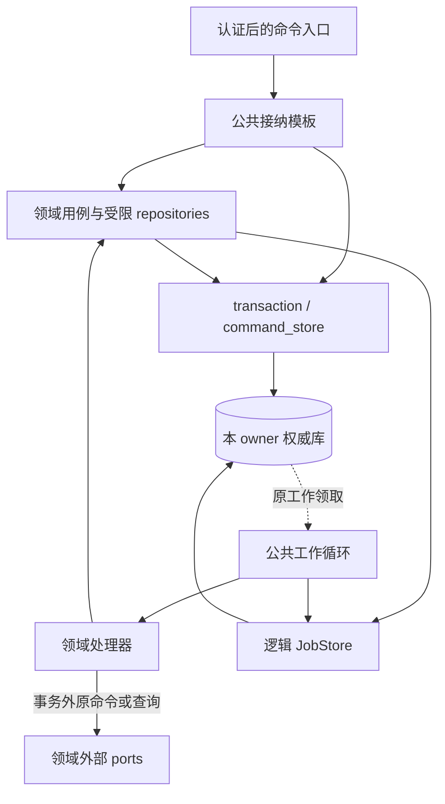
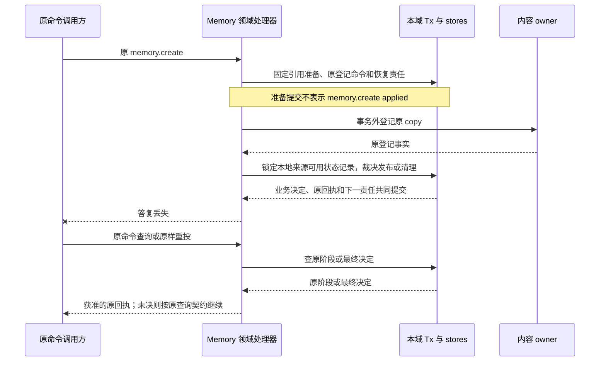
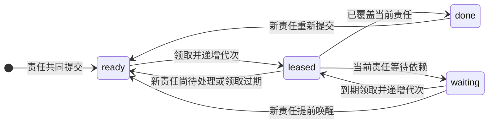
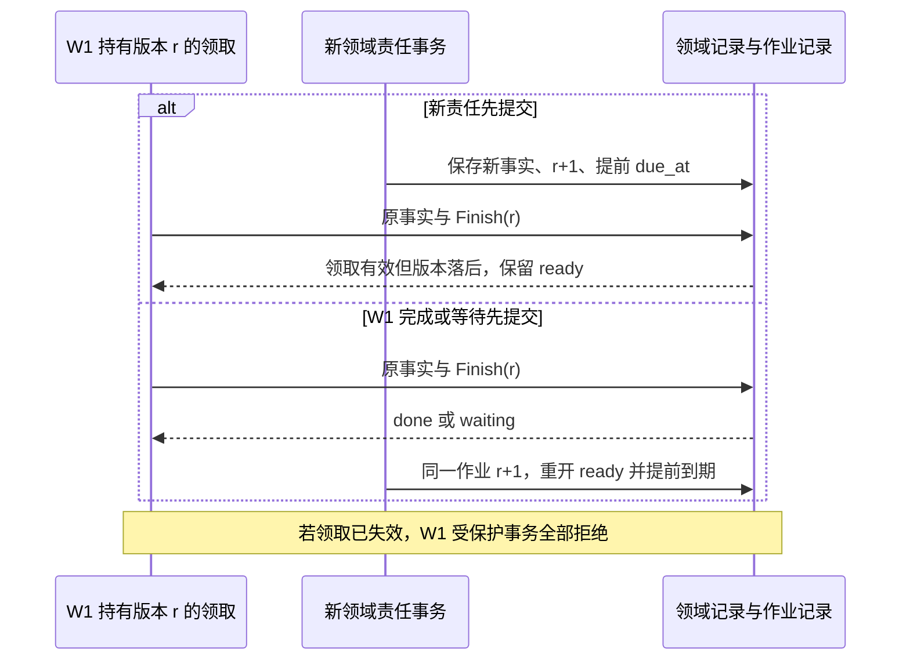

# 可靠接纳与持久作业框架

[架构入口](README.md) · [宿主装配](deployment.md#4-默认宿主的装配与持久接口) · [存储与中间件](storage-and-middleware.md) · [共同调用契约](contracts/README.md)

本框架将参考宿主中的原命令接纳、短事务、有界工作推进和恢复检查集中为可复用实现。各模块接入同一逻辑 JobStore 契约，在各自本地事务中保存业务状态与后续作业；成功条件、外部效果判断和安全重试继续由领域负责。本文是内部实现规格，尚无对应运行库、数据库适配器或故障测试结果，不增加公开协议方法。

启用前须有可兑现的权威存储、可共享本地事务的参与者、当前认证身份与可信时间、有限工作容量和领域恢复处理器。缺少原子共同提交能力时不接纳相应新责任；恢复缺少外部证据时保留原命令或对象标识及待核对记录。依赖缺失不能降级为内存队列、跨库伪事务或盲目重发。读者先看分工与选择，再沿接纳、领取和条件提交阅读；具体模块映射见[接入索引](#integration)。

## 1. 分工与关键选择

原命令已经接纳而答复丢失、旧工作者覆盖新责任，是多个模块都会遇到的问题。它们需要相同的唯一键与条件更新，而决定“该保存哪些事实、是否还能发送”的前提不同。公共框架因此提供接纳和有限工作模板，领域处理器组织一项责任的具体步骤；需要多个短事务及远端交接时逐步保存，不强制套入单次 prepare／run／commit。

| 选择 | 依据、竞争方案及代价 | 改选条件 |
| --- | --- | --- |
| 共用接纳和工作模板 | 只共享底层原语仍须每模块重复实现提交未知、领取失效、停止及回写分支。模板减少这部分重复；宿主维护者承担接口稳定性、领域接入和统一故障测试成本 | 多数模块必须绕开模板才能保留领域规则时，收缩相应模板，只保留可复用原语；不累积按模块名分支的通用流程 |
| 统一逻辑 JobStore，各域独立装配 | 统一领取与回写契约便于适配器复用同一组并发测试；仅共享算法让各模块自建接口会增加重复适配。各领域仍决定业务键和表布局，存储维护者承担适配与索引成本 | 某存储无法兑现同事务责任合并时，另评审其保证和接入方式，不能继续标为同一保证的透明适配 |
| 领域保存唯一业务事实，公共层保存调度所需字段 | Task、Decision、Operation、Activation 的成功和恢复依据不同；复制统一业务状态机会产生第二个裁决位置 | 只有出现现有领域无法承担的新事实归属，才另行设计；本框架不提供此类 owner |

前两项由本轮设计访谈确认，见 [ADR](../adr/0009-reliable-work-framework.md)。模块不等于服务；共用实现可以装入多个应用、不同数据库和独立工作池，不改变[固定 Orchestrator 与本地事务范围](README.md#2-系统分工与事实归属)。

图表示代码依赖与存储边界，每个 owner 独立装配一份；实线是调用或事务访问，虚线是从原库领取持久责任。其他 owner 仅通过原命令和查询交接。

认证引导的配对入口是图中普通身份入口的有限例外，仍先验证方法规定的预认证依据，见[接纳身份域](#admission)。公共模板不绕过领域用例直接修改业务表；第三方组件只需兑现[共同协议](contracts/README.md)，不必使用本运行库。

## 2. 接入接口与依赖

以下为拟实现的 Go 接口语义，名称用于明确调用边界，不构成可编译 SDK，也不新增公开协议。Tx 是本地事务范围内的短生命周期句柄，Claim 是一次作业领取记录；业务对象继续使用所属模块的类型。外层接纳模板和工作循环组合这些接口，不对领域隐藏事务边界。

| 内部接口／操作 | 输入 → 输出 | 必须遵守的约束 |
| --- | --- | --- |
| `transaction.Within(scope, participants, fn)` | 固定本地事务范围、声明参与者、纯本地读写闭包 → Committed／RolledBack／CommitUnknown | 只将确认提交的值对外作为成功；冲突细分为可重跑的数据库竞争或固定领域拒绝，见[事务规则](#transactions) |
| `command_store.Lookup/Reserve(tx, key, digest)` | 受信身份域、原服务、原命令及固定摘要 → 已有阶段／去重与终态记录／可首次接纳 | 唯一键串行；只在当前事务创建占位，提交时必须已有领域决定或持久处理责任 |
| `command_store.SaveReceipt(tx, receipt)` | 方法允许的阶段及领域决定 → 原阶段记录 | accepted 可按原命令推进到最终决定；applied／rejected 固定。摘要冲突不得覆盖原决定 |
| `job_store.Raise(tx, key, source, due)` | 领域确认的新责任、稳定作业键、原记录引用 → 原 job_id 和新 work_revision | 与来源事实共同提交；来源是否重复、能否合并由领域判断；通知不调用此操作增加责任 |
| `job_store.Hint(tx, key, due)` | 获准的重读提示、已有未完成作业 → 到期提前或无变化 | 不创建作业，不重开 done，不增作业版本；只有领域已保存的持续责任能承接提示，提示丢失仍由原到期扫描保证核对 |
| `job_store.Claim(scope, pool, limit)` | 可服务本地事务范围／类别、已预留容量、有限批次 → 已确认领取的 Claim 集合 | 只锁作业记录；提交后才处理；领取未知先核对，不能执行未确认领取 |
| `job_store.Renew(claim, until)` | 当前领取及有限新截止 → 已续约／失效／结果未知 | 不递增作业版本，不复活已过期领取；调用方不得把未知续约当成功 |
| `job_store.Guard(tx, claim)` | 当前锁定的作业记录及固定 Claim → 有效／失效 | 在领域锁之后取得作业行锁，核验领取；后续写入仍在同事务，失败则回滚受保护写入 |
| `job_store.Finish(tx, claim, disposition)` | 领域给出的完成或等待决定 → done／waiting／ready／领取失效 | 不替领域判断责任已覆盖；比较当前 work_revision，防止旧 done／退避覆盖新责任 |
| `WorkHandler.Handle(ctx, claim, ports)` | 一次领取、宿主工作期限、受限 ports → 本轮结束／未决 | 可组织多个短事务和有限外部步骤；每个不可恢复步骤之前先保存原命令或操作标识及后续作业；return nil 不自动调用 Finish(done) |
| `WorkHandler.Reconcile(scope, cursor, limit)` | 领域未结记录的有限页 → 补建缺失作业及下一游标 | 仅按原业务键修复；不重新生成原命令或推断外部未执行 |

`participants` 是宿主装配的 repository 能力集合，不是调用方提供的表名。接纳模板取得域规则的决定后，在同一 Tx 保存回执；工作模板将 Claim 交给对应处理器，处理器使用受限事务接口保存事实与责任。它既不能另开嵌套事务假装共同提交，也不能拿通用 SQL 句柄读写其他租户。Claim 的不可变部分为 job_id、holder_id、lease_epoch 与 observed_work_revision；Guard／Finish 读取数据库当前 lease_until 判断有效性，不要求它等于初领截止，续约也不改变原责任观察值。

模板启动时核对每个 kind 的处理器、所属数据库事务边界、作业键映射、期限／尝试策略、外部恢复入口和扫描方式。重复 kind 绑定或缺少处理器时关闭该类新接纳，旧工作保持可诊断；不能将无法识别的工作标 done。接口组合依赖由安装锁定清单固定，滚动变更须保留旧记录的可读和恢复能力，见[宿主迁移](deployment.md#5-首次启动重启与迁移)。

## 3. 事务句柄与提交结果

Tx 绑定原权威库、受信身份域及参与 repositories，仅在闭包内有效，不能存入 job、跨 goroutine 逃逸或传到另一个服务。参与领域需要共同裁决时加入同一 Tx；独立 owner 以原 Command 和查询交接。外部身份解析、内容字节准备和授权获取在事务外完成，事务内复核本地授权与状态条件；跨域事实不存在共同原子读的地方仍保留领域的授权或租约的有限有效窗口与核对规则。

加锁按原命令键、领域规定的祖先任务／预算／控制状态／业务行、最后作业记录的顺序进行；同类按稳定键排序。领域声明并取得本次全部必要业务锁，再按稳定键锁定全部参与作业记录，执行 Guard、受保护事实写入、Raise 和 Finish。取得作业行锁后不能再查找并锁一个未声明的领域对象；需要新增锁集合时回滚并重新组织本地事务。数据库外键、索引唯一性检查涉及的隐式锁也须纳入适配器验收，不能仅凭接口调用顺序证明无死锁。Orchestrator 的具体层次见[领域锁序](orchestrator/implementation.md#21-锁定顺序)。

每次受领取保护的事务在 Guard 和 Finish 实际裁决时用数据库当前时间验证 Claim，不能用排队前或长事务开始时的时间。没有外部等待的短事务仍需有时长上限。领取租约已失效的处理器不能写自己的业务结果或作业状态；可信迟到事实走[独立事实归并](#recovery)。本地时间与租约有效性的判断条件沿用 [ClockAdapter](deployment.md#clock-adapter)，不把 job lease 与连接／进程租约混为一个期限。

| 事务结果 | 可以返回的事实 | 下一步 |
| --- | --- | --- |
| Committed | 本次业务决定、回执阶段和已保存责任，也包括固定 rejected | 提交后发可丢唤醒；通知失败不回滚或改写该决定；固定拒绝沿原回执返回，之前准备产生的清理责任继续保存 |
| RolledBack：明确数据库竞争 | 没有该次提交 | 仅在确定未提交、闭包无外部动作、有限重试预算内重跑本地逻辑；重新检查当前授权与业务条件，原 expected_revision 和命令摘要保持 |
| RolledBack：其他本地错误 | 此事务没有应用业务改变，也没有因此自动生成固定拒绝 | 按既有错误契约保留原命令或对象标识及核对责任；领域条件不满足通常作为拒绝值在原事务保存 rejected，不能把业务修订冲突当数据库瞬态重试 |
| CommitUnknown | 当前无法确定提交结果 | 先按原命令或原业务阶段查询；不得报告已失败、释放未知预留或重跑外部步骤。若无法查询则保存／保留原核对责任 |

Guard／Finish 返回领取失效时整个受保护事务回滚，包括先前对业务的写入。新作业版本分支则允许按领域规则保存合法原事实，但作业保持 ready。领域拒绝、适配器不可用、领域 Effect=unknown 与 CommitUnknown 是不同结果，公共层不在它们之间自动转换。

## 4. 原命令可靠接纳

接纳模板先核验当前调用身份、方法、消息结构、服务路由及必要限流，再在原负责方的本地事务范围按原键判重。以[共同契约](contracts/README.md#2-标识命令和查询)的 `(tenant_id, logical_service_id, command_id)` 为业务幂等键，以规范摘要核验同键请求的一致性。已有回执仍按当前披露权限返回；服务暂不开放首次接纳，不影响获准查询旧决定。`endpoint.pair.begin/claim` 仅在[配对专用入口](contracts/transport.md#1-连接与发现)按受信预认证会话域判重，批准后才绑定 tenant，不允许普通业务选择这一例外或从正文指定 tenant。

| 原键查找顺序 | 模板处理 | 领域必须补充 |
| --- | --- | --- |
| 已有完整原命令记录 | 摘要相同返回当前阶段或固定最终决定；不同返回 idempotency_conflict | accepted 尚未决定时继续原处理责任，不能重新初始化业务对象 |
| 只有最小去重与终态记录 | 按原摘要返回获准 gone 或冲突 | 不重开对象；保留依据及清理边界沿原领域 |
| 没有原记录 | 在唯一键保护下检查首次接纳期限与授权条件，运行领域本地接纳步骤 | 容量、控制、预算、业务对象唯一性及领域准入；新 command 指向旧 operation 仍须业务去重 |

领域在 Tx 中返回“同步决定”或“已保存处理责任”。前者可直接保存该方法合法的 applied／rejected；后者将准备记录、原输入及恢复责任共同保存，仅当方法登记允许时返回 accepted。只允许 applied／rejected 的方法，原命令查询或重投先关联已有准备，有限等待最终决定；到本次请求期限仍未完成时沿既有传输超时返回，调用方按原命令标识有界查询，后台继续原责任。若已有明确依赖错误，则按原错误契约返回查询错误，不伪造业务 rejected。有准备记录时不能报告“原命令从未存在”的 not_found；内部准备阶段不新增公开 pending 或 accepted 状态，详见[共同回执规则](contracts/README.md#1-从持久命令而非连接恢复)。

以 Memory 跨库发布为例，下图只建模同一原命令的准备、发布及恢复，实线为事务或调用；框架提供持久机制，是否可发布由 MemoryWriter 裁决。

接纳模板不能提交一行没有处理责任的空占位。一次事务内占位后拒绝时仍须按方法保存合法拒绝决定；多阶段准备则必须有足够恢复的领域记录及 job。未提交的占位随事务回滚。同步短命令没有后续工作时只提交业务与回执；真正查询继续走 Query，不套接纳或排队。`feedback_open`、`approval_check` 等虽含读取含义仍会保存暴露或使用事实，按方法登记执行。

## 5. 作业标识与版本

**持久作业（Job）**记录后台需要执行的工作，例如查询一个操作的结果、核对一个内容副本是否已停用。同一 owner 通过稳定业务键合并同类待处理更新，由 `work_revision` 区分新增工作；一次领取由 Claim 和租约约束。Job 的生命周期独立于用户任务 Task 和单次执行尝试 Attempt，具体合并边界由领域定义，JobStore 实现相应条件更新。各模块字段映射见[接入索引](#integration)。

| 逻辑字段 | 含义与约束 |
| --- | --- |
| scope、responsibility_key、kind | scope 包含原 owner／本地事务范围及受信租户或专用身份域；业务键由模块给出，不硬编码 task_id；合起来唯一定位作业记录 |
| job_id | 作业记录的不可复用标识。满足领域清理条件后重建同业务键须用新 job_id，旧领取不能命中新行 |
| source_ref | 固定领域对象或责任记录的引用；大正文、凭据和全份业务状态不复制进领取索引；准确输入由领域原记录保存 |
| state、due_at | ready／leased／waiting／done 及最早应处理时刻；等待原因和唤醒依据可位于领域记录，必须可诊断 |
| work_revision | 同一 job_id 内新领域责任同事务递增的单调版本；重复事实、通知、时间到期、领取及续约不递增。合法清理后新 job_id 可从初值建立版本，不要求跨作业记录连续 |
| lease_epoch、lease_until、holder_id | 同一 job_id 内的领取代次、数据库裁决截止、当前工作者启动身份；每次新领取递增代次，续约不换代，工作者重启使用新身份 |
| observed_work_revision | Claim 固定的领取观察值，由处理器携带；不能在回写时替换为最新版本，未必需要额外存一列 |
| 尝试数、期限与重试预算关联 | 固定原责任的有限自动处理范围；具体计数和向外部目标发起的请求数归领域记录，不能以领取次数代替外部发送次数 |

`Raise` 只在领域已确认新责任的 Tx 内调用。首次创建 ready 作业；已有 done／waiting 则递增 work_revision 并重开 ready；已有 ready 保持 ready；有效或待回收的 leased 不被新责任抢占，只递增作业版本并提前 due_at。due_at 取既有要求与新要求中较早值；不延长正在等待的新责任，不刷新租约。相同事实不会反复 Raise，域内唯一事实键与版本判断负责证明重复。

同一作业的新责任不能把已固定 dispatch payload 换成另一操作，不能清零累计尝试、业务期限或重试预算。领域确需另一次业务动作，按该领域新动作准入创建新身份；某种原命令过期后的继任规则也必须由领域明确允许，不能成为框架的通用“换 ID 重试”。done 作业以后仍可因迟到账单或新控制重新 ready，不重开已经终结的任务目标。

下图固定建模一个作业记录。边表示本地已提交变化；leased 的结束／等待边须通过[条件回写](#completion)，领取过期不证明远端动作已终结。

物理适配器可直接领取已到期 waiting、过期 leased，不必先提交独立 ready 转换事务；这些是相同逻辑状态的原子转换，每次接替仍递增 lease_epoch。不能凭图中一条边推算一次 SQL 或一次数据库事务。

## 6. 有界领取与领域处理

工作循环先为当前池预留实际可用的处理容量，再从它被授权服务的数据库分片和作业类别中有限领取。领取事务只锁候选 jobs，按状态、due_at、租约截止和稳定键选择，保存 holder_id、新 lease_epoch 和 lease_until，并返回固定 Claim；具体 PostgreSQL／SQLite 实现沿[工作发现与唤醒](storage-and-middleware.md#2-postgresql-保存责任通知只缩短等待)。事务提交后才读取领域输入和调用外部 port，不持作业行锁跨网络等待。

JobStore 在提交前保存本次候选 Claim 的调用内快照，包括原观察版本。领取提交未知时由适配器内部查询该候选 job 是否仍属于相同 holder_id、lease_epoch 及有效期限，只向循环返回已确认项；证据不足则不处理，交由原作业到期接替。候选快照已丢失时不能重新拼造 Claim，进程重启也不能恢复旧 holder 的领取租约。observed_work_revision 保持该次领取事务的原观察值；查询确认领取不能静默把已增加的版本当成本次已经覆盖。

| 一轮处理阶段 | 框架负责 | 领域负责 |
| --- | --- | --- |
| 载入与选择下一步 | 按 kind 找到已装配处理器，传入 Claim 和工作期限 | 读取原阶段、固定输入和当前控制；决定查询、准备、发送、归并或结束 |
| 本地准备 | 提供短事务、Guard 和责任更新能力 | 保存原调用／attempt／use／publication 等必要标识和下一核对责任；复核领域规定的授权与状态条件 |
| 事务外执行 | 有限并发容量、取消信号、计时与断点 | 使用原命令与对象标识调用 port；实际发送前置检查和安全重试条件仍在领域及目标 owner |
| 结果提交 | 受保护事务与 Finish 的机械条件 | 核验原事实及修订，保存效果／输出／费用与下一责任，给出完成或具体等待决定 |
| 本轮退出 | 释放实际已退出的本地调用占用的并发名额，记录结果；未提交工作仍由原作业负责 | 不把 handler 返回或 panic 当领域成功；保存足够证据或由原未结责任恢复 |

一次 Handle 可以在有限期限和步骤预算内重复“准备事务→外部调用→事实事务”。跨轮等待保存到期或依赖后退出，不占 goroutine。后台 context 来自宿主生命周期及原责任期限，不继承接纳请求；请求断开不取消已接纳工作。续约只在当前领取仍有效时确认，工作循环单独保存已确认的截止；续约未知时继续以此前确认截止为最迟停止依据，不能因发出请求而延长。续约未知或停止信号均不能证明外部调用已退出；本地并发名额实际退出后才释放，远端物理并发及未知费用沿所属模块契约保留。

公共循环不按 error 自动重跑 Handle 内的外部动作。Brain 的 `prepared` 且无 `send_started` 是否可首次发送，由其[模型调用启动检查](brain/implementation.md#35-发送门禁丢答复与原调用恢复)判断；Executor 的 attempt 准备后崩溃按[可能已发送](execution/implementation.md#31-启动准备)核对。领域允许安全重试时仍复查当前授权与启动条件、固定原业务键并计入实际尝试。

## 7. 条件提交与新责任竞争

结束或退避工作不是独立的“ACK 队列”操作。领域事务先锁责任来源及参与领域，再锁所需作业记录，核验领取，保存原事实和下一责任，最后调用 Finish。该事务新产生当前作业的新工作时先 Raise，Finish 必须看见事务内已经增加的 work_revision；新工作不能被同一事务自己的 done 覆盖。

| 依次判定 | 结果及事务行为 |
| --- | --- |
| job_id 不存在，或 state／holder_id／lease_epoch／lease_until 不再是本次有效领取 | 拒绝受保护业务及作业更新，事务回滚；作业版本相同也不能恢复旧领取 |
| 领取有效，但当前 work_revision 大于 observed_work_revision | 按领域约束保存仍合法的原事实；释放本次领取为 ready，保留更早 due_at；禁止 done 或用旧退避推迟新责任 |
| 领取有效，作业版本相同，领域证明已完成或已持久交接全部本次责任 | 写 done；后继责任必须已在同一事务保存，或已有可核验的独立 owner 持久接纳事实并在本地保存关联 |
| 领取有效，作业版本相同，尚需等待 | 保存具体依赖、有限退避及 due_at，写 waiting；高频尝试耗尽后按领域保留低频核对／受信处置责任，不能据此删除作业或伪造业务失败 |
| 当前版本小于观察值或字段关系不可能成立 | 拒绝该次写入并报告数据／适配器异常；保留原记录诊断，不能通过重置版本消除差异 |

新责任事务与 Finish 事务互斥同一作业记录，锁内读当前值。Claim 是不可变观察，框架和处理器都不能先刷新 observed_work_revision 再声称覆盖了新版本。下面只展开两个事务可能的先后；它们不是互相依赖的网络确认。

有效领取期间新责任不另开并发持有者。控制传播的及时性靠有限处理时长、分池及保留容量，而不是凭新作业版本绕过旧领取。适配器必须验证两种提交顺序，不能等周期补扫发现 done 作业后再解释为“最终没有丢工作”。

## 8. 原事实归并与恢复

领取租约只保护本地受领取约束的写入，不能证明外部请求从未发送。W1 失去租约后返回真实结果时，其 Finish 必须失败；原 owner 可通过独立事实入口核验来源、业务标识及单调修订，再用新的领域事务收取效果和费用、创建下一责任。这不是允许 W1 绕过 Guard 写任意业务状态。不能独立核实的返回值只作为待查询线索，保留原操作核对。

| 失败点 | 已保存的依据 | 谁继续及允许动作 |
| --- | --- | --- |
| 接纳事务前／中失败 | 已有原命令或明确没有提交 | 接纳入口沿原键查回执；只在仍可首次接纳且证明未提交时重跑本地步骤 |
| 提交后失答复 | 原回执阶段、领域对象／准备及 job | 调用方查原命令，worker 推进原责任；通知丢失不影响可发现性 |
| 领取接替或进程退出 | 原 job、原阶段、固定命令／操作标识 | 新 worker 查原事实再决定下一步；旧 worker 无权回写，本地租约不替目标隔离 |
| 远端结果未知 | 发送准备、原关联、预算与核对责任 | 领域查询原目标或保存明确缺口；是否可重试按该领域效果契约，框架不换 API、目标或 ID |
| 新责任与旧结束竞争 | 同事务 work_revision 与当前 due_at | Finish 保留最新 ready；done 后新责任可重开同一作业 |
| 后台处理异常或不识别记录格式 | 原未结记录与 job | 限制受影响新工作，按有限退避／诊断处理；不得将异常吞掉并标 done |
| 持久库或内容损坏 | 可用备份与最小去重与终态记录 | 按[备份恢复](storage-and-middleware.md#storage-protection)限制行动；框架不能补造丢失的效果证据 |

到期扫描保证没有通知时仍能发现原 jobs。需要持续发现远端变化的领域应在关联建立时保存核对责任，追平一次后以有限 waiting 继续，直到领域声明该关联生命周期已结束；否则 done 作业无法靠可丢提示保证发现下一次变化。Hint 仅加速原未结核对，不能替代责任建立。

另有领域 Reconcile 有限扫描未结记录，修复程序缺陷或迁移遗留的作业缺失。修复按原作业键去重，固定原命令、操作及累计预算；正常新增责任必须共同提交，不能依赖审计补扫才能恢复及时性。各域 Reconcile 不要求扫描所有历史，使用当前未结责任索引和可恢复游标。

清理遵循领域的关闭与保留条件。jobs 活跃索引仅覆盖未结责任；最后一项未决效果、费用或清理不能因领域对象终态而消失。工作行可以在证明责任已结且领域保留允许时移出热路径；原命令、取消及去重与终态索引继续按[去重与终态记录保留决策](../adr/0001-retain-closed-identities.md)保留。

## 9. 调度、容量与适配器装配

宿主按已装配 owner、租户及作业类别有限扫描，不做全局业务排程。一个池可装多个领域处理器，也可按模型、设备、控制、清理分池。默认公平性沿各模块用户／任务轮转规则，公共循环提供限额与分类入口；每类并发、扫描页、领取批次、事务时长、续约窗口及退避上界由部署清单冻结并用真实负载验证，不能把一种供应商的初值推广到全部领域。

控制、撤权、结算、清理和原命令查询保留容量；扩展的最小诊断／停用／恢复入口不得依赖尚未就绪的受管组件队列。领取量不得超过本池已预留容量，大批领取后排队到租约过期属于调度错误。停机先停新领取和接纳，再有限排空；能安全持久保存的阶段和等待提交后退出，尚在运行的外部步骤沿原记录恢复，不用删除 job 清空队列。

| 适配器 | 需要兑现的共同契约 | 仍按原文定义的物理约束 |
| --- | --- | --- |
| PostgreSQL | 唯一作业键、业务／回执／责任同事务、有限批量领取、条件续约与回写、当前裁决时间 | [存储与中间件](storage-and-middleware.md)负责索引、连接池、可丢通知与维护；[生产部署](deployment-production.md)负责主写域、旧主隔离和故障剩余容量 |
| SQLite | 同样的逻辑操作与结果；在单写队列中短事务裁决领取和业务变化 | [宿主装配](deployment.md)负责 WAL、单实例锁、本地文件系统与有限竞争重试；不将共享文件用作多主机数据库 |
| 领域物理表映射 | jobs、brain_job、execution_jobs、management_jobs 等可映射同一逻辑字段；next_run_at 可映射 due_at | 不同时保留两份能独立完成的责任账本；字段映射与迁移随精确安装版本冻结 |

为现有作业补版本或映射时，先验证旧数据的业务唯一性、未结责任和去重与终态记录，再按宿主迁移规则保存检查点；同一权威库内旧 worker 不得在缺少新版本检查时继续写。尚无参考运行库，因此本文不声明已经完成数据迁移或兼容部署。

## 10. 观测与成本计量

记录应能还原“谁接纳、谁领取、保存了哪项原事实、为什么结束或等待”，不记录正文、原始凭据或完整用户参数。可追踪字段为受控 owner／租户、原 command／对象／job ID、kind、holder、lease_epoch、观察与当前 work_revision、领域阶段、事务结果、回写分支、下一 due_at 及获准证据引用；高基数 ID 放受控日志与追踪，指标只按有限类别汇总。

| 计量面 | 分开采集 | 用途与不能推出的结论 |
| --- | --- | --- |
| 事务 | 接纳／准备／领取／续约／事实提交／回写／恢复修复；commit、rollback、unknown、SQL 次数、行数、字节、WAL、锁与连接等待、p95/p99 | 一次批量领取可能含多个作业，事实与 Finish 可同事务，不能按 job 或操作数直接相加为物理事务数 |
| 调度 | 扫描行／命中／领取数、每类最老责任年龄、等待原因、领取到开始延迟、过期接替、落后版本回写、实际本地占用 | 区分来源阻塞、数据库瓶颈和没有可用处理容量；done 数不是任务成功率 |
| 请求与重试 | 原命令提交、回执查询、领域事实查询、向外部目标发起的请求、恢复额外请求、各类有限尝试 | 每个请求层分别计数；内部 invoke 与它触发的目标请求不是同一指标 |
| 恢复放大 | 固定负载下故障相对正常新增的事务／扫描／查询／外部请求／字节，积压到达率与处理率 | 分别报告稳态、单区故障和恢复净余量；没有固定正常分母时给出绝对增量，不伪造倍率 |
| 费用 | 原物理计费来源、累计来源修订、预留、已结与未结额，基础设施费用单列 | 框架只提供关联与工作成本；账务由领域去重，不能将 Brain／Executor／Grant 对同一费用的投影重复收费 |

积压年龄从最早尚未覆盖的到期责任计起，Raise、续约、重领不能把老积压计龄归零。持续核对作业完成一轮当前核验后，保存该轮检查点和下一次 due_at；它的生命周期时长与当前逾期年龄分开计量，不能把多年存续的页面关联全部算作多年未处理。保留容量与有限重试的阈值在实验前冻结，测量来源见[存储访问路径](orchestrator/access-paths.md)和[生产负载](deployment-production.md#capacity)；文档不提供未经测量的固定毫秒或成本承诺。

## 11. 共用故障套件与证据

测试装配分为共用存储／模板探针和模块探针。前者提供真实本地事务范围、两个 worker、可控时钟与租约条件、断点和数据库证据读取；后者从真实业务入口产生责任、构造目标真值、读回领域事实及残留。相同逻辑契约须分别运行 PostgreSQL、SQLite 适配器及实际使用的领域物理映射，不能用单一内存 fake 证明事务成立。

模块测试适配提供 `SubmitOriginal`、`ReadReceipt`、`AdvanceResponsibility`、`ReadDomainFacts`、`ObserveTarget` 与 `ReadOpenResponsibilities` 等测试端口。它们是测试能力，不是产品 API；来源修订及责任变化必须通过真实领域入口，禁止直接修改 job 行来制造成功证据。共用断点覆盖提交前、提交后答复前、领取提交后、外部不可撤回入口、事实提交前、Finish 前及新责任提交前后。

| 用例 | 刺激及顺序 | 必须观察到的事实 |
| --- | --- | --- |
| FW-01 接纳原子性 | 同原命令并发，分别在提交前结束进程、提交后丢答复；再以新命令引用同业务对象 | 一项领域责任和原决定；未提交不显示 accepted；摘要冲突拒绝；业务键去重仍成立 |
| FW-02 多阶段接纳 | Memory 已保存准备，远端登记后失答复，再分别关闭来源或恢复发布 | 准备不被报告为 applied；沿原 copy／命令恢复，发布或清理均有责任 |
| FW-03 领取接替 | W1 过期、W2 接替，再交回 W1 的完成及真实远端事实；另让领取提交未知 | 旧受保护事务拒绝；独立核验的原事实可收取；无确认领取不执行；外部效果不据租约推断 |
| FW-04 新责任竞争 | 新 r+1 与 W1 的 done、waiting 分别交换提交顺序；同事务归并又生成新责任 | 最新责任保留 ready 和更早 due_at；领取观察值不更新；不依赖补扫缺失作业才能发现 |
| FW-05 远端未知 | Brain／Executor 分别在其发送准备及不可撤回边界崩溃 | 模块按各自证据恢复；Executor 不借 Brain 的无发送标记条件重发；已发生费用不丢 |
| FW-06 停止与资源 | 断开接纳请求、停止宿主、阻止外部调用实际退出、关闭所有通知 | 已接纳工作仍可扫描；cancel 信号不提前释放实际并发容量；控制／收尾保留容量 |
| FW-07 终态与清理 | 原 job done 后到更高可信账单，再清理可删历史并重建合法作业记录 | 原作业重开时版本继续递增；合法重建的新 job_id 可从初值开始，旧回写仍拒绝；原业务标识、累计尝试和预算不重置，目标不重开，去重与终态记录保留 |
| FW-08 事务约束与隔离 | 同一作业上的竞争、跨租户访问、过期 Tx、嵌套提交、领域 expected_revision 冲突 | 非法句柄／越权拒绝；领域冲突不被自动改版本；已确认回滚才有限重跑本地闭包 |
| FW-09 成本与积压 | 固定负载比较正常、失答复、接替、通知全丢及历史增长 | 按[计量口径](#observability)报告实际成本、最老责任和净排空率；不凭构造调用次数宣称性能通过 |

FW-01／03／04 复用 [SYS-01 与责任合并实验](validation/fault-experiments.md#job-merge)的真实屏障；其余模块继续执行各自发送、内容、授权、发布和评测断言。每项分别输出 pass／fail／inconclusive 与证据，缺少目标真值不能以本地回执替代。运行接入矩阵及证据记录入口见[系统实验](validation/fault-experiments.md#reliable-work-framework)。

## 12. 模块接入与阅读索引

| 模块 | 公共机制的接入位置 | 仍归本模块的关键判断 |
| --- | --- | --- |
| [Orchestrator](orchestrator/implementation.md#reliable-work-integration) | CommandHandler、TaskCoordinator、JobRunner；任务与业务作业记录 | 目标／控制、预算、行动准入、条件核验与完成 |
| [Brain](brain/implementation.md#reliable-work-integration) | Decision 接纳、原调用、publication 与费用交回 | 发送证据、当前用途、模型结果未知与提案发布 |
| [Executor](execution/implementation.md#reliable-work-integration) | 原 Operation、attempt、查询／控制／结算 | TaskGate、资源实际入口、效果及安全重试 |
| [Memory／内容](memory/implementation.md#reliable-work-integration) | 发布准备、索引、视图、copy 与关闭工作 | 来源关系、连续变化、当前使用权限与内容可用状态与物理清理 |
| [权限](security/implementation.md#reliable-work-integration) | 原使用、撤权、结算及配对 | 当前身份、确认消费、额度守恒与授权有效期 |
| [交互](interaction/implementation.md#reliable-work-integration) | 输入／事件转交、固定回执与呈现更新 | 实际业务 owner 的消费决定；呈现与送达不同 |
| [协作](collaboration/implementation.md#reliable-work-integration) | 内部共同事务与外部原创建／控制／费用 | 原委派映射、子任务接受与关闭事实 |
| [扩展](extensions/implementation.md#reliable-work-integration) | 准备、激活、迁移与管理责任 | 精确安装锁定清单、当前批准、迁移证据和实例 ready |
| [评测](evaluation/implementation.md#reliable-work-integration) | 样本、暴露影响、批准使用与发布责任 | 分母／尝试、证据适用性、有限启动与逐目标事实 |

框架的通用规则在本文集中定义，各模块表明如何把自己的事实映射到这些规则。生产池和存储布局归部署文档；公共消息结构、回执阶段和方法错误仍以 contracts 的同版资产为准。
