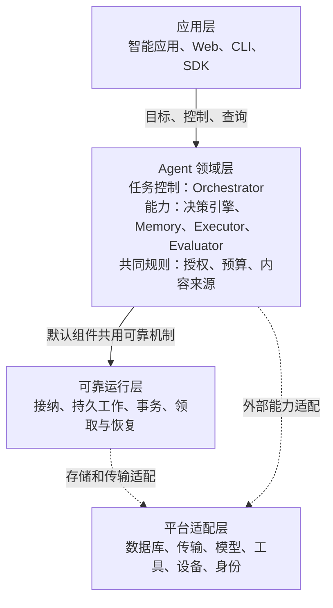

# Lerna 技术架构

Lerna 是面向智能应用开发者的 Agent 运行框架。它以可靠的任务运行内核，组织可替换的决策、记忆和执行能力，在用户授权与预算内，把目标持续推进为可核验的结果。模块可以运行在云端或设备上；网络连接、工作进程和界面的退出都不能使已经接纳的责任丢失。

本方案采用四层结构：应用层表达需求与交互，Agent 领域层裁决任务并提供能力，可靠运行层保存和恢复工作责任，平台适配层连接具体基础设施与外部系统。分布式部署和插件化扩展贯穿这四层。架构的核心取舍是：**稳定任务、效果、权限和证据的含义，允许推理、上下文、记忆和协作策略独立演进。**

文档日期为 2026 年 10 月 3 日，状态为待实现验证的设计方案。本文面向应用接入者、框架开发者和架构评审者，独立说明目标、契约和工程路径。本目录不依赖其他项目文档。设计选择不等于已有实现；外部研究也不证明 Lerna 已达到相应效果。

## 要解决的问题

| 编号 | 问题 | 架构必须交付的行为 |
| --- | --- | --- |
| G1 | 多轮决策和行动如何持续服务同一目标 | 保存目标、条件、进展与控制；跨轮次推进，只有当前条件满足才能完成 |
| G2 | 故障后怎样恢复而不盲目重做 | 保留原命令与操作身份，区分未发生、已发生和未知效果；原负责方继续核对 |
| G3 | 怎样替换能力而不破坏共同规则 | 提供组件接口、版本与能力声明、SDK 和跨实现一致性测试 |
| G4 | 端云和多个 Agent 怎样共同工作 | 明确每项事实的负责方、跨节点交接、委派限制、断连与恢复行为 |
| G5 | 怎样保证行动受控且结果有依据 | 在准入和实际启动时检查权限与预算；保存证据，支持用户补充、暂停、取消和接管 |
| G6 | 开发者怎样低成本接入并持续改善能力 | 提供默认实现和应用接口；用真实接入、配对评测和故障实验决定扩展与优化 |

首批服务对象是内部个人智能应用团队，同时交付可独立运行的开源实现。首阶段采用研究报告场景：接收问题与约束，获取真实来源，形成有引用的报告，写入指定位置并读回核验，过程中接受补充要求、暂停和取消。

完整能力还包括跨任务记忆、个性化、端云协作、内部与外部 Agent 委派、手机 GUI、未来触发与受控经验改进。首阶段不以这些能力全部完成为前提，开放某项能力时仍必须满足该能力的恢复和授权契约。

## 整体结构

图中实线表示使用或规则约束，虚线表示经声明接口使用具体适配器，不表示领域代码导入适配器实现包。一个框不是一个进程。第三方远程组件可以采用自己的持久引擎，但必须通过同一行为契约验收。可查看[独立架构图](assets/layers.svg)；图只说明逻辑关系，不表示跨模块操作自动处于同一事务。

领域层内部，Orchestrator 通过组件接口组织能力；授权、预算和来源规则在准入与真实入口处落实。详细分工见[架构与模块](architecture.md)。

“任务运行内核”由任务控制、必要的共同领域规则和可靠运行机制组成。代码中的 `runtime` 仅表示可靠运行层，不包含报告质量、目标理解等业务判断。

决策模块统一命名为“决策引擎（Decision Engine）”，代码名称为 `decision_engine`；`Decision` 继续表示一次具体决策记录。

## 怎样阅读与实施

| 读者要完成的工作 | 文档入口 |
| --- | --- |
| 理解分层、负责方和模块替换方式 | [架构与模块](architecture.md) |
| 实现目标推进、控制和完成判断 | [任务生命周期](task-lifecycle.md) |
| 实现事务、持久工作与崩溃恢复 | [可靠运行](runtime.md) |
| 开发决策、记忆、执行、核验或协作能力 | [能力模块](capabilities.md) |
| 建表、处理版本、设计保留与清理 | [数据与存储](data-model.md) |
| 接入应用或实现远程组件 | [接口与协议](contracts.md) |
| 实现权限、预算、安装、升级与回退 | [授权与扩展](governance.md) |
| 装配开发环境和生产部署 | [部署与运行](deployment.md) |
| 安排工程切片与验收 | [实施与验证](validation.md) |
| 评审方案取舍和重新选择的条件 | [设计决策](decisions.md) |
| 查核外部机制与学术证据 | [运行与协议研究](research-runtime.md)、[能力与评估研究](research-learning.md) |
| 确认本次交付检查了什么 | [文档检查结果](verification.md) |

首次阅读建议依次看本页、架构与模块、任务生命周期，再沿报告案例查看接口和存储。字段表属于参考，工程切片属于操作指南，研究页只解释证据与推断，不增加隐藏的实现要求。

## 六条共同约束

1. Task 代表目标与推进责任，Session 代表对话组织。回合结束、客户端退出和会话归档都不等于任务完成或取消。
2. 决策引擎提出下一步，Orchestrator 裁决是否采用，Executor 保存实际效果；任何模型文字都不能替代用户许可或目标系统证据。
3. 原命令重传仍是同一次请求。超时、工作者更换和线路切换不得自动创造新的行动身份。
4. 用户取消封闭新的目标工作；已发生或仍可能发生的效果、费用和清理继续由原负责方处理。
5. 模块、Skill 和子 Agent 只能在已有授权与预算内工作。安装或加载内容不授予资源访问权限。
6. 必要条件逐项满足才能完成。结果未知、预算用尽、远端返回完成或模型输出最终文本，都不能单独证明目标达成。

## 范围与保证边界

生产首版按分布式方式装配；开发可以单进程或本机多进程运行。默认云端负责任务权威状态，设备负责本机执行与补传。设备若需独立承担目标，必须显式部署独立 Orchestrator，不能在云端失联时自动接管原任务。

完整规模目标是千万注册、百万日活和十万同时在线；最终工具覆盖目标为 1000 个以上 API。首次调用正确率至少 90%、有限重试任务成功率至少 95% 是质量目标，必须在冻结的任务集、尝试次数、期限及费用上限内分别验收。它们不代表当前容量，也不用于推导未经测量的服务器数量。

框架不能为任意第三方系统提供外部动作恰好执行一次的保证，不能承诺撤销已发生的动作，也不能在缺少来源或独立真值时保证自然语言答案正确。无法满足的前提必须体现为等待、拒绝或结果限制，不能隐藏在成功状态后面。

## 约束用语与文档状态

“必须／不得”表示本设计的强制要求或禁止事项；“建议／不建议”表示默认选择，偏离时需说明影响；“可选”表示可以不开启，开启后必须遵守完整契约。本目录采用中文约定，不声明采用 RFC 英文关键词的正式语义，也不宣称符合某项标准。

本目录定义模块职责、行为与数据合同，不交付运行内核或完整线协议 Schema。发布前必须将选定接口转为同版机器契约、SDK 和合同测试。本文中的默认策略是设计选择，初始限额是待测配置；仍待取得的工程和效果证据集中列于[实施与验证](validation.md)。
