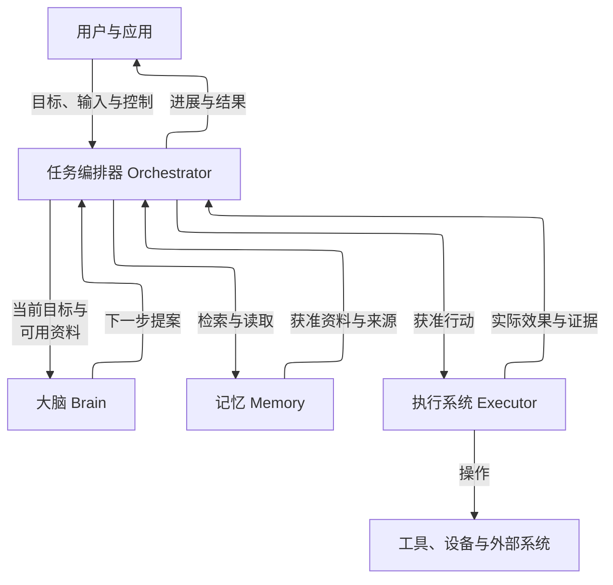
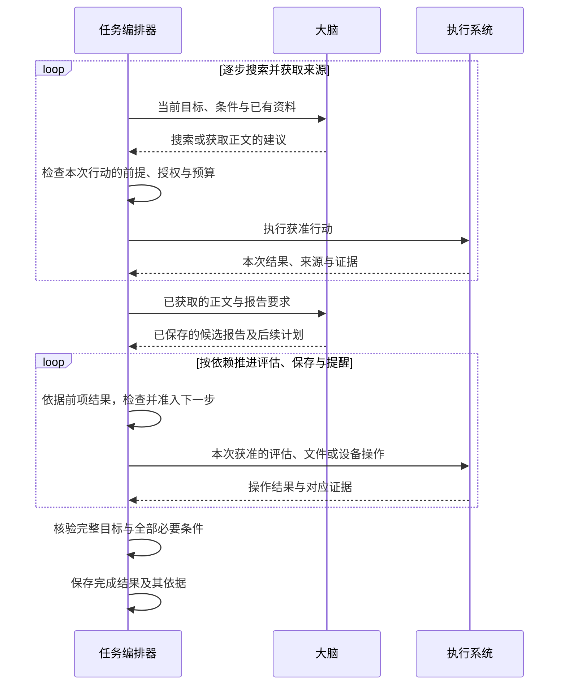
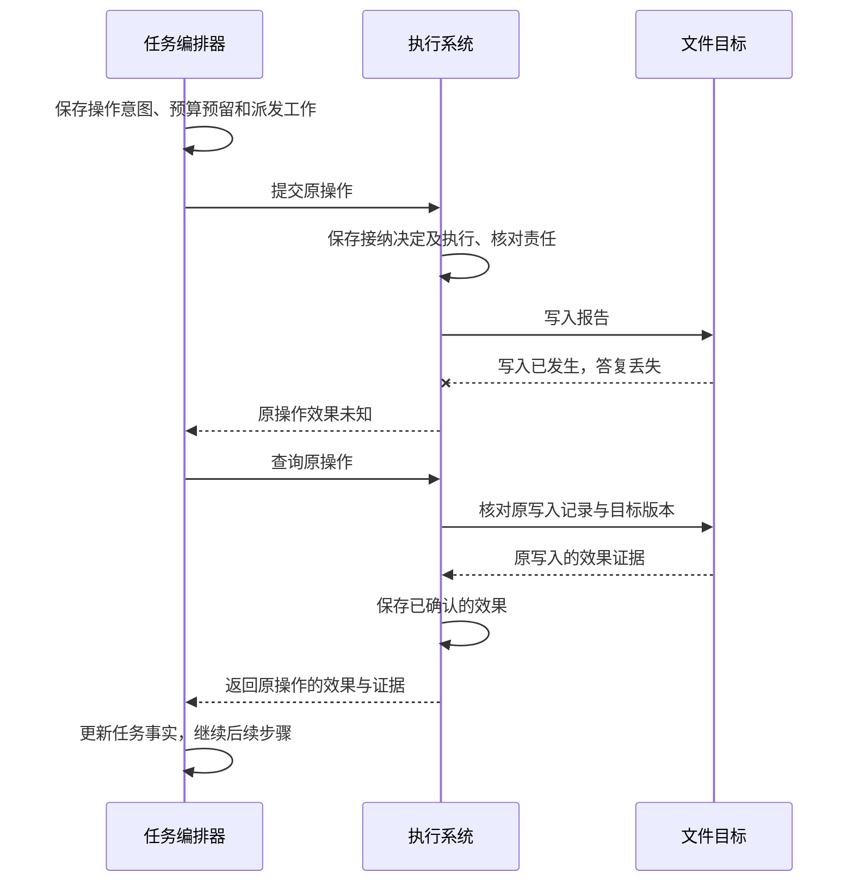
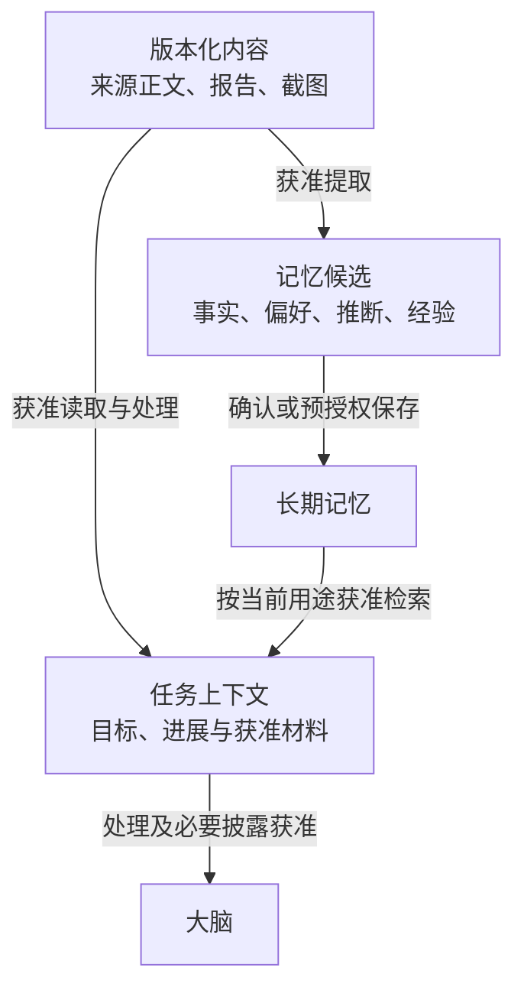
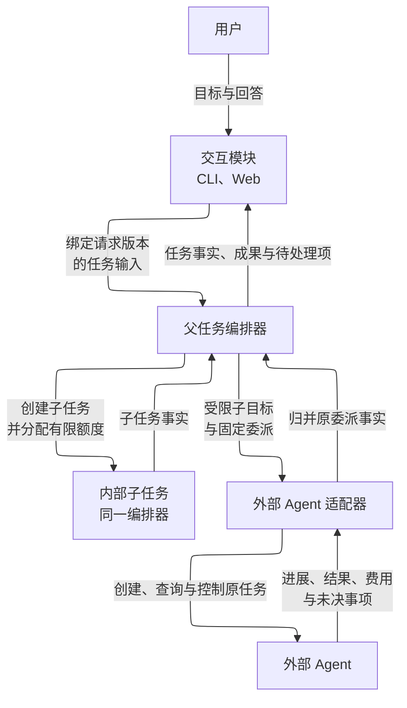
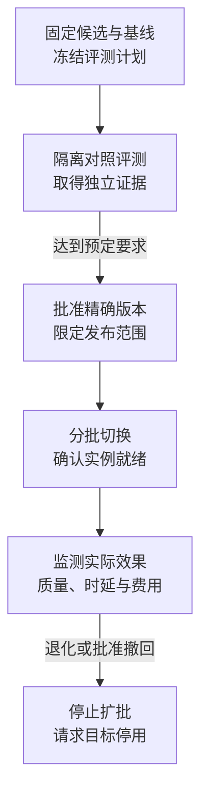
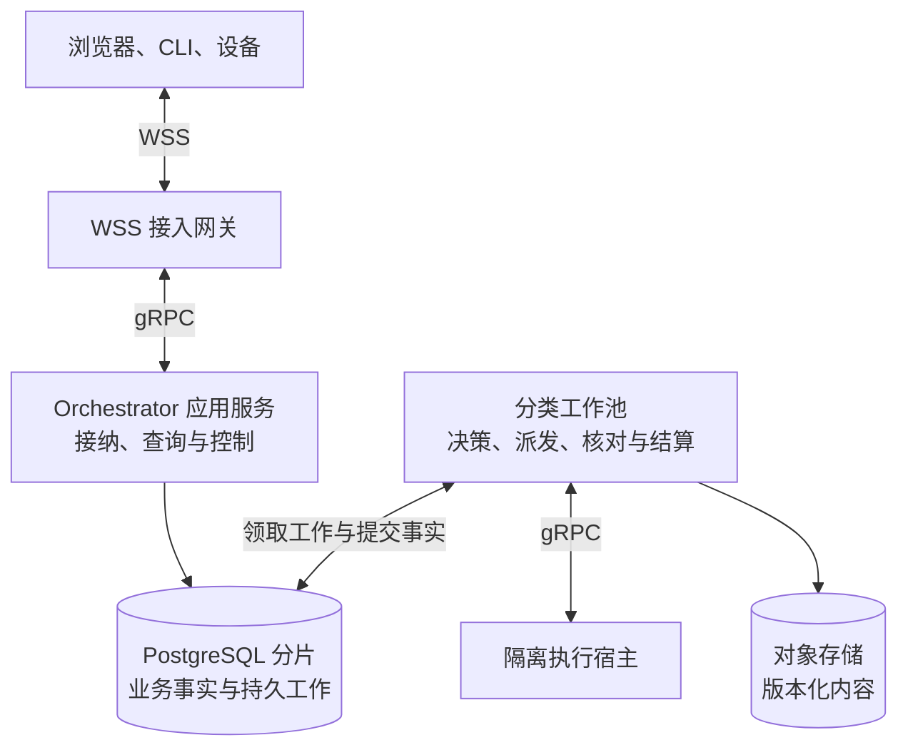

# Harness 技术架构总览

Harness 是面向个人智能应用的开源任务运行框架。它接收用户目标，由大脑提出计划和下一步行动，由记忆提供相关资料，由执行系统操作工具和设备，再由任务编排器组织这些能力持续工作。整套架构围绕一个目标展开：让 Agent 在授权与预算内推进任务，并让用户能够查看进展、判断结果和介入过程。

任务编排器（Orchestrator）负责组织一次任务，保存目标、进展和完成结果。每一轮，它把当前目标与可用资料交给大脑（Brain），检查大脑的建议是否符合目标、授权与预算，再将获准行动交给执行系统（Executor）。记忆系统（Memory）提供相关资料及其来源，执行系统回传行动的实际效果与证据。这些新事实成为下一轮决策的依据，直到满足完成条件，或进入需要用户输入、授权或依赖恢复的等待状态。

普通请求以 **Session、Task、Decision、Operation、Content、Grant** 六组对象组织。应用负责会话、提交、控制和结果呈现，内核负责决策、行动及恢复。六组对象表达不同的事实职责，不限定表或服务数量，也不要求应用逐项创建内部记录。

图中表示逻辑职责；这些组件可以装配在同一进程，也可以分别部署。

## 核心对象与职责归属

| 对象 | 负责方与固定关联 | 生命周期与查询 |
| --- | --- | --- |
| **Session：会话** | 交互应用保存消息身份、顺序、准确正文引用，以及原提交命令和 Task 的关联 | 建立、追加、归档与正文清理独立于任务；Task 初版至多固定一个创建来源 Session。首版采用线性消息，不新增公共 Session／Run 协议 |
| **Task：任务** | 固定逻辑 Orchestrator 保存目标、条件、修订、控制、预算、决策与操作关联 | 接纳后持续推进，最终为成功、失败或取消；通过 `task.read`、`task.result` 查询。终态后仍可核对原效果与费用 |
| **Decision：决策** | Brain 管理固定 `decision_id`、输入摘要、配置、提案和用量；输入快照由 Orchestrator 固定 | 一项 Decision 包含 0 或 1 次物理模型请求。提案完成不表示 Task 已采纳；通过 `brain.get` 查询原提案与用量 |
| **Operation：操作** | Executor 管理固定 `operation_id`、Invoke、能力绑定、尝试、结果与效果；Orchestrator 保存对应准入意图 | 接纳、实际启动、效果核清和费用结算分别成立；通过 `execution.get` 查询。效果未知时，Task 终结也不能删除原责任 |
| **Content：内容** | 原内容负责方保存准确字节、来源和当前使用条件；`ContentRef` 固定 owner、content_id、version、hash | 字节耐久后发布引用；引用可复用，读取须检查当前用途。关闭使用与物理副本清理分别完成 |
| **Grant：授权** | 原授权负责方保存许可、父链、撤销、原 `use_id` 的使用裁决及结算 | 可跨任务存在；`grant.check` 检查资格，`grant.use` 裁决本次使用，原使用查询与结算保留各自身份。撤销不改写已经发生的使用 |

一个 Session 可以承载多个 Task；一个 Task 可以跨多次用户回答、多个 Decision 和 Operation。关闭窗口或归档会话不取消任务，重新打开也不自动恢复暂停。界面中的 Turn／Run 可以按原提交、输入消费和回复分组，作为可重建视图，不再维护一套与 Task 并行的运行状态机。例如，补充同一目标的保存目录继续原 Task，提出另一个独立目标才创建新 Task。

记录是否保留独立身份，取决于它是否需要独立寻址、并发裁决、权限、保留期或跨父对象终态的责任。默认组织如下：

| 记录类别 | 组织方式与边界 |
| --- | --- |
| Task 内部记录 | 目标修订、Requirement、目标覆盖记录、可选 Plan、Snapshot、决策消费、OperationIntent、预算与 Result 通过 Task 组织；需要唯一消费和恢复的关联仍持久保存 |
| Decision／Operation 内部记录 | ModelCall、Proposal、Attempt、Effect、原始工具结果与用量由所属组件维护；不把各阶段压成一个含义模糊的 `completed` |
| 独立辅助责任 | InputRequest、InputSubmission、Confirmation、Surface、授权使用及内容副本保留原负责方和生命周期；不能随 Task 或会话正文级联消失 |
| 派生投影 | 列表、进度、会话摘要及呈现可以重建；参与裁决前必须满足所需的事实完整性与来源水位。已用于 Decision 的准确输入不能替换成最新视图 |
| 配置与绑定 | TaskPolicy、ModelProfile、Capability／Binding、检查规则和 InstallLock 引用准确版本；当前批准、授权和实例就绪仍须复查 |
| 公共工作记录 | Command／Receipt、Job／Claim、outbox 保存去重、有限领取与可靠交接；应用无需逐项管理，也不据此增设业务 Run |

同一物理事实保留一份权威正文，其他对象使用准确引用。字段和关联记录可以共表、共事务；不同负责方的裁决不能因共用一个界面或数据库就失去边界。

## 应用提交、观察和介入任务

应用首次发送前保存完整 Command、选定的逻辑 Orchestrator、原消息关联和待交付责任。服务发现用于首次选择和寻找原服务的可达实例；答复丢失后始终查询或重投原命令，不将同一提交转给另一逻辑编排器。消息已保存、服务已接纳、任务已完成分别呈现。

| 应用动作 | 接口与成功含义 | 中断或竞争后的处理 |
| --- | --- | --- |
| 提交目标 | `task.submit` 的 `applied` 表示 Task、原回执与首项工作已共同保存 | 先查原命令，再补会话与原 Task 的关联；不因关联尚未回写另建任务 |
| 观察与取结果 | `task.read` 取得状态、控制及等待；`task.result` 取得固定成果与依据；`content.get` 按当前权限读取准确正文 | 变化提示只触发重读；流式片段不充当正式结果，断线从原对象恢复 |
| 回答已有请求 | `interaction.request_read` 读取准确 InputRequest；`interaction.input` 接纳绑定请求版本的回答 | `applied` 只表示输入已持久排队；`interaction.input_read` 查询实际转交、消费或拒绝，由原业务负责方一次消费 |
| 撤回回答 | `interaction.input_withdraw` 对仍为 `queued` 的输入可原子撤回 | 已为 `sending` 时保存撤回意图并核对原目标命令；可能已经消费，不能立即显示为已撤回 |
| 暂停、恢复、取消 | `task.pause`、`task.resume`、`task.cancel` 保存相应任务控制决定 | 本地提交与执行端落实分别展示；恢复不清除其他等待，取消不证明在途动作已停止 |
| 修订目标 | `task.revise` 显式修改目标，递增相关修订并安排控制传播 | 旧提案失效；原操作及费用保持原关联，终态任务的新目标另建 Task |
| 接受成果 | `task.accept_result` 保存针对准确成果及限制的验收事实和后续核验责任 | `applied` 不直接表示任务成功，必要效果、目标覆盖和完成条件仍由编排器检查 |

普通消息、结构化回答和受信确认有不同的消费规则。Confirmation 由实际业务负责方创建和保存，绑定原方法、命令、意图摘要及本人决定，在实际业务事务中消费一次。预览固定准确内容版本；展示记录不能证明用户已经阅读，普通聊天中的“同意”也不能绕过所需的受信确认入口。

## 典型请求的数据流与读写边界

正常路径先发布准确目标 Content，再由应用保存原提交。Orchestrator 接纳 Task 后，读取当前目标、控制、配置、许可和必要资料，固定 Snapshot、Decision 身份、预留及派发责任。Brain 接纳并处理原 Decision，发布准确输出后返回提案。Orchestrator 消费提案、归并费用，按需要准入 Operation，或在全部完成依据齐备后共同保存 Result 与 Task 终态。应用最后补会话关联并呈现正式结果。

以下场景固定模型回放、工具和存储口径，便于比较不同实现。A、B、D 均为已有会话中的新 Task，使用已登记的受限目标模板完成确定性覆盖映射，必要条件也可由本地确定规则检查；无标题生成、额外摘要、模型评估、澄清或重试。这一前提同时覆盖“条件集合没有漏项”和“每个必要条件通过”，不能仅由后者推导前者。

| 场景 | 决策与行动顺序 | 含模型的 Decision／工具 Operation | 必要读写 |
| --- | --- | --- | --- |
| A：直接回答 | 固定输入 → 一次决策 → 核验并固定结果 | 1／0 | 读取当前任务依据与获准上下文，发布回答 Content，保存决策消费与结果 |
| B：读文件后回答 | 决策提出读取 → 原只读操作返回 → 第二次决策回答 | 2／1 | 在 A 的基础上保存读取意图、预留、执行接纳与结果；实际读取一次目标文件，发布获准正文，再固定第二轮输入 |
| C：冷恢复 | 重建原历史、提交关联和未决责任，达到可查询状态 | 重建阶段不发起新的模型或工具行动 | 读取原命令、Task、Decision、Operation、控制及账务，按需要补关联、投影和恢复作业；之后的合法续行另计 |
| D：保存并独立读回 | 决策生成报告并提出保存 → 第二次决策提出读回 → 第三次决策形成说明 | 3／2 | 固定报告版本与目标路径，执行一次保存和一次独立读取，核对实际目标字节与报告，再固定结果 |

D 特意固定三轮模型回放，并非最少轮数。结构化计划或确定性续行可以采用另一条实现路径，但应报告实际调用数。独立读回必须访问目标文件；回传原写入参数、模型缓存或保存回执不能代替它。C 的后续续行仍检查当前控制、许可、预算和就绪，不从历史 `active` 或重新打开 Session 推导启动资格。

任意自然语言目标的覆盖检查按固定规则作语义评估。需要新的模型判断时，按普通 Operation 准入、保存报告并计费；仍适用的既有覆盖报告可以复用。覆盖核验、成果质量检查及辅助推理的实际请求、读取、发布和结算均另计，不能为维持表中轮数而省略，也不能只数 Brain Decision 就得到整项 Task 的模型调用总数。

Brain 每个有模型的正常 Decision 包含接纳、ModelCall 准备、`send_started`、输出终态四个基本持久阶段；准备与可能发送分别提交。Executor 每个正常 Operation 包含接纳、Attempt 准备、结果归并三个基本阶段，实际资源入口的门禁另计。因此 A／B／D 的 Brain 基本阶段为 4／8／12，Executor 为 0／3／6。**这些数字不是请求总事务数、SQL 次数或 fsync 次数。** Task、许可使用、内容发布、领取、呈现与迟到结算均须独立计量。

| 可共同提交的决定 | 必须保留的边界 |
| --- | --- |
| 应用消息、原 Command 与交付 outbox | 跨库 Task 接纳后再补关联；原回执查询保证恢复 |
| Task 接纳、目标、预算、回执与首项 Job | 必需正文先发布；网络和内容存储不进入可重跑事务 |
| 提案消费、操作意图、预留与派发 Job | Executor 保有独立接纳事实；本地共事务须有明确的受限事务参与接口 |
| 一次领域阶段内的事实、费用和后续责任 | 不能合并有真实先后依赖的模型发送、实际执行与结果取得 |
| 事实归并、条件选择、Result 与终态 | 只在全部证据已经取得且可合法完成时合并，不能先成功再补证据 |
| 已耐久正文的元数据、来源和准确引用 | 对象存储与业务库没有默认原子性；保留原上传／发布身份及孤立内容清理责任 |

实现测量需分别记录元数据读、当前资格检查、准确字节读、目标系统读写、逻辑记录、事务、sync、字节和物理 IO。流式片段可有界合并；当前投影可减少历史读取；新增摘要或修复模型请求独立准入并计费。具体的固定输入与继续条件见[任务推进与控制](ochestrator/task-lifecycle.md)，发送和恢复规则见[持久工作与恢复](ochestrator/durable-work.md)。

## 从用户目标到任务条件

以“比较 A、B 两个软件版本的差异，附上来源，保存报告，再在模拟手机上创建提醒”为例，编排器先保存原始目标，再记录判断任务完成所需的具体要求，称为**任务条件**。大脑可以帮助梳理这些条件；编排器保存独立的目标覆盖检查责任，核对完整原要求与全部条件的映射，并保留用户明确提出的约束。

| 用户要求 | 判断完成所需的依据 |
| --- | --- |
| 比较准确、覆盖指定范围，并附来源 | 实际获取的来源内容与时间，以及针对这份报告的质量评估 |
| 报告保存到指定目录 | 准确的保存位置、写入结果，以及与报告内容匹配的读回证据 |
| 提醒内容正确且已创建 | 获准使用的目标设备、准确内容与时间，以及动作前后的观察和目标记录 |

内容质量与外部效果分别判断，每项必要条件都要满足。保存目录不明确时，先取得用户输入；创建提醒尚未获准时，先取得相应授权。这些等待及其原因也进入任务记录，供条件补齐后继续推进。

## 在决策与行动之间推进任务

条件明确后，大脑根据当前资料提出下一步，编排器检查并安排执行，再把取得的新事实交给大脑。对于依赖关系已经明确的后续步骤，大脑可以提出计划，由编排器在前项结果到达后逐步安排；每一步仍须检查当前目标、授权与预算。

Brain 默认规则优先，按已知阶段固定一个模型配置：规则完整覆盖时零模型调用，未覆盖才进入已选模型；规则冲突须先修复。开放理解和综合使用通用模型，固定答案类型判断作为验证后启用的可选路径，拒判升级另建 Decision 并受原链及累计限额约束。具体分支见[决策路径与升级](ochestrator/task-lifecycle.md#decision-paths)。

报告正文按准确版本保存，质量评估、文件写入和读回都引用或核对同一份内容。评估未通过时，需要补充来源或修改报告，再取得相应依据；新版本不能沿用旧版本的通过结论。手机上的观察和每一次动作也分别推进，依据实际界面变化决定后续操作。

图中的评估包含当前需要的目标覆盖与成果质量判断；最后汇总采用已经取得且仍适用的报告，需要新评估时先经过行动准入。目标覆盖不足和条件不通过分别保留缺口，不在“提交完成”事务内隐式调用模型。

## 中断后，沿原操作继续核对

一次经编排器准入的有界行动称为**操作（Operation）**，例如写入一份文件或执行一次设备动作。每项操作都有固定标识，关联准确输入、目标和后续核对责任。编排器决定派发时，将操作意图、预算预留和后续工作一起持久保存；执行系统接纳后，也保存自己的执行与核对责任。进程重启后，接替者从这些记录继续处理原操作。

假设报告已经写入，但文件系统的答复丢失，执行系统此时无法确认写入效果。恢复首先查询原操作及其目标证据，保留原来的操作身份。下图展示能够取得可靠证据的一条恢复路径：

证据不足时，系统保留“效果未知”，并记录继续核对所需的条件。可以安全重放的请求仍按原操作恢复；更换操作标识、工具或执行端，不能绕过尚未核清的效果。自动核对有次数和期限上限，耗尽后保留原记录及待处理原因，交由后续恢复或用户介入。

一次 Operation 可包含声明允许的有限分页或下载，但每次真实请求均计入原次数、字节和费用上限。准入前固定所有业务参数变换，驱动仅按准确映射编码并在真实出口检查目标与用途；原结果保留分页、截断、时间、媒体缺项及费用范围。工具返回成功不自动证明读取完整，摘要和临时片段也不能代替效果证据，详见[驱动与结果归并](ochestrator/durable-work.md#driver-dispatch)。

## 用户控制怎样影响正在运行的任务

用户暂停、取消或修改目标时，编排器先保存该决定，再向相关执行端传播控制变化。界面分别展示编排器的决定和各执行端的确认情况；已经发出的动作仍可能完成，失联端的停止情况需要等待核实。

| 用户控制 | 编排器如何处理新工作 | 原操作如何收尾 |
| --- | --- | --- |
| 暂停 | 停止发起新的决策、评估和行动，等待恢复 | 继续核对效果与费用；若此前取得的证据已经满足全部完成要求，仍可记录成功 |
| 取消 | 终结目标推进，关闭新工作 | 继续核对效果与费用，迟到结果不改变任务的取消状态 |
| 修订目标 | 保存新目标，使尚未启动的旧目标工作失效 | 保留已有操作；与新目标冲突的在途效果须先核对，再安排后续行动 |

例如，用户在报告写入答复丢失后取消任务，编排器停止推进创建提醒，并沿原操作核对报告是否已保存。随后确认写入成功，只会更新原效果及相关费用，任务仍保持取消状态。核对本身也遵守当前授权；权限或依赖不足时，系统保存等待原因。

## 完成结果说明依据与局限

编排器提交成功结果前，先检查目标覆盖记录绑定当前完整目标及全部条件、当前适用且判定通过，再核对必要条件、成果版本和仍未核清的效果。目标覆盖记录固定规则、实现、报告和 coverage_revision；缺报告、遗漏或条件变化均阻止直接成功。具体事务与失效规则见[完成核验](ochestrator/README.md#completion-verification)。

| 完成依据 | 含义 |
| --- | --- |
| 客观验证（`verified`） | 每项必要条件都有适用的确定性验证，且对应当前目标与准确成果版本 |
| 质量评估（`assessed`） | 必要的外部效果已经证实，开放质量由固定规则与评估实现判断通过；结果说明评估方法及其局限 |
| 用户验收（`user_accepted`） | 必要的外部效果已经证实，用户正式接受准确版本的成果及可见限制，以此满足允许由用户验收的质量条件 |

混合条件按必要条件中最弱的依据标记：包含用户验收时采用 `user_accepted`，否则包含质量评估时采用 `assessed`，其余才采用 `verified`。在贯穿场景中，即使文件与提醒都有确定的效果证据，报告质量仍依赖评估，因此整体结果标为 `assessed`。

用户验收可以解决允许由其判断的质量问题，尚未确认的写入或提醒效果仍须核清。必要条件未满足时，系统可以交付部分材料，并说明剩余缺口；任务继续等待或以失败、取消结束。

`verified` 描述已固定客观条件的依据，目标覆盖若采用语义判断仍须单独说明方法和限制。普通 assessed 未做专项校准时披露局限；高影响用途须具备 TaskPolicy 要求的独立证据，不能缺证据时自动降级。已登记判断缺陷通过与完成事务共用的门禁生效，不能等待投影扫描后才阻止错误成功；已固定 Result 保留并追加独立说明，见[证据门禁](ochestrator/README.md#evidence-gates)。

## 资料按用途进入上下文和长期记忆

**任务上下文**是编排器为当前决策选取的目标、进展、证据和相关材料；**长期记忆**是取得独立保存许可、可以跨任务检索的事实、偏好、推断或经验。来源正文、报告和截图作为可按准确版本引用的内容，供任务和记忆使用。从资料中提取长期记忆时，先形成候选，再由用户确认，或在有限预授权范围内保存。

权限与隔离模块保存授权及其使用、撤销记录，将许可限定到具体资源、用途、接收方、期限和额度。读取、模型处理、长期保存、跨端同步和对外披露分别检查授权，实际使用入口落实这些限制。用户可以允许资料在本机参与当前任务，同时限制长期保存和远端使用。

资料的摘要、推断和其他派生内容继续保留来源限制，每次使用都要核对当前权限。用户可以纠正、限制或删除记忆；系统分别展示删除决定和各副本实际清理的进度。

### 候选写入、时间与纠正

提取先固定有界输入和读取、处理、候选暂存及预算依据，再形成值得跨任务保留的候选；短期进展留在 Task。候选尽量表达一个可单独纠正的断言，或前提完整的一份经验，性质仍为 fact、preference、inference 或 experience。正文保留主体、否定、范围、时间及其依据、来源片段；事件时间未知时不填提取时间，经验另记录环境／工具版本、真实动作、核实效果和复用前提。

候选发布前分别检查新信息覆盖、原语义保留及来源支撑，再比较重复和冲突。内容相似只产生比较建议，不自动合并不同时间或范围的记录；模型猜测不覆盖正式 Memory。明确纠正通过绑定准确旧修订的 replace 处理，依赖经验进入 needs_review。最后复查保存许可及来源状态，满足有限预授权和质量要求才自动保存，其余按原逐条确认流程处理。额外语义检查的调用、用量和产出归入原有界处理责任。

### 检索基线与可选优化

| 配置 | 使用方式与启用条件 |
| --- | --- |
| B0 字面基线 | 默认按 Unicode 字面匹配、范围和时间排序，无嵌入模型；作为可恢复对照 |
| B1 中文词法 | 比较字符二元组和 ASCII 词元，保留精确 ID／原词通道；切分与排序规则固定，经中文、否定、代码及混合语言用例验证后启用 |
| B2 混合候选 | 在 B1 上增加获准语义召回和固定 RRF 融合；依赖模型、来源治理、质量及完整成本证据，默认不启用。首轮实验使用本地编码器和既有 PostgreSQL 的精确向量计算，不新增独立向量库 |

查询先确定 tenant、owner、scope、purpose 和 recipient 对应的获准处理集合，再在有限集合内计算候选；仅按租户过滤或检索后过滤不足以证明处理合法。空 text_terms 沿已定义的范围查询，不嵌入空串或隐式调用模型改写问题。词法和向量分别保存变更水位并补扫缺口，共享候选、扫描、字节、耗时及调用上限；词法补扫不能宣称补齐语义召回。

查询冻结准确版本与排序，后续页不追加模型调用或悄悄换策略，并按当前状态、来源与披露权限返回 partial、changed、gaps。向量分支在查询建立后失败须显示降级；缺失向量交原 IndexWorker，query 不临时取得索引写职责。可选显式关联只做获准的一跳展开，每项仍消耗同一预算，不能把排序分数当事实可信度。

本地嵌入固定模型、tokenizer 和原输入，关闭网络及隐式持久缓存；每次真实重算记录 attempt、use 和本地资源用量，确认旧计算结束后才释放占用。查询向量按原处理期限清除，索引向量、摘要和关系投影纳入来源关闭及清理责任。读时经验整理按当前需要读取仍获准原文；原文不可用则说明复核限制，经验只提供建议，后续动作继续检查当前观察和准入。任意时点的完整历史查询及自动经验转可执行流程不作为默认能力。

## 用户与其他 Agent 怎样参与任务

交互模块通过 CLI、Web 等入口呈现任务进展、成果和待处理项，并转交用户输入。回答绑定原请求及其版本，由相应业务负责方确认生效；涉及成果验收时，还要绑定准确的成果版本。断线后，界面读取当前状态并查询原输入的处理结果。界面也可以独立承载记忆管理，关闭页面不会取消任务。

协作模块把一个有界子目标交给其他 Agent，同时限定可用资料、权限、预算和期限。内部子任务默认与父任务共用编排器；外部 Agent 保有自己的运行时，通过适配器建立原委派与远端任务的固定对应关系。另一编排器管理的 Agent 也按外部委派处理。

例如，研究 Agent 可以负责核实两个版本的 API 差异，父任务继续负责整份报告与提醒目标。子结果交回后，父任务仍按自己的条件核验，并检查子任务是否已结束目标行动、相关效果是否已经核清。外部创建答复丢失时，适配器沿原委派查询同一个任务，保留额度和核对责任。

## 组件替换与版本演进

大脑、记忆和执行系统通过共同契约独立替换。契约明确输入输出、权限要求、成功含义和失败后的查询恢复方式，使更换组件后，任务的控制与完成规则保持一致。

插件（Plugin）携带组件代码或适配器，Skill 提供操作知识和流程。扩展与宿主模块负责安装、装配和版本切换，用不可变的**安装锁定清单（InstallLock）**固定实现、依赖和配置；任务引用这份清单，使用确定的版本。默认装配内置或经审核的代码，安装本身不授予用户数据和设备权限。

### 能力发现与 Skill 材料加载

| 路径 | 采用方式与必须保留的依据 |
| --- | --- |
| 小目录直接装配 | 提供有界的准确能力声明和固定 Skill 材料，记录实际可见及被裁剪项 |
| 大目录检索后描述 | 先 search 候选再 describe 准确 Capability／Binding，保存候选范围、排序、同名歧义、未召回及描述缺口 |
| Skill 元数据后正文 | 先读用途、适用／不适用条件和依赖，按实际需要加载正文，记录选择、加载时点、实际采用及未使用原因 |

以上改变选材方式，不新增目录服务或 SkillRouter。Skill 与 Agent 配置的准确制品须包含支持任务、前提、反例、工具／证据依赖和冲突退出规则；名称或关键词只定位候选，常规数据型材料不会因加载成为受信指令。适用性和选择诊断由实际处理组件记录，不能由模型自述替代已加载事实。

缓存按准确版本和查询范围建立，并复查当前来源与权限；同名内容不共用身份。配置变化、撤权、依赖或来源关闭后，旧缓存不允许新使用；原 Operation 保持准确绑定，目录不可达时只继续仍能核验当前资格的原工作。实际行动仍检查完整 Schema、Binding、批准、实例就绪和数据用途。

策略比较固定候选集合、模型、提示预算、权限和环境，分别统计未召回、选错、加载过晚及加载无收益，并计入 search／describe／正文读取、新增模型回合、时延和维护成本。提示 token 减少仅是过程指标，任务质量和完整成本达到既定门槛后才启用新策略。

### 发布、实际就绪与回退

观测、评测与改进模块记录获准的诊断信息，比较质量、时延与费用。兼容发布由契约符合性证据支撑；宣称能力改善的发布，还要固定候选、基线和评测规则，在隔离环境中比较，并用未参与候选选择的独立测试集确认。下面展示改善发布的路径：

发布批准、实例实际就绪和旧版恢复分别确认。回退时，须核验旧版的独立批准仍然有效、当前数据格式兼容，再确认旧版实例已经就绪；条件不足时保持停用并报告恢复缺口。已有外部效果、未结费用及其核对责任继续保留。

## 逻辑职责怎样映射到端云部署

每个任务都固定归属一个逻辑编排器。同一用户的不同任务可以属于不同编排器；一个编排器可以由多个共享原账本的服务实例承载，工作进程重启或被替换不会改变任务归属。模块划分表达职责，部署划分则考虑连接规模、任务负载、隔离和共同提交的范围。

生产基线为单地域三个可用区，连接接入、Orchestrator 应用、分类工作池和隔离执行宿主分别部署。默认核心采用 Go；端云通过 WSS 双向通信，独立服务之间使用 gRPC，同一进程内直接调用接口。

PostgreSQL 保存业务事实和需要继续履行的工作，对象存储保存正文、截图等内容字节。工作池从原账本领取工作，数据库扫描负责重新发现尚未完成的责任，通知用于加速唤醒。需要共同决定的业务状态与后续工作仍在同一本地事务中提交，跨数据库交接则分别保存原命令、回执和恢复责任。

开发采用单体及本机 PostgreSQL 多进程装配，单体另提供独立 SQLite 存储适配，验证同一套领域规则。大脑、记忆和执行组件可以分别部署在本机或云端；依赖与授权权威齐备的全本地任务可以离线运行。云端编排器失联时，端侧只能在有效许可范围内完成已接纳的有限操作，另一端不会自动接管同一任务。设备入口的自动写恢复另须满足[原发送者隔离与效果核清](ochestrator/durable-work.md#device-recovery)。

## 按需能力与实现边界

普通问答和工具任务采用前述核心流程。跨任务、跨调用或独立管理的能力只在启用时引入相应记录，不要求每个请求同时创建全部对象。

| 能力 | 必须保留的语义 | 交付边界 |
| --- | --- | --- |
| 历史分支与自由输入调度 | 分支固定原消息、来源截止位置与配置；输入必须明确原目标、投递时机、撤回和结束范围 | 首版为线性消息及绑定 InputRequest 的回答。完整分支、steering／follow-up 和多队列需补公共合同；fork 不复制活动操作、授权使用或预算，也不回滚外部世界 |
| 子 Agent 与可复用子会话 | 固定父子关系、原委派、额度及控制范围；持续子会话与一次激活分开 | 内部子 Task 与外部 Delegation 分别履责；等待超时不取消，多次激活需明确合同，旧激活结果不能结束新激活 |
| 未来及周期触发 | Schedule 管理规则与启停，每次 occurrence 固定原命令及交付责任 | 尚需公共 Schedule 合同；Job 只推进已保存的责任。规则停用阻止后续触发，已接纳任务按自身控制处理 |
| 可复用执行环境 | 环境实例、准确配置、资源占用及实际停止分别核实；检查点声明覆盖范围 | 按具体 Executor 能力启用。逻辑取消不证明进程退出，计算检查点不恢复外部效果，也不默认反序列化任意对象 |
| 长期 Memory | 独立保存许可、准确修订、来源及纠正关系，关闭来源后的影响传播可恢复 | 普通请求可不启用；偏好纠正沿记忆修订处理，不走软件发布流程 |
| 扩展与改善发布 | 固定 Plugin／Skill、InstallLock、评测计划、批准范围和当前实例就绪 | 默认静态装配已批准能力；动态发现、热切换和改善评测按需启动，不混入每轮任务 |
| 跨端预算与设备资源 | 双方原分配身份、不可再消费证明、设备实例和资源控制代次 | 未确认封账不回收未知额度；重新配对不继承旧使用，失联不证明资源空闲 |

## 工程落地与验收

本文描述目标架构，可运行内核、默认组件和 SDK 仍待实现。代码采用单仓库、初期一个 Go module；核心、默认组件、Go／TypeScript SDK、CLI／Web、部署适配及验收资产同版维护。公开端口集中在 api、runtime 和 sdk/go，内部实现按领域隔离；生产进程按接入、应用、工作池和执行宿主独立装配，目录划分不产生额外服务。

### 参考技术栈与外部接入

| 范围 | 默认实现及边界 |
| --- | --- |
| 核心与 CLI | Go，以标准库为主；Go SDK 随初期单 module 发布，内部领域包不作为稳定扩展接口 |
| 传输 | net/http 承担 HTTPS 认证、发现和内容字节，coder/websocket 承担 WSS，grpc-go 与官方 Protobuf runtime 承担服务间调用；gRPC 用 Protobuf 外壳携带严格 JSON，保持一套领域字段定义 |
| 数据库 | PostgreSQL 使用 pgx／sqlc 显式 SQL；SQLite 使用 modernc.org/sqlite、database/sql 和独立查询；goose 管理分方言迁移。两种存储分别验证提交未知、领取及并发，不依靠驱动自动重跑业务闭包 |
| 字节与工作 | 本地不可变文件库和生产对象存储适配承载 Content，文件效果目标独立管理；原数据库 JobStore 承载有界工作，通知仅加速唤醒 |
| 协议校验 | Go 严格 JSON 解析与 JSON Schema 2020-12 校验，TypeScript 使用同版 Schema 和 Ajv；固定本地契约及格式断言，不动态装载远端 Schema |
| 浏览器 | React／TypeScript／Vite、pnpm workspace；SDK 使用原生 WebSocket、IndexedDB／idb 保存原命令与恢复责任，UI 调用 SDK |
| 模型 | 方舟 OpenAI 兼容 Chat Completions 与 openai-go 适配器；固定端点、凭据引用、模型 profile 及可核验版本，关闭 SDK／代理透明重试，未知结果与费用沿原调用保留 |
| 搜索 | Execution 接独立豆包 WebSearch，正文获取另走获准 HTTP 驱动；模型 profile 默认不启用提供方内置联网工具来绕过逐行动准入 |
| 身份与观测 | 本机受限 dev 测试身份，生产 OIDC 公司身份适配；slog／OpenTelemetry 输出获准日志与指标，遥测不替代业务账本 |

协议入口在普通解码丢失信息前检查原始 JSON 的重复键、Unicode 和数字，以及 Protobuf 的重复或非法字段，再执行 Schema、方法关联及规范化校验。金额按声明单位使用十进制，安全整数在浮点转换前检查；生成类型匹配不证明权限或效果。Go 与 TypeScript 共用正反例，浏览器不能只依靠 JSON.parse 后校验。库不能兑现原始编码检查时更换解析实现，不放宽合同。

浏览器 IndexedDB 事务确认成功后才首次发送，持久保存失败则拒绝新发送；刷新或断线查询原命令，本地记录丢失不能换身份补交。测试覆盖断连、输入竞争、确认过期和本地存储失败。依赖版本由构建、契约及适用运行测试验证后固定，分别维护 Linux／macOS、amd64／arm64 的实际支持范围。

搜索与模型使用独立凭据。搜索驱动固定查询、筛选和数量限制，检查 HTTP、业务错误及结果，分别保存 URL、摘要、发布时间和可选正文的存在情况；接口错误不能当作成功空集。选中的 URL 经独立正文获取，记录实际字节、抓取时间、截断和解析缺口，不用搜索摘要补成已读全文。所有物理重试和费用另计，超时不证明未调用或不收费。

### 开发与公司平台边界

开发先用配置文件、静态发现、进程脚本和可选 Compose；不建设公司调度、扩缩容或监控控制面。宿主预留角色启动、实例发现、健康、排空、身份凭据、存储、时钟及观测适配，后续由公司平台接入。健康区分存活、恢复中、可接纳和排空；平台认证只建立主体与租户，Grant、确认消费和当前披露仍由业务负责方裁决，生产拒绝 dev 身份。

排空按角色停止网关新握手、应用新接纳、worker 新领取和执行端新启动，同时在退出期限内保留查询、控制及原责任收尾。超时退出不把在途动作标为已取消；下一实例沿原账本恢复。平台启动成功或数据库提升不能代替旧写者隔离、原历史完整性与准确组件就绪，具体见[恢复与就绪](ochestrator/durable-work.md#recovery-readiness)。

### 实施阶段与退出证据

105 个既有领域方法按切片实现，第一条任务无需等待全部方法就绪；未实现方法明确返回不支持，契约及示例保持同版完整。先贯通单进程下的 Task、规则 Brain／固定回放、Grant、Content、受管文件保存与独立读回，再引入真实模型、Web、本机多进程及生产证据。

| 阶段 | 范围与退出要求 |
| --- | --- |
| 一：可运行闭环与本机恢复 | 同版 Go／TS 契约、CLI／SDK、首装兼容证据及最小批准／就绪；PG 与 SQLite 均通过适用持久工作故障用例，PG 至少两个工作者验证竞争。贯通文件链、真实模型费用、Web 持久输入及本机网关／应用／worker／执行宿主；回放通过不替代真实接入证据 |
| 二：联网、模拟手机与记忆 | 联网获取真实来源；至少三台状态独立的模拟手机验证观察、动作、本人接管和未知效果；默认记忆验证提取、纠正、限制、删除与副本清理。另测租户公平、容量上限及控制保留容量 |
| 三：替换、端云与组合故障 | Brain、Memory、Executor 各有第二种独立实现，至少一个异构语言组件通过契约；验证本地编排＋云能力、云编排＋端能力，再接外部 Agent、离线额度及受管副本。换端口或本地 Brain 调云模型不等于独立替换或远程 Brain |
| 四：受控改进与目标规模 | 固定样本与实验臂、独立测试、发布批准、逐目标激活及独立旧版批准回退；完成最终 API、质量和规模目标。优化候选经对照证明收益后启用 |
| 首次生产上线 | 独立于开发阶段安排，冻结实际开放能力及负载；验证进程分工、租户隔离、同步耐久、旧主隔离、时间、内容介质、排空及故障剩余容量。取得单区故障恢复证据，未实现能力保持关闭；较小首发负载不取消最终规模目标 |

缺公司平台或真实模型凭据时分别登记待接入、待验证，独立切片可继续推进。单体和本机多进程证据不能替代跨可用区故障实验；数据库及原文件根缺失不以新空库或空目录完成验收。

### 量化目标与统计口径

| 建设目标 | 验收口径 |
| --- | --- |
| 1000 个以上 API | 按语义不同的操作及准确声明计数，版本别名、账号和重复包装不重复计数 |
| 首次调用正确率 ≥90% | 冻结任务集，同时判断能力选择、参数、资源、权限及目标适配，不能只检查 JSON 合法 |
| 有限重试后任务成功率 ≥95% | 预先固定重试、期限与费用，失败、超时及未知效果均进入分母，不剔除难例 |
| 最终规模 | 千万注册、百万日活、十万同时在线；另测任务到达率、活动任务、模型请求、写入和内容负载，空闲连接不证明任务处理容量 |

生产首轮指标在固定租户、负载和一个月统计窗口下验证，属于试验目标，尚非服务 SLA：

| 指标 | 目标与适用边界 |
| --- | --- |
| 接纳、控制提交及权威查询接口可用性 | 各自 ≥99.9%；按调用和失败时段分别统计，业务接纳另列，不合成最终成功率 |
| 同地域接纳／控制提交时延 | p95≤300ms、p99≤1s，包含本方依赖与复制等待，不包含模型运行或离线设备确认 |
| 单可用区故障 | 已确认账本 RPO=0，原 Orchestrator 控制／查询 RTO≤60 秒；新工作开放另计。多区永久损坏、软件错误和外部效果不在该保证内，整地域灾难另行验证异地恢复 |
| 可运行工作的领取等待 | 控制／核对 p99≤2 秒，普通推进 p95≤5 秒；明确等待用户、设备或预算另列，平台无容量不能伪装为业务等待 |
| 在线控制与内部恢复 | 当前在线健康入口的控制传播、单应用故障内部重绑各 p99≤5 秒；WSS 保持比例另报，控制到达不证明动作已停止 |

每次 command、query 和 receipt_lookup 按调用方观测独立计量，初始确定结果截止最多 5 秒或调用方更早期限；内部尝试不增加外部样本，重连后重新调用是新样本。超时或结果未知仍记为该次接口失败，随后原回执查询成功只补充业务事实。业务接纳按原逻辑服务、租户及 command_id 去重，期限内已提交但答复丢失可以是“已接纳、接口超时”。

合法请求因过载、依赖或内部故障失败计入接口不可用，约定的用户权限／额度拒绝单列。初始每 5 秒探测接纳、控制和权威查询，缺失样本标为未观测；同时报告超时比例、失败区间、最大未决责任年龄、重绑触发快照数和发布断连数。内容按摘要核对，目标文件及外部动作另取证，数据库 RPO=0 不证明外部系统恰好执行一次。

### 行为与组合故障验收

下列验收组规定应观察的行为。测试要固定模型回放、输入、目标初态、配置、存储装配及故障断点，分别记录正常路径与恢复路径；文档审查不等于运行通过。

| 验收组 | 必须观察的结果 |
| --- | --- |
| CM-01：直接回答 | 一个原提交建立一个 Task；提案完成后经过条件核验，固定准确结果；调用及持久阶段分别计量 |
| CM-02：读后回答 | 一次实际读取的原结果和来源进入第二轮输入；通知重复不重复准入工具 |
| CM-03：冷恢复 | 原历史、关联和未决责任可查询；重建与后续续行分段计量，当前资格缺失时不启动新工作 |
| CM-04：保存并读回 | 写入、独立读取和条件通过分别可核验；写答复丢失沿原操作核对 |
| CM-05：会话与多个目标 | 同一提交不重复建 Task；关闭会话不取消；旧结果不覆盖同会话的新任务 |
| CM-06：输入消费与撤回 | 请求版本和目标命令固定，一次消费；queued／sending 撤回竞争不虚报结果 |
| CM-07：继续权与完成 | 控制、限额和可信新输入共同约束续行；覆盖缺报告、条件漏项、缺陷先提交或未决效果阻止成功，重复反馈不增加进展 |
| CM-08：决策与辅助推理 | 原 Decision 最多一次物理模型请求；规则错误不隐式调模型，启用 typed_decision 后升级不重置链额度；摘要、标题、覆盖及质量评估分别准入和计费 |
| CM-09：操作与迟到事实 | 接替不换操作身份；准入后变换、重定向和物理子请求均受原限制；部分结果与真实效果分开，终态不被迟到事实改写 |
| CM-10：内容、确认与授权 | 准确引用不绕过当前用途；受信确认绑定原意图一次消费，授权撤销与结算分别生效 |
| CM-11：历史分支 | 启用后保留准确来源位置；分支不恢复外部效果，不复制原消费资格 |
| CM-12：绑定、就绪与隔离 | 批准、实际装载和实例就绪分别核验；Skill 缓存及驱动出口也检查准确版本和当前用途，失效配置与隔离缺口阻止新调用 |
| CM-13：父子关系与激活 | 父控制限制子任务，等待超时不取消；启用复用后旧激活不覆盖新激活 |
| CM-14：周期触发 | 启用后重复 occurrence 只交付同一原命令，停用规则与取消已接纳任务分别处理 |
| CM-15：环境与检查点 | 启用后未知退出保留占用；检查点恢复不清除已发生效果和账务 |
| CM-16：记忆修订 | 保真、时间／范围和明确纠正分别核对；获准集合先于候选计算，索引落后报告缺口；来源关闭覆盖派生内容和副本 |
| CM-17：持久工作与呈现 | 两种数据库分别验证共同提交及恢复，PG 验证多工作者竞争；旧领取不能覆盖新工作，流片段和合成占位不充当效果依据 |

授权隔离、组件互操作、质量、时延、费用和容量还需组合验证。联网问答应核对实际来源与报告质量；多个有状态模拟手机应核对观察、占用、动作和控制传播。真实手机支持必须另行取得对应平台的运行证据。按需能力在合同与实现齐备后执行相应验收，不能仅凭有可存储字段就宣称支持。

## 正式设计文档

| 阅读目的 | 入口 |
| --- | --- |
| 对象、应用接入与典型读写 | 本文的[核心对象](#core-objects)、[应用工作流](#application-workflow)与[请求数据流](#request-data-flows) |
| 任务事实、完成裁决与预算 | [任务编排器](ochestrator/README.md) |
| 固定输入、进展、用户输入与父子控制 | [任务推进与控制](ochestrator/task-lifecycle.md) |
| 命令接纳、发送、领取接替与存储恢复 | [持久工作与恢复](ochestrator/durable-work.md) |

这些文档直接给出设计规则与适用范围。实现可以按并发和查询需要拆表、建立索引或合并同域事务；模型、工具、网络和用户等待始终在短事务之外。
