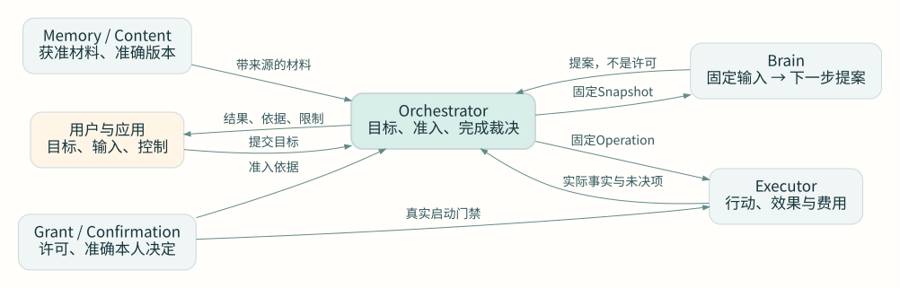

# Harness 技术设计

Harness 把用户目标推进为可核验的结果。Brain 提出下一步，Orchestrator 决定是否行动，Executor 记录实际效果。任务、授权和费用各有负责方。连接中断或进程更换后，系统沿原记录继续，不得把“不知道结果”当成“没有执行”。

生产从首版采用分布式部署。WSS 网关、应用服务、分类工作池和执行宿主分别运行；PostgreSQL 分片保存业务决定及后续工作，对象存储保存不可变内容。单进程装配只用于开发调试，不缩小生产目标。端侧组件可以在明确许可范围内离线处理有限工作。

本系列是目标设计与实现合同。初始参数是测试输入。容量、恢复和模型质量结论必须由运行证据建立；当前文档不得用作参考实现已生产可用的证明。

## 文档用途与约束用语

解释页说明职责、关系和取舍，入口是系统模型、数据总览、时序和研究依据。参考页给出字段、方法及状态的精确定义，入口是数据字典、模块接口表和协议合同。操作指南说明实现和验证顺序，入口是工程与验收章节。相关内容直接互链，不要求每个主题都另写四类文档。

技术规范采用本项目的中文约束约定：“必须／不得”表示强制要求或禁止事项；“建议／不建议”表示默认选择，偏离时必须说明影响；“可选”表示部署可以选择是否提供，提供后仍必须遵守该能力合同。规范字段表中的必填项和状态转换是强制要求；示例与初值不增加正文之外的要求。本文借鉴RFC要求等级思想，不采用其英文大写关键词的正式语义，也不宣称已经过ISO标准符合性评估。

本系列面向实现或评审Harness的开发者。读者应具备数据库事务、API调用和基本权限控制知识。先定位负责方和数据，再实现一条可恢复主线；不要从示意图直接推导部署已达标。

## 推荐阅读顺序

1. [系统边界与模块职责](system-model.md)：先确定系统负责什么，模块按哪些业务事实划分
2. [整体数据设计](data/README.md)：看对象、字段、关联、产生方式、写入/维护/删除责任和存储落位
3. [端到端流程与时序](workflows.md)：沿一个完整目标看输入、模型、行动、证据、交付和独立收尾
4. 各模块详细设计：按下面导航进入关键算法、接口成功点、异常与恢复
5. [部署与容量](production/README.md)、[工程落地](engineering/README.md)和[验证](validation/README.md)：检查实现顺序与生产证据

查字段看[核心字典](data/field-reference.md)和[模块内部字段](data/module-records.md)；评审数据库看[存储与一致性](data/storage.md)。实现接口时，先读[共同方法合同](protocol/method-contract.md)，再读对应模块的方法表、处理流程和异常恢复。追踪Requirement的来源，看[原输入到条件](data/requirement-lifecycle.md)。实施范围和仍需验证的条件见[开发准备度](engineering/implementation-readiness.md)。

## 职责怎样合作

图的结论：Orchestrator保存目标与裁决，Brain只提议，Executor保存真实效果；授权和来源贯穿这条链。可打开[原尺寸图](assets/architecture-overview.svg)查看；图源为同目录的architecture-overview.dot。

图中的框是逻辑职责，不是一框一个微服务。默认同分片保存 Task、条件、任务预算、任务控制和本地授权门禁。Brain、Memory、Executor 可独立替换或远程部署。跨库交接分别提交；同库需要共同裁决的记录使用一个短事务。

## 章节导航

| 章节 | 回答的问题 |
| --- | --- |
| [系统边界与职责](system-model.md) | 系统与外部依赖怎样划界，模块负责哪些事实 |
| [整体数据设计](data/README.md) | 字段、基数、数据来源、生命周期、归责、物理存储和一致性 |
| [端到端流程与时序](workflows.md) | 完整用户目标经过哪些提交和交接，中断后沿什么记录恢复 |
| [任务编排](orchestrator/README.md) | 怎样形成条件、准入行动、处理控制并提交成功 |
| [持久工作](runtime/README.md) | 回执丢失和工作者接替后，谁继续，怎样避免旧工作覆盖新责任 |
| [决策与上下文](brain/README.md) | 怎样给模型足够且合法的材料，怎样限制循环、计划和模型费用 |
| [执行与效果](execution/README.md) | API、文件和 GUI 怎样执行，未知效果何时可以重试 |
| [身份与授权](security/README.md) | 谁能决定什么，确认怎样一次消费，离线许可怎样失效 |
| [预算与结算](accounting/README.md) | 额度怎样预留、跨域分配、封账和追补真实费用 |
| [内容与记忆](memory/README.md) | 内容怎样发布、检索、纠正、限制和清理 |
| [应用交互](interaction/README.md) | 会话、输入、预览、表单和未来触发怎样接上业务事实 |
| [Agent 协作](collaboration/README.md) | 内外部委派怎样限定目标、控制、预算和关闭责任 |
| [扩展与发布](extensions/README.md) | 能力怎样安装、替换、就绪和回退 |
| [评测与改进](evaluation/README.md) | 怎样判断任务质量，怎样证明改进没有靠测试泄漏取巧 |
| [接口与传输](protocol/README.md) | 共同身份、消息、错误、订阅和 SDK 恢复怎样定义 |
| [生产运行](production/README.md) | 固定任务归属怎样落到分片、故障恢复和容量成本 |
| [工程实现](engineering/README.md) | 怎样组织代码，按什么顺序取得可运行证据 |
| [验收设计](validation/README.md) | 哪些反例能推翻设计，哪些指标必须实际测量 |
| [决策与研究依据](decisions-and-evidence.md) | 新增决策的前提、代价、ADR 关系和精确外部依据 |

## 两个值得动手看的问题

打开[架构解释工具](assets/design-lab.html)。这是无依赖的本地 HTML，直接用浏览器打开即可，不发送数据。

1. 在“回执丢失之后”逐步查看写入、取消和迟到效果。比较“查询原操作”与“换标识重试”，看第二次副作用为什么会出现
2. 在“故障后的容量”调整到达率、处理能力和故障比例。只要剩余处理率不高于新工作到达率，积压就不会收敛

工具只解释本文选定的模型，不模拟真实数据库、网络或供应商，也不替代故障实验。

## 设计边界

[项目目标](../harness-project-goals.md)规定 C1–C9、A1–A4 及联网问答、手机 GUI 两项专项验收。最终规模仍是千万注册、百万日活、十万同时在线；API 覆盖、首次正确率和有限重试成功率分别验收。现有[架构决策](../adr/0003-production-distributed.md)继续成立，本系列对缺口作出的新选择集中说明，未将建议伪装成已批准的新 ADR。

新实现以本系列的语义合同为准。协议发布前还须冻结同版 Schema、方法登记和 SDK；[核心 Schema 与示例](protocol/README.md#machine-contract)覆盖关键持久对象，并明确其机器校验范围。架构解释不依赖历史草稿或审阅记录。
